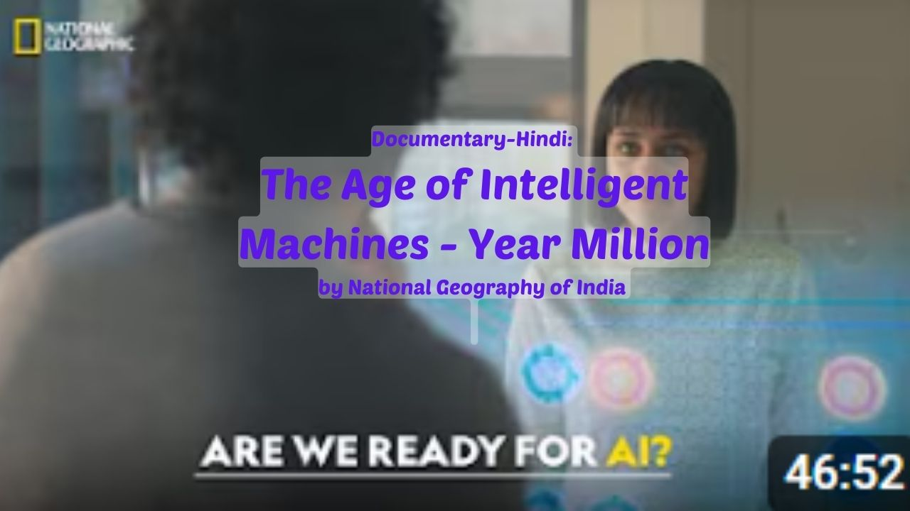

# Artificial Intelligence: The Future of Human Intelligence - Hindi
   
नेशनल ज्योग्राफिक पर ईयर मिलियन के इस सम्मोहक एपिसोड में आर्टिफिशियल इंटेलिजेंस के भविष्य को जानें। जानें कि कैसे न्यूरोसाइंस और इंजीनियरिंग में प्रगति हमें एक ऐसी दुनिया के करीब ला रही है जहाँ AI को मानव बुद्धि से अलग नहीं किया जा सकता। इन विकासों के संभावित लाभों और नैतिक चुनौतियों को देखें, जो हमें एक ऐसी वास्तविकता के लिए तैयार कर रहे हैं जो कभी विज्ञान कथाओं तक ही सीमित थी।

## आर्टिफिशियल इंटेलिजेंस: भविष्य का स्वरूप

### **मुख्य बिंदु:**
  
💡 **आर्टिफिशियल इंटेलिजेंस (AI) का विकास**:  
AI ने मानवता को तकनीकी क्षेत्र में नई ऊंचाइयों तक पहुंचाया है। भविष्य में, AI का उपयोग इंसानों के दिमाग को डिजिटाइज करने, नई क्षमताएं विकसित करने, और मानव सभ्यता के हर पहलू को बदलने के लिए किया जाएगा।  

💡 **डिजिटल इमोर्टलिटी**:  
भविष्य में, तकनीक के माध्यम से मानव दिमाग को डिजिटल रूप में संरक्षित किया जा सकता है। यह न केवल यादों को संरक्षित करेगा बल्कि इंसानों को डिजिटल यूनिवर्स में भी स्थानांतरित कर सकता है।  

💡 **AI के जोखिम और नैतिक प्रश्न**:  
AI का अत्यधिक विकास संभावित खतरों के साथ आता है, जैसे कि मशीनों का मानवता से आगे निकल जाना और निर्णय लेने की उनकी क्षमता। इसने नैतिक सवाल उठाए हैं, जैसे कि AI को इंसानों के समान अधिकार दिए जाने चाहिए या नहीं।  

💡 **सिंगुलेरिटी का आगमन**:  
सिंगुलेरिटी वह क्षण है जब AI इतना उन्नत हो जाएगा कि वह मानव बुद्धि से आगे निकल जाएगा। यह मानवता के लिए या तो नई संभावनाएं खोल सकता है या उसे अस्तित्व के संकट में डाल सकता है।  

💡 **क्रिएटिविटी और मानव अद्वितीयता**:  
हालांकि AI तेजी से उन्नति कर रहा है, मानव क्रिएटिविटी और कला का स्तर अभी भी उसका एक चुनौतीपूर्ण पहलू है। सवाल यह है कि क्या मशीनें वास्तव में इंसानों की तरह "सोच" सकती हैं।  

💡 **AI का व्यावसायिक प्रभाव**:  
AI न केवल मेहनती नौकरियों को स्वचालित करेगा बल्कि चिकित्सा, कानून, और इंजीनियरिंग जैसे क्षेत्रों में भी क्रांति लाएगा। इससे नौकरी के अवसरों का पुनर्वितरण और नौकरियों की प्रकृति में बदलाव आएगा।  

💡 **टेक्नोलॉजी और इंसान का एकीकरण**:  
भविष्य में, इंसान और मशीन के बीच की सीमाएं धुंधली हो सकती हैं। साइबोर्ग्स और न्यूरल इम्प्लांट्स के माध्यम से मानवता और AI का पूर्ण एकीकरण संभव हो सकता है।  

💡 **डिजिटल सिग्नल के रूप में मानवता**:  
भविष्य में, मानवता का अस्तित्व डिजिटल सिग्नल के रूप में हो सकता है, जहां हमारी चेतना एक विशाल सुपरकंप्यूटर में संरक्षित होगी।  

💡 **AI के लिए नैतिक मार्गदर्शन**:  
AI को मानवता का बेहतर सहयोगी बनाने के लिए हमें इसे नैतिक रूप से विकसित करना होगा। AI का उद्देश्य इंसानों के लिए काम करना होना चाहिए, न कि उनके खिलाफ।  

💡 **विकास का अंतिम लक्ष्य**:  
AI का सबसे बड़ा योगदान मानवता को नई ऊंचाइयों पर ले जाना है। यह हमें अपनी क्षमताओं को बढ़ाने और जीवन के अधिक रचनात्मक और उत्पादक पहलुओं पर ध्यान केंद्रित करने में मदद करेगा।  

### **निष्कर्ष**:
AI न केवल मानव जीवन को सरल और उन्नत बनाएगा बल्कि यह हमें नए नैतिक और अस्तित्वगत प्रश्नों का सामना करने के लिए भी प्रेरित करेगा। यह मानवता के भविष्य का एक अविभाज्य हिस्सा बन चुका है, और इसे जिम्मेदारी से विकसित करना हमारी सबसे बड़ी प्राथमिकता होनी चाहिए।

[Full Video](https://www.youtube.com/watch?v=EbsMMP7x6TQ)