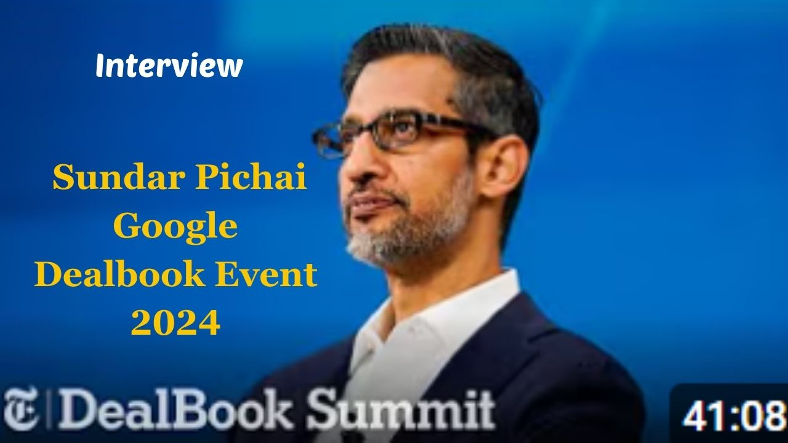

# Key Themes and Ideas from Interview with Sundar Pichai @ Google at Dealbook Event 2024   
These themes illustrate Google’s strategies, challenges, and aspirations under Sundar Pichai's leadership, with a strong focus on advancing AI responsibly. 

## **Theme 1: Leadership in AI and Innovation**  
**✨ AI Leadership**: Sundar highlights Google's extensive investment in AI, including foundational research, infrastructure, and product integration, ensuring it remains at the forefront of innovation.  
**✨ Balancing Progress and Caution**: While optimistic about AI’s potential, Sundar emphasizes the need for responsible development to ensure societal benefits.  
**✨ Staying Ahead**: Despite intense competition from players like OpenAI and Microsoft, Sundar believes Google's AI stack and comprehensive ecosystem position it as a long-term leader.  

---

## **Theme 2: The Future of Search**  
**🔍 Evolution of Search**: AI-driven advancements like Gemini are poised to redefine search, making it more intuitive and capable of answering complex questions.  
**🔍 Tackling Challenges**: As AI-generated content floods the web, Sundar argues that search engines like Google become more critical in sifting reliable, high-quality information.  
**🔍 Innovator’s Dilemma**: Sundar affirms Google’s willingness to disrupt itself to stay relevant, leaning heavily into AI despite risks to its lucrative search business.  

---

## **Theme 3: Google’s Competition**  
**🏢 Dynamic Ecosystem**: Sundar identifies a competitive landscape with OpenAI, Meta, Microsoft, and emerging players like xAI, stressing that innovation must come from algorithmic breakthroughs, not just hardware.  
**🏢 Waymo’s Success**: Google’s autonomous vehicle division has made substantial strides, with Waymo now offering 175,000 autonomous rides per week, showcasing execution strength.  

---

## **Theme 4: AI’s Societal Impact**  
**🤖 AI and Employment**: Sundar sees AI as expanding opportunities by making programming more accessible and increasing engineer productivity.  
**🤖 Ethical Use**: Google emphasizes tools for creators and licensing models to ensure fair value for content used in AI training.  
**🤖 Regulation Outlook**: Sundar supports thoughtful regulation specific to use cases, like combating deep fakes and ensuring transparency in AI-generated content.  

---

## **Theme 5: Culture and Leadership at Google**  
**🌱 Mission-Focused Culture**: Sundar has shifted Google's culture to prioritize mission-driven work over personal platforms, aligning employees with the company’s goals.  
**🌱 Employee Dynamics**: While valuing employee input, Sundar notes a balance between fostering creativity and maintaining focus on impactful work.  

---

## **Theme 6: Antitrust and Regulation**  
**⚖️ Legal Challenges**: Google faces significant scrutiny for alleged monopolistic practices, but Sundar remains confident, emphasizing Google’s consumer-first innovation and competition.  
**⚖️ Policy Advocacy**: Sundar highlights the importance of U.S. technological competitiveness, suggesting collaboration with regulators to ensure progress in AI and infrastructure.  

---

## **Theme 7: Future Vision for Google**  
**🌐 AI First**: Sundar envisions Google as a deeply AI-integrated company, applying advancements across search, YouTube, Cloud, and other domains.  
**🌐 New Revenue Streams**: Diversifying into areas like autonomous vehicles (Waymo) and leveraging AI innovations, Google is preparing for an era beyond traditional search dominance.  

---

## **Theme 8: Personal Leadership Style**  
**💡 Balanced Leadership**: Sundar counters critiques of being “too soft” by pointing to execution successes like Waymo and AI integration, reflecting his deliberate and measured approach.  
**💡 Visionary Thinking**: With a decade of focus on AI-first strategies, Sundar emphasizes long-term technological leadership over short-term wins.  

---

## **Theme 9: AI and Content Value**  
**📜 Licensing Models**: Google is actively licensing data for AI, suggesting a shift toward recognizing content creators in the AI economy.  
**📜 Economic Models for AI**: Sundar foresees a marketplace for AI-generated content, with creators monetizing their intellectual contributions in innovative ways.  

---

## **Theme 10: Reflections on AI’s Potential and Risks**  
**🌟 Optimism with Caution**: Sundar remains optimistic about AI’s transformative power, citing breakthroughs in health (e.g., AlphaFold) while acknowledging the need to address societal concerns like bias and misinformation.  
**🌟 Proactive Engagement**: Google continues to lead discussions with policymakers worldwide, advocating for frameworks that balance innovation with ethical considerations.  

---

[Youtube full interview - Google C.E.O. Sundar Pichai sits down with Andrew Ross Sorkin at the 2024 New York Times DealBook Summit](https://www.youtube.com/watch?v=OsxwBmp3iFU)

**Building the Future: Sundar Pichai on A.I., Regulation and What’s Next for Google**
