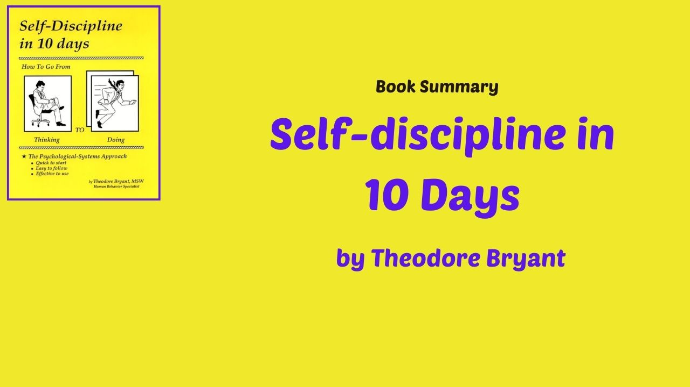

          

# Self discipline in 10 Days
   
10 Lessons from the book "Self-discipline in 10 Days: How to Go from Thinking to Doing" by Theodore Bryant   
   
1. Self-discipline is the bridge between goals and accomplishments.
2. Motivation gets you started, but self-discipline keeps you going.
3. Success is not just about setting goals, but about the daily disciplined actions to achieve them.
4. Self-discipline is the key to breaking bad habits and creating positive new ones.
5. Don't wait for the perfect moment; take action now and let self-discipline be your guide.
6. Delayed gratification is the foundation of self-discipline - sacrificing short-term pleasure for long-term success.
7. Self-discipline is not a punishment, but a way to empower yourself and take control of your life.
8. Focus on progress, not perfection - small consistent steps towards your goals will lead to significant results.
9. Don't let excuses or procrastination derail you from your journey to self-discipline - choose discipline over regret.
10. Self-discipline is a habit that can be cultivated - practice it daily and watch your life transform.