# Welcome to Book/Interview/Documentary/Movie summary blog! 

I've always believed that books are the best way to learn new things and expand your horizons. This blog is a collection of summaries of books that I've found particularly interesting and useful. I hope you find something here that inspires you to read more. I also have added summary of documentaries, movies and interviews with Technocrats, Innovators and Entrepreneurs.

- 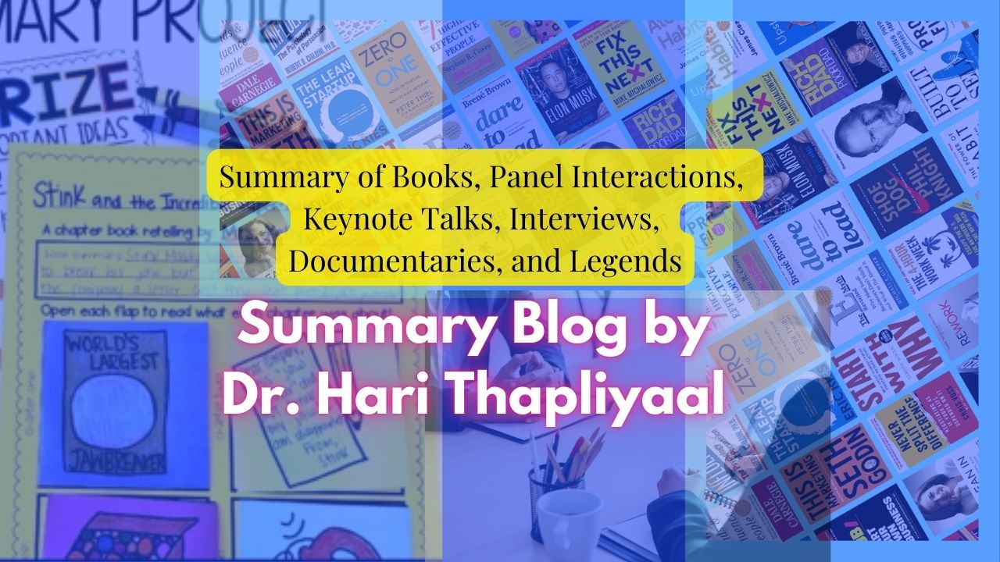{ width="200" }

    ### [Dr. Jaishankar Interview with South Korean Diplomat at @HT 27-Mar-2025 Summary and Analysis](Dr.Jaishankar-Interview-with-Ambassador-Kang-Mar-2025.md)
    
    **Read time:** 10 min
    
    Summary and analysis of Dr. Jaishankar's interview with the South Korean Diplomat Ms. Kang at Hindustan Times Leadership Summit 2025 on India-South Ko

- { width="200" }

    ### [Nandan Nilekani Raisina 2025 Talk Summary and Analysis](Nandan-Nilekani-at-Raisina-2025.md)
    
    **Read time:** 5 min
    
    Summary and analysis of Nandan Nilekani's talk at Raisina 2025 on India's growth, Aadhaar ID, Digital India, and development.
    

- { width="200" }

    ### [The Odyssey by Homer Book Summary and Analysis](The-Odyssey-by-Homer.md)
    
    **Read time:** 5 min
    
    Book summary and analysis of The Odyssey by Homer, an epic poem from ancient Greece that explores human resilience, wisdom, and the longing for home.

- { width="200" }

    ### [The Iliad by Homer - Epic Poem Summary](The-Iliad-by-Homer.md)
    
    **Read time:** 5 min
    
    Summary of The Iliad, a long epic poem written by Homer, an ancient Greek poet. The Iliad is a classic piece of literature from the 8th century BCE, w
    

- { width="200" }

    ### [Alice's Adventures in Wonderland by Lewis Carroll](Alice-in-Wonderland.md)
    
    **Read time:** 5 min
    
    Summary of Lewis Carroll's novel Alice's Adventures in Wonderland, a fantasy novel that satirizes the Victorian era with its absurdity and illogical e

- { width="200" }

    ### [Lessons from Pride and Prejudice by Jane Austen](Pride-and-Prejudice.md)
    
    **Read time:** 5 min
    
    Pride and Prejudice by Jane Austen is about self-growth, overcoming misunderstandings, and finding love through respect and honesty. It’s a timeless s
    

- 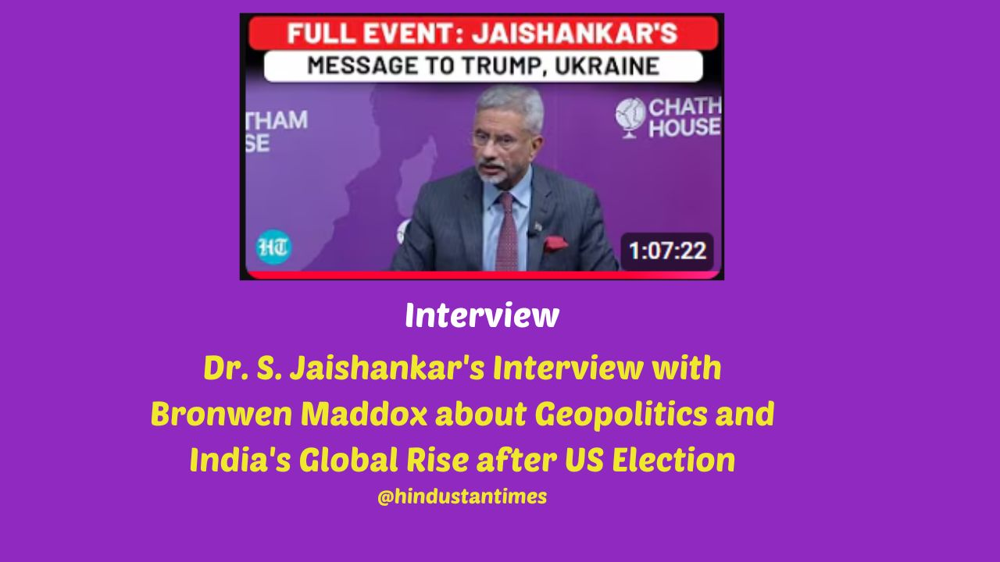{ width="200" }

    ### [Dr. Jaishankar's Interview with HT after US Election](Dr-Jaishankdar-Interview-with-HT-after-US-Election.md)
    
    **Read time:** 10 min
    
    Dr. S. Jaishankar's Interview with Bronwen Maddox about Geopolitics and India's Global Rise after US Election

- 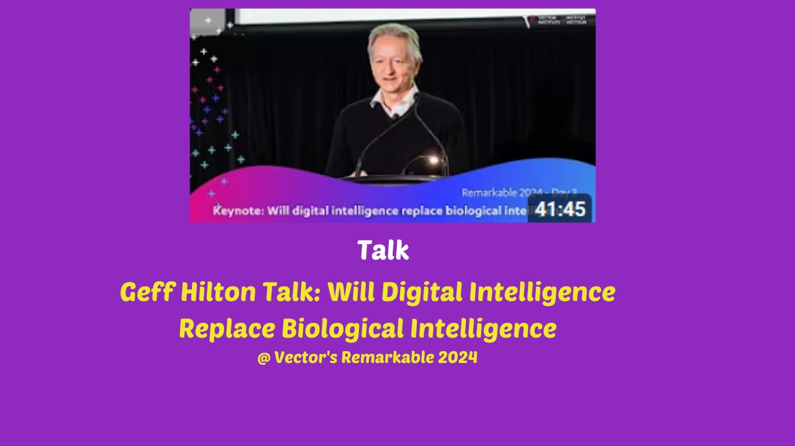{ width="200" }

    ### [Geff Hilton Talk: Will Digital Intelligence Replace Biological Intelligence?](Geff-Hilton-Talk-Will-Digital-Intelligence-Replace-Biological-Intelligence.md)
    
    **Read time:** 7 min
    
    Jeff Hinton, introduces several key concepts in his talk, primarily focusing on the implications of artificial intelligence (AI) and its evolving capa
    

- 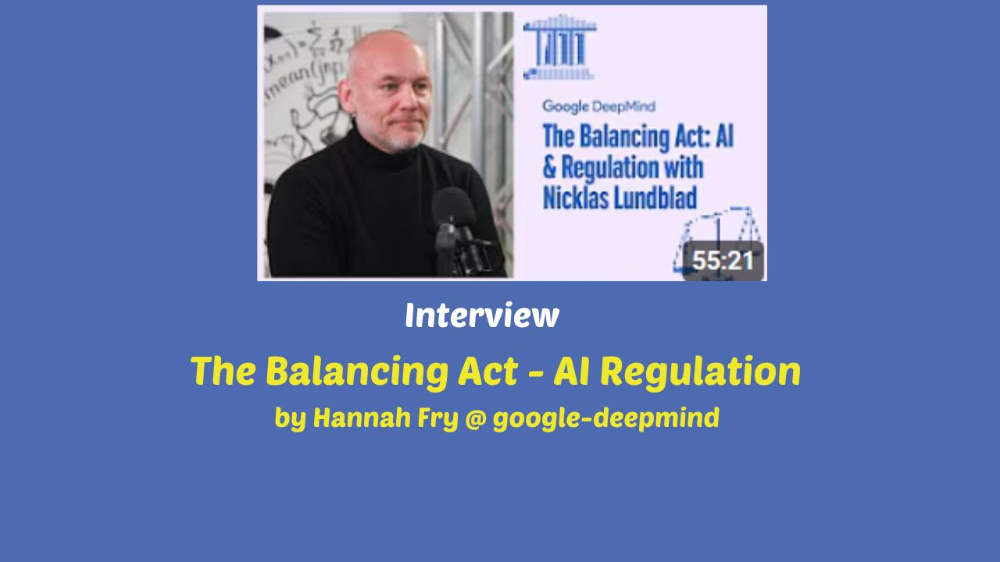{ width="200" }

    ### [The Balancing Act - AI Regulation](The-Balancing-Act-AI-Regulation.md)
    
    **Read time:** 9 min
    
    Interview Questions for Nicklas Lundblad by Professor Hannah Fry

- 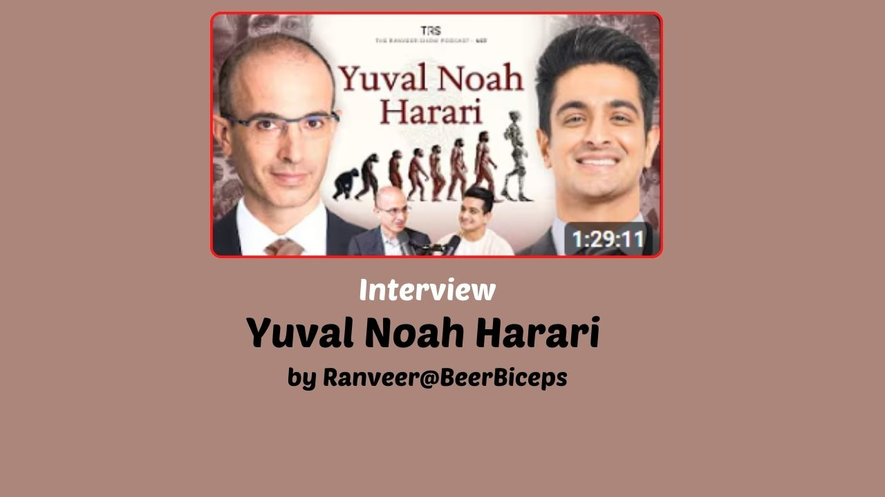{ width="200" }

    ### [Interview: Yuval Noah Harari with BeerBiceps](Interview-Yuval-Noah-Harari-with-BeerBiceps.md)
    
    **Read time:** 10 min
    
    Interview Questions for Yuval Noah Harari by BeerBiceps. And My Critiques on the responses of Yuval Noah Harari
    

- 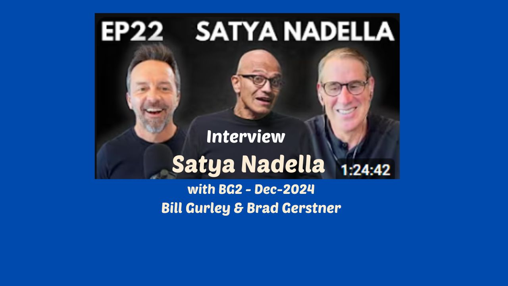{ width="200" }

    ### [Interview: Satya Nadella with BG2 - Dec-2024](Interview-Satya-Nadella-with-BG2-Dec-2024.md)
    
    **Read time:** 13 min
    
    Interview Questions for Satya Nadella by BG2, Dec-2024. 

- 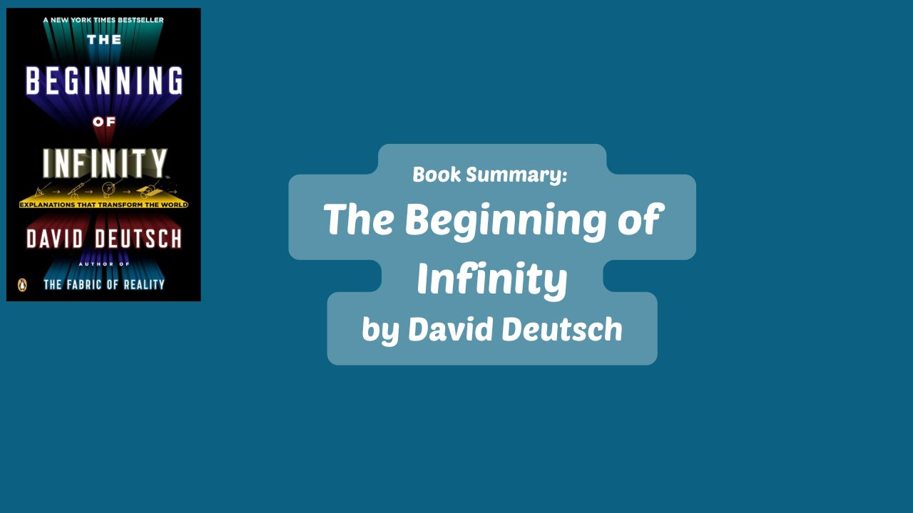{ width="200" }

    ### [The Beginning of Infinity](The-Beginning-of-Infinity.md)
    
    **Read time:** 5 min
    
    A summary of 'The Beginning of Infinity' in 18 key points. 
    

- 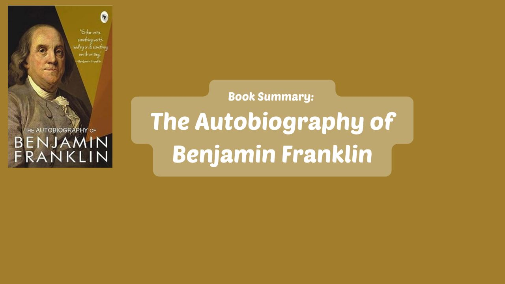{ width="200" }

    ### [The Autobiography of Benjamin Franklin](The-Autobiography-of-Benjamin-Franklin.md)
    
    **Read time:** 5 min
    
    A summary of 'The Autobiography of Benjamin Franklin' in 11 key points. 

- 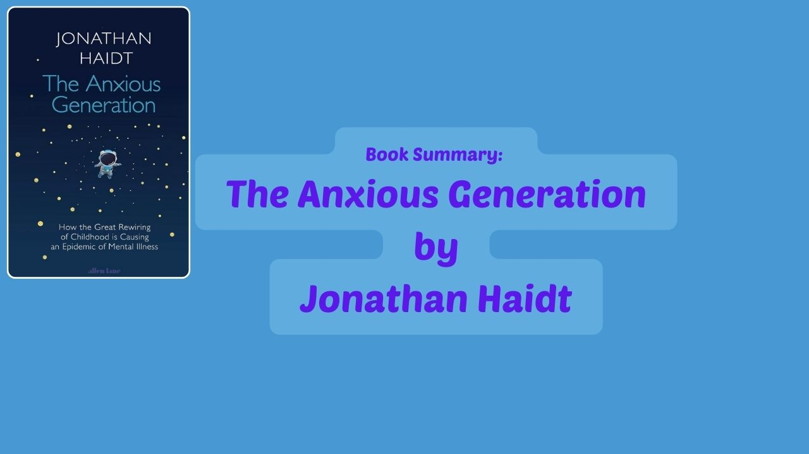{ width="200" }

    ### [The Anxious Generation](The-Anxious-Generation.md)
    
    **Read time:** 5 min
    
    A summary of 'The Anxious Generation: How The Great Rewiring of Childhood Is Causing an Epidemic of Mental Illness' in 11 key points. 
    

- 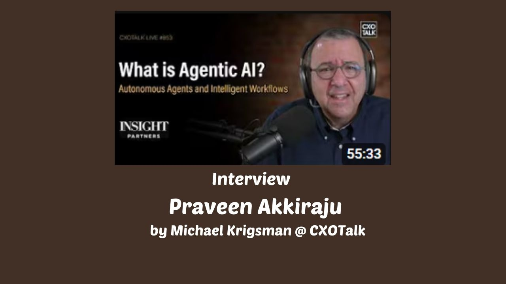{ width="200" }

    ### [What is Agentic AI? Interview with Praveen Akkiraju at CXOTalk](Interview-What-is-Agentic-AI-Interview-Praveen-Akkiraji-at-CXOTalk.md)
    
    **Read time:** 5 min
    
    A summary of the interview between Praveen Akkiraju and Michael Krigsman on CXOTalk, discussing Agentic AI, its current state, and its potential futur

- 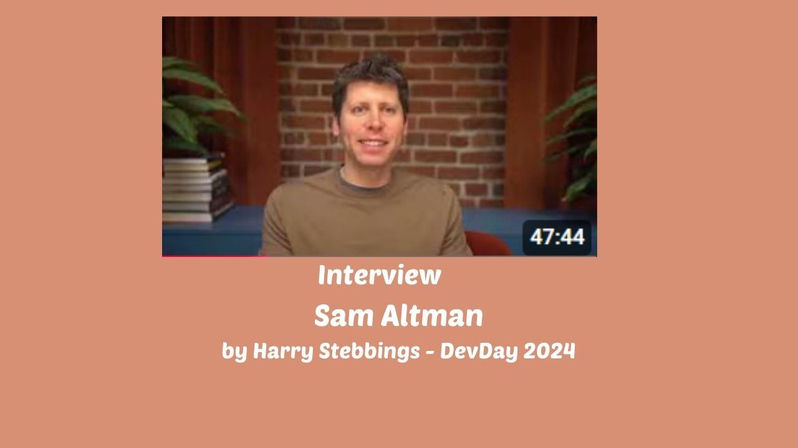{ width="200" }

    ### [Interview - Virtual AMA with Sam Altman by Harry Stebbings - DevDay 2024](Interview-Virtual-AMA-with-SamAltma-by-Harry-Stebbings-DevDay2024.md)
    
    **Read time:** 6 min
    
    A summary of the key points discussed between Sam Altman, CEO of OpenAI, and Harry Stebbings, on DevDay2024. The chat includes a wide range of topics 
    

- 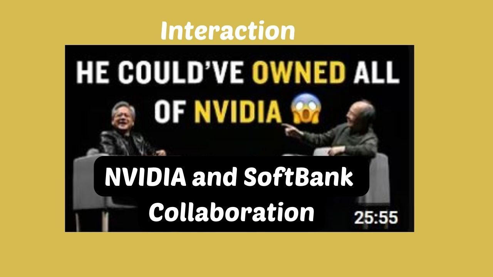{ width="200" }

    ### [Interaction: Jenson Huang and Masayoshi Son Interaction](Interaction-Jenson-Masayoshi-Interaction-2024.md)
    
    **Read time:** 5 min
    
    A summary of the key points discussed between Jensen Huang, CEO of NVIDIA, and Masayoshi Son, CEO of SoftBank, regarding their collaboration on AI tec

- 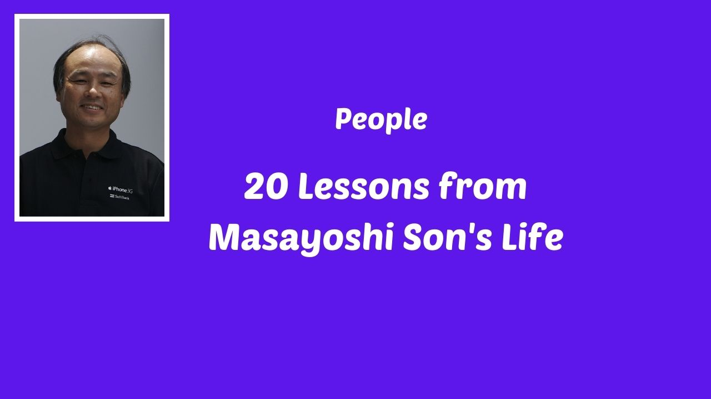{ width="200" }

    ### [People: Lessons from Masayoshi Son's Life](People-Masayoshi-Son.md)
    
    **Read time:** 5 min
    
    A summary of the key lessons from Masayoshi Son's life, highlighting his entrepreneurial spirit, innovative approach, and inspiring journey. 
    

- 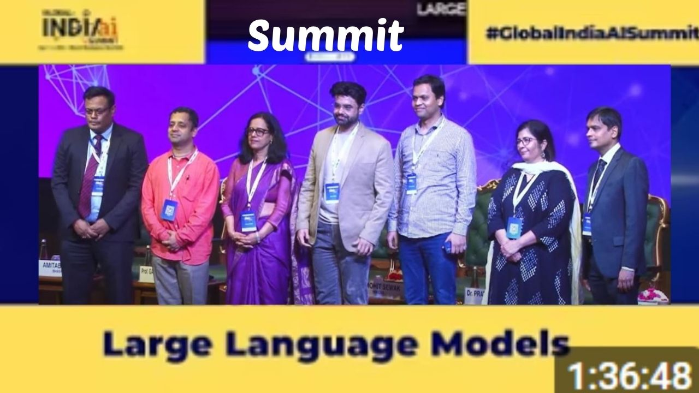{ width="200" }

    ### [Panel Discussion: Global India AI Summit 2024: Large Language Models by IndiaAI](Panel-Discussion-Global-IndiaAI-Summit-2024-LLM-by-IndiaAI.md)
    
    **Read time:** 5 min
    
    A summary of the panel discussion on Large Language Models in the Global India AI Summit 2024, highlighting the key themes and ideas around AI and its

- 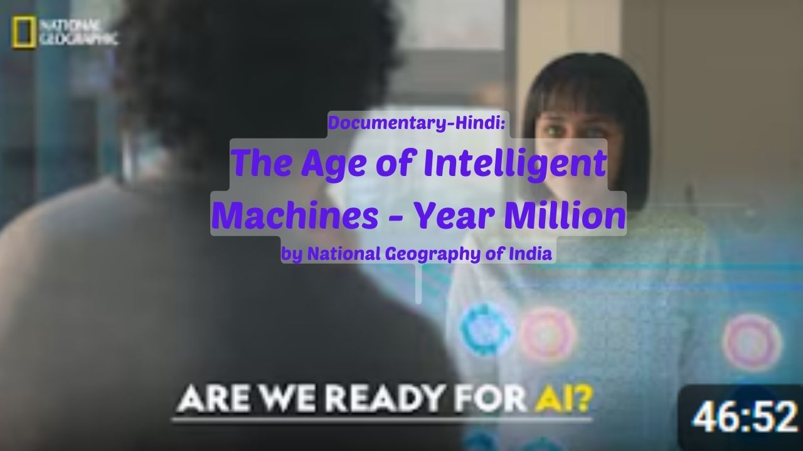{ width="200" }

    ### [Documentary-Hindi: NGI - The Age of Intelligent Machines - Year Million](Documentary-NGI-The-Age-of-Intelligent-Machines-Year-Million.md)
    
    **Read time:** 5 min
    
    A summary of the documentary The Age of Intelligent Machines - Year Million, highlighting the key themes and ideas around AI and its impact on society
    

- 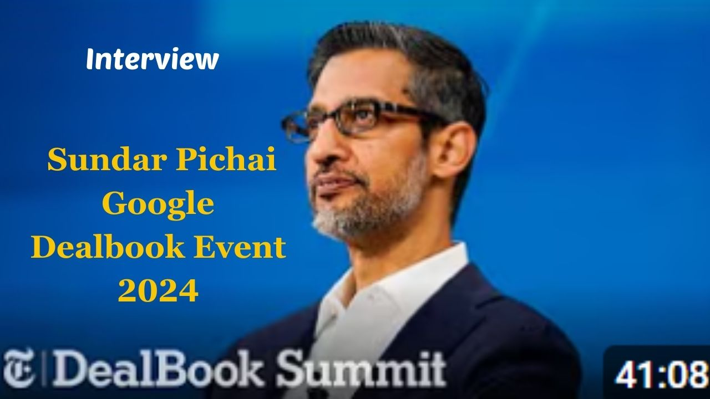{ width="200" }

    ### [Interview with Sundar Pichai @ Google at Dealbook Event 2024](Interview-Suder-Pichai-Google-Dealbook-Event-2024.md)
    
    **Read time:** 5 min
    
    Key themes and ideas from Sundar Pichai's interview at the Google Dealbook Event 2024, highlighting Google’s strategies, challenges, and aspirations i

- 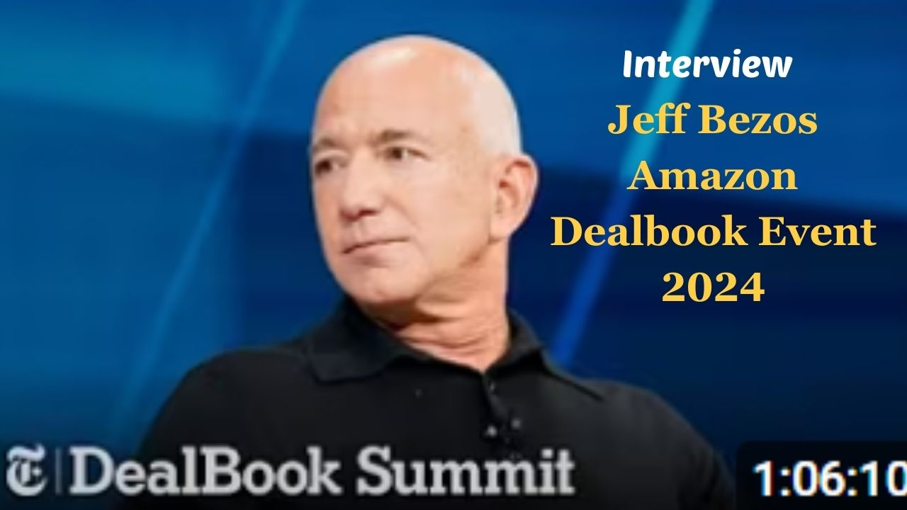{ width="200" }

    ### [Interview with Jeff Bezos @ Amazon, at Dealbook Event 2024](Interview-Jeff-Bezos-Amazon-Dealbook-Event-2024.md)
    
    **Read time:** 5 min
    
    Insights from the interview with Jeff Bezos, Amazon, at Dealbook Event 2024
    

- 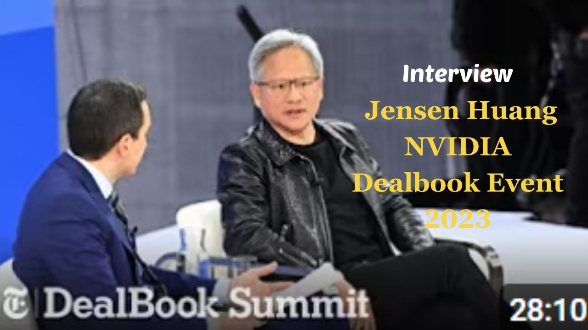{ width="200" }

    ### [Interview with Jensen Huang @ NVIDIA at Dealbook Event 2023](Interview-Jensen-Huang-NVIDIA-Dealbook-Event-2023.md)
    
    **Read time:** 5 min
    
    Key themes and ideas from Jensen Huang's interview at the Dealbook Event 2023.

- 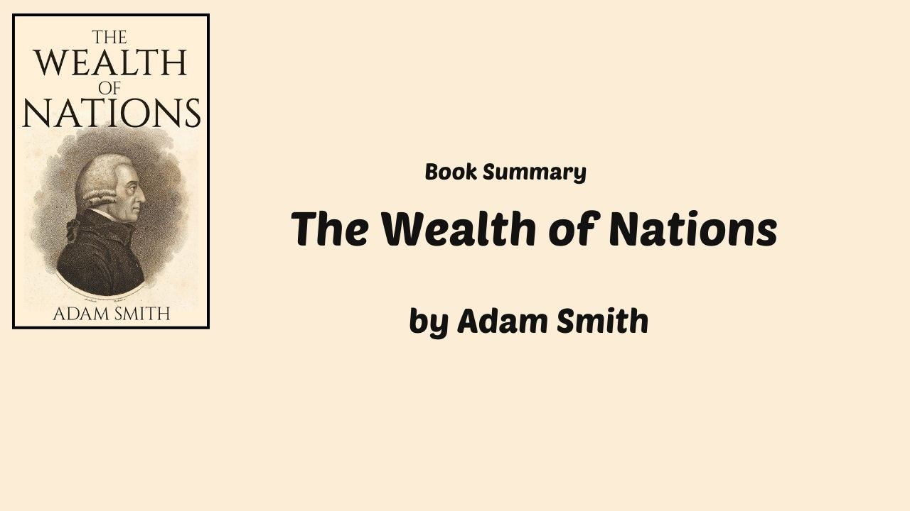{ width="200" }

    ### [Book Summary: The Wealth of Nations](Wealth-of-Nations.md)
    
    **Read time:** 5 min
    
    EXCERPT Not Found
    

- 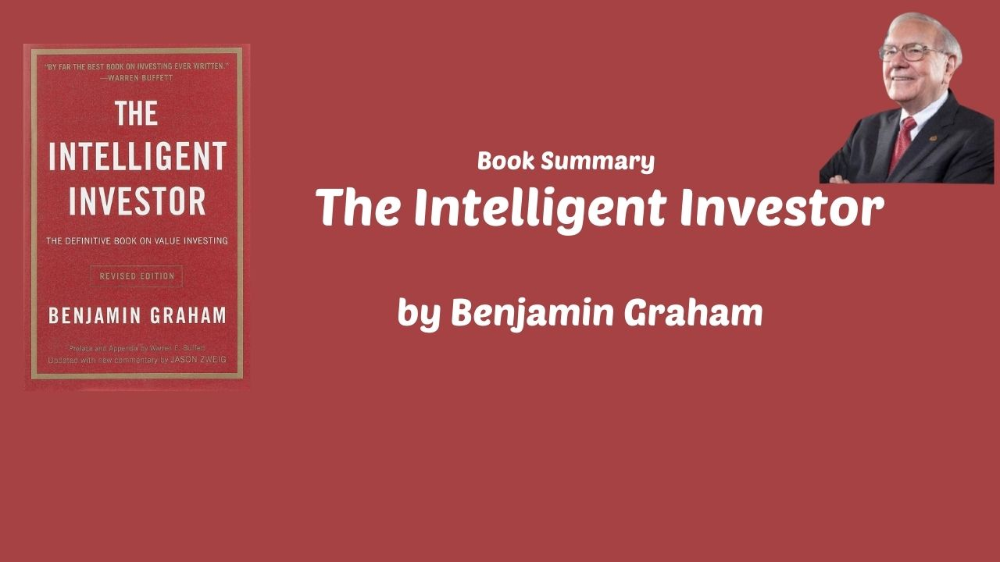{ width="200" }

    ### [Book Summary: The Intelligent Investor](The-Intelligent-Investor.md)
    
    **Read time:** 5 min
    
    EXCERPT Not Found

- 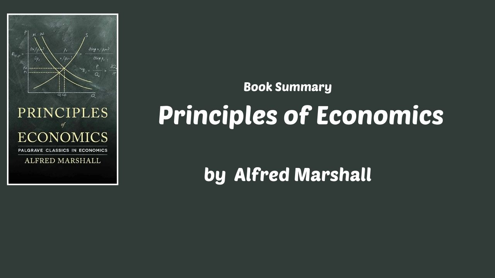{ width="200" }

    ### [Book Summary: Principles of Economics](Principles-of-Economics.md)
    
    **Read time:** 5 min
    
    EXCERPT Not Found
    

- 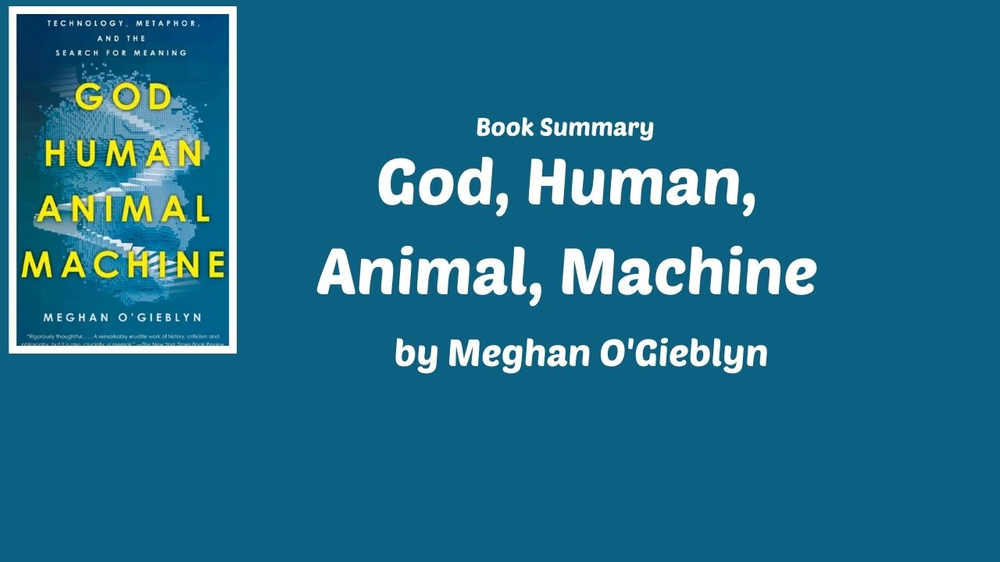{ width="200" }

    ### [Book Summary: God, Human, Animal, Machine: Technology, Metaphor, and the Search for Meaning](God-Human,-Animal-Machine.md)
    
    **Read time:** 5 min
    
    EXCERPT Not Found

- 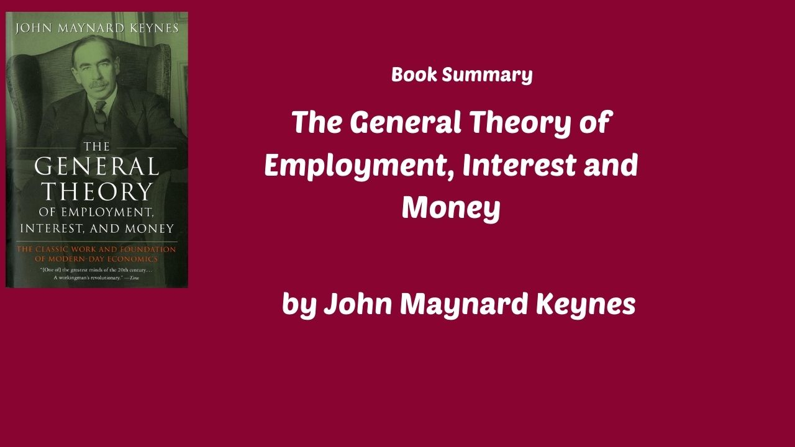{ width="200" }

    ### [Book Summary: General Theory of Employment, Interest and Money](General-Theory-of-Employment-Interest-Money.md)
    
    **Read time:** 5 min
    
    EXCERPT Not Found
    

- 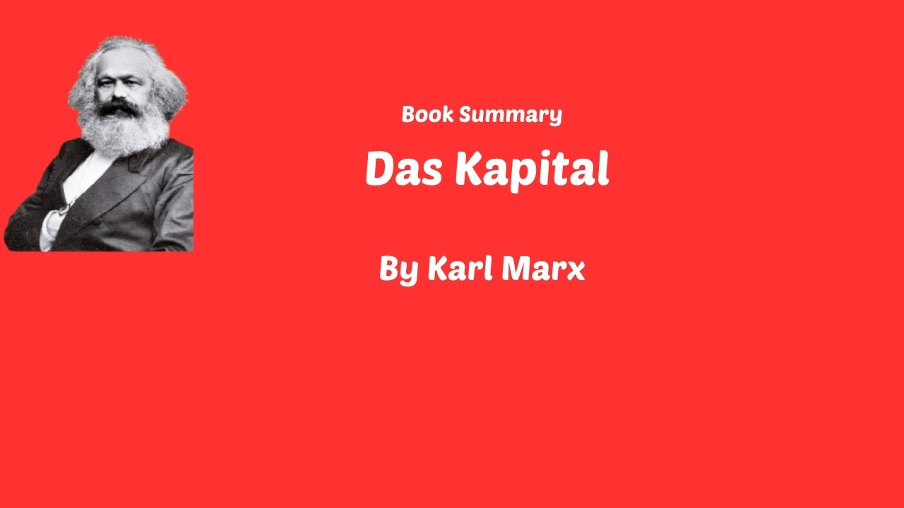{ width="200" }

    ### [Book Summary: Das Kapital](das-kapital.md)
    
    **Read time:** 5 min
    
    EXCERPT Not Found

- 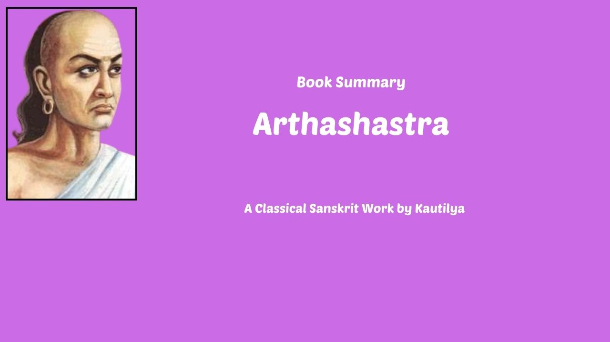{ width="200" }

    ### [Book Summary: Arthashastra of Kautilya](Arthashastra.md)
    
    **Read time:** 5 min
    
    EXCERPT Not Found
    

- 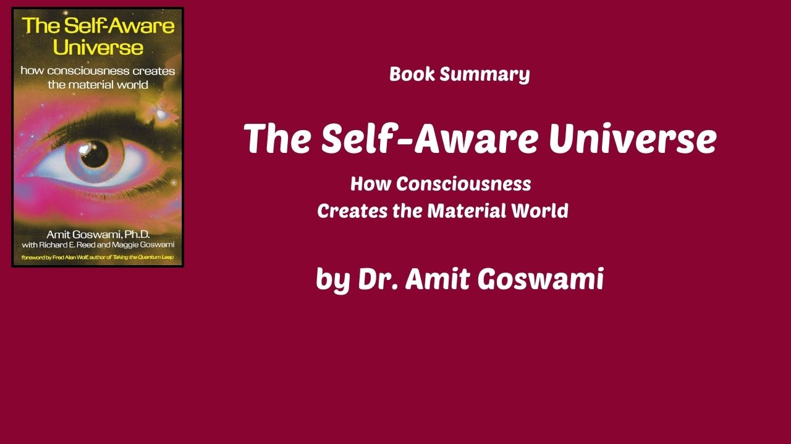{ width="200" }

    ### [Book Summary: The Self Aware Universe](The-Self-Aware-Universe.md)
    
    **Read time:** 5 min
    
    EXCERPT Not Found

- 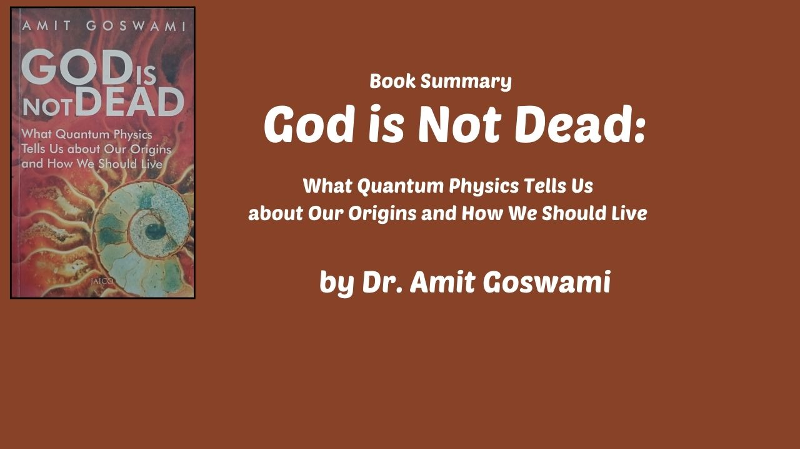{ width="200" }

    ### [Book Summary: God is Not Dead](God-is-not-Dead.md)
    
    **Read time:** 5 min
    
    EXCERPT Not Found
    

- 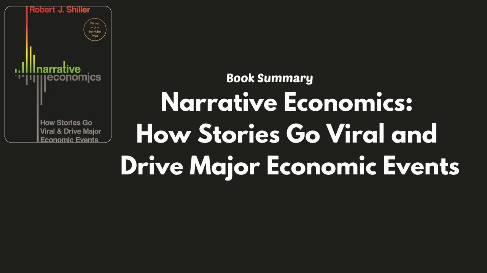{ width="200" }

    ### [Book Summary: Narrative Economics](Narrative-Economics.md)
    
    **Read time:** 8 min
    
    EXCERPT Not Found

- 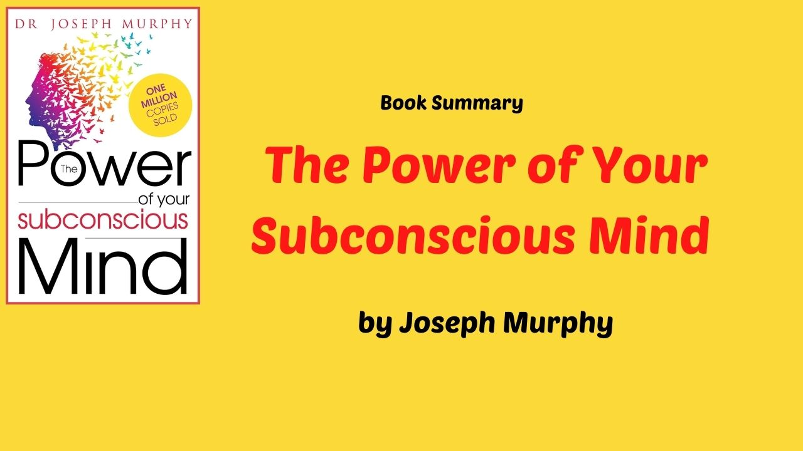{ width="200" }

    ### [Book Summary: The Power of Your Subconscious Mind](The-Power-of-Your-Subconscious-Mind.md)
    
    **Read time:** 5 min
    
    EXCERPT Not Found
    

- 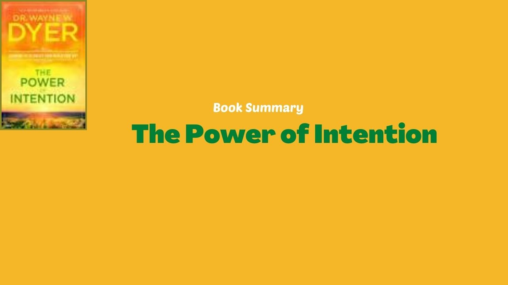{ width="200" }

    ### [Book Summary : The Power of Intention](The-Power-of-Intention.md)
    
    **Read time:** 5 min
    
    EXCERPT Not Found

- 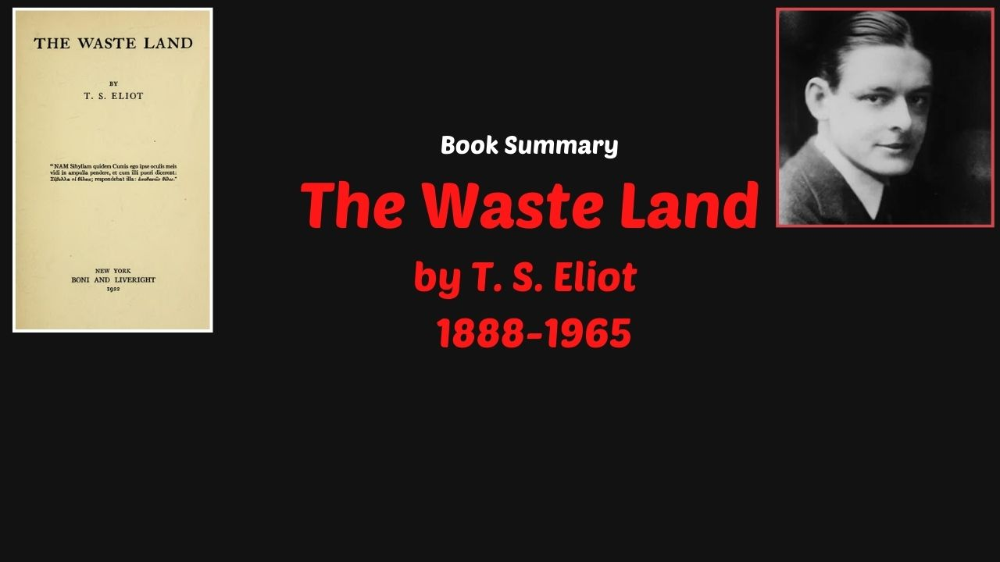{ width="200" }

    ### [The Waste Land](The-Waste-Land.md)
    
    **Read time:** 17 min
    
    EXCERPT Not Found
    

- 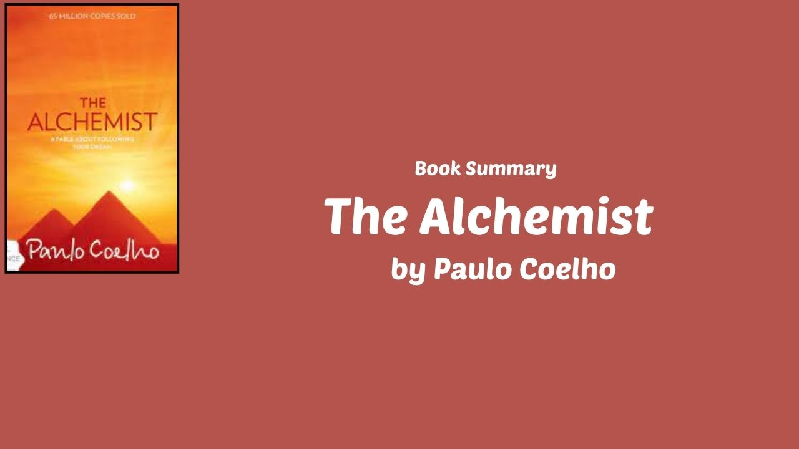{ width="200" }

    ### [Book Summary: The Alchemist by Paulo Coelho](The-Alchemist-by-Paulo-Coelho.md)
    
    **Read time:** 5 min
    
    EXCERPT Not Found

- { width="200" }

    ### [Book Summary: The Power of Your Subconscious Mind](The-Power-of-Your-Subconscious-Mind.md)
    
    **Read time:** 5 min
    
    EXCERPT Not Found
    

- 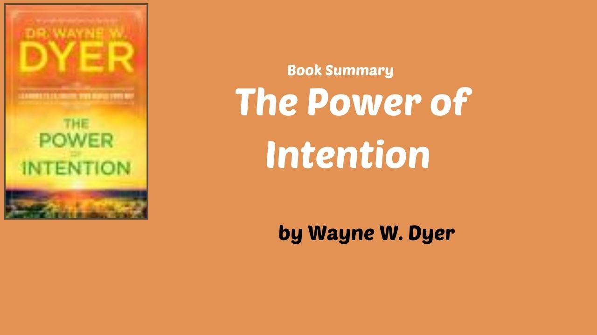{ width="200" }

    ### [Book Summary: The Power of Intention by Wayne Dyer](The-Power-of-Intention-by-Wayne-Dyer.md)
    
    **Read time:** 5 min
    
    EXCERPT Not Found

- 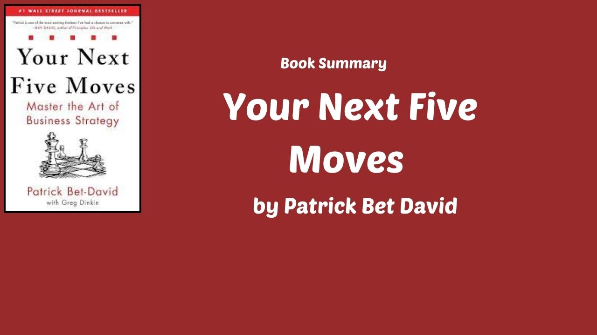{ width="200" }

    ### [Book Summary: Your Next Five Moves by Patrick Bet David](Your-Next-Five-Moves-by-Patrick-Bet-David.md)
    
    **Read time:** 5 min
    
    EXCERPT Not Found
    

- 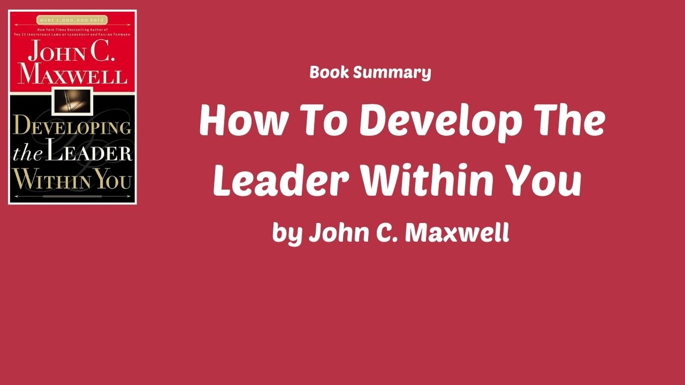{ width="200" }

    ### [Book Summary: How To Develop The Leader Within You by John Maxwell](How-To-Develop-The-Leader-Within-You-by-John-Maxwell.md)
    
    **Read time:** 5 min
    
    EXCERPT Not Found

- 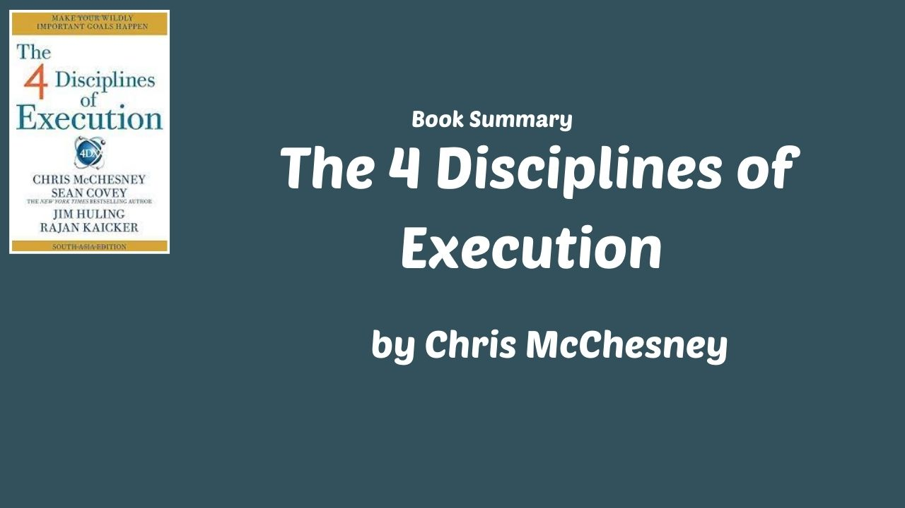{ width="200" }

    ### [Book Summary: The 4 Disciplines of Execution by Chris McChesney](The-4-Disciplines-of-Execution-by-Chris-McChesney.md)
    
    **Read time:** 5 min
    
    EXCERPT Not Found
    

- 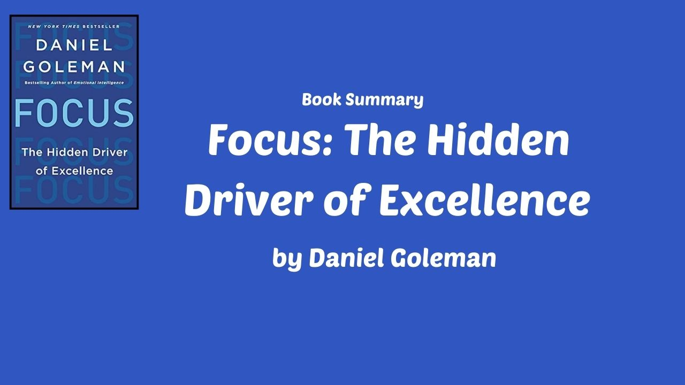{ width="200" }

    ### [Book Summary: Focus The Hidden Driver of Excellence by Daniel Goleman](Focus-The-Hidden-Driver-of-Excellence-by-Daniel-Goleman.md)
    
    **Read time:** 5 min
    
    EXCERPT Not Found

- 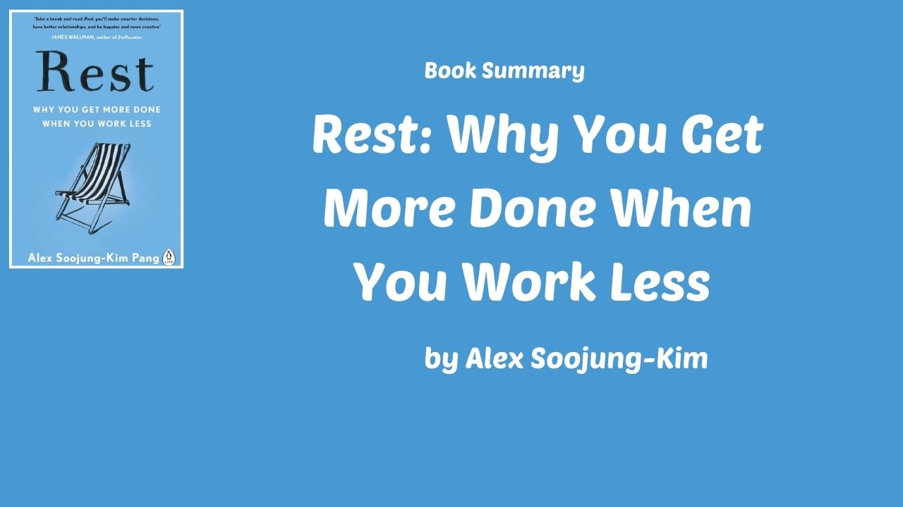{ width="200" }

    ### [Book Summary: Rest : Why You Get More Done When You Work Less by Alex](Rest-Why-You-Get-More-Done-When-You-Work-Less-by-Alex.md)
    
    **Read time:** 5 min
    
    EXCERPT Not Found
    

- 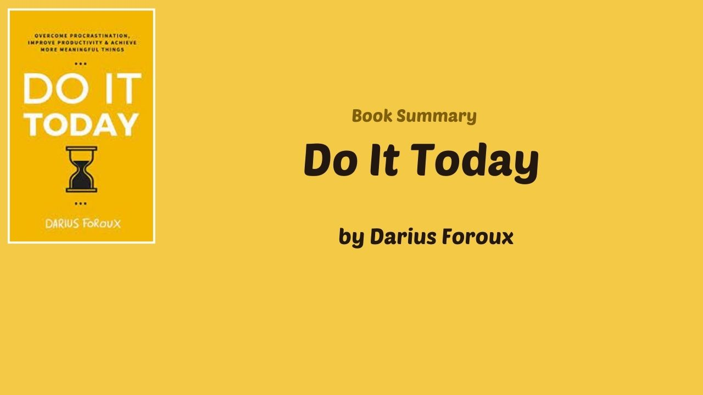{ width="200" }

    ### [Book Summary: Do It Today by Darius Foroux](Do-It-Today-by-Darius-Foroux.md)
    
    **Read time:** 5 min
    
    EXCERPT Not Found

- 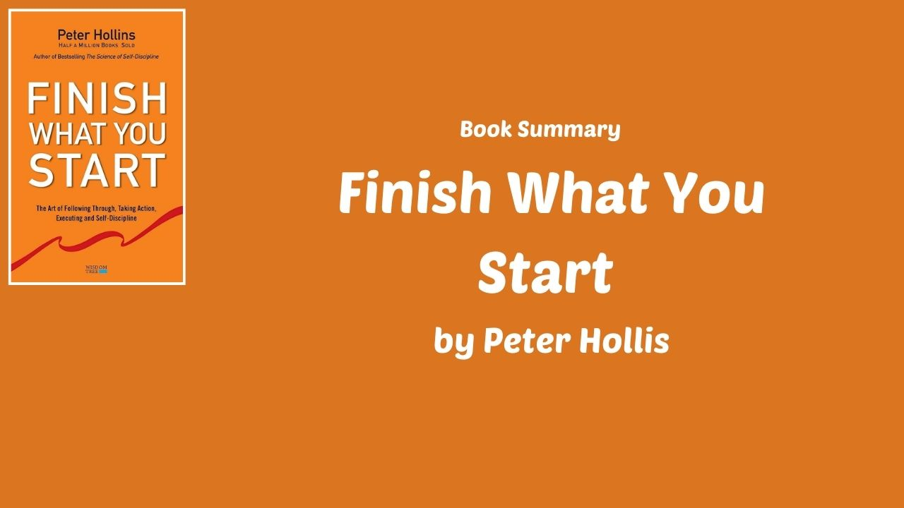{ width="200" }

    ### [Book Summary: Finish What You Start by Peter Hollis](Finish-What-You-Start-by-Peter-Hollis.md)
    
    **Read time:** 5 min
    
    EXCERPT Not Found
    

- 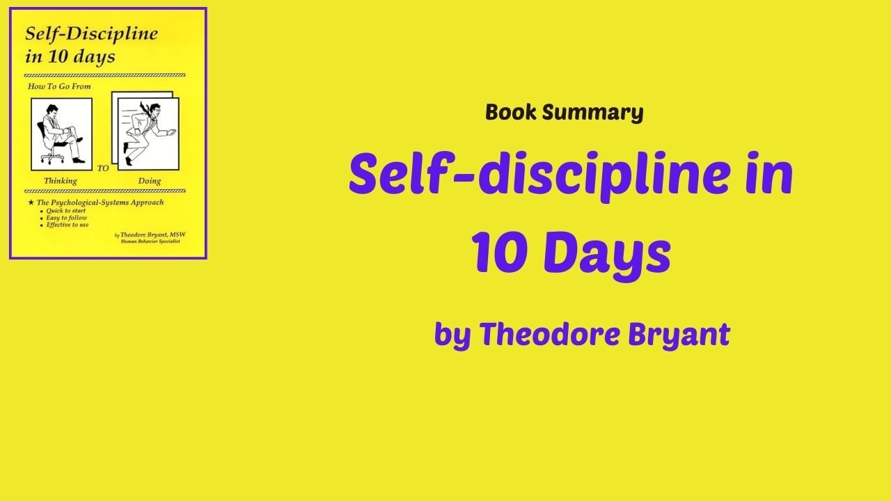{ width="200" }

    ### [Book Summary: Self discipline in 10 Days by Theodore Bryant](Self-discipline-in-10-Days-by-Theodore-Bryant.md)
    
    **Read time:** 5 min
    
    EXCERPT Not Found

- 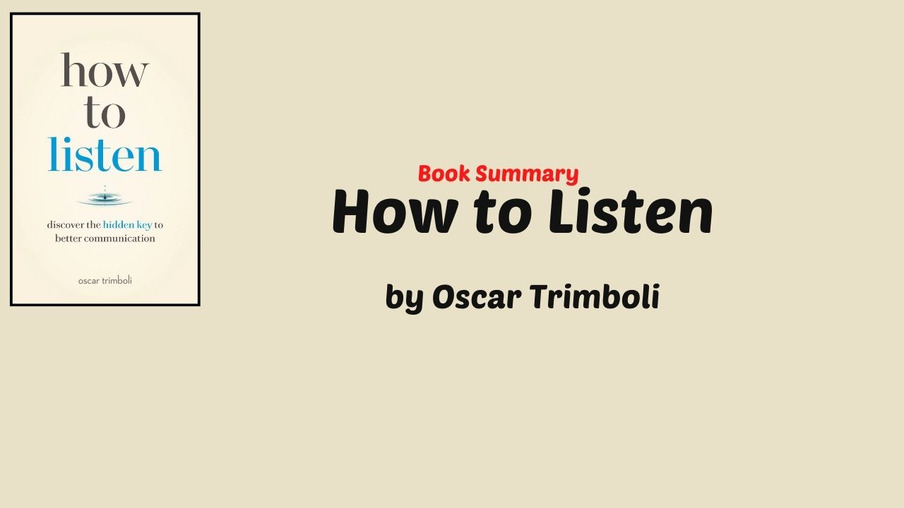{ width="200" }

    ### [Book Summary: How to Listen by Oscar Trimboli](How-to-Listen-by-Oscar-Trimboli.md)
    
    **Read time:** 5 min
    
    EXCERPT Not Found
    

- 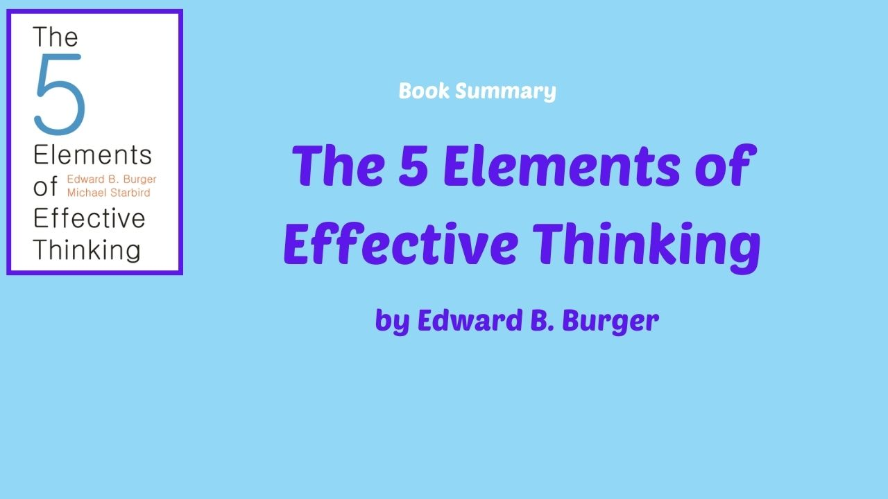{ width="200" }

    ### [Book Summary: The 5 Elements of Effective Thinking by Edward Burger](The-5-Elements-of-Effective-Thinking-by-Edward-Burger.md)
    
    **Read time:** 5 min
    
    EXCERPT Not Found

- 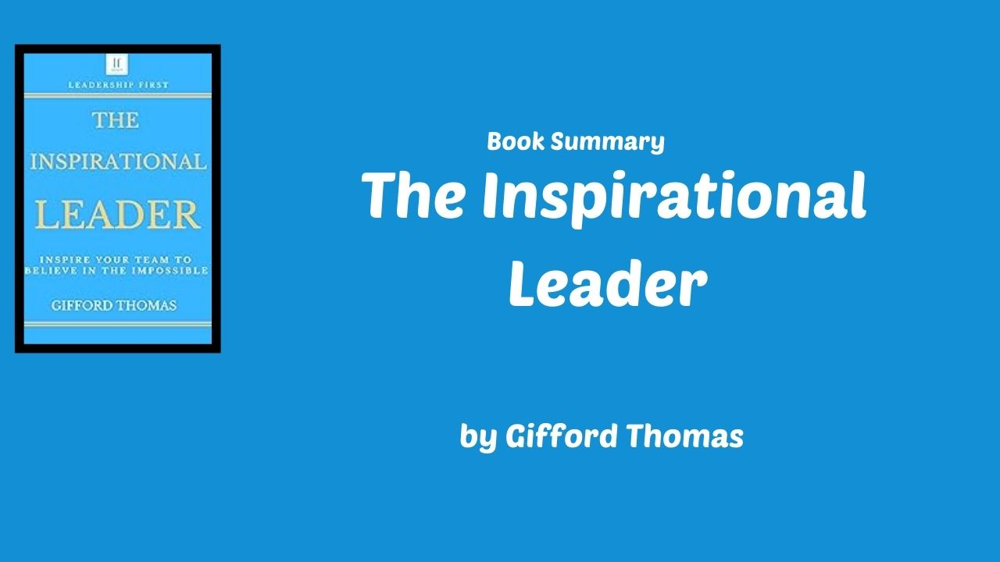{ width="200" }

    ### [Book Summary: The Inspirational Leader by Gifford Thomas](The-Inspirational-Leader-by-Gifford-Thomas.md)
    
    **Read time:** 5 min
    
    EXCERPT Not Found
    

