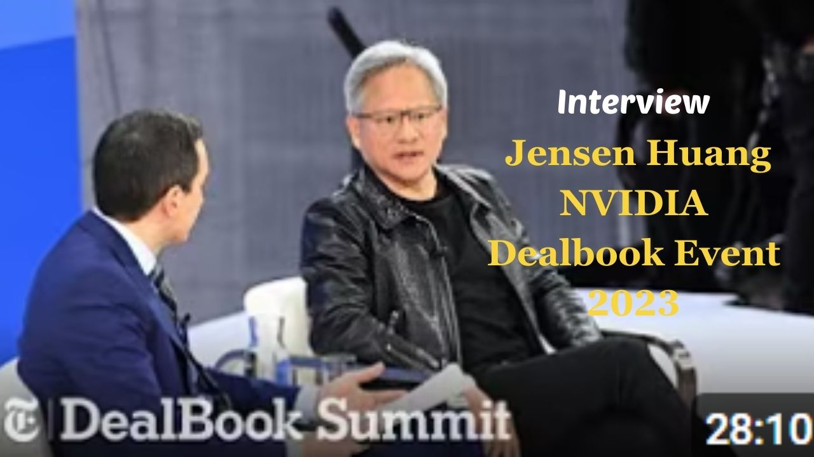

# Insights from the Interview with Jensen Huang @ NVIDIA at Dealbook Event 2023
   
## **Theme 1: The Evolution of AI Computing**
- **Reinvention of Computing**: Jensen emphasized that AI development isn't just about designing new chips but about a comprehensive reinvention of computing systems, including software, hardware, and networking.
- **Transition to Generative Computing**: Most current computing focuses on data retrieval, but the future involves combining retrieval with generative capabilities, transforming how systems operate globally.
- **Origins of AI Hardware**: Nvidia's first AI supercomputer, DGX, was designed for internal use but gained prominence when figures like Elon Musk requested it. It highlighted the potential of neural networks and deep learning.

## **Theme 2: AI Progress and Challenges**
- **Milestones in AI**: Nvidia foresaw AI's impact in 2012 with AlexNet, a neural network capable of unparalleled visual recognition. This breakthrough informed their investments in AI infrastructure.
- **Current AI Limitations**: AI today excels in tasks like perception and pattern recognition but struggles with multi-step reasoning and decision trees. Addressing these gaps is a major focus for researchers.
- **Predictions for AGI**: Within five years, AI systems might perform tasks that meet basic human intelligence standards, pushing closer to Artificial General Intelligence (AGI).

## **Theme 3: Corporate Governance and AI Ethics**
- **Lessons from OpenAI Drama**: Huang underscored the importance of strong corporate governance, contrasting Nvidia’s for-profit structure with OpenAI’s non-profit roots, which faced challenges balancing innovation and control.
- **Regulation and Safety**: AI must be managed with principles similar to those governing autonomous systems like airplanes, emphasizing redundancy, stress testing, and monitoring for safety.

## **Theme 4: Geopolitical and Strategic Challenges**
- **Chip Independence**: Achieving supply chain independence for semiconductors could take decades. Nvidia uses 35,000 components sourced globally, underscoring the complexity of achieving autonomy.
- **Export Regulations and China**: Nvidia must comply with U.S. regulations limiting advanced chip exports to China. While these policies aim to safeguard national security, they risk spurring innovation in competing markets like China.
- **Surprise from Huawei**: China’s progress with a 7nm chip was acknowledged, but Huang stated it reflected iterative advancements rather than a revolutionary leap.

## **Theme 5: Nvidia’s Strategic Edge**
- **Broad Vision**: Nvidia sees AI as an ecosystem that integrates chips, software, and infrastructure. The company’s comprehensive approach positions it uniquely in the tech landscape.
- **Direct Reports Philosophy**: Huang manages 50 direct reports to maintain fluid communication and reduce organizational hierarchy, ensuring swift decision-making and alignment.
- **Cultural Resilience**: Huang’s philosophy emphasizes operating with a blend of ambition and caution, drawn from Nvidia’s history of overcoming adversity.

## **Theme 6: The Future of Nvidia and AI**
- **Reinvention of Data Centers**: With AI reshaping computing, existing data centers worth trillions will require retooling, heralding a new era in infrastructure.
- **Ignorance and Innovation**: Huang highlighted how the initial ignorance of challenges allowed Nvidia to innovate fearlessly. This "teenage attitude" continues to drive their culture.
- **Long-Term Vision**: Nvidia is doubling down on creating specialized AI systems for fields like drug discovery and chip design, ensuring the company remains at the forefront of AI-driven innovation.

## **Key Takeaways**
- Nvidia's leadership in AI stems from a holistic vision that goes beyond hardware to include software and systems integration.
- Jensen Huang sees AI's evolution as a fundamental shift comparable to the industrial revolution of computing.
- Balancing innovation with ethics, governance, and geopolitics will shape Nvidia’s future and the AI industry at large.

[Full Youtube Video - Jensen Huang of Nvidia on the Future of A.I. in DealBook Summit 2023](https://www.youtube.com/watch?v=Pkj-BLHs6dE)
