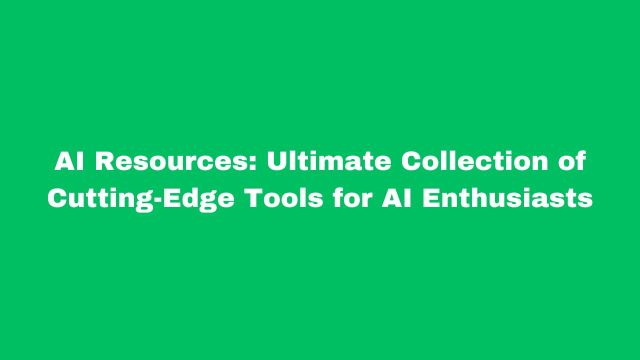

# AI Resources: Ultimate Collection of Cutting-Edge Tools for AI Enthusiasts

## Introduction
In a world driven by innovation and accelerated by artificial intelligence, the right tools can make all the difference—whether you’re hunting for your dream job, scaling a business, or pushing the boundaries of creativity and development. Welcome to the ultimate resource hub! I've curated an extensive collection of hundreds of cutting-edge tools across diverse categories—ranging from AI-powered presentation and diagramming solutions to development frameworks, data visualization platforms, and even niche treasures like Sanskrit tools. Whether you’re a job seeker, an entrepreneur, a developer, a designer, or simply an AI enthusiast, this comprehensive directory is your gateway to unlocking efficiency, inspiration, and success. Dive in and discover the tools that will empower you to navigate the future with confidence!

Broadly these are the categorization of AI product capabilities.

1. **AI Development Platforms**: These are platforms that provide tools and frameworks for developing AI models and applications. Examples include TensorFlow, PyTorch, and Microsoft Azure AI.

1. **AI for Data & Analytics**: AI tools in this category help in analyzing large datasets to extract insights, predict trends, and make data-driven decisions. Examples include IBM Watson Analytics and Google Cloud AI.

1. **AI for Design & Creativity**: These AI tools assist in creative processes such as graphic design, music composition, and content creation. Examples include Adobe Sensei and Canva's design AI.

1. **AI for Productivity**: AI tools that enhance productivity by automating routine tasks, managing schedules, and optimizing workflows. Examples include Microsoft Copilot and Slack's AI features.

1. **AI for Research & Education**: AI applications that support research and educational activities, such as personalized learning platforms and research assistance tools. Examples include IBM Watson Education and Google Scholar.

1. **Text-to-Audio & Music**: AI technologies that convert text into audio formats or generate music from textual descriptions. Examples include OpenAI's Jukedeck and Google's Text-to-Speech.

1. **Audio-to-Text Transcription**: Using this technology we can covert audio speeches into text. Audio may be conversation, talk, lecture, and this may be in different language and dialect. Transcription language can be English of any other language.

1. **Text-to-Code (Code Generation)**: AI tools that generate code from natural language descriptions, aiding developers in writing software. Examples include GitHub Copilot and OpenAI's Codex.

1. **Text-to-Text**: AI models that process and generate text, such as language translation, summarization, and content generation. Examples include GPT-3 and Google Translate.

1. **Text-to-Video**: AI technologies that create video content from textual descriptions. Examples include Synthesia and Pictory.

1. **Video-Captioning**: AI tools that automatically generate captions for video content, enhancing accessibility and user engagement. Examples include YouTube's auto-captioning and IBM Watson Media.

1. **Text-to-3D-Video**: AI applications that convert text descriptions into 3D video content, useful in gaming, virtual reality, and simulations. Examples are still emerging but include tools like NVIDIA's AI-driven graphics technologies.

1. **Multimodal**: AI systems that can process and integrate multiple types of data inputs (text, images, audio, etc.) to perform complex tasks. Examples include OpenAI's CLIP and Google's Multimodal AI.

This categorization captures the diverse applications of AI across various domains. However, it's worth noting that the field of AI is rapidly evolving, and new capabilities and categories are continually emerging.

## Online Coding Tools & their Best Usage

| No. | **Tool Name & URL** | **Category** | **Best Usage** | **Languages/Frameworks Supported** | **Type of Development Work** |
| --- |----------------------|-------------|---------------|------------------------------------|-----------------------------|
| 1. | [Bolt.new](https://bolt.new\){:target="_blank"\} | Slack App Development | Building Slack apps | JavaScript (Bolt.js) | Slack bot development |
| 2. | [CodeAnywhere.com](https://codeanywhere.com/\){:target="_blank"\} | Containerized & Remote Development | Cloud-based development with SSH/container support | Multiple languages | Cloud IDE for remote development |
| 3. | [CodePen.io](https://codepen.io/\){:target="_blank"\} | General Online IDEs | Frontend experiments and design previews | HTML, CSS, JavaScript | Web design previews and testing |
| 4. | [CodeSandbox.io](https://codesandbox.io/\){:target="_blank"\} | General Online IDEs | Frontend & full-stack web development | JavaScript, React, Vue, Node.js | Web apps, frontend-heavy development |
| 5. | [Coder.com](https://coder.com/\){:target="_blank"\} | Containerized & Remote Development | Self-hosted/cloud-based VS Code | Any language | Enterprise cloud development |
| 6. | [Deepnote.com](https://deepnote.com/\){:target="_blank"\} | Python-Specific | Collaboration-focused notebooks for data science | Python | Data science and ML collaboration |
| 7. | [Eclipse theia-ide.org](https://theia-ide.org/\){:target="_blank"\} | Web-Based VS Code & Similar IDEs | Open-source VS Code alternative | Multiple languages | Self-hosted cloud development |
| 8. | [Github.com/features /codespaces](https://github.com/features/codespaces\){:target="_blank"\} | Web-Based VS Code & Similar IDEs | Cloud-hosted VS Code with full dev environments | Any language | Full-stack and enterprise development |
| 9. | [Gitpod.io](https://www.gitpod.io/\){:target="_blank"\} | Backend & Full-Stack Development | Cloud-based dev environment for GitHub/GitLab | Multiple (Python, JavaScript, Go, Rust) | Full-stack development |
| 10. | [Glitch.com](https://glitch.com/\){:target="_blank"\} | General Online IDEs | Collaborative development and real-time previews | Node.js, Express, JavaScript, Python | Web apps, API-based bots (WhatsApp, Twitter, Telegram) |
| 11. | [Gradient console.paperspace.com](https://console.paperspace.com/\){:target="_blank"\} | AI & Machine Learning | Cloud-based ML development with Jupyter notebooks | Python, TensorFlow, PyTorch | Deep learning and AI development |
| 12. | [Hoppscotch.io](https://hoppscotch.io/\){:target="_blank"\} | API & Backend Testing | Lightweight API request builder | REST, GraphQL, WebSockets | API debugging and testing |
| 13. | [JSFiddle.net](https://jsfiddle.net/\){:target="_blank"\} | General Online IDEs | Quick prototyping for frontend | HTML, CSS, JavaScript | Frontend prototyping and experiments |
| 14. | [JetBrains.com/Fleet](https://www.jetbrains.com/fleet/\){:target="_blank"\} | Web-Based VS Code & Similar IDEs | Lightweight, distributed IDE | Multiple languages | Web, backend, and enterprise projects |
| 15. | [Katacoda (Now O’Reilly)](https://katacoda.com/\){:target="_blank"\} | DevOps & Cloud Development | Interactive DevOps learning platform | Kubernetes, Docker, Linux | Hands-on DevOps training |
| 16. | [Postman.com](https://www.postman.com/\){:target="_blank"\} | API & Backend Testing | API development and testing | REST, GraphQL, WebSockets | API testing and automation |
| 17. | [Replit.com](https://replit.com/\){:target="_blank"\} | General Online IDEs | General backend, web, and bot development | Python, JavaScript, Java, C++, Node.js, Flask, FastAPI | Web apps, API-based apps, bot development |
| 18. | [StackBlitz.com](https://stackblitz.com/\){:target="_blank"\} | Backend & Full-Stack Development | Fast-loading web development IDE | JavaScript, TypeScript, Node.js | Web development, frontend-heavy full-stack apps |
| 19. | [VSCode.dev](https://vscode.dev/\){:target="_blank"\} | Web-Based VS Code & Similar IDEs | Browser-based VS Code with GitHub integration | Any language supported by VS Code | Cloud-based development |
| 20. | [colab.research .google.com](https://colab.research.google.com/\){:target="_blank"\} | Python-Specific | Cloud-based Jupyter notebooks with free GPU/TPU | Python, TensorFlow, PyTorch | Machine Learning, AI, data science |
| 21. | [jupyter.org/ try-jupyter/lab](https://jupyter.org/try-jupyter/lab/\){:target="_blank"\} | Python-Specific | Browser-based Jupyter notebook experience | Python | Data science, ML, AI, and interactive computing |
| 22. | [kaggle.com/code - Kernels](https://www.kaggle.com/code\){:target="_blank"\} | AI & Machine Learning | Free cloud notebooks with GPUs | Python, TensorFlow, PyTorch | Machine learning, deep learning research |
| 23. | [labs.play-with -docker.com](https://labs.play-with-docker.com/\){:target="_blank"\} | DevOps & Cloud Development | Online Docker playground | Docker CLI | Container and DevOps testing |
| 24. | [Pythonium.net](https://pythonium.net/\){:target="_blank"\} | Python-Specific | Backend & Full-Stack Development | Python | Development, and API testing |

## [My Favorite Chrome Extensions](/dsblog/myfab-chrome-extensions) 
Many of these resources are related to AI and some are normal productivity tools. I am maintaining them separately since quite a long time, so not mixing with this list. You can access that from [here](/dsblog/myfab-chrome-extensions)

## [My Bookmarked Blog Articles](/dsblog/mybookmark-blog-articles)
This page already has become very long therefore moving bookmarked blog articles to another page. If you are interested you can visit the [My Bookmarked Blog Articles](/dsblog/mybookmark-blog-articles) page.

