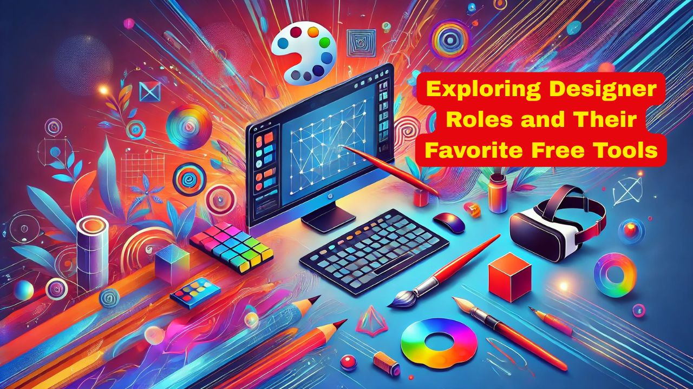

# Exploring Designer Roles and Their Favorite Free Tools

In the software business, design plays a huge role, and there are different kinds of designers, each with their own focus areas, responsibilities, and specialized tools.

## What are Different Types of Designer Roles?

### **1. UI Designer (User Interface Designer)**  
**Focus:** Visual design of interfaces (buttons, icons, layout, colors, typography)

**Common Tools:**
- Figma  
- Adobe XD  
- Sketch (macOS)  
- Framer  
- Zeplin (for handoff)

---

### **2. UX Designer (User Experience Designer)**  
**Focus:** User journeys, flows, wireframes, usability, research

**Common Tools:**
- Figma / Adobe XD (wireframes, low-fi mockups)  
- Miro / Whimsical (user flows, diagrams)  
- Balsamiq (low-fi wireframes)  
- Maze / UsabilityHub (user testing)  
- Optimal Workshop (UX research)

---

### **3. Product Designer**  
**Focus:** Combines both UI and UX; involved in product strategy and business goals

**Common Tools:**
- Figma  
- Notion (for product planning)  
- FigJam / Miro (collaboration)  
- Jira / Trello / Linear (task tracking)  
- User research + analytics tools (Hotjar, Mixpanel)

---

### **4. Visual / Graphic Designer**  
**Focus:** Branding, marketing assets, illustrations, social media visuals

**Common Tools:**
- Adobe Photoshop  
- Adobe Illustrator  
- Canva  
- Affinity Designer  
- CorelDRAW

---

### **5. Motion Designer / Animator**  
**Focus:** Animations for UI, ads, videos, transitions, micro-interactions

**Common Tools:**
- Adobe After Effects  
- Lottie / Haiku Animator  
- Principle  
- Rive  
- Blender (3D animation)

---

### **6. Interaction Designer / IxD**  
**Focus:** How users interact with UI elements – transitions, feedback, animations

**Common Tools:**
- Principle  
- Figma Smart Animate  
- Framer  
- Rive  
- ProtoPie

---

### **7. Web Designer**  
**Focus:** Designing responsive websites, often HTML/CSS-savvy

**Common Tools:**
- Webflow (visual design + code export)  
- Figma / Sketch  
- WordPress + Elementor  
- Adobe Dreamweaver (less common now)  
- Bootstrap Studio

---

### **8. Brand / Identity Designer**  
**Focus:** Logo design, brand guidelines, typography, color systems

**Common Tools:**
- Adobe Illustrator  
- CorelDRAW  
- Affinity Designer  
- Figma (increasingly used for brand systems)  
- LogoMakr / Looka (for fast mockups)

---

### **9. 3D Designer / Modeler**  
**Focus:** 3D objects for games, apps, product demos, AR/VR

**Common Tools:**
- Blender (free & powerful)  
- Autodesk Maya  
- Cinema 4D  
- ZBrush  
- Unity / Unreal Engine (for deployment)

---

### **10. Game UI/UX Designer**  
**Focus:** Designing UI and experience for games (HUDs, menus, interactions)

**Common Tools:**
- Figma / Photoshop  
- Unity UI Toolkit  
- Unreal UMG (UI system)  
- Spine 2D (for game animations)  
- Tiled (for level design)

---

### **11. Design Systems Specialist**  
**Focus:** Creating reusable components and patterns across products

**Common Tools:**
- Figma (with design systems / libraries)  
- Storybook (for frontend components)  
- Zeroheight (design system documentation)  
- Tokens Studio (for design tokens)

---

### **12. AR/VR/XR Designer**  
**Focus:** Designing for immersive experiences

**Common Tools:**
- Adobe Aero  
- Unity + XR Toolkit  
- Gravity Sketch  
- Blender  
- Spark AR / Lens Studio (for Instagram/Snapchat filters)

### **13. Creative Technologist / Design Engineer**  
**Focus:** Bridges design and code—turns high-fidelity prototypes into real UI components.

**Tools / Skills:**
- Figma + Code (React, CSS, JS)
- Storybook
- Framer (code-based prototyping)
- VS Code
- GitHub

---

### **14. Information Designer / Data Visualization Designer**  
**Focus:** Designing dashboards, infographics, and data-driven visuals.

**Tools:**
- Tableau / Power BI (business dashboards)
- D3.js (custom data visuals)
- Flourish / RAWGraphs (no-code viz)
- Illustrator (for infographics)
- Google Charts / Datawrapper

---

### **15. Accessibility Designer**  
**Focus:** Ensures designs are usable by people with disabilities (color contrast, screen reader support, etc.)

**Tools:**
- Stark (Figma plugin)
- Axe DevTools
- WAVE (Web Accessibility Evaluation Tool)
- Color Oracle
- Contrast Checker

---

### **16. Conversational UI Designer / Voice UX Designer**  
**Focus:** Designs chatbots, voice interfaces (like Alexa or Siri)

**Tools:**
- Voiceflow  
- Botmock (retired, but notable)  
- Dialogflow (Google)  
- Amazon Alexa Developer Console  
- Figma (for flow diagrams)

---

### **17. Content Designer / UX Writer**  
**Focus:** Microcopy, button labels, error messages, onboarding text—words that shape user experience.

**Tools:**
- Google Docs / Notion (collab writing)  
- Figma (embedded copy in UI)  
- Grammarly / Hemingway (clarity tools)  
- Ditto (UX writing plugin for Figma)

---

### **18. Industrial Designer (for software-hardware products)**  
**Focus:** Designs physical interfaces (IoT devices, wearables, hardware UI)

**Tools:**
- SolidWorks / Rhino  
- Fusion 360  
- KeyShot (rendering)  
- SketchUp  
- Adobe Dimension

---

### **19. Generative / AI Designer**  
**Focus:** Uses AI to generate creative assets, iterate fast, or collaborate on ideation.

**Tools:**
- Midjourney / DALL·E / Stable Diffusion  
- Runway ML  
- Leonardo AI  
- ChatGPT (for UX writing, concept gen)  
- Figma AI (new features rolling in)

---

### **20. Design Ops / Systems Manager**  
**Focus:** Improves workflow, collaboration, and scalability of design across teams.

**Tools:**
- Zeroheight (design documentation)  
- Abstract (version control for Sketch)  
- Figma Libraries  
- Notion / Confluence  
- Jira / Asana (for task coordination)

## What are various Design Tools?

### **1. UI/UX & Wireframing Tools (Free Versions)**

**Web-Based:**
- **Figma** – UI/UX design, wireframing, prototyping (free for individuals)
- **Penpot** – Open-source alternative to Figma (web + self-hosted)
- **Uizard** – Rapid wireframing and mockups with AI
- **Whimsical** – Free for limited boards (flowcharts, wireframes)

**Desktop:**
- **Pencil Project** – Open-source wireframing tool
- **Balsamiq Wireframes (Desktop)** – Limited free trial (good for sketch-style wireframes)

---

### **2. Graphic Design & Illustration**

**Web-Based:**
- **Canva** – Free plan includes templates, drag-and-drop design  
- **Photopea** – Online Photoshop alternative (layer-based editor)  
- **Vectr** – Basic vector design in browser  
- **Fotor** – Photo editing and social graphics  
- **Pixlr X / E** – Online photo editor (basic & advanced modes)

**Desktop:**
- **Inkscape** – Open-source vector editor (like Illustrator)  
- **Krita** – Powerful open-source painting and illustration app  
- **Gravit Designer (Free Version)** – Vector design (cross-platform)  
- **GIMP** – Open-source raster image editor (Photoshop alternative)  
- **MediBang Paint** – Comic and illustration tool  

---

### **3. Motion Design / Animation**

**Web-Based:**
- **Rive** – Real-time motion graphics for apps (free with limits)  
- **Animaker** – DIY animation tool (free plan available)  
- **LottieFiles** – Preview and edit Lottie animations in browser

**Desktop:**
- **OpenToonz** – Free 2D animation software  
- **Blender** – Open-source 3D modeling and animation suite  
- **Synfig Studio** – Open-source 2D animation tool  

---

### **4. Mockup & Asset Generators**

**Web-Based:**
- **MockupBro** – Create product mockups  
- **Shotsnapp** – Browser-based mockup generator  
- **Designify** – Auto-remove backgrounds and enhance images  
- **Remove.bg** – Free background remover (limited free credits)

---

### **5. Icon, Illustration, and Asset Resources**

**Web-Based:**
- **Heroicons / Tabler Icons** – Free open-source icon sets  
- **UnDraw** – Free MIT-licensed illustrations  
- **Humaaans / Open Peeps** – Free illustration libraries  
- **SVGRepo / Iconscout (Free section)** – Thousands of SVGs and icons  
- **Pexels / Unsplash** – Free stock images for mockups/design

---

### **6. Design Systems & Collaboration**

**Web-Based:**
- **Penpot** – Team-friendly open-source design tool  
- **Figma (Free for teams up to 3 editors)** – Includes libraries, components  
- **Zeroheight (Free tier)** – Design system documentation  
- **Miro (Free plan)** – Whiteboarding and brainstorming  

---

### **7. Typography & Font Tools**

**Web-Based:**
- **Google Fonts** – Free web fonts  
- **Fontjoy / Fontpair** – Font pairing tools  
- **Calligraphr** – Turn your handwriting into a font  
- **DaFont / 1001 Fonts** – Free downloadable fonts

## What are Different Types of Transformation Styles?
When you take a photo of a person, there are **many styles** you can apply to it depending on the goal—whether it's for artistic transformation, social media enhancement, professional editing, or fun. Here's a breakdown of **different styles** you can apply:

---

### **1. Artistic Styles**
- **Cartoon / Anime Style** – Makes the photo look like a cartoon or anime character.
- **Sketch / Pencil Drawing** – Converts the image into a hand-drawn pencil or charcoal sketch.
- **Oil Painting / Watercolor** – Simulates traditional painting techniques.
- **Pop Art / Warhol Style** – Bold colors and patterns, 1960s-inspired.
- **Cyberpunk / Futuristic** – Neon lights, glowing edges, dystopian vibe.
- **Vintage / Retro** – Faded colors, grain, and light leaks.

---

### **2. Portrait Enhancement**
- **Beauty / Glamour Filter** – Smooths skin, adjusts lighting and tones.
- **Makeup Simulation** – Adds virtual makeup (lipstick, eyeshadow, etc.).
- **Hair Color / Style Change** – Alters hair style or color digitally.
- **Bokeh Background** – Blurs the background to highlight the subject.
- **Black & White / Monochrome** – Dramatic grayscale or sepia tones.

---

### **3. Thematic / Character Transformation**
- **Old Age / Baby Face / Gender Swap** – FaceApp-style transformations.
- **Fantasy / Sci-Fi Characters** – Turns people into elves, cyborgs, or wizards.
- **Zombie / Vampire / Halloween Themes** – Fun horror-style edits.

---

### **4. AI-Powered Transformations**
- **AI Avatars / Lensa Style** – Auto-generated stylized avatars.
- **Face Morphing** – Blends your face with another celebrity or character.
- **Cinematic Lighting / Mood** – Applies dramatic lighting and film vibes.

---

### **5. Style Transfer (Neural Networks)**
- **Van Gogh / Picasso / Monet Style** – AI applies a painter's style to your photo.
- **Dreamlike / Abstract Art** – Trippy, surreal effects with AI.

---

### **6. Social Media Filters**
- **Instagram / Snapchat Filters** – Cute overlays, AR effects, face distortions.
- **Retro Cam / VHS Effect** – Adds analog textures and timestamps.

---

### **7. Professional Styles**
- **Corporate Headshot Style** – Clean background, professional lighting.
- **Magazine Cover Look** – Glamorous edits, text overlays.
- **Studio Lighting Simulation** – Mimics ring lights or softbox effects.

---

### **8. Cinematic / Movie-Inspired Styles**
- **Hollywood Grading** – Teal and orange color tone.
- **Noir Style** – High contrast black and white with dramatic lighting.
- **Film Emulation (Kodak, Fuji)** – Mimics specific analog film stocks.

---

### **9. Cultural & Regional Styles**
- **Bollywood / Indian Wedding Edit** – Rich colors, glitter effects.
- **K-pop / Korean Soft Look** – Bright skin, pastel colors, clean tones.
- **Traditional Painting Style** – Like Mughal miniature, Japanese ukiyo-e, etc.

---

### **10. Conceptual / Abstract Styles**
- **Double Exposure** – Merges human silhouette with another scene (e.g., landscape).
- **Dispersion / Pixel Explosion** – Parts of the body break into particles.
- **Glitch Art** – Deliberate visual distortion for a cyber/retro feel.

---

### **11. Mood / Emotion-based Styles**
- **Melancholic / Moody Tone** – Dark tones, desaturated colors.
- **Dreamy / Soft Focus** – Hazy, glowing light, like daydreams.
- **Energetic / Vibrant Color Splash** – Bold saturation, high contrast.

---

### **12. Background Replacements & Environments**
- **Virtual Locations** – Place the subject on a beach, mountain, Mars, etc.
- **Fantasy World / Game-Inspired** – Add dragons, castles, neon cities.
- **Minimalist / Solid Color Backgrounds** – Clean, modern design aesthetic.

---

### **13. Motion or Live Styles**
- **Cinemagraphs** – Still photo with subtle motion (like hair blowing).
- **3D Parallax Effect** – Gives depth and movement to a still photo.
- **Photo to Video Avatars** – Turn still images into animated speaking avatars.

---

### **14. Face-Only Transformations**
- **Face Slimming / Eye Enhancement** – Often used in beautification.
- **Celebrity Look-Alike Generator** – See who you resemble.
- **Face Swap / Face Merge** – Fun swaps with another person or character.

---

### **15. Typography and Graphics Overlay**
- **Magazine Cover or Poster Layout** – Add text and design.
- **Memes / Captioned Styles** – For social media sharing.
- **Collage / Scrapbook Style** – Multiple image cutouts layered with stickers and frames.

## What are different free tools for different designer roles?

| **Designer Type** | **Free Tools** |
|---|---|
| **UI/UX Designer**   | Figma 🌐, Penpot 🌐🖥️, Uizard 🌐, Whimsical 🌐, Pencil Project 🖥️, Balsamiq (trial) 🖥️ |
| **Graphic Designer** | Canva 🌐, Photopea 🌐, Pixlr X/E 🌐, Fotor 🌐, Gravit Designer 🌐🖥️, GIMP 🖥️, Inkscape 🖥️   |
| **Vector Illustrator** | Inkscape 🖥️, Vectr 🌐🖥️, Gravit Designer 🌐🖥️, Boxy SVG 🌐, Affinity Designer (trial) 🖥️ |
| **Digital Painter / Artist** | Krita 🖥️, MediBang Paint 🖥️, GIMP 🖥️, Autodesk SketchBook 🖥️ |
| **Motion / Interaction Designer**  | Rive 🌐, OpenToonz 🖥️, Synfig Studio 🖥️, Blender 🖥️, LottieFiles 🌐  |
| **3D Designer / Modeler** | Blender 🖥️, Tinkercad 🌐, SketchUp Free 🌐, FreeCAD 🖥️  |
| **Web Designer** | Figma 🌐, Webflow 🌐, Penpot 🌐🖥️, Bootstrap Studio (limited) 🖥️, WordPress + Elementor 🌐🖥️   |
| **Brand / Identity Designer**   | Canva 🌐, Photopea 🌐, GIMP 🖥️, Inkscape 🖥️, LogoMakr 🌐, Looka 🌐   |
| **Game UI Designer**   | Figma 🌐, Krita 🖥️, GIMP 🖥️, Blender 🖥️, Unity (UI Toolkit) 🖥️, Unreal Engine (UMG) 🖥️   |
| **Accessibility Designer**   | Stark (Figma Plugin) 🌐, Contrast Checker 🌐, WAVE Tool 🌐, Axe DevTools 🌐, Color Oracle 🖥️   |
| **Conversational UI Designer**  | Voiceflow 🌐, Botpress 🌐🖥️, Dialogflow 🌐, Amazon Lex 🌐  |
| **UX Researcher / Content Designer**  | Notion 🌐🖥️, Google Docs 🌐🖥️, Grammarly 🌐🖥️, Hemingway 🌐, Figma 🌐, Ditto (Figma Plugin) 🌐, Maze 🌐, Optimal Workshop 🌐   |
| **Design System Specialist** | Figma Libraries 🌐, Penpot 🌐🖥️, Zeroheight 🌐, Tokens Studio (Figma Plugin) 🌐, Storybook 🌐🖥️   |
| **Creative Technologist** | VS Code 🖥️, Figma 🌐, Framer 🌐, CodeSandbox 🌐, GitHub 🌐🖥️, Storybook 🌐🖥️, CodePen 🌐  |
| **Data Viz / Info Designer** | RAWGraphs 🌐, Datawrapper 🌐, Flourish 🌐, Google Charts 🌐, Tableau Public 🖥️, D3.js 🌐🖥️, Illustrator (trial) 🖥️  |
| **AR/VR/XR Designer**  | Adobe Aero 🖥️, Unity 🖥️, Blender 🖥️, Spark AR 🌐🖥️, Lens Studio 🖥️, Gravity Sketch (trial) 🖥️ |
