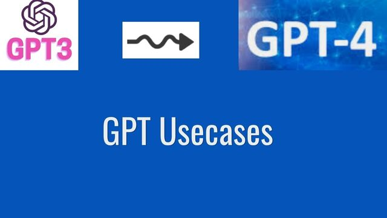
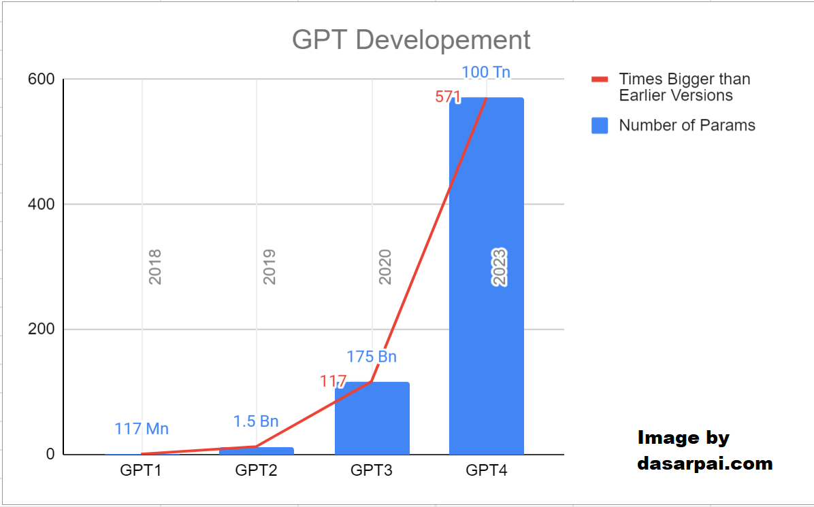
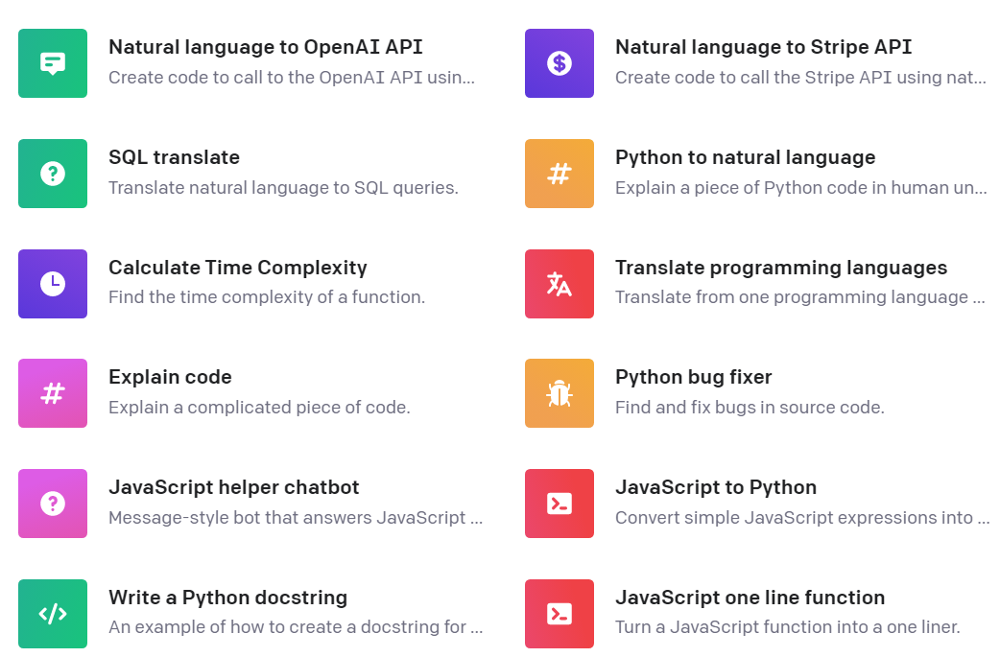
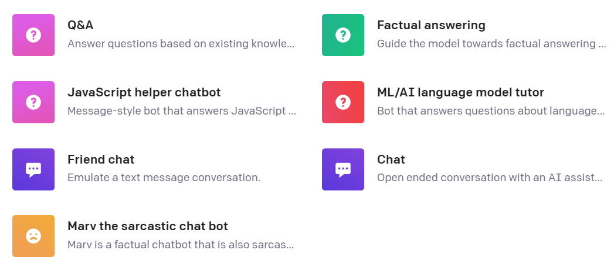
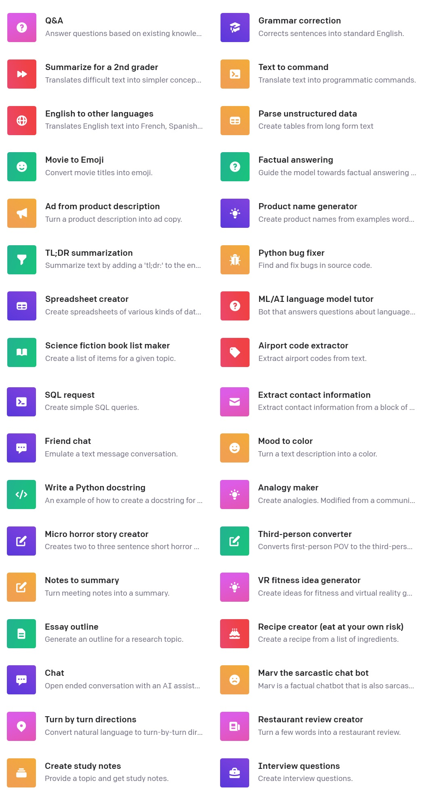
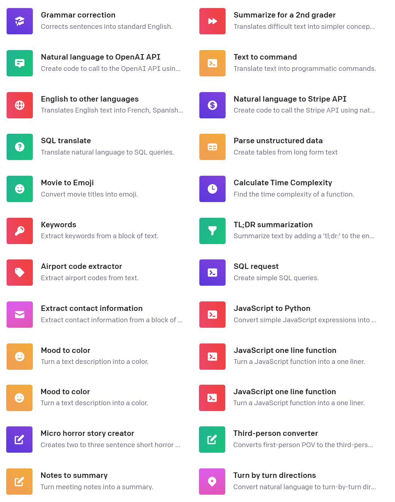
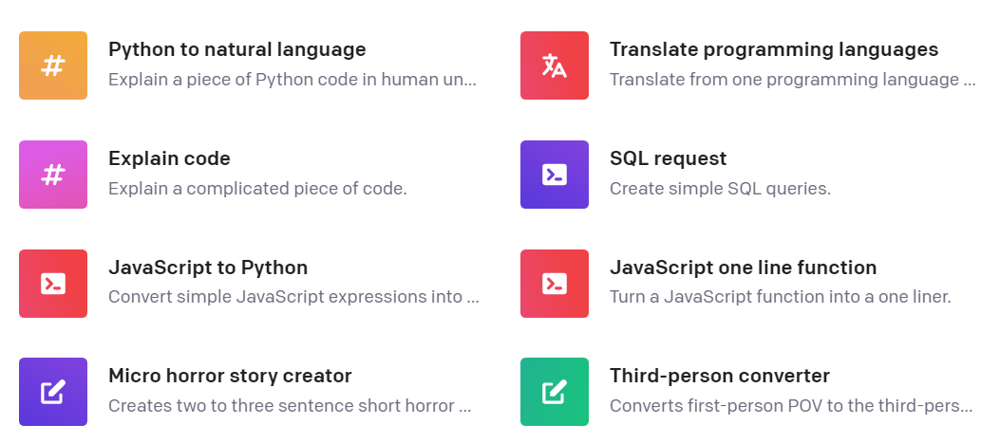

--- 
id: 6020       
title: "GPT Usecases"   
date: '2023-01-05T15:50:00+05:30'   
permalink: /dsblog/gpt-usecases 
categories:
  - dsblog
tags: [OpenAI, NLP, Machine Learning, Natural Language Processing, GPT3, Language Models, AI Technology, Transformer Architecture]   
keywords: GPT applications, language models, transformer architecture, OpenAI technology, natural language processing, GPT use cases, AI text generation, machine learning models, GPT fine-tuning, industry applications
header:   
  teaser: "../assets/images/dspost/dsp6020-GPT-Usecases.jpg"   
excerpt_separator: "<!--more-->"   
author: Hari Thapliyaal   

excerpt: "Discover the diverse applications and potential of GPT (Generative Pre-trained Transformer) technology across industries. Learn how this revolutionary language model is reshaping text generation, content creation, and natural language understanding."
author_profile: true   
share: true   
toc: true   
toc_sticky: true 
mathjax: true
--- 

   
   

# What is GPT?   

GPT is a transformer. Don't confuse it with your electricity transformer! In Artificial Intelligence there are different kinds of neural network architectures to perform various tasks like classification, translation, segmentation, regression, etc. One of those architectures is transformer architecture. The Foundation of this architecture is based on another two architectures called encoder architecture and decoder architecture. There are lots of other technical complexity but for the business readers I am hiding that for that the time being, we will discuss that at some other place. In nutshell, GPT is a Transformer technology developed by OpenAI and it can perform several NLP tasks. NLP stands for natural language preprocessing. NLP tasks mean tasks like sentiment analysis of the text, text classification, topic modeling, translation, named entity recognition, and dozens of other tasks.

GPT stands for Generative Pre-Trained Transformer. You may be thinking it is a very loaded term. What does it mean at all? Here **Generative** means a system that can generate text or image or voice or style on text or image or voice. It means a generative system can create a painting of different types like a human creates and sometimes super quality very creative image than an average IQ human can create. A generative system can write poetry, essay, blogs, and a movie script. A generative system can generate voices of different moods, gender, and age. **Pre-Trained** means this is a system (model) created by OpenAI and all the parameters have been learned during the training processes. Generally, to use the GPT you need not do any training. You can simply call the model via an API call and ask whatever you want it to do. In the case of a specific requirement, you may train this but in that case, also you don't do full training but you do little training, this is called fine-tuning. To do this process either you can add some more layers to the existing architecture or enable a couple of existing layers of the architecture to adjust the weights and biases during fine-tuning (training) process.     

Apart from the GPT transformer, there are many other transformers but most of them are suitable for one or two tasks, in one or two languages. GPT transformer is the most generic transformer which can perform NLP tasks of almost all kinds and in many of the world languages. OpenAI created the first version of GPT called GPT1 in 2018, it was a 117M parameter model. On 14-Jan-2019 just before the start of COVID-19, OpenAI released a GPT2. it had 1.5 billion parameters. In May 2020, around the second wave of COVID-19, OpenAI released GPT3. This time it was having 175 billion parameters. Around Jan/Feb-23 it is expected to have GPT4. It is expected to have 100 trillion parameters.
   
GPT can perform many kinds of tasks, you can test them at [Beta testing site](https://beta.openai.com). At this point in time, this site is working on GPT3 so all these tasks are performed using GPT3. When GPT4 will be released officially, then these features or maybe more features with better results can be processed.
 

**Growth of GPT**

# Major Tasks of NLP 
The **Major Tasks of NLP** from GPT are grouped into the following 7 categories. Each category has many specific tasks. Each task has hundreds of applications in your area of business interest.

## Question Answering with GPT3 & GPT4

## Classification Tasks with GPT3 & GPT4

## Coding Tasks with with GPT3 & GPT4

## Conversations Tasks with GPT3 & GPT4

## Generations Tasks with GPT3 & GPT4

## Transformation Tasks with GPT3 & GPT4

## Translation Tasks with GPT3 & GPT4

## Conclusion
Transformers are the revolutionary architecture in NLP. GPT is the most revolutionary among all the transformer architectures because it is a general-purpose transformer and it can be used by any industry to fine-tune and solve domain-specific problems. AI, NLP, and the Large Language model have come to stay here. In the time to come we will see hundreds of products around GPT, they will either consume GPT service or fine-tune GPT model for their own domain-specific work. Technocrats are bringing forward disrupting technologies, and business people, politicians, and bureaucrats need to harness this technology for human wellbeing. Rather than making these technologies enemies of humans can we make them the friend of humans? Can we deliver better quality with new technology? Can we remove inefficiencies in our business and personal life? Can we transfer boring and tiring task to machines, so that humanity has more time to observe life, and think about something which is deeper and more meaningful for him or her?

# References
OpenAI is still silent on the number of parameters and date of launch but there are many rumors in the market about these two things. Below are some interesting links.

- [ChatGPT 4 will have 175 billion parameters just like ChatGPT 3](https://indianexpress.com/article/technology/tech-news-technology/chatgpt-4-release-features-specifications-parameters-8344149/#:~:text=ChatGPT%204%20parameters&text=According%20to%20the%20response%2C%20ChatGPT,just%20like%20the%20ChatGPT%203.
)
- [GPT-4–100X More Powerful than GPT-3](https://medium.com/geekculture/gpt-4-100x-more-powerful-than-gpt-3-38c57f51e4e3)
- [Everything We Know About GPT-4](https://www.datacamp.com/blog/what-we-know-gpt4)
- [GPT-4 Will Have 100 Trillion Parameters — 500x the Size of GPT-3](https://towardsdatascience.com/gpt-4-will-have-100-trillion-parameters-500x-the-size-of-gpt-3-582b98d82253)
- [GPT 4 will have 100 trillion parameters](https://www.reddit.com/r/singularity/comments/pczhhn/gpt_4_will_have_100_trillion_parameters/)
- [GPT-4 is Almost Here, And it Looks Better than Anything Else](https://analyticsindiamag.com/gpt-4-is-almost-here-and-it-looks-better-than-anything-else/)
- [Will GPT-4 Be a Massive Language Model That Can Imitate Human Brain](https://www.analyticsinsight.net/will-gpt-4-be-a-massive-language-model-that-can-imitate-human-brain/)
- [Open AI’s GPT 4 could support up to 1 trillion parameters, will be bigger than ChatGPT 3](https://indianexpress.com/article/technology/tech-news-technology/chatgpt-4-release-features-specifications-parameters-8344149/)
