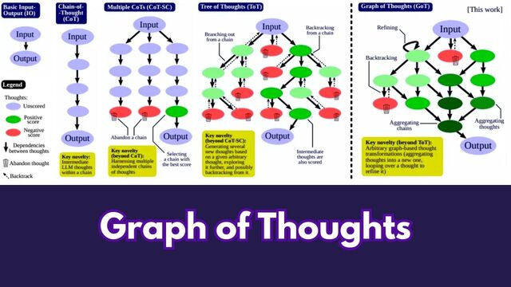

# Graph of Thoughts

This is a valuable resource for learning Graph of Thoughts (GoT) concepts. The YouTube video is from code_your_own_AI. I'm utilizing the comments made by @wesleychang2005 on the video, which provide an excellent summary of GoT. If you're interested in this topic and find the summary below intriguing, I recommend watching the entire 41-minute video.

https://www.youtube.com/watch?v=tCPA89n6NGQ&t=1562   
**Take Aways from the video**   

1. 00:26 🤯 Graph of Thoughts (GoT) is a non-linear approach to reasoning for AI agents, using interconnected nodes and edges to represent the thought process.
1. 01:18 📊 The Tree of Thoughts method suffers from inefficiency, requiring hundreds of queries to solve a single problem.
1. 02:36 🎯 An AI agent is defined as an entity that can perceive its environment, make decisions, and initiate actions based on a control cycle and a reward function.
1. 05:39 🌐 The latest research focuses on AI agents augmented by Large Language Models (LLMs) for more intelligent and autonomous behavior.
1. 08:43 🤖 LLM-augmented AI agents can interact with and learn from their environment, making them more adaptive and capable.
1. 12:45 📝 Explanation fine-tuning of LLMs (Large Language Models) is guided by GPT-4's own reasoning explanation, serving as a blueprint for development.
1. 13:34 🕸️ The "Graph of Thoughts" allows for a flexible approach to reasoning, where multiple chains of thoughts can be pursued and evaluated simultaneously.
1. 16:50 🎛️ The application of graph theory in AI involves the use of graph attention networks and various encoding techniques to manage both visual and textual data.
1. 22:46 📊 A scoring mechanism is used to assess the LLM's replies for accuracy and relevance, aiding in quality control of the model's output.
1. 24:16 🎮 A "Controller" manages the entire reasoning process, using a "Graph of Operations" (GoO) to dictate the execution plan for tasks, making the reasoning adaptable and structured.
1. 25:35 🌍 Graph-of-Thoughts (GoT) can be used for planet classification tasks. The speaker uses a simple example where an AI system decides whether a planet is habitable based on attributes like distance from the sun and atmospheric conditions.
1. 27:32 🛠️ In GoT, each node in the 'Graph of Operations' (GoO) represents a specific task (e.g., check distance from the sun). The 'Graph Reasoning State' (GRS) records and updates the system's understanding as nodes are executed.
1. 29:30 📝 The speaker describes a more complex example involving multiple types of planets and a list of features for classification. He emphasizes the need for a specialized Language Learning Model (LLM) trained in astrophysics.
1. 32:56 🎯 Scoring and validation are essential for assessing the reliability of the AI's responses. The system assigns a confidence score to its classification decision.
1. 35:48 🔄 The GoT system can incorporate human feedback, iterating through multiple loops to refine its reasoning process and improve classification outcomes.  
1. 36:57 🛠️ The Graph-of-Operation (GoO) framework lays out how AI operations interact and depend on each other in a sequence, from initial query to final output.
1. 38:18 🙋‍♂️ Human domain expertise is essential for designing the reasoning flow within the GoO, as it's not automatically generated by the AI system itself.
1. 39:18 🤔 GPT-4 suggests that future AI systems like GPT-5 could potentially engage in meta-learning or self-improvement, opening the possibility for AI to design its own GoO structure.
1. 39:43 📊 Adequate training data is crucial for advanced AI systems to learn diverse tasks in multiple domains and potentially design complex GoO structures.
1. 40:07 📈 Mathematical graph theory could help in constructing multiple graphs for specific problems, setting the stage for training more advanced AI systems.
