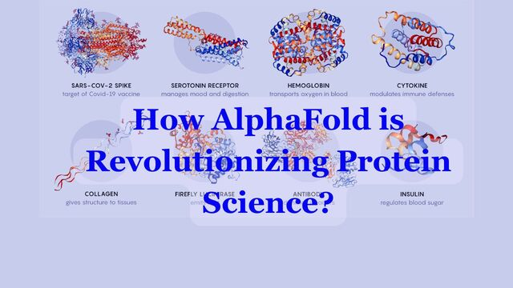

# How AlphaFold is Revolutionizing Protein Science: Answering Big Questions with AI

## Introduction

### What are proteins, and why are they important for life? 🧬
Proteins are the workhorses of life. Found in every cell, they perform vital roles such as providing structural support, enabling biochemical reactions, and defending the body against pathogens. Without proteins, life as we know it would not exist.

---

### How do amino acids form proteins? 🧩
Proteins are composed of amino acids, the building blocks of life. These 20 amino acids combine in specific sequences to create unique proteins. The sequence determines a protein's structure and function, much like letters in words.

---

### What is protein folding, and why does it matter? 🔄
Protein folding is the process where a protein assumes its functional 3D structure. Misfolding can lead to diseases such as Alzheimer’s and cystic fibrosis. Understanding folding helps us design drugs and predict how proteins interact.

---

## Understanding Proteins

### How are proteins structured (primary, secondary, tertiary, quaternary)? 🧬
Proteins have four levels of structure:
- **Primary**: The sequence of amino acids.
- **Secondary**: Localized shapes like alpha-helices and beta-sheets.
- **Tertiary**: The overall 3D structure of a single protein molecule.
- **Quaternary**: Complexes formed by multiple protein molecules.

---

### Why is it so hard to predict protein structures? 🧐
The difficulty lies in the astronomical number of possible conformations. Proteins fold in milliseconds, but computationally predicting this from amino acid sequences has been a challenge due to the vast complexity.

---

### What are the different types of proteins and their functions? 🧬
Proteins are classified based on their functions:
- **Enzymes**: Speed up chemical reactions (e.g., lactase).
- **Structural proteins**: Provide support (e.g., collagen).
- **Transport proteins**: Move molecules (e.g., hemoglobin).
- **Defense proteins**: Protect the body (e.g., antibodies).

---

### How many proteins are possible, and how many are known to humans? 🌍
With 20 amino acids forming sequences of various lengths, billions of protein combinations are possible. Humans have around **20,000-25,000 proteins** identified, but there’s still much to explore in other organisms.

---

### What’s the connection between human, plant, and animal proteins? 🌱
All life shares a genetic code, so proteins across humans, plants, and animals often have similar amino acid sequences and structures. This connection helps in using plant-based or animal-derived proteins to meet dietary needs or model human biology.

---

## AlphaFold and the Nobel-Worthy Breakthrough

### What is AlphaFold, and why is it revolutionary? 🏆
AlphaFold, developed by DeepMind, uses AI to predict protein structures with remarkable accuracy. It solved a 50-year-old challenge by reliably determining 3D structures from amino acid sequences, earning acclaim globally.

---

### How does AlphaFold work? What data does it use? 📊
AlphaFold uses neural networks trained on protein sequences and their experimentally determined structures. By analyzing patterns, it predicts 3D conformations with atomic-level accuracy. Inputs include amino acid sequences, while outputs are the protein’s folded structure.

---

### Did AlphaFold win a Nobel Prize? What’s the story behind it? 🎉
While AlphaFold itself alone didn't won a Nobel, it is one of the 3 receipients of Chemistry Nobel prize of 2024. The 2024 Nobel Prize in Chemistry highlighted advancements in protein research, and AlphaFold’s innovations played a significant role in the broader recognition of AI in science.

---

## Applications in Science and Medicine

### How is AlphaFold transforming drug discovery? 💊
AlphaFold accelerates drug discovery by:
- Predicting protein targets for diseases.
- Simulating how drugs bind to these targets.
- Reducing the time and cost of traditional drug research.

---

### Can AlphaFold help cure diseases like kidney failure? 🩺
By identifying misfolded or dysfunctional proteins in kidneys, AlphaFold can guide the design of therapies to restore function or replace damaged proteins, offering hope for curing diseases like kidney failure.

---

### What other applications does AlphaFold have in biology? 🔬
Beyond medicine, AlphaFold aids:
- **Agriculture**: Improving crop resistance.
- **Enzyme engineering**: Designing better industrial catalysts.
- **Environmental science**: Understanding proteins in microbes for waste breakdown.

---

## AI and AlphaFold’s Place in It

### What is the connection between AlphaFold and AlphaGo? 🎮
AlphaFold and AlphaGo both originate from DeepMind. While AlphaGo mastered the game of Go, AlphaFold applied similar reinforcement learning and deep learning techniques to solve protein structure prediction challenges.

---

### How is AlphaFold different from other AI models? 🤖
Unlike typical AI models, AlphaFold focuses on a specific scientific problem. It integrates domain knowledge, physics-based principles, and AI, setting it apart from general-purpose models like GPT or BERT.

---

## Bridging AI, Proteins, and Health

### How does lifestyle and diet affect protein folding? 🥗
Proper diet ensures proteins fold correctly:
- **Essential nutrients**: Provide building blocks for amino acids.
- **Antioxidants**: Protect against folding errors.
- **Hydration and exercise**: Maintain cellular health for optimal protein activity.

---

### What’s the future of AlphaFold and AI in biology? 🌟
The future promises:
- Real-time protein interaction modeling.
- Personalized medicine tailored to individual protein structures.
- New AI models for understanding complex biological systems.

---

## Conclusion

### What have we learned about AI, proteins, and health? 💡
We’ve explored:
- The essential role of proteins.
- How AlphaFold revolutionizes protein folding prediction.
- Real-world applications in medicine, biology, and beyond.

---

### Where can I learn more about AlphaFold and protein science? 📚
- [A glimpse of the next generation of AlphaFold](https://deepmind.google/discover/blog/a-glimpse-of-the-next-generation-of-alphafold/)
- [AlphaFold 3 predicts the structure and interactions of all of life’s molecules](https://blog.google/technology/ai/google-deepmind-isomorphic-alphafold-3-ai-model/)
- [The Protein Data Bank](https://www.rcsb.org/)
- [Nobel Prize in Chemistry 2023](https://www.nobelprize.org/prizes/chemistry/2023/summary/)

