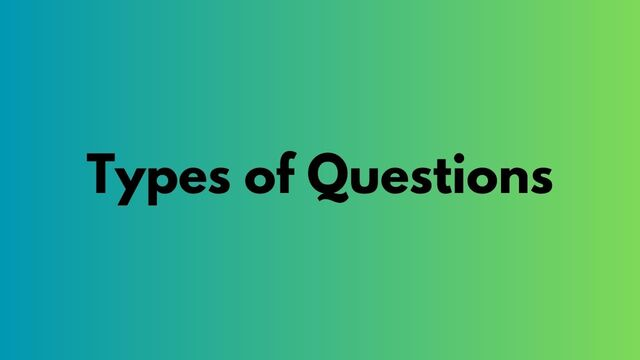
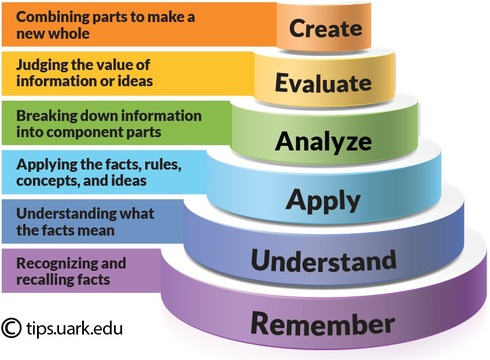

# Types of Questions

## Introduction
Question-Answering task is one of the tasks in NLP-Task. To create a high-performing AI system that can understand the question correctly and answer appropriately, we need to train a model. And to train a model, we need to have a good-quality dataset in place. Without understanding what are the different formats of questions and answers, we cannot create a dataset. In our day-to-day life we never pay attention to this minute detail but to create an AI system that can perform QA tasks, we need to understand the different formats of questions. In this article, I am creating a list of these different types of questions. To create an AI system that can perform all these kinds of QA tasks, we need to craft the dataset very carefully. Although, we see lots of data around, but to create an NLP-Task specific dataset is tedious task.

## Why we ask quesions?
In today's hitech environment there are many ways to learn. Virtual classes, virtual conferences, youtube channels, recorded classroom sessions are just a few out of many learning methods added recently. Asking question is the only way to know whether learner understood the concept correctly or not. As per the [Bloom's Taxonomy](https://tips.uark.edu/using-blooms-taxonomy/#:~:text=What%20Is%20Bloom's%20Taxonomy), learning process has following 6 levels. Therefore the purpose of asking questions is to check whether a learner can do following. These steps goes in sequence without jumping over any of the step.

- Remembering: Retrieving, recognizing, and recalling relevant knowledge from long‐term memory.
- Understanding: Constructing meaning from oral, written, and graphic messages through interpreting, exemplifying, classifying, summarizing, inferring, comparing, and explaining.
- Applying: Carrying out or using a procedure for executing, or implementing.
- Analyzing: Breaking material into constituent parts, determining how the parts relate to one another and to an overall structure or purpose through differentiating, organizing, and attributing.
- Evaluating: Making judgments based on criteria and standards through checking and critiquing.
- Creating: Putting elements together to form a coherent or functional whole; reorganizing elements into a new pattern or structure through generating, planning, or producing.

**Acronym: Remember Understanding means Applying, Analysing, Evaluating ideas and Creating solutions.**

Keeping above goals and learning process in mind we should create many kinds of questions to ensure that learning is properly happening.

## 24 Types of Questions

1. Closed-ended Questions:   

    These questions have a limited set of predefined answer options, often requiring a simple "yes" or "no" response or a specific choice from a list.

    What is the square root of four?
    What time you came here?

2. Yes/No Questions:   

    These questions are designed to elicit a binary response of "yes" or "no."

    Did you see Mark today?
    Do you want me to call that client?

3. Open-ended Questions:   

    Open-ended questions allow for a wide range of responses and encourage more detailed and expressive answers.
    What is the best way to learn linear algebra?

4. Factual Questions:   

    These questions seek specific, verifiable information. The answers are based on concrete facts.

5. Descriptive Questions:   

    Descriptive questions ask for descriptions, explanations, or details about a topic or situation.

6. Comparative Questions:   

    Comparative questions involve comparing two or more items, entities, or concepts to identify similarities and differences.

7. Cause-and-Effect Questions:   

    Cause-and-effect questions inquire about the reasons behind events or actions and their outcomes.

8. Inferential Questions:     
    Inferential questions require respondents to draw conclusions or make inferences based on provided information.

   If you must request time off at least a month in advance, and you have not requested time off for your vacation scheduled in three weeks, what do you imagine the outcome will be?

9. Opinion-based Questions:

    Opinion-based questions solicit subjective viewpoints, beliefs, or preferences from respondents.

10. Hypothetical Questions:

    Hypothetical questions ask respondents to consider imaginary scenarios and provide answers based on those scenarios.

11. Rhetorical Questions:

    Rhetorical questions are posed for rhetorical effect and do not necessarily require an answer. They often emphasize a point or provoke thought.
    Who will maintain the city’s infrastructure if the government cuts this budget?

12. Wh-Questions:

    Wh-questions (also known as information questions) typically start with question words like "who," "what," "when," "where," "why," and "how." They seek specific details or explanations.

13. Tag Questions:

    Tag questions are short questions added at the end of a statement to confirm or seek agreement (e.g., "It's a nice day, isn't it?").

14. Direct Questions:

    Direct questions are straightforward inquiries that directly ask for information or clarification.

15. Indirect Questions:

    Indirect questions are phrased as statements but are used to ask for information indirectly (e.g., "I wonder where the park is?").

16. Interview Questions:

    These questions are used in interviews to gather information about a person's background, skills, experiences, or opinions.

17. Explanatory Questions:

    Explanatory questions are posed to seek further clarification or elaboration on a previously provided response.

18. Clarifying Questions:

    Clarifying questions seek additional details to better understand a situation, statement, or concept.

19. Leading Questions:

    Leading questions subtly guide respondents toward a particular answer, often by presenting a biased or persuasive viewpoint.
    Don’t you think this interaction with client didn't go well?

20.  Funnel questions:   
    Funnel questions are always a series of questions. Their sequence mimics a funnel structure in that they start broadly with open questions, then segue to closed questions. The sequence can also take the opposite form, such as starting narrowly with straightforward closed questions and broadening into subjective open questions.

21. Recall and process questions:   
    These are to gauge the listener’s knowledge. 

    “What is the company’s mission statement?”  (Recall)   
    “Why is the company’s mission statement effective?” (process question)

22. Divergent questions:   
    Divergent questions have no right or wrong answers but rather encourage open discussion. While they are similar to open questions, divergent questions differ in that they invite the listener to share an opinion, especially one that relates to future possibilities.

    How might you improve our current onboarding process of new employees?

23. Survey Questions:

    Survey questions are used in research and data collection to gather specific information from respondents.

24. Probing Questions:   

    Probing questions are used to delve deeper into a topic, encouraging respondents to provide more extensive answers.
    
    24.1 Clarifying questions: Clarifying questions help teachers or leaders ensure group members understand the current material. They also help teachers understand what a student is trying to convey through a statement or question, such as asking, "What do you mean by the term 'unfair'?"

    24.2 Critical awareness questions: Critical awareness questions require listeners to understand and apply information analytically to reach a conclusion. For example, a teacher can ask, "What details do you have to support your answer?"

    24.3 Refocusing questions: Group leaders or managers may use refocusing questions to help members return to the point of the discussion if answers are becoming unrelated or incorrect. For instance, you could ask, "If that answer is true, how could it affect the future?"

    24.4 Prompting questions: Prompting refers to helping learners reach the right answer with additional clues or context. For instance, if a group member cannot answer your question about how many product lines your snack company produces, you might interject by asking how many pantry items you sell, followed by how many refrigerated items.

    24.5 Redirection questions: Teachers can involve more participants and help others think critically about information by allowing other group members to add to, object to or clarify another member's answer. For instance, if Sharon only remembers two of your company's five core values, you could redirect the discussion by saying something like, "Andrew, can you add to Sharon's answer?"

## References 
- [15 Tyeps of Questions](https://www.indeed.com/career-advice/career-development/types-of-questions)
- [What is Bloom’s Taxonomy](https://tips.uark.edu/using-blooms-taxonomy/)
