# Welcome to Data Science Blog!

- 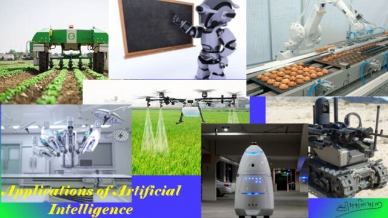{ width="200" }

    ### [100+ High Level AI Usecases and Future Prediction for AI as on 2020](dsblog/100+-AI-Usecases.md)
    
    **Read time:** 15 min
    
    Comprehensive collection of 100+ practical AI use cases across industries including healthcare, finance, retail, manufacturing, and more. Discover how

- 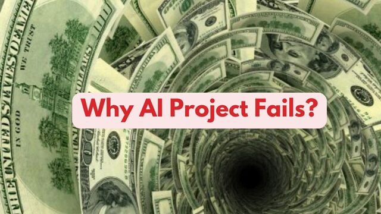{ width="200" }

    ### [20 Reasons Why AI Project Fails](dsblog/20-Reasons-Why-AI-Project-Fails.md)
    
    **Read time:** 7 min
    
    Comprehensive analysis of common reasons behind AI project failures, including technical challenges, management issues, and implementation pitfalls. L
    

- 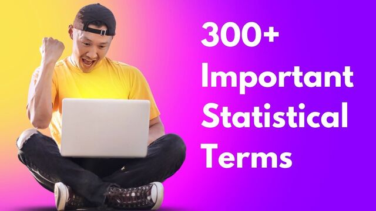{ width="200" }

    ### [300 Important Statistical Terms](dsblog/300-Important-Statistical-Terms.md)
    
    **Read time:** 112 min
    
    Comprehensive glossary of 300+ essential statistical terms and concepts used in data science. From basic probability to advanced statistical inference

- 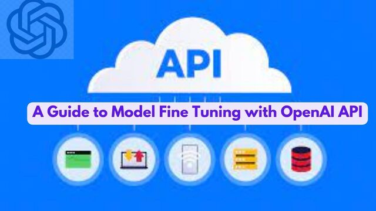{ width="200" }

    ### [A Guide to Model Fine Tuning with OpenAI API](dsblog/A-Guide-to-Model-Fine-Tuning-with-OpenAI-API.md)
    
    **Read time:** 9 min
    
    A practical guide to fine-tuning language models using OpenAI's API. Learn about data preparation, training process, hyperparameter optimization, and 
    

- 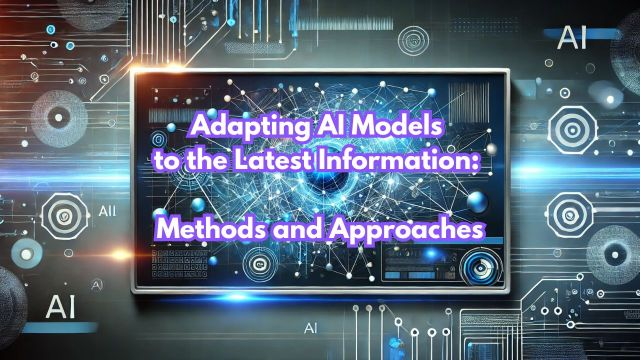{ width="200" }

    ### [Adapting AI Models to the Latest Information: Methods and Approaches](dsblog/Adapting-AI Models-to-the-Latest-Information-Methods and Approaches.md)
    
    **Read time:** 11 min
    
    This article explores the challenges of keeping AI models up-to-date with the latest information and presents various methods and approaches for adapt

- { width="200" }

    ### [AI Imperialism: Western Dominance and the Future of Global Technology ](dsblog/AI Imperialism-Western-Dominance-and-the-Future.md)
    
    **Read time:** 19 min
    
    Exploring the Western dominance in AI development, its implications and the future of global technology.
    

- 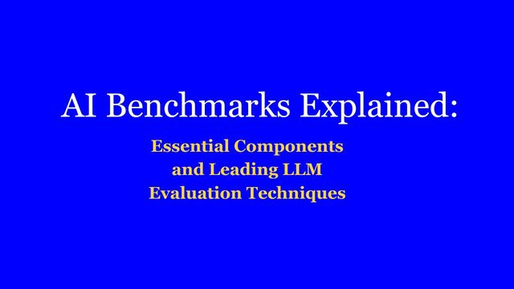{ width="200" }

    ### [AI Benchmarks Explained](dsblog/AI-Benchmarks-Explained.md)
    
    **Read time:** 6 min
    
    A comprehensive guide to understanding AI benchmarks, their importance in evaluating model performance, and key benchmarking frameworks used in the in

- 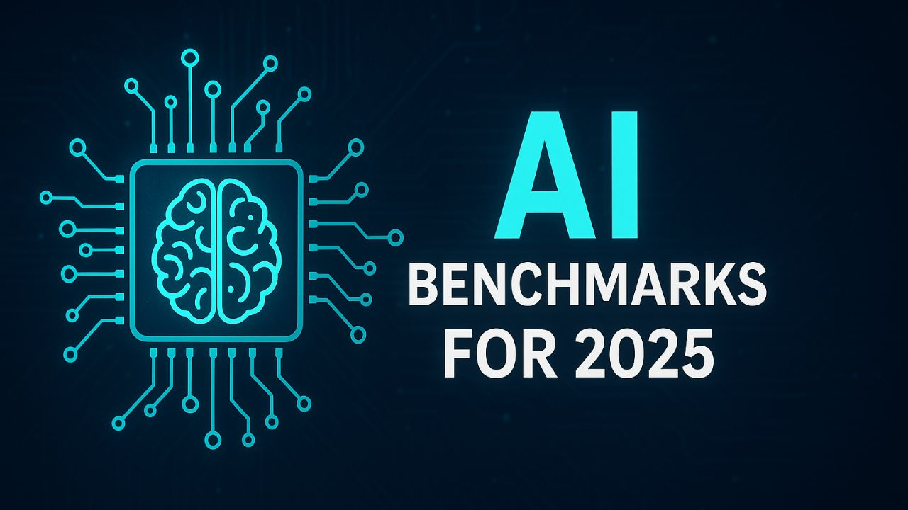{ width="200" }

    ### [AI Benchmarks for 2025](dsblog/AI-Benchmarks-for-2025.md)
    
    **Read time:** 5 min
    
    Explore the meaning and components of AI benchmarks, understand their importance in evaluating AI systems, and discover a comprehensive list of recent
    

- { width="200" }

    ### [AI in Energy Management](dsblog/AI-in-Energy-Management.md)
    
    **Read time:** 5 min
    
    Discover how artificial intelligence is revolutionizing energy management through smart grid optimization, renewable energy integration, and efficient

- { width="200" }

    ### [AI Usecases in Government](dsblog/AI-in-Government.md)
    
    **Read time:** 5 min
    
    Explore the transformative applications of artificial intelligence in government operations. Learn about AI implementations in public services, admini
    

- 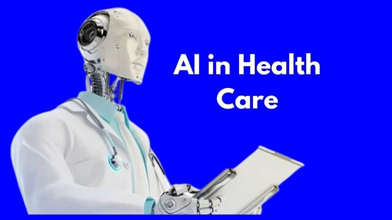{ width="200" }

    ### [AI in Health Care](dsblog/AI-in-Health-Care.md)
    
    **Read time:** 8 min
    
    Explore the transformative impact of artificial intelligence in healthcare. Learn about AI applications in medical diagnosis, treatment planning, pati

- { width="200" }

    ### [AI in School Education](dsblog/AI-in-School-Education.md)
    
    **Read time:** 10 min
    
    Discover how artificial intelligence is transforming school education. Explore innovative applications of AI in teaching, learning assessment, persona
    

- 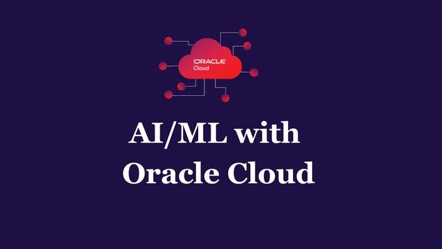{ width="200" }

    ### [AI/ML with Oracle Cloud](dsblog/AI-ML-With-Oracle-Cloud.md)
    
    **Read time:** 31 min
    
    EXCERPT Not Found

- 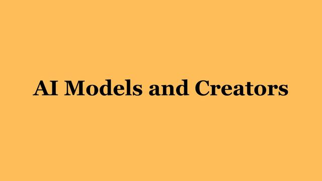{ width="200" }

    ### [AI Models and Creators](dsblog/AI-Models-and-Creators.md)
    
    **Read time:** 11 min
    
    Overview of popular AI models and their creators in industry.
    

- 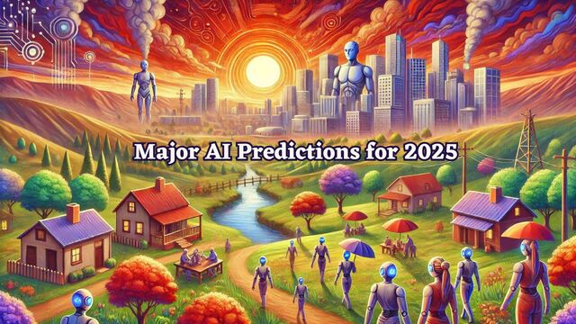{ width="200" }

    ### [AI Predictions for 2025](dsblog/AI-Predictions-for-2025.md)
    
    **Read time:** 5 min
    
    Predictions about the advancements that will be made in the field of Artificial Intelligence in the year 2025.

- { width="200" }

    ### [AI Product Ideas 2025](dsblog/AI-Product-Ideas-2025.md)
    
    **Read time:** 11 min
    
    Explore innovative AI product ideas for 2025, designed to inspire both newcomers and established businesses in the AI landscape.
    

- 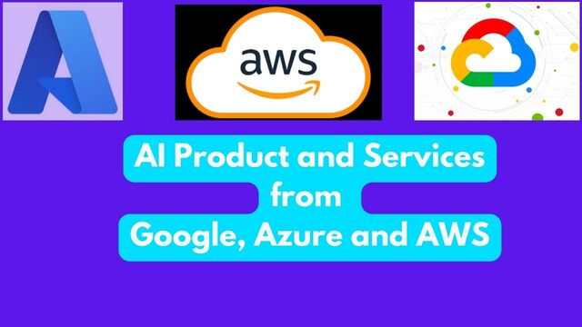{ width="200" }

    ### [AI Product and Services from Google, Azure and AWS](dsblog/AI-Product-Services-from-Google-Azure-AWS.md)
    
    **Read time:** 10 min
    
    A comprehensive comparison of AI and machine learning services offered by major cloud providers - Google Cloud, Microsoft Azure, and Amazon Web Servic

- 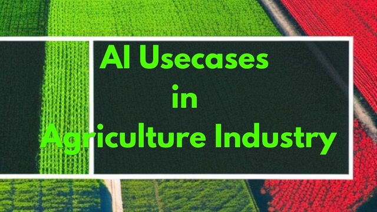{ width="200" }

    ### [AI Usecases in Agriculture Industry](dsblog/AI-usecases-in-Agriculture-Industry.md)
    
    **Read time:** 5 min
    
    EXCERPT Not Found
    

- 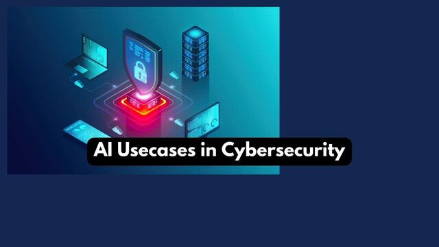{ width="200" }

    ### [AI Usecases in Cybersecurity](dsblog/AI-Usecases-in-Cybersecurity.md)
    
    **Read time:** 6 min
    
    An exploration of artificial intelligence applications in cybersecurity, including threat detection, network protection, and ethical considerations in

- 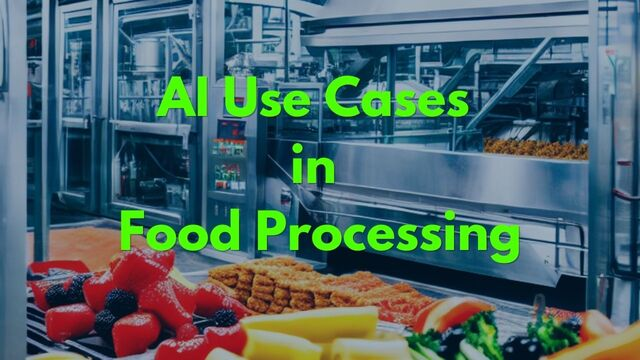{ width="200" }

    ### [AI Use Cases in Food Processing](dsblog/AI-usecases-in-Food-Processing.md)
    
    **Read time:** 5 min
    
    Explore innovative AI applications in the food processing industry, from automated quality control and safety inspection to process optimization and s
    

- 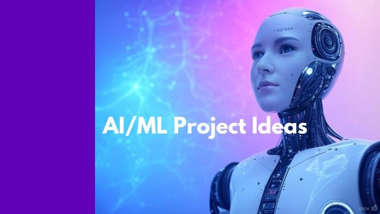{ width="200" }

    ### [AI ML Project Ideas](dsblog/AIML-Project-Ideas.md)
    
    **Read time:** 9 min
    
    Discover forward-thinking AI project ideas for 2025, aimed to inspire both new entrants and seasoned players in the AI field.

- { width="200" }

    ### [All About AI Hype](dsblog/All-About-AI-Hype.md)
    
    **Read time:** 10 min
    
    Examine the reality behind AI hype and its impact on society. Explore the balance between AI's transformative potential and realistic expectations, wh
    

- { width="200" }

    ### [All about Hashing](dsblog/All-about-Hashing.md)
    
    **Read time:** 7 min
    
    Dive into the world of cryptographic hashing. Understand different hashing algorithms, their applications in data security, and best practices for ens

- 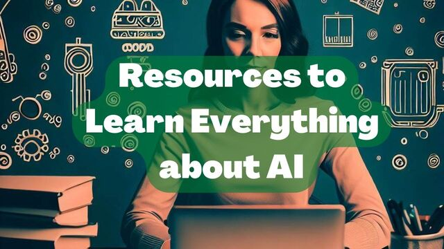{ width="200" }

    ### [All Resources to Learn Data Science](dsblog/All-Resources-to-Learn-Data-Science.md)
    
    **Read time:** 5 min
    
    EXCERPT Not Found
    

- 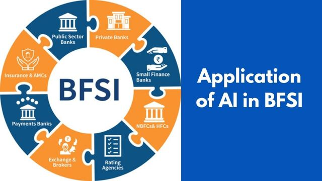{ width="200" }

    ### [Application of AI in BFSI](dsblog/Application-of-AI-in-BFSI.md)
    
    **Read time:** 5 min
    
    Explore the transformative applications of AI in Banking, Financial Services, and Insurance (BFSI) sector. Discover how artificial intelligence is rev

- 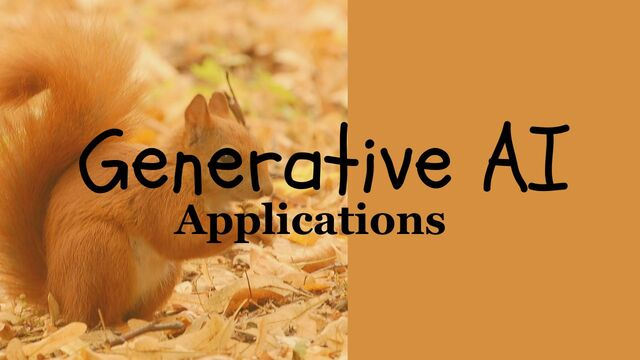{ width="200" }

    ### [Applications of GenAI](dsblog/Applications-of-GenAI.md)
    
    **Read time:** 10 min
    
    EXCERPT Not Found
    

- 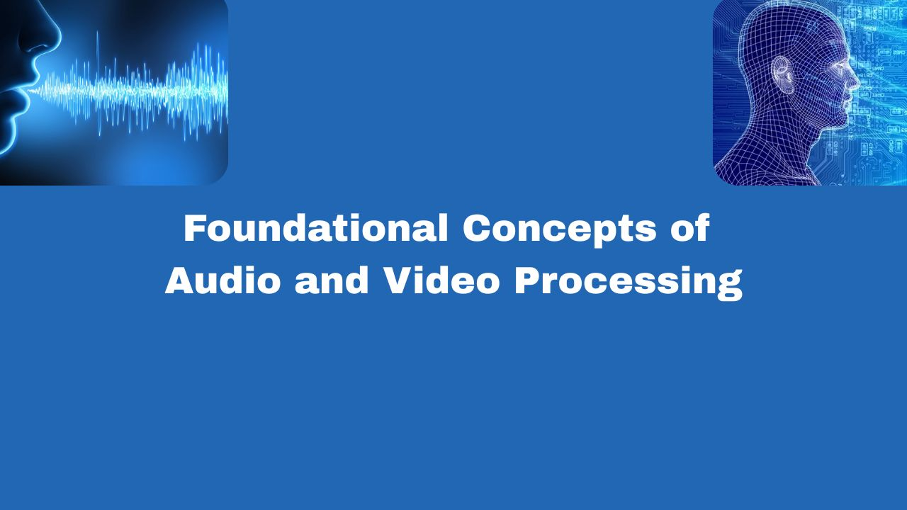{ width="200" }

    ### [Audio Video Processing Concepts](dsblog/Audio-Video-Processing-Concepts.md)
    
    **Read time:** 7 min
    
    Learn the foundation of audio and video processing, including digital signal processing, image processing, and computer vision. Understand the concept

- 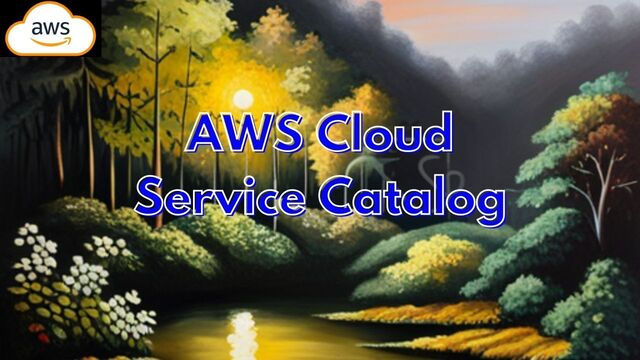{ width="200" }

    ### [A Comprehensive Guide to 210+ AWS Services](dsblog/AWS-Cloud-Services.md)
    
    **Read time:** 30 min
    
    An extensive guide to over 210 Amazon Web Services (AWS) cloud offerings. Explore AWS's comprehensive ecosystem of services spanning compute, storage,
    

- 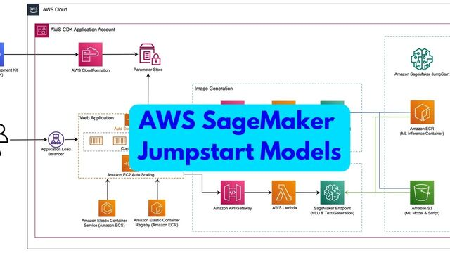{ width="200" }

    ### [AWS SageMaker Jumpstart Models](dsblog/AWS-Sagemaker-Jumpstart-Models.md)
    
    **Read time:** 49 min
    
    An overview of AWS SageMaker Jumpstart Models, exploring their capabilities, developers, and hosting details.

- { width="200" }

    ### [Unlocking the Power of Azure- Exploring 300+ Cloud Services and Their Purposes](dsblog/Azure-Services.md)
    
    **Read time:** 39 min
    
    A comprehensive guide to over 300 Microsoft Azure cloud services and their purposes. Explore Azure's vast ecosystem of services across categories incl
    

- 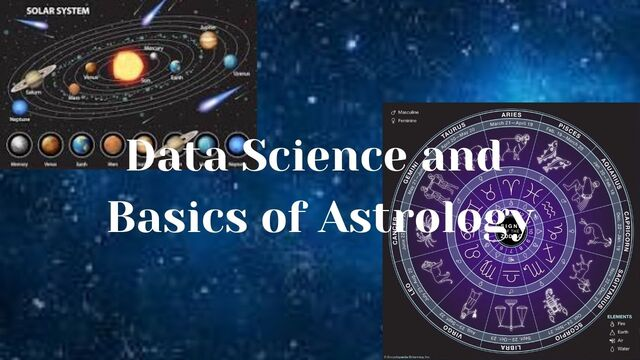{ width="200" }

    ### [Data Science and Basics of Astrology](dsblog/Basics-of-Astrology.md)
    
    **Read time:** 16 min
    
    Explore the intersection of data science and astrology. Learn how modern computational methods can be applied to ancient astrological principles, and 

- 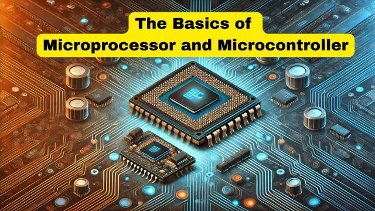{ width="200" }

    ### [The Basics of Microprocessor and Microcontroller](dsblog/Basics-of-Microcessor-and-Microcontroller.md)
    
    **Read time:** 10 min
    
    Discover the essentials of microprocessors and microcontrollers, their key components, and applications in embedded systems. Learn how these integrate
    

- 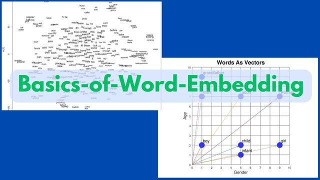{ width="200" }

    ### [Basics of Word Embedding](dsblog/Basics-of-Word-Embedding.md)
    
    **Read time:** 13 min
    
    An introduction to word embeddings in natural language processing. Learn about different techniques for converting words into numerical vectors, inclu

- 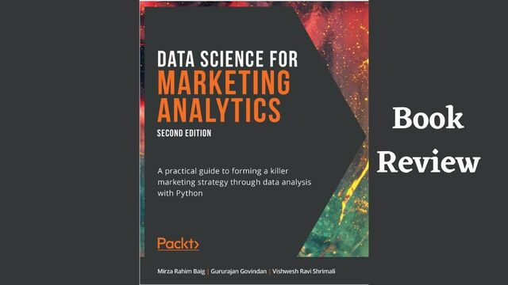{ width="200" }

    ### [Book Review - Data Science in Marketing Analysis](dsblog/Book-Data-Science-for-Marketing-Analytics.md)
    
    **Read time:** 5 min
    
    Comprehensive review of 'Data Science for Marketing Analytics' book. Learn how to apply data science techniques for customer segmentation, predictive 
    

- { width="200" }

    ### [Books on Consciousness](dsblog/Books-on-Conciousness.md)
    
    **Read time:** 53 min
    
    A curated collection of influential books exploring consciousness, the philosophy of mind, and spiritual science. Discover key works from renowned aut

- 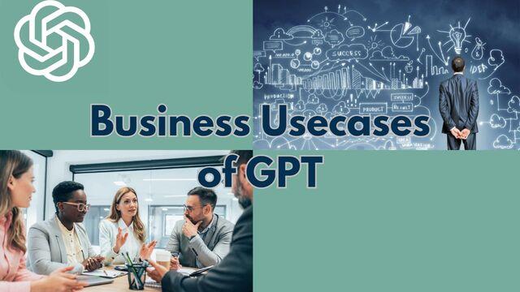{ width="200" }

    ### [Business Usecases of GPT](dsblog/Business-Usecases-of-GPT.md)
    
    **Read time:** 9 min
    
    Explore real-world business applications and use cases of GPT (Generative Pre-trained Transformer) technology across various industries. Learn how com
    

- 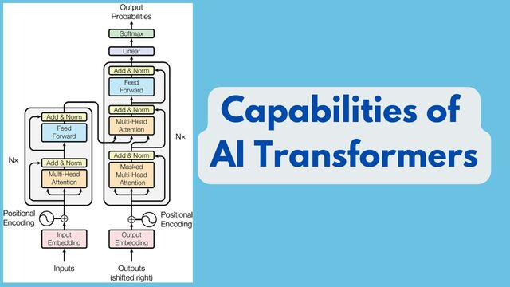{ width="200" }

    ### [Capabilities of AI Transformers](dsblog/Capabilities-of-AI-Transformers.md)
    
    **Read time:** 30 min
    
    A comprehensive overview of AI Transformer capabilities, exploring various transformer architectures and their applications in NLP, computer vision, a

- 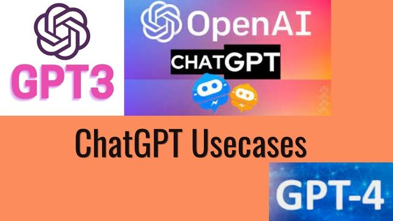{ width="200" }

    ### [ChatGPT Usecases](dsblog/ChatGPT-Usecases.md)
    
    **Read time:** 8 min
    
    Explore practical applications and use cases of ChatGPT across various industries. Learn how this revolutionary AI language model is transforming busi
    

- 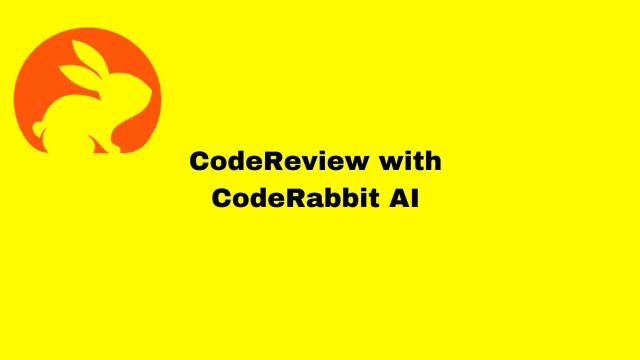{ width="200" }

    ### [CodeReview with CodeRabbit AI - A Better Way to Automate Code Reviews](dsblog/CodeReview-with-CodeRabbit.md)
    
    **Read time:** 8 min
    
    CodeRabbit AI is an AI powered code reviewer that automates code reviews and helps developers identify potential issues and maintain high-quality code

- 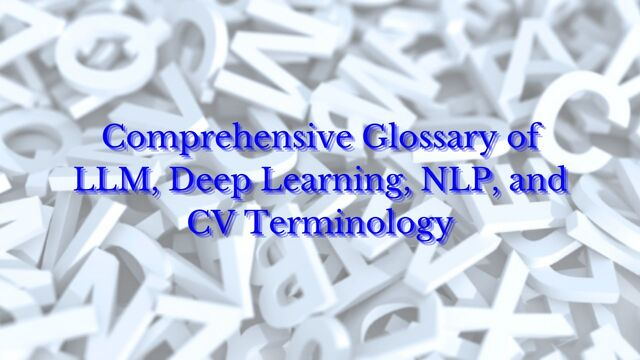{ width="200" }

    ### [Comprehensive Glossary of LLM, Deep Learning, NLP, and CV Terminology](dsblog/Comprehensive-Glossary-of-LLM.md)
    
    **Read time:** 17 min
    
    A comprehensive glossary of technical terms and concepts in Large Language Models (LLM), Deep Learning, Natural Language Processing (NLP), and Compute
    

- 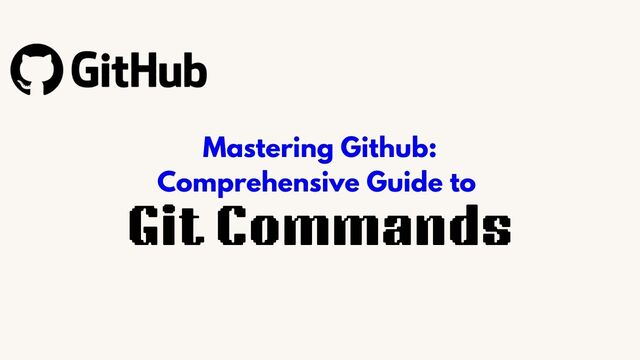{ width="200" }

    ### [Mastering Git: Comprehensive Guide to Git Commands](dsblog/Comprehensive-Guide-to-Git-Commands.md)
    
    **Read time:** 17 min
    
    EXCERPT Not Found

- 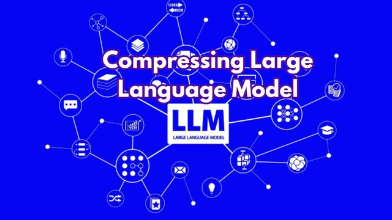{ width="200" }

    ### [Compressing Large Language Model](dsblog/Compressing-LLM.md)
    
    **Read time:** 21 min
    
    Explore techniques and strategies for compressing large language models (LLMs). Learn about quantization, knowledge distillation, pruning, and other m
    

- 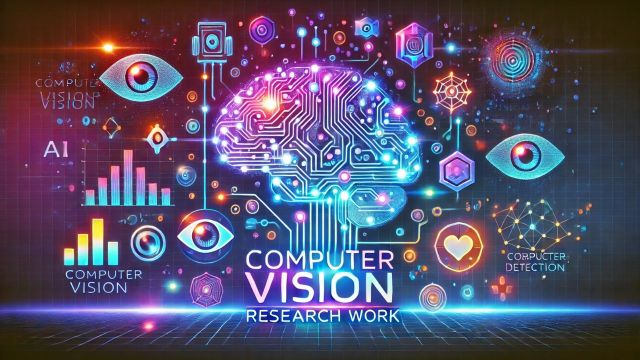{ width="200" }

    ### [Computer Vision Research Work](dsblog/Computer-Vision-Research-Work.md)
    
    **Read time:** 40 min
    
    Explore the advancements in computer vision research, highlighting key papers and breakthroughs in the field.

- 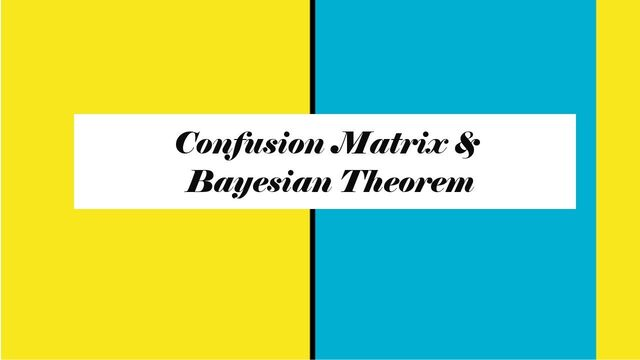{ width="200" }

    ### [Confusion Matrix Bayesian Theorem](dsblog/Confusion-Matrix-Bayesian-Theorem.md)
    
    **Read time:** 5 min
    
    Detailed explanation of confusion matrix and Bayesian theorem in machine learning. Learn how to evaluate classification models using various metrics i
    

- 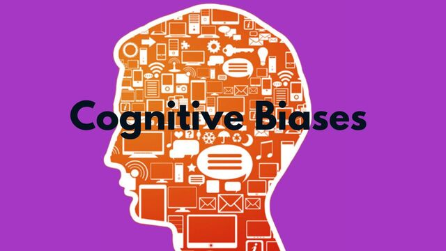{ width="200" }

    ### [Cognitive Biases](dsblog/Congnitive-Biases.md.md)
    
    **Read time:** 33 min
    
    A comprehensive guide to cognitive biases, exploring how these systematic patterns of deviation from rational judgment affect our thinking and decisio

- 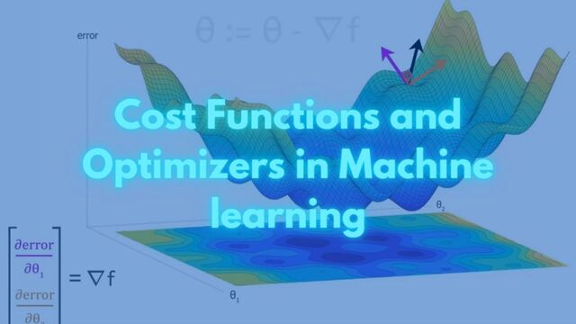{ width="200" }

    ### [Cost Functions and Optimizers in Machine Learning](dsblog/Cost-Functions-and-Optimizers-in-Machine-Learning.md)
    
    **Read time:** 21 min
    
    A detailed exploration of cost functions and optimization algorithms in machine learning, covering various loss functions, gradient descent methods, a
    

- 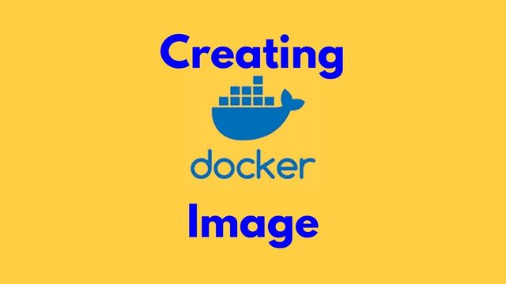{ width="200" }

    ### [Creating Docker Image](dsblog/Creating-Docker-Image.md)
    
    **Read time:** 6 min
    
    Learn how to create and manage Docker images effectively. Understand Dockerfile syntax, image building process, and best practices for containerizing 

- 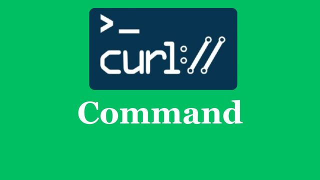{ width="200" }

    ### [curl Commands](dsblog/curl-commands.md)
    
    **Read time:** 16 min
    
    curl is a powerful command-line tool for transferring data to and from servers using various protocols like HTTP, HTTPS, FTP, etc. This post provides 
    

- 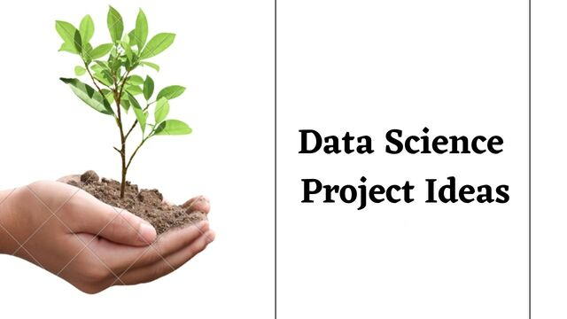{ width="200" }

    ### [Data Science/AI Projects Project Ideas](dsblog/Data-Science-Project-Idea.md)
    
    **Read time:** 5 min
    
    Extensive collection of practical project ideas for data science and AI enthusiasts. From machine learning and deep learning to NLP and computer visio

- 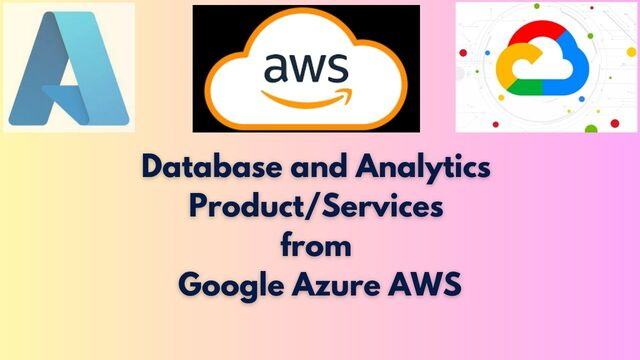{ width="200" }

    ### [Database and Analytics Product Services from Google Azure AWS](dsblog/Database-and-Analytics-Product-Services-from-Google-Azure-AWS.md)
    
    **Read time:** 8 min
    
    A detailed comparison of database and analytics services offered by major cloud providers. Explore various database options, data warehousing solution
    

- 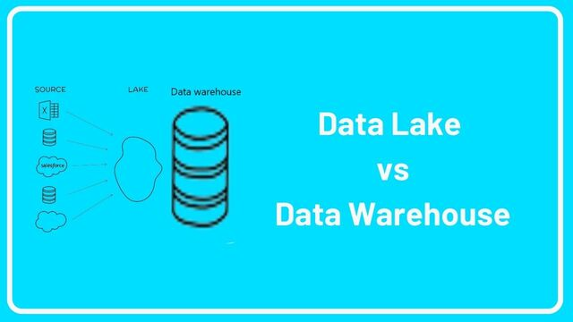{ width="200" }

    ### [Data Lake vs Data Warehouse vs Data Mart](dsblog/Datalake-vs-Data-Warehouse.md)
    
    **Read time:** 6 min
    
    A comprehensive comparison of data lakes, data warehouses, and data marts, exploring their key differences, use cases, and benefits. Learn about moder

- 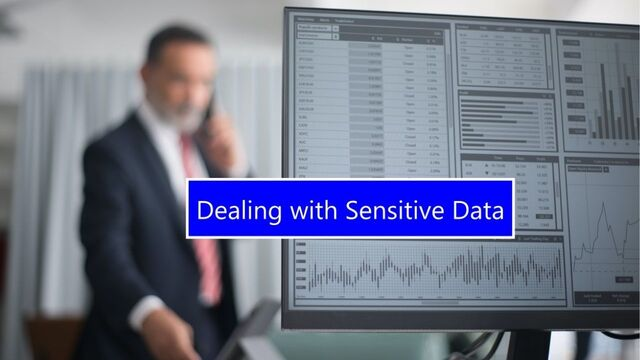{ width="200" }

    ### [Dealing with Sensitive Data](dsblog/Dealing-with-Sensitive-Data.md)
    
    **Read time:** 5 min
    
    A comprehensive guide to handling sensitive data in data science and business applications. Learn essential strategies including data anonymization, e
    

- 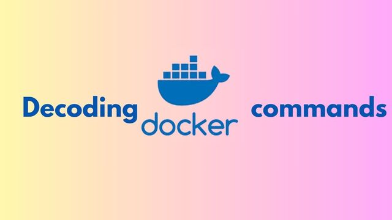{ width="200" }

    ### [Decoding docker commands](dsblog/Decoding-docker-commands.md)
    
    **Read time:** 25 min
    
    A comprehensive guide to understanding and using Docker commands. Learn about container management, image building, deployment, and best practices for

- 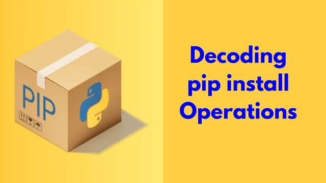{ width="200" }

    ### [Decoding pip install operations](dsblog/Decoding-pip-install-operations.md)
    
    **Read time:** 18 min
    
    Master Python package management with pip. Learn about package installation, dependency management, virtual environments, and best practices for maint
    

- 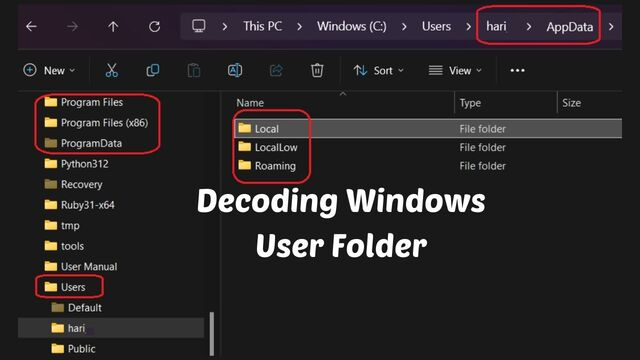{ width="200" }

    ### [Decoding Windows User Folder](dsblog/Decoding-Windows-User-Folder.md)
    
    **Read time:** 6 min
    
    Understand the structure and purpose of Windows user folders. Learn about AppData directories, user profiles, and how Windows organizes user-specific 

- 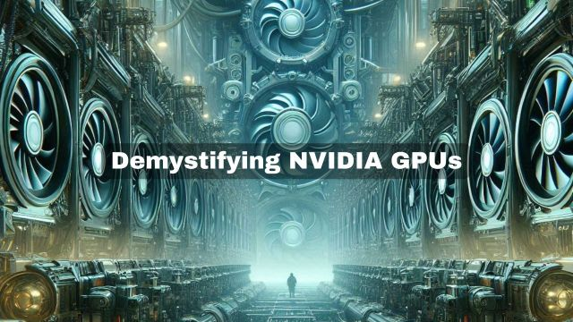{ width="200" }

    ### [Demystifying NVIDIA GPUs](dsblog/Demystify-NVIDIA-GPUs.md)
    
    **Read time:** 9 min
    
    Understand different types of NVIDIA GPUs and their naming convention.
    

- 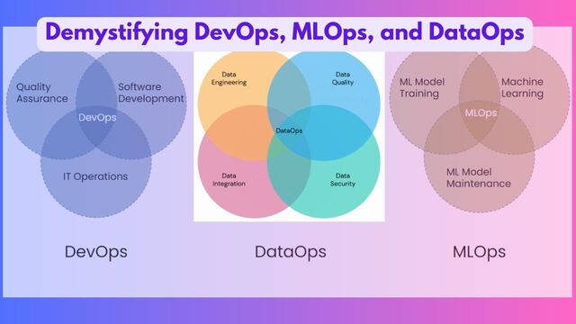{ width="200" }

    ### [Demystifying DevOps, MLOps, and DataOps](dsblog/Demystifying-DevOps-MLOps-and-DataOps.md)
    
    **Read time:** 9 min
    
    A comprehensive comparison of DevOps, MLOps, and DataOps methodologies, exploring their key differences, components, and best practices. Learn how the

- 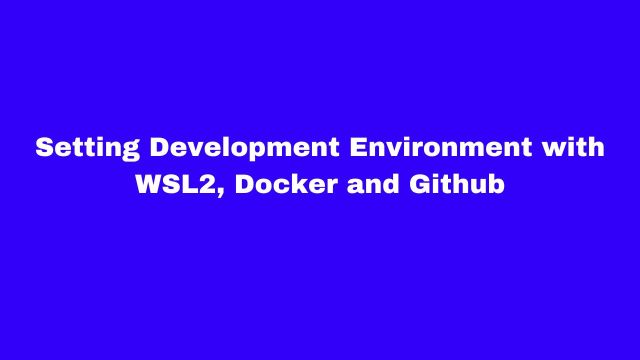{ width="200" }

    ### [Setting Up a Development Environment with Windows 11, WSL2 and Docker](dsblog/DevEnvironment-with-Windows+WSL2+Docker.md)
    
    **Read time:** 7 min
    
    In this article, we explore the steps to set up a development environment on Windows 11 using WSL2 and Docker. We also discuss the advantages of using
    

- 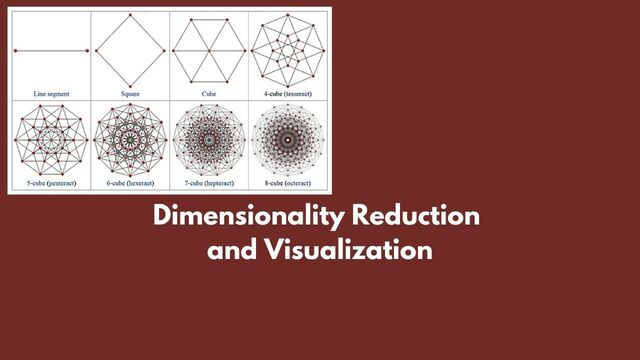{ width="200" }

    ### [Dimensionality Reduction and Visualization](dsblog/Dimensionality-Reduction-and-Visualization.md)
    
    **Read time:** 15 min
    
    Explore techniques for reducing data dimensions and creating meaningful visualizations. Learn about PCA, t-SNE, UMAP, and other methods for effective 

- 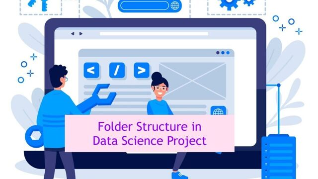{ width="200" }

    ### [Folder Structure for ML Project](dsblog/Directory-Structure-of-ML-Project.md)
    
    **Read time:** 13 min
    
    Guide to organizing machine learning projects with an efficient directory structure. Learn best practices for code organization, model deployment, and
    

- 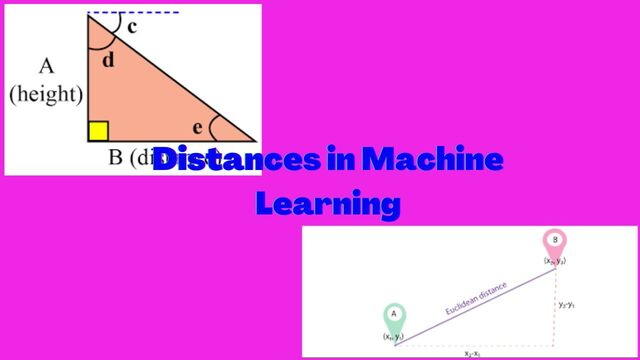{ width="200" }

    ### [Distances in Machine Learning](dsblog/Distances-in-Machine-Learning.md)
    
    **Read time:** 5 min
    
    An in-depth exploration of various distance metrics used in machine learning. Learn about different types of distances, their mathematical foundations

- { width="200" }

    ### [Domain Knowledge in Machine Learning](dsblog/Domain-Knowledge-for-Machine-Learning.md)
    
    **Read time:** 5 min
    
    Explore the crucial role of domain knowledge in machine learning projects. Learn how industry expertise enhances feature engineering, model developmen
    

- 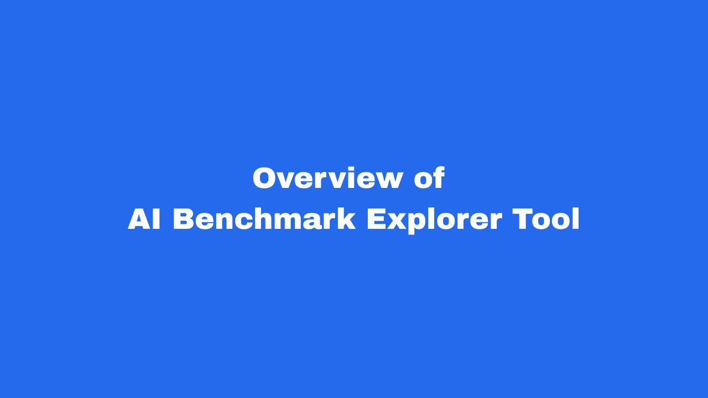{ width="200" }

    ### [Overview of AI Benchmark Explorer Tool](dsblog/DSR-AI-Benchmark-Explorer.md)
    
    **Read time:** 5 min
    
    The AI Benchmark Explorer is an interactive platform to explore and compare benchmark datasets and leaderboards from Papers With Code. It offers users

- { width="200" }

    ### [AI, ML, DL Blogs Sites](dsblog/DSR-AI-ML-Blogs.md)
    
    **Read time:** 13 min
    
    Curated collection of top AI, Machine Learning, and Deep Learning blogs and websites. Stay updated with the latest trends, tutorials, and insights fro
    

- 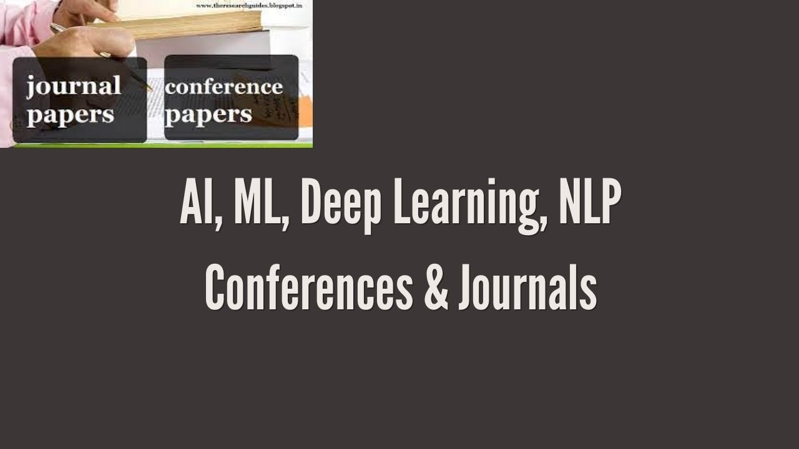{ width="200" }

    ### [AI, ML, Deep Learning, NLP Conferences & Journals](dsblog/DSR-AI-ML-Conferences-and-Journals.md)
    
    **Read time:** 5 min
    
    Comprehensive guide to top AI, Machine Learning, Deep Learning, and NLP conferences and journals. Essential resource for researchers and practitioners

- { width="200" }

    ### [AI ML Resources from My Diary](dsblog/DSR-AI-ML-Resources-from-My-Diary.md)
    
    **Read time:** 49 min
    
    A curated collection of AI and ML resources from personal research and learning journey. Features valuable references, tools, frameworks, and educatio
    

- { width="200" }

    ### [AI Resources: Ultimate Collection of Cutting-Edge Tools for AI Enthusiasts](dsblog/DSR-AI-Resources.md)
    
    **Read time:** 9 min
    
    In this article, we have curated an extensive collection of 1000+ of cutting-edge AI tools and resources across diverse categories. Whether you’re a j

- 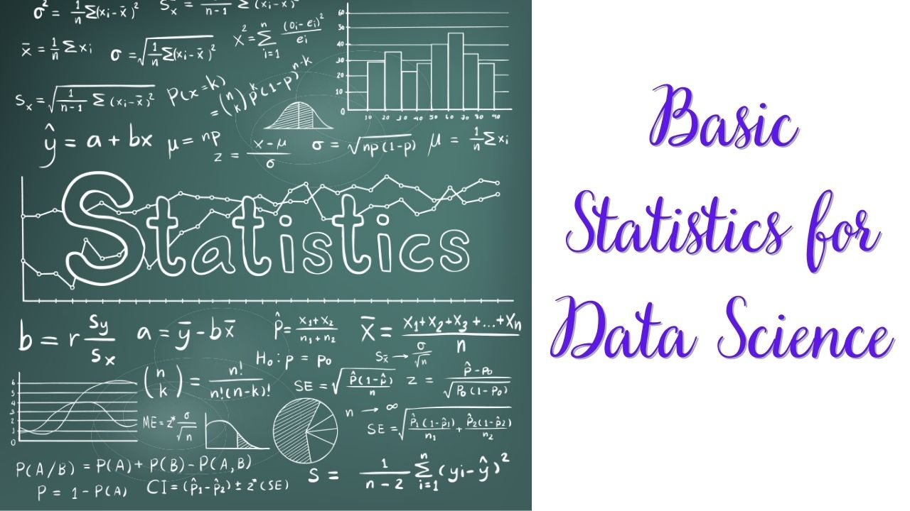{ width="200" }

    ### [Basic Statistics for Data Science](dsblog/DSR-Basic-Statistics-for-Data-Science.md)
    
    **Read time:** 5 min
    
    Essential guide to basic statistics concepts for data science. Learn fundamental statistical methods, probability theory, and analytical techniques cr
    

- 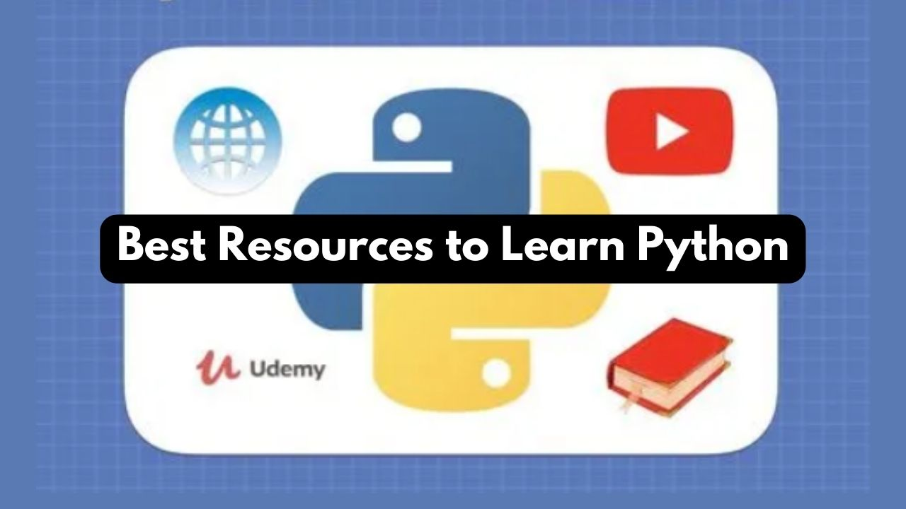{ width="200" }

    ### [Best Resources to Learn Python](dsblog/DSR-Best-Resources-to-Learn-Python.md)
    
    **Read time:** 5 min
    
    Comprehensive collection of the best resources for learning Python programming - from beginner tutorials to advanced courses, documentation, and pract

- 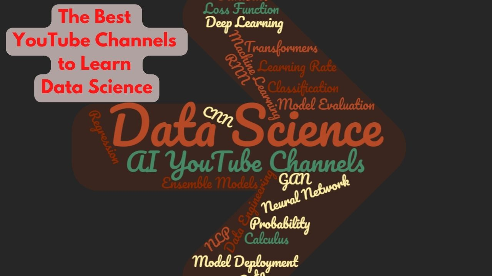{ width="200" }

    ### [Best YouTube Channels to Learn Data Science](dsblog/DSR-Best-Youtube-Channels-to-Learn-Data-Science.md)
    
    **Read time:** 53 min
    
    Curated list of top YouTube channels for learning data science, machine learning, and AI. Find quality educational content from expert instructors cov
    

- 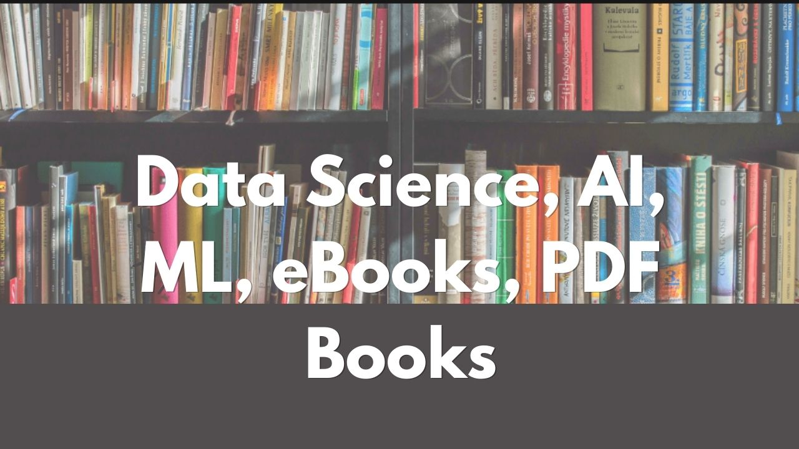{ width="200" }

    ### [Data Science, AI, ML, eBooks, PDF Books](dsblog/DSR-Data-Science-Books.md)
    
    **Read time:** 64 min
    
    Extensive collection of data science, AI, and machine learning books and educational resources. Find comprehensive learning materials from beginner to

- 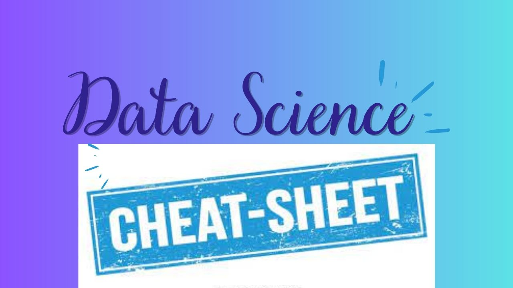{ width="200" }

    ### [Data Science Cheatsheets](dsblog/DSR-Data-Science-Cheatsheets.md)
    
    **Read time:** 5 min
    
    Essential collection of data science cheatsheets covering Python libraries (Pandas, NumPy, Scikit-learn), statistics, machine learning algorithms, dat
    

- 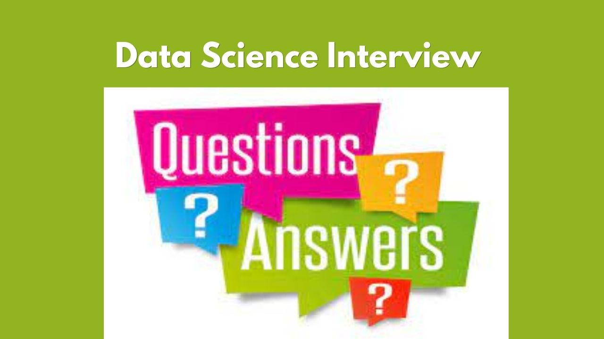{ width="200" }

    ### [Data Science Interview Question Answers](dsblog/DSR-Data-Science-Interview-Question-Answers.md)
    
    **Read time:** 7 min
    
    Comprehensive guide to data science interview preparation, covering technical questions in machine learning, statistics, SQL, and programming. Feature

- 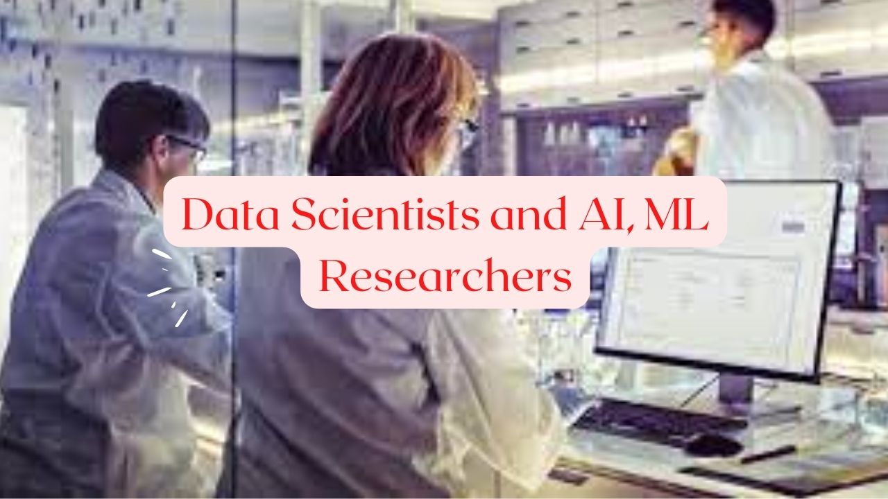{ width="200" }

    ### [Data Scientists and AI, ML Researchers](dsblog/DSR-Data-Scientists-and-AI-ML-Researchers.md)
    
    **Read time:** 6 min
    
    Directory of prominent data scientists, AI researchers, and machine learning experts. Discover leading professionals and their contributions to the fi
    

- 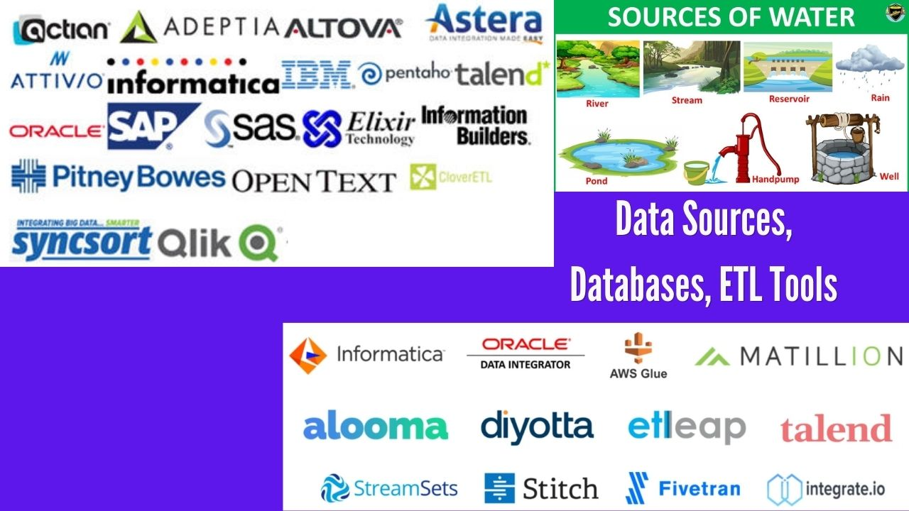{ width="200" }

    ### [Navigating the Data Landscape: Exploring Data Sources, Databases, and ETL Tools for Machine Learning Projects](dsblog/DSR-Data-Sources-Databases-ETL-Tools.md)
    
    **Read time:** 7 min
    
    Comprehensive guide to data sources, databases, and ETL tools essential for machine learning projects. Learn about various data integration solutions 

- 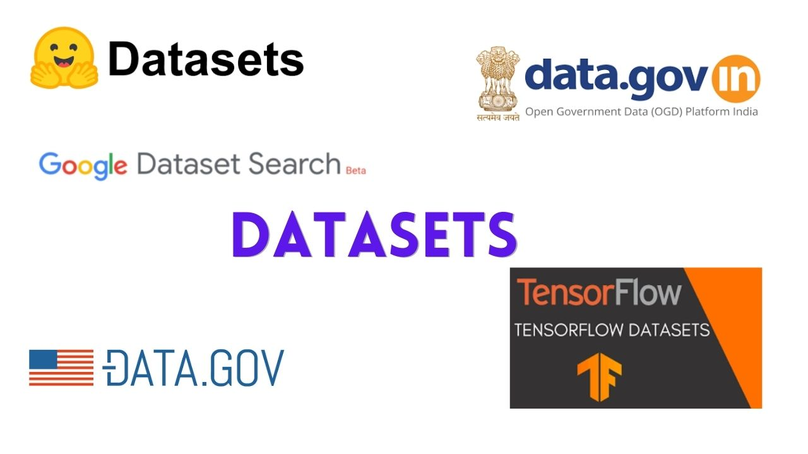{ width="200" }

    ### [Thousands of Machine Learning Datasets  ](dsblog/DSR-Datasets.md)
    
    **Read time:** 28 min
    
    Extensive collection of machine learning datasets from various domains including computer vision, NLP, speech recognition, and more. Find the perfect 
    

- { width="200" }

    ### [DS, AI, ML Online Course, Tutorial, Videos](dsblog/DSR-DS-AI-ML-Online-Course-Tutorial-Videos.md)
    
    **Read time:** 12 min
    
    Comprehensive collection of online courses, tutorials, and video resources for learning Data Science, AI, and Machine Learning. Find the best educatio

- 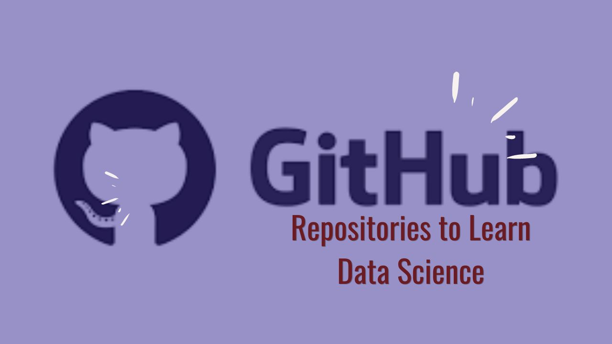{ width="200" }

    ### [Github Repos for Data Science](dsblog/DSR-Github-Repos-for-DataScience.md)
    
    **Read time:** 20 min
    
    Curated collection of valuable GitHub repositories for data science and machine learning. Find essential tools, frameworks, and example projects to en
    

- 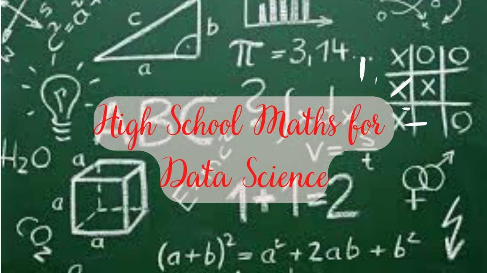{ width="200" }

    ### [High School Maths for Data Science](dsblog/DSR-High-School-Maths-for-Data-Science.md)
    
    **Read time:** 30 min
    
    Essential high school mathematics concepts required for data science. A comprehensive guide covering algebra, geometry, trigonometry, and basic calcul

- 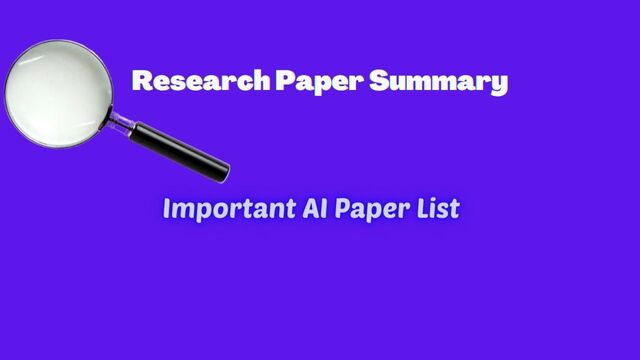{ width="200" }

    ### [Important AI Paper List](dsblog/DSR-Important-AI-Paper-List.md)
    
    **Read time:** 31 min
    
    A curated collection of influential research papers in artificial intelligence, machine learning, and deep learning. This comprehensive list includes 
    

- { width="200" }

    ### [Important AI Research Papers](dsblog/DSR-Important-AI-Research-Papers.md)
    
    **Read time:** 5 min
    
    Curated collection of groundbreaking AI research papers that shaped the field of artificial intelligence. Features seminal works in deep learning, com

- 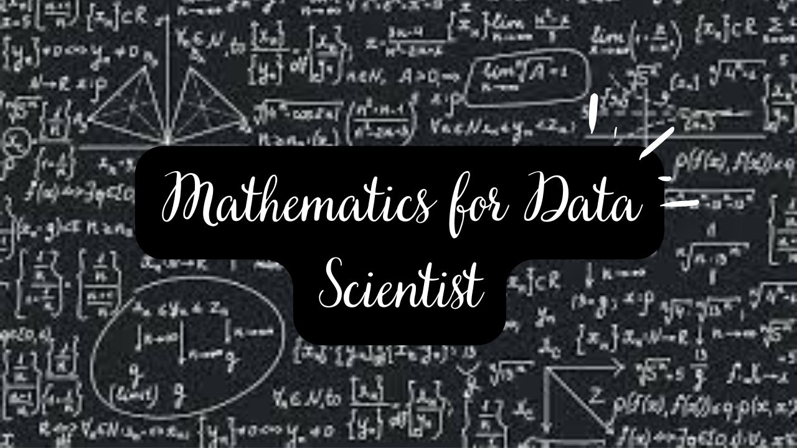{ width="200" }

    ### [Mathematics for Data Scientist](dsblog/DSR-Mathematics-in-Data-Science.md)
    
    **Read time:** 5 min
    
    In-depth exploration of essential mathematical concepts required for data science and machine learning. Covers linear algebra, calculus, statistics, a
    

- 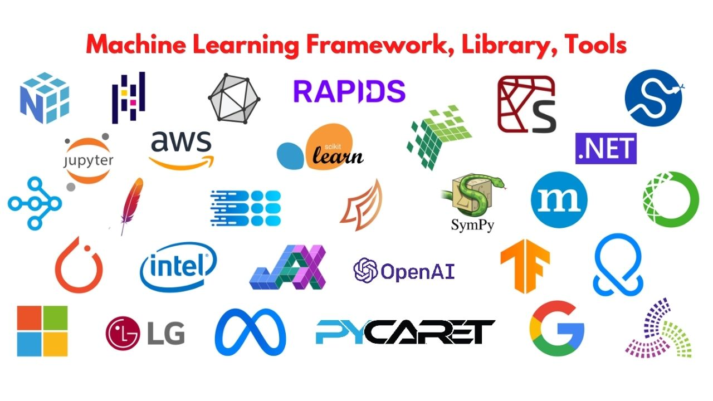{ width="200" }

    ### [Machine Learning Framework, Library, Tools](dsblog/DSR-ML-Frameworks-Libraries-Tools.md)
    
    **Read time:** 17 min
    
    A comprehensive overview of popular machine learning frameworks, libraries, and tools.

- 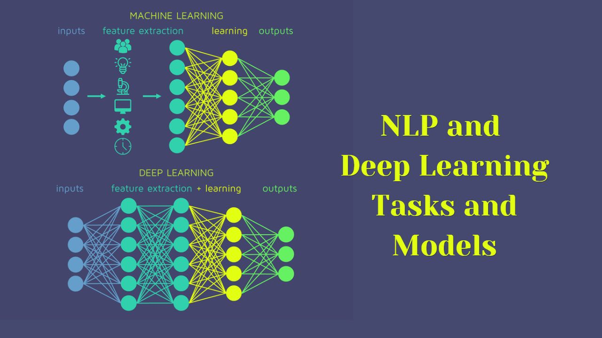{ width="200" }

    ### [Machine Learning Tasks and Model Evaluation](dsblog/DSR-ML-Tasks-and-Model-Evaluation.md)
    
    **Read time:** 19 min
    
    Comprehensive guide to machine learning tasks and model evaluation metrics. Learn about BLEU scores, GLUE benchmarks, and other essential metrics for 
    

- { width="200" }

    ### [My Daily Tools](dsblog/DSR-My-Daily-Tools.md)
    
    **Read time:** 13 min
    
    A comprehensive collection of essential software tools and applications used daily for productivity, project management, design, SEO, and AI tasks. Fi

- { width="200" }

    ### [My Favorite Chrome Extensions](dsblog/DSR-My-Favorite-Chrome-Extensions.md)
    
    **Read time:** 6 min
    
    A curated list of essential Chrome extensions for developers, researchers, and productivity enthusiasts. Discover tools that enhance your browsing exp
    

- { width="200" }

    ### [Bookmark Blog Articles from Browser](dsblog/DSR-myBookmark-Blog-Articles.md)
    
    **Read time:** 17 min
    
    Explore a curated collection of bookmarked articles covering data science, AI, technology, and development. This list serves as a personal repository 

- 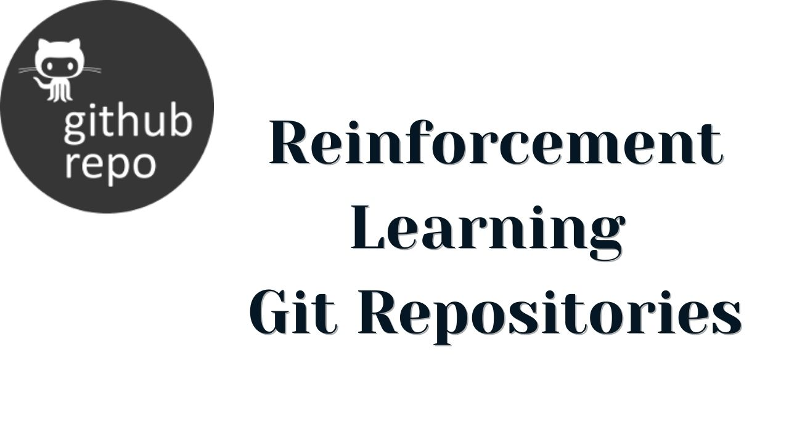{ width="200" }

    ### [Reinforcement Learning Git Repositories](dsblog/DSR-Reinforcement-Learning-Repositories.md)
    
    **Read time:** 5 min
    
    A comprehensive collection of essential Reinforcement Learning (RL) repositories on GitHub, featuring production-ready implementations, research frame
    

- 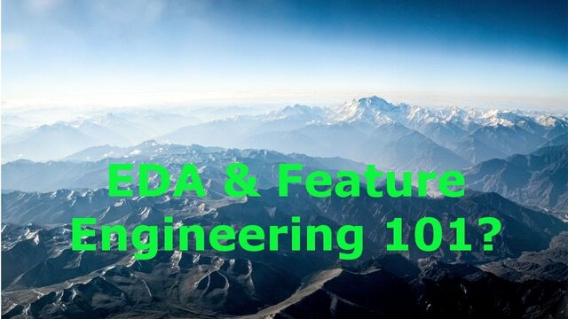{ width="200" }

    ### [EDA & Feature Engineering 101](dsblog/EDA-Feature-Engineering-101.md)
    
    **Read time:** 19 min
    
    Comprehensive guide to Exploratory Data Analysis (EDA) and Feature Engineering fundamentals. Learn essential techniques for data preprocessing, visual

- 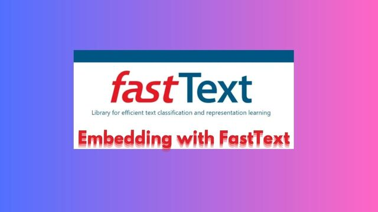{ width="200" }

    ### [Embedding with FastText](dsblog/Embedding-with-FastText.md)
    
    **Read time:** 9 min
    
    Explore FastText word embeddings for natural language processing tasks. Learn about its advantages, implementation, and comparison with other embeddin
    

- 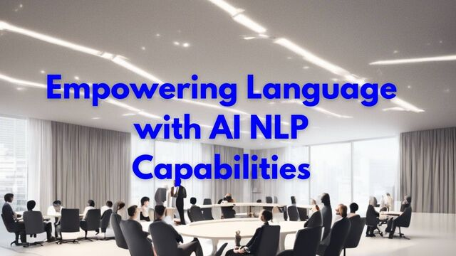{ width="200" }

    ### [Empowering Language with AI NLP Capabilities](dsblog/Empowering-Language-with-AI-NLP-Capabilities.md)
    
    **Read time:** 5 min
    
    Explore the diverse capabilities of AI-powered Natural Language Processing. Learn about various NLP technologies and applications that are transformin

- 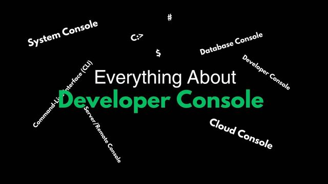{ width="200" }

    ### [Everything About Developer Console](dsblog/Everything-About-Console.md)
    
    **Read time:** 5 min
    
    EXCERPT Not Found
    

- 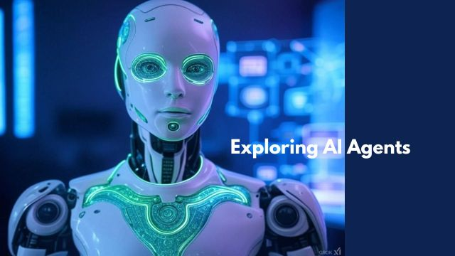{ width="200" }

    ### [Exploring AI Agents](dsblog/Exploring-AI-Agents.md)
    
    **Read time:** 12 min
    
    Delve into the world of AI agents, workflows, and systems, and discover their roles in the evolving AI landscape.

- 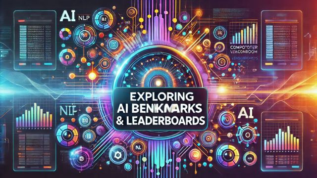{ width="200" }

    ### [Exploring AI Benchmarks & Leaderboards](dsblog/Exploring-AI-Benchmarks-and-Leaderboards.md)
    
    **Read time:** 24 min
    
    Investigate the role of benchmarks and leaderboards in evaluating AI models, focusing on performance metrics and industry standards.
    

- 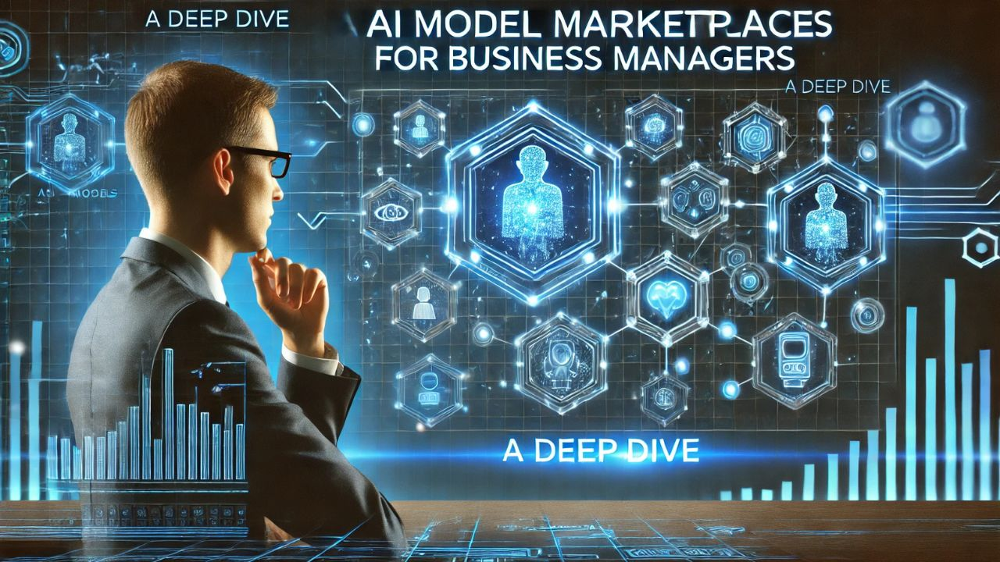{ width="200" }

    ### [A Deep Dive into AI Model Marketplaces for Business Managers](dsblog/Exploring-AI-Marketplaces.md)
    
    **Read time:** 6 min
    
    In this article, we'll dive into the world of AI model marketplaces, exploring what they are, how they work, and the key benefits they offer. We'll al

- 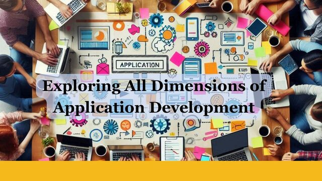{ width="200" }

    ### [Exploring All Dimensions of Application Development](dsblog/Exploring-All-Dimensions-of-Application-Development.md)
    
    **Read time:** 6 min
    
    A comprehensive exploration of modern application development, covering essential aspects from DevOps and CI/CD to edge computing and emerging technol
    

- 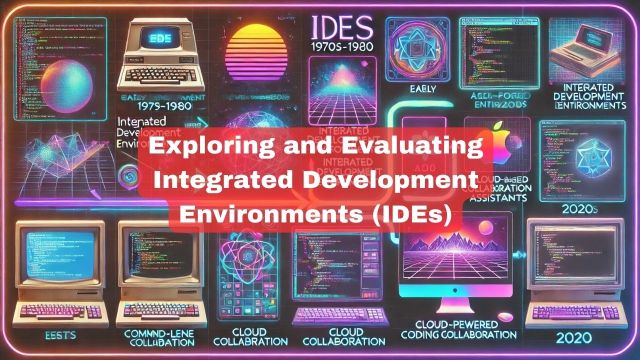{ width="200" }

    ### [Exploring and Evaluating Integrated Development Environments (IDEs)](dsblog/Exploring-and-Evaluating-IDEs.md)
    
    **Read time:** 13 min
    
    Understand the evolution of Integrated Development Environments (IDEs) and how to evaluate the best one for your needs. We will explore how AI will sh

- { width="200" }

    ### [Exploring AnythingLLM](dsblog/Exploring-Anythingllm.md)
    
    **Read time:** 15 min
    
    A comprehensive guide to understanding and implementing AnythingLLM, an open-source platform for creating personalized language models and knowledge d
    

- 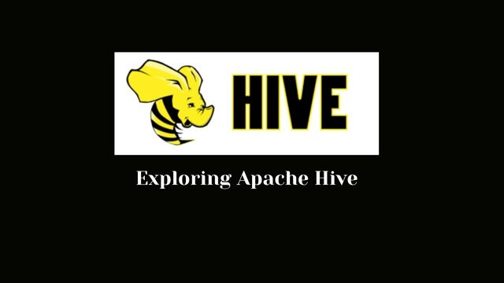{ width="200" }

    ### [Exploring Apache Hive](dsblog/Exploring-Apache-Hive.md)
    
    **Read time:** 15 min
    
    A comprehensive guide to Apache Hive, exploring its features, architecture, and applications in big data processing. Learn about ACID transactions, da

- { width="200" }

    ### [What is Bundler?](dsblog/Exploring-Bundler.md)
    
    **Read time:** 8 min
    
    EXCERPT Not Found
    

- 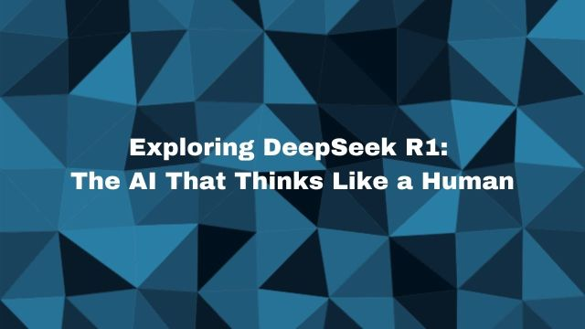{ width="200" }

    ### [Exploring DeepSeek R1: The AI That Thinks Like a Human](dsblog/Exploring-Deepseek-R1.md)
    
    **Read time:** 10 min
    
    In this article, we explore the key concepts and capabilities of DeepSeek R1, an AI model that reasons like a human. We cover its architecture, applic

- 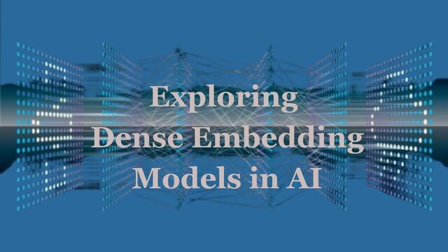{ width="200" }

    ### [Exploring Dense Embedding Models in AI](dsblog/Exploring-Dense-Embedding-Models-in-AI.md)
    
    **Read time:** 14 min
    
    EXCERPT Not Found
    

- { width="200" }

    ### [Exploring Designer Roles and Their Favorite Free Tools](dsblog/Exploring-Designer-Roles-and-Their-Favorite-Free-Tools.md)
    
    **Read time:** 9 min
    
    In this article, we'll explore the different types of designer roles and their favorite free tools. This article will cover UI designers, UX designers

- 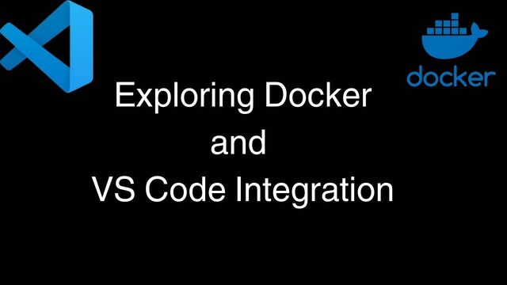{ width="200" }

    ### [Exploring Docker and VS Code Integration](dsblog/Exploring-Docker-and-VS-Code-Integration.md)
    
    **Read time:** 21 min
    
    A comprehensive guide to integrating Docker with Visual Studio Code, covering DevContainers, remote development, best practices, and advanced configur
    

- 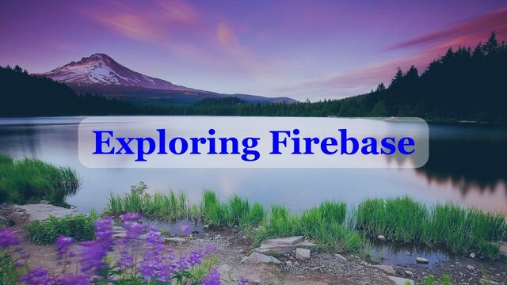{ width="200" }

    ### [Exploring Google Firebase](dsblog/Exploring-Firebase.md)
    
    **Read time:** 13 min
    
    EXCERPT Not Found

- { width="200" }

    ### [Exploring GGUF and Other Model Formats](dsblog/Exploring-GGUF-and-other-model-formats.md)
    
    **Read time:** 6 min
    
    A comprehensive guide to understanding different machine learning model formats, with a special focus on GGUF and its advantages in model compression,
    

- 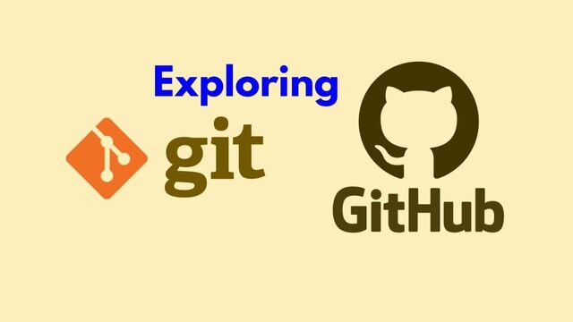{ width="200" }

    ### [Exploring Github](dsblog/Exploring-Github.md)
    
    **Read time:** 23 min
    
    A comprehensive guide to GitHub and its features. Learn about repository management, version control, collaboration tools, and best practices for effe

- 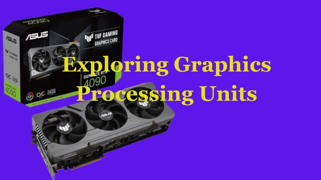{ width="200" }

    ### [Exploring Graphics Processing Units (GPUs)](dsblog/Exploring-GPUs.md)
    
    **Read time:** 5 min
    
    Exploring the journey, capabilities, architecture and components of Graphics Processing Units (GPUs)
    

- 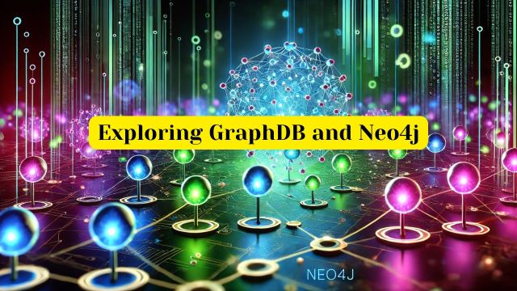{ width="200" }

    ### [Exploring GraphDB and Neo4j - A Guide to Graph Databases](dsblog/Exploring-GraphDB-and-Neo4j.md)
    
    **Read time:** 15 min
    
    Learn the basics of graph databases, explore the advantages of graph databases, and understand how GraphDB and Neo4j solve complex data relationships 

- 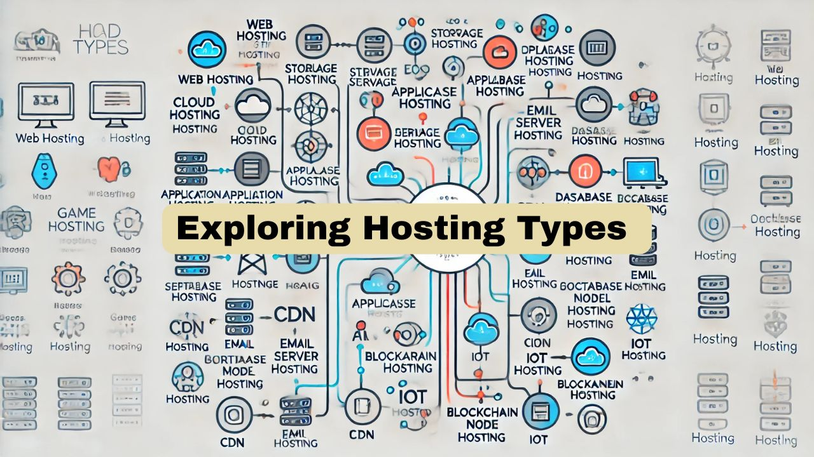{ width="200" }

    ### [Exploring Hosting Types](dsblog/Exploring-Hosting-Types.md)
    
    **Read time:** 6 min
    
    The type of hosting you choose for your website can greatly impact its performance, security, and scalability. In this article, we'll explore the main
    

- 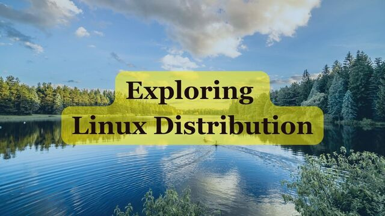{ width="200" }

    ### [Understanding Linux Distributions](dsblog/Exploring-Linux.md)
    
    **Read time:** 8 min
    
    EXCERPT Not Found

- 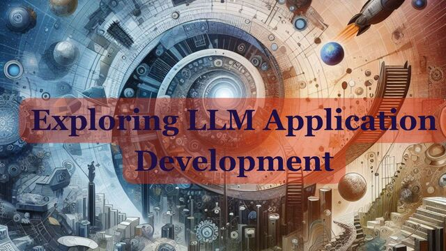{ width="200" }

    ### [Exploring LLM Application Development](dsblog/Exploring-LLM-App-Development.md)
    
    **Read time:** 22 min
    
    A comprehensive guide to developing applications with Large Language Models (LLMs), covering key aspects from architecture and scalability to security
    

- 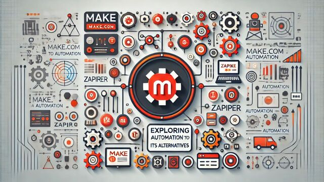{ width="200" }

    ### [Exploring Make.com: A Comprehensive Guide to Automation and Its Alternatives](dsblog/Exploring-Make.com-A-Comprehensive-Guide.md)
    
    **Read time:** 19 min
    
    A comprehensive guide to Make.com, an automation platform that allows users to create custom workflows between various apps and services, as well as i

- { width="200" }

    ### [Exploring Ollama & LM Studio](dsblog/Exploring-Ollama.md)
    
    **Read time:** 31 min
    
    EXCERPT Not Found
    

- 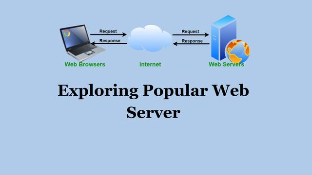{ width="200" }

    ### [Exploring Popular Web Server](dsblog/Exploring-Popular-Web-Servers.md)
    
    **Read time:** 5 min
    
    An in-depth exploration of popular web servers including Apache, Nginx, IIS, and others, comparing their features, use cases, and optimal deployment s

- 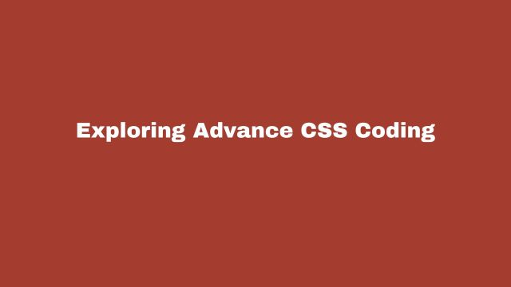{ width="200" }

    ### [Exploring Possibilities with CSS: A Comprehensive Guide to Advanced CSS Coding](dsblog/Exploring-Possibilities-with-CSS.md)
    
    **Read time:** 13 min
    
    In this article, we explore the different methods of advanced CSS coding, including responsive design, animations, and pseudo-elements. We also discus
    

- 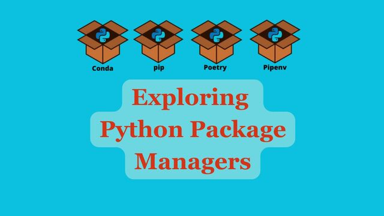{ width="200" }

    ### [Exploring Python Package Manager](dsblog/Exploring-Python-Package-Managers.md)
    
    **Read time:** 18 min
    
    EXCERPT Not Found

- 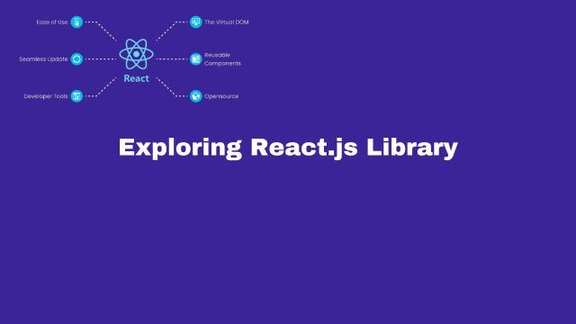{ width="200" }

    ### [Exploring Reactjs Library](dsblog/Exploring-Reactjs-Library.md)
    
    **Read time:** 9 min
    
    Learn the basics of React, a popular JavaScript library. Understand its history, features and how it is used in web development.
    

- 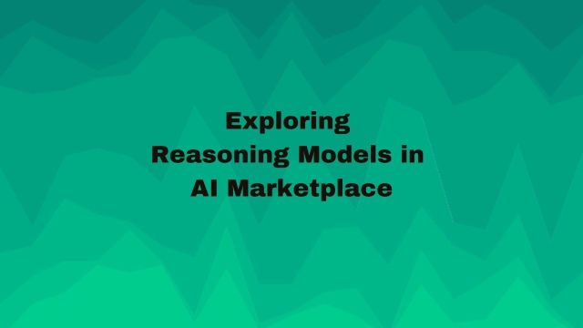{ width="200" }

    ### [Exploring Reasoning Models in AI Marketplace, Feb 25](dsblog/Exploring-Reasoning-Models.md)
    
    **Read time:** 8 min
    
    In this article, we explore the key concepts and capabilities of reasoning models in the AI marketplace. We cover major proprietary and open source mo

- 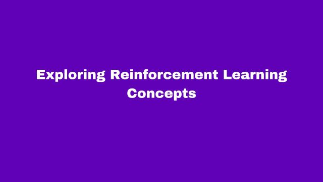{ width="200" }

    ### [Exploring Reinforcement Learning Concepts: A Comprehensive Guide](dsblog/Exploring-Reinformement-Learning-Concepts.md)
    
    **Read time:** 7 min
    
    In this article, we explore the key concepts of reinforcement learning, including Markov decision processes, exploration vs. exploitation, and value-b
    

- 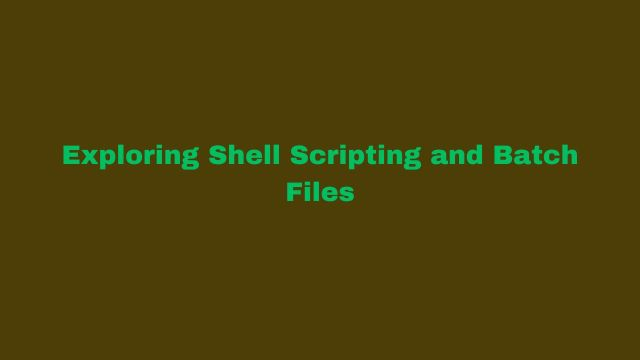{ width="200" }

    ### [Exploring Shell Scripting and Batch Files](dsblog/Exploring-Shell-Scrips-and-Batch-Files.md)
    
    **Read time:** 5 min
    
    In this article, we explore creating batch files to set environment variables and execute shell commands in Windows, PowerShell, and Ubuntu, along wit

- 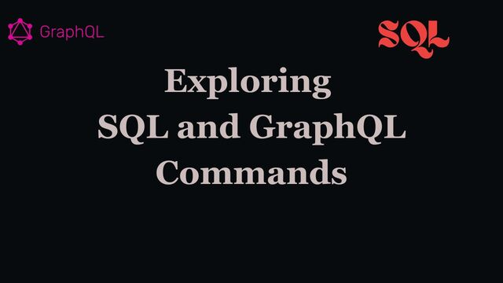{ width="200" }

    ### [Exploring SQL and GraphQL Commands](dsblog/Exploring-SQL-and-GraphQL.md)
    
    **Read time:** 9 min
    
    EXCERPT Not Found
    

- 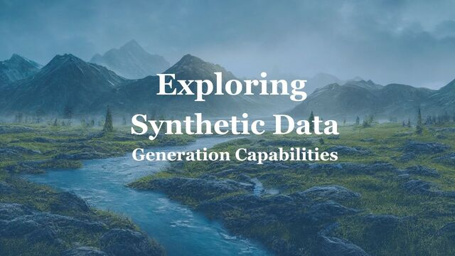{ width="200" }

    ### [Exploring Synthetic Data Generation Capabilities](dsblog/Exploring-Syntehtic-Data-Generation-Capabilities.md)
    
    **Read time:** 32 min
    
    EXCERPT Not Found

- 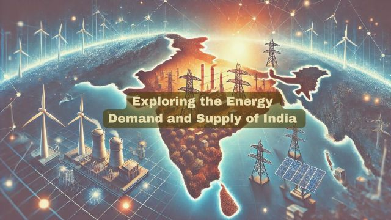{ width="200" }

    ### [Exploring the Energy Demand and Supply of India](dsblog/Exploring-the-Energy-Demand-and-Supply-of-India.md)
    
    **Read time:** 12 min
    
    Understand India's electricity demand and supply.
    

- 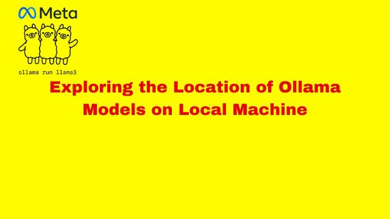{ width="200" }

    ### [Exploring the Local Location of Ollama Models on WSL2](dsblog/Exploring-the-local-location-of-Model.md)
    
    **Read time:** 6 min
    
    In this article, we explore the location of ollama models on Windows 11 (WSL2) machine. We also discuss the advantages and disadvantages of each metho

- 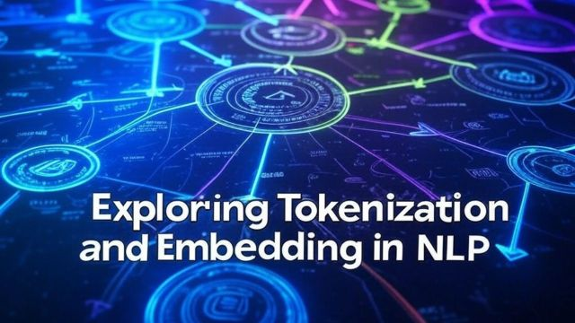{ width="200" }

    ### [Exploring Tokenization and Embedding in NLP](dsblog/Exploring-Tokenization-in-AI.md)
    
    **Read time:** 13 min
    
    Discover various tokenization methods and their role in language models, enhancing the understanding and generation of human language.
    

- 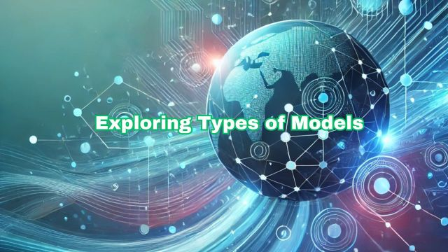{ width="200" }

    ### [Exploring Types of Models](dsblog/Exploring-Types-of-Models.md)
    
    **Read time:** 10 min
    
    Dive into the various classifications of models, their applications, and how they help in understanding systems and phenomena.

- 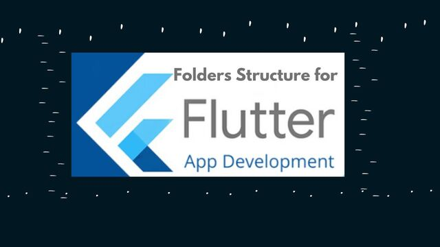{ width="200" }

    ### [Building AI-Powered Flutter Apps: Best Practices for Folder Structure](dsblog/Flutter-Folder-Structure.md)
    
    **Read time:** 5 min
    
    EXCERPT Not Found
    

- 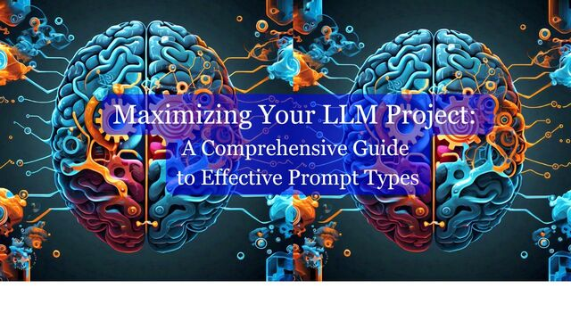{ width="200" }

    ### [Framework for using LLM](dsblog/Framework-for-using-LLM.md)
    
    **Read time:** 5 min
    
    A comprehensive guide to selecting the right model and prompt type for your LLM project.

- 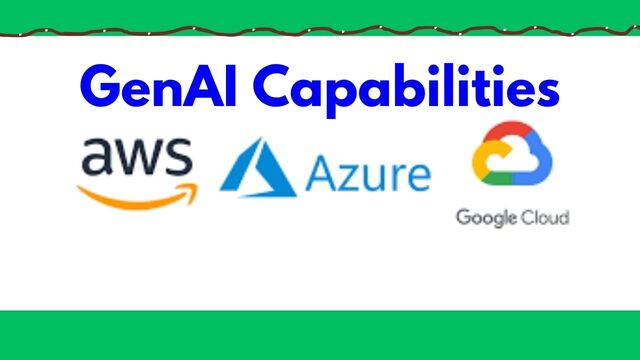{ width="200" }

    ### [GenAI Capabilities from AWS, Azure and GCP](dsblog/GenAI-Capabilities-from-AWS+Azure+GCP.md)
    
    **Read time:** 9 min
    
    Compare and understand the Generative AI capabilities across major cloud providers - AWS, Azure, and Google Cloud Platform. Learn about their AI servi
    

- 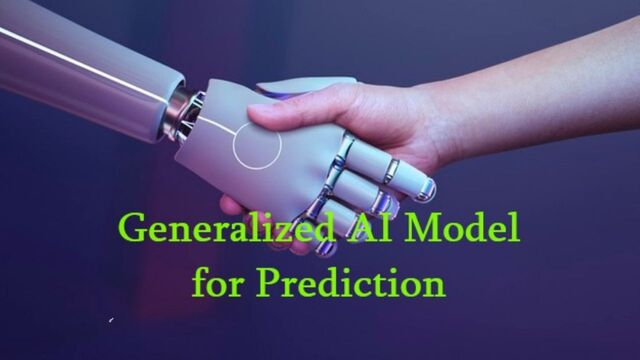{ width="200" }

    ### [Generalized AI Model for Prediction](dsblog/Generalized-AI-Model-for-Prediction.md)
    
    **Read time:** 5 min
    
    Exploring the challenges and approaches in developing generalized AI models for prediction tasks. Learn about multi-modal integration, feature selecti

- 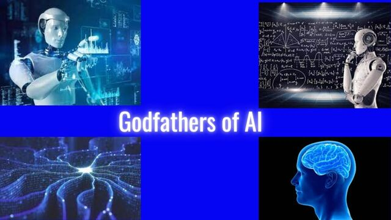{ width="200" }

    ### [God Fathers of AI](dsblog/Godfathers-of-AI.md)
    
    **Read time:** 6 min
    
    Discover the influential figures who shaped the field of Artificial Intelligence. From early pioneers to modern innovators, learn about the key contri
    

- 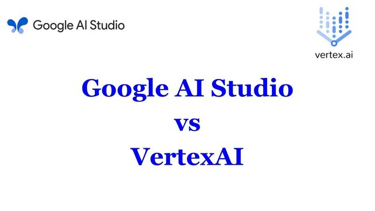{ width="200" }

    ### [Google AI Studio vs Vertex AI](dsblog/Google-AI-Studio-vs-VertexAI.md)
    
    **Read time:** 5 min
    
    The difference between **Vertex AI** and **Google AI Studio** lies in their scope, functionality, and target audiences within Google's suite of AI too

- { width="200" }

    ### [Google Cloud APIs](dsblog/Google-cloud-api.md)
    
    **Read time:** 15 min
    
    A comprehensive guide to Google Cloud APIs, including available services, integration methods, and implementation details. Learn about various Google 
    

- { width="200" }

    ### [Navigating Google Cloud Security: Key Components, Roles, and Best Practices](dsblog/Google-Cloud-Security-Components.md)
    
    **Read time:** 12 min
    
    EXCERPT Not Found

- 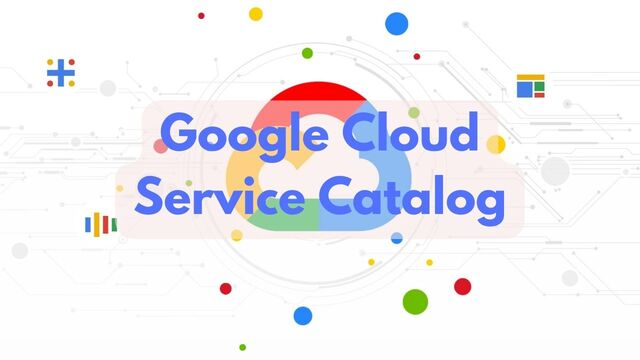{ width="200" }

    ### [Google Cloud Service Catalog - A Comprehensive Overview of 250+ Google Cloud Services](dsblog/Google-Cloud-Services.md)
    
    **Read time:** 29 min
    
    A comprehensive catalog of over 250 Google Cloud Platform (GCP) services, including detailed information about each service's purpose, documentation, 
    

- 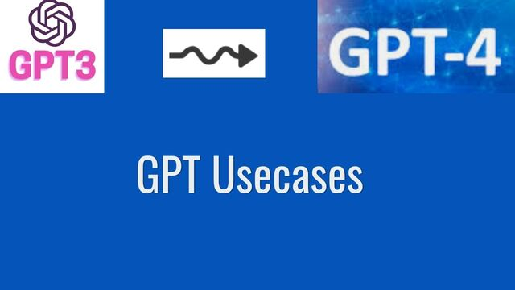{ width="200" }

    ### [GPT Usecases](dsblog/GPT-Usecases.md)
    
    **Read time:** 6 min
    
    Discover the diverse applications and potential of GPT (Generative Pre-trained Transformer) technology across industries. Learn how this revolutionary

- 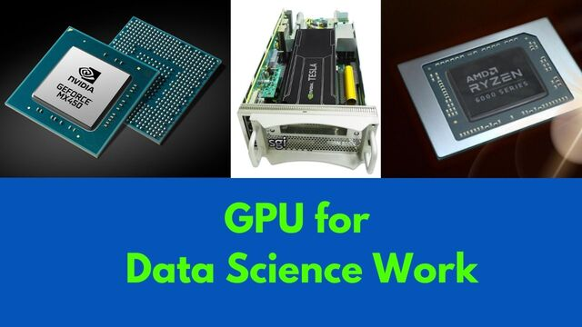{ width="200" }

    ### [GPU for Data Science Work](dsblog/GPU-for-Data-Science-Work.md)
    
    **Read time:** 7 min
    
    A comprehensive guide to understanding GPU requirements and selection for data science and deep learning work. Learn about key factors affecting GPU p
    

- 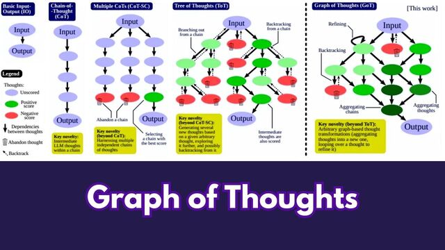{ width="200" }

    ### [Graph of Thoughts](dsblog/Graph-of-Thoughts.md)
    
    **Read time:** 5 min
    
    Explore the Graph of Thoughts (GoT) architecture, a novel approach to enhancing language models' reasoning capabilities. Learn how this framework stru

- 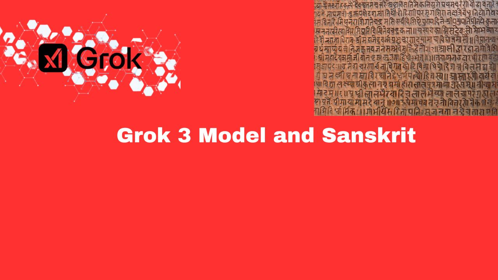{ width="200" }

    ### [Grok 3 Model and Sanskrit](dsblog/Grok3Model-and-Sanskrit.md)
    
    **Read time:** 6 min
    
    Grok3Model is a powerful AI model that is capable of understanding Sanskrit language and its context with great accuracy. It is a game-changer for San
    

- 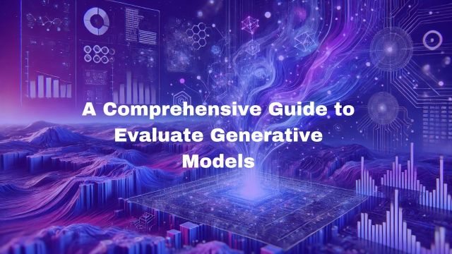{ width="200" }

    ### [A Comprehensive Guide to Evaluate Generative Models](dsblog/Guide-to-Evaluate-Generative-Models.md)
    
    **Read time:** 12 min
    
    Learn the best practices for evaluating generative models, including automated metrics, human evaluation, and how to choose the right evaluation metho

- { width="200" }

    ### [How AlphaFold is Revolutionizing Protein Science](dsblog/How-AlphaFold-is-Revolutionizing-Protein-Science.md)
    
    **Read time:** 5 min
    
    AlphaFold is a powerful AI tool that has solved the protein folding problem. In this post, I explain how it works and the implications for the field o
    

- 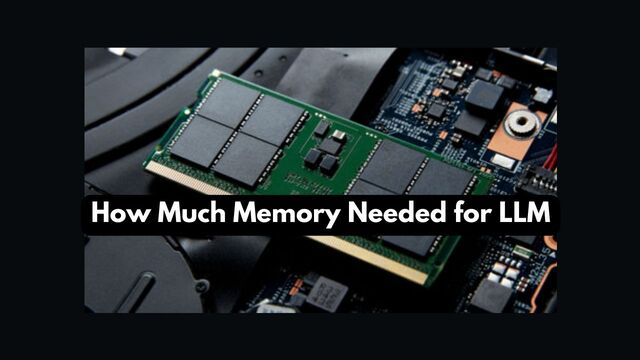{ width="200" }

    ### [How Much Memory Needed for LLM](dsblog/How-Much-Memory-Needed-for-LLM.md)
    
    **Read time:** 15 min
    
    Understand the memory and hardware requirements for running Large Language Models. Learn about GPU specifications, RAM requirements, and infrastructur

- { width="200" }

    ### [How Naive Bayes Classifier Works](dsblog/How-Naive-Bayes-Classifier-Works.md)
    
    **Read time:** 5 min
    
    Comprehensive guide to understanding Naive Bayes Classifier - from basic concepts to practical implementation. Learn how this probabilistic algorithm 
    

- { width="200" }

    ### [How to do Literature Review](dsblog/How-to-do-Literature-Review.md)
    
    **Read time:** 5 min
    
    A comprehensive guide to conducting effective literature reviews for academic research. Learn systematic approaches to finding, organizing, and analyz

- 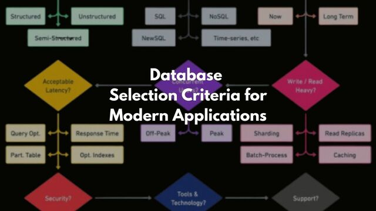{ width="200" }

    ### [Selecting Database for Project](dsblog/How-to-select-database.md)
    
    **Read time:** 12 min
    
    A comprehensive guide to selecting the right database for your project. Learn about key factors including data formats, scalability, ACID compliance, 
    

- 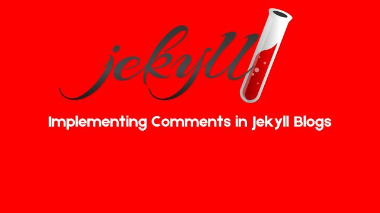{ width="200" }

    ### [Implementing Comments in Jekyll Blogs](dsblog/Implementing-Comments-in-Jekyll-Blogs.md)
    
    **Read time:** 7 min
    
    Learn how to add comments to your Jekyll blog. This guide covers different options for adding comments to static sites and provides step-by-step instr

- { width="200" }

    ### [Implementing Secure Authentication and Authorization](dsblog/Implementing-Secure-Authentication-and-Authorization.md)
    
    **Read time:** 16 min
    
    Implementing secure authentication and authorization is a complex task. In this article, we'll explore the key concepts of authentication and authoriz
    

- 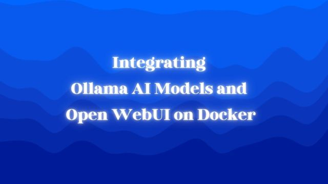{ width="200" }

    ### [Integrating Ollama AI Models and Open WebUI with Docker: A Step-by-Step Guide](dsblog/Integrating-Ollama-with-OpenWebUI.md)
    
    **Read time:** 5 min
    
    In this article, we explore the key concepts of integrating Ollama AI models and Open WebUI with Docker. We cover step-by-step instructions on how to 

- 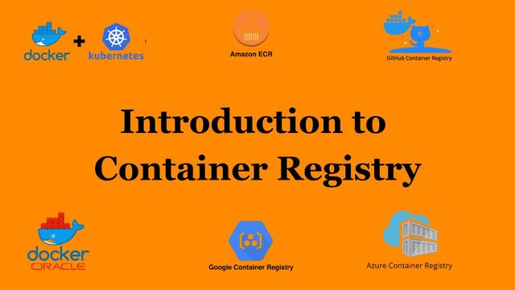{ width="200" }

    ### [Introduction to Container Registry](dsblog/Introduction-to-Container-Registry.md)
    
    **Read time:** 8 min
    
    EXCERPT Not Found
    

- 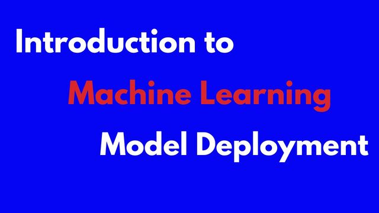{ width="200" }

    ### [Introduction to ML Model Deployment](dsblog/Introduction-to-ML-Model-deployment.md)
    
    **Read time:** 12 min
    
    A comprehensive guide to machine learning model deployment, covering various deployment strategies, frameworks, and best practices. Learn about model 

- 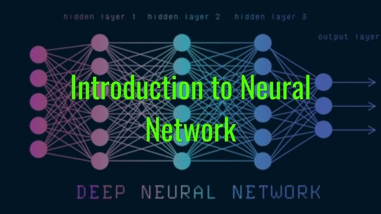{ width="200" }

    ### [Introduction to Neural Network](dsblog/Introduction-to-Neural-Network.md)
    
    **Read time:** 7 min
    
    A comprehensive introduction to neural networks, covering fundamental concepts, architecture types, and key assumptions. Learn about the essential com
    

- 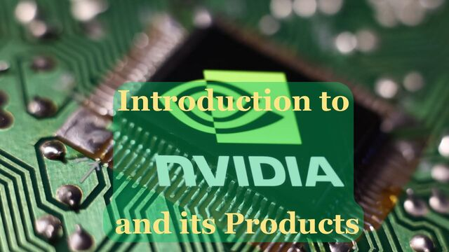{ width="200" }

    ### [Introduction to NVIDIA and Products](dsblog/Introduction-to-NVIDIA-and-Products.md)
    
    **Read time:** 8 min
    
    Overview of NVIDIA's journey, history, DGX supercomputer series, key products, and emerging fields like generative AI.

- 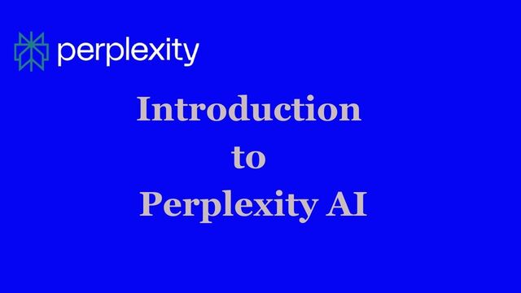{ width="200" }

    ### [Introduction to Perplexity AI](dsblog/Introduction-to-Perplexity-AI.md)
    
    **Read time:** 5 min
    
    EXCERPT Not Found
    

- 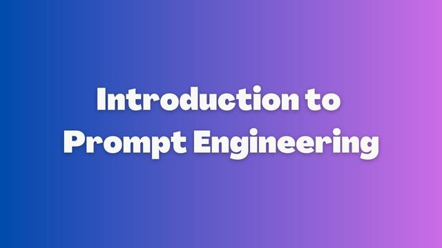{ width="200" }

    ### [Introduction to Prompt Engineering](dsblog/Introduction-to-Prompt-Engineering.md)
    
    **Read time:** 11 min
    
    Master the art of prompt engineering for large language models. Learn effective techniques, best practices, and strategies for crafting prompts that g

- 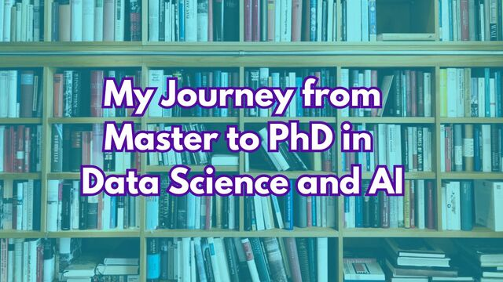{ width="200" }

    ### [My Journey from Master to PhD in Data Science and AI](dsblog/Journey-from-Masters-to-Phd.md)
    
    **Read time:** 28 min
    
    A personal account of the journey from pursuing a Master's degree to completing a PhD in Data Science and AI. Share insights, challenges, and lessons 
    

- { width="200" }

    ### [KM Ganguli Mahabharat Corpus](dsblog/KM-Ganguli-Mahabharat-Corpus.md)
    
    **Read time:** 5 min
    
    Explore the digital corpus of KM Ganguli's English translation of the Mahabharata. Learn about the structure, content, and significance of this compre

- { width="200" }

    ### [LaTeX Capabilities](dsblog/LaTex-capabilities.md)
    
    **Read time:** 6 min
    
    Discover the powerful capabilities of LaTeX for academic and technical writing. Learn about its features for document preparation, mathematical typese
    

- 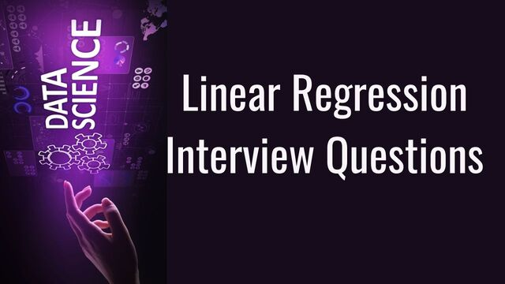{ width="200" }

    ### [Linear Regression Interview Questions](dsblog/Linear-Regression.md)
    
    **Read time:** 58 min
    
    Comprehensive guide to Linear Regression interview questions covering model assumptions, evaluation metrics, feature selection, and practical implemen

- 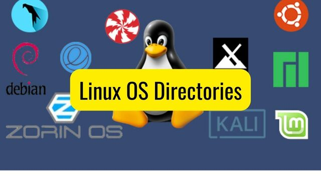{ width="200" }

    ### [Linux OS Directories](dsblog/Linux-OS-Directories.md)
    
    **Read time:** 5 min
    
    A detailed guide to Linux operating system directory structure and organization. Learn about the purpose and contents of essential Linux directories, 
    

- 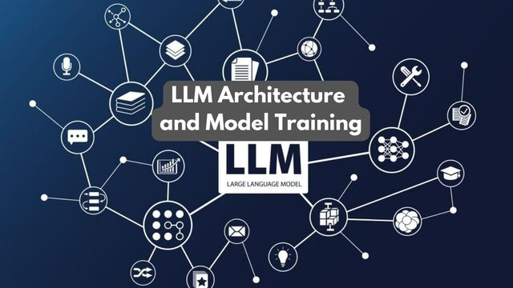{ width="200" }

    ### [LLM Architecture and Training](dsblog/LLM-Architecture-and-Training.md)
    
    **Read time:** 15 min
    
    Dive deep into the architecture and training process of Large Language Models. Understand the components, training methodologies, and optimization tec

- 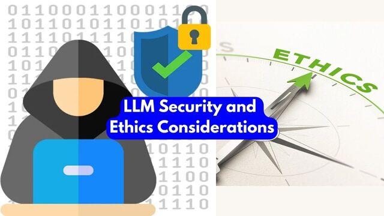{ width="200" }

    ### [LLM Security and Ethics Considerations](dsblog/LLM-Security-and-Ethics-Considerations.md)
    
    **Read time:** 8 min
    
    Explore the critical security and ethical considerations in LLM development and deployment. Learn about data privacy, model security, and responsible 
    

- 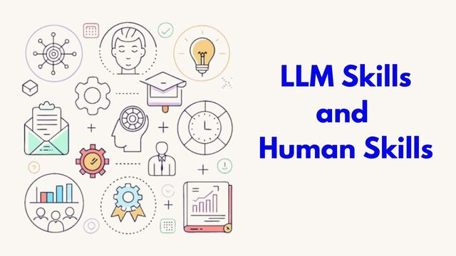{ width="200" }

    ### [LLM Skills and Human Skills](dsblog/LLM-Skills-and-Human-Skills.md)
    
    **Read time:** 6 min
    
    Compare and contrast the capabilities of Large Language Models with human skills. Understand how AI complements human abilities and shapes the future 

- 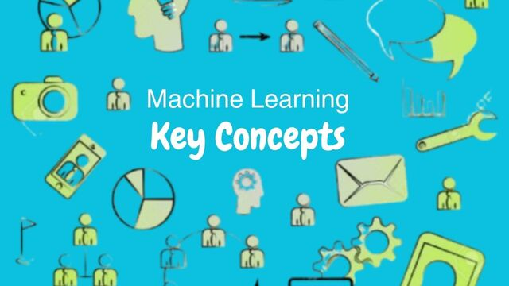{ width="200" }

    ### [Machine Learning Key Concepts](dsblog/Machine-Learning-Key-Concepts.md)
    
    **Read time:** 49 min
    
    A comprehensive guide to fundamental machine learning concepts, covering essential topics from model evaluation and cross-validation to advanced techn
    

- 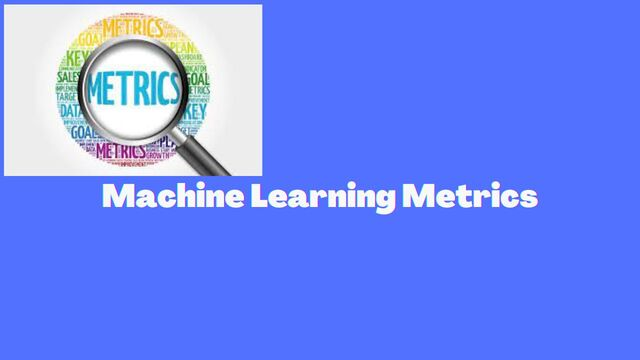{ width="200" }

    ### [Machine Learning Metrics](dsblog/Machine-Learning-Metrics.md)
    
    **Read time:** 21 min
    
    A comprehensive guide to machine learning evaluation metrics. Learn about various metrics used to assess model performance, including accuracy, precis

- 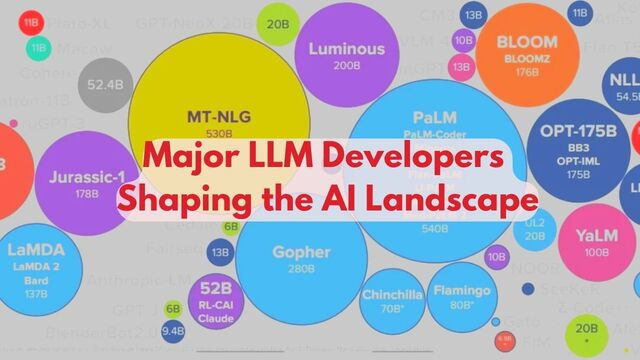{ width="200" }

    ### [Major LLM Developers Shaping the AI Landscape](dsblog/Major-LLM-Developers-Reshaping-NLP-Advancements.md)
    
    **Read time:** 14 min
    
    Discover the major companies and institutions driving Large Language Model (LLM) development and innovation. Learn about key players in AI research, t
    

- { width="200" }

    ### [Manamath Nath - Ramayana Corpus](dsblog/Manmath-Nath-Ramayana-Corpus.md)
    
    **Read time:** 5 min
    
    Discover the digital corpus of Manmath Nath's translation of the Ramayana. Explore the structure and content of this significant translation of the an

- 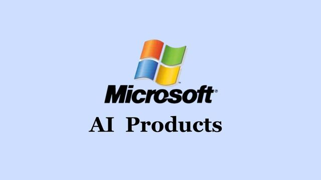{ width="200" }

    ### [Microsoft AI Products](dsblog/Microsoft-AI-Products.md)
    
    **Read time:** 6 min
    
    Overview of Microsoft's AI offerings, including Azure AI, Azure Machine Learning, and Azure Cognitive Services.
    

- 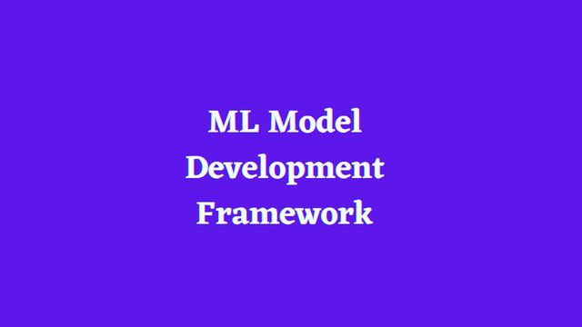{ width="200" }

    ### [ML Model Development Framework](dsblog/ML-Model-Development-Framework.md)
    
    **Read time:** 5 min
    
    A structured approach to machine learning model development. Learn about frameworks, best practices, and architectural considerations for building rob

- 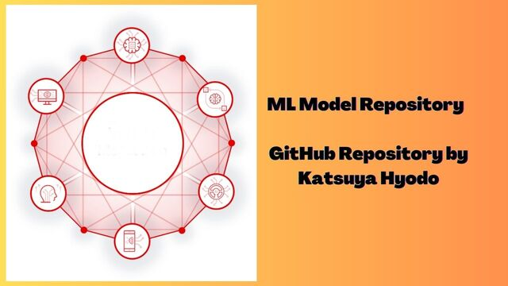{ width="200" }

    ### [ML Model Respository from Pinto0309](dsblog/ML-Model-Repository.md)
    
    **Read time:** 29 min
    
    A comprehensive collection of machine learning models from Pinto0309's repository. Explore various pretrained models for computer vision, NLP, and oth
    

- 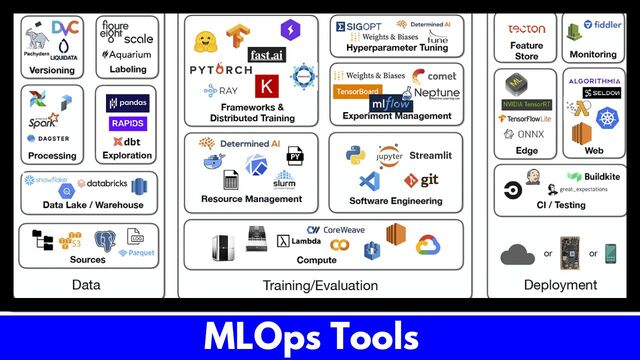{ width="200" }

    ### [MLOps Tools](dsblog/MLOps-Tools.md)
    
    **Read time:** 10 min
    
    A comprehensive guide to MLOps tools and practices, covering essential components for deploying, monitoring, and managing machine learning models in p

- 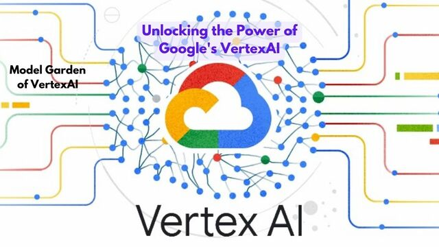{ width="200" }

    ### [Model Garden of VertexAI](dsblog/Model-Garden-of-VertexAI.md)
    
    **Read time:** 26 min
    
    A comprehensive guide to Google Cloud's Vertex AI Model Garden, featuring a detailed catalog of pre-trained models, fine-tunable models, and task-spec
    

- 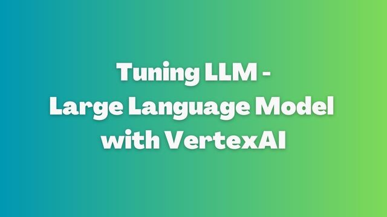{ width="200" }

    ### [Model Tuning with VertexAI](dsblog/Model-Tuning-with-VertexAI.md)
    
    **Read time:** 5 min
    
    A practical guide to model tuning using Google Cloud's VertexAI platform. Learn how to optimize and fine-tune machine learning models, manage training

- 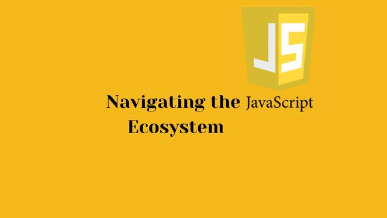{ width="200" }

    ### [Navigating the JavaScript Ecosystem](dsblog/Nativagting-Javascript-Ecosystem.md)
    
    **Read time:** 28 min
    
    EXCERPT Not Found
    

- 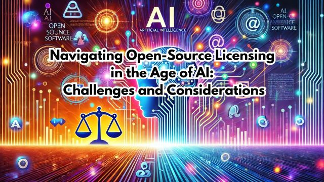{ width="200" }

    ### [Navigating Open-Source Licensing in the Age of AI: Challenges and Considerations](dsblog/Navigating-Open-Source-Licensing-in-the-Age-of-AI.md)
    
    **Read time:** 13 min
    
    An in-depth exploration of the challenges and considerations surrounding open-source licensing in the context of artificial intelligence, highlighting

- 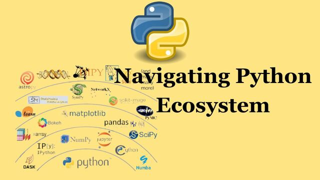{ width="200" }

    ### [Navigating Python Ecosystem](dsblog/Navigating-Python-Ecosystem.md)
    
    **Read time:** 5 min
    
    A comprehensive guide to understanding the Python ecosystem, including its history, package management, virtual environments, and popular libraries fo
    

- { width="200" }

    ### [Navigating the LLM Infrastructure Landscape](dsblog/Navigating-the-LLM-Infrastructure-Landscape.md)
    
    **Read time:** 15 min
    
    A comprehensive exploration of the LLM infrastructure landscape, from cloud giants to specialized providers, helping organizations make informed decis

- 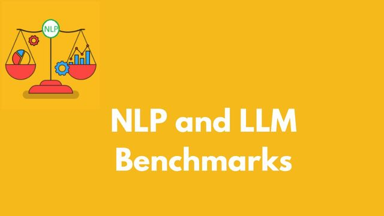{ width="200" }

    ### [NLP BenchMarks](dsblog/NLP-BenchMarks.md)
    
    **Read time:** 9 min
    
    Explore comprehensive benchmarks for evaluating Natural Language Processing models. Learn about various testing frameworks, performance metrics, and e
    

- 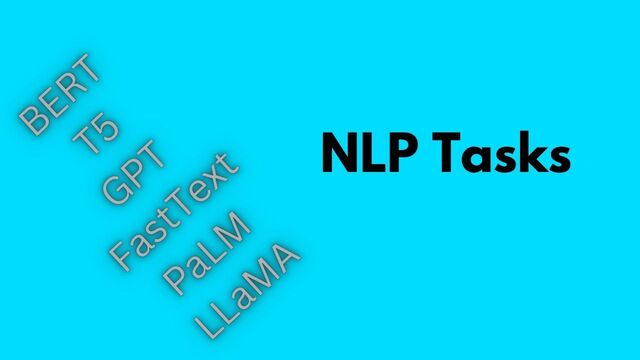{ width="200" }

    ### [NLP Tasks](dsblog/NLP-Tasks.md)
    
    **Read time:** 43 min
    
    A comprehensive overview of Natural Language Processing (NLP) tasks, including text classification, sentiment analysis, machine translation, and more.

- 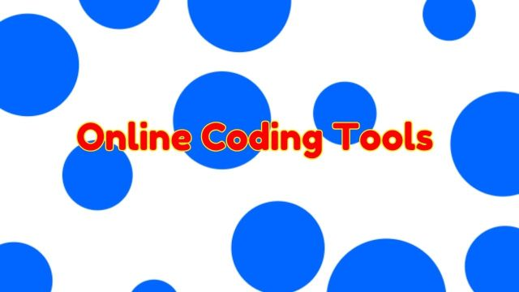{ width="200" }

    ### [Online Coding Tools: Choosing the Right IDE for Your Project](dsblog/Online-Coding-Tools.md)
    
    **Read time:** 5 min
    
    Navigate the world of online coding tools with ease! This guide breaks down the best web-based IDEs, coding playgrounds, and cloud notebooks for vario
    

- 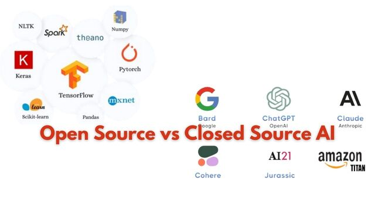{ width="200" }

    ### [Open Source vs Closed Source AI](dsblog/Open-Source-vs-Closed-Source-AI.md)
    
    **Read time:** 8 min
    
    A comparative analysis of open source and closed source AI systems, examining their implications for transparency, cost, accessibility, and the future

- 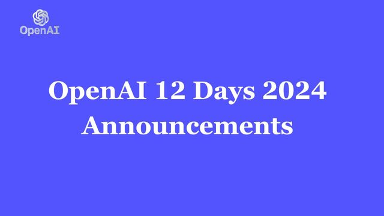{ width="200" }

    ### [OpenAI 12 Days 2024 Announcements](dsblog/OpenAI-12-Days-2024-Announcements.md)
    
    **Read time:** 17 min
    
    OpenAI's 12 Days of 2024 brought some exciting announcements. In this post, I provide a concise overview of the key updates.
    

- 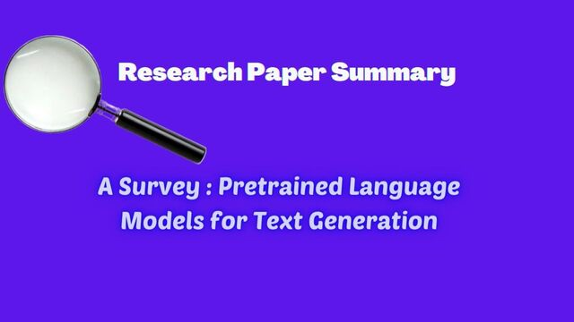{ width="200" }

    ### [Paper-Summary- A Survey Paper# Pretrained Language Models for Text Generation](dsblog/Paper-Pretrained-Language-Models-for-Text-Generation.md)
    
    **Read time:** 9 min
    
    A comprehensive summary of research on pretrained language models for text generation. This survey paper explores various techniques, applications, an

- 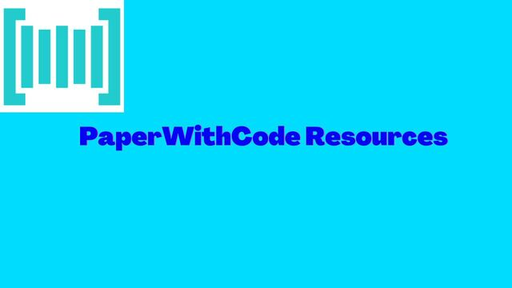{ width="200" }

    ### [Paper with Code Resources](dsblog/Paperwithcode-Resources.md)
    
    **Read time:** 35 min
    
    A comprehensive collection of AI research papers with their corresponding code implementations. This resource links academic research with practical i
    

- 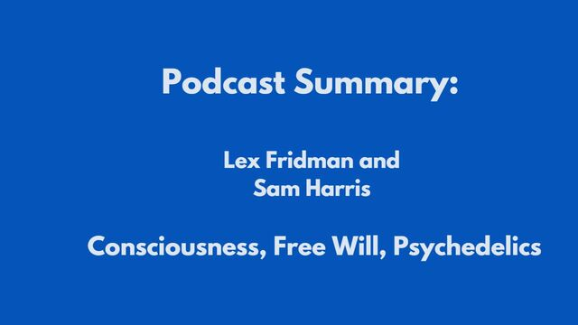{ width="200" }

    ### [Podcast Lex Fridman Sam Harris Consciousness Free Will Psychedelics](dsblog/Podcast-LexFridman-SamHarris-Consciousness-FreeWill-Psychedelics.md)
    
    **Read time:** 7 min
    
    A detailed summary of the profound conversation between Lex Fridman and Sam Harris, exploring deep topics including consciousness, free will, and psyc

- { width="200" }

    ### [Power of Chinese AI Models](dsblog/Power-of-Chinese-AI-Models.md)
    
    **Read time:** 5 min
    
    Discover the power and impact of Chinese AI models in the global landscape of artificial intelligence.
    

- 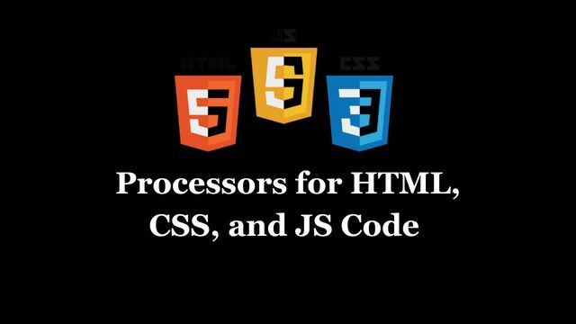{ width="200" }

    ### [Processors for HTML CSS JS Code](dsblog/Processors-for-HTML-CSS-JS-Code.md)
    
    **Read time:** 11 min
    
    A comprehensive guide to HTML, CSS, and JavaScript processors, exploring tools like Pug, Sass, TypeScript, and Babel that enhance web development work

- 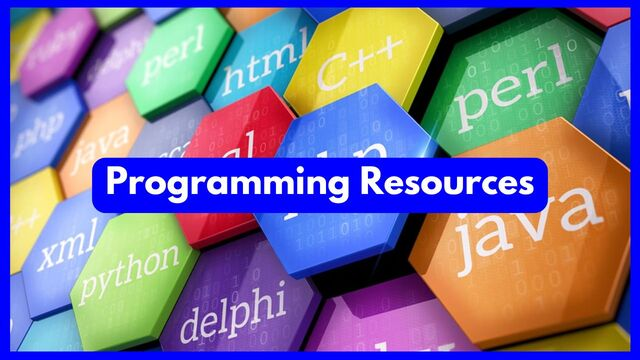{ width="200" }

    ### [Programming Resources](dsblog/Programming-Resources.md)
    
    **Read time:** 26 min
    
    A curated collection of valuable programming resources, including learning platforms, coding tutorials, best practices, interview preparation material
    

- 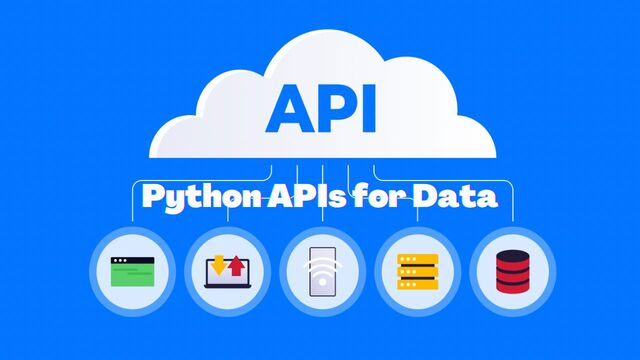{ width="200" }

    ### [Python APIs for Data](dsblog/Python-API-.md)
    
    **Read time:** 5 min
    
    A comprehensive guide to Python APIs for data collection and integration. Explore various APIs and libraries available for accessing and processing da

- 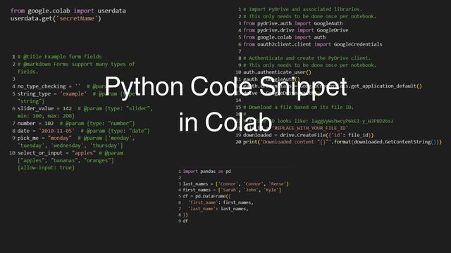{ width="200" }

    ### [Python Code Snippnet from Colab](dsblog/Python-Code-Snippet-from-Colab.md)
    
    **Read time:** 9 min
    
    EXCERPT Not Found
    

- 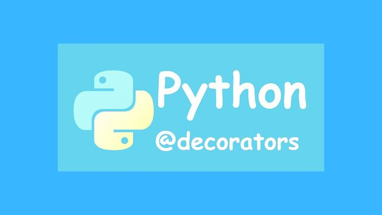{ width="200" }

    ### [Python Decorator Function](dsblog/Python-Decorator-Function.md)
    
    **Read time:** 5 min
    
    Master Python decorator functions - a powerful feature for modifying or enhancing functions without changing their source code. Learn about function d

- 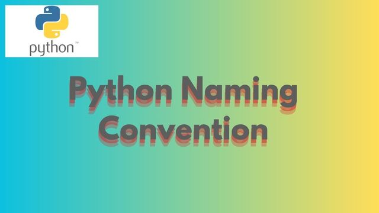{ width="200" }

    ### [Python Naming Convention](dsblog/Python-Naming-Convention.md)
    
    **Read time:** 5 min
    
    A comprehensive guide to Python naming conventions following PEP 8 standards. Learn best practices for naming variables, functions, classes, and modul
    

- 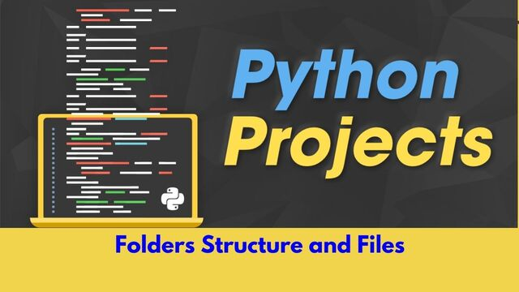{ width="200" }

    ### [Python Project Folders and Files](dsblog/Python-Project-Folders-and-Files.md)
    
    **Read time:** 10 min
    
    Learn about Python project organization and best practices. Understand the purpose of different folders and files in a Python project, from virtual en

- 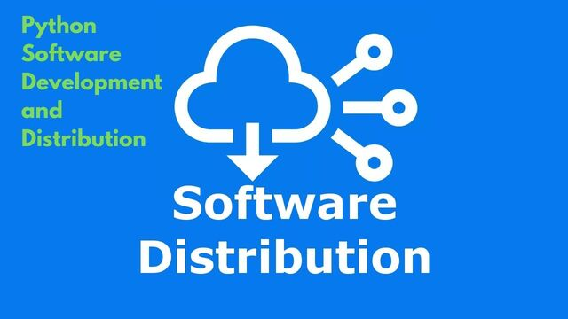{ width="200" }

    ### [Python Software Development and Distribution](dsblog/Python-Software-Development-And-Distribution.md)
    
    **Read time:** 14 min
    
    Learn about Python software development and distribution, focusing on best practices, tools, and methods for successful project deployment.
    

- 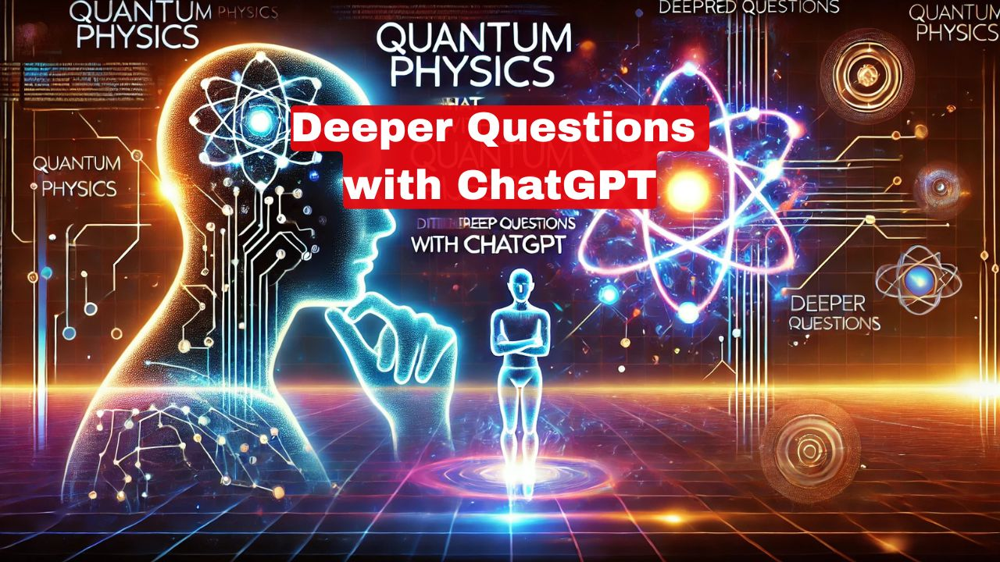{ width="200" }

    ### [Quantum Physics with Deeper Questions with ChatGPT](dsblog/Quantum-Physics.md)
    
    **Read time:** 126 min
    
    I was a physics student during my college years, and I’ve always loved the subject—even today. However, Quantum Physics, despite all my reading and le

- 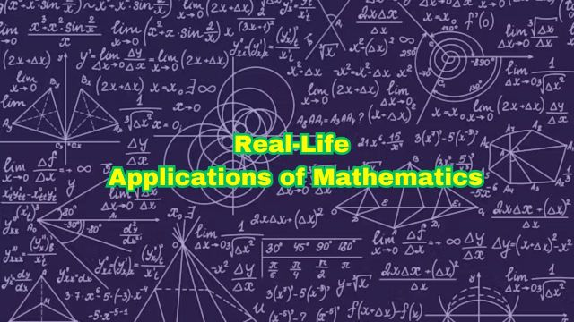{ width="200" }

    ### [Real-Life Applications of Mathematics](dsblog/Real-life-application-of-maths.md)
    
    **Read time:** 5 min
    
    Explore the surprising real-world applications of mathematics in 16 key areas, from medicine to technology, physics to economics, and more.
    

- 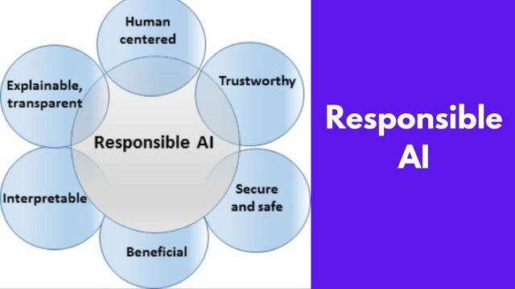{ width="200" }

    ### [Responsible AI](dsblog/Responsible-AI.md)
    
    **Read time:** 5 min
    
    A comprehensive guide to responsible AI development and implementation, covering ethical principles, governance frameworks, and best practices for cre

- 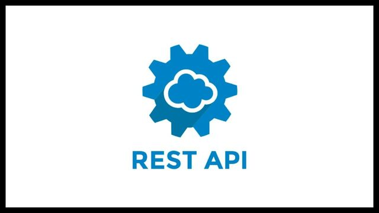{ width="200" }

    ### [REST API](dsblog/REST-API.md)
    
    **Read time:** 13 min
    
    Understand REST APIs and their implementation in modern web development. Learn about RESTful principles, API design patterns, and best practices for b
    

- { width="200" }

    ### [Rethinking AI Infrastructure: Advantages of On-Prem Over Cloud Solutions](dsblog/Rethinking-AI-Infrastructure-Advantages-of-On-Prem-Over-Cloud-Solutions.md)
    
    **Read time:** 6 min
    
    An overview of the key differences between cloud-based AI solutions and on-premises infrastructure, including the main advantages and disadvantages of

- 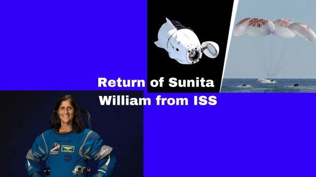{ width="200" }

    ### [Return of Sunita William from ISS](dsblog/Return-of-Sunita-William-from-ISS.md)
    
    **Read time:** 19 min
    
    On March 19, 2025, the news of Sunita Williams' return from the ISS dominated headlines. But was it truly a momentous event, or just another example o
    

- { width="200" }

    ### [SEO Keyword Planning](dsblog/SEO-Keyword-Planning.md)
    
    **Read time:** 10 min
    
    EXCERPT Not Found

- 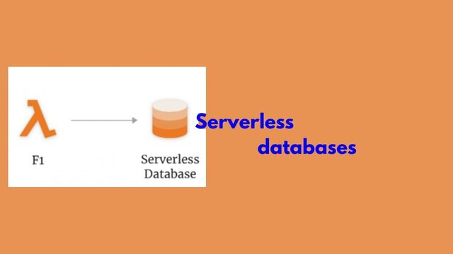{ width="200" }

    ### [Serverless databases](dsblog/Serverless-databases.md)
    
    **Read time:** 5 min
    
    Discover serverless database solutions and their benefits. Learn about various serverless database options, their features, and how they can optimize 
    

- 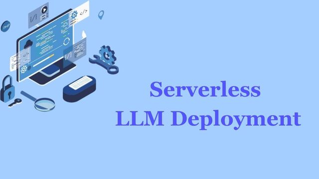{ width="200" }

    ### [Serverless LLM Deployment Platform](dsblog/Serverless-LLM-Deployment.md)
    
    **Read time:** 8 min
    
    Microsoft's serverless LLM deployment platform using Azure OpenAI Service

- 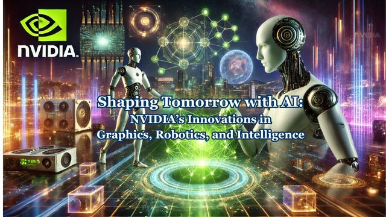{ width="200" }

    ### [Shaping Tomorrow with AI: Nvidia’s Innovations in Graphics, Robotics, and Intelligence](dsblog/Shaping-Tomorrow-with-AI-NVIDIA.md)
    
    **Read time:** 20 min
    
    Nvidia's innovations in graphics, robotics, and intelligence, as shared in their CES 2025 keynote, will shape the future of AI and beyond.
    

- { width="200" }

    ### [Features ofShazam Econometrics Software](dsblog/Shazam-Features.md)
    
    **Read time:** 8 min
    
    Overview of Shazam's features in econometrics, statistics, and data science.

- 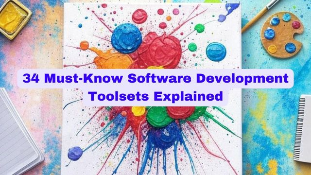{ width="200" }

    ### [Software Development Toolsets Explained](dsblog/Software-Development-Toolsets-Explained.md)
    
    **Read time:** 19 min
    
    Learn about different software development toolsets such as SDK, Framework, API, Library, Platform, Engine, Runtime, IDE, CLI, and GUI. Understand the
    

- 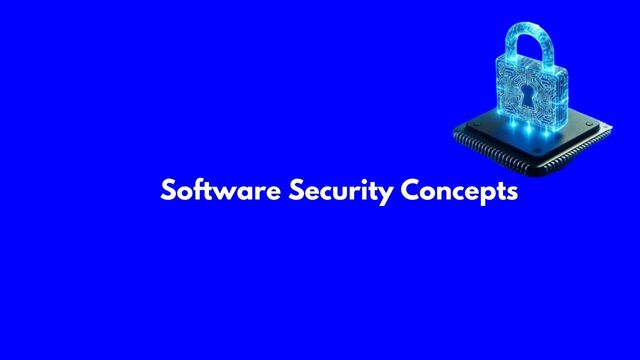{ width="200" }

    ### [Software Security Concepts](dsblog/Software-Security-Concepts.md)
    
    **Read time:** 10 min
    
    Explore fundamental concepts in software security and cybersecurity. Learn about security protocols, data protection methods, and best practices for b

- 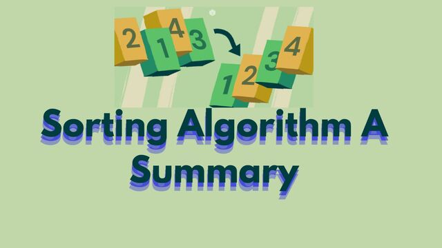{ width="200" }

    ### [Sorting Algorithm A Summary](dsblog/Sorting-Algorithm-A-Summary.md)
    
    **Read time:** 8 min
    
    A comprehensive overview of various sorting algorithms, their implementations, time and space complexities. Learn about different sorting techniques i
    

- { width="200" }

    ### [SQL and Relational Algebra](dsblog/SQL_and_Relational_Algebra.md)
    
    **Read time:** 5 min
    
    Understand the fundamental concepts of relational algebra and its application in SQL databases. Learn about various relational operations, set theory,

- 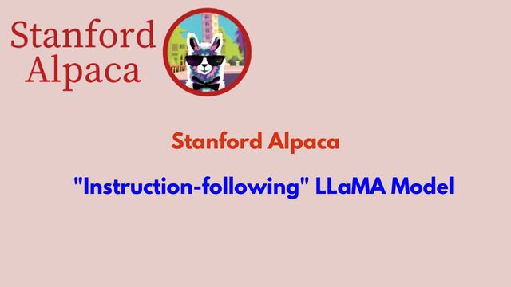{ width="200" }

    ### [Stanford Alpaca](dsblog/Stanford-Alpaca.md)
    
    **Read time:** 6 min
    
    Explore Stanford Alpaca, an open-source instruction-following language model. Learn about its architecture, training process, and how to implement and
    

- 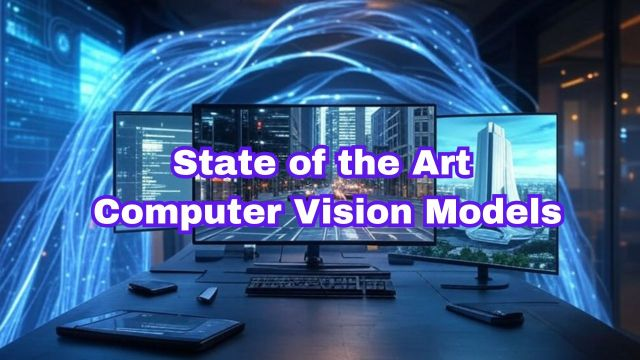{ width="200" }

    ### [State of the Art Image Generation Models in Computer Vision: A Comprehensive Overview](dsblog/State-of-the-Art-Computer-Vision-Models.md)
    
    **Read time:** 15 min
    
    In this article, we explore the different methods of image generation, including diffusion models, GANs, and autoregressive models. We also discuss th

- 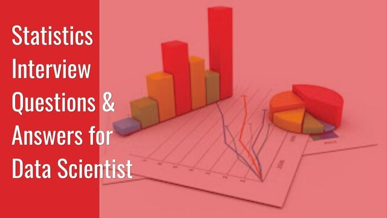{ width="200" }

    ### [Statistics Interview Question for Data Scientist](dsblog/Statistics-Interview-Question-for-Data-Scientist.md)
    
    **Read time:** 63 min
    
    A comprehensive collection of statistics interview questions for data scientists, covering fundamental concepts like probability theory, hypothesis te
    

- 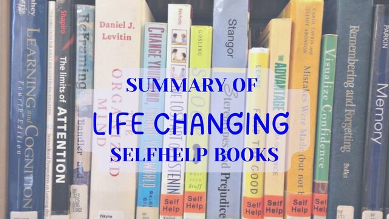{ width="200" }

    ### [Summary of Life Changing Selfhelp Books](dsblog/Summary-of-Life-Changing-Selfhelp-Books.md)
    
    **Read time:** 5 min
    
    A curated collection of transformative self-help book summaries. Discover key insights and life-changing principles from influential authors that can 

- 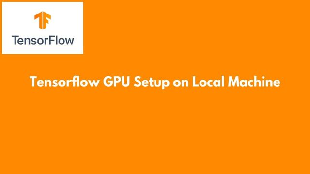{ width="200" }

    ### [Tensorflow GPU Setup on Local Machine](dsblog/Tensorflow-gpu-setup-on-local-machine.md)
    
    **Read time:** 18 min
    
    A comprehensive guide to setting up TensorFlow with GPU support on your local machine. Learn about CUDA, Docker configuration, and essential steps for
    

- { width="200" }

    ### [The Complete Ecosystem of Software Development](dsblog/The-Complete-Ecosystem-of-Software-Development.md)
    
    **Read time:** 11 min
    
    The complete ecosystem of software development is a fascinating area that encapsulates not just technical aspects but also the collaborative, creative

- 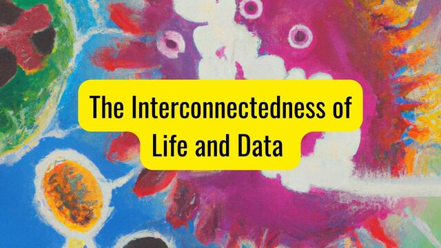{ width="200" }

    ### [The Interconnectedness of Life and Data](dsblog/The-Interconnectednessof-Life-and-Data.md)
    
    **Read time:** 13 min
    
    An exploration of how data has become interwoven with every aspect of modern life, from personal experiences to technological advancements. This artic
    

- { width="200" }

    ### [The Road to Bharat LLMs Goes Via Sanskrit](dsblog/The-Road-of-Bharat-LLM-goes-via-Sanskri.md)
    
    **Read time:** 33 min
    
    In this article, we explore the case for Sanskrit as India's AI language. While many languages have been considered for AI development, Sanskrit is un

- { width="200" }

    ### [The Science of Reasoning](dsblog/The-Science-of-Reasoning.md)
    
    **Read time:** 12 min
    
    Deep dive into the science of reasoning and logical thinking. Explore different types of reasoning, common logical fallacies, and how to build sound a
    

- 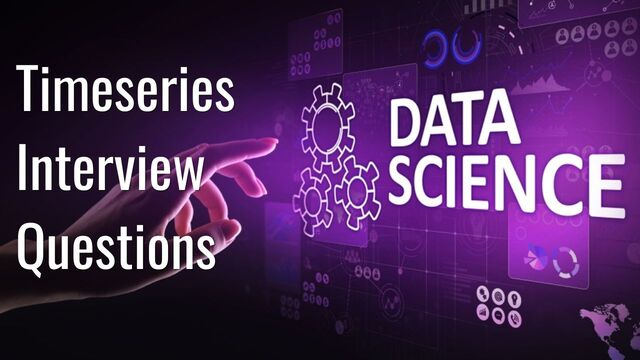{ width="200" }

    ### [Timeseries Interview Questions](dsblog/Timeseries-Interview-Questions.md)
    
    **Read time:** 26 min
    
    EXCERPT Not Found

- 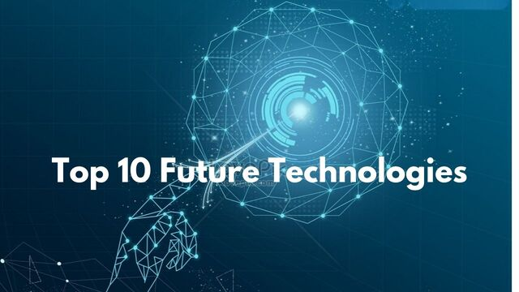{ width="200" }

    ### [Top 10 Technologies of Future](dsblog/Top-10-Technologies-of-Future.md)
    
    **Read time:** 5 min
    
    Explore the top 10 groundbreaking technologies that will shape our future. From AI and quantum computing to biotechnology and renewable energy, discov
    

- 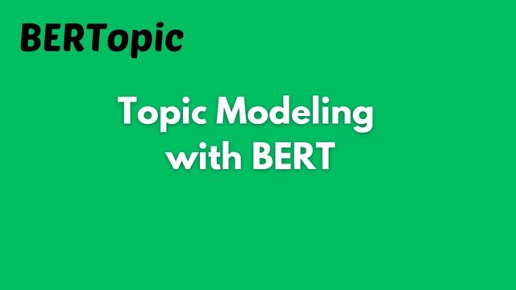{ width="200" }

    ### [Topic Modeling with BERT](dsblog/Topic-Modelling-with-BERTopic.md)
    
    **Read time:** 5 min
    
    Discover how to perform topic modeling using BERT-based approaches. Learn about advanced techniques for identifying and analyzing topics in text colle

- 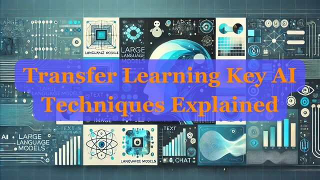{ width="200" }

    ### [Transfer Learning Key AI Techniques Explained](dsblog/Transfer-Learning-Key-AI-Techniques-Explained.md)
    
    **Read time:** 12 min
    
    A detailed exploration of key AI learning techniques including transfer learning, in-context learning, prompt engineering, and zero-shot learning, wit
    

- 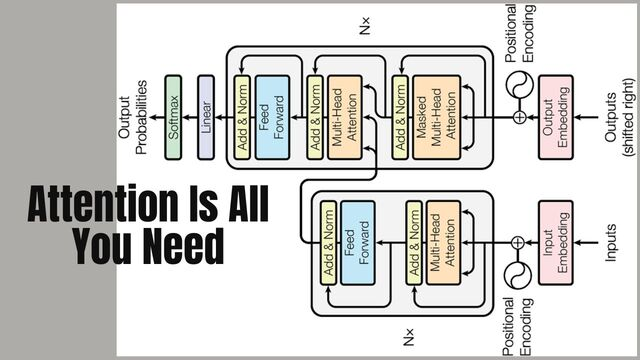{ width="200" }

    ### [Transformers Demystified A Step-by-Step Guide](dsblog/Transformers_Demystified_A_Step-by-Step_Guide.md)
    
    **Read time:** 39 min
    
    A comprehensive guide to understanding transformer architecture. Learn about attention mechanisms, encoder-decoder structures, and how transformers re

- 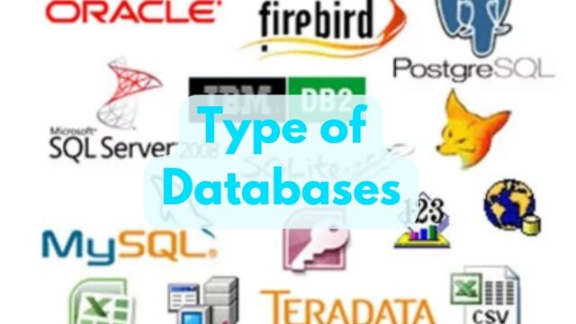{ width="200" }

    ### [Type of Databases](dsblog/Type-of-Databases.md)
    
    **Read time:** 10 min
    
    An extensive overview of different database types, from traditional relational databases to modern NoSQL solutions. Explore various database architect
    

- 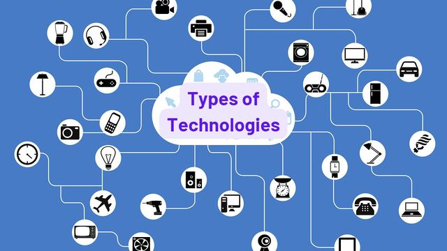{ width="200" }

    ### [Types of Technologies](dsblog/Type-of-Technologies.md)
    
    **Read time:** 6 min
    
    A comprehensive overview of various technology types and their applications in modern society. Explore different categories of technologies from infor

- 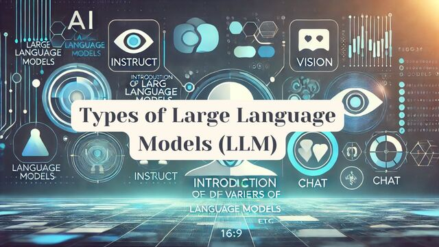{ width="200" }

    ### [Types of Large Language Models (LLM)](dsblog/Types-of-LLM.md)
    
    **Read time:** 7 min
    
    An in-depth exploration of Large Language Models (LLMs) types, including base models, instruction-tuned models, and embedding models. Discover their a
    

- 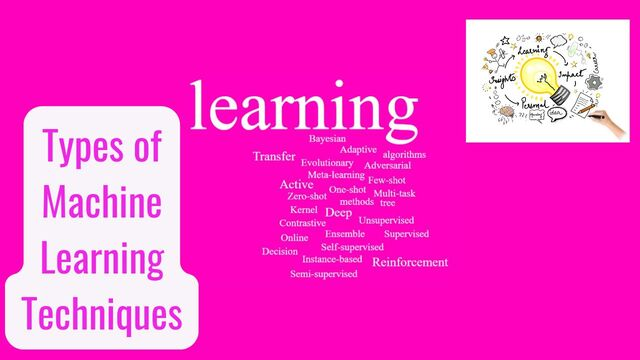{ width="200" }

    ### [Types of Machine Learning](dsblog/Types-of-Machine-Learning.md)
    
    **Read time:** 43 min
    
    A comprehensive guide to various types of machine learning approaches and algorithms. Explore different ML paradigms including supervised, unsupervise

- 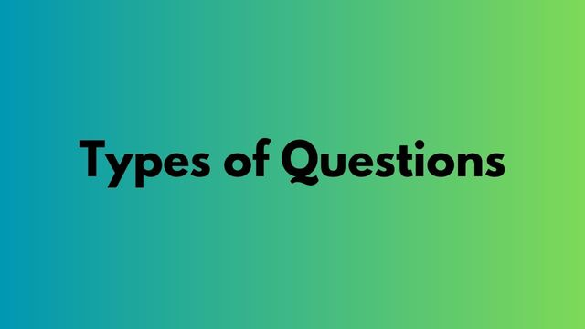{ width="200" }

    ### [Types of Questions](dsblog/Types-of-Questions.md)
    
    **Read time:** 7 min
    
    Explore different types of questions used in research, interviews, and communication. Learn about open-ended, closed-ended, probing, and rhetorical qu
    

- 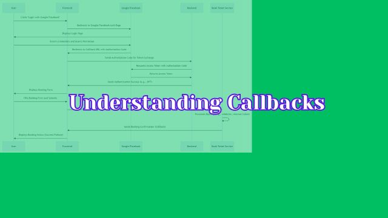{ width="200" }

    ### [Understanding Callbacks](dsblog/Understanding-Callbacks.md)
    
    **Read time:** 5 min
    
    Explore the concept of callbacks in software design, their functionality, and their use in asynchronous programming.

- 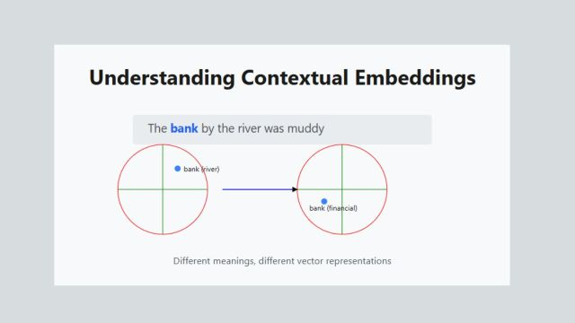{ width="200" }

    ### [Understanding Contextual Embedding in Transformers](dsblog/Understanding-Contextual-Embedding-in-Transformers.md)
    
    **Read time:** 10 min
    
    Dive into the world of contextual embeddings in transformer models and their transformative impact on NLP.
    

- 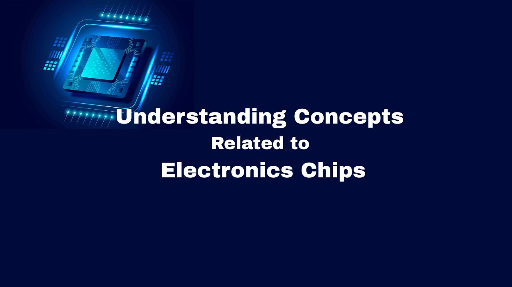{ width="200" }

    ### [Understanding Electronics Chips](dsblog/Understanding-Electronics-Chips.md)
    
    **Read time:** 27 min
    
    Learn how electronics chips work, including digital signal processing, analog to digital conversion, logic gates, integrated circuits, and microproces

- 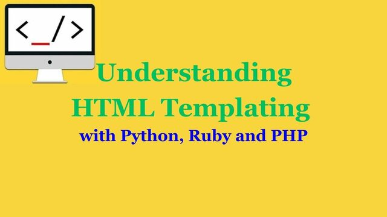{ width="200" }

    ### [Understanding HTML Templating with Python, Ruby, and PHP](dsblog/Understanding-HTML-Templating-with-Python-Ruby-PHP.md)
    
    **Read time:** 9 min
    
    EXCERPT Not Found
    

- 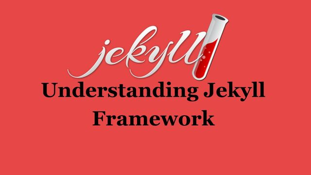{ width="200" }

    ### [Understanding Jekyll Framework](dsblog/Understanding-Jekyll-Framework.md)
    
    **Read time:** 7 min
    
    EXCERPT Not Found

- 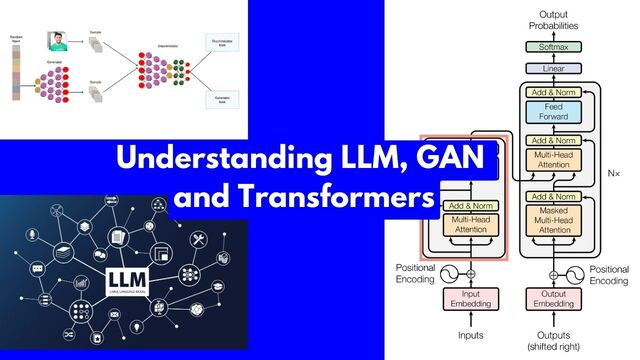{ width="200" }

    ### [Understanding LLM GAN and Transformers](dsblog/Understanding-LLM-GAN-and-Transformers.md)
    
    **Read time:** 11 min
    
    Compare and understand the architectures of Large Language Models, GANs, and Transformers. Learn about their unique characteristics, applications, and
    

- 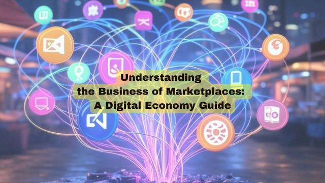{ width="200" }

    ### [Understanding the Business of Marketplaces](dsblog/Understanding-the-Business-of-Marketplaces.md)
    
    **Read time:** 9 min
    
    Learn the ins and outs of the online marketplace, understand different types of marketplaces, and explore their business models. This guide covers the

- 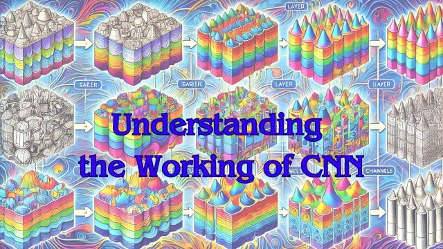{ width="200" }

    ### [Understanding the Working of CNN](dsblog/Understaning-Working-of-CNN.md)
    
    **Read time:** 19 min
    
    Explore the intricate workings of Convolutional Neural Networks and their impact on AI advancements.
    

- { width="200" }

    ### [Unlocking the Power of Prompts: A Comprehensive Guide to Prompt Engineering](dsblog/Unlocking-the-Power-of-Prompts.md)
    
    **Read time:** 9 min
    
    In this article, we explore the key concepts of prompt engineering, including AI prompting, the art of prompting, and cloud-based proprietary models. 

- { width="200" }

    ### [Unraveling the Google Web - Exploring the Purpose of Google's Websites](dsblog/Unraveling-the-Google-Web.md)
    
    **Read time:** 13 min
    
    A comprehensive guide to Google's vast web ecosystem, exploring the purpose and functionality of various Google websites and services. From productivi
    

- 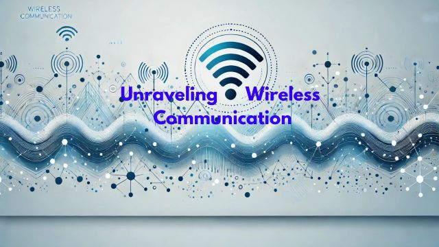{ width="200" }

    ### [Unraveling Wireless Communication: Key Protocols and Technologies](dsblog/Unraveling-Wireless-Communication.md)
    
    **Read time:** 24 min
    
    This article delves into the essential aspects of wireless communication, exploring various protocols like GSM, Wi-Fi, and more, while addressing chal

- 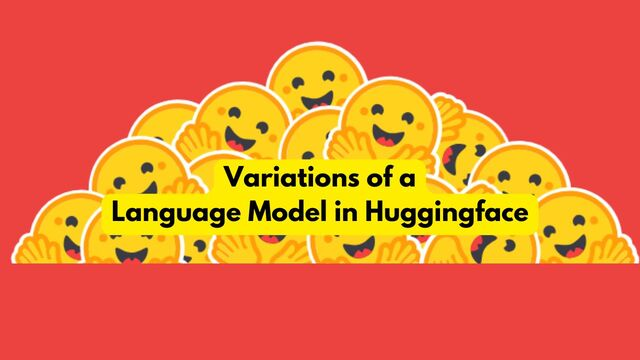{ width="200" }

    ### [Variations of Language Model in Huggingface](dsblog/Variations-of-Language-Model-in-Huggingface.md)
    
    **Read time:** 8 min
    
    An in-depth exploration of different language model variations in Hugging Face, including GPT2 adaptations, their architectures, and specific use case
    

- 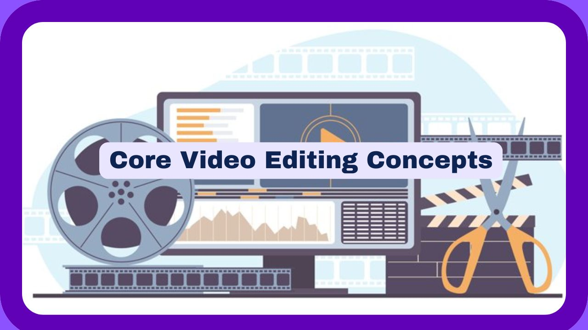{ width="200" }

    ### [Video Editing Concepts](dsblog/Video-Editing-Concepts.md)
    
    **Read time:** 12 min
    
    A comprehensive list of features and concepts that are useful to understand in any video editing software, whether you're using Shotcut, Adobe Premier

- 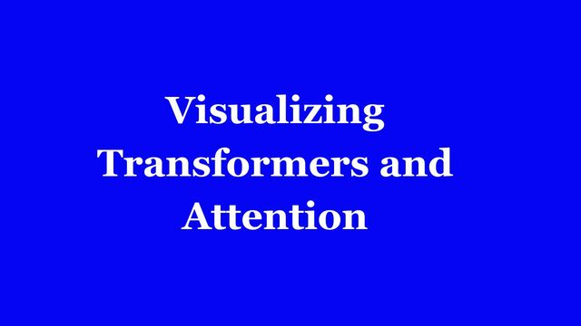{ width="200" }

    ### [Visualizing Transformers and Attention](dsblog/Visualizing-transformers-and-attention.md)
    
    **Read time:** 5 min
    
    Visualizing transformers and attention - A summary note from Grant Sanderson's talk at TNG Big Tech 2024
    

- 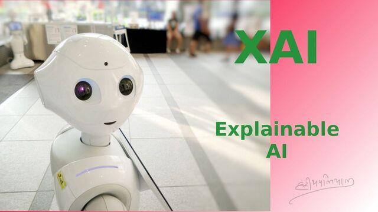{ width="200" }

    ### [What is XAI?](dsblog/What is XAI.md)
    
    **Read time:** 5 min
    
    Deep dive into Explainable AI (XAI) - understand how it makes AI systems transparent and interpretable. Learn about key XAI tools, techniques, and the

- 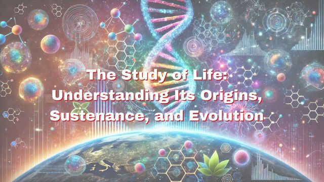{ width="200" }

    ### [What are Life Sciences?](dsblog/What-are-Life-Science.md)
    
    **Read time:** 5 min
    
    Understand the concept of life, its origins, sustenance, and evolution. This article covers the definition of life, characteristics, and branches of b
    

- { width="200" }

    ### [What Are Transformers in AI](dsblog/What-are-Transformers-in-AI.md)
    
    **Read time:** 69 min
    
    A comprehensive guide to AI Transformers, including a detailed timeline and overview of transformer model architectures from 2017 to present. Covers m

- 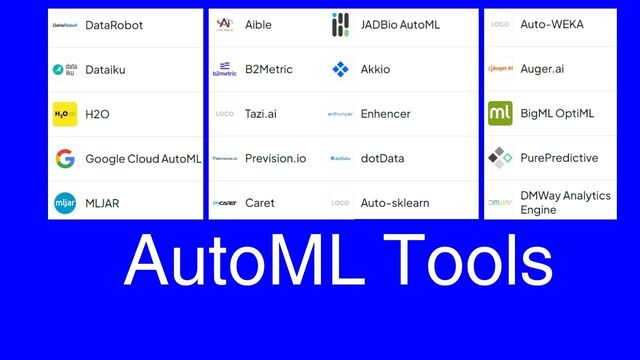{ width="200" }

    ### [Automated Machine Learning](dsblog/What-is-AutoML.md)
    
    **Read time:** 6 min
    
    A comprehensive overview of Automated Machine Learning (AutoML) tools and platforms. Compare leading solutions including Google Cloud AutoML, AWS Auto
    

- 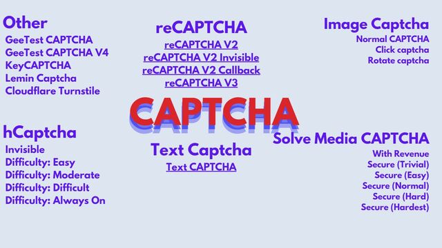{ width="200" }

    ### [What is CAPTCHA?](dsblog/What-is-captcha.md)
    
    **Read time:** 5 min
    
    Understanding CAPTCHA (Completely Automated Public Turing test to tell Computers and Humans Apart) - its purpose, types, implementation, and role in w

- 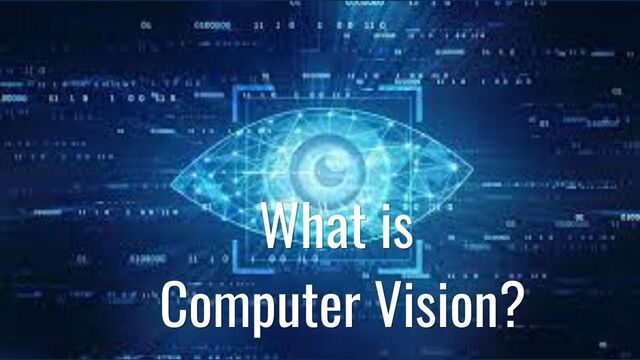{ width="200" }

    ### [What is Computer Vision](dsblog/What-is-Computer-Vision.md)
    
    **Read time:** 14 min
    
    Comprehensive guide to Computer Vision technology and its applications. Understand how machines process and interpret visual information using neural 
    

- 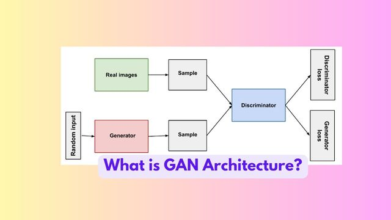{ width="200" }

    ### [What is GAN Architecture?](dsblog/What-is-GAN-Architecture.md)
    
    **Read time:** 5 min
    
    An in-depth exploration of Generative Adversarial Networks (GANs) architecture, including various GAN types, their applications in image generation, a

- { width="200" }

    ### [What is GAN?](dsblog/What-is-GAN.md)
    
    **Read time:** 6 min
    
    A comprehensive introduction to Generative Adversarial Networks (GANs), exploring their architecture, applications in image generation and synthesis, 
    

- 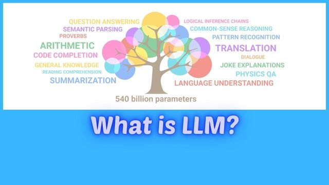{ width="200" }

    ### [What is LLM](dsblog/What-is-LLM.md)
    
    **Read time:** 21 min
    
    Explore Large Language Models (LLMs) and their fundamental concepts. Learn about transformer architecture, model types like GPT and BERT, and understa

- 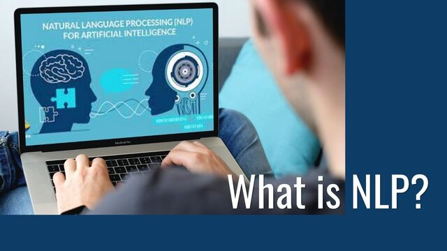{ width="200" }

    ### [What is NLP?](dsblog/What-is-NLP.md)
    
    **Read time:** 13 min
    
    Comprehensive introduction to Natural Language Processing (NLP) and its applications. Learn about word embeddings, text analysis techniques, and how N
    

- 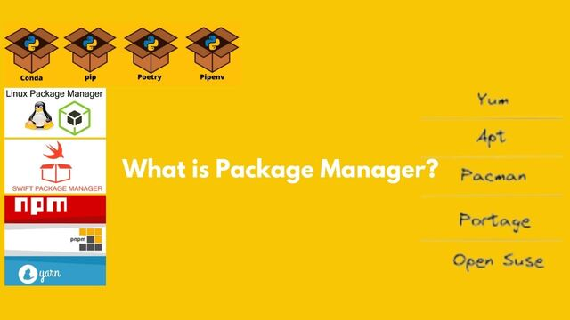{ width="200" }

    ### [What is Package Manager?](dsblog/What-is-Package-Manager.md)
    
    **Read time:** 6 min
    
    Understand package managers and their role in software development. Learn about different package management tools, dependency resolution, and best pr

- 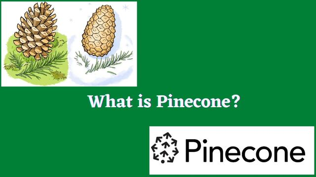{ width="200" }

    ### [What is Pinecone](dsblog/What-is-Pinecone.md)
    
    **Read time:** 8 min
    
    An introduction to Pinecone, a vector database designed for machine learning applications. Learn about vector embeddings, similarity search, and how P
    

- { width="200" }

    ### [What is Unicode and how does it works?](dsblog/What-is-Unicode.md)
    
    **Read time:** 9 min
    
    Understand Unicode and its implementation in modern computing. Learn about different Unicode encodings (UTF-8, UTF-16, UTF-32), their uses, and how th

- { width="200" }

    ### [WhatsApp Integration: Webhooks, Messaging, and Architecture Design](dsblog/Whatsapp-Integration.md)
    
    **Read time:** 17 min
    
    Comprehensive guide covering WhatsApp integration essentials, from compliance and messaging capabilities to tools and implementation strategies.
    

- 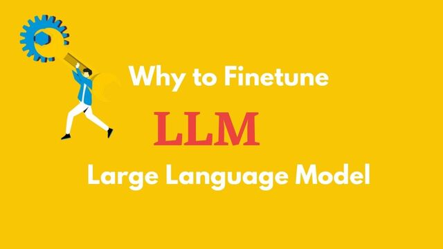{ width="200" }

    ### [Why to Finetune LLM?](dsblog/Why-to-finetune-LLM.md)
    
    **Read time:** 16 min
    
    Learn why and how to fine-tune Large Language Models. Understand the benefits, techniques, and best practices for customizing AI models to specific us

- 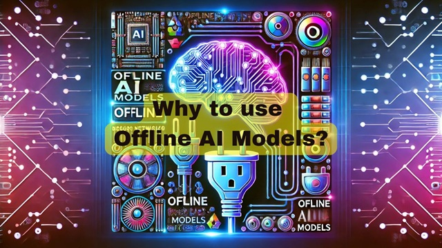{ width="200" }

    ### [Why Use Offline AI Models?](dsblog/Why-to-use-offline-ai-models.md)
    
    **Read time:** 10 min
    
    Discover the compelling reasons to use offline AI models, from unfiltered research outputs and enhanced data privacy to cost efficiency and customizat
    

- 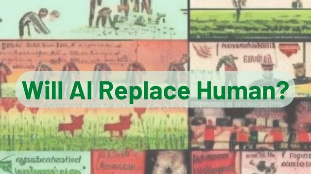{ width="200" }

    ### [Will AI Replace Human?](dsblog/Will-AI-Replace-Human.md)
    
    **Read time:** 5 min
    
    An in-depth exploration of AI's potential impact on human work and society, examining the evolution of industrial revolutions and how artificial intel

- 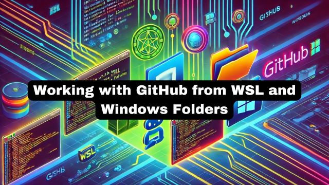{ width="200" }

    ### [Working with GitHub from WSL and Windows Folders](dsblog/Working-with-Github-from-WSL-and-Windows-Folders.md)
    
    **Read time:** 5 min
    
    Learn how to seamlessly integrate GitHub with Windows Subsystem for Linux (WSL) and manage projects across Windows folders. This guide covers branchin
    

