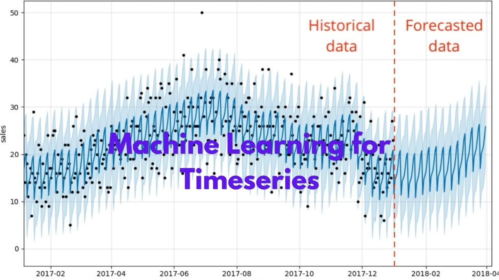
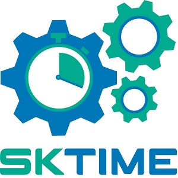

# Machine Learning for Timeseries

A brief summary of the topics covered in this course is as below. This is 24 hours course, it is suggested to complete this course in 3 weeks. Apart from my classroom course, you will be given exercises, and it will take another 100 hours in the course duration to complete these exercises.

## **Introduction to Timeseries**

*   What is a time series?
*   Time-dependent seasonal components.
*   Autocorrelation
*   Seasonality
*   Stationarity
*   Autoregressive (AR),
*   Moving average (MA) and mixed ARMA- Modeler.
*   Autoregressive Integrated Moving Average Model (ARIMA)
*   Seasonal autoregressive integrated moving average model (SARIMA)
*   Autocorrelation function (ACF)
*   Partial Autocorrelation function (PACF)
*   The random walk model.
*   Box-jenkins methodology.
*   Vector Auto Regression (VAR) models.
*   Dynamic models with time-shifted explanatory variables.
*   The koyck transformation.
*   Granger’s causality tests.
*   Stationarity, unit roots and integration
*   Time series model performance
*   Various approach to solve time series problem
*   Complete end-to-end project with deployment, nifty stock price prediction and deployment.

## **Forecasting**

*   Introduction to forecasting : Purpose, process, components of a time series, overfitting and data partitioning
*   Model building: Level, linear trend, quadratic trend, exponential trend, additive seasonality, multiplicative seasonality, combining trend & seasonality, forecasting future data
*   ARIMA model – Lag analysis, Model building, implementation

## **Deep Learning for Time Series**

*   RNN (Recurrent Neural Network)
*   GRU (Gated Recurrent Unit)
*   LSTM (Long Short-term Memory)
*   Bidirectional RNN

## **Time Series Libraries**

{: width="145"}
{: width="145"}
{: width="145"}
{: width="145"}
{: width="145"}

Automated Time Series Models in Python (AtsPy)
