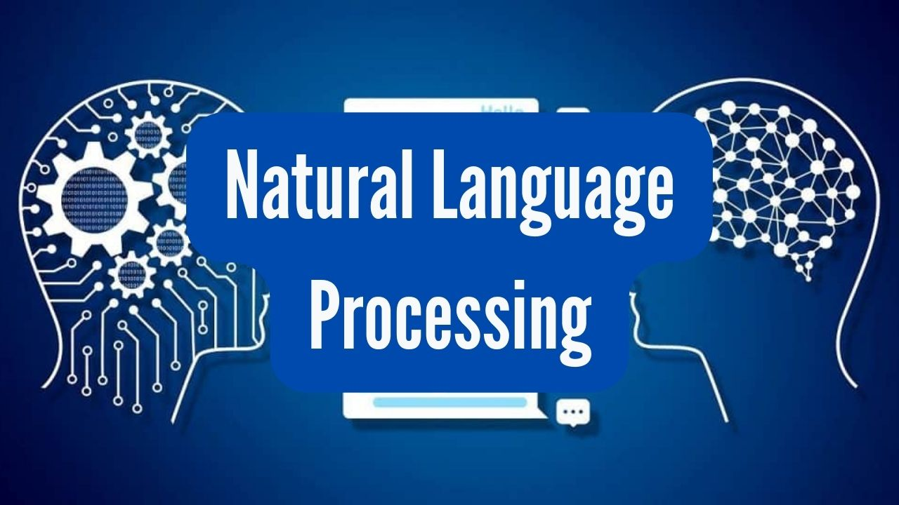

# Natural Language Processing (NLP)

## Foundation of Natural Language Processing
*   Overview computational linguistic.
*   History of NLP
*   Why NLP
*   Use of NLP
*   Language modelling with N-gram
*   Spelling correction
*   Neural networks and neural language models
*   Parts-of-Speech tagging
*   Syntactic parsing
*   Language semantics
*   Computational semantics

## Text Analytics, Processing, and Predictive Modelling
*   Introduction to text analytics (text encoding, regular expressions\*, word frequencies & stop words, tokenization, bag-of-words representation, stemming & lemmatization, TF-IDF)
*   The Naive Bayes algorithm (Bayes’ theorem and its building blocks, Naive Bayes for text classification)

## Text Processing Importing text.
*   Web scrapping.
*   Text processing
*   Understanding regex.
*   Text normalization
*   Word count.
*   Frequency distribution.
*   Text annotation.
*   Use of annotator.
*   String tokenization
*   Annotator creation.
*   Sentence processing.
*   Lemmatization in text processing
*   POS.
*   Named entity recognition
*   Dependency parsing in text.
*   Sentimental analysis

## Word embedding
*   Word embedding
*   Co-occurrence vectors
*   Word2vec
*   Doc2vec

## RNN for NLP
*   Recurrent neural networks.
*   Long short term memory (LSTM)
*   Bi LSTM.
*   Stacked LSTM
*   GRU implementation.
*   Building a story writer using character level RNN.

## Attention based model
*   Seq2Seq.
*   Encoders and decoders.
*   Attention mechanism.
*   Attention neural networks
*   Self-attention

## Transfer learning in NLP
*   Introduction to transformers.
*   Bert model.
*   Elmo model.
*   GPT2 model
*   GPT3 model.
*   Albert model.
*   Distilbert model

## Transformers for NLP
*   GPT3
*   BERT

## NLP Libraries

### Spacy
*   Spacy overview
*   Spacy function
*   Spacy function implementation in text processing.
*   Pos tagging, challenges and accuracy.
*   Entities and named entry recognition
*   Interpolation, language models
*   NLTK
*   Text blob
*   Stanford NLP