# Welcome to my Data Science Courses

- 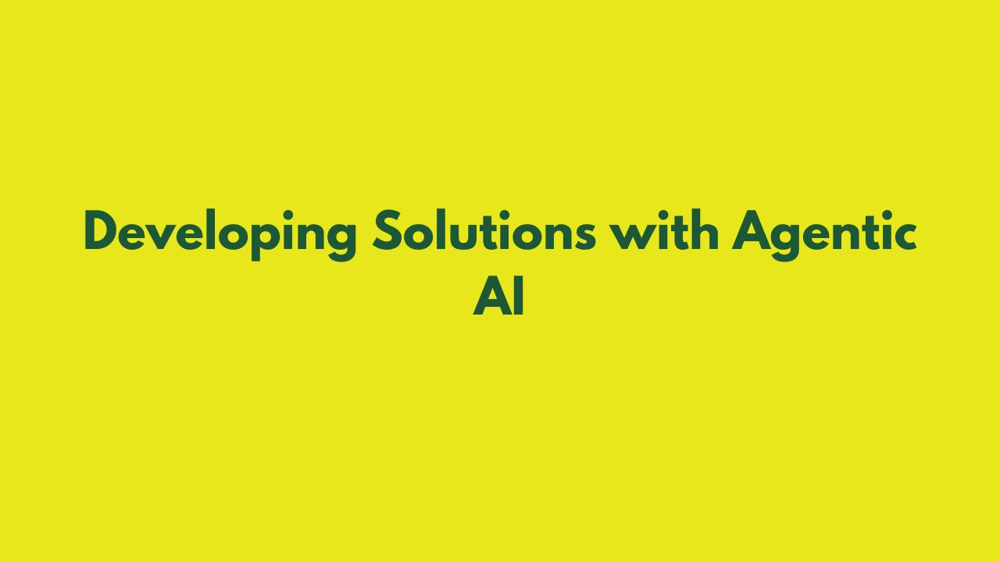{ width="200" }

    ### [Train Tensorflow Lite Models for Android](Developing-Solutions-with-AgenticAI.md)
    
    **Read time:** 5 min
    
    EXCERPT Not Found

- { width="200" }

    ### [AI Powered Account Management Strategies](GenAI-for-Account-Management-Strategies.md)
    
    **Read time:** 5 min
    
    EXCERPT Not Found
    

- { width="200" }

    ### [Generative AI for Client and Stakeholder Engagement](GenAI-for-Client-and-Stakeholder-Engagement.md)
    
    **Read time:** 5 min
    
    EXCERPT Not Found

- 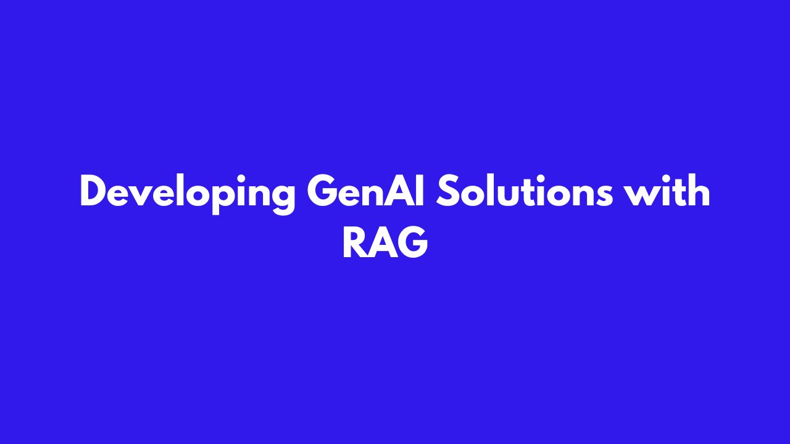{ width="200" }

    ### [Developing GenAI Solutions with LangChain & LlamaIndex](GenAI-for-Developing-Solutions-with-RAG.md)
    
    **Read time:** 5 min
    
    EXCERPT Not Found
    

- { width="200" }

    ### [Generative AI for Sales and Marketing](GenAI-for-Sales-and-Marketing.md)
    
    **Read time:** 5 min
    
    EXCERPT Not Found

- 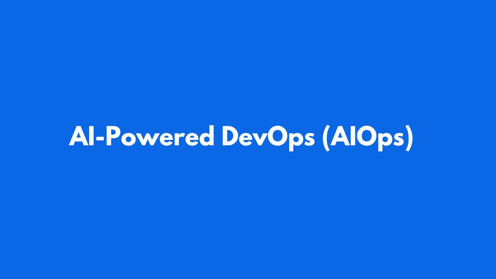{ width="200" }

    ### [AI-Powered DevOps for AIOps](GenAI-for-AIOps.md)
    
    **Read time:** 5 min
    
    EXCERPT Not Found
    

- 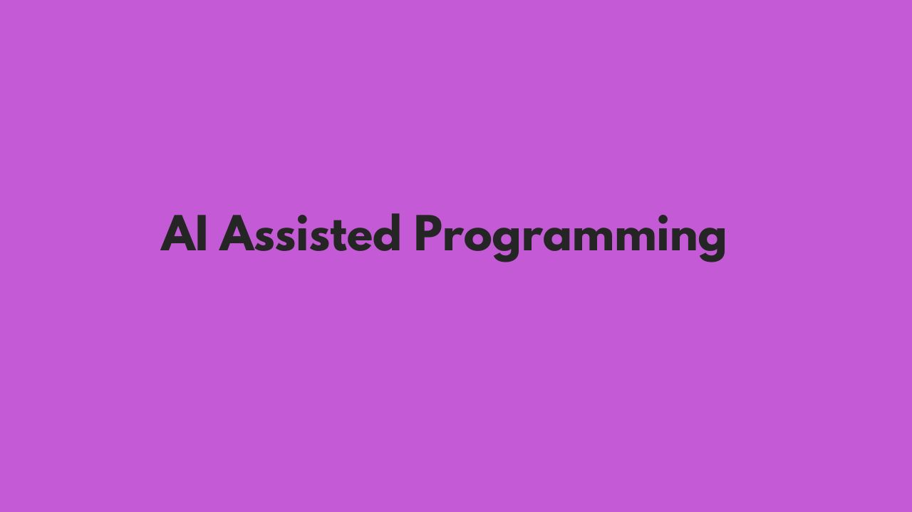{ width="200" }

    ### [GenAI for AI-Assisted Programming](GenAI-for-AI-Assisted-Programming.md)
    
    **Read time:** 5 min
    
    EXCERPT Not Found

- 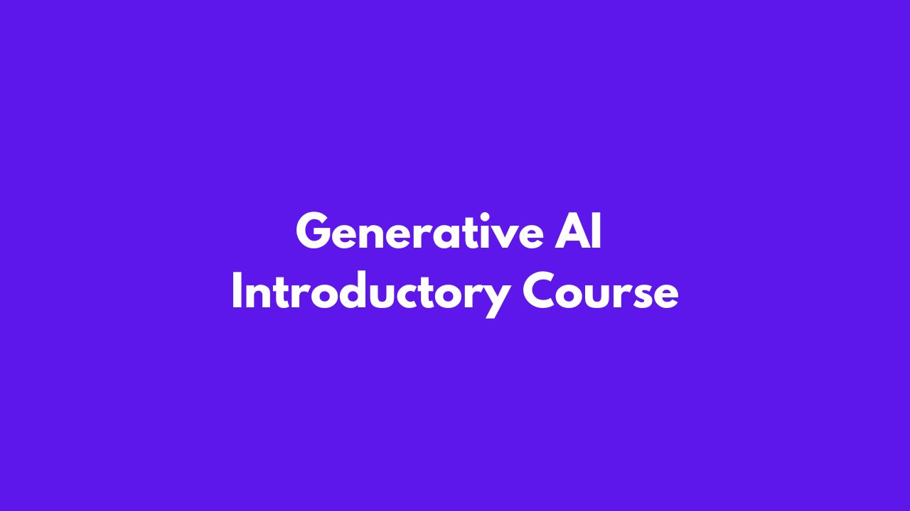{ width="200" }

    ### [GenAI for ALL](GenAI-for-ALL.md)
    
    **Read time:** 5 min
    
    EXCERPT Not Found
    

- 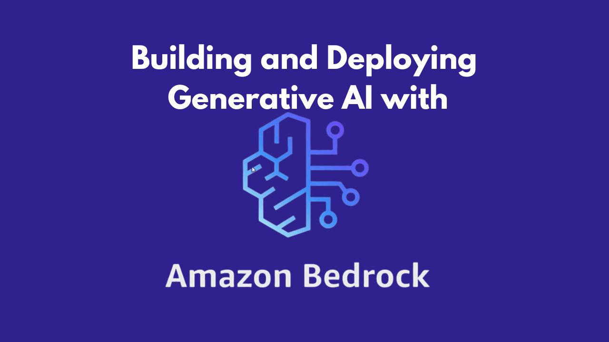{ width="200" }

    ### [Train Tensorflow Lite Models for Android](Building-and-Deploying-Generative-AI-with-Amazon-Bedrock.md)
    
    **Read time:** 5 min
    
    EXCERPT Not Found

- { width="200" }

    ### [Train Tensorflow Lite Models for Android](Train-Tensorflow-Lite-Models-for-Android.md)
    
    **Read time:** 10 min
    
    EXCERPT Not Found
    

- { width="200" }

    ### [Design for Cloud Computing with GCP](Design-for-Cloud-Computing-with-GCP.md)
    
    **Read time:** 5 min
    
    EXCERPT Not Found

- 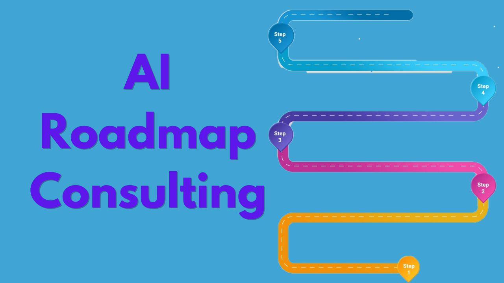{ width="200" }

    ### [AI Roadmap Consulting](AI-Roadmap-Consulting.md)
    
    **Read time:** 5 min
    
    EXCERPT Not Found
    

- { width="200" }

    ### [AI Solution Consulting](AI-Solution-Consulting.md)
    
    **Read time:** 5 min
    
    EXCERPT Not Found

- { width="200" }

    ### [Data Consulting](Data-Consulting.md)
    
    **Read time:** 5 min
    
    EXCERPT Not Found
    

- 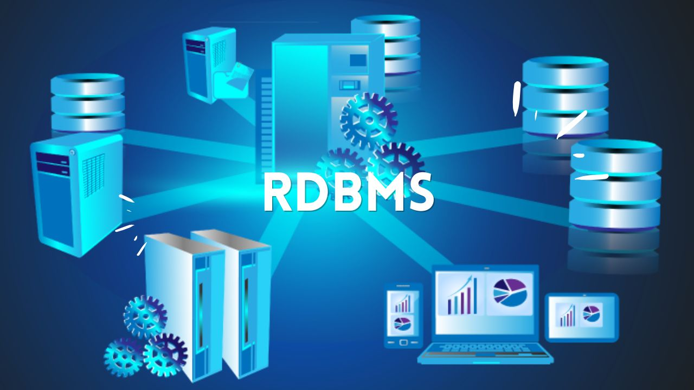{ width="200" }

    ### [RDBMS](RDBMS.md)
    
    **Read time:** 5 min
    
    EXCERPT Not Found

- 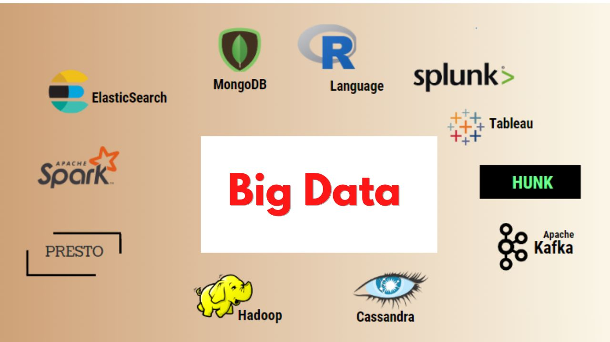{ width="200" }

    ### [Big Data](Big-Data.md)
    
    **Read time:** 5 min
    
    EXCERPT Not Found
    

- 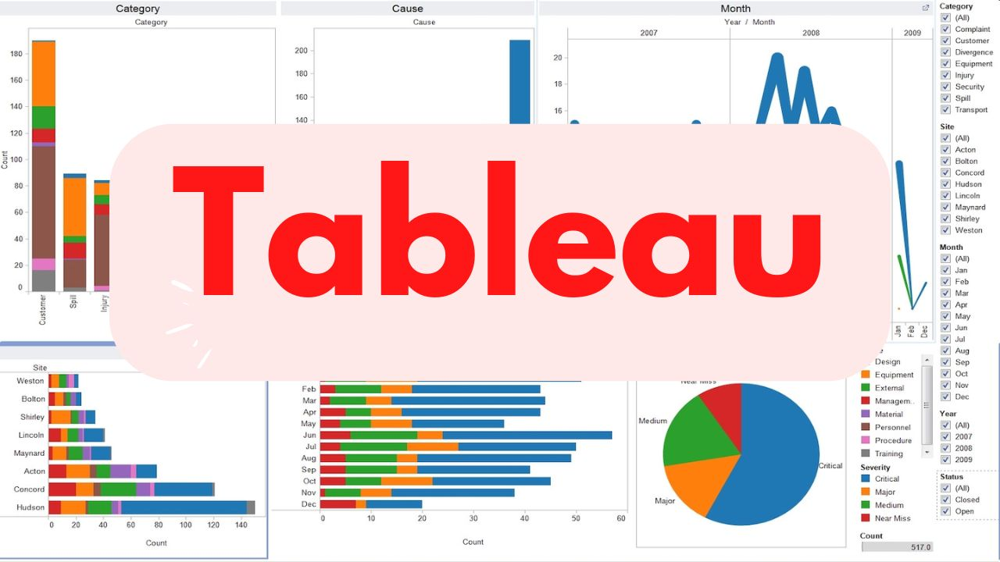{ width="200" }

    ### [Tableau](Tableau.md)
    
    **Read time:** 5 min
    
    EXCERPT Not Found

- { width="200" }

    ### [Power BI](Power-BI.md)
    
    **Read time:** 5 min
    
    EXCERPT Not Found
    

- 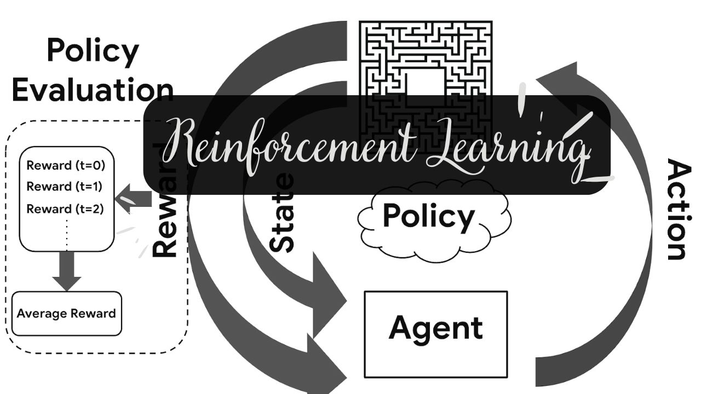{ width="200" }

    ### [Reinforcement Learning](Reinforcement-Learning.md)
    
    **Read time:** 5 min
    
    EXCERPT Not Found

- 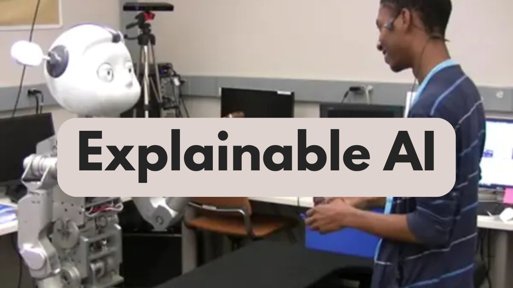{ width="200" }

    ### [Explainable AI](Explainable-AI.md)
    
    **Read time:** 5 min
    
    EXCERPT Not Found
    

- { width="200" }

    ### [Microsoft Excel](Microsoft-Excel.md)
    
    **Read time:** 5 min
    
    EXCERPT Not Found

- 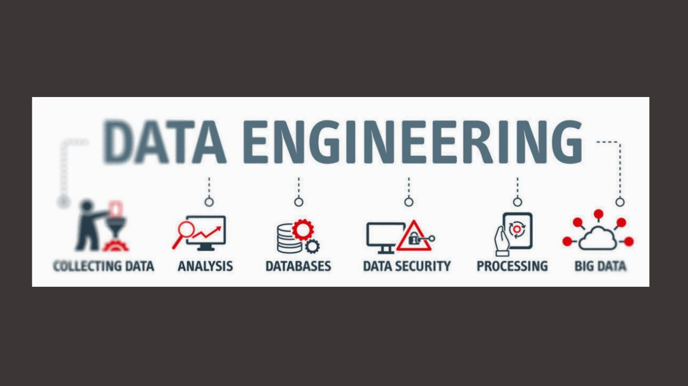{ width="200" }

    ### [Data Engineering](Data-Engineering.md)
    
    **Read time:** 5 min
    
    EXCERPT Not Found
    

- { width="200" }

    ### [Python For Data Science](Python-for-Data-Science.md)
    
    **Read time:** 5 min
    
    EXCERPT Not Found

- 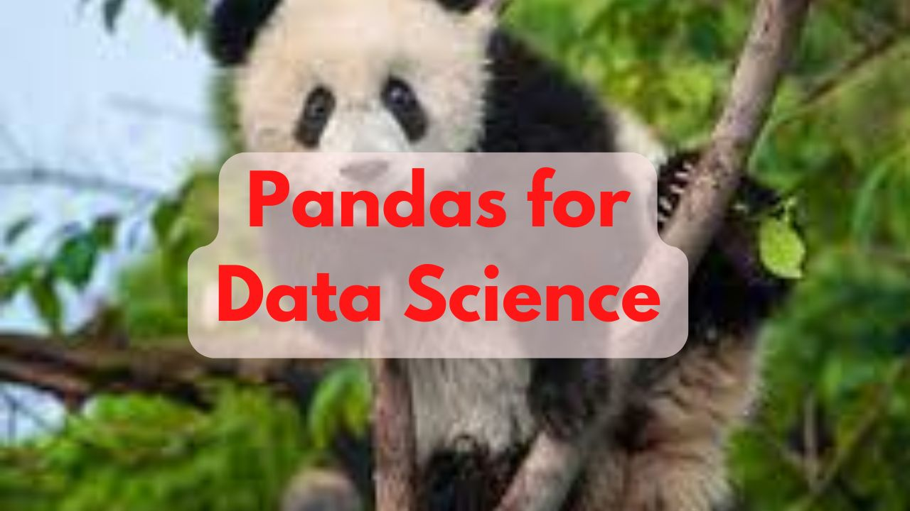{ width="200" }

    ### [Pandas for Data Science](Pandas-for-Data-Science.md)
    
    **Read time:** 5 min
    
    EXCERPT Not Found
    

- 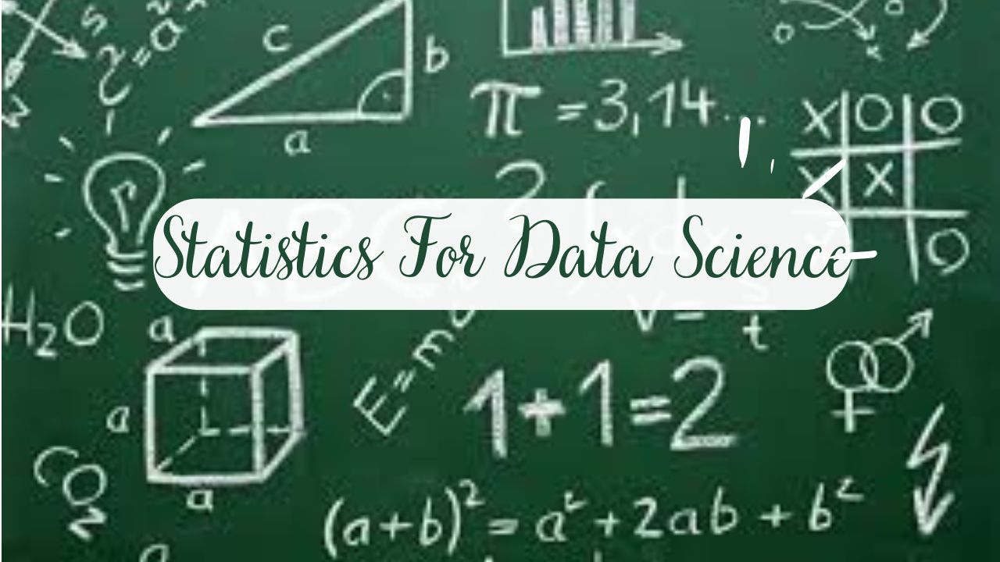{ width="200" }

    ### [Statistics For Data Science](Statistics-for-Data-Science.md)
    
    **Read time:** 5 min
    
    EXCERPT Not Found

- 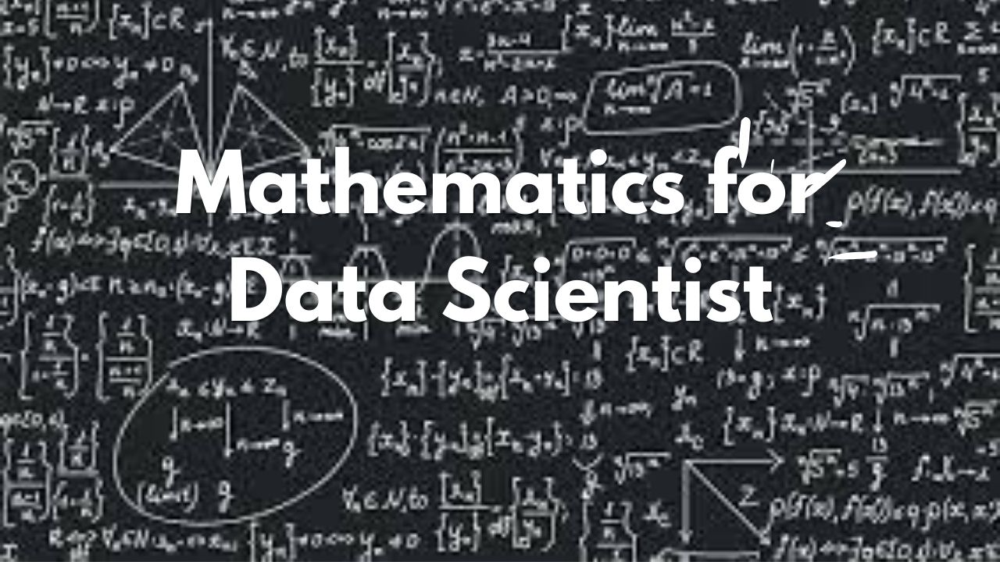{ width="200" }

    ### [Mathematics for Data Scientist](Mathematics-for-Data-Scientist.md)
    
    **Read time:** 5 min
    
    EXCERPT Not Found
    

- 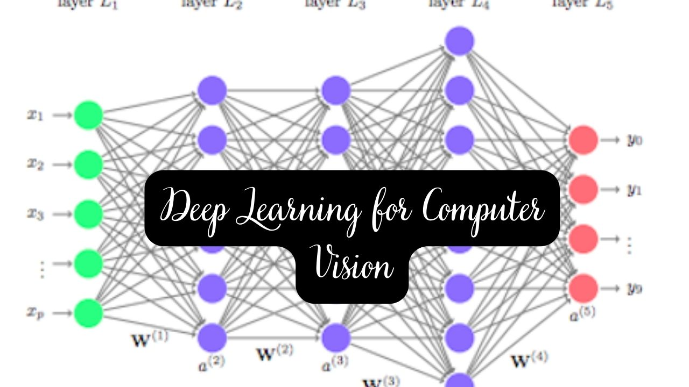{ width="200" }

    ### [Deep Learning for Computer Vision](Deep-Learning-Computer-Vision.md)
    
    **Read time:** 5 min
    
    EXCERPT Not Found

- 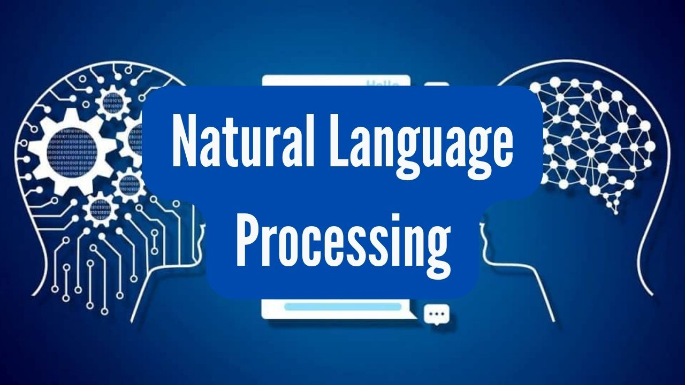{ width="200" }

    ### [Natural Language Processing](Natural-Language-Processing.md)
    
    **Read time:** 5 min
    
    EXCERPT Not Found
    

- 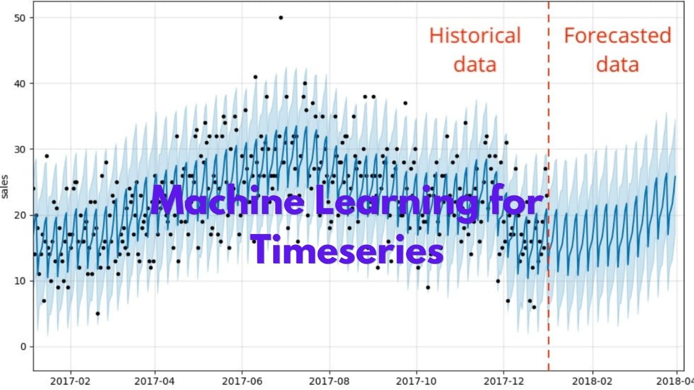{ width="200" }

    ### [Machine Learning for Timeseries](Machine-Learning-for-Timeseries.md)
    
    **Read time:** 5 min
    
    EXCERPT Not Found

- 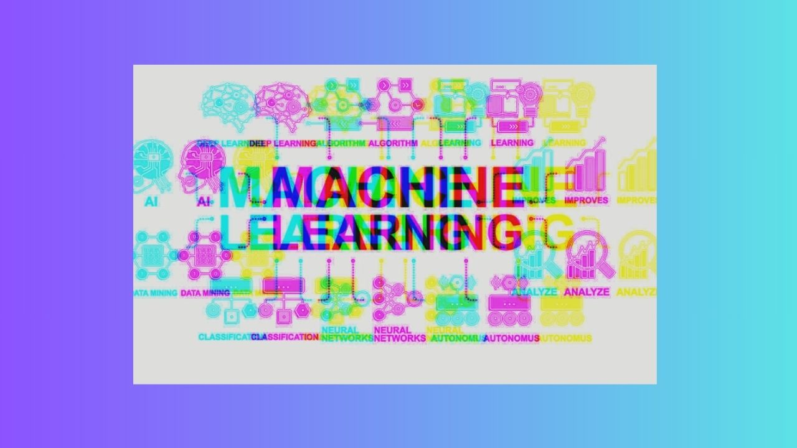{ width="200" }

    ### [Machine Learning Course](Machine-Learning.md)
    
    **Read time:** 5 min
    
    EXCERPT Not Found
    

