# Welcome to my Data Science Courses

- { width="200" }

    ### [Train Tensorflow Lite Models for Android](docs\dscourses\Developing-Solutions-with-AgenticAI.md)
    
    **Read time:** 5 min
    
    EXCERPT Not Found

- { width="200" }

    ### [AI Powered Account Management Strategies](docs\dscourses\GenAI-for-Account-Management-Strategies.md)
    
    **Read time:** 5 min
    
    EXCERPT Not Found
    

- { width="200" }

    ### [Generative AI for Client and Stakeholder Engagement](docs\dscourses\GenAI-for-Client-and-Stakeholder-Engagement.md)
    
    **Read time:** 5 min
    
    EXCERPT Not Found

- 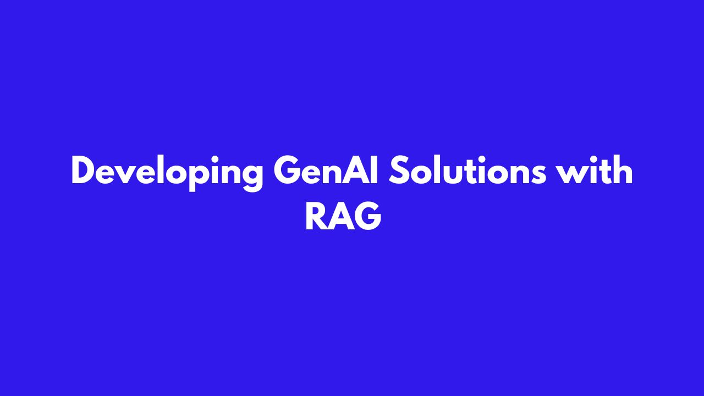{ width="200" }

    ### [Developing GenAI Solutions with LangChain & LlamaIndex](docs\dscourses\GenAI-for-Developing-Solutions-with-RAG.md)
    
    **Read time:** 5 min
    
    EXCERPT Not Found
    

- { width="200" }

    ### [Generative AI for Sales and Marketing](docs\dscourses\GenAI-for-Sales-and-Marketing.md)
    
    **Read time:** 5 min
    
    EXCERPT Not Found

- { width="200" }

    ### [AI-Powered DevOps for AIOps](docs\dscourses\GenAI-for-AIOps.md)
    
    **Read time:** 5 min
    
    EXCERPT Not Found
    

- 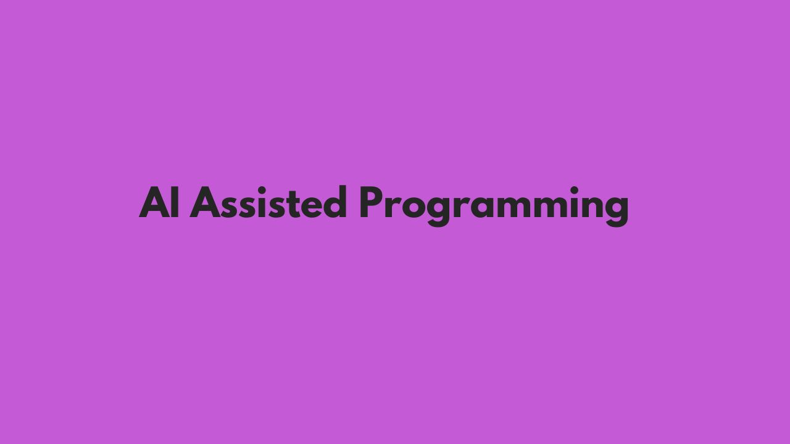{ width="200" }

    ### [GenAI for AI-Assisted Programming](docs\dscourses\GenAI-for-AI-Assisted-Programming.md)
    
    **Read time:** 5 min
    
    EXCERPT Not Found

- 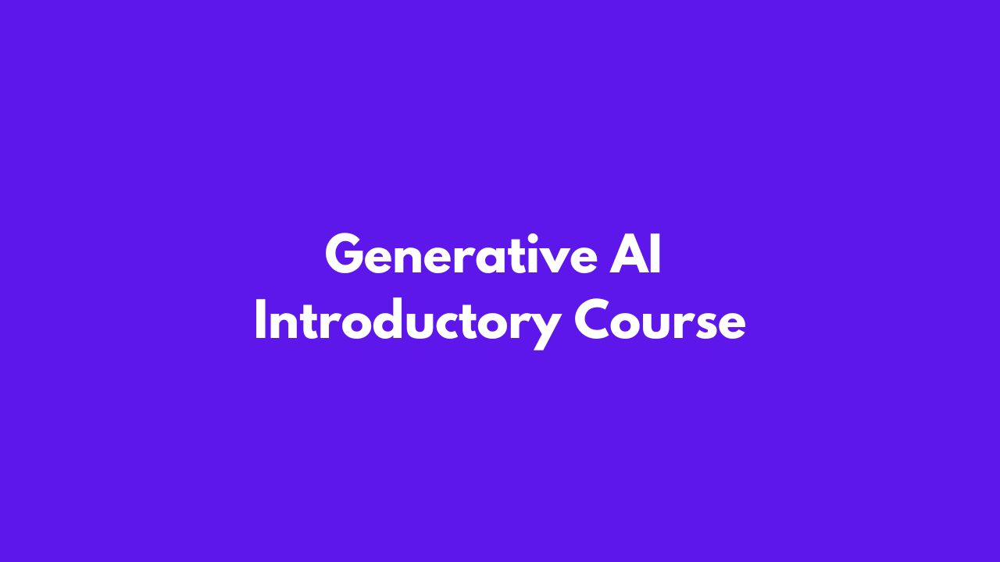{ width="200" }

    ### [GenAI for ALL](docs\dscourses\GenAI-for-ALL.md)
    
    **Read time:** 5 min
    
    EXCERPT Not Found
    

- 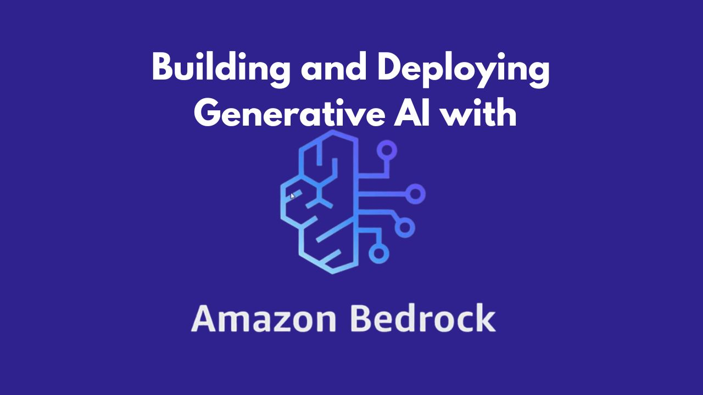{ width="200" }

    ### [Train Tensorflow Lite Models for Android](docs\dscourses\Building-and-Deploying-Generative-AI-with-Amazon-Bedrock.md)
    
    **Read time:** 5 min
    
    EXCERPT Not Found

- { width="200" }

    ### [Train Tensorflow Lite Models for Android](docs\dscourses\Train-Tensorflow-Lite-Models-for-Android.md)
    
    **Read time:** 10 min
    
    EXCERPT Not Found
    

- { width="200" }

    ### [Design for Cloud Computing with GCP](docs\dscourses\Design-for-Cloud-Computing-with-GCP.md)
    
    **Read time:** 5 min
    
    EXCERPT Not Found

- 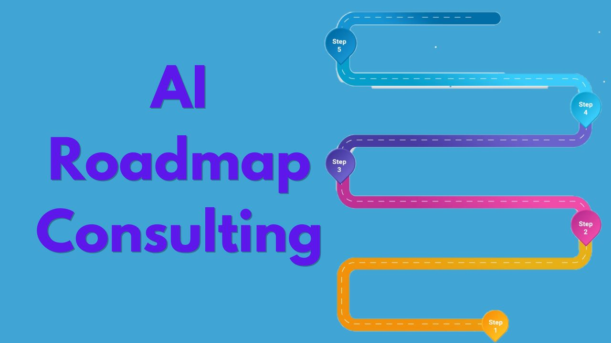{ width="200" }

    ### [AI Roadmap Consulting](docs\dscourses\AI-Roadmap-Consulting.md)
    
    **Read time:** 5 min
    
    EXCERPT Not Found
    

- { width="200" }

    ### [AI Solution Consulting](docs\dscourses\AI-Solution-Consulting.md)
    
    **Read time:** 5 min
    
    EXCERPT Not Found

- { width="200" }

    ### [Data Consulting](docs\dscourses\Data-Consulting.md)
    
    **Read time:** 5 min
    
    EXCERPT Not Found
    

- 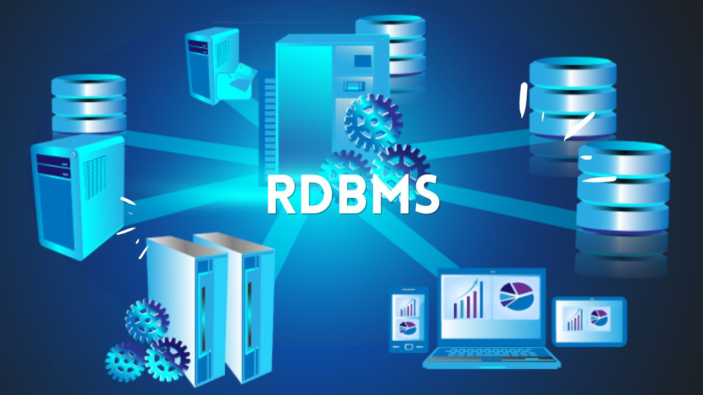{ width="200" }

    ### [RDBMS](docs\dscourses\RDBMS.md)
    
    **Read time:** 5 min
    
    EXCERPT Not Found

- 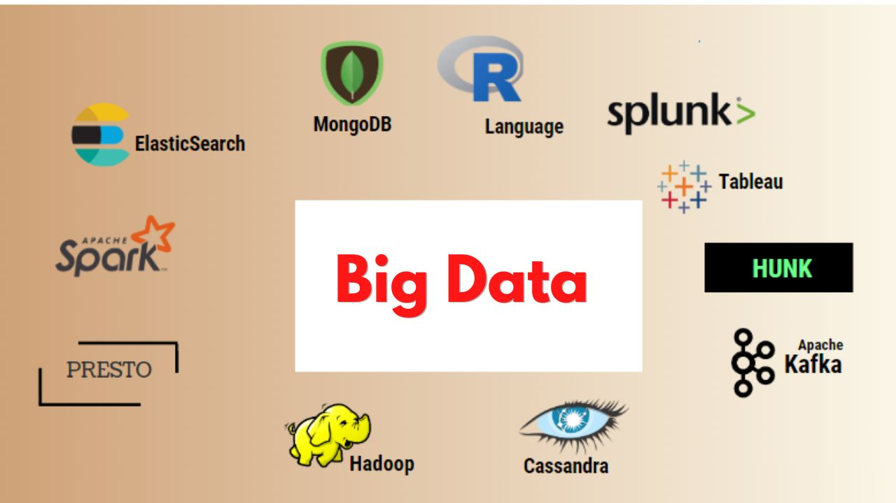{ width="200" }

    ### [Big Data](docs\dscourses\Big-Data.md)
    
    **Read time:** 5 min
    
    EXCERPT Not Found
    

- 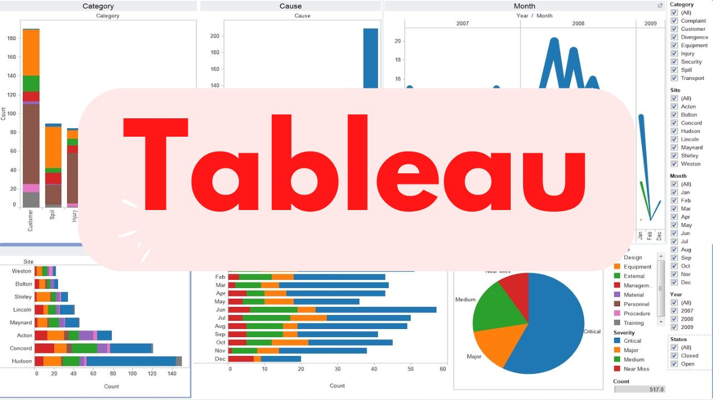{ width="200" }

    ### [Tableau](docs\dscourses\Tableau.md)
    
    **Read time:** 5 min
    
    EXCERPT Not Found

- { width="200" }

    ### [Power BI](docs\dscourses\Power-BI.md)
    
    **Read time:** 5 min
    
    EXCERPT Not Found
    

- 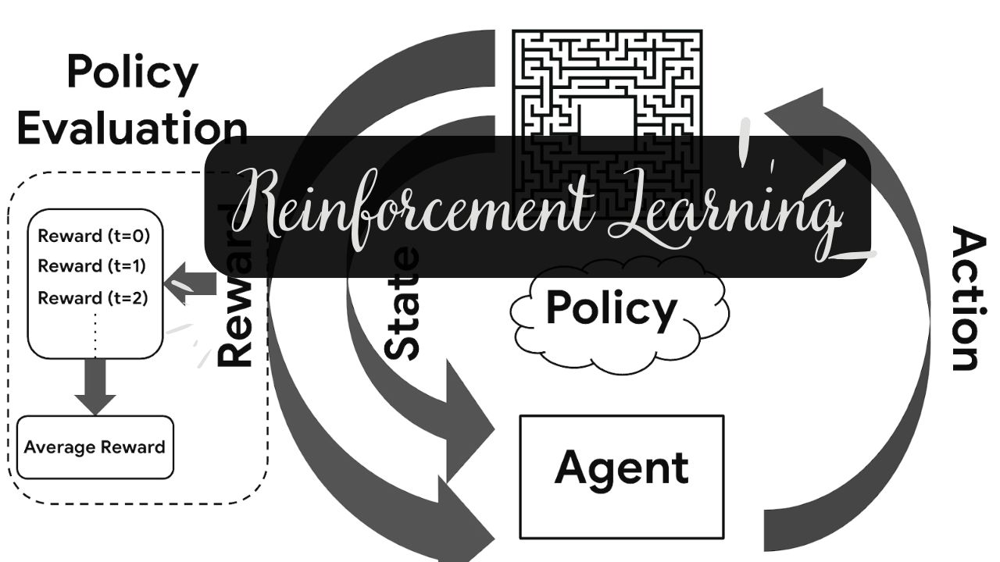{ width="200" }

    ### [Reinforcement Learning](docs\dscourses\Reinforcement-Learning.md)
    
    **Read time:** 5 min
    
    EXCERPT Not Found

- 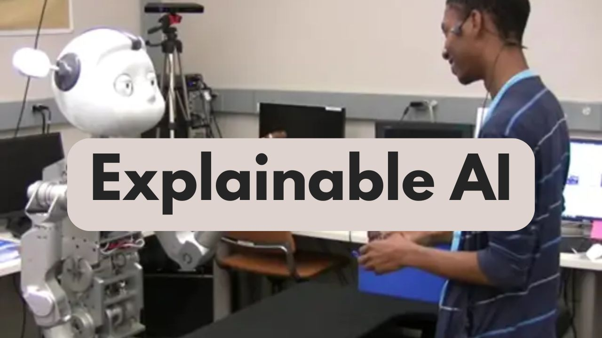{ width="200" }

    ### [Explainable AI](docs\dscourses\Explainable-AI.md)
    
    **Read time:** 5 min
    
    EXCERPT Not Found
    

- { width="200" }

    ### [Microsoft Excel](docs\dscourses\Microsoft-Excel.md)
    
    **Read time:** 5 min
    
    EXCERPT Not Found

- 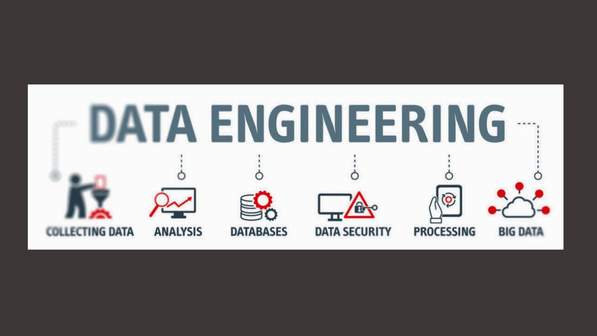{ width="200" }

    ### [Data Engineering](docs\dscourses\Data-Engineering.md)
    
    **Read time:** 5 min
    
    EXCERPT Not Found
    

- { width="200" }

    ### [Python For Data Science](docs\dscourses\Python-for-Data-Science.md)
    
    **Read time:** 5 min
    
    EXCERPT Not Found

- 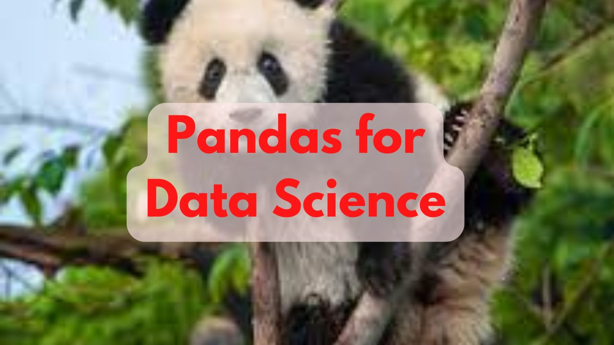{ width="200" }

    ### [Pandas for Data Science](docs\dscourses\Pandas-for-Data-Science.md)
    
    **Read time:** 5 min
    
    EXCERPT Not Found
    

- 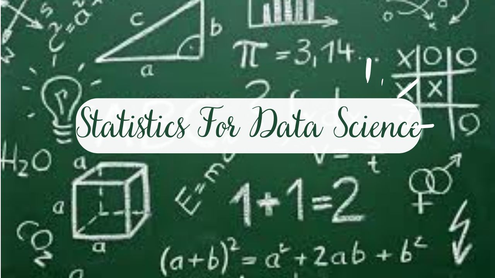{ width="200" }

    ### [Statistics For Data Science](docs\dscourses\Statistics-for-Data-Science.md)
    
    **Read time:** 5 min
    
    EXCERPT Not Found

- 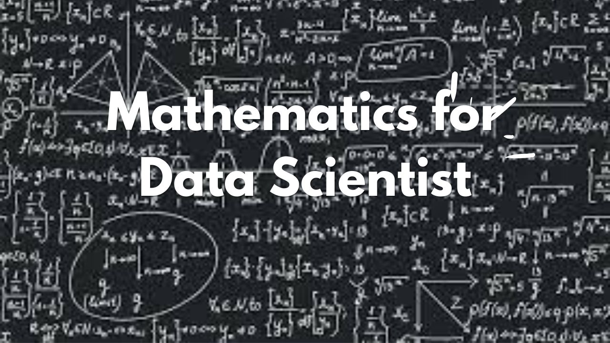{ width="200" }

    ### [Mathematics for Data Scientist](docs\dscourses\Mathematics-for-Data-Scientist.md)
    
    **Read time:** 5 min
    
    EXCERPT Not Found
    

- 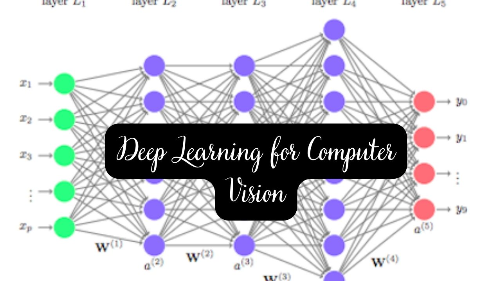{ width="200" }

    ### [Deep Learning for Computer Vision](docs\dscourses\Deep-Learning-Computer-Vision.md)
    
    **Read time:** 5 min
    
    EXCERPT Not Found

- 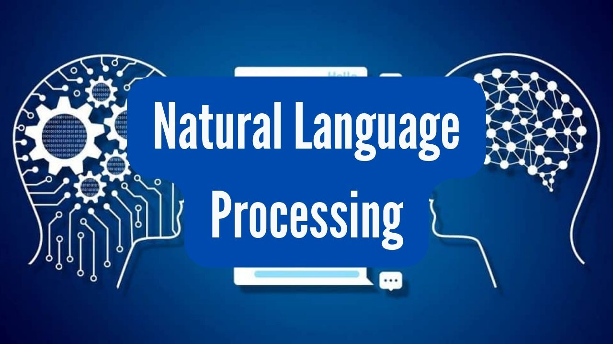{ width="200" }

    ### [Natural Language Processing](docs\dscourses\Natural-Language-Processing.md)
    
    **Read time:** 5 min
    
    EXCERPT Not Found
    

- 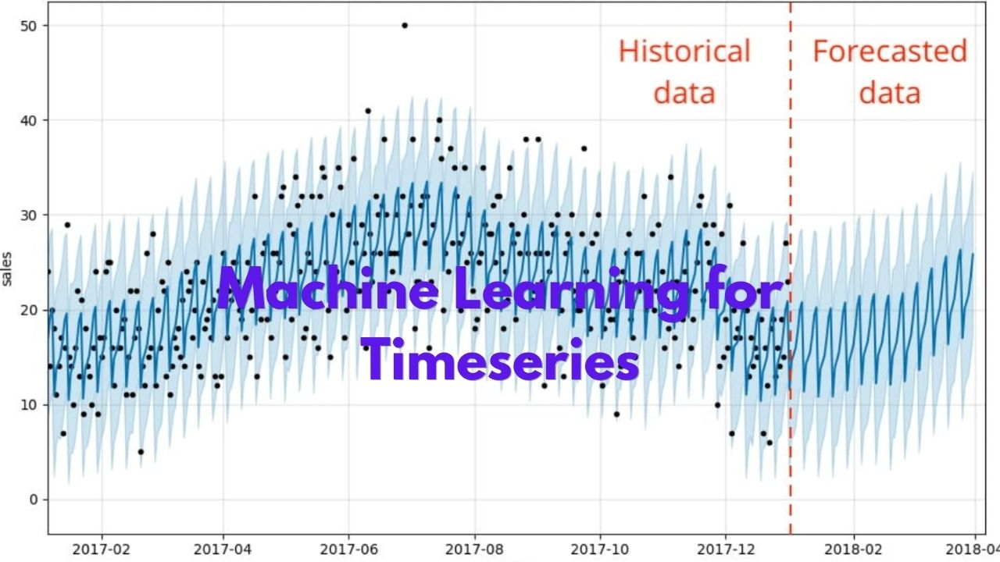{ width="200" }

    ### [Machine Learning for Timeseries](docs\dscourses\Machine-Learning-for-Timeseries.md)
    
    **Read time:** 5 min
    
    EXCERPT Not Found

- 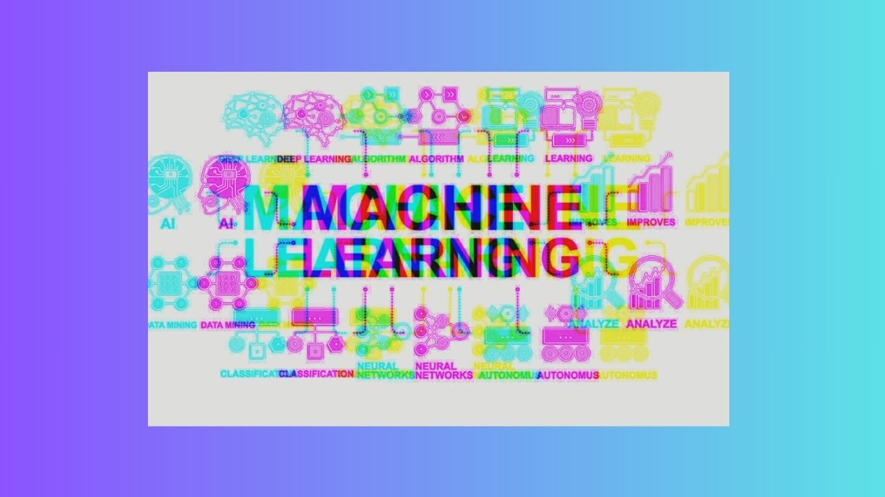{ width="200" }

    ### [Machine Learning Course](docs\dscourses\Machine-Learning.md)
    
    **Read time:** 5 min
    
    EXCERPT Not Found
    

