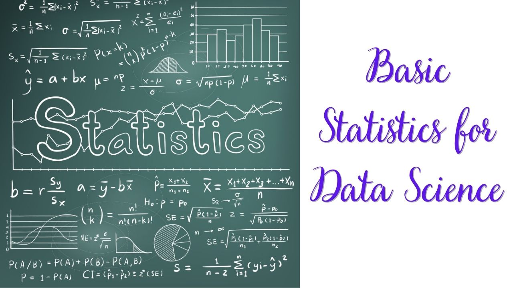
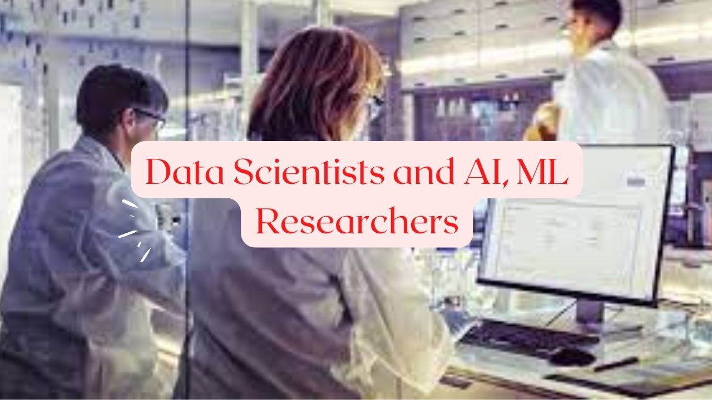
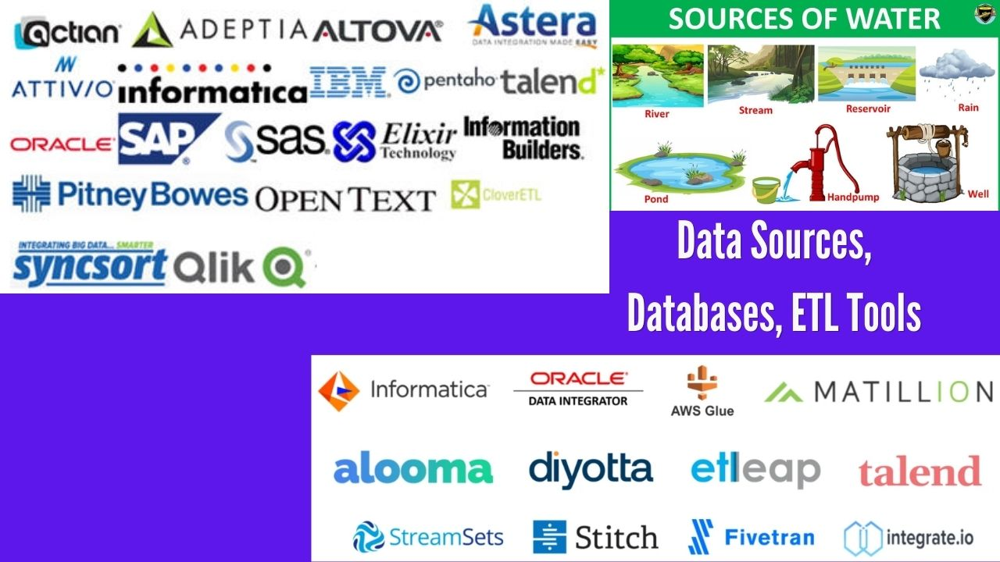
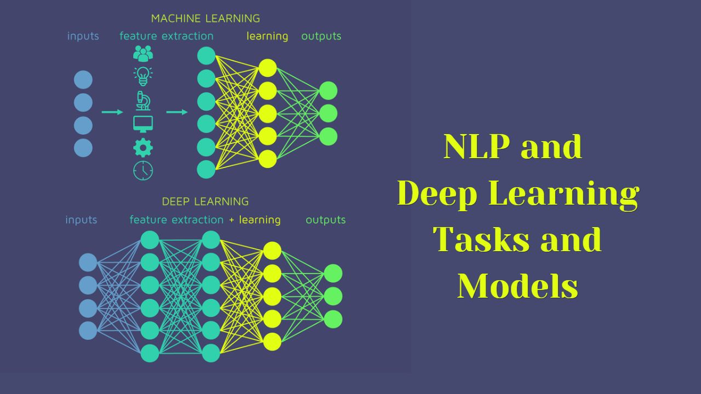
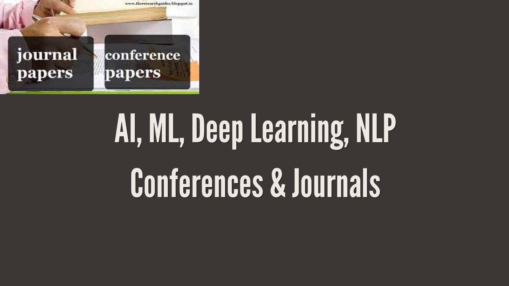
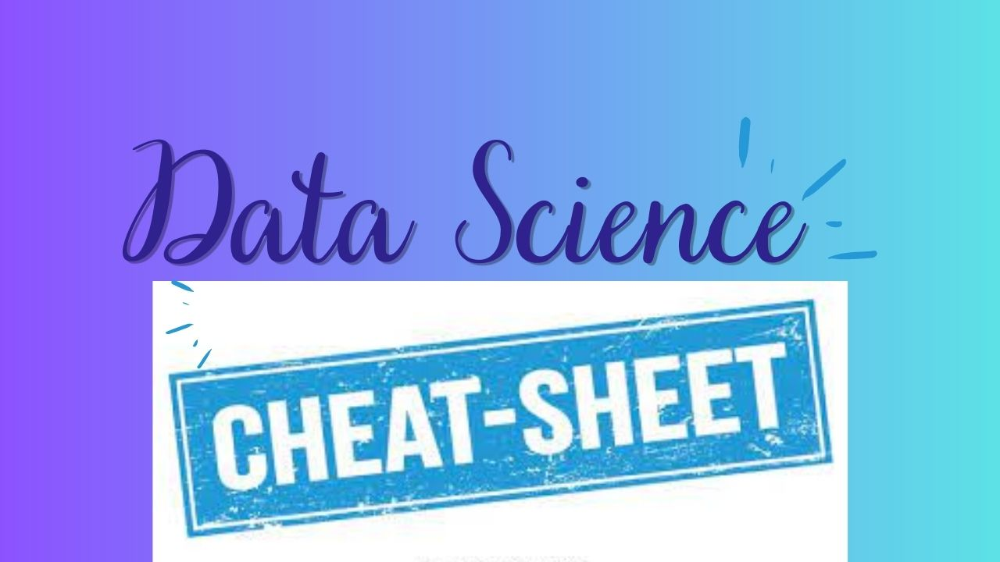
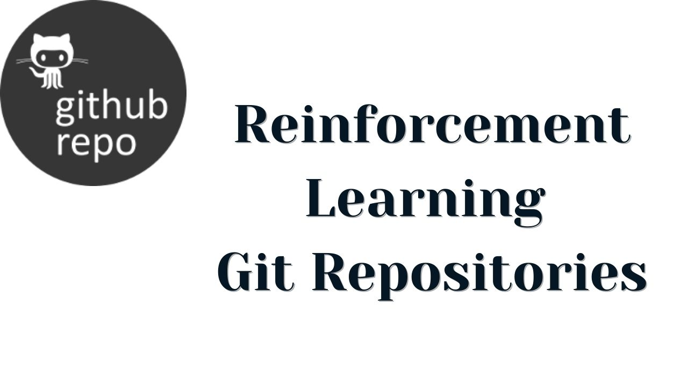

# Data Science Resources
Welcome to our comprehensive AI resources collection! This page serves as a curated hub for AI enthusiasts, researchers, and developers, featuring an extensive list of tools, libraries, datasets, frameworks, and learning materials. Organized across multiple pages/articles, our collection covers various aspects of artificial intelligence, including machine learning, deep learning, NLP, computer vision, LLM, GenAI, Mathmatics for Machine Learning, Reinforcement Learning and more.

Whether you're a beginner looking for foundational tutorials or an expert searching for advanced research papers, you'll find valuable resources to accelerate your AI journey. Explore, learn, and contribute to this ever-growing collection!

- { width="200" }

    ### [Github Repos for Data Science](Github-Repos-for-DataScience.md)
    
    **Read time:** 5 min
    
    EXCERPT Not Found

- { width="200" }

    ### [AI ML Resources from My Diary](AI-ML-Resources-from-My-Diary.md)
    
    **Read time:** 5 min
    
    EXCERPT Not Found
    

- { width="200" }

    ### [Data Science, AI, ML, eBooks, PDF Books](Data-Science-Books.md)
    
    **Read time:** 5 min
    
    EXCERPT Not Found

- { width="200" }

    ### [DS, AI, ML Online Course, Tutorial, Videos](DS-AI-ML-Online-Course-Tutorial-Videos.md)
    
    **Read time:** 5 min
    
    EXCERPT Not Found
    

- { width="200" }

    ### [Basic Statistics for Data Science](Basic-Statistics-for-Data-Science.md)
    
    **Read time:** 5 min
    
    EXCERPT Not Found

- { width="200" }

    ### [Data Scientists and AI, ML Researchers](Data-Scientists-and-AI-ML-Researchers.md)
    
    **Read time:** 5 min
    
    EXCERPT Not Found
    

- { width="200" }

    ### [Navigating the Data Landscape: Exploring Data Sources, Databases, and ETL Tools for Machine Learning Projects](Data-Sources-Databases-ETL-Tools.md)
    
    **Read time:** 5 min
    
    EXCERPT Not Found

- { width="200" }

    ### [Datasets](Datasets.md)
    
    **Read time:** 5 min
    
    EXCERPT Not Found
    

- { width="200" }

    ### [Machine Learning Tasks and Model Evaluation](ML-Tasks-and-Model-Evaluation.md)
    
    **Read time:** 5 min
    
    EXCERPT Not Found

- { width="200" }

    ### [Machine Learning Framework, Library, Tools](ML-Frameworks-Libraries-Tools.md)
    
    **Read time:** 5 min
    
    EXCERPT Not Found
    

- { width="200" }

    ### [My Daily Tools](My-Daily-Tools.md)
    
    **Read time:** 5 min
    
    EXCERPT Not Found

- { width="200" }

    ### [My Favorite Chrome Extensions](My-Favorite-Chrome-Extensions.md)
    
    **Read time:** 5 min
    
    EXCERPT Not Found
    

- { width="200" }

    ### [Best Resources to Learn Python](Best-Resources-to-Learn-Python.md)
    
    **Read time:** 5 min
    
    EXCERPT Not Found

- { width="200" }

    ### [AI, ML, DL Blogs Sites](AI-ML-Blogs.md)
    
    **Read time:** 5 min
    
    EXCERPT Not Found
    

- { width="200" }

    ### [AI, ML, Deep Learning, NLP Conferences & Journals](AI-ML-Conferences-and-Journals.md)
    
    **Read time:** 5 min
    
    EXCERPT Not Found

- { width="200" }

    ### [Best YouTube Channels to Learn Data Science](Best-Youtube-Channels-to-Learn-Data-Science.md)
    
    **Read time:** 5 min
    
    EXCERPT Not Found
    

- { width="200" }

    ### [High School Maths for Data Science](High-School-Maths-for-Data-Science.md)
    
    **Read time:** 5 min
    
    EXCERPT Not Found

- { width="200" }

    ### [Important AI Research Papers](Important-AI-Research-Papers.md)
    
    **Read time:** 5 min
    
    EXCERPT Not Found
    

- { width="200" }

    ### [Mathematics for Data Scientist](Mathematics-in-Data-Science.md)
    
    **Read time:** 5 min
    
    EXCERPT Not Found

- { width="200" }

    ### [Data Science Cheatsheets](Data-Science-Cheatsheets.md)
    
    **Read time:** 5 min
    
    EXCERPT Not Found
    

- { width="200" }

    ### [Data Science Interview Question Answers](Data-Science-Interview-Question-Answers.md)
    
    **Read time:** 5 min
    
    EXCERPT Not Found

- { width="200" }

    ### [Reinforcement Learning Git Repositories](Reinforcement-Learning-Repositories.md)
    
    **Read time:** 5 min
    
    EXCERPT Not Found
    

