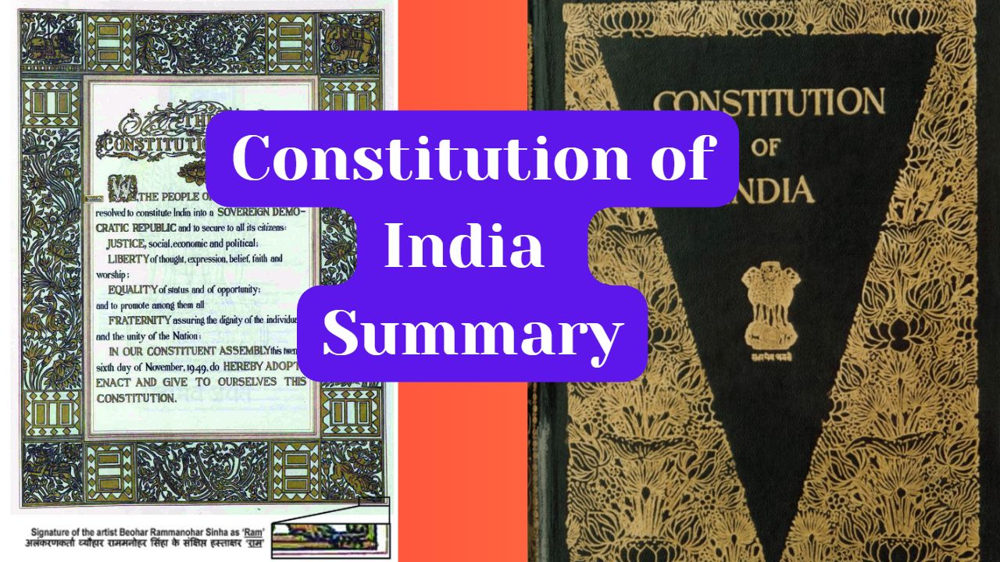

# Welcome to General Knowledge Blog

- { width="200" }

    ### [American Dilberts: The Funniest One Liners](American-Dilberts.md)
    
    **Read time:** 5 min
    
    Dilbert is an American comic strip and his one liners are famous. They are all classic! Here are a few of his one liners which are funny and make sens

- { width="200" }

    ### [Pakistan and Partition of India](Pakistan-and-Partition-of-India.md)
    
    **Read time:** 5 min
    
    The partition of India and the creation of Pakistan is one of the most significant events in the history of the Indian subcontinent. This article prov
    

- { width="200" }

    ### [Bans and Blocked Items by Nehru in India](Bans-by-Nehru.md)
    
    **Read time:** 5 min
    
    This article list the history of censored items by the First Prime Minister of India, Jawaharlal Nehru

- { width="200" }

    ### [Famous Statements of S. Jaishankar - Indian Foreign Minister](Famous-Statements-of-SJaishankar.md)
    
    **Read time:** 6 min
    
    This article covers some of the most remarkable statements made by Dr. S. Jaishankar, the Indian External Affairs Minister, providing insights into hi
    

- { width="200" }

    ### [How to Understand Government Systems](How-to-Understand-Goverment-Systems.md)
    
    **Read time:** 9 min
    
    This article explores a template to understand the structures and functions of government systems, providing insights into their roles and processes.

- { width="200" }

    ### [Exploring Human Body Systems and Subsystems](Exploring-Human-Body-Systems-and-Subsystems.md)
    
    **Read time:** 5 min
    
    EXCERPT Not Found
    

- { width="200" }

    ### [PM Modi's Response on 75 years of Republic of India - Dec 2024](PM-Modi-Response-on-75years-of-RepublicIndia-Dec24.md)
    
    **Read time:** 5 min
    
    EXCERPT Not Found

- { width="200" }

    ### [27 Nakshatra of Indian Astrology](27-Nakshatra-of-Indian-Astrology.md)
    
    **Read time:** 5 min
    
    EXCERPT Not Found
    

- { width="200" }

    ### [100 Most Powerful Women 2023](100-Most-Powerful-Women-2023.md)
    
    **Read time:** 5 min
    
    EXCERPT Not Found

- { width="200" }

    ### [Why Government Jobs in India are not Attractive](Government-Jobs-in-India-are-not-Attractive.md)
    
    **Read time:** 5 min
    
    EXCERPT Not Found
    

- { width="200" }

    ### [White-Paper-on-Indian-Economy](White-Paper-on-Economy-2004-14.md)
    
    **Read time:** 16 min
    
    EXCERPT Not Found

- { width="200" }

    ### [Vantage News Summary - 09-Feb-24](Vantage_News_Summary-09-Feb-24.md)
    
    **Read time:** 9 min
    
    EXCERPT Not Found
    

- { width="200" }

    ### [Vantage News Summary - 08-Feb-24](Vantage_News_Summary-08-Feb-24.md)
    
    **Read time:** 5 min
    
    EXCERPT Not Found

- { width="200" }

    ### [What is Solstice and Equinox?](Equinox-and-Solstice.md)
    
    **Read time:** 5 min
    
    EXCERPT Not Found
    

- { width="200" }

    ### [Constitution of India - Summary](Indian-Constituion-Summary.md)
    
    **Read time:** 26 min
    
    EXCERPT Not Found

- { width="200" }

    ### [What is Philosophy?](What-is-Philosophy.md)
    
    **Read time:** 8 min
    
    EXCERPT Not Found
    

- { width="200" }

    ### [The Indian Constitution](Indian-Constitution.md)
    
    **Read time:** 60 min
    
    EXCERPT Not Found

- { width="200" }

    ### [Classical Literature](Classical-Literature.md)
    
    **Read time:** 25 min
    
    EXCERPT Not Found
    

- { width="200" }

    ### [Why Indians Are Corrupt - a Rebuttal](Why-Indians-Are-Corrupt.md)
    
    **Read time:** 19 min
    
    EXCERPT Not Found

- { width="200" }

    ### [Types Of Gitas](Types-Of-Gitas.md)
    
    **Read time:** 10 min
    
    EXCERPT Not Found
    

