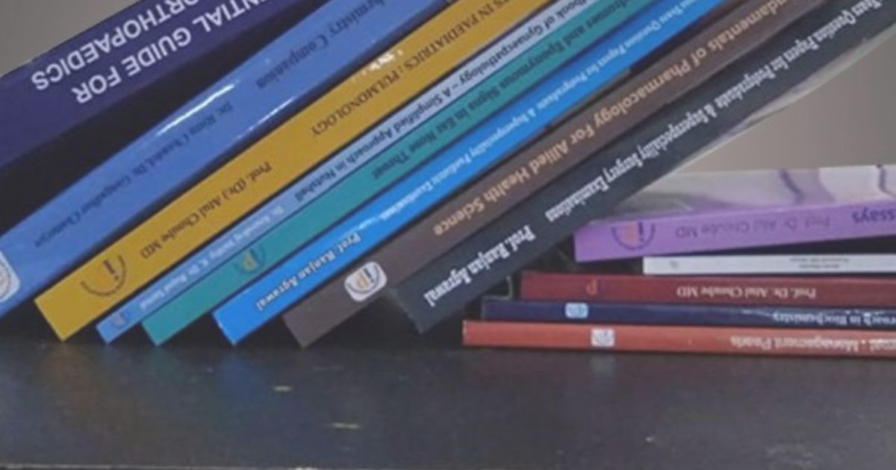
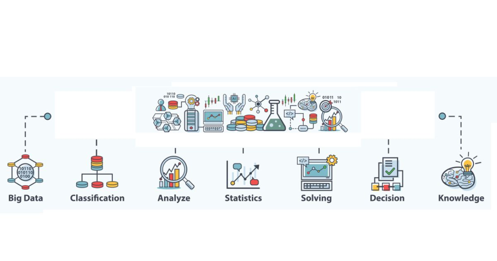
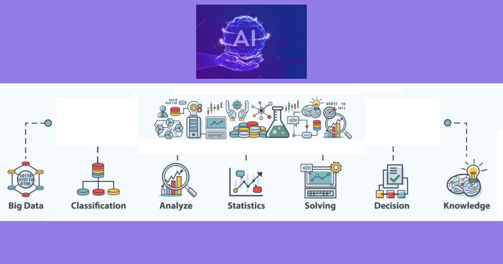
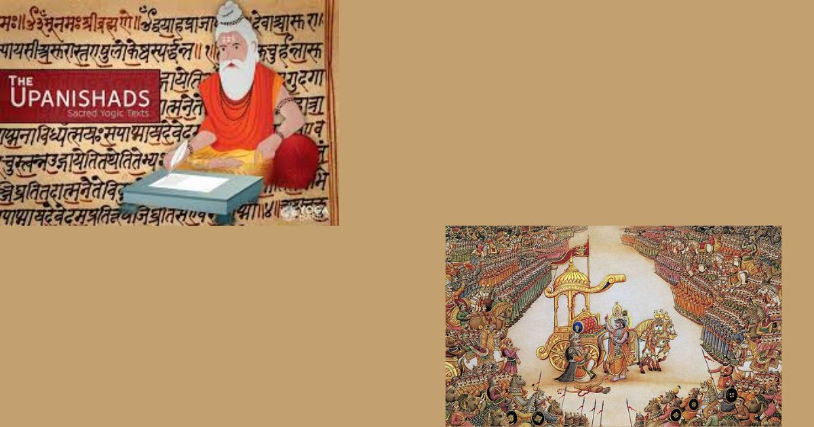

- { width="200" }

    ### [Posts by Year](year-archive.md)
    
    **Read time:** 5 min
    
    EXCERPT Not Found

- { width="200" }

    ### [Wisdom in Awareness Tag - Posts](wia-tags.md)
    
    **Read time:** 5 min
    
    EXCERPT Not Found
    

- { width="200" }

    ### [Wisdom in Awareness - My Journey](wia-home.md)
    
    **Read time:** 5 min
    
    EXCERPT Not Found

- { width="200" }

    ### [Wisdom in Awareness Blog](wia-blog.md)
    
    **Read time:** 5 min
    
    EXCERPT Not Found
    

- { width="200" }

    ### [This is Experiment Page](test.md)
    
    **Read time:** 5 min
    
    EXCERPT Not Found

- { width="200" }

    ### [Testimonials : What My Customers/Learners Says](tesimonials.md)
    
    **Read time:** 14 min
    
    Image : Gallery
    

- { width="200" }

    ### [Terms and Privacy Policy](terms.md)
    
    **Read time:** 5 min
    
    EXCERPT Not Found

- { width="200" }

    ### [Terms of Service](terms-of-service.md)
    
    **Read time:** 5 min
    
    EXCERPT Not Found
    

- { width="200" }

    ### [Posts by Tag](tag-archive.md)
    
    **Read time:** 5 min
    
    EXCERPT Not Found

- { width="200" }

    ### [Summary of My Work / Achievments](summary.md)
    
    **Read time:** 5 min
    
    EXCERPT Not Found
    

- { width="200" }

    ### [Splash Page](splash-page.md)
    
    **Read time:** 5 min
    
    Bacon ipsum dolor sit amet salami ham hock ham, hamburger corned beef short ribs kielbasa biltong t-bone drumstick tri-tip tail sirloin pork chop.

- { width="200" }

    ### [Sitemap](sitemap.md)
    
    **Read time:** 5 min
    
    EXCERPT Not Found
    

- { width="200" }

    ### [My Courses on Data Science, AI, ML, Deep Learning, NLP & Project Management](services.md)
    
    **Read time:** 5 min
    
    EXCERPT Not Found

- { width="200" }

    ### [Samskrut Yatra](samskrutyatra.md)
    
    **Read time:** 5 min
    
    EXCERPT Not Found
    

- { width="200" }

    ### [Welcome to my Vedic Chanting Blog](samskrutyatra-chanting.md)
    
    **Read time:** 5 min
    
    EXCERPT Not Found

- { width="200" }

    ### [Samskrut Yatra Topics](samskrut-tags.md)
    
    **Read time:** 5 min
    
    EXCERPT Not Found
    

- { width="200" }

    ### [Samskrut Yatra Blog](samskrut-home.md)
    
    **Read time:** 5 min
    
    EXCERPT Not Found

- { width="200" }

    ### [WIA Quotations](quotations.md)
    
    **Read time:** 5 min
    
    These Quotations come from my reflection from the surface of lake called life. Great teachers like Mahatama Buddha, Lao Tzu, Adi Shankara, Ramakrushna
    

- { width="200" }

    ### [Wisdom in Awareness Quotations - Topics](quotations-tags.md)
    
    **Read time:** 5 min
    
    These Qutations come from my reflection from the surface of lake called life. Great teachers like Mahatama Buddha, Lao Tzu, Adi Shankara, Ramakrushna 

- { width="200" }

    ### [Books and Publications](publications-home.md)
    
    **Read time:** 5 min
    
    EXCERPT Not Found
    

- { width="200" }

    ### [Summary of My Technology Stacks](projects-tech-stacks.md)
    
    **Read time:** 14 min
    
    Image : Gallery

- { width="200" }

    ### [Summary of Management Project](projects-management.md)
    
    **Read time:** 5 min
    
    Image : Gallery
    

- { width="200" }

    ### [Summary of AI ML Project](projects-aiml-all-verticals.md)
    
    **Read time:** 23 min
    
    Image : Gallery

- { width="200" }

    ### [Project Index Page](project-index-page.md)
    
    **Read time:** 39 min
    
    Image : Gallery
    

- { width="200" }

    ### [Description of Business Domains](project-domains.md)
    
    **Read time:** 5 min
    
    Image : Gallery

- { width="200" }

    ### [Privacy Policy](privacy-policy.md)
    
    **Read time:** 5 min
    
    EXCERPT Not Found
    

- { width="200" }

    ### [PMI Templates](prince2-templates.md)
    
    **Read time:** 5 min
    
    EXCERPT Not Found

- { width="200" }

    ### [PMLOGY Tag - Posts](pmlogy-tags.md)
    
    **Read time:** 5 min
    
    EXCERPT Not Found
    

- { width="200" }

    ### [PMLOGY - My Journey](pmlogy-home.md)
    
    **Read time:** 5 min
    
    EXCERPT Not Found

- { width="200" }

    ### [Project Management Blog](pmlogy-blog.md)
    
    **Read time:** 5 min
    
    EXCERPT Not Found
    

- { width="200" }

    ### [PMI Templates](pmi-templates.md)
    
    **Read time:** 5 min
    
    EXCERPT Not Found

- { width="200" }

    ### [Project Management Glossary](pmglossary.md)
    
    **Read time:** 76 min
    
    EXCERPT Not Found
    

- { width="200" }

    ### [PMBOK Explorer Hindi](pmbok6hi.md)
    
    **Read time:** 5 min
    
    EXCERPT Not Found

- { width="200" }

    ### [PMBOK6 Hindi Topics](pmbok6hi-tags.md)
    
    **Read time:** 5 min
    
    EXCERPT Not Found
    

- { width="200" }

    ### [PMBOK 6 Processes - Hindi Edition](pmbok6hi-summary.md)
    
    **Read time:** 6 min
    
    EXCERPT Not Found

- { width="200" }

    ### [PMBOK Explorer](pmbok6.md)
    
    **Read time:** 5 min
    
    EXCERPT Not Found
    

- { width="200" }

    ### [PMBOK6 Topics](pmbok6-tags.md)
    
    **Read time:** 5 min
    
    EXCERPT Not Found

- { width="200" }

    ### [PMBOK 6 Processes](pmbok6-summary.md)
    
    **Read time:** 5 min
    
    EXCERPT Not Found
    

- { width="200" }

    ### [AI and Business News Blog](news-blog.md)
    
    **Read time:** 5 min
    
    EXCERPT Not Found

- { width="200" }

    ### [Microsoft Project Management Templates](micorosoft-pm-templates.md)
    
    **Read time:** 5 min
    
    EXCERPT Not Found
    

- { width="200" }

    ### [Project Management Courses and Consulting](management.md)
    
    **Read time:** 5 min
    
    EXCERPT Not Found

- { width="200" }

    ### [General Knowledge Tag - Posts](gk-tags.md)
    
    **Read time:** 5 min
    
    EXCERPT Not Found
    

- { width="200" }

    ### [General Knowledge Blog](gk-blog.md)
    
    **Read time:** 5 min
    
    EXCERPT Not Found

- { width="200" }

    ### [Data Science Lexicon](dslexicon.md)
    
    **Read time:** 5 min
    
    EXCERPT Not Found
    

- { width="200" }

    ### [Data Science Tag - Posts](datascience-tags.md)
    
    **Read time:** 5 min
    
    EXCERPT Not Found

- { width="200" }

    ### [Welcome to AI ML Resources from Data Science Blog](datascience-resources.md)
    
    **Read time:** 5 min
    
    EXCERPT Not Found
    

- { width="200" }

    ### [Courses on Data Science, AI, ML, Deep Learning, NLP](datascience-courses.md)
    
    **Read time:** 5 min
    
    EXCERPT Not Found

- { width="200" }

    ### [Data Science Blog](datascience-blog.md)
    
    **Read time:** 5 min
    
    EXCERPT Not Found
    

- { width="200" }

    ### [Corpus](corpus-home.md)
    
    **Read time:** 5 min
    
    EXCERPT Not Found

- { width="200" }

    ### [Comment Policy](comment-policy.md)
    
    **Read time:** 5 min
    
    EXCERPT Not Found
    

- { width="200" }

    ### [Customer, Team, Participant Diversity](clients.md)
    
    **Read time:** 5 min
    
    EXCERPT Not Found

- { width="200" }

    ### [Book Summary & Interview summary Blog](booksummary.md)
    
    **Read time:** 5 min
    
    EXCERPT Not Found
    

- { width="200" }

    ### [About Me](aboutme.md)
    
    **Read time:** 5 min
    
    Image : Gallery

