# Welcome to my Management Courses

- { width="200" }

    ### [PMI RMP Course](pmi-rmp.md)
    
    **Read time:** 5 min
    
    EXCERPT Not Found

- 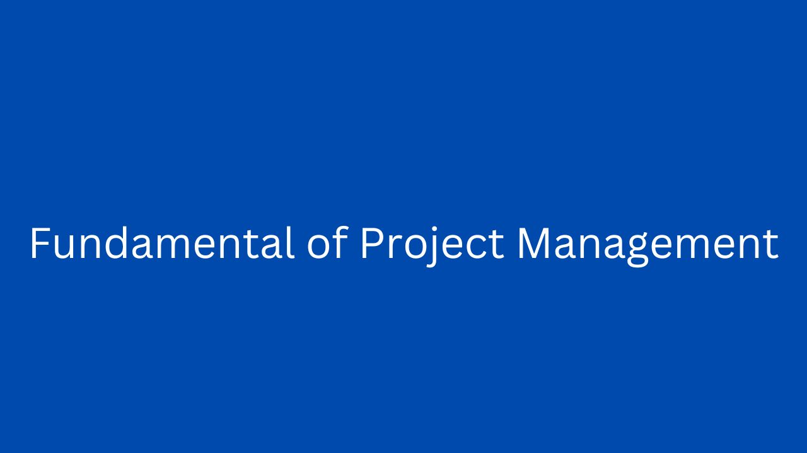{ width="200" }

    ### [Fundamental of Project Management](fundamental-pm.md)
    
    **Read time:** 5 min
    
    EXCERPT Not Found
    

- 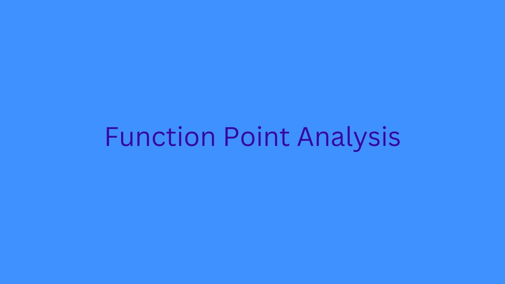{ width="200" }

    ### [Function Point Analysis](fpa.md)
    
    **Read time:** 5 min
    
    EXCERPT Not Found

- 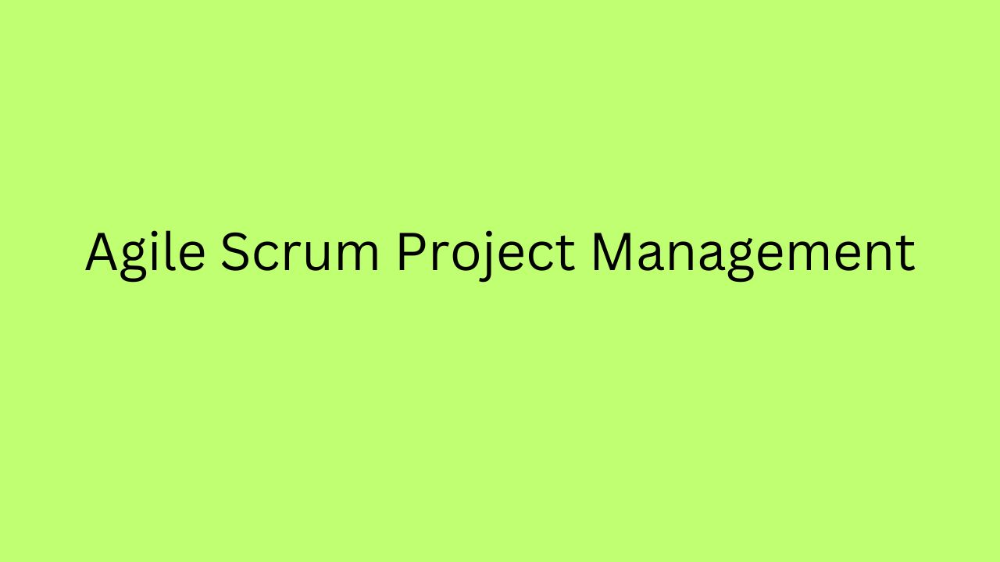{ width="200" }

    ### [Agile Scrum Project Management](agile-scrum.md)
    
    **Read time:** 10 min
    
    EXCERPT Not Found
    

- 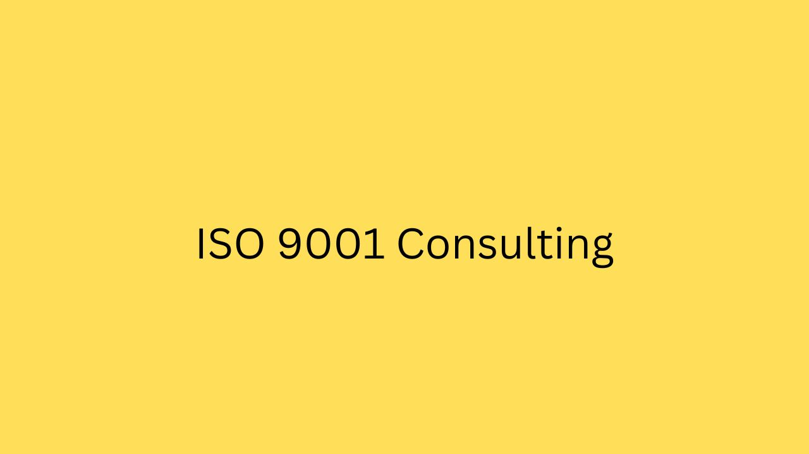{ width="200" }

    ### [ISO 9001 Consulting](iso-9001-consulting.md)
    
    **Read time:** 5 min
    
    EXCERPT Not Found

- { width="200" }

    ### [CMMI Consulting](cmmi-consulting.md)
    
    **Read time:** 5 min
    
    EXCERPT Not Found
    

- 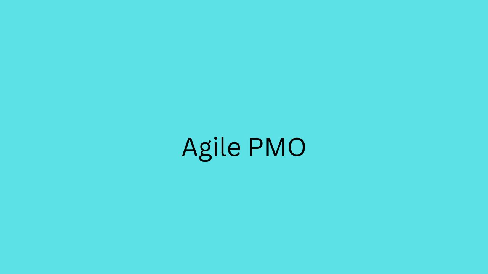{ width="200" }

    ### [Agile PMO](agile-pmo.md)
    
    **Read time:** 5 min
    
    EXCERPT Not Found

- { width="200" }

    ### [PMO Setup](pmo-setup.md)
    
    **Read time:** 5 min
    
    EXCERPT Not Found
    

- 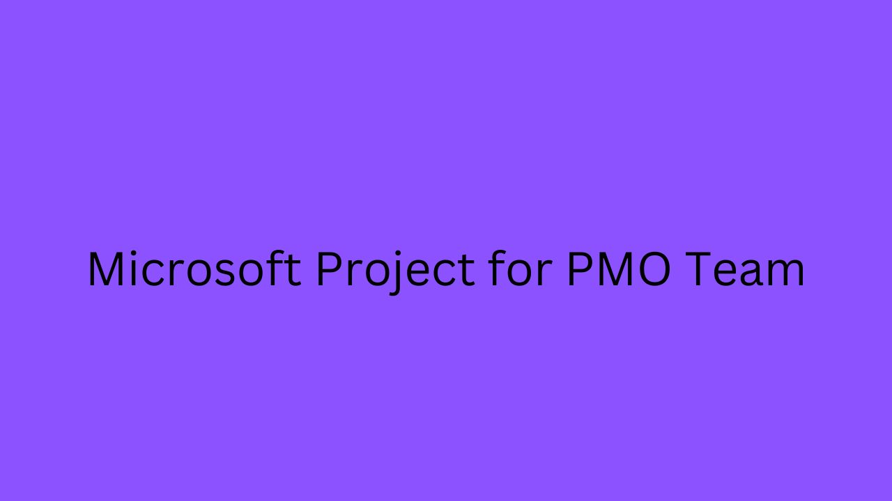{ width="200" }

    ### [Microsoft Project for PMO Team](microsoft-project-for-pmo-team.md)
    
    **Read time:** 5 min
    
    EXCERPT Not Found

- { width="200" }

    ### [Microsoft Enterprise Project Server for Administrators](microsoft-enterprise-project-server-for-administrators.md)
    
    **Read time:** 5 min
    
    EXCERPT Not Found
    

- { width="200" }

    ### [Microsoft Enterprise Project Server for Executives](microsoft-enterprise-project-server-for-executives.md)
    
    **Read time:** 5 min
    
    EXCERPT Not Found

- 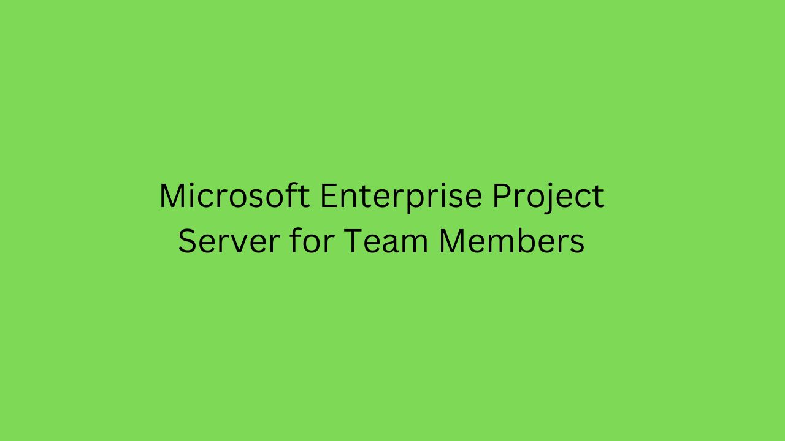{ width="200" }

    ### [Microsoft Enterprise Project Server for Team Members](microsoft-enterprise-project-server-for-team-members.md)
    
    **Read time:** 5 min
    
    EXCERPT Not Found
    

- 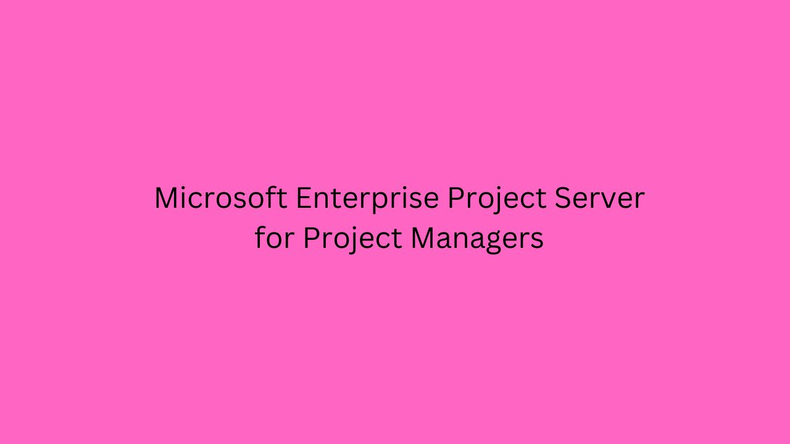{ width="200" }

    ### [Microsoft Enterprise Project Server for Project Managers](microsoft-enterprise-project-server-for-project-managers.md)
    
    **Read time:** 5 min
    
    EXCERPT Not Found

- { width="200" }

    ### [Microsoft Project Course](microsoft-project.md)
    
    **Read time:** 5 min
    
    EXCERPT Not Found
    

- { width="200" }

    ### [Six Sigma Black Belt](six-sigma-black-belt.md)
    
    **Read time:** 5 min
    
    EXCERPT Not Found

- { width="200" }

    ### [Six Sigma Green Belt](six-sigma-green-belt.md)
    
    **Read time:** 5 min
    
    EXCERPT Not Found
    

- { width="200" }

    ### [Six Sigma Yellow Belt](six-sigma-yellow-belt.md)
    
    **Read time:** 5 min
    
    EXCERPT Not Found

- 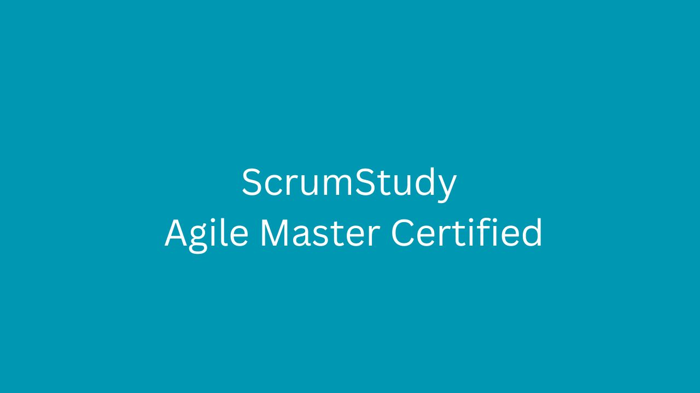{ width="200" }

    ### [ScrumStudy Agile Master Course](scrumStudy-agile-master-certified.md)
    
    **Read time:** 5 min
    
    EXCERPT Not Found
    

- 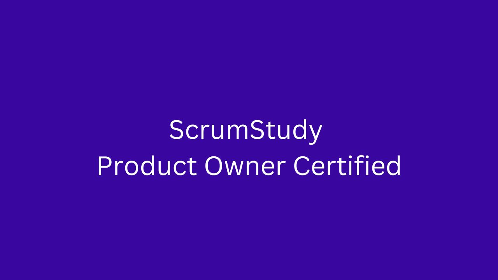{ width="200" }

    ### [Scrum Product Owner Certified Course](scrum-product-owner-certified.md)
    
    **Read time:** 5 min
    
    EXCERPT Not Found

- 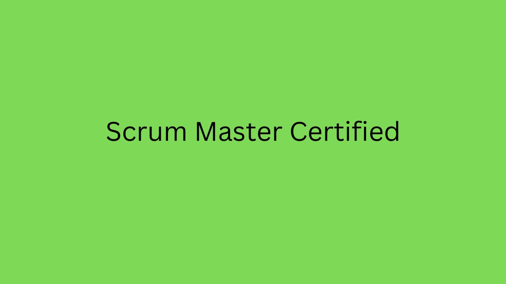{ width="200" }

    ### [Scrum Master Certified Course](scrum-master-certified.md)
    
    **Read time:** 5 min
    
    EXCERPT Not Found
    

- { width="200" }

    ### [SFC Certification](sfc-certification.md)
    
    **Read time:** 5 min
    
    EXCERPT Not Found

- 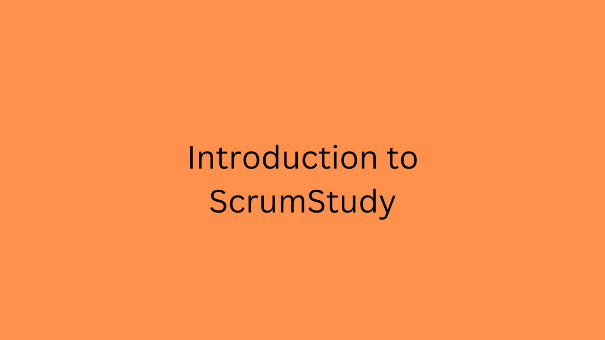{ width="200" }

    ### [Introduction to ScrumStudy Certifications](intro-to-scrumstudy.md)
    
    **Read time:** 5 min
    
    EXCERPT Not Found
    

- 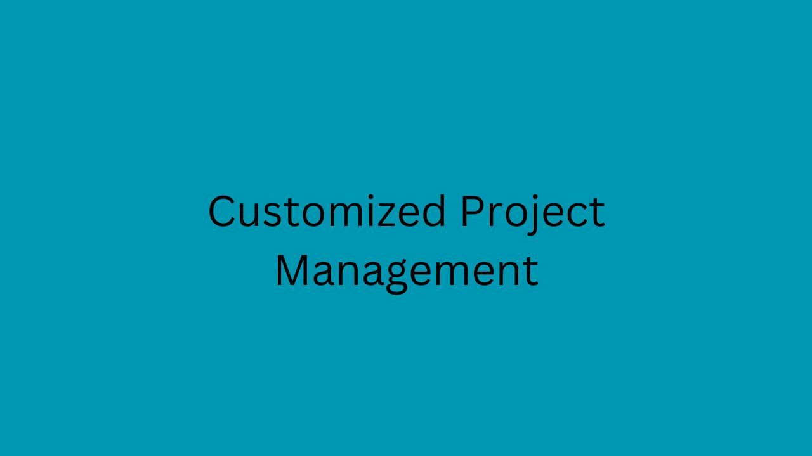{ width="200" }

    ### [Customized Project Management Course](customized-pm.md)
    
    **Read time:** 5 min
    
    EXCERPT Not Found

- { width="200" }

    ### [Axelos Course](prince2.md)
    
    **Read time:** 5 min
    
    EXCERPT Not Found
    

- { width="200" }

    ### [PMI Schedule Management Professional Course](pmi-sp.md)
    
    **Read time:** 5 min
    
    EXCERPT Not Found

- { width="200" }

    ### [PMI CAPM Course](pmi-capm.md)
    
    **Read time:** 5 min
    
    EXCERPT Not Found
    

- { width="200" }

    ### [PMI ACP Course](pmi-acp.md)
    
    **Read time:** 5 min
    
    EXCERPT Not Found

- 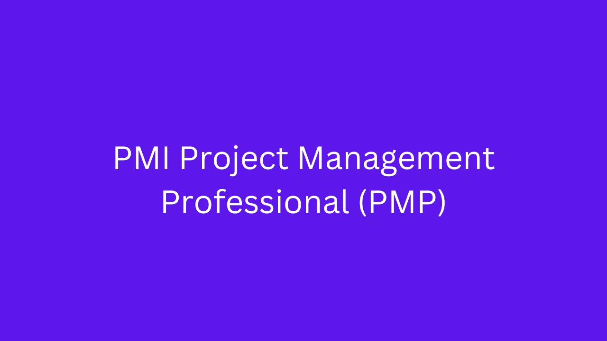{ width="200" }

    ### [PMI PMP Course](pmi-pmp.md)
    
    **Read time:** 8 min
    
    EXCERPT Not Found
    

