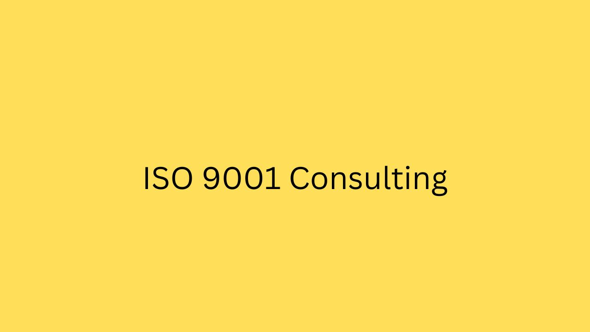

# ISO 9001:2008 Consulting

## About ISO 9001 Certification

ISO (International Organization for Standardization) has hundreds of standards for various business types and various purposes. There are many certification bodies that help individual organizations in getting audited against the requirements documented in standards. ISO 9001 is a quality standard of ISO and one of the highly sought standards in the business world.

Although commonly referred to as ‘ISO 9000’ certification, the actual standard to which an organization’s quality management system can be certified is ISO 9001:2000, 2008, 2017. Every organization which applies for ISO 9001 certification should be audited based on an extensive sample of its sites, functions, products, services, and processes. The auditor presents a list of problems (defined as “nonconformities”, “observations” or “opportunities for improvement”) to management. If there are no major problems/nonconformities, the certification body will issue a certificate. Where major problems/ nonconformities are identified, the organization will present an improvement plan to the audit body; once the audit body is satisfied that the organization has carried out sufficient corrective action, it will issue a certificate. An ISO 9001 certificate is not a once-and-for-all award but must be renewed at regular intervals recommended by the certification body, usually once every three years. There are no grades of competence within ISO 9001: either a company is certified or it is not. In this respect, ISO 9001 certification contrasts with measurement-based quality systems. 

## Principles behind ISO 9001

● Customer Focus : Improved customer loyalty, improved business, increased revenue  
● Leadership : Standard activities, lesser miscommunication, Motivation towards organisation’s objectives  
● Involvement of People : Motivated employees,  Continuous improvement through people participation  
● Process Approach :  Lower costs, shorter cycle time, Improved and predictable results  
● System approach to Management : Integration and alignment of processes, Results in higher efficiency  
● Continual Improvement : Flexibility to react quickly, Improved organisation capabilities  
● Factual Approach to Decision Making : Improved decisions, Increased ability to change opinions and decisions  
● Organisation-Supplier Beneficial Relationship : Optimization of costs and resources and creating values for both parties

## Benefits of Implementing ISO 9001:2008 Certification

It is widely acknowledged that proper quality management improves business, often having a positive effect on investment, market share, sales growth, sales margins, competitive advantage, and avoidance of litigation. Implementing ISO certification gives the following benefits to the organization:

● Creates a more efficient, effective operation  
● Increases customer satisfaction and retention because of predictable processes  
● Less number of customer audits  
● Enhances sales and marketing  
● Improves employee motivation, awareness, and morale  
● Promotes international trade  
● Increases profitability  
● Reduction in waste  
● Increases productivity  
● A common tool for standardization  
● Helps in producing the desired outcome  
● Enhances Customer Satisfaction by meeting Customer requirements  
● Continual Improvement through ISO 9001  
● The process through PDCA (Plan Do Check Act)  
● ISO 9001 helps organization for the avoidance of Risk

## **Roadmap for QMS ISO 9001**

● Identify the requirements.  
● Involve services of consultant.  
● Identification of GAP Analysis.  
● Preparing Implementation Plan.  
● Go for PDCA (Plan-Do-Check-Act) cycle.  
● Design, implement, aware about the Quality Policy, QMS Manual & SOP (Standards Operating Procedure).  
● Establish & evaluate the system and procedure.  
● Identify the boundaries of the management system and produce documented procedures as required.

● Ensure these procedures are suitable and adhered to.  
● Once developed, internal audits are needed to ensure the system carries on working.

I have represented organization as MR and drove the ISO 9001 initiatives for IT company. If needed I can help you in aligning your processes to the ISO 9001 standards so that it is easier for your to pass the audit.