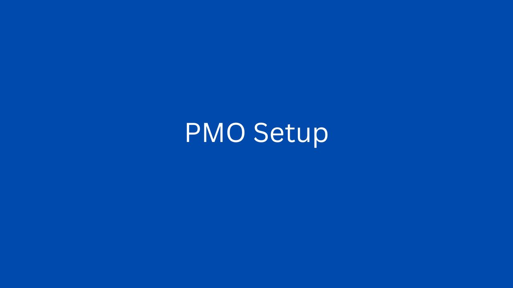

# PMO Setup

Today businesses are focusing on core competencies and outsourcing those functions which are not their core-competence. They are exploiting all type of resources available to the full extent, equipping core functions with talented staff, efficient material, training, automated systems and fine tune processes.  
## What is PMO?

PMO is the CoE (Centre of Excellence) function in an organization focused primarily on Project Management activities. PMO can be a separate function in an organization or it can be outsourced to experts.  

## Trends in PMO

### 20th Century Project Management Facts

● $80-145 bn/year: Spent on failed/cancelled project (Standish Group International)  
● 25%-40% of all spending: Put on re-work (Carnegie Mellon)  
● 40% of Problems: Found by end user (Gartner)  
● 50% time: System Rolled Back from Production (Gartner)  
● $30 bn/year or 66% of project failure: Happens due to poorly defined requirements (Forrester Research)  
● 66% of project: Runs into trouble (failed/overtime/over-budget)  
● 50% of 66%: Cost overrun  
● 82% of 66%: Time overrun

### 21st Century Project Management Office (PMO)

## Functions can be 
● Visibility (metrics & new business opportunity from the project)  
● Cross-Project Dependency Management  
● Resource Management (Resource planning, allocation, tracking, budget, schedule across the projects)  
● Risk Management (identifying risk & manage risks after applying suitable resources)  
● Communication  
● Professional Development  
● Technical Integration (across platform, application, vendor, outsourcer)  
● Program Management Best Practices  
● Release Management  
● Continuous Improvement  
● Governance & Portfolio Management  
● Business & Technology Consulting  
● Audit projects for compliance to regulatory bodies  

## Service Offerings
● Want to create a PMO in an organization- ESTABLISHING PMO  
● A PMO is very reactive or not effective so let’s bring in more skills, techniques and give more responsibilities to it – IMPROVING PMO  
● A delivery organization want to focus on our core business and want somebody else to take care of project management functions- OUTSOURCING PMO  

## Our PMO Services can define performance measure rating in EIGHT DIMENSIONS.
● Strategy execution  
● Shareholder satisfaction  
● Resource allocation  
● Financial performance  
● Customer satisfaction  
● Strategic alignment  
● Budget/schedule performance  
● Portfolio performance  

## Following are important things involved in setting up a PMO

● Establish PMO architectural components  
● Indentify best processes/practices to be institutionalize  
● Perform Gap analysis  
● Set goal for each processes identified  
● Plan the implementation of practices  
● Assign resource with responsibility & authority  
● Suitable Tool Identification  
● Setup new Processes, Templates & Standards  
● Redefine existing processes, templates & standards  
● Training resource for any gap in the desired skills  
● Coaching & Mentoring  
● Manage the deliverables of PMO  
● Audit PMO function’s deliverables against the objective  
● Review the Progress with Senior Management  
● Collect lessons learned from each practice for the improvement of the practice  
● Benchmarking & baselining process goals & mapping to business goals
