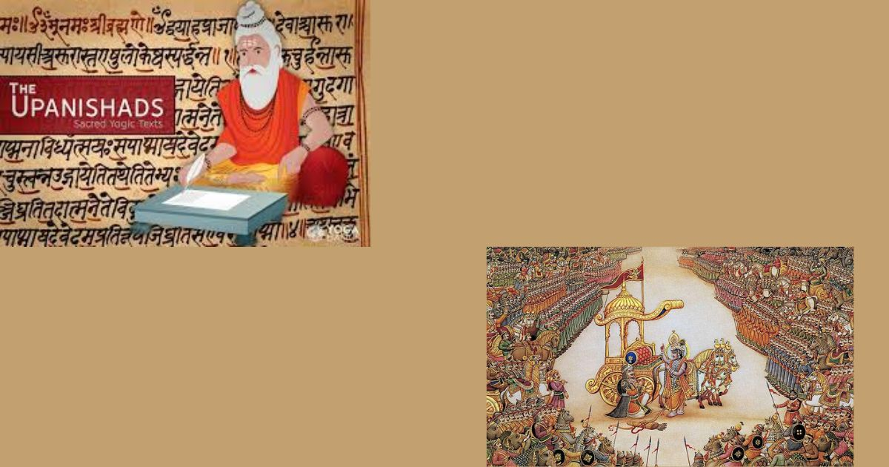
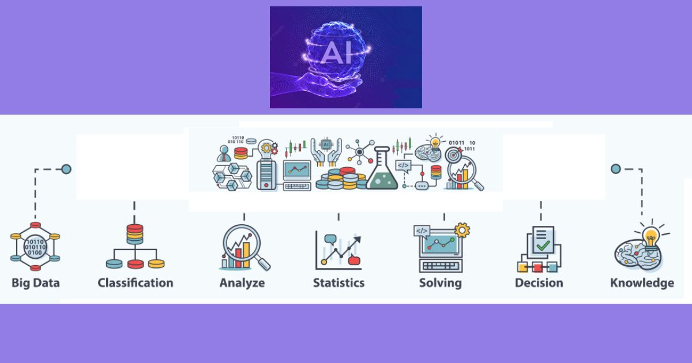
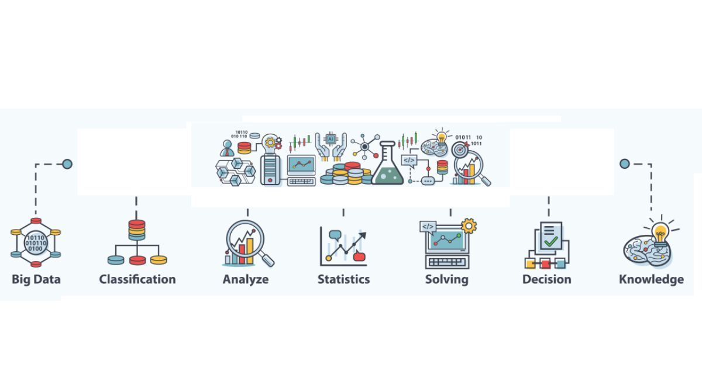
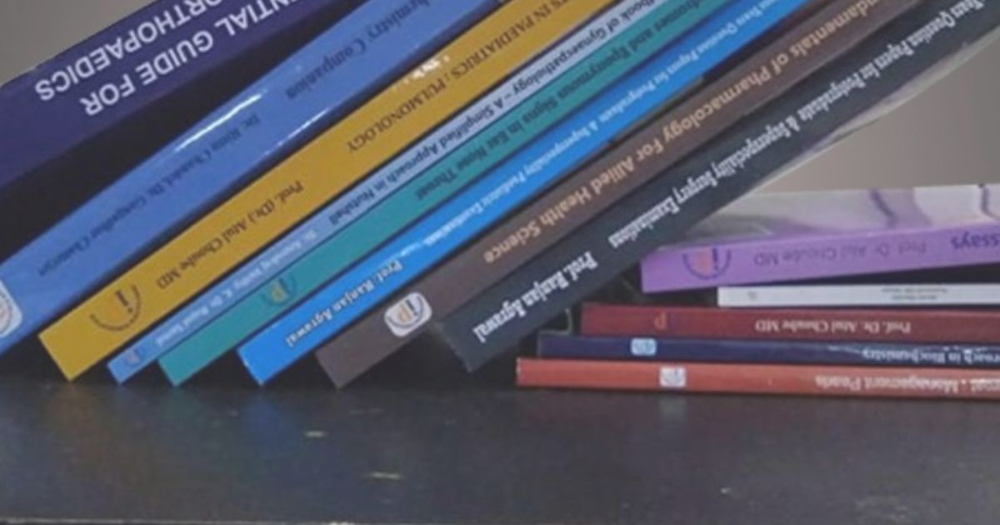

- { width="200" }

    ### [About Me](pages/aboutme.md)
    
    **Read time:** 5 min
    
    Image : Gallery

- { width="200" }

    ### [Book Summary & Interview summary Blog](pages/booksummary.md)
    
    **Read time:** 5 min
    
    EXCERPT Not Found
    

- { width="200" }

    ### [Customer, Team, Participant Diversity](pages/clients.md)
    
    **Read time:** 5 min
    
    EXCERPT Not Found

- { width="200" }

    ### [Comment Policy](pages/comment-policy.md)
    
    **Read time:** 5 min
    
    EXCERPT Not Found
    

- { width="200" }

    ### [Corpus](pages/corpus-home.md)
    
    **Read time:** 5 min
    
    EXCERPT Not Found

- { width="200" }

    ### [Data Science Blog](pages/datascience-blog.md)
    
    **Read time:** 5 min
    
    EXCERPT Not Found
    

- { width="200" }

    ### [Courses on Data Science, AI, ML, Deep Learning, NLP](pages/datascience-courses.md)
    
    **Read time:** 5 min
    
    EXCERPT Not Found

- { width="200" }

    ### [Welcome to AI ML Resources from Data Science Blog](pages/datascience-resources.md)
    
    **Read time:** 5 min
    
    EXCERPT Not Found
    

- { width="200" }

    ### [Data Science Tag - Posts](pages/datascience-tags.md)
    
    **Read time:** 5 min
    
    EXCERPT Not Found

- { width="200" }

    ### [Data Science Lexicon](pages/dslexicon.md)
    
    **Read time:** 5 min
    
    EXCERPT Not Found
    

- { width="200" }

    ### [General Knowledge Blog](pages/gk-blog.md)
    
    **Read time:** 5 min
    
    EXCERPT Not Found

- { width="200" }

    ### [General Knowledge Tag - Posts](pages/gk-tags.md)
    
    **Read time:** 5 min
    
    EXCERPT Not Found
    

- { width="200" }

    ### [Project Management Courses and Consulting](pages/management.md)
    
    **Read time:** 5 min
    
    EXCERPT Not Found

- { width="200" }

    ### [Microsoft Project Management Templates](pages/micorosoft-pm-templates.md)
    
    **Read time:** 5 min
    
    EXCERPT Not Found
    

- { width="200" }

    ### [AI and Business News Blog](pages/news-blog.md)
    
    **Read time:** 5 min
    
    EXCERPT Not Found

- { width="200" }

    ### [PMBOK 6 Processes](pages/pmbok6-summary.md)
    
    **Read time:** 5 min
    
    EXCERPT Not Found
    

- { width="200" }

    ### [PMBOK6 Topics](pages/pmbok6-tags.md)
    
    **Read time:** 5 min
    
    EXCERPT Not Found

- { width="200" }

    ### [PMBOK Explorer](pages/pmbok6.md)
    
    **Read time:** 5 min
    
    EXCERPT Not Found
    

- { width="200" }

    ### [PMBOK 6 Processes - Hindi Edition](pages/pmbok6hi-summary.md)
    
    **Read time:** 6 min
    
    EXCERPT Not Found

- { width="200" }

    ### [PMBOK6 Hindi Topics](pages/pmbok6hi-tags.md)
    
    **Read time:** 5 min
    
    EXCERPT Not Found
    

- { width="200" }

    ### [PMBOK Explorer Hindi](pages/pmbok6hi.md)
    
    **Read time:** 5 min
    
    EXCERPT Not Found

- { width="200" }

    ### [Project Management Glossary](pages/pmglossary.md)
    
    **Read time:** 76 min
    
    EXCERPT Not Found
    

- { width="200" }

    ### [PMI Templates](pages/pmi-templates.md)
    
    **Read time:** 5 min
    
    EXCERPT Not Found

- { width="200" }

    ### [Project Management Blog](pages/pmlogy-blog.md)
    
    **Read time:** 5 min
    
    EXCERPT Not Found
    

- { width="200" }

    ### [PMLOGY - My Journey](pages/pmlogy-home.md)
    
    **Read time:** 5 min
    
    EXCERPT Not Found

- { width="200" }

    ### [PMLOGY Tag - Posts](pages/pmlogy-tags.md)
    
    **Read time:** 5 min
    
    EXCERPT Not Found
    

- { width="200" }

    ### [PMI Templates](pages/prince2-templates.md)
    
    **Read time:** 5 min
    
    EXCERPT Not Found

- { width="200" }

    ### [Privacy Policy](pages/privacy-policy.md)
    
    **Read time:** 5 min
    
    EXCERPT Not Found
    

- { width="200" }

    ### [Description of Business Domains](pages/project-domains.md)
    
    **Read time:** 5 min
    
    Image : Gallery

- { width="200" }

    ### [Project Index Page](pages/project-index-page.md)
    
    **Read time:** 39 min
    
    Image : Gallery
    

- { width="200" }

    ### [Summary of AI ML Project](pages/projects-aiml-all-verticals.md)
    
    **Read time:** 23 min
    
    Image : Gallery

- { width="200" }

    ### [Summary of Management Project](pages/projects-management.md)
    
    **Read time:** 5 min
    
    Image : Gallery
    

- { width="200" }

    ### [Summary of My Technology Stacks](pages/projects-tech-stacks.md)
    
    **Read time:** 14 min
    
    Image : Gallery

- { width="200" }

    ### [Books and Publications](pages/publications-home.md)
    
    **Read time:** 5 min
    
    EXCERPT Not Found
    

- { width="200" }

    ### [Wisdom in Awareness Quotations - Topics](pages/quotations-tags.md)
    
    **Read time:** 5 min
    
    These Qutations come from my reflection from the surface of lake called life. Great teachers like Mahatama Buddha, Lao Tzu, Adi Shankara, Ramakrushna 

- { width="200" }

    ### [WIA Quotations](pages/quotations.md)
    
    **Read time:** 5 min
    
    These Quotations come from my reflection from the surface of lake called life. Great teachers like Mahatama Buddha, Lao Tzu, Adi Shankara, Ramakrushna
    

- { width="200" }

    ### [Samskrut Yatra Blog](pages/samskrut-home.md)
    
    **Read time:** 5 min
    
    EXCERPT Not Found

- { width="200" }

    ### [Samskrut Yatra Topics](pages/samskrut-tags.md)
    
    **Read time:** 5 min
    
    EXCERPT Not Found
    

- { width="200" }

    ### [Welcome to my Vedic Chanting Blog](pages/samskrutyatra-chanting.md)
    
    **Read time:** 5 min
    
    EXCERPT Not Found

- { width="200" }

    ### [Samskrut Yatra](pages/samskrutyatra.md)
    
    **Read time:** 5 min
    
    EXCERPT Not Found
    

- { width="200" }

    ### [My Courses on Data Science, AI, ML, Deep Learning, NLP & Project Management](pages/services.md)
    
    **Read time:** 5 min
    
    EXCERPT Not Found

- { width="200" }

    ### [Sitemap](pages/sitemap.md)
    
    **Read time:** 5 min
    
    EXCERPT Not Found
    

- { width="200" }

    ### [Splash Page](pages/splash-page.md)
    
    **Read time:** 5 min
    
    Bacon ipsum dolor sit amet salami ham hock ham, hamburger corned beef short ribs kielbasa biltong t-bone drumstick tri-tip tail sirloin pork chop.

- { width="200" }

    ### [Summary of My Work / Achievments](pages/summary.md)
    
    **Read time:** 5 min
    
    EXCERPT Not Found
    

- { width="200" }

    ### [Posts by Tag](pages/tag-archive.md)
    
    **Read time:** 5 min
    
    EXCERPT Not Found

- { width="200" }

    ### [Terms of Service](pages/terms-of-service.md)
    
    **Read time:** 5 min
    
    EXCERPT Not Found
    

- { width="200" }

    ### [Terms and Privacy Policy](pages/terms.md)
    
    **Read time:** 5 min
    
    EXCERPT Not Found

- { width="200" }

    ### [Testimonials : What My Customers/Learners Says](pages/tesimonials.md)
    
    **Read time:** 14 min
    
    Image : Gallery
    

- { width="200" }

    ### [This is Experiment Page](pages/test.md)
    
    **Read time:** 5 min
    
    EXCERPT Not Found

- { width="200" }

    ### [Wisdom in Awareness Blog](pages/wia-blog.md)
    
    **Read time:** 5 min
    
    EXCERPT Not Found
    

- { width="200" }

    ### [Wisdom in Awareness - My Journey](pages/wia-home.md)
    
    **Read time:** 5 min
    
    EXCERPT Not Found

- { width="200" }

    ### [Wisdom in Awareness Tag - Posts](pages/wia-tags.md)
    
    **Read time:** 5 min
    
    EXCERPT Not Found
    

- { width="200" }

    ### [Posts by Year](pages/year-archive.md)
    
    **Read time:** 5 min
    
    EXCERPT Not Found

