# Welcome to my project Management Blog

- 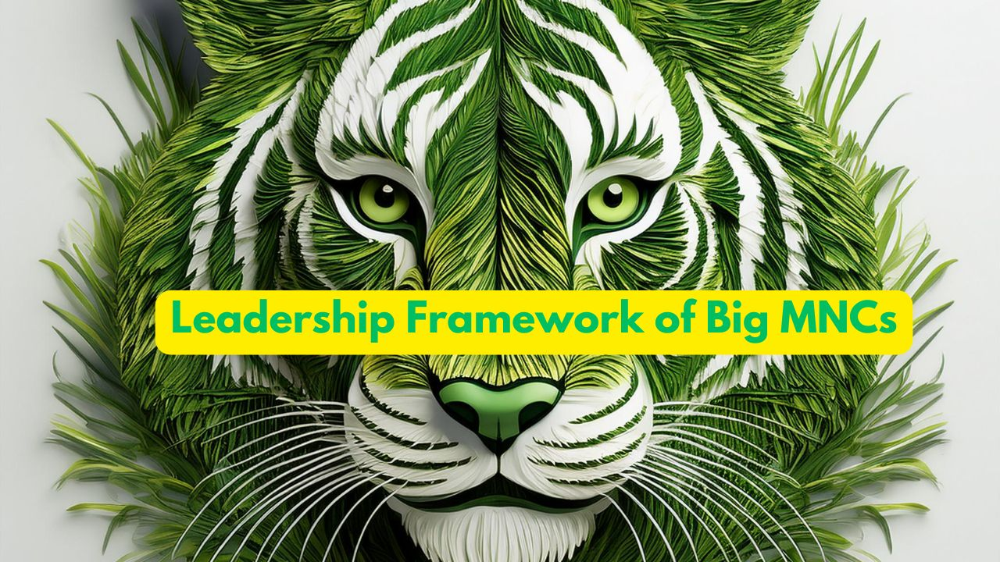{ width="200" }

    ### [Leadership Framework of Big MNCs](Leadership-Framework-of-Big-MNCs.md)
    
    **Read time:** 5 min
    
    EXCERPT Not Found

- 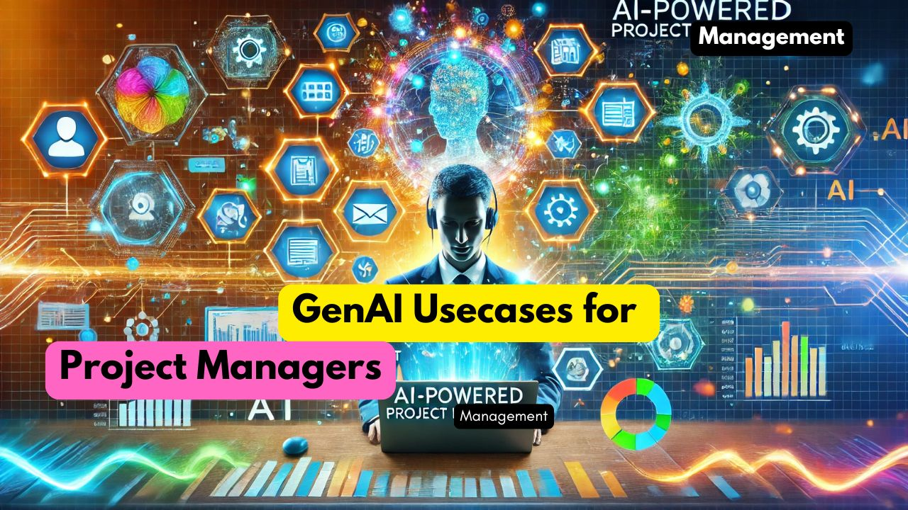{ width="200" }

    ### [GenAI Usecases for Project Managers](GenAI-Usecases-for-Project-Managers.md)
    
    **Read time:** 22 min
    
    EXCERPT Not Found
    

- 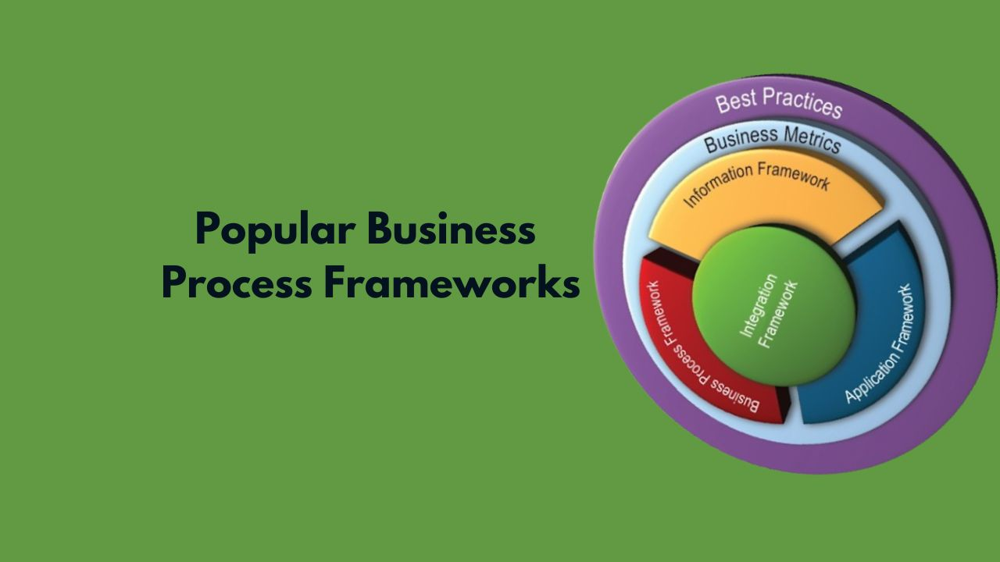{ width="200" }

    ### [Popular Business Process Frameworks](Popular-Business-Process-Frameworks.md)
    
    **Read time:** 10 min
    
    EXCERPT Not Found

- 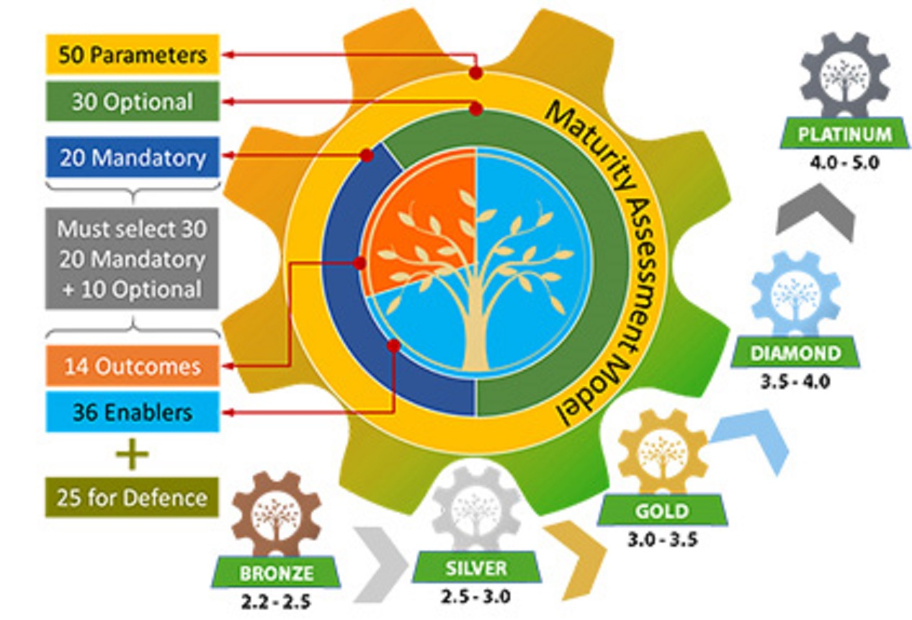{ width="200" }

    ### [ZED Best Practices v2](Zed-Best-Practices-v2.md)
    
    **Read time:** 7 min
    
    EXCERPT Not Found
    

- 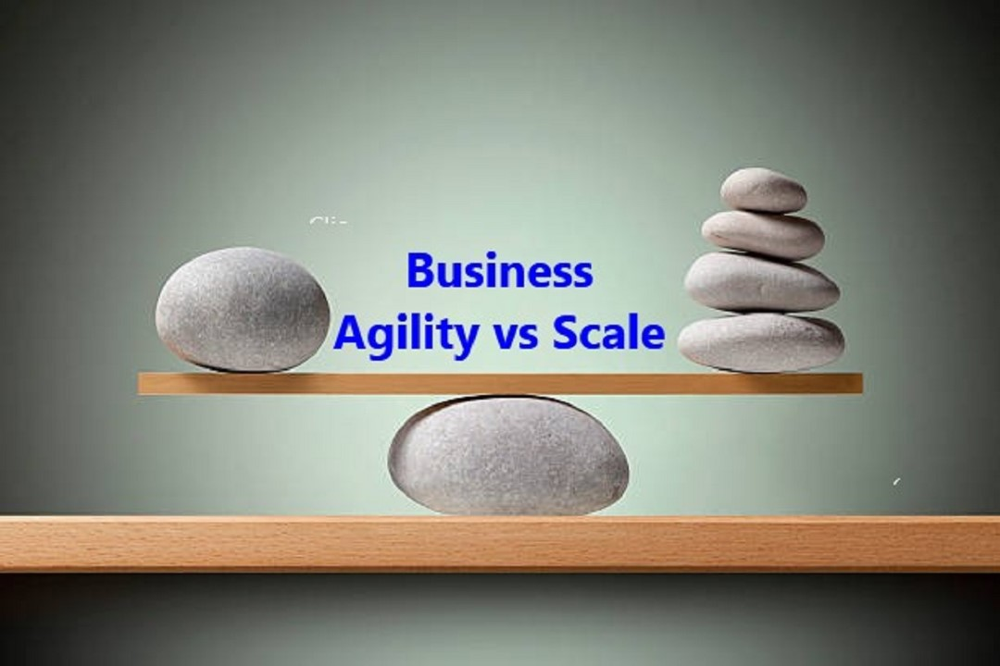{ width="200" }

    ### [Agility vs Scale in Business](agility-vs-scale-in-business.md)
    
    **Read time:** 6 min
    
    EXCERPT Not Found

- { width="200" }

    ### [United Nations 17 Sustainable Development Goals?](united-nations-17-sustainable-development-goals.md)
    
    **Read time:** 5 min
    
    EXCERPT Not Found
    

- 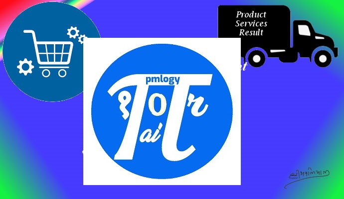{ width="200" }

    ### [Agile Practices](agile-practices.md)
    
    **Read time:** 7 min
    
    EXCERPT Not Found

- { width="200" }

    ### [Why 6sigmastudy Certification?](why-6sigmastudy-certification.md)
    
    **Read time:** 5 min
    
    EXCERPT Not Found
    

- { width="200" }

    ### [What is Six Sigma?](what-is-six-sigma.md)
    
    **Read time:** 7 min
    
    EXCERPT Not Found

- { width="200" }

    ### [What is a Technical Spike?](what-is-a-technical-spike.md)
    
    **Read time:** 5 min
    
    EXCERPT Not Found
    

- { width="200" }

    ### [User Story](user-story.md)
    
    **Read time:** 5 min
    
    EXCERPT Not Found

- 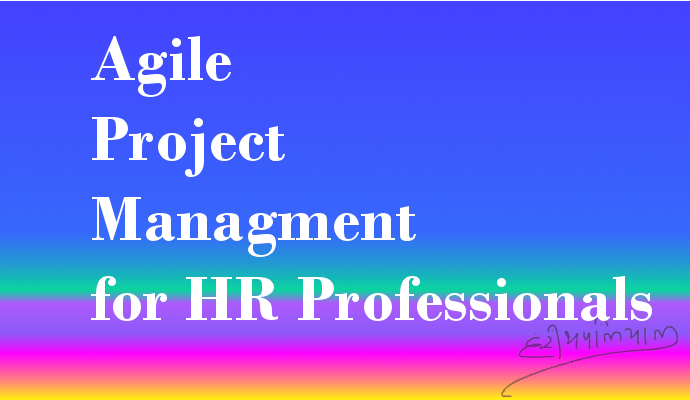{ width="200" }

    ### [Agile Project Management for HR Professionals](agile-project-management-for-hr-professionals.md)
    
    **Read time:** 8 min
    
    EXCERPT Not Found
    

- { width="200" }

    ### [PMBOK 6 Processes](pmbok-6-processes.md)
    
    **Read time:** 5 min
    
    EXCERPT Not Found

- { width="200" }

    ### [PMBOK 6th Edition Process Groups](process-groups-and-processes-in-pmbok6.md)
    
    **Read time:** 5 min
    
    EXCERPT Not Found
    

- 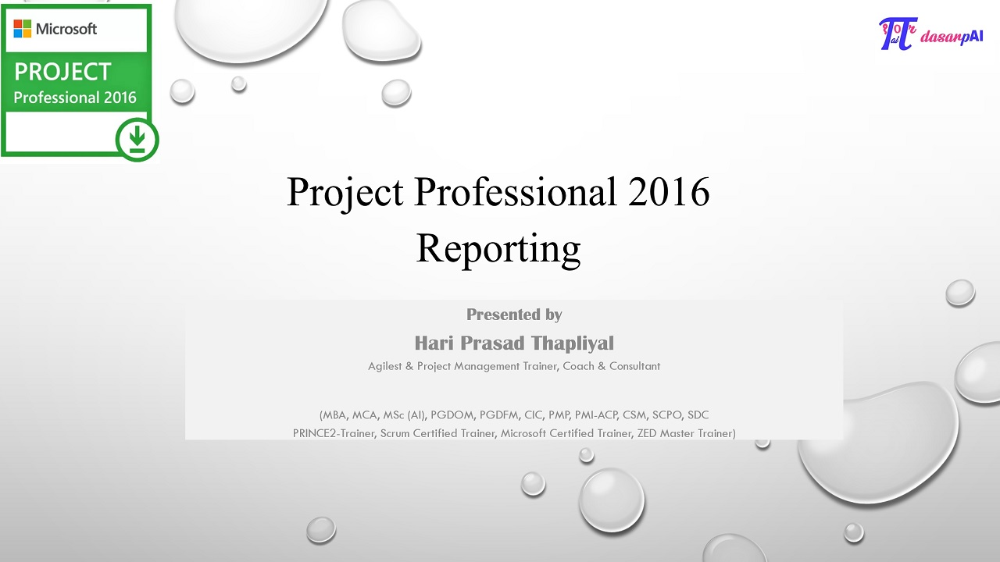{ width="200" }

    ### [Project Professional 2016 Reporting](project-professional-2016-reporting.md)
    
    **Read time:** 5 min
    
    EXCERPT Not Found

- 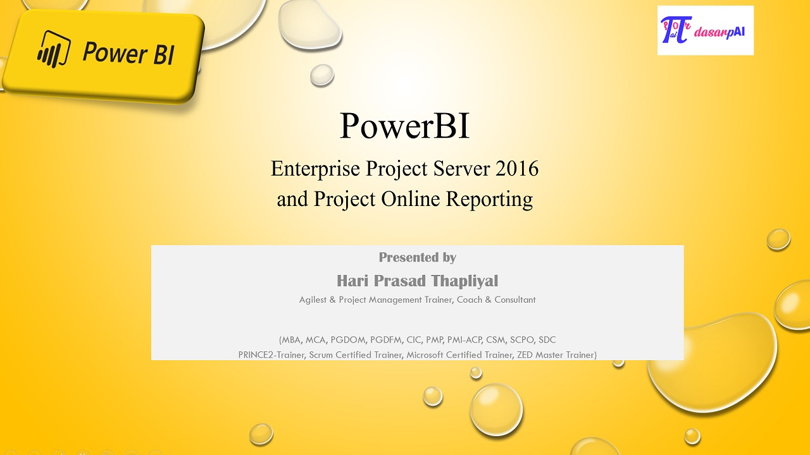{ width="200" }

    ### [Power BI Reporting for Project Online](power-bi-reporting-project-online.md)
    
    **Read time:** 5 min
    
    EXCERPT Not Found
    

- 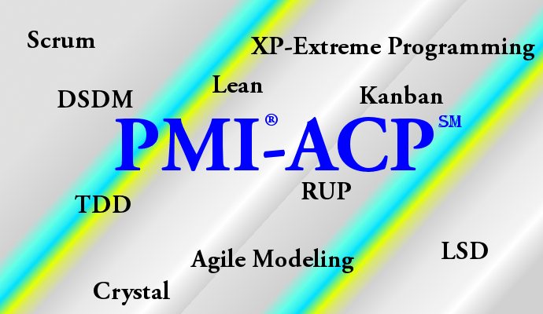{ width="200" }

    ### [PMI ACP Exam](pmi-acp-exam.md)
    
    **Read time:** 6 min
    
    EXCERPT Not Found

- { width="200" }

    ### [Structure of Business Dialogues](structure-of-business-dialogues.md)
    
    **Read time:** 6 min
    
    EXCERPT Not Found
    

- 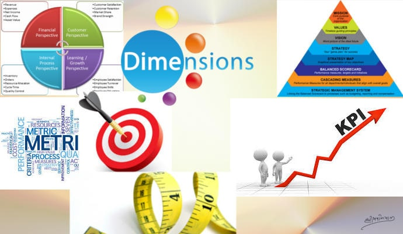{ width="200" }

    ### [Understanding Balanced Score Card](balanced-score-card.md)
    
    **Read time:** 5 min
    
    EXCERPT Not Found

- { width="200" }

    ### [Interpersonal Skills for a project manager](interpersonal-skills-for-a-project-manager.md)
    
    **Read time:** 5 min
    
    EXCERPT Not Found
    

- { width="200" }

    ### [When to Kill a Project?](when-to-kill-a-project.md)
    
    **Read time:** 5 min
    
    EXCERPT Not Found

- 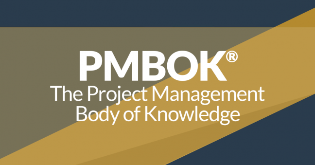{ width="200" }

    ### [What is Project Management?](what-is-project-management.md)
    
    **Read time:** 5 min
    
    EXCERPT Not Found
    

- { width="200" }

    ### [Team Challenge](team-challenge.md)
    
    **Read time:** 5 min
    
    EXCERPT Not Found

- 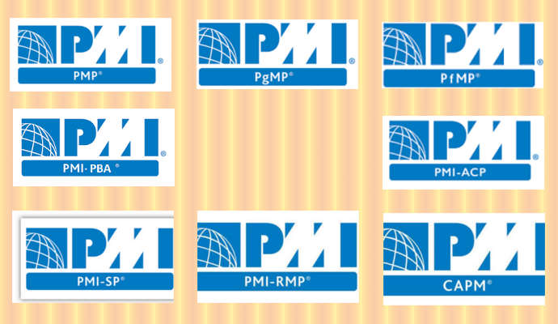{ width="200" }

    ### [What are PMI Certifications?](what-are-pmi-certifications.md)
    
    **Read time:** 5 min
    
    EXCERPT Not Found
    

- { width="200" }

    ### [Best Practices of Project Management](best-practices-of-project-management.md)
    
    **Read time:** 6 min
    
    EXCERPT Not Found

- 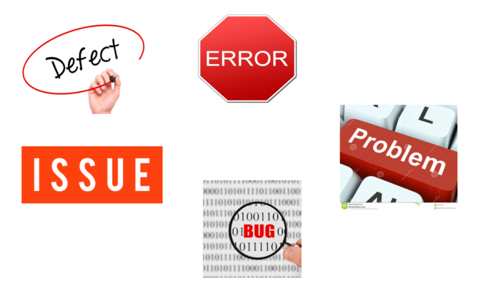{ width="200" }

    ### [Confusing Terminologies in Software Testing](confusing-terminologies-in-software-testing.md)
    
    **Read time:** 5 min
    
    EXCERPT Not Found
    

- { width="200" }

    ### [Customer is King](customer-is-king.md)
    
    **Read time:** 5 min
    
    EXCERPT Not Found

- 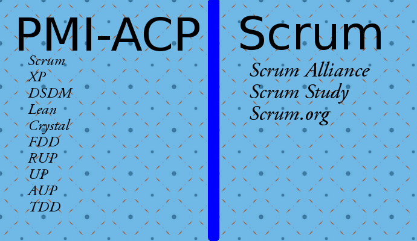{ width="200" }

    ### [PMI ACP vs Scrum Master](pmi-acp-vs-scrum-master.md)
    
    **Read time:** 7 min
    
    EXCERPT Not Found
    

- 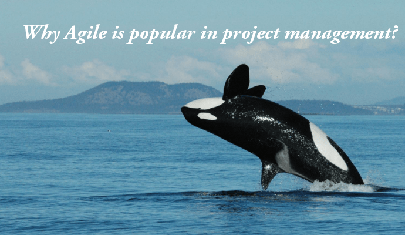{ width="200" }

    ### [Why Agile is popular in project management?](why-agile-is-popular-in-project-management.md)
    
    **Read time:** 7 min
    
    EXCERPT Not Found

- { width="200" }

    ### [Project Manager Responsibilities](project-manager-responsibilities.md)
    
    **Read time:** 8 min
    
    EXCERPT Not Found
    

- { width="200" }

    ### [How to Measure Project Success Criteria](how-to-measure-project-success-criteria.md)
    
    **Read time:** 5 min
    
    EXCERPT Not Found

- 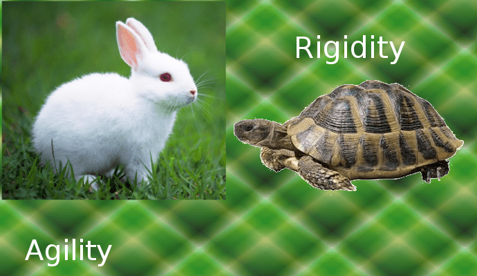{ width="200" }

    ### [Waterfall Methodology vs Agile](waterfall-methodology-vs-agile.md)
    
    **Read time:** 10 min
    
    EXCERPT Not Found
    

- { width="200" }

    ### [Enterprise Project Server 2016](enterprise-project-server-2016.md)
    
    **Read time:** 5 min
    
    EXCERPT Not Found

- 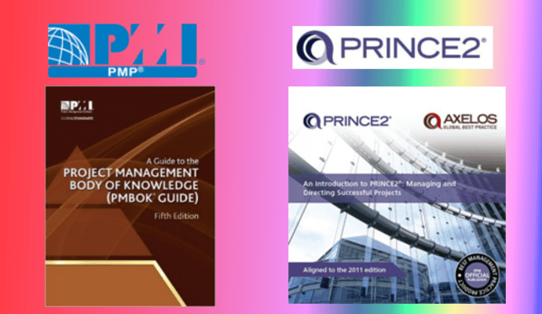{ width="200" }

    ### [Difference between PMP and PRINCE2](difference-between-pmp-and-prince2.md)
    
    **Read time:** 7 min
    
    EXCERPT Not Found
    

- 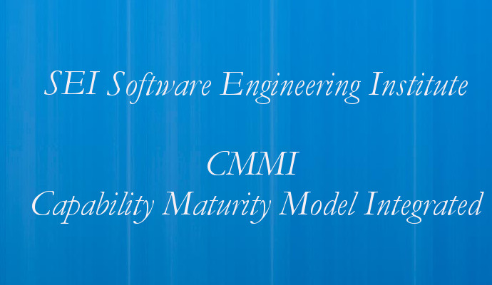{ width="200" }

    ### [CMMI Version 1.3](cmmi-version-1-3.md)
    
    **Read time:** 5 min
    
    EXCERPT Not Found

- 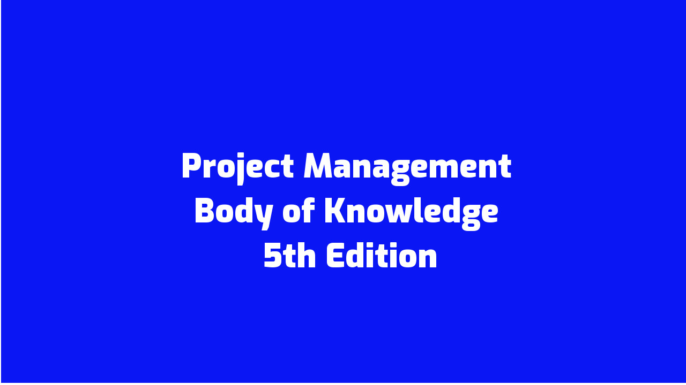{ width="200" }

    ### [PMBOK 5 Processes](pmbok-5-processes.md)
    
    **Read time:** 5 min
    
    EXCERPT Not Found
    

- { width="200" }

    ### [PMBOK 5 Process Groups & Processes (Acronyms)](pmbok-5-process-groups-processes-acronyms.md)
    
    **Read time:** 5 min
    
    EXCERPT Not Found

- 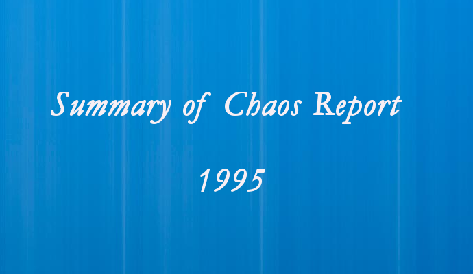{ width="200" }

    ### [Summary of Chaos Report 1995](summary-of-chaos-report-1995.md)
    
    **Read time:** 5 min
    
    EXCERPT Not Found
    

- 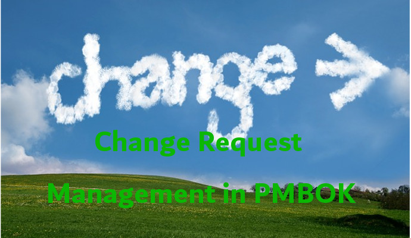{ width="200" }

    ### [Change Request in Project Management](change-request-in-project-management.md)
    
    **Read time:** 5 min
    
    EXCERPT Not Found

- 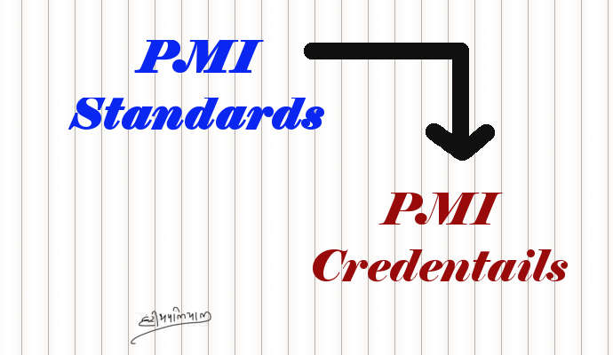{ width="200" }

    ### [PMI Standards and Credentials](pmi-standards-and-credentials.md)
    
    **Read time:** 5 min
    
    EXCERPT Not Found
    

- { width="200" }

    ### [PMI Exam Change Schedule 2013](pmi-exam-change-schedule-2013.md)
    
    **Read time:** 5 min
    
    EXCERPT Not Found

- { width="200" }

    ### [PMI-ACP Exam Preparation Books](pmi-acp-exam-preparation-books.md)
    
    **Read time:** 5 min
    
    EXCERPT Not Found
    

- 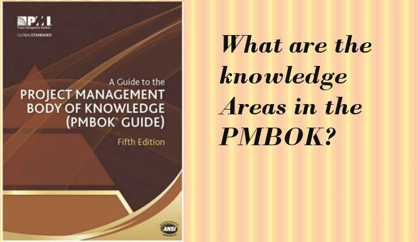{ width="200" }

    ### [PMBOK Knowledge Areas](pmbok-knowledge-areas.md)
    
    **Read time:** 5 min
    
    EXCERPT Not Found

- { width="200" }

    ### [Understanding Project Management like a Kid](understanding-project-management-like-a-kid.md)
    
    **Read time:** 12 min
    
    EXCERPT Not Found
    

- { width="200" }

    ### [Managing Virtual Teams](managing-virtual-teams.md)
    
    **Read time:** 7 min
    
    EXCERPT Not Found

- { width="200" }

    ### [Behaviors that lead to Exceptional Performance](behaviors-that-lead-to-exceptional-performance.md)
    
    **Read time:** 5 min
    
    EXCERPT Not Found
    

- 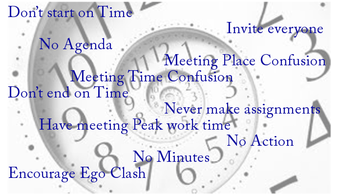{ width="200" }

    ### [Bad Meetings](bad-meetings.md)
    
    **Read time:** 5 min
    
    EXCERPT Not Found

