# Welcome to my project Management Blog

- 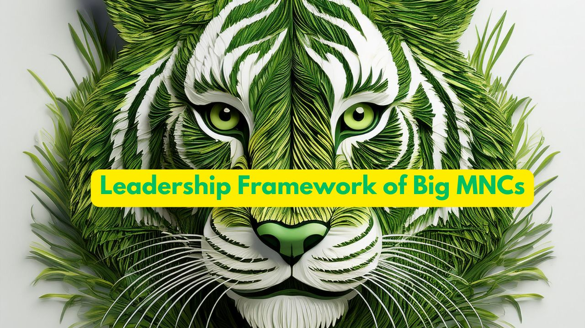{ width="200" }

    ### [Leadership Framework of Big MNCs](docs\pmblog\Leadership-Framework-of-Big-MNCs.md)
    
    **Read time:** 5 min
    
    EXCERPT Not Found

- 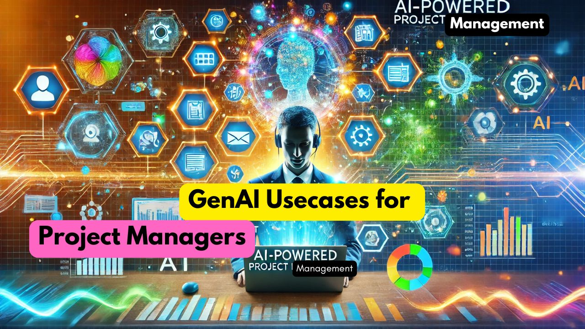{ width="200" }

    ### [GenAI Usecases for Project Managers](docs\pmblog\GenAI-Usecases-for-Project-Managers.md)
    
    **Read time:** 22 min
    
    EXCERPT Not Found
    

- 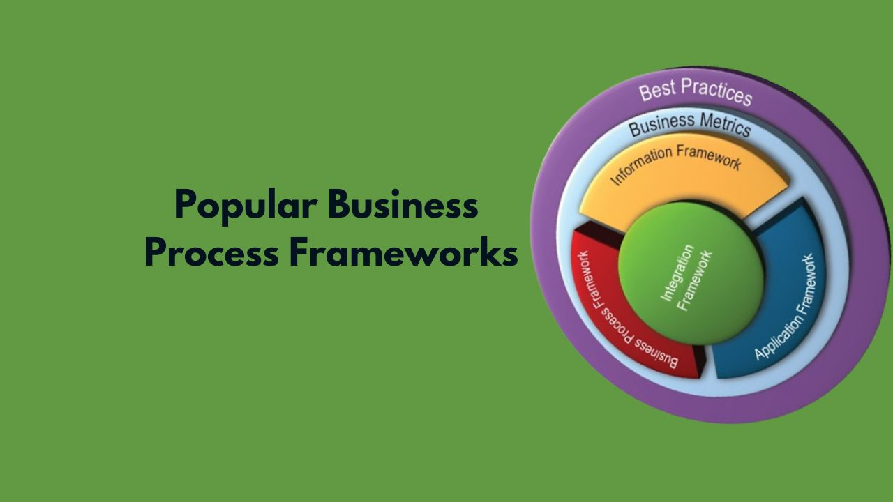{ width="200" }

    ### [Popular Business Process Frameworks](docs\pmblog\Popular-Business-Process-Frameworks.md)
    
    **Read time:** 10 min
    
    EXCERPT Not Found

- 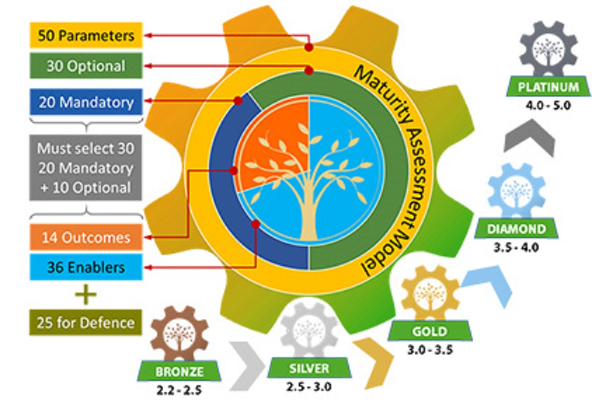{ width="200" }

    ### [ZED Best Practices v2](docs\pmblog\Zed-Best-Practices-v2.md)
    
    **Read time:** 7 min
    
    EXCERPT Not Found
    

- 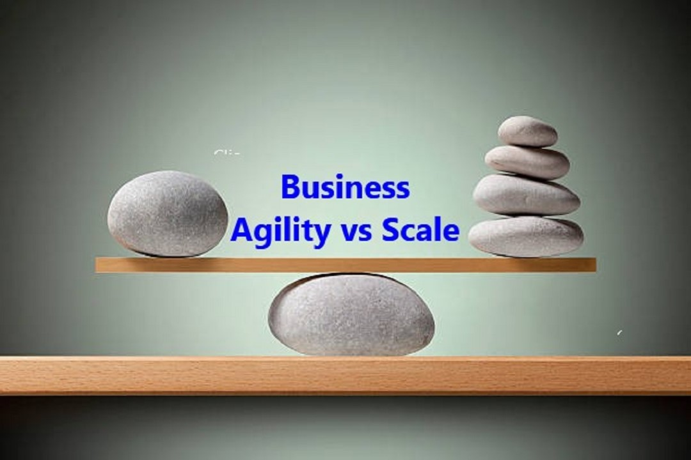{ width="200" }

    ### [Agility vs Scale in Business](docs\pmblog\agility-vs-scale-in-business.md)
    
    **Read time:** 6 min
    
    EXCERPT Not Found

- 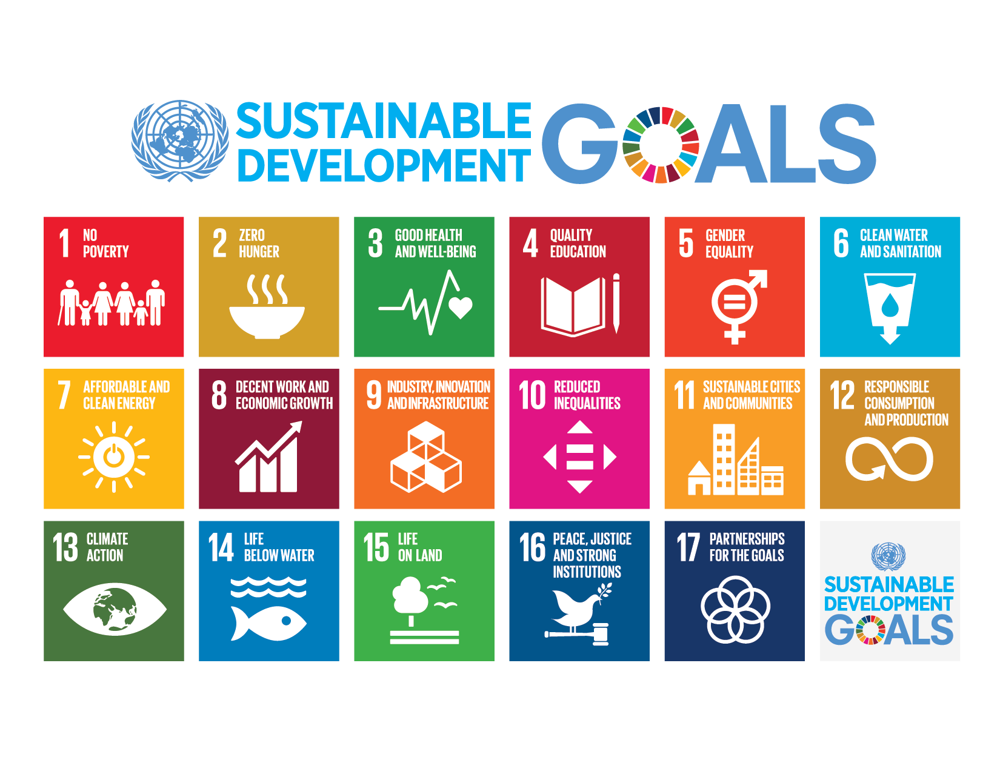{ width="200" }

    ### [United Nations 17 Sustainable Development Goals?](docs\pmblog\united-nations-17-sustainable-development-goals.md)
    
    **Read time:** 5 min
    
    EXCERPT Not Found
    

- 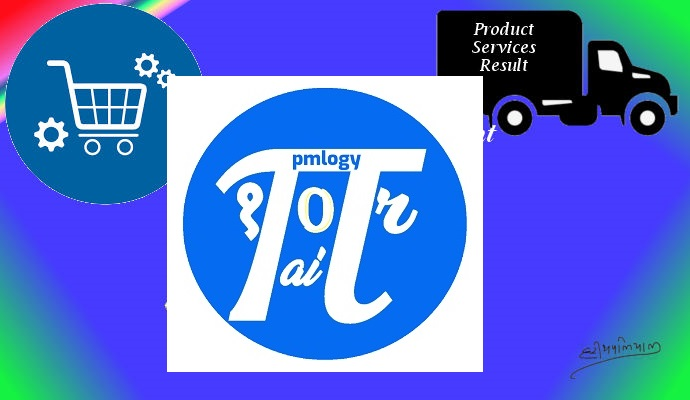{ width="200" }

    ### [Agile Practices](docs\pmblog\agile-practices.md)
    
    **Read time:** 7 min
    
    EXCERPT Not Found

- { width="200" }

    ### [Why 6sigmastudy Certification?](docs\pmblog\why-6sigmastudy-certification.md)
    
    **Read time:** 5 min
    
    EXCERPT Not Found
    

- { width="200" }

    ### [What is Six Sigma?](docs\pmblog\what-is-six-sigma.md)
    
    **Read time:** 7 min
    
    EXCERPT Not Found

- { width="200" }

    ### [What is a Technical Spike?](docs\pmblog\what-is-a-technical-spike.md)
    
    **Read time:** 5 min
    
    EXCERPT Not Found
    

- { width="200" }

    ### [User Story](docs\pmblog\user-story.md)
    
    **Read time:** 5 min
    
    EXCERPT Not Found

- 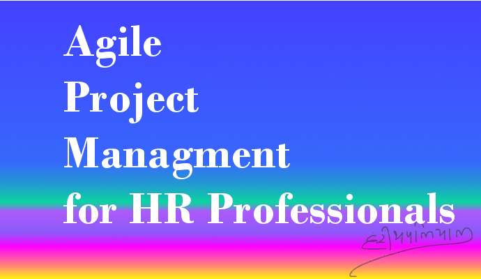{ width="200" }

    ### [Agile Project Management for HR Professionals](docs\pmblog\agile-project-management-for-hr-professionals.md)
    
    **Read time:** 8 min
    
    EXCERPT Not Found
    

- { width="200" }

    ### [PMBOK 6 Processes](docs\pmblog\pmbok-6-processes.md)
    
    **Read time:** 5 min
    
    EXCERPT Not Found

- { width="200" }

    ### [PMBOK 6th Edition Process Groups](docs\pmblog\process-groups-and-processes-in-pmbok6.md)
    
    **Read time:** 5 min
    
    EXCERPT Not Found
    

- 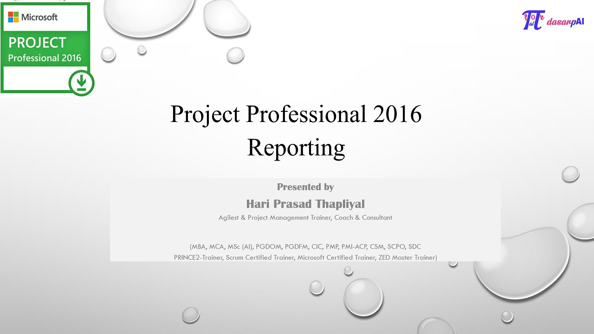{ width="200" }

    ### [Project Professional 2016 Reporting](docs\pmblog\project-professional-2016-reporting.md)
    
    **Read time:** 5 min
    
    EXCERPT Not Found

- 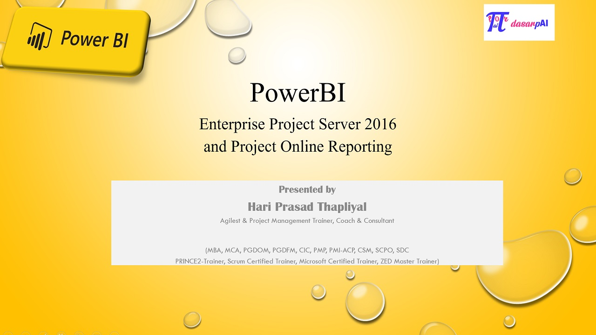{ width="200" }

    ### [Power BI Reporting for Project Online](docs\pmblog\power-bi-reporting-project-online.md)
    
    **Read time:** 5 min
    
    EXCERPT Not Found
    

- 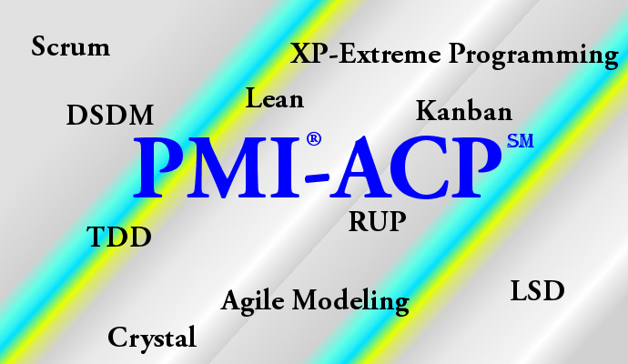{ width="200" }

    ### [PMI ACP Exam](docs\pmblog\pmi-acp-exam.md)
    
    **Read time:** 6 min
    
    EXCERPT Not Found

- { width="200" }

    ### [Structure of Business Dialogues](docs\pmblog\structure-of-business-dialogues.md)
    
    **Read time:** 6 min
    
    EXCERPT Not Found
    

- 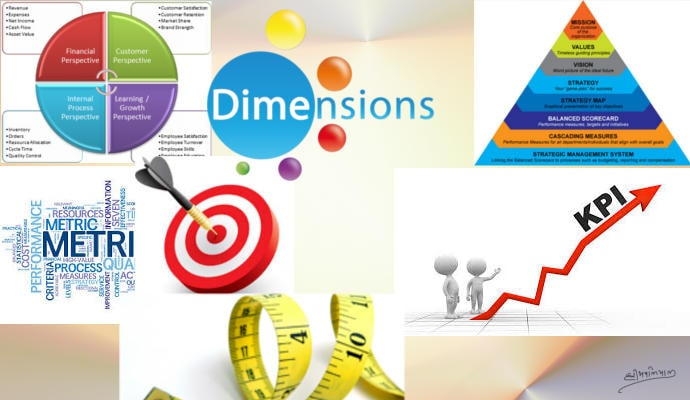{ width="200" }

    ### [Understanding Balanced Score Card](docs\pmblog\balanced-score-card.md)
    
    **Read time:** 5 min
    
    EXCERPT Not Found

- { width="200" }

    ### [Interpersonal Skills for a project manager](docs\pmblog\interpersonal-skills-for-a-project-manager.md)
    
    **Read time:** 5 min
    
    EXCERPT Not Found
    

- 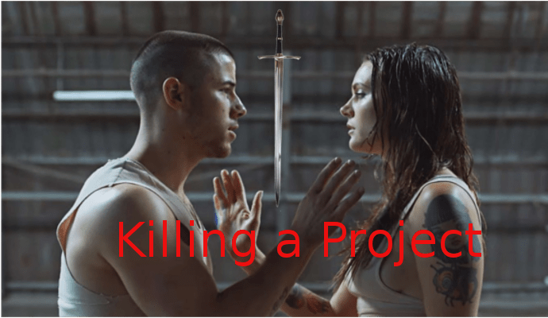{ width="200" }

    ### [When to Kill a Project?](docs\pmblog\when-to-kill-a-project.md)
    
    **Read time:** 5 min
    
    EXCERPT Not Found

- 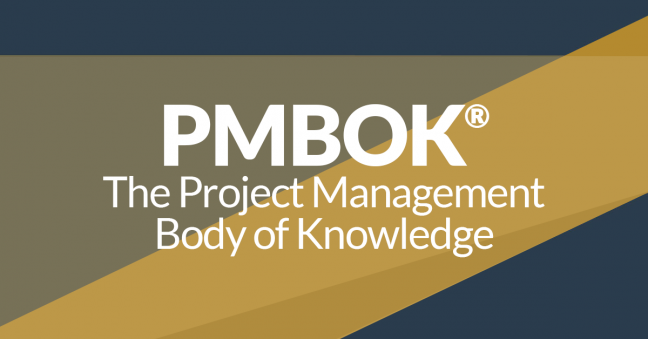{ width="200" }

    ### [What is Project Management?](docs\pmblog\what-is-project-management.md)
    
    **Read time:** 5 min
    
    EXCERPT Not Found
    

- { width="200" }

    ### [Team Challenge](docs\pmblog\team-challenge.md)
    
    **Read time:** 5 min
    
    EXCERPT Not Found

- 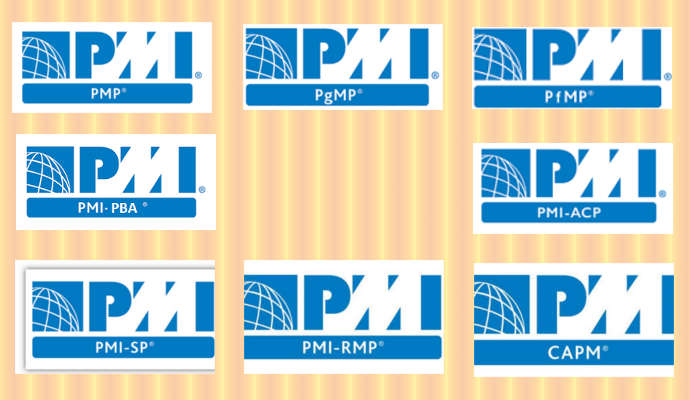{ width="200" }

    ### [What are PMI Certifications?](docs\pmblog\what-are-pmi-certifications.md)
    
    **Read time:** 5 min
    
    EXCERPT Not Found
    

- { width="200" }

    ### [Best Practices of Project Management](docs\pmblog\best-practices-of-project-management.md)
    
    **Read time:** 6 min
    
    EXCERPT Not Found

- 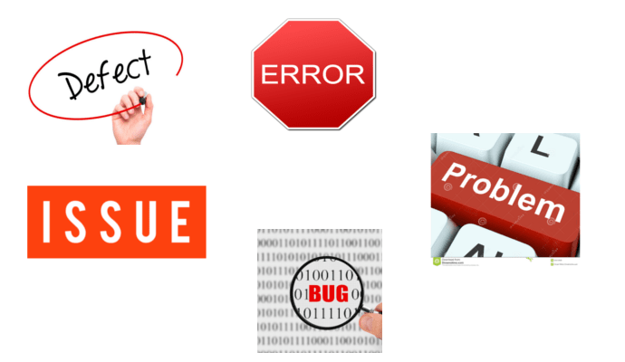{ width="200" }

    ### [Confusing Terminologies in Software Testing](docs\pmblog\confusing-terminologies-in-software-testing.md)
    
    **Read time:** 5 min
    
    EXCERPT Not Found
    

- { width="200" }

    ### [Customer is King](docs\pmblog\customer-is-king.md)
    
    **Read time:** 5 min
    
    EXCERPT Not Found

- 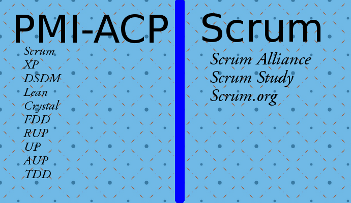{ width="200" }

    ### [PMI ACP vs Scrum Master](docs\pmblog\pmi-acp-vs-scrum-master.md)
    
    **Read time:** 7 min
    
    EXCERPT Not Found
    

- 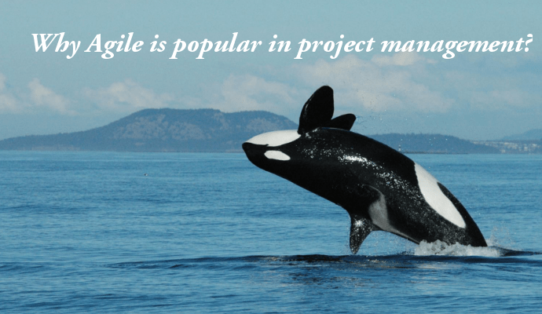{ width="200" }

    ### [Why Agile is popular in project management?](docs\pmblog\why-agile-is-popular-in-project-management.md)
    
    **Read time:** 7 min
    
    EXCERPT Not Found

- { width="200" }

    ### [Project Manager Responsibilities](docs\pmblog\project-manager-responsibilities.md)
    
    **Read time:** 8 min
    
    EXCERPT Not Found
    

- { width="200" }

    ### [How to Measure Project Success Criteria](docs\pmblog\how-to-measure-project-success-criteria.md)
    
    **Read time:** 5 min
    
    EXCERPT Not Found

- 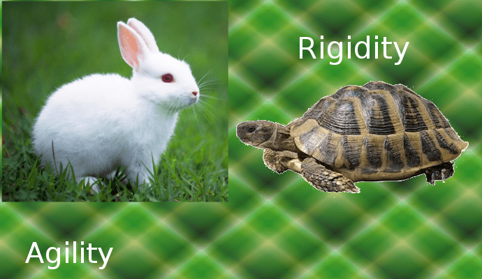{ width="200" }

    ### [Waterfall Methodology vs Agile](docs\pmblog\waterfall-methodology-vs-agile.md)
    
    **Read time:** 10 min
    
    EXCERPT Not Found
    

- { width="200" }

    ### [Enterprise Project Server 2016](docs\pmblog\enterprise-project-server-2016.md)
    
    **Read time:** 5 min
    
    EXCERPT Not Found

- 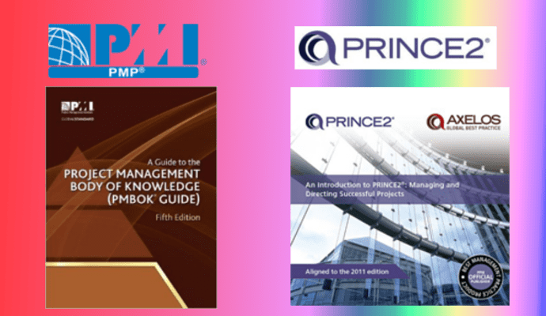{ width="200" }

    ### [Difference between PMP and PRINCE2](docs\pmblog\difference-between-pmp-and-prince2.md)
    
    **Read time:** 7 min
    
    EXCERPT Not Found
    

- 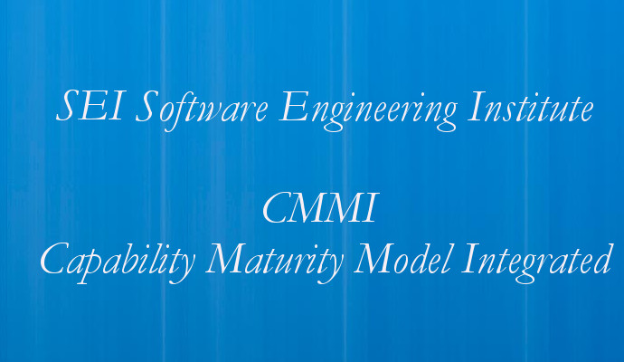{ width="200" }

    ### [CMMI Version 1.3](docs\pmblog\cmmi-version-1-3.md)
    
    **Read time:** 5 min
    
    EXCERPT Not Found

- 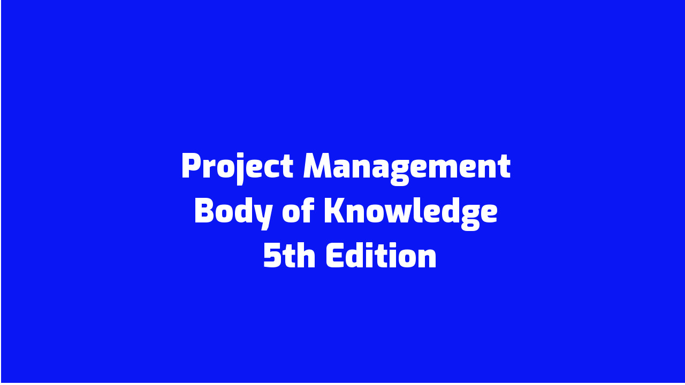{ width="200" }

    ### [PMBOK 5 Processes](docs\pmblog\pmbok-5-processes.md)
    
    **Read time:** 5 min
    
    EXCERPT Not Found
    

- { width="200" }

    ### [PMBOK 5 Process Groups & Processes (Acronyms)](docs\pmblog\pmbok-5-process-groups-processes-acronyms.md)
    
    **Read time:** 5 min
    
    EXCERPT Not Found

- 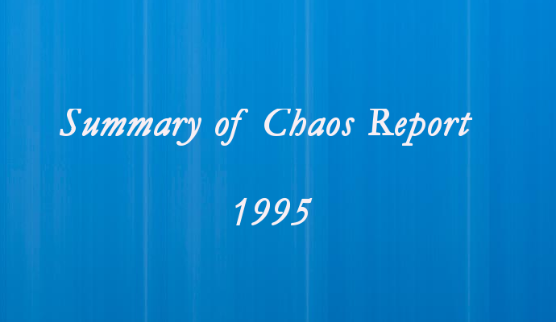{ width="200" }

    ### [Summary of Chaos Report 1995](docs\pmblog\summary-of-chaos-report-1995.md)
    
    **Read time:** 5 min
    
    EXCERPT Not Found
    

- 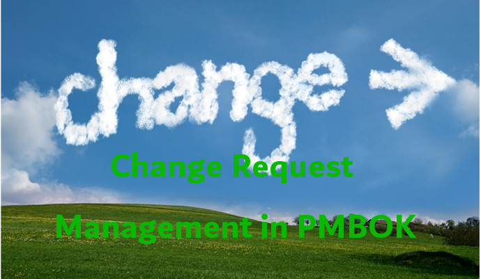{ width="200" }

    ### [Change Request in Project Management](docs\pmblog\change-request-in-project-management.md)
    
    **Read time:** 5 min
    
    EXCERPT Not Found

- 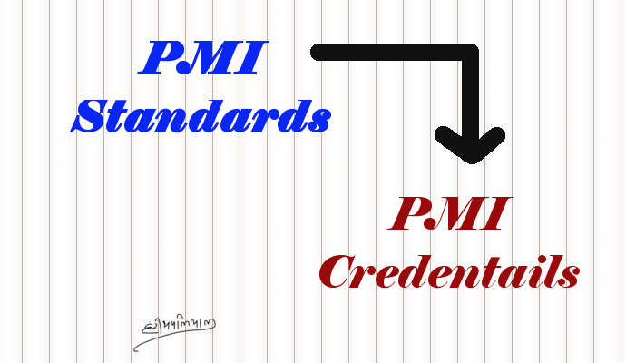{ width="200" }

    ### [PMI Standards and Credentials](docs\pmblog\pmi-standards-and-credentials.md)
    
    **Read time:** 5 min
    
    EXCERPT Not Found
    

- { width="200" }

    ### [PMI Exam Change Schedule 2013](docs\pmblog\pmi-exam-change-schedule-2013.md)
    
    **Read time:** 5 min
    
    EXCERPT Not Found

- { width="200" }

    ### [PMI-ACP Exam Preparation Books](docs\pmblog\pmi-acp-exam-preparation-books.md)
    
    **Read time:** 5 min
    
    EXCERPT Not Found
    

- 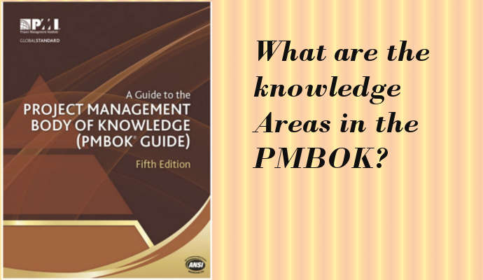{ width="200" }

    ### [PMBOK Knowledge Areas](docs\pmblog\pmbok-knowledge-areas.md)
    
    **Read time:** 5 min
    
    EXCERPT Not Found

- { width="200" }

    ### [Understanding Project Management like a Kid](docs\pmblog\understanding-project-management-like-a-kid.md)
    
    **Read time:** 12 min
    
    EXCERPT Not Found
    

- { width="200" }

    ### [Managing Virtual Teams](docs\pmblog\managing-virtual-teams.md)
    
    **Read time:** 7 min
    
    EXCERPT Not Found

- { width="200" }

    ### [Behaviors that lead to Exceptional Performance](docs\pmblog\behaviors-that-lead-to-exceptional-performance.md)
    
    **Read time:** 5 min
    
    EXCERPT Not Found
    

- 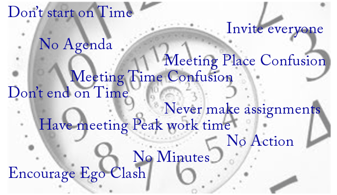{ width="200" }

    ### [Bad Meetings](docs\pmblog\bad-meetings.md)
    
    **Read time:** 5 min
    
    EXCERPT Not Found

