# Welcome to my PMBOK6 Summary Blog

- 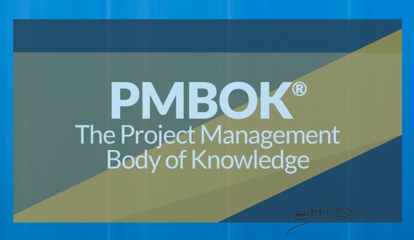{ width="200" }

    ### [Acquire Resources](acquire-resources)
    
    **Read time:** 5 min
    
    EXCERPT Not Found
- { width="200" }

    ### [Agreements](agreements)
    
    **Read time:** 5 min
    
    EXCERPT Not Found
    

- { width="200" }

    ### [Analytical Techniques](analytical-techniques)
    
    **Read time:** 5 min
    
    EXCERPT Not Found
- { width="200" }

    ### [Benefits Management Plan](benefits-management-plan)
    
    **Read time:** 5 min
    
    EXCERPT Not Found
    

- { width="200" }

    ### [Business Documents](business-documents)
    
    **Read time:** 5 min
    
    EXCERPT Not Found
- { width="200" }

    ### [Change Requests](change-requests)
    
    **Read time:** 5 min
    
    EXCERPT Not Found
    

- { width="200" }

    ### [Close Project or Phase](close-project-or-phase)
    
    **Read time:** 5 min
    
    EXCERPT Not Found
- { width="200" }

    ### [Closing Process Group](closing-process-group)
    
    **Read time:** 5 min
    
    EXCERPT Not Found
    

- { width="200" }

    ### [Collect Requirements](collect-requirements)
    
    **Read time:** 5 min
    
    EXCERPT Not Found
- { width="200" }

    ### [Conduct Procurements](conduct-procurements)
    
    **Read time:** 5 min
    
    EXCERPT Not Found
    

- { width="200" }

    ### [Control Costs](control-costs)
    
    **Read time:** 5 min
    
    EXCERPT Not Found
- { width="200" }

    ### [Control Procurements](control-procurements)
    
    **Read time:** 5 min
    
    EXCERPT Not Found
    

- { width="200" }

    ### [Control Quality](control-quality)
    
    **Read time:** 5 min
    
    EXCERPT Not Found
- { width="200" }

    ### [Control Resources](control-resources)
    
    **Read time:** 5 min
    
    EXCERPT Not Found
    

- { width="200" }

    ### [Control Schedule](control-schedule)
    
    **Read time:** 5 min
    
    EXCERPT Not Found
- { width="200" }

    ### [Control Scope](control-scope)
    
    **Read time:** 5 min
    
    EXCERPT Not Found
    

- { width="200" }

    ### [Cost-cutting tools](cost-cutting-tools)
    
    **Read time:** 5 min
    
    EXCERPT Not Found
- { width="200" }

    ### [Create WBS](create-wbs)
    
    **Read time:** 5 min
    
    EXCERPT Not Found
    

- { width="200" }

    ### [Data Analysis](data-analysis)
    
    **Read time:** 5 min
    
    EXCERPT Not Found
- { width="200" }

    ### [Data Gathering](data-gathering)
    
    **Read time:** 5 min
    
    EXCERPT Not Found
    

- { width="200" }

    ### [Data Representation](data-representation)
    
    **Read time:** 5 min
    
    EXCERPT Not Found
- { width="200" }

    ### [Decision Making](decision-making)
    
    **Read time:** 5 min
    
    EXCERPT Not Found
    

- { width="200" }

    ### [Define Activities](define-activities)
    
    **Read time:** 5 min
    
    EXCERPT Not Found
- { width="200" }

    ### [Define Scope](define-scope)
    
    **Read time:** 5 min
    
    EXCERPT Not Found
    

- { width="200" }

    ### [Determine Budget](determine-budget)
    
    **Read time:** 5 min
    
    EXCERPT Not Found
- 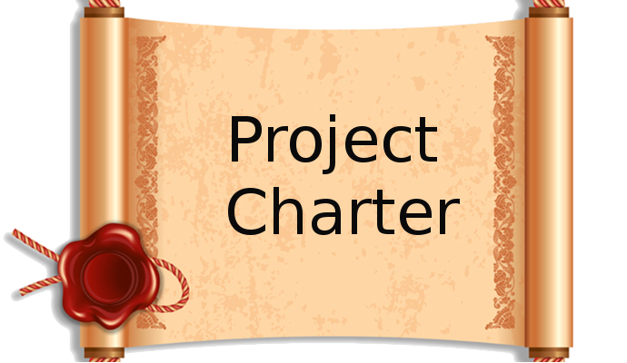{ width="200" }

    ### [Develop Project Charter](develop-project-charter)
    
    **Read time:** 5 min
    
    EXCERPT Not Found
    

- 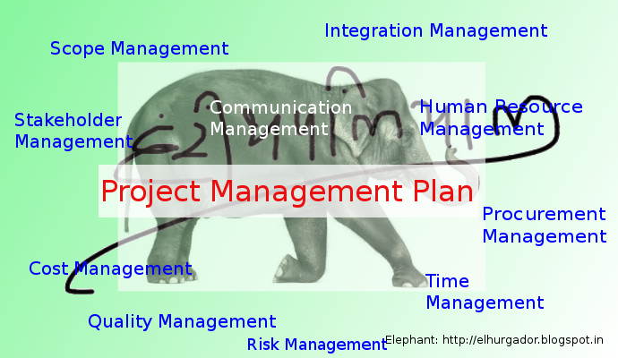{ width="200" }

    ### [Develop Project Management Plan](develop-project-management-plan)
    
    **Read time:** 5 min
    
    EXCERPT Not Found
- { width="200" }

    ### [Develop Schedule](develop-schedule)
    
    **Read time:** 5 min
    
    EXCERPT Not Found
    

- { width="200" }

    ### [Develop Team](develop-team)
    
    **Read time:** 5 min
    
    EXCERPT Not Found
- { width="200" }

    ### [Direct and Manage Project Work](direct-and-manage-project-work)
    
    **Read time:** 5 min
    
    EXCERPT Not Found
    

- { width="200" }

    ### [Enterprise Environmental Factors](enterprise-environmental-factors)
    
    **Read time:** 5 min
    
    EXCERPT Not Found
- { width="200" }

    ### [Estimate Activity Durations](estimate-activity-durations)
    
    **Read time:** 5 min
    
    EXCERPT Not Found
    

- { width="200" }

    ### [Estimate Activity Resources](estimate-activity-resources)
    
    **Read time:** 5 min
    
    EXCERPT Not Found
- { width="200" }

    ### [Estimate Costs](estimate-costs)
    
    **Read time:** 5 min
    
    EXCERPT Not Found
    

- { width="200" }

    ### [Executing Process Group](executing-process-group)
    
    **Read time:** 5 min
    
    EXCERPT Not Found
- { width="200" }

    ### [Expert Judgement](expert-judgement)
    
    **Read time:** 5 min
    
    EXCERPT Not Found
    

- { width="200" }

    ### [Identify Risks](identify-risks)
    
    **Read time:** 5 min
    
    EXCERPT Not Found
- { width="200" }

    ### [Identify Stakeholders](identify-stakeholders)
    
    **Read time:** 5 min
    
    EXCERPT Not Found
    

- { width="200" }

    ### [Implement Risk Responses](implement-risk-responses)
    
    **Read time:** 5 min
    
    EXCERPT Not Found
- { width="200" }

    ### [Initiating Process Group](initiating-process-group)
    
    **Read time:** 5 min
    
    EXCERPT Not Found
    

- { width="200" }

    ### [Input-Output List of PMBOK6](input-output-list-of-pmbok6)
    
    **Read time:** 5 min
    
    EXCERPT Not Found
- { width="200" }

    ### [Interpersonal and Team Skills](interpersonal-and-team-skills)
    
    **Read time:** 5 min
    
    EXCERPT Not Found
    

- { width="200" }

    ### [Manage Communications](manage-communications)
    
    **Read time:** 5 min
    
    EXCERPT Not Found
- { width="200" }

    ### [Manage Project Knowledge](manage-project-knowledge)
    
    **Read time:** 5 min
    
    EXCERPT Not Found
    

- { width="200" }

    ### [Manage Quality](manage-quality)
    
    **Read time:** 5 min
    
    EXCERPT Not Found
- { width="200" }

    ### [Manage Stakeholder Engagement](manage-stakeholder-engagement)
    
    **Read time:** 5 min
    
    EXCERPT Not Found
    

- { width="200" }

    ### [Manage Team](manage-team)
    
    **Read time:** 5 min
    
    EXCERPT Not Found
- { width="200" }

    ### [Meetings](meetings)
    
    **Read time:** 5 min
    
    EXCERPT Not Found
    

- 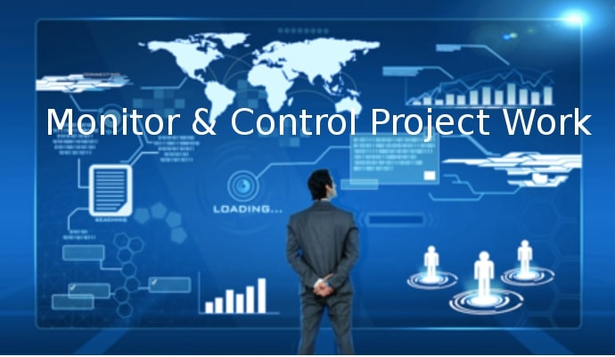{ width="200" }

    ### [Monitor and Control Project Work](monitor-and-control-project-work)
    
    **Read time:** 5 min
    
    EXCERPT Not Found
- { width="200" }

    ### [Monitor Communications](monitor-communications)
    
    **Read time:** 5 min
    
    EXCERPT Not Found
    

- { width="200" }

    ### [Monitor Risks](monitor-risks)
    
    **Read time:** 5 min
    
    EXCERPT Not Found
- { width="200" }

    ### [Monitoring and Controlling Process Group](monitoring-and-controlling-process-group)
    
    **Read time:** 5 min
    
    EXCERPT Not Found
    

- { width="200" }

    ### [Organizational Process Assets Updates](organizational-process-assets-updates)
    
    **Read time:** 5 min
    
    EXCERPT Not Found
- { width="200" }

    ### [Organizational Process Assets](organizational-process-assets)
    
    **Read time:** 5 min
    
    EXCERPT Not Found
    

- 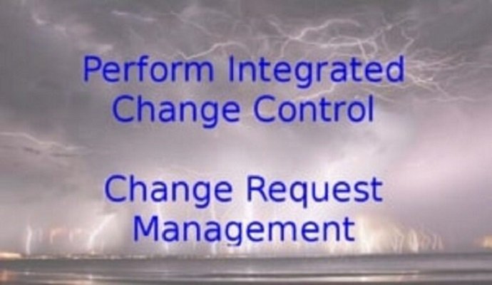{ width="200" }

    ### [Perform Integrated Change Control](perform-integrated-change-control)
    
    **Read time:** 5 min
    
    EXCERPT Not Found
- { width="200" }

    ### [Perform Qualitative Risk Analysis](perform-qualitative-risk-analysis)
    
    **Read time:** 5 min
    
    EXCERPT Not Found
    

- { width="200" }

    ### [Perform Quantitative Risk Analysis](perform-quantitative-risk-analysis)
    
    **Read time:** 5 min
    
    EXCERPT Not Found
- { width="200" }

    ### [Plan Communications Management](plan-communications-management)
    
    **Read time:** 5 min
    
    EXCERPT Not Found
    

- { width="200" }

    ### [Plan Cost Management](plan-cost-management)
    
    **Read time:** 5 min
    
    EXCERPT Not Found
- { width="200" }

    ### [Plan Procurement Management](plan-procurement-management)
    
    **Read time:** 5 min
    
    EXCERPT Not Found
    

- { width="200" }

    ### [Plan Quality Management](plan-quality-management)
    
    **Read time:** 5 min
    
    EXCERPT Not Found
- { width="200" }

    ### [Plan Resource Management](plan-resource-management)
    
    **Read time:** 5 min
    
    EXCERPT Not Found
    

- { width="200" }

    ### [Plan Risk Management](plan-risk-management)
    
    **Read time:** 5 min
    
    EXCERPT Not Found
- { width="200" }

    ### [Plan Risk Responses](plan-risk-responses)
    
    **Read time:** 5 min
    
    EXCERPT Not Found
    

- { width="200" }

    ### [Plan Schedule Management](plan-schedule-management)
    
    **Read time:** 5 min
    
    EXCERPT Not Found
- { width="200" }

    ### [Plan Scope Management](plan-scope-management)
    
    **Read time:** 5 min
    
    EXCERPT Not Found
    

- { width="200" }

    ### [Plan Stakeholder Engagement](plan-stakeholder-engagement)
    
    **Read time:** 5 min
    
    EXCERPT Not Found
- { width="200" }

    ### [Planning Process Group](planning-process-group)
    
    **Read time:** 5 min
    
    EXCERPT Not Found
    

- { width="200" }

    ### [PMBOK 6 Tools and Techniques](pmbok-6-tools-and-techniques)
    
    **Read time:** 5 min
    
    EXCERPT Not Found
- { width="200" }

    ### [Procurement Documentation Updates](procurement-documentation-updates)
    
    **Read time:** 5 min
    
    EXCERPT Not Found
    

- { width="200" }

    ### [Procurement Documentation](procurement-documentation)
    
    **Read time:** 5 min
    
    EXCERPT Not Found
- { width="200" }

    ### [Project Charter](project-charter)
    
    **Read time:** 5 min
    
    EXCERPT Not Found
    

- { width="200" }

    ### [Project Communication Management](project-communication-management)
    
    **Read time:** 5 min
    
    EXCERPT Not Found
- 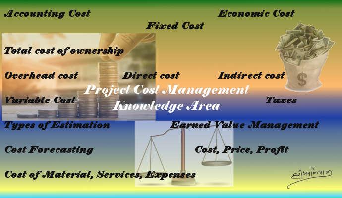{ width="200" }

    ### [Project Cost Management](project-cost-management)
    
    **Read time:** 5 min
    
    EXCERPT Not Found
    

- { width="200" }

    ### [Project Documents Updates](project-documents-updates)
    
    **Read time:** 5 min
    
    EXCERPT Not Found
- { width="200" }

    ### [Project Documents](project-documents)
    
    **Read time:** 5 min
    
    EXCERPT Not Found
    

- 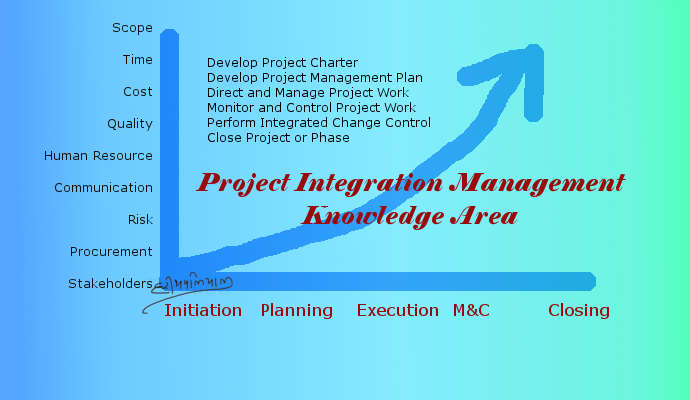{ width="200" }

    ### [Project Integration Management](project-integration-management)
    
    **Read time:** 5 min
    
    EXCERPT Not Found
- { width="200" }

    ### [Project Management Information System](project-management-information-system)
    
    **Read time:** 5 min
    
    EXCERPT Not Found
    

- { width="200" }

    ### [Project Management Plan Updates](project-management-plan-updates)
    
    **Read time:** 5 min
    
    EXCERPT Not Found
- { width="200" }

    ### [Project Management Plan](project-management-plan)
    
    **Read time:** 5 min
    
    EXCERPT Not Found
    

- { width="200" }

    ### [Project Procurement Management](project-procurement-management)
    
    **Read time:** 5 min
    
    EXCERPT Not Found
- 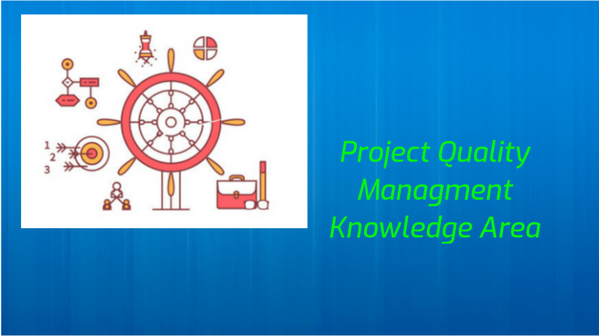{ width="200" }

    ### [Project Quality Management](project-quality-management)
    
    **Read time:** 5 min
    
    EXCERPT Not Found
    

- { width="200" }

    ### [Project Resource Management](project-resource-management)
    
    **Read time:** 5 min
    
    EXCERPT Not Found
- 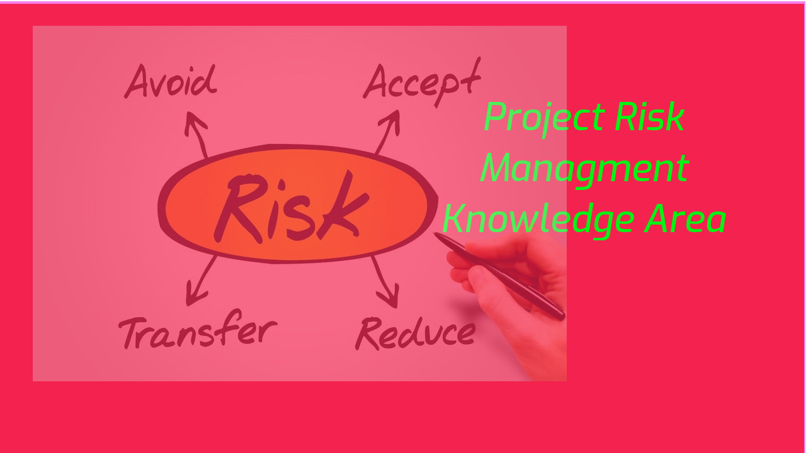{ width="200" }

    ### [Project Risk Management](project-risk-management)
    
    **Read time:** 5 min
    
    EXCERPT Not Found
    

- 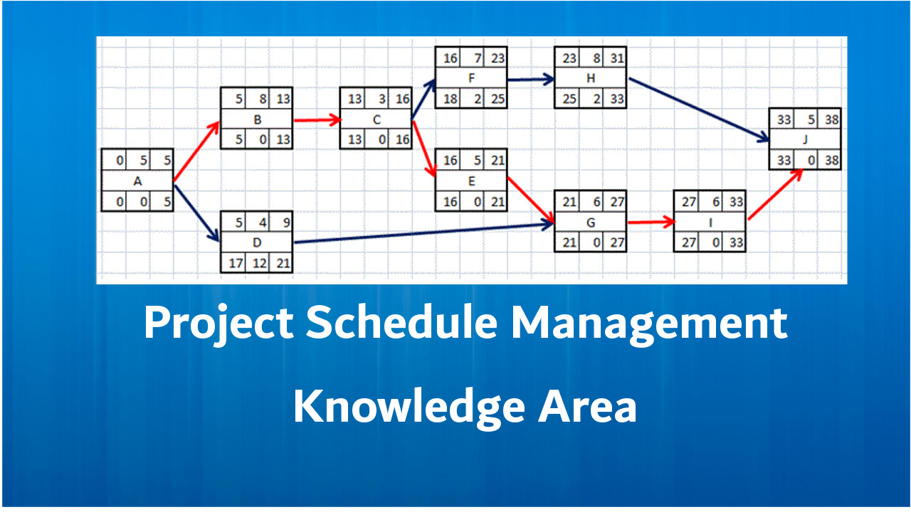{ width="200" }

    ### [Project Schedule Management](project-schedule-management)
    
    **Read time:** 5 min
    
    EXCERPT Not Found
- { width="200" }

    ### [Project Scope Management](project-scope-management)
    
    **Read time:** 5 min
    
    EXCERPT Not Found
    

- 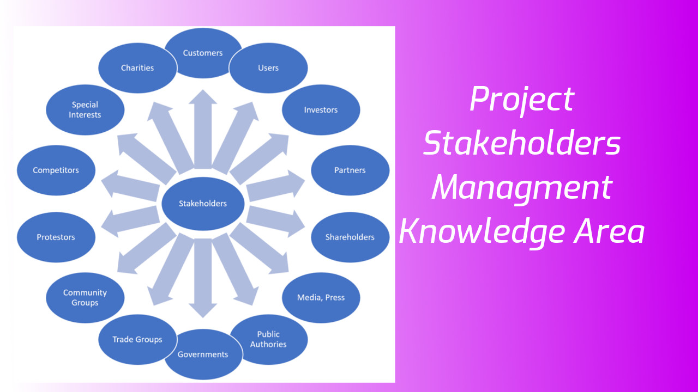{ width="200" }

    ### [Project Stakeholder Management](project-stakeholder-management)
    
    **Read time:** 5 min
    
    EXCERPT Not Found
- { width="200" }

    ### [Sequence Activities](sequence-activities)
    
    **Read time:** 5 min
    
    EXCERPT Not Found
    

- { width="200" }

    ### [Tools of Global Executives](tools-of-global-executives)
    
    **Read time:** 5 min
    
    EXCERPT Not Found
- { width="200" }

    ### [Validate Scope](validate-scope)
    
    **Read time:** 5 min
    
    EXCERPT Not Found
    

- { width="200" }

    ### [Variance Analysis](variance-analysis)
    
    **Read time:** 5 min
    
    EXCERPT Not Found
- { width="200" }

    ### [Work Performance Data](work-performance-data)
    
    **Read time:** 5 min
    
    EXCERPT Not Found
    

- { width="200" }

    ### [Work Performance Information](work-performance-information)
    
    **Read time:** 5 min
    
    EXCERPT Not Found

