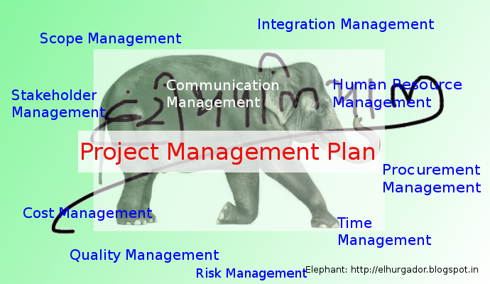
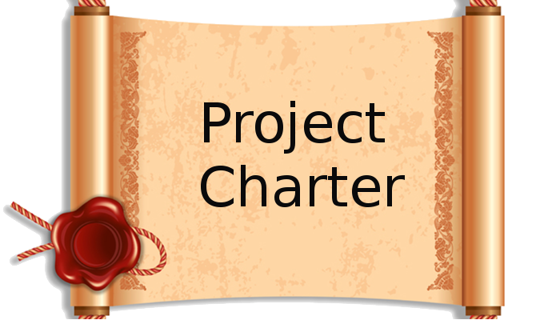

# Welcome to my PMBOK6 Hindi Summary Blog

- { width="200" }

    ### [हितधारक सहभागिता नियोजन](plan-stakeholder-engagement-hi.md)
    
    **Read time:** 5 min
    
    EXCERPT Not Found

- { width="200" }

    ### [Plan Risk Responses - Hindi](plan-risk-responses-hi.md)
    
    **Read time:** 5 min
    
    EXCERPT Not Found
    

- { width="200" }

    ### [जोखिम प्रबंध नियोजन](plan-risk-management-hi.md)
    
    **Read time:** 5 min
    
    EXCERPT Not Found

- { width="200" }

    ### [संसाधन प्रबंध नियोजन](plan-resource-management-hi.md)
    
    **Read time:** 5 min
    
    EXCERPT Not Found
    

- { width="200" }

    ### [आपूर्ति प्रबंध नियोजन](plan-procurement-management-hi.md)
    
    **Read time:** 5 min
    
    EXCERPT Not Found

- { width="200" }

    ### [लागत प्रबंध नियोजन](plan-cost-management-hi.md)
    
    **Read time:** 5 min
    
    EXCERPT Not Found
    

- { width="200" }

    ### [संचार प्रबंध नियोजन](plan-communications-management-hi.md)
    
    **Read time:** 5 min
    
    EXCERPT Not Found

- { width="200" }

    ### [मात्रात्मक जोखिम विश्लेषण](perform-quantitative-risk-analysis-hi.md)
    
    **Read time:** 5 min
    
    EXCERPT Not Found
    

- { width="200" }

    ### [गुणवत्तात्मक जोखिम विश्लेषण](perform-qualitative-risk-analysis-hi.md)
    
    **Read time:** 5 min
    
    EXCERPT Not Found

- { width="200" }

    ### [हितधारक सहभागिता निगरानी](monitor-stakeholder-engagement-hi.md)
    
    **Read time:** 5 min
    
    EXCERPT Not Found
    

- { width="200" }

    ### [जोखिम निगरानी](monitor-risks-hi.md)
    
    **Read time:** 5 min
    
    EXCERPT Not Found

- { width="200" }

    ### [संचार निगरानी](monitor-communications-hi.md)
    
    **Read time:** 5 min
    
    EXCERPT Not Found
    

- { width="200" }

    ### [दल प्रबंधन](manage-team-hi.md)
    
    **Read time:** 5 min
    
    EXCERPT Not Found

- { width="200" }

    ### [हितधारक सहभागिता प्रबंधन](manage-stakeholder-engagement-hi.md)
    
    **Read time:** 5 min
    
    EXCERPT Not Found
    

- { width="200" }

    ### [संचार प्रबंधन](manage-communications-hi.md)
    
    **Read time:** 5 min
    
    EXCERPT Not Found

- { width="200" }

    ### [जोखिम प्रत्युत्तर क्रियान्वयन](implement-risk-responses-hi.md)
    
    **Read time:** 5 min
    
    EXCERPT Not Found
    

- { width="200" }

    ### [हितधारकों की पहचान](identify-stakeholders-hi.md)
    
    **Read time:** 5 min
    
    EXCERPT Not Found

- { width="200" }

    ### [जोखिमों की पहचान](identify-risks-hi.md)
    
    **Read time:** 5 min
    
    EXCERPT Not Found
    

- { width="200" }

    ### [लागत आकलन](estimate-costs-hi.md)
    
    **Read time:** 5 min
    
    EXCERPT Not Found

- { width="200" }

    ### [गतिविधि संसाधन आकलन](estimate-activity-resources-hi.md)
    
    **Read time:** 5 min
    
    EXCERPT Not Found
    

- { width="200" }

    ### [दल विकास](develop-team-hi.md)
    
    **Read time:** 5 min
    
    EXCERPT Not Found

- { width="200" }

    ### [बजट निर्धारण](determine-budget-hi.md)
    
    **Read time:** 5 min
    
    EXCERPT Not Found
    

- { width="200" }

    ### [संसाधन नियंत्रण](control-resources-hi.md)
    
    **Read time:** 5 min
    
    EXCERPT Not Found

- { width="200" }

    ### [आपूर्ति नियंत्रण](control-procurements-hi.md)
    
    **Read time:** 5 min
    
    EXCERPT Not Found
    

- { width="200" }

    ### [लागत नियंत्रण](control-costs-hi.md)
    
    **Read time:** 5 min
    
    EXCERPT Not Found

- { width="200" }

    ### [आपूर्ति संचालन](conduct-procurements-hi.md)
    
    **Read time:** 5 min
    
    EXCERPT Not Found
    

- { width="200" }

    ### [संसाधन अधिग्रहण](acquire-resources-hi.md)
    
    **Read time:** 5 min
    
    EXCERPT Not Found

- { width="200" }

    ### [कार्यक्षेत्र अभिपुष्टि](validate-scope-hi.md)
    
    **Read time:** 5 min
    
    EXCERPT Not Found
    

- { width="200" }

    ### [गतिविधि अनुक्रमण](sequence-activities-hi.md)
    
    **Read time:** 5 min
    
    EXCERPT Not Found

- { width="200" }

    ### [कार्यक्षेत्र प्रबंध नियोजन](plan-scope-management-hi.md)
    
    **Read time:** 5 min
    
    EXCERPT Not Found
    

- { width="200" }

    ### [शेड्यूल प्रबंध नियोजन](plan-schedule-management-hi.md)
    
    **Read time:** 5 min
    
    EXCERPT Not Found

- { width="200" }

    ### [गुणवत्ता प्रबंध नियोजन](plan-quality-management-hi.md)
    
    **Read time:** 5 min
    
    EXCERPT Not Found
    

- { width="200" }

    ### [परिवर्तनों का एकीकृत नियंत्रण](perform-integrated-change-control-hi.md)
    
    **Read time:** 5 min
    
    EXCERPT Not Found

- { width="200" }

    ### [परियोजना कार्य की निगरानी एवं नियंत्रण](monitor-and-control-project-work-hi.md)
    
    **Read time:** 5 min
    
    EXCERPT Not Found
    

- { width="200" }

    ### [गुणवत्ता प्रबंधन](manage-quality-hi.md)
    
    **Read time:** 5 min
    
    EXCERPT Not Found

- { width="200" }

    ### [परियोजना ज्ञान प्रबंधन](manage-project-knowledge-hi.md)
    
    **Read time:** 5 min
    
    EXCERPT Not Found
    

- { width="200" }

    ### [गतिविधि अवधि आकलन](estimate-activity-durations-hi.md)
    
    **Read time:** 5 min
    
    EXCERPT Not Found

- { width="200" }

    ### [परियोजना कार्य का निर्देशन एवं प्रबंधन](direct-and-manage-project-work-hi.md)
    
    **Read time:** 5 min
    
    EXCERPT Not Found
    

- { width="200" }

    ### [शेड्यूल विकास](develop-schedule-hi.md)
    
    **Read time:** 5 min
    
    EXCERPT Not Found

- { width="200" }

    ### [कार्यक्षेत्र निर्धारण](define-scope-hi.md)
    
    **Read time:** 5 min
    
    EXCERPT Not Found
    

- { width="200" }

    ### [गतिविधि निर्धारण](define-activities-hi.md)
    
    **Read time:** 5 min
    
    EXCERPT Not Found

- { width="200" }

    ### [WBS रचना](create-wbs-hi.md)
    
    **Read time:** 5 min
    
    EXCERPT Not Found
    

- { width="200" }

    ### [कार्यक्षेत्र नियंत्रण](control-scope-hi.md)
    
    **Read time:** 5 min
    
    EXCERPT Not Found

- { width="200" }

    ### [शेड्यूल नियंत्रण](control-schedule-hi.md)
    
    **Read time:** 5 min
    
    EXCERPT Not Found
    

- { width="200" }

    ### [गुणवत्ता नियंत्रण](control-quality-hi.md)
    
    **Read time:** 5 min
    
    EXCERPT Not Found

- { width="200" }

    ### [आवश्यकताएं एकत्रीकरण](collect-requirements-hi.md)
    
    **Read time:** 5 min
    
    EXCERPT Not Found
    

- { width="200" }

    ### [परियोजना या चरण का समापन](close-project-or-phase-hi.md)
    
    **Read time:** 5 min
    
    EXCERPT Not Found

- { width="200" }

    ### [परियोजना प्रबंध योजना विकास](develop-project-management-plan-hi.md)
    
    **Read time:** 5 min
    
    EXCERPT Not Found
    

- { width="200" }

    ### [परियोजना अधिकारपत्र विकास](develop-project-charter-hi.md)
    
    **Read time:** 5 min
    
    EXCERPT Not Found

