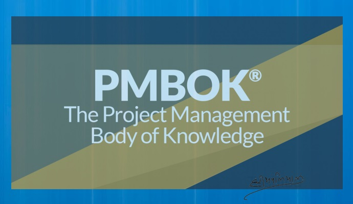

# Welcome to my PMBOK6 Hindi Summary Blog

- { width="200" }

    ### [हितधारक सहभागिता नियोजन](plan-stakeholder-engagement-hi.md)
    
    **Read time:** 5 min
    
    EXCERPT Not Found

- { width="200" }

    ### [Plan Risk Responses - Hindi](plan-risk-responses-hi.md)
    
    **Read time:** 5 min
    
    EXCERPT Not Found
    

- { width="200" }

    ### [जोखिम प्रबंध नियोजन](plan-risk-management-hi.md)
    
    **Read time:** 5 min
    
    EXCERPT Not Found

- { width="200" }

    ### [संसाधन प्रबंध नियोजन](plan-resource-management-hi.md)
    
    **Read time:** 5 min
    
    EXCERPT Not Found
    

- { width="200" }

    ### [आपूर्ति प्रबंध नियोजन](plan-procurement-management-hi.md)
    
    **Read time:** 5 min
    
    EXCERPT Not Found

- { width="200" }

    ### [लागत प्रबंध नियोजन](plan-cost-management-hi.md)
    
    **Read time:** 5 min
    
    EXCERPT Not Found
    

- { width="200" }

    ### [संचार प्रबंध नियोजन](plan-communications-management-hi.md)
    
    **Read time:** 5 min
    
    EXCERPT Not Found

- { width="200" }

    ### [मात्रात्मक जोखिम विश्लेषण](perform-quantitative-risk-analysis-hi.md)
    
    **Read time:** 5 min
    
    EXCERPT Not Found
    

- { width="200" }

    ### [गुणवत्तात्मक जोखिम विश्लेषण](perform-qualitative-risk-analysis-hi.md)
    
    **Read time:** 5 min
    
    EXCERPT Not Found

- { width="200" }

    ### [हितधारक सहभागिता निगरानी](monitor-stakeholder-engagement-hi.md)
    
    **Read time:** 5 min
    
    EXCERPT Not Found
    

- { width="200" }

    ### [जोखिम निगरानी](monitor-risks-hi.md)
    
    **Read time:** 5 min
    
    EXCERPT Not Found

- { width="200" }

    ### [संचार निगरानी](monitor-communications-hi.md)
    
    **Read time:** 5 min
    
    EXCERPT Not Found
    

