# Welcome to Samskrut Yatra Blog

## My Journey in Samskrut - [Samskrut Yatra](/samskrutyatra-home) and introduction to this dimensions of life.

- { width="200" }

    ### [Guyagita - गुहगीता](guha-geeta.md)
    
    **Read time:** 48 min
    
    EXCERPT Not Found

- 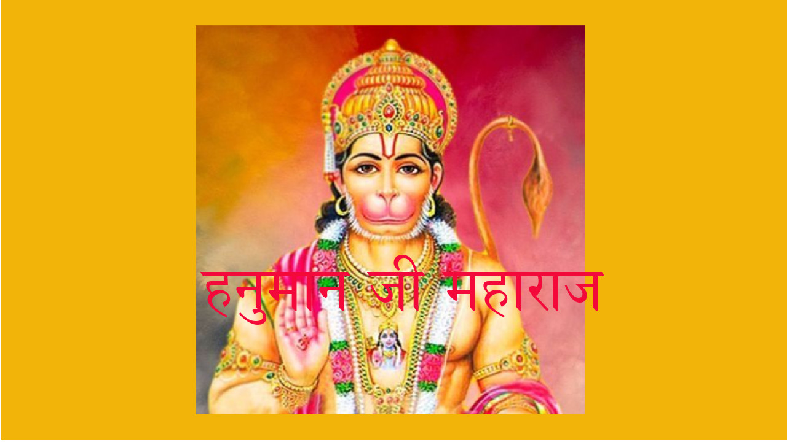{ width="200" }

    ### [Hanuman Sahsranamavali - हनुमान सहस्त्रनामावली](shri-hanuman-sahasranamam.md)
    
    **Read time:** 66 min
    
    EXCERPT Not Found
    

- { width="200" }

    ### [Vijnana Bhairava Tantra Sutras - विज्ञान भैरव तंत्र के सूत्र](vigyan-bhairav-tantra.md)
    
    **Read time:** 90 min
    
    EXCERPT Not Found

- { width="200" }

    ### [Lalitasahasranamam with Meaning - ललितासहस्रनामं](lalitasaharanam-with-meaning.md)
    
    **Read time:** 74 min
    
    Meaning of lalitasahasranama in English
    

- 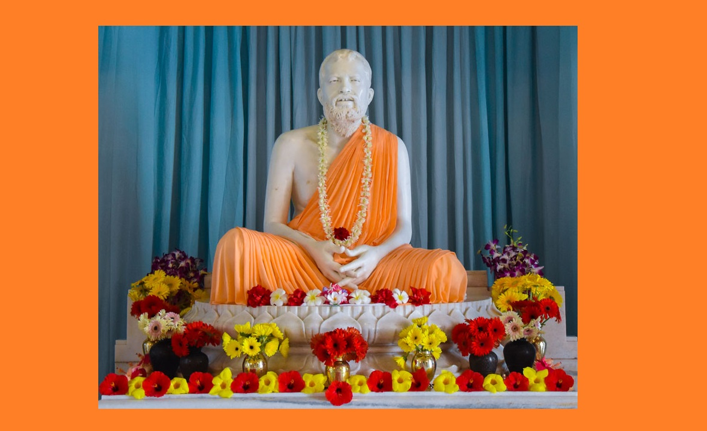{ width="200" }

    ### [Song of Sanyasi - सन्यासी का गीत (संस्कृतं)](song-of-sanyasi-sanskrit.md)
    
    **Read time:** 7 min
    
    EXCERPT Not Found

- { width="200" }

    ### [Bhajan without Text](bhajan-without-text.md)
    
    **Read time:** 5 min
    
    EXCERPT Not Found
    

- 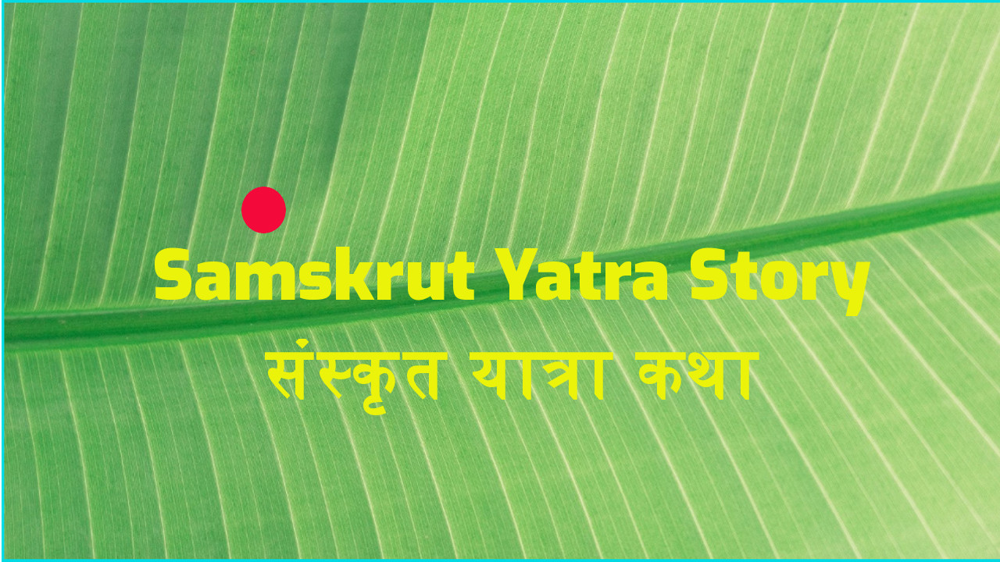{ width="200" }

    ### [चाणक्य जीवनस्य (लघुकथा:)](chanakya-jivanasya-katha.md)
    
    **Read time:** 5 min
    
    EXCERPT Not Found

- { width="200" }

    ### [संस्कृत प्रश्नोत्तर भाग-1](sanskrit-question-answers.md)
    
    **Read time:** 5 min
    
    EXCERPT Not Found
    

- { width="200" }

    ### [कर्मकर्याः दण्डं (लघुकथा:)](punishment-of-enjoyment.md)
    
    **Read time:** 5 min
    
    EXCERPT Not Found

- { width="200" }

    ### [मदनमोहन मालवीय: (लघुकथा:)](madanmohal-malviya-sanskrit-katha.md)
    
    **Read time:** 5 min
    
    EXCERPT Not Found
    

- { width="200" }

    ### [गमानुगतः लोकव्यवहारः (लघुकथा:)](gamanugat-lokvyavhar.md)
    
    **Read time:** 5 min
    
    EXCERPT Not Found

- { width="200" }

    ### [Work of Rajiv Dixit](work-of-rajiv-dixit.md)
    
    **Read time:** 8 min
    
    EXCERPT Not Found
    

- { width="200" }

    ### [सनातन संस्कृति एवं षडयंत्र](hindu-festivals-and-conspiracy.md)
    
    **Read time:** 5 min
    
    EXCERPT Not Found

- { width="200" }

    ### [Gayatri Sahasranama - श्री गायत्री सहस्रनामस्तोत्रं](gayatri-sahasranama.md)
    
    **Read time:** 26 min
    
    EXCERPT Not Found
    

- { width="200" }

    ### [लघुकथा: सेतुः निर्माणं](building-a-bridge.md)
    
    **Read time:** 5 min
    
    EXCERPT Not Found

- 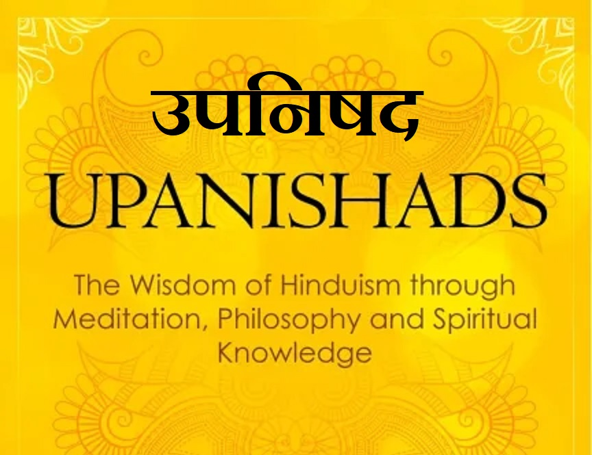{ width="200" }

    ### [Upnishadic Prarthana - उपनिषदिय प्रार्थना](upnishadic-prarthana.md)
    
    **Read time:** 5 min
    
    Various Prarthans inspired from Upanishdic Thoughts
    

- { width="200" }

    ### [Sundarkand Dhyanam - सुन्दरकांड ध्यान श्लोकं](sundarkand-dhyanam.md)
    
    **Read time:** 60 min
    
    EXCERPT Not Found

- { width="200" }

    ### [NamamishMisan - नमामीशमीसान निर्वाणरूपं](namamishmishan-nirvan-roopam.md)
    
    **Read time:** 5 min
    
    नमामीशमीशान निर्वाणरूपं। विभुं व्यापकं ब्रह्मवेदस्वरूपम्।।निजं निर्गुणं निर्विकल्पं निरीहं। चिदाकाशमाकाशवासं भजेऽहं।।
    

- 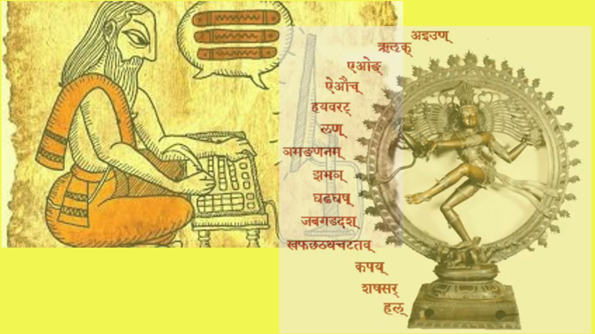{ width="200" }

    ### [Maheshwara Sutrani - माहेश्वर सूत्र](maheshwara-sutrani.md)
    
    **Read time:** 5 min
    
    EXCERPT Not Found

- { width="200" }

    ### [Hanuman Ashtakam - संकटमोचन हनुमानाष्टकम्](hanuman-ashtakam.md)
    
    **Read time:** 5 min
    
    EXCERPT Not Found
    

- { width="200" }

    ### [Bajarang Baan  - बजरंग बाण](bajarang-baan.md)
    
    **Read time:** 5 min
    
    बाल समय रवि भक्ष लियो तब तीनहुं लोक भयो अंधियारो।    ताहि सों त्रास भयो जग को यह संकट काहु सों जात न टारो॥ 

- { width="200" }

    ### [Namaste Sada Vatsale - नमस्ते सदा वत्सले](namaste-sada-vatsale.md)
    
    **Read time:** 5 min
    
    EXCERPT Not Found
    

- { width="200" }

    ### [Devi SidhaKunjiKa Stotram - सिद्धकुञ्जिकास्तोत्रम्](devi-sidhakunjika-stotram.md)
    
    **Read time:** 5 min
    
    EXCERPT Not Found

- { width="200" }

    ### [Durga DwaTrimShan NamaMaalaa - अथ दुर्गाद्वात्रिंशन्नाममाला](durga-dwatrimshan-namamaalaa.md)
    
    **Read time:** 5 min
    
    EXCERPT Not Found
    

- { width="200" }

    ### [Shri Durga Manas Puja - श्रीदुर्गामानस-पूजा](shri-durga-manas-puja.md)
    
    **Read time:** 6 min
    
    EXCERPT Not Found

- { width="200" }

    ### [Devi Vaikrutikam Rahashyam - वैकृतिकं रहस्यम्](devi-vaikrutikam-rahashy.md)
    
    **Read time:** 6 min
    
    EXCERPT Not Found
    

- { width="200" }

    ### [Devi Murti Rahasyam - मूर्तिरहस्यम्](devi-murti-rahasyam.md)
    
    **Read time:** 5 min
    
    EXCERPT Not Found

- { width="200" }

    ### [Devi Prahanikam Rahasyam - प्राधानिकं रहस्यम्](devi-praahanikam-rahasyam.md)
    
    **Read time:** 5 min
    
    EXCERPT Not Found
    

- { width="200" }

    ### [Durga Saptashati Chapter 13 - श्रीदुर्गासप्तशती - त्रयोदशोऽध्यायः](durga-saptashati-chapter13.md)
    
    **Read time:** 5 min
    
    EXCERPT Not Found

- { width="200" }

    ### [Durga Saptashati Chapter 12 - श्रीदुर्गासप्तशती - द्वादशोऽध्यायः](durga-saptashati-chapter12.md)
    
    **Read time:** 7 min
    
    EXCERPT Not Found
    

- { width="200" }

    ### [Durga Saptashati Chapter 11 - श्रीदुर्गासप्तशती -एकादशोऽध्यायः](durga-saptashati-chapter11.md)
    
    **Read time:** 9 min
    
    EXCERPT Not Found

- { width="200" }

    ### [Durga Saptashati Chapter 10 - श्रीदुर्गासप्तशती दशमोऽध्यायः शुम्भ वध](durga-saptashati-chapter10.md)
    
    **Read time:** 5 min
    
    EXCERPT Not Found
    

- { width="200" }

    ### [Durga Saptashati Chapter 9 - श्रीदुर्गासप्तशती - नवमोऽध्यायः](durga-saptashati-chapter9.md)
    
    **Read time:** 7 min
    
    EXCERPT Not Found

- { width="200" }

    ### [Durga Saptashati Chapter 8 - श्रीदुर्गासप्तशती - अष्टमोऽध्यायः](durga-saptashati-chapter8.md)
    
    **Read time:** 10 min
    
    EXCERPT Not Found
    

- { width="200" }

    ### [Durga Saptashati Chapter 7 - श्रीदुर्गासप्तशती - सप्तमोऽध्यायः](durga-saptashati-chapter7.md)
    
    **Read time:** 5 min
    
    EXCERPT Not Found

- { width="200" }

    ### [Durga Saptashati Chapter 6 - श्रीदुर्गासप्तशती - षष्ठोऽध्यायः](durga-saptashati-chapter6.md)
    
    **Read time:** 5 min
    
    EXCERPT Not Found
    

- { width="200" }

    ### [Durga Saptashati Chapter 5 - श्रीदुर्गासप्तशती - पञ्चमोऽध्यायः](durga-saptashati-chapter5.md)
    
    **Read time:** 14 min
    
    EXCERPT Not Found

- { width="200" }

    ### [Durga Saptashati Chapter 4 - श्रीदुर्गासप्तशती - चतुर्थोऽध्यायः](durga-saptashati-chapter4.md)
    
    **Read time:** 9 min
    
    EXCERPT Not Found
    

- { width="200" }

    ### [Durga Saptashati Chapter 3 - श्रीदुर्गासप्तशती - तृतीयोऽध्यायः](durga-saptashati-chapter3.md)
    
    **Read time:** 7 min
    
    EXCERPT Not Found

- { width="200" }

    ### [Durga Saptashati Chapter 2 - श्रीदुर्गासप्तशती - द्वितीयोऽध्यायः](durga-saptashati-chapter2.md)
    
    **Read time:** 12 min
    
    EXCERPT Not Found
    

- { width="200" }

    ### [Durga Saptashati Chapter 1 - श्रीदुर्गासप्तशती - प्रथमोऽध्यायः](durga-saptashati-chapter1.md)
    
    **Read time:** 14 min
    
    EXCERPT Not Found

- { width="200" }

    ### [Song of Sanyasi  - सन्यासी का गीत](song-of-sanyasi.md)
    
    **Read time:** 10 min
    
    EXCERPT Not Found
    

- 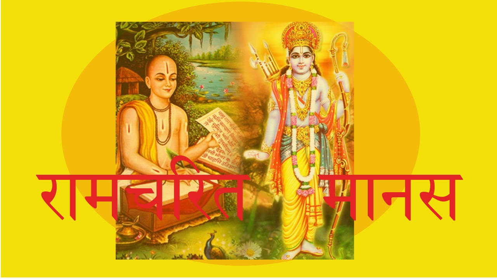{ width="200" }

    ### [Jai Sagun Nirgun Roop  - जय सगुन निर्गुन रूप](jai-sagun-nirgun-roop.md)
    
    **Read time:** 5 min
    
    EXCERPT Not Found

- { width="200" }

    ### [Shvetashvatara Upanishad - श्वेताश्वतरोपनिषत्](shvetashvatara-upanishad.md)
    
    **Read time:** 24 min
    
    EXCERPT Not Found
    

- { width="200" }

    ### [Mundakoupnishad  - मुण्डकोपनिषत्](mundakoupnishad.md)
    
    **Read time:** 16 min
    
    EXCERPT Not Found

- { width="200" }

    ### [Chandogyopnishad 8 - छान्दोग्योपनिषत् अष्टमोऽध्यायः](chandogyopnishad-8.md)
    
    **Read time:** 23 min
    
    EXCERPT Not Found
    

- { width="200" }

    ### [Chandogyopnishad 7 - छान्दोग्योपनिषत् सप्तमोऽध्यायः](chandogyopnishad-7.md)
    
    **Read time:** 23 min
    
    EXCERPT Not Found

- { width="200" }

    ### [Chandogyopnishad 6 - छान्दोग्योपनिषत् षष्ठोऽध्यायः](chandogyopnishad-6.md)
    
    **Read time:** 19 min
    
    EXCERPT Not Found
    

- { width="200" }

    ### [Chandogyopnishad 5 - छान्दोग्योपनिषत् पञ्चमोऽध्यायः](chandogyopnishad-5.md)
    
    **Read time:** 26 min
    
    EXCERPT Not Found

- { width="200" }

    ### [Chandogyopnishad 4 - छान्दोग्योपनिषत् चतुर्थोऽध्यायः](chandogyopnishad-4.md)
    
    **Read time:** 22 min
    
    EXCERPT Not Found
    

- { width="200" }

    ### [Chandogyopnishad 3 - छान्दोग्योपनिषत् तृतीयोऽध्यायः](chandogyopnishad-3.md)
    
    **Read time:** 22 min
    
    EXCERPT Not Found

- { width="200" }

    ### [Chandogyopnishad 2 - छान्दोग्योपनिषत् द्वितीयोऽध्यायः](chandogyopnishad-2.md)
    
    **Read time:** 20 min
    
    EXCERPT Not Found
    

- { width="200" }

    ### [Chandogyopnishad 1 - छान्दोग्योपनिषत्](chandogyopnishad-1.md)
    
    **Read time:** 25 min
    
    EXCERPT Not Found

- { width="200" }

    ### [Mandukyopnishad  - माण्डूक्योपनिषत्](mandukyopnishad.md)
    
    **Read time:** 5 min
    
    ओमित्येतदक्षरमिदग्ं सर्वं तस्योपव्याख्यानं भूतं भवद्भविष्यदिति सर्वमोङ्कार एव।  यच्चान्यत् त्रिकालातीतं तदप्योङ्कार एव ॥१॥ 
    

- { width="200" }

    ### [Jai Raama Sobha Dham - जय राम सोभा धाम](jai-raama-sobha-dham.md)
    
    **Read time:** 5 min
    
    जय राम सोभा धाम। दायक प्रनत बिश्राम॥   धृत त्रोन बर सर चाप। भुजदंड प्रबल प्रताप॥

- { width="200" }

    ### [Jai Raama Sada Sada Sukhdham Hare - जय राम सदा सुखधाम](jai-raama-sada-sada-sukhdham-hare.md)
    
    **Read time:** 5 min
    
    जय राम सदा सुखधाम हरे। रघुनायक सायक चाप धरे।।   भव बारन दारन सिंह प्रभो। गुन सागर नागर नाथ बिभो।।
    

- { width="200" }

    ### [Rudraghan Paath - रुद्रघन पाठ](rudraghan-paath.md)
    
    **Read time:** 5 min
    
    I am not able to find even basic text for RudraGhana Patha so putting this image from my Mantra Pushpam book. I hope you will enjoy this. This is very

- { width="200" }

    ### [IshaaVashyopnishad  - ईशावास्योपषत्](ishaavashyopnishad.md)
    
    **Read time:** 5 min
    
    ॐ ईशा वास्यमिदꣳ सर्वं यत्किञ्च जगत्यां जगत् ।    तेन त्यक्तेन भुञ्जीथा मा गृधः कस्यस्विद्धनम् ॥
    

- 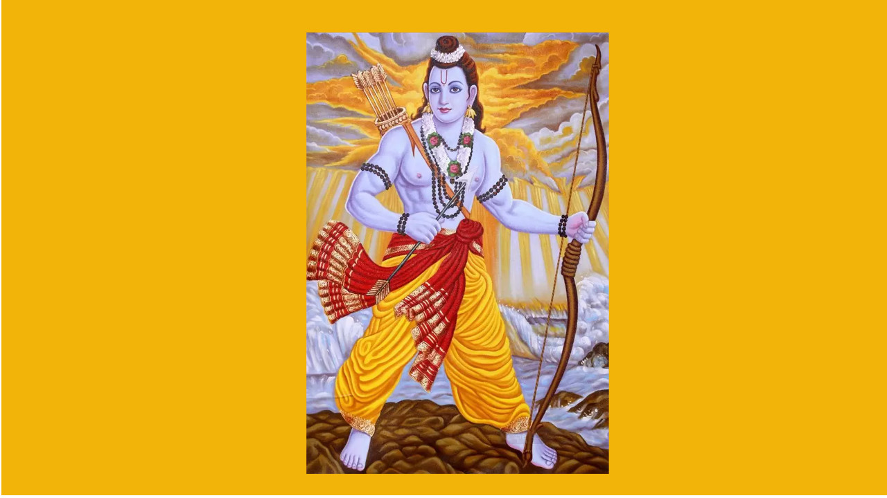{ width="200" }

    ### [Naam Ramayan  - नाम रामायण](naam-ramayan.md)
    
    **Read time:** 6 min
    
    EXCERPT Not Found

- { width="200" }

    ### [Gunasagar Nirguna Paramesha - गुणसागर निर्गुण परमेशा](gunasagar-nirguna.md)
    
    **Read time:** 5 min
    
    EXCERPT Not Found
    

- { width="200" }

    ### [Shrisuktam - श्रीसूक्तम्](shrisuktam.md)
    
    **Read time:** 5 min
    
    EXCERPT Not Found

- 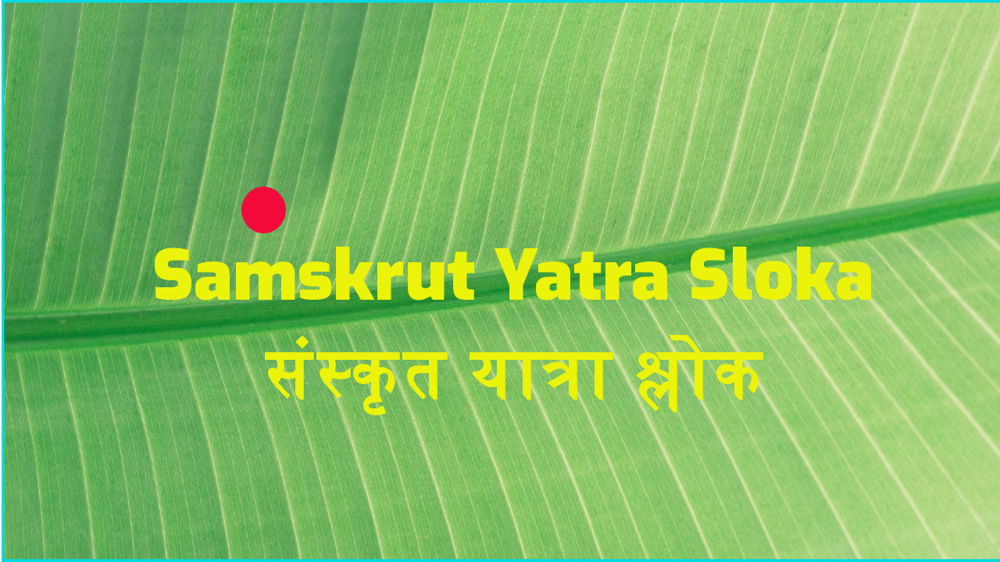{ width="200" }

    ### [Navgruhsuktam - नवग्रहसूक्तम्](navgruhsuktam.md)
    
    **Read time:** 7 min
    
    EXCERPT Not Found
    

- { width="200" }

    ### [Narayanopnishad - नारायणोपनिषत्](narayanopnishad.md)
    
    **Read time:** 5 min
    
    EXCERPT Not Found

- 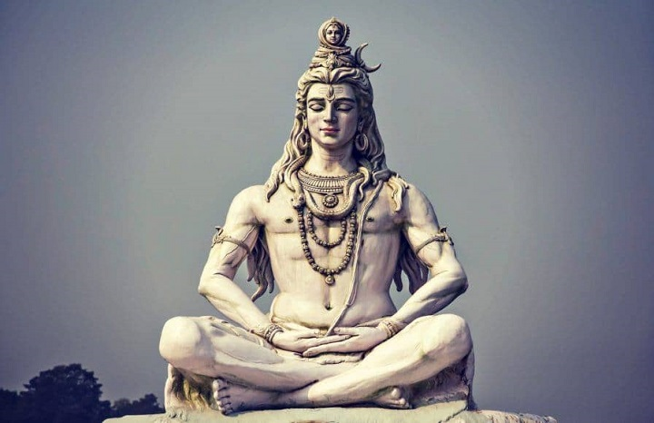{ width="200" }

    ### [शिव जयजयकार स्तोत्रं - शिव जयजयकार स्तोत्रं](shiv-jai-jai-kaar.md)
    
    **Read time:** 5 min
    
    EXCERPT Not Found
    

- { width="200" }

    ### [Shankarya Mangalam - शंकराय मंगलं](shankarya-mangalam.md)
    
    **Read time:** 5 min
    
    शंकराय शंकराय शंकराय मंगलम ।     शंकरा मनोहराय शाश्वताय मंगलम् ॥     सुंदरेश मंगलं सनातनाय मंगलम्।     चिन्मयाय सन्मयाय तन्मयाय मंगलम् ॥

- { width="200" }

    ### [Ramchandra Stuti  - श्री राम स्तुति:](ramchandra-stuti.md)
    
    **Read time:** 5 min
    
    नमामि भक्त वत्सलं । कृपालु शील कोमलं ॥  भजामि ते पदांबुजं । अकामिनां स्वधामदं ॥ 
    

- { width="200" }

    ### [Ramchandra Stavan - रामचन्द्र स्तवन](ramchandra-stavan.md)
    
    **Read time:** 5 min
    
    श्रीरामचंद्र कृपालु भजमन हरण भाव भय दारुणम् ।  नवकंज लोचन, कंज मुख, कर कंज, पद कन्जारुणम ॥

- { width="200" }

    ### [Parsat Pad Paavan - परसत पद पावन](parsat-pad-paavan.md)
    
    **Read time:** 5 min
    
    परसत पद पावन सोक नसावन प्रगट भई तपपुंज सही। देखत रघुनायक जन सुख दायक सनमुख होइ कर जोरि रही
    

- { width="200" }

    ### [Kenopnishad - केनोपनिषत्](kenopnishad.md)
    
    **Read time:** 7 min
    
    EXCERPT Not Found

- { width="200" }

    ### [Jai Raam Rama Ramanam Samanam - जय राम रमा रमनं समनं](jai-raam-rama-ramanam-samanam.md)
    
    **Read time:** 5 min
    
    जय राम रमा रमनं समनं । भव ताप भयाकुल पाहि जनम ॥  अवधेस सुरेस रमेस बिभो । सरनागत मागत पाहि प्रभो ॥
    

- { width="200" }

    ### [Jai Jai Surnayak - जय जय सुरनायक](jai-jai-surnayak.md)
    
    **Read time:** 5 min
    
    जय जय सुरनायक जन सुखदायक प्रनतपाल भगवंता।  गो द्विज हितकारी जय असुरारी सिधुंसुता प्रिय कंता।।

- { width="200" }

    ### [Durgati Naashini Durge - दुर्गतिनाशिनी दुर्गे](durgatinaashinidurge.md)
    
    **Read time:** 5 min
    
    EXCERPT Not Found
    

- { width="200" }

    ### [Rigvediya DeviSuktam - देवीसूक्तम्](devi-suktam-saswara.md)
    
    **Read time:** 5 min
    
    EXCERPT Not Found

- 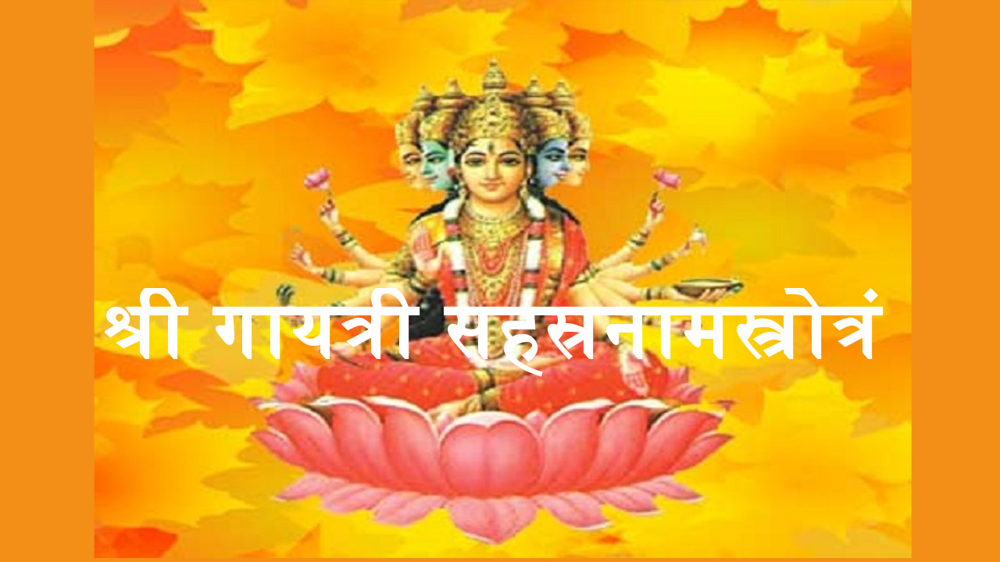{ width="200" }

    ### [AdityaHrudyam Stotram - आदित्यहृदयम् स्त्रोत्रं](aditya-hridayam-stotram.md)
    
    **Read time:** 5 min
    
    ततो युद्धपरिश्रान्तं समरे चिन्तया स्थितम्।   रावणं चाग्रतो दृष्ट्वा युद्धाय समुपस्थितम्॥
    

- { width="200" }

    ### [Sankat Mochan HanumanAshtakam  - संकटमोचन हनुमानाष्टक](sankat-mochan-hanumanasht.md)
    
    **Read time:** 5 min
    
    EXCERPT Not Found

- 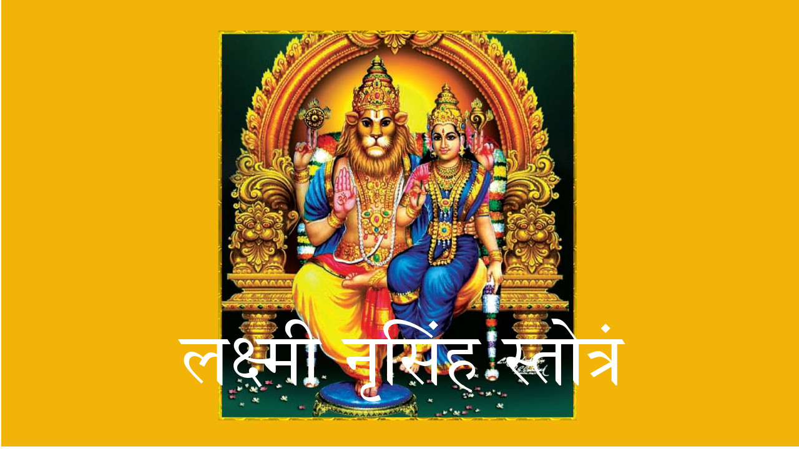{ width="200" }

    ### [Lakshmi Nrusimha Karavalamba Stotram - लक्ष्मीनृसिंह करावलम्ब स्तोत्र](lakshmi-nrusimha-karavalamba-stotram.md)
    
    **Read time:** 5 min
    
    श्रीमत्पयोनिधिनिकेतन चक्रपाणे भोगीन्द्रभोगमणिराजित पुण्यमूर्ते |    योगीश शाश्वत शरण्य भवाब्धिपोत लक्ष्मीनृसिंह मम देहि करावलम्बम् ||
    

- 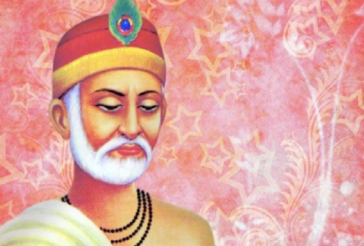{ width="200" }

    ### [Kabirdaas Dohe - कबीरदास दोहे](kabirdaas-dohe.md)
    
    **Read time:** 19 min
    
    EXCERPT Not Found

- { width="200" }

    ### [Hanuman Chalisa - हनुमान चालीसा](hanuman-chalisa.md)
    
    **Read time:** 5 min
    
    श्रीगुरु चरन सरोज रज, निज मनु मुकुरु सुधारि।    बरनऊं रघुबर बिमल जसु, जो दायकु फल चारि।।    बुद्धिहीन तनु जानिके, सुमिरौं पवन-कुमार।    बल बुद्धि बिद्
    

- { width="200" }

    ### [Guru Stotram  - गुरु स्तोत्रम्](guru-stotram.md)
    
    **Read time:** 5 min
    
    गुरुर्ब्रह्मा गुरुर्विष्णुर्गुरुर्देवो महेश्वरः ।   गुरुरेव परं ब्रह्म तस्मै श्रीगुरवे नमः ॥

- { width="200" }

    ### [Devi Kshama Prarthana - क्षमा-प्रार्थना](devi-kshama-prarthana.md)
    
    **Read time:** 5 min
    
    अपराधसहस्त्राणि क्रियन्तेऽहर्निशं मया।  दासोऽयमिति मां मत्वा क्षमस्व परमेश्‍वरि॥
    

- { width="200" }

    ### [Bhavani Ashtakam - भवान्यष्टकम्](bhavani-ashtakam.md)
    
    **Read time:** 5 min
    
    EXCERPT Not Found

- { width="200" }

    ### [Aitreyopnishad - ऐतरेयोपनिषत्](aitreyopnishad.md)
    
    **Read time:** 11 min
    
    EXCERPT Not Found
    

- 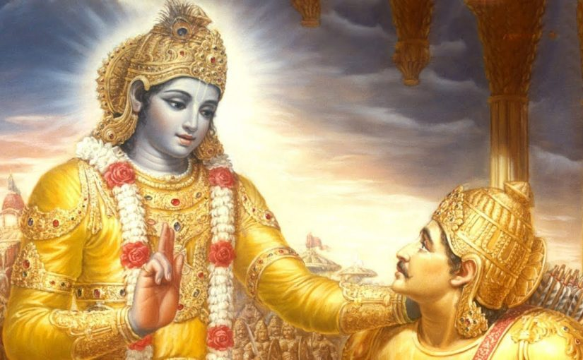{ width="200" }

    ### [Bhagwat Gita Chapter 18 - श्रीमद्भगवद्गीता अथाष्टादशोऽध्यायः - मोक्षसंन्यासयोगः](bhagwat-gita-chapter-18.md)
    
    **Read time:** 14 min
    
    EXCERPT Not Found

- { width="200" }

    ### [Bhagwat Gita Chapter 17 - श्रीमद्भगवद्गीता सप्तदशोऽध्यायः - श्रद्धात्रयविभागयोगः](bhagwat-gita-chapter-17.md)
    
    **Read time:** 5 min
    
    EXCERPT Not Found
    

- { width="200" }

    ### [Bhagwat Gita Chapter 16 - श्रीमद्भगवद्गीता षोडशोऽध्यायः - दैवासुरसम्पद्विभागयोगः](bhagwat-gita-chapter-16.md)
    
    **Read time:** 5 min
    
    EXCERPT Not Found

- { width="200" }

    ### [Bhagwat Gita Chapter 15 - श्रीमद्भगवद्गीता पञ्चदशोऽध्यायः - पुरुषोत्तमयोगः](bhagwat-gita-chapter-15.md)
    
    **Read time:** 5 min
    
    EXCERPT Not Found
    

- { width="200" }

    ### [Bhagwat Gita Chapter 14 - श्रीमद्भगवद्गीता चतुर्दशोऽध्यायः - गुणत्रयविभागयोगः](bhagwat-gita-chapter-14.md)
    
    **Read time:** 5 min
    
    EXCERPT Not Found

- { width="200" }

    ### [Bhagwat Gita Chapter 13 - श्रीमद्भगवद्गीता त्रयोदशोऽध्यायः - क्षेत्रक्षेत्रज्ञविभागयोगः](bhagwat-gita-chapter-13.md)
    
    **Read time:** 6 min
    
    EXCERPT Not Found
    

- { width="200" }

    ### [Bhagwat Gita Chapter 12 - श्रीमद्भगवद्गीता द्वादशोऽध्यायः - भक्तियोगः](bhagwat-gita-chapter-12.md)
    
    **Read time:** 5 min
    
    EXCERPT Not Found

- { width="200" }

    ### [Bhagwat Gita Chapter 11 - श्रीमद्भगवद्गीता एकादशोऽध्यायः - विश्वरूपदर्शनयोगः](bhagwat-gita-chapter-11.md)
    
    **Read time:** 12 min
    
    EXCERPT Not Found
    

- { width="200" }

    ### [Bhagwat Gita Chapter 10 - श्रीमद्भगवद्गीता दशमोऽध्यायः - विभूतियोगः](bhagwat-gita-chapter-10.md)
    
    **Read time:** 7 min
    
    EXCERPT Not Found

- { width="200" }

    ### [Bhagwat Gita Chapter 9 - श्रीमद्भगवद्गीता नवमोऽध्यायः - राजविद्याराजगुह्ययोगः](bhagwat-gita-chapter-9.md)
    
    **Read time:** 6 min
    
    EXCERPT Not Found
    

- { width="200" }

    ### [Bhagwat Gita Chapter 8 - श्रीमद्भगवद्गीता अष्टमोऽध्यायः - अक्षरब्रह्मयोगः](bhagwat-gita-chapter-8.md)
    
    **Read time:** 5 min
    
    EXCERPT Not Found

- { width="200" }

    ### [Bhagwat Gita Chapter 7 - श्रीमद्भगवद्गीता सप्तमोऽध्यायः - ज्ञानविज्ञानयोगः](bhagwat-gita-chapter-7.md)
    
    **Read time:** 5 min
    
    EXCERPT Not Found
    

- { width="200" }

    ### [Bhagwat Gita Chapter 6 - श्रीमद्भगवद्गीता षष्ठोऽध्यायः - ध्यानयोगः](bhagwat-gita-chapter-6.md)
    
    **Read time:** 8 min
    
    EXCERPT Not Found

- { width="200" }

    ### [Bhagwat Gita Chapter 5 - श्रीमद्भगवद्गीता पञ्चमोऽध्यायः - संन्यासयोगः](bhagwat-gita-chapter-5.md)
    
    **Read time:** 5 min
    
    EXCERPT Not Found
    

- { width="200" }

    ### [Bhagwat Gita Chapter 4- श्रीमद्भगवद्गीता चतुर्थोऽध्यायः](bhagwat-gita-chapter-4.md)
    
    **Read time:** 7 min
    
    EXCERPT Not Found

- { width="200" }

    ### [Bhagwat Gita Chapter 3 - श्रीमद्भगवद्गीता तृतीयोऽध्यायः](bhagwat-gita-chapter-3.md)
    
    **Read time:** 8 min
    
    EXCERPT Not Found
    

- { width="200" }

    ### [Bhagwat Gita Chapter 2 - अथ द्वितीयोऽध्यायः - साङ्ख्ययोगः](bhagwat-gita-chapter-2.md)
    
    **Read time:** 13 min
    
    EXCERPT Not Found

- { width="200" }

    ### [Bhagwat Gita Chapter 1 - श्रीमद्भगवद्गीता प्रथमोऽध्यायः](bhagwat-gita-chapter-1.md)
    
    **Read time:** 8 min
    
    EXCERPT Not Found
    

- { width="200" }

    ### [Yaagyavalkyopnishad - याज्ञवल्क्योपनिषत्](yaagyavalkyopnishad.md)
    
    **Read time:** 9 min
    
    EXCERPT Not Found

- 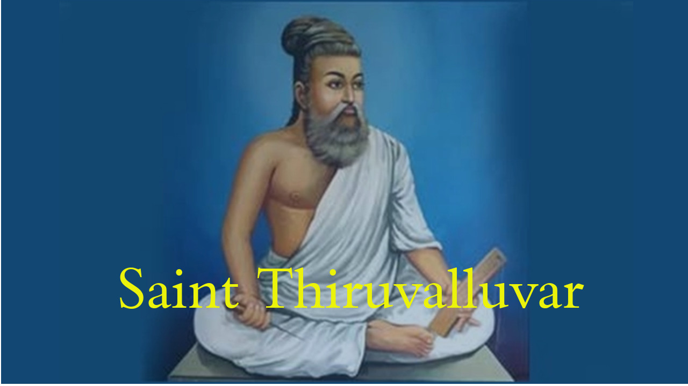{ width="200" }

    ### [Thirukkural Summary in Hindi](thirukkural-summary-in-hindi.md)
    
    **Read time:** 5 min
    
    EXCERPT Not Found
    

- { width="200" }

    ### [Nirvanopnishad  - निर्वाणोपनिषत्](nirvanopnishad.md)
    
    **Read time:** 5 min
    
    EXCERPT Not Found

- { width="200" }

    ### [Lingastakam Stotra - लिंगाष्टकमं स्तोत्र](lingastakam-stotra.md)
    
    **Read time:** 5 min
    
    ब्रह्ममुरारि सुरार्चित लिंगम् निर्मलभासित शोभित लिंगम्।  जन्मज दुःख विनाशक लिंगम् तत् प्रणमामि सदाशिव लिंगम् ॥
    

- { width="200" }

    ### [Kanakdhara Stotram - कनकधारा स्तोत्रं](kanakdhara-stotram.md)
    
    **Read time:** 5 min
    
    EXCERPT Not Found

- { width="200" }

    ### [AmrutBindu Upanishad  - अमृतबिन्दुपनिषत्](amrutbindu-upanishad.md)
    
    **Read time:** 5 min
    
    EXCERPT Not Found
    

- 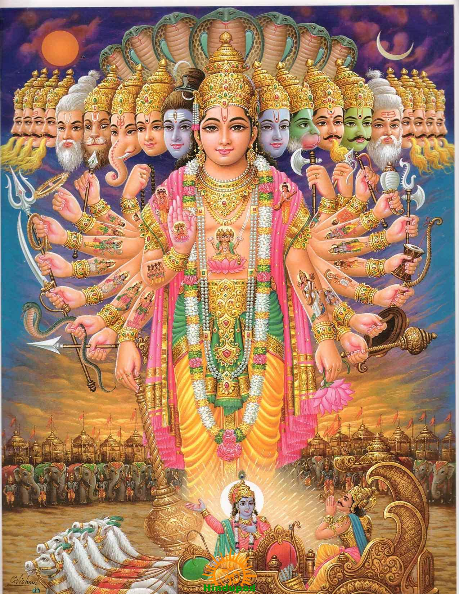{ width="200" }

    ### [Achyutashtakam  - अच्युतस्याष्टकम्](achyutashtakam-acyutam-keshavam-ramanarayanam.md)
    
    **Read time:** 5 min
    
    अच्युतं केशवं रामनारायणं कृष्णदामोदरं वासुदेवं हरिम्।   श्रीधरं माधवं गोपिकावल्लभं जानकीनायकं रामचंद्रं भजे॥

- { width="200" }

    ### [Aatmopnishad - आत्मोपनिषत्](aatmopnishad.md)
    
    **Read time:** 8 min
    
    EXCERPT Not Found
    

- { width="200" }

    ### [Vishnu SahasraNaam - श्रीविष्णुसहस्रनामस्तोत्रम्](vishnu-sahasranaam.md)
    
    **Read time:** 37 min
    
    EXCERPT Not Found

- { width="200" }

    ### [Vipasana Dohe- Dharma  - मन](vipasana-dohe-manas.md)
    
    **Read time:** 11 min
    
    मन ही दुर्जन मन सुजन मन बैरी मन मीत,    मन सुधरे सब सुधरे हैं कर मन पवन पुनीत । 
    

- { width="200" }

    ### [Vipasana Dohe- Dharma - धर्म](vipasana-dohe-dharma.md)
    
    **Read time:** 7 min
    
    जागो लोगों जगत के बीती काली रात,   हुआ उजाला धर्म का मंगल हुआ प्रभात ।

- 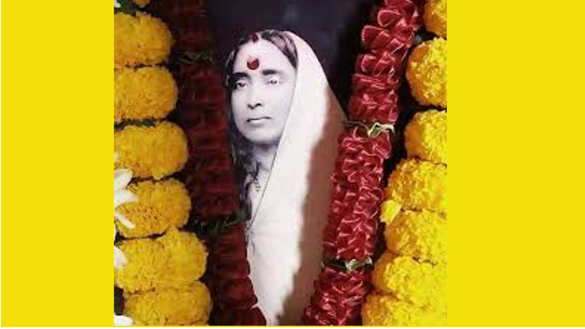{ width="200" }

    ### [Shri Sarada Stava - श्रीसारदास्तवं](shri-sarada-stava.md)
    
    **Read time:** 5 min
    
    प्रकृतिं परमामभयां वरदां नररूपधरां जनतापहराम्।  शरणागतसेवकतोषकरीं प्रणमामि परां जननीं जगताम्॥
    

- { width="200" }

    ### [Shri Shiv Mahimna Stotram - श्रीशिवमहिम्नस्तोत्र](shiv-mahimnstotra.md)
    
    **Read time:** 13 min
    
    ॐ वन्दे देव उमापतिं सुरगुरुं, वन्दे जगत्कारणम् ।      वन्दे पन्नगभूषणं मृगधरं, वन्दे पशूनां पतिम् ॥ 

- { width="200" }

    ### [DurgaSuktam - अथ दुर्गासूक्तम्](durgasuktam.md)
    
    **Read time:** 5 min
    
    ॐ जा॒तवे॑दसे सुनवाम॒ सोम॑ मरातीय॒तो निद॑हाति॒ वेदः॑ ।    स नः॑ पर्ष॒दति॑ दु॒र्गाणि॒ विश्वा॑ ना॒वेव॒ सिन्धुं॑ दुरि॒ताऽत्य॒ग्निः ॥
    

- { width="200" }

    ### [ShrihanumatSuktam - श्रीहनुमत्सूक्तम्](shrihanumatsuktam.md)
    
    **Read time:** 5 min
    
    EXCERPT Not Found

- { width="200" }

    ### [Shiv Tandava Stotram - शिवतांडवस्तोत्रं](shiv-tandava-stotram.md)
    
    **Read time:** 5 min
    
    EXCERPT Not Found
    

- { width="200" }

    ### [TotakaAshtakam - Sankara Deshika Shatakam - तोटकाष्टकं - शंकरदेशिकाष्टकम्](sankara-deshika-shatakam-totakaashtakam.md)
    
    **Read time:** 5 min
    
    विदिताखिलशास्त्रसुधाजलधे महितोपनिषत् कथितार्थनिधे ।  हृदये कलये विमलं चरणं भव शंकर देशिक मे शरणम् ॥

- { width="200" }

    ### [Kaivalopnishad  - कैवल्योपनिषत्](kaivalopnishad.md)
    
    **Read time:** 6 min
    
    ॐ अथाश्वलायनो भगवन्तं परमेष्ठिनमुपसमेत्योवाच ।   अधीहि भगवन्ब्रह्मविद्यां वरिष्ठां सदा सद्भिः सेव्यमानां निगूढाम् ।    यथाऽचिरात्सर्वपापं व्यपोह्य परा
    

- 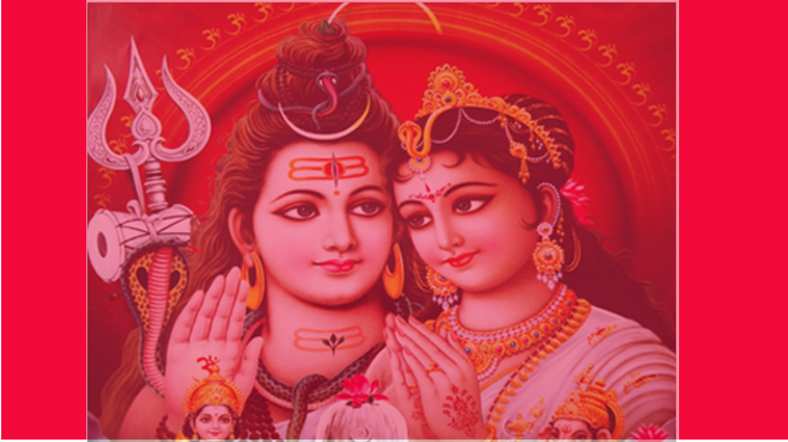{ width="200" }

    ### [Uma Maheshwara Stotram  - उमामहेश्वर स्तोत्रं](uma-maheshwara-stotram.md)
    
    **Read time:** 5 min
    
    नमः शिवाभ्यां नवयौवनाभ्यां परस्पराश्लिष्टवपुर्धराभ्यां | नगेन्द्रकन्यावृषकेतनाभ्यां नमो नमः शङ्करपार्वतीभ्यां ||

- 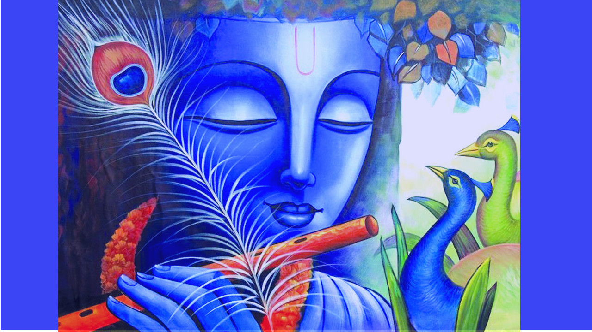{ width="200" }

    ### [Sri Madana Mohana Ashtakam  - श्री मदन मोहन अष्टकम](sri-madana-mohana-ashtakam.md)
    
    **Read time:** 5 min
    
    जय शंखगदाधर नीलकलेवर पीतपटाम्बर देहि पदम् । जय चन्दनचर्चित कुण्डलमण्डित कौस्तुभशोभित देहि पदम् ॥ 
    

- { width="200" }

    ### [Shri Shivpanchaakshari Stotram - श्रीशिवपञ्चाक्षरस्तोत्रम्](shri-shivpanchaakshari-stotram.md)
    
    **Read time:** 5 min
    
    EXCERPT Not Found

- { width="200" }

    ### [Shivmaanaspooja - शिवमानसपूजा](shivmaanaspooja.md)
    
    **Read time:** 5 min
    
    रत्नैः कल्पितमासनं हिमजलैः स्नानं च दिव्याम्बरं    नानारत्नविभूषितं मृगमदामोदाङ्कितं चन्दनम् ।    जातीचम्पकबिल्वपत्ररचितं पुष्पं च धूपं तथा    दीपं दे
    

- { width="200" }

    ### [Shiva Shadakshara Stotram  - शिवषडाक्षर स्तोत्रं](shiva-shadakshara-stotram.md)
    
    **Read time:** 5 min
    
    ॐकारं बिंदुसंयुक्तं नित्यं ध्यायंति योगिनः ।    कामदं मोक्षदं चैव ॐकाराय नमो नमः ॥

- { width="200" }

    ### [Gurvashtaka  - गुर्वष्टकम्](gurvashtaka.md)
    
    **Read time:** 5 min
    
    शरीरं सुरुपं तथा वा कलत्रं यशश्चारू चित्रं धनं मेरुतुल्यम् ।   मनश्चेन्न लग्नं गुरोरंघ्रिपद्मे ततः किं ततः किं ततः किं ततः किम् ।।
    

- { width="200" }

    ### [Daridrya Dahan Shivstotram - दारिद्र्य दहन शिवस्तोत्रम्](daridrya-dahan-shivstotram.md)
    
    **Read time:** 5 min
    
    विश्वेश्वराय नरकार्णवतारणाय कर्णामृताय शशिशेखरभूषणाय ।  कर्पूरकुन्दधवलाय जटाधराय दारिद्र्य दुःखदहनाय नमः शिवाय ॥ 

- { width="200" }

    ### [Bhaj Govindam  - भज गोविन्दं](bhaj-govindam.md)
    
    **Read time:** 7 min
    
    भज गोविन्दं भज गोविन्दं, गोविन्दं भज मूढ़मते। संप्राप्ते सन्निहिते काले, न हि न हि रक्षति डुकृञ् करणे॥१॥
    

- { width="200" }

    ### [VishnuSuktam - विष्णुसूक्तम्](vishnusuktam.md)
    
    **Read time:** 5 min
    
    EXCERPT Not Found

- { width="200" }

    ### [Shri Kaal Bhairav Ashtakam - श्री काल भैरव अष्टकम्‌](shri-kaal-bhairav-ashta.md)
    
    **Read time:** 5 min
    
    EXCERPT Not Found
    

- { width="200" }

    ### [Mangalacharan - मङ्गलाचरणम्](mangalacharan.md)
    
    **Read time:** 5 min
    
    EXCERPT Not Found

- { width="200" }

    ### [Thirukkural in Hindi Chapter 6-10 - तिरुक्कूरळ](thirukkural-in-hindi-chapter-06-10-with-chanting.md)
    
    **Read time:** 8 min
    
    तिरुक्कुरल के तीन भाग हैं- धर्म, अर्थ और काम । उनमें क्र्मशः 38, 70 और 25 अध्याय हैं । हर एक अध्याय में 10 ‘कुरल’ के हिसाब से समूचे ग्रंथ के 133 अध्या
    

- { width="200" }

    ### [Thirukkural Complete in Hindi - तिरुक्कूरळ हिन्दी अनुवाद](thirukkural-complete-in-hindi.md)
    
    **Read time:** 52 min
    
    There are at least 19 translations of the Kural in Hindi. The first translation was probably that of Khenand Rakat, published in 1924. The University 

- { width="200" }

    ### [Taitriya Upnishad Sheeksha Valli - तैत्तिरीयोपनिषत् सस्वरा - प्रथमा शीक्षावल्ली](taitriya-upnishad-sheeksha-valli.md)
    
    **Read time:** 12 min
    
    EXCERPT Not Found
    

- { width="200" }

    ### [Taitriya Upnishad Brahmananda Valli - तैत्तिरीयोपनिषत् सस्वरा - द्वितीया ब्रह्मानन्दवल्ली](taitriya-upnishad-brahmananda-valli.md)
    
    **Read time:** 11 min
    
    EXCERPT Not Found

- { width="200" }

    ### [Taitriya Upnishad Bhrugu Valli  - तैत्तिरीयोपनिषत् सस्वरा - तृतीया भृगुवल्ली](taitriya-upnishad-bhrugu-valli.md)
    
    **Read time:** 9 min
    
    EXCERPT Not Found
    

- { width="200" }

    ### [NirvaanShatkam - निर्वाणषट्कम्](nirvaanshatkam.md)
    
    **Read time:** 5 min
    
    EXCERPT Not Found

- { width="200" }

    ### [TaitriyaUpanishad BrahmanandaMimamsa - तैत्तिरीयोपनिषत् ब्रह्मानन्दमीमांसा](brahmanandamimamsa.md)
    
    **Read time:** 5 min
    
    भी॒षाऽस्मा॒द्वातः॑ पवते । भी॒षोदे॑ति॒ सूर्यः॑ ।   भीषाऽस्मादग्नि॑श्चेन्द्र॒श्च । त्युर्धावति पञ्च॑म इ॒ति ।    सैषाऽऽनन्दस्य मीमा॑ꣳसा भ॒वति ।    युवा स
    

- { width="200" }

    ### [भूसूक्तम्  - भूसूक्तम्](bhoosuktam.md)
    
    **Read time:** 5 min
    
    EXCERPT Not Found

- { width="200" }

    ### [Bhava Sagara Tarana Karana He - भवसागर तारण कारण हे](bhava-sagara-tarana-karana-he.md)
    
    **Read time:** 5 min
    
    EXCERPT Not Found
    

- 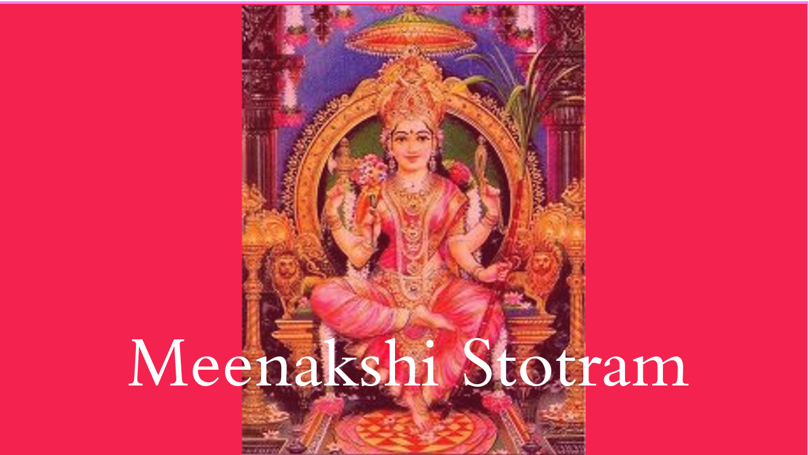{ width="200" }

    ### [Meenakshi Stotram - मीनाक्षीस्तोत्रम्](meenakshi-stotram.md)
    
    **Read time:** 5 min
    
    EXCERPT Not Found

- { width="200" }

    ### [Thirukkural in Hindi Chapter 1 to 5 - तिरुक्कूरळ](thirukkural-in-hindi-chapter-1-to-5.md)
    
    **Read time:** 9 min
    
    EXCERPT Not Found
    

- { width="200" }

    ### [Tantroktam DeviSuktam - तन्त्रोक्तं देविसूक्तम्](tantroktam-devisuktam.md)
    
    **Read time:** 5 min
    
    EXCERPT Not Found

- { width="200" }

    ### [Purush Suktam  - पुरुषसूक्त](purush-suktam.md)
    
    **Read time:** 6 min
    
    EXCERPT Not Found
    

- { width="200" }

    ### [Narayan Suktam- नारायणसूक्तम्](narayan-suktam.md)
    
    **Read time:** 5 min
    
    EXCERPT Not Found

- { width="200" }

    ### [Vaak Suktam - वाक्सूक्तम्](vaak-suktam.md)
    
    **Read time:** 5 min
    
    EXCERPT Not Found
    

- { width="200" }

    ### [Shri Guru Prarthana - श्रीगुरु-प्रार्थना](shri-guru-prarthana.md)
    
    **Read time:** 5 min
    
    EXCERPT Not Found

- 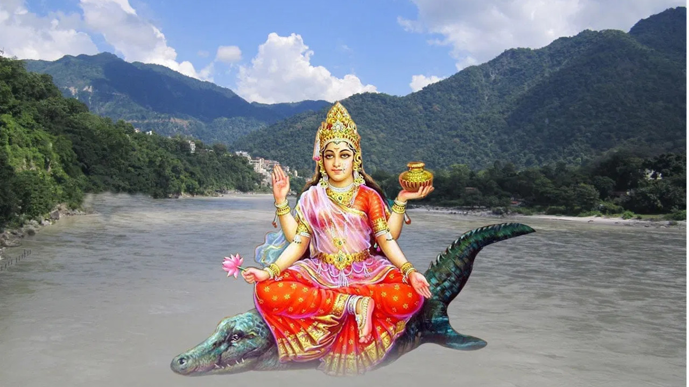{ width="200" }

    ### [Shri Ganga Stotram - श्री गंगा स्तोत्रम](shri-ganga-stotram.md)
    
    **Read time:** 5 min
    
    EXCERPT Not Found
    

- { width="200" }

    ### [Devi Kavacham - देवीकवचम्](devi-kavacham.md)
    
    **Read time:** 9 min
    
    EXCERPT Not Found

- { width="200" }

    ### [Devi Aparaadh Kshamapan Stotram - देवी अपराध क्षमापन स्तोत्रं](devi-aparaadh-kshamapan-stotram.md)
    
    **Read time:** 5 min
    
    EXCERPT Not Found
    

- { width="200" }

    ### [Ekatmaka Stotram - एकात्मता स्तोत्रं](ekatmaka-stotram.md)
    
    **Read time:** 5 min
    
    EXCERPT Not Found

- 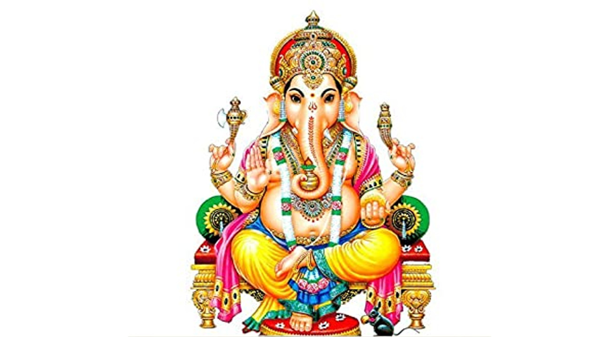{ width="200" }

    ### [GanpatyaTharvShirshopnishad   - गणपत्यथर्वशीर्षोपनिषत्](ganpatyatharvshirshopnishad.md)
    
    **Read time:** 6 min
    
    EXCERPT Not Found
    

- { width="200" }

    ### [Pavmaan Suktam - पवमानसूक्तम्](pavmaan-suktam.md)
    
    **Read time:** 5 min
    
    EXCERPT Not Found

- { width="200" }

    ### [Bhagya Shuktam- भाग्य सूक्तम्](bhoo-shuktam.md)
    
    **Read time:** 5 min
    
    EXCERPT Not Found
    

- { width="200" }

    ### [Mahishasur Mardini - महिषासुरमर्दिनि](mahishasur-mardini.md)
    
    **Read time:** 18 min
    
    अयि गिरिनन्दिनि नन्दितमेदिनि विश्वविनोदिनि नन्दिनुते    गिरिवरविन्ध्यशिरोऽधिनिवासिनि विष्णुविलासिनि जिष्णुनुते

- 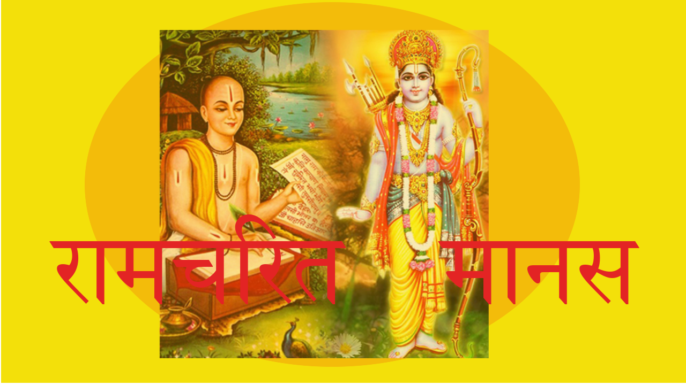{ width="200" }

    ### [Bhaye Pragat Kripala - भए प्रगट कृपाला](bhaye-pragat-kripala.md)
    
    **Read time:** 5 min
    
    When Bhagawan Vishnu incarnate as Raam from Maharani Kaushaliya then this is the conversation between Vishnu and Kaushliya. Keep in mind this is a poe
    

- { width="200" }

    ### [Annapurna Stotram - अन्नपूर्णा स्तोत्रम्](annapurna-stotram.md)
    
    **Read time:** 10 min
    
    नित्यानन्दकरी वराभयकरी सौन्दर्यरत्नाकरी   निर्धूताखिलघोरपावनकरी प्रत्यक्षमाहेश्वरी प्रालेयाचलवंशपावनकरी काशीपुराधीश्वरी    भिक्षां देहि कृपावलम्बनकरी 

- { width="200" }

    ### [Aayshman Suktam - आयुष्य सूक्तम्](aayshman-suktam.md)
    
    **Read time:** 5 min
    
    EXCERPT Not Found
    

- { width="200" }

    ### [RudraPrashna LaghuNyasa - रुद्रप्रश्नः लघुन्यासः](rudraprashna-laghunyasa.md)
    
    **Read time:** 8 min
    
    शुद्धस्फटिकसंकाशं त्रिनेत्रं पञ्चवक्त्रकम् ।   गङ्गाधरं दशभुजं सर्वाभरणभूषितम् ॥  नीलग्रीवं शशाङ्काङ्कं नागयज्ञोपवीतिनम् ।    व्याघ्रचर्मोत्तरीयं च वर

- { width="200" }

    ### [Lalita Sahasranamam  - ललितासहस्रनामं](lalita-sahasranamam.md)
    
    **Read time:** 41 min
    
    सिन्दूरारुणविग्रहां त्रिनयनां माणिक्यमौलिस्फुरत्तारानायकशेखरां स्मित्मुखीमापीनवक्षोरुहाम् ।  पाणिभ्यामलिपूर्णरत्नचषंक रक्तोत्पलं बिभ्रतीं सौम्यां रत्न
    

- { width="200" }

    ### [Rudra Prashna  - रुद्रप्रश्नः](rudra-prashna.md)
    
    **Read time:** 21 min
    
    स॒द्योजा॒तं प्र॑पद्या॒मि स॒द्योजा॒ताय॒ वै नमो॒ नमः॑ ।    भ॒वे भ॑वे॒ नाति॑भवे भवस्व॒ माम् । भ॒वोद्भ॑वाय॒ नमः॑ ॥    वा॒म॒दे॒वाय॒ नमो᳚ ज्ये॒ष्ठाय॒ नम॑श्श

- { width="200" }

    ### [Chamak Prashana - चमकप्रश्नः](chamak-prashana.md)
    
    **Read time:** 11 min
    
    EXCERPT Not Found
    

- { width="200" }

    ### [Medha Suktam - मेधासूक्तं](medha-suktam.md)
    
    **Read time:** 5 min
    
    ॐ यश्छन्द॑सामृष॒भो वि॒श्वरू॑पः। छन्दो॒भ्योऽध्य॒मृता᳚थ्संब॒भूव॑।  स मेन्द्रो॑ मे॒धया᳚ स्पृणोतु। अ॒मृत॑स्य देव॒धार॑णो भूयासम्।  शरी॑रं मे॒ विच॑र्षणम्। ज

- { width="200" }

    ### [Shanti Patha - शान्तिपाठः](shanti-paath.md)
    
    **Read time:** 7 min
    
    Various Shanti Paatha from different Vedas are included here.
    

- { width="200" }

    ### [Rigvedoktam Devisuktam - ऋग्वेदोक्तं देवीसूक्तम्](rigvedoktam-devisuktam.md)
    
    **Read time:** 5 min
    
    EXCERPT Not Found

- { width="200" }

    ### [Mantrapushpam - मन्त्रपुष्पं](mantra-pushpam.md)
    
    **Read time:** 5 min
    
    EXCERPT Not Found
    

- 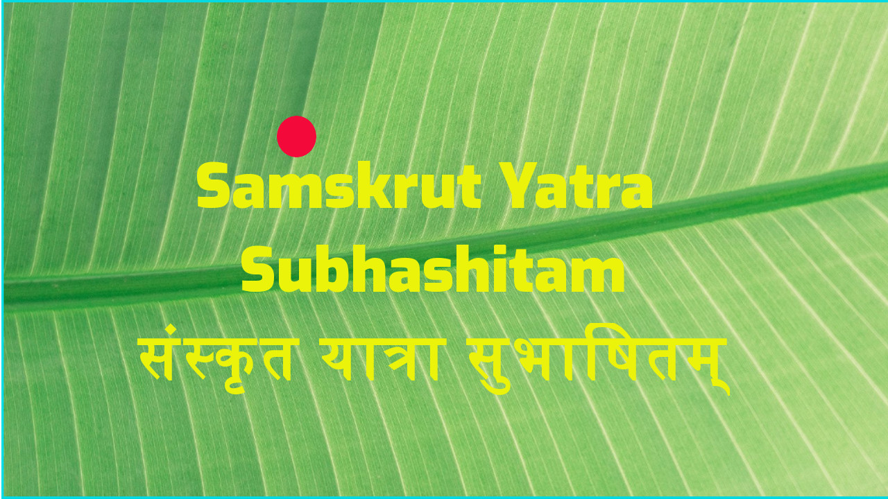{ width="200" }

    ### [Yaksha Prashna - यक्षप्रश्ना:](yaksha-prashna.md)
    
    **Read time:** 5 min
    
    EXCERPT Not Found

- { width="200" }

    ### [Vikatkavi - विकटकविः](vikatkavi.md)
    
    **Read time:** 5 min
    
    EXCERPT Not Found
    

- { width="200" }

    ### [Vairagya Shatakam - वैराग्यशतकम्](vairagyashatakam.md)
    
    **Read time:** 32 min
    
    EXCERPT Not Found

- 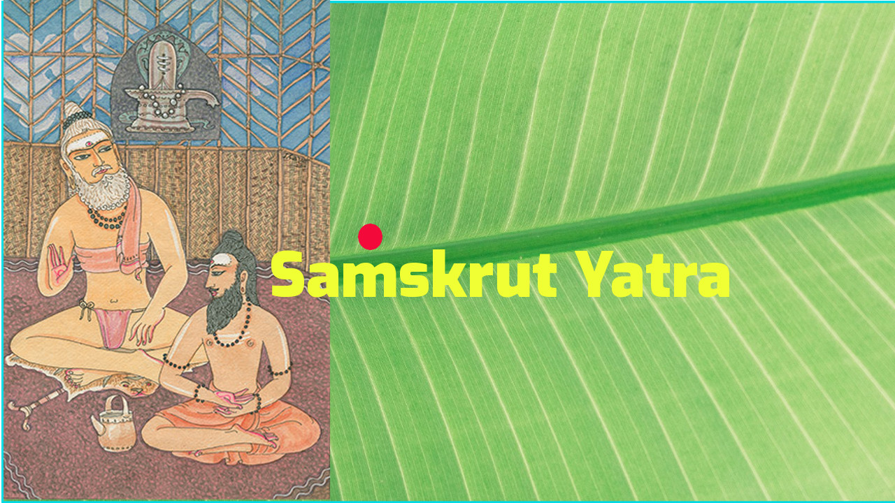{ width="200" }

    ### [Gitanjali - गीतांजली](geetanjali.md)
    
    **Read time:** 5 min
    
    EXCERPT Not Found
    

- { width="200" }

    ### [Madalasa Upadesh - मदालसा उपदेश](madalasa-upadesha.md)
    
    **Read time:** 5 min
    
    शुद्धोसि बुद्धोसि निरँजनोऽसि, सँसारमाया परिवर्जितोऽसि  सँसारस्वप्नँ त्यज मोहनिद्राँ, मदालसोल्लपमुवाच पुत्रम्

- { width="200" }

    ### [Sanskrit Subhashitam - संस्कृत सुभाषितम्](sanskrit-subhashitas-1.md)
    
    **Read time:** 5 min
    
    EXCERPT Not Found
    

- { width="200" }

    ### [Important Samskrut Sloka](important-samskrut-sloka.md)
    
    **Read time:** 5 min
    
    EXCERPT Not Found

- { width="200" }

    ### [Nasadiya Sukta - नासदीय सूक्तं](nasadiya-sukta.md)
    
    **Read time:** 5 min
    
    EXCERPT Not Found
    

- { width="200" }

    ### [Samskrut Video Links](samskrut-video-links.md)
    
    **Read time:** 5 min
    
    EXCERPT Not Found

- { width="200" }

    ### [मनुष्यस्य शरीरस्य महत्वं](importance-of-human-body.md)
    
    **Read time:** 5 min
    
    EXCERPT Not Found
    

- { width="200" }

    ### [Osho Talks](osho-talks.md)
    
    **Read time:** 22 min
    
    EXCERPT Not Found

