# Welcome to Samskrut Yatra Blog

## My Journey in Samskrut - [Samskrut Yatra](/samskrutyatra-home) and introduction to this dimensions of life.

- 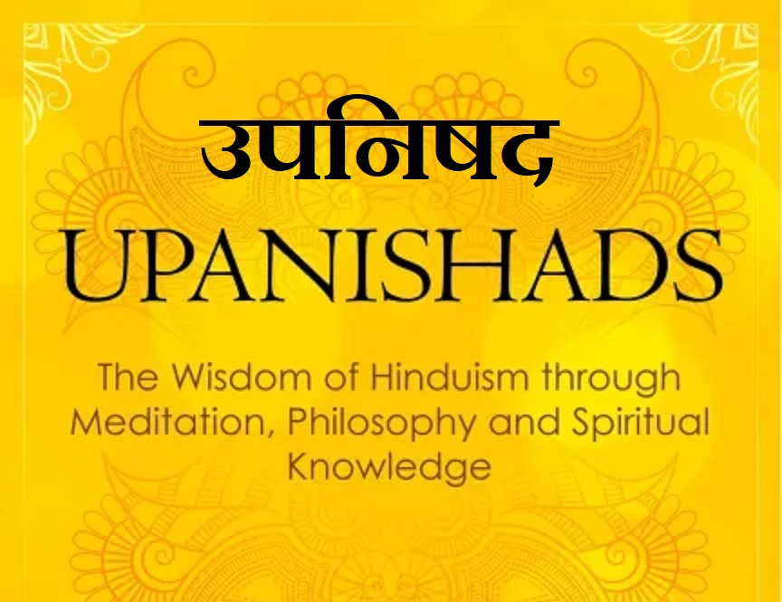{ width="200" }

    ### [आत्मोपनिषत्](samskrutyatra/aatmopnishad.md)
    
    **Read time:** 8 min
    
    EXCERPT Not Found

- 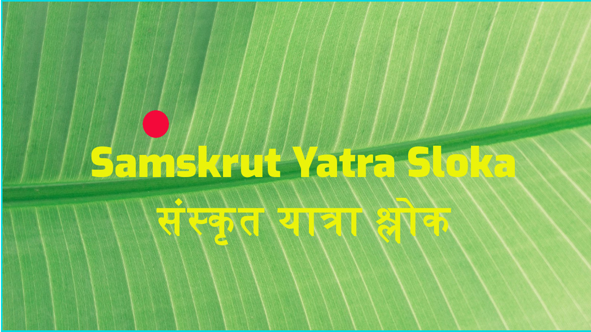{ width="200" }

    ### [आयुष्य सूक्तम्](samskrutyatra/aayshman-suktam.md)
    
    **Read time:** 5 min
    
    EXCERPT Not Found
    

- 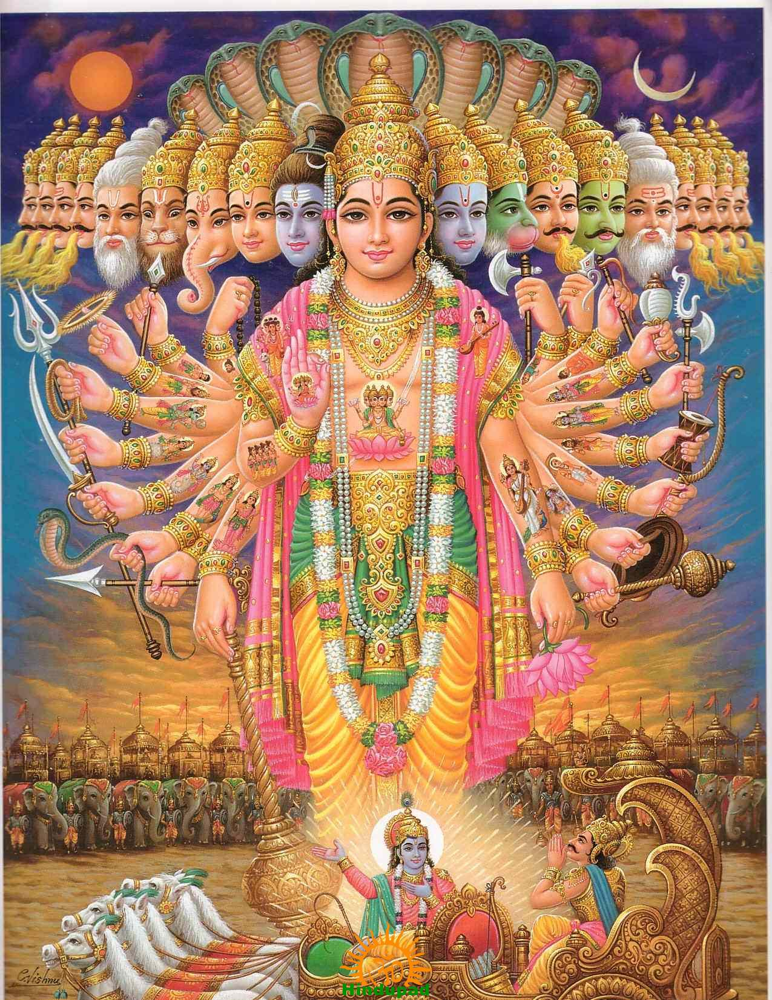{ width="200" }

    ### [अच्युतस्याष्टकम्](samskrutyatra/achyutashtakam-acyutam-keshavam-ramanarayanam.md)
    
    **Read time:** 5 min
    
    अच्युतं केशवं रामनारायणं कृष्णदामोदरं वासुदेवं हरिम्।   श्रीधरं माधवं गोपिकावल्लभं जानकीनायकं रामचंद्रं भजे॥

- 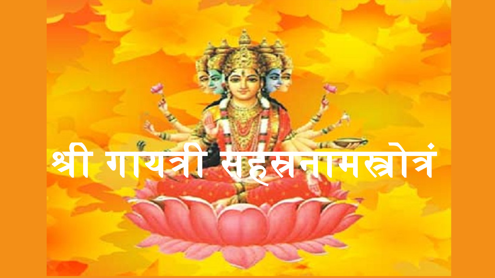{ width="200" }

    ### [आदित्यहृदयम् स्त्रोत्रं](samskrutyatra/aditya-hridayam-stotram.md)
    
    **Read time:** 5 min
    
    ततो युद्धपरिश्रान्तं समरे चिन्तया स्थितम्।   रावणं चाग्रतो दृष्ट्वा युद्धाय समुपस्थितम्॥
    

- { width="200" }

    ### [ऐतरेयोपनिषत्](samskrutyatra/aitreyopnishad.md)
    
    **Read time:** 11 min
    
    EXCERPT Not Found

- { width="200" }

    ### [अमृतबिन्दुपनिषत्](samskrutyatra/amrutbindu-upanishad.md)
    
    **Read time:** 5 min
    
    EXCERPT Not Found
    

- { width="200" }

    ### [अन्नपूर्णा स्तोत्रम्](samskrutyatra/annapurna-stotram.md)
    
    **Read time:** 10 min
    
    नित्यानन्दकरी वराभयकरी सौन्दर्यरत्नाकरी   निर्धूताखिलघोरपावनकरी प्रत्यक्षमाहेश्वरी प्रालेयाचलवंशपावनकरी काशीपुराधीश्वरी    भिक्षां देहि कृपावलम्बनकरी 

- 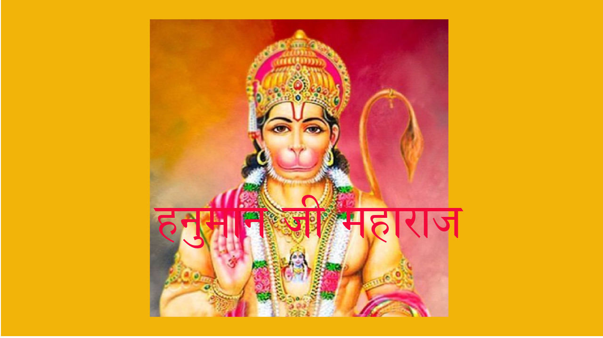{ width="200" }

    ### [बजरंग बाण](samskrutyatra/bajarang-baan.md)
    
    **Read time:** 5 min
    
    बाल समय रवि भक्ष लियो तब तीनहुं लोक भयो अंधियारो।    ताहि सों त्रास भयो जग को यह संकट काहु सों जात न टारो॥ 
    

- 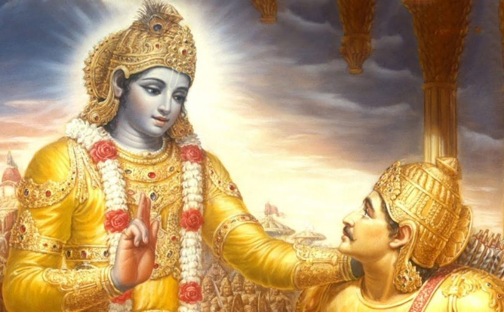{ width="200" }

    ### [श्रीमद्भगवद्गीता प्रथमोऽध्यायः](samskrutyatra/bhagwat-gita-chapter-1.md)
    
    **Read time:** 8 min
    
    EXCERPT Not Found

- { width="200" }

    ### [श्रीमद्भगवद्गीता दशमोऽध्यायः - विभूतियोगः](samskrutyatra/bhagwat-gita-chapter-10.md)
    
    **Read time:** 7 min
    
    EXCERPT Not Found
    

- { width="200" }

    ### [श्रीमद्भगवद्गीता एकादशोऽध्यायः - विश्वरूपदर्शनयोगः](samskrutyatra/bhagwat-gita-chapter-11.md)
    
    **Read time:** 12 min
    
    EXCERPT Not Found

- { width="200" }

    ### [श्रीमद्भगवद्गीता द्वादशोऽध्यायः - भक्तियोगः](samskrutyatra/bhagwat-gita-chapter-12.md)
    
    **Read time:** 5 min
    
    EXCERPT Not Found
    

- { width="200" }

    ### [श्रीमद्भगवद्गीता त्रयोदशोऽध्यायः - क्षेत्रक्षेत्रज्ञविभागयोगः](samskrutyatra/bhagwat-gita-chapter-13.md)
    
    **Read time:** 6 min
    
    EXCERPT Not Found

- { width="200" }

    ### [श्रीमद्भगवद्गीता चतुर्दशोऽध्यायः - गुणत्रयविभागयोगः](samskrutyatra/bhagwat-gita-chapter-14.md)
    
    **Read time:** 5 min
    
    EXCERPT Not Found
    

- { width="200" }

    ### [श्रीमद्भगवद्गीता पञ्चदशोऽध्यायः - पुरुषोत्तमयोगः](samskrutyatra/bhagwat-gita-chapter-15.md)
    
    **Read time:** 5 min
    
    EXCERPT Not Found

- { width="200" }

    ### [श्रीमद्भगवद्गीता षोडशोऽध्यायः - दैवासुरसम्पद्विभागयोगः](samskrutyatra/bhagwat-gita-chapter-16.md)
    
    **Read time:** 5 min
    
    EXCERPT Not Found
    

- { width="200" }

    ### [श्रीमद्भगवद्गीता सप्तदशोऽध्यायः - श्रद्धात्रयविभागयोगः](samskrutyatra/bhagwat-gita-chapter-17.md)
    
    **Read time:** 5 min
    
    EXCERPT Not Found

- { width="200" }

    ### [श्रीमद्भगवद्गीता अथाष्टादशोऽध्यायः - मोक्षसंन्यासयोगः](samskrutyatra/bhagwat-gita-chapter-18.md)
    
    **Read time:** 14 min
    
    EXCERPT Not Found
    

- { width="200" }

    ### [अथ द्वितीयोऽध्यायः - साङ्ख्ययोगः](samskrutyatra/bhagwat-gita-chapter-2.md)
    
    **Read time:** 13 min
    
    EXCERPT Not Found

- { width="200" }

    ### [श्रीमद्भगवद्गीता तृतीयोऽध्यायः](samskrutyatra/bhagwat-gita-chapter-3.md)
    
    **Read time:** 8 min
    
    EXCERPT Not Found
    

- { width="200" }

    ### [श्रीमद्भगवद्गीता चतुर्थोऽध्यायः](samskrutyatra/bhagwat-gita-chapter-4.md)
    
    **Read time:** 7 min
    
    EXCERPT Not Found

- { width="200" }

    ### [श्रीमद्भगवद्गीता पञ्चमोऽध्यायः - संन्यासयोगः](samskrutyatra/bhagwat-gita-chapter-5.md)
    
    **Read time:** 5 min
    
    EXCERPT Not Found
    

- { width="200" }

    ### [श्रीमद्भगवद्गीता षष्ठोऽध्यायः - ध्यानयोगः](samskrutyatra/bhagwat-gita-chapter-6.md)
    
    **Read time:** 8 min
    
    EXCERPT Not Found

- { width="200" }

    ### [श्रीमद्भगवद्गीता सप्तमोऽध्यायः - ज्ञानविज्ञानयोगः](samskrutyatra/bhagwat-gita-chapter-7.md)
    
    **Read time:** 5 min
    
    EXCERPT Not Found
    

- { width="200" }

    ### [श्रीमद्भगवद्गीता अष्टमोऽध्यायः - अक्षरब्रह्मयोगः](samskrutyatra/bhagwat-gita-chapter-8.md)
    
    **Read time:** 5 min
    
    EXCERPT Not Found

- { width="200" }

    ### [श्रीमद्भगवद्गीता नवमोऽध्यायः - राजविद्याराजगुह्ययोगः](samskrutyatra/bhagwat-gita-chapter-9.md)
    
    **Read time:** 6 min
    
    EXCERPT Not Found
    

- { width="200" }

    ### [भज गोविन्दं](samskrutyatra/bhaj-govindam.md)
    
    **Read time:** 7 min
    
    भज गोविन्दं भज गोविन्दं, गोविन्दं भज मूढ़मते। संप्राप्ते सन्निहिते काले, न हि न हि रक्षति डुकृञ् करणे॥१॥

- { width="200" }

    ### [Bhajan without Text](samskrutyatra/bhajan-without-text.md)
    
    **Read time:** 5 min
    
    EXCERPT Not Found
    

- 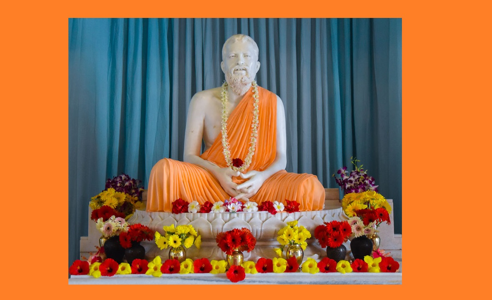{ width="200" }

    ### [भवसागर तारण कारण हे](samskrutyatra/bhava-sagara-tarana-karana-he.md)
    
    **Read time:** 5 min
    
    EXCERPT Not Found

- { width="200" }

    ### [भवान्यष्टकम्](samskrutyatra/bhavani-ashtakam.md)
    
    **Read time:** 5 min
    
    EXCERPT Not Found
    

- 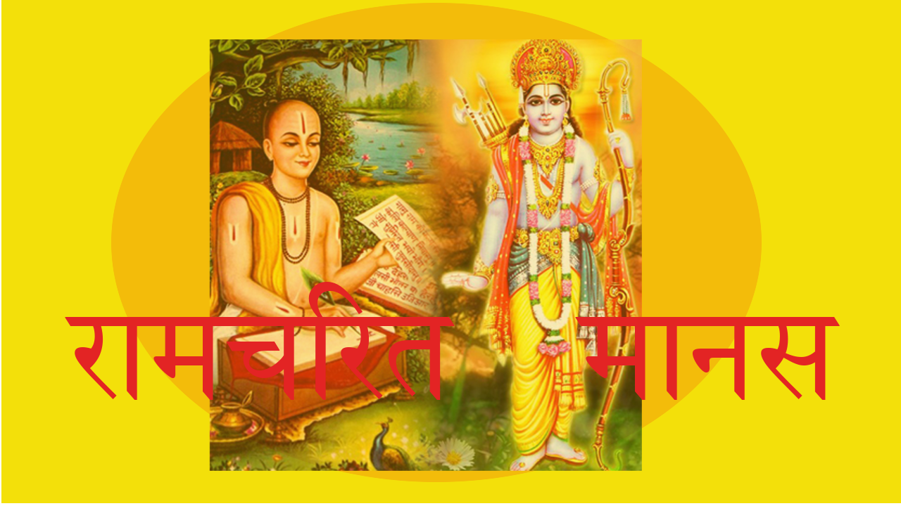{ width="200" }

    ### [भए प्रगट कृपाला](samskrutyatra/bhaye-pragat-kripala.md)
    
    **Read time:** 5 min
    
    When Bhagawan Vishnu incarnate as Raam from Maharani Kaushaliya then this is the conversation between Vishnu and Kaushliya. Keep in mind this is a poe

- { width="200" }

    ### [भाग्य सूक्तम्](samskrutyatra/bhoo-shuktam.md)
    
    **Read time:** 5 min
    
    EXCERPT Not Found
    

- { width="200" }

    ### [भूसूक्तम्](samskrutyatra/bhoosuktam.md)
    
    **Read time:** 5 min
    
    EXCERPT Not Found

- { width="200" }

    ### [तैत्तिरीयोपनिषत्](samskrutyatra/brahmanandamimamsa.md)
    
    **Read time:** 5 min
    
    भी॒षाऽस्मा॒द्वातः॑ पवते । भी॒षोदे॑ति॒ सूर्यः॑ ।   भीषाऽस्मादग्नि॑श्चेन्द्र॒श्च । त्युर्धावति पञ्च॑म इ॒ति ।    सैषाऽऽनन्दस्य मीमा॑ꣳसा भ॒वति ।    युवा स
    

- 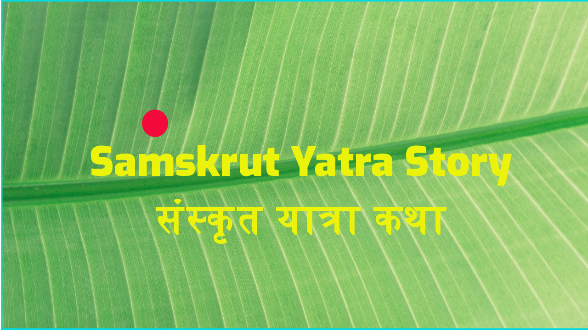{ width="200" }

    ### [लघुकथा: सेतुः निर्माणं](samskrutyatra/building-a-bridge.md)
    
    **Read time:** 5 min
    
    EXCERPT Not Found

- { width="200" }

    ### [चमकप्रश्नः](samskrutyatra/chamak-prashana.md)
    
    **Read time:** 11 min
    
    EXCERPT Not Found
    

- { width="200" }

    ### [चाणक्य जीवनस्य (लघुकथा:)](samskrutyatra/chanakya-jivanasya-katha.md)
    
    **Read time:** 5 min
    
    EXCERPT Not Found

- { width="200" }

    ### [छान्दोग्योपनिषत्](samskrutyatra/chandogyopnishad-1.md)
    
    **Read time:** 25 min
    
    EXCERPT Not Found
    

- { width="200" }

    ### [छान्दोग्योपनिषत् द्वितीयोऽध्यायः](samskrutyatra/chandogyopnishad-2.md)
    
    **Read time:** 20 min
    
    EXCERPT Not Found

- { width="200" }

    ### [छान्दोग्योपनिषत् तृतीयोऽध्यायः](samskrutyatra/chandogyopnishad-3.md)
    
    **Read time:** 22 min
    
    EXCERPT Not Found
    

- { width="200" }

    ### [छान्दोग्योपनिषत् चतुर्थोऽध्यायः](samskrutyatra/chandogyopnishad-4.md)
    
    **Read time:** 22 min
    
    EXCERPT Not Found

- { width="200" }

    ### [छान्दोग्योपनिषत् पञ्चमोऽध्यायः](samskrutyatra/chandogyopnishad-5.md)
    
    **Read time:** 26 min
    
    EXCERPT Not Found
    

- { width="200" }

    ### [छान्दोग्योपनिषत् षष्ठोऽध्यायः](samskrutyatra/chandogyopnishad-6.md)
    
    **Read time:** 19 min
    
    EXCERPT Not Found

- { width="200" }

    ### [छान्दोग्योपनिषत् सप्तमोऽध्यायः](samskrutyatra/chandogyopnishad-7.md)
    
    **Read time:** 23 min
    
    EXCERPT Not Found
    

- { width="200" }

    ### [छान्दोग्योपनिषत् अष्टमोऽध्यायः](samskrutyatra/chandogyopnishad-8.md)
    
    **Read time:** 23 min
    
    EXCERPT Not Found

- 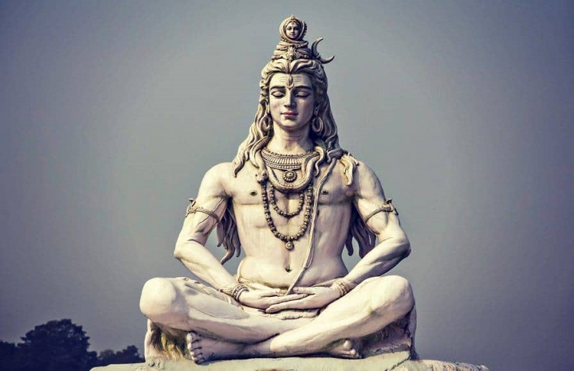{ width="200" }

    ### [दारिद्र्य दहन शिवस्तोत्रम्](samskrutyatra/daridrya-dahan-shivstotram.md)
    
    **Read time:** 5 min
    
    विश्वेश्वराय नरकार्णवतारणाय कर्णामृताय शशिशेखरभूषणाय ।  कर्पूरकुन्दधवलाय जटाधराय दारिद्र्य दुःखदहनाय नमः शिवाय ॥ 
    

- { width="200" }

    ### [देवी अपराध क्षमापन स्तोत्रं](samskrutyatra/devi-aparaadh-kshamapan-stotram.md)
    
    **Read time:** 5 min
    
    EXCERPT Not Found

- { width="200" }

    ### [देवीकवचम्](samskrutyatra/devi-kavacham.md)
    
    **Read time:** 9 min
    
    EXCERPT Not Found
    

- { width="200" }

    ### [क्षमा-प्रार्थना](samskrutyatra/devi-kshama-prarthana.md)
    
    **Read time:** 5 min
    
    अपराधसहस्त्राणि क्रियन्तेऽहर्निशं मया।  दासोऽयमिति मां मत्वा क्षमस्व परमेश्‍वरि॥

- { width="200" }

    ### [अथ मूर्तिरहस्यम्](samskrutyatra/devi-murti-rahasyam.md)
    
    **Read time:** 5 min
    
    EXCERPT Not Found
    

- { width="200" }

    ### [अथ प्राधानिकं रहस्यम्](samskrutyatra/devi-praahanikam-rahasyam.md)
    
    **Read time:** 5 min
    
    EXCERPT Not Found

- { width="200" }

    ### [सिद्धकुञ्जिकास्तोत्रम्](samskrutyatra/devi-sidhakunjika-stotram.md)
    
    **Read time:** 5 min
    
    EXCERPT Not Found
    

- { width="200" }

    ### [देवीसूक्तम्](samskrutyatra/devi-suktam-saswara.md)
    
    **Read time:** 5 min
    
    EXCERPT Not Found

- { width="200" }

    ### [अथ वैकृतिकं रहस्यम्](samskrutyatra/devi-vaikrutikam-rahashy.md)
    
    **Read time:** 6 min
    
    EXCERPT Not Found
    

- { width="200" }

    ### [अथ दुर्गाद्वात्रिंशन्नाममाला](samskrutyatra/durga-dwatrimshan-namamaalaa.md)
    
    **Read time:** 5 min
    
    EXCERPT Not Found

- { width="200" }

    ### [श्रीदुर्गासप्तशती - प्रथमोऽध्यायः](samskrutyatra/durga-saptashati-chapter1.md)
    
    **Read time:** 14 min
    
    EXCERPT Not Found
    

- { width="200" }

    ### [श्रीदुर्गासप्तशती दशमोऽध्यायः शुम्भ वध](samskrutyatra/durga-saptashati-chapter10.md)
    
    **Read time:** 5 min
    
    EXCERPT Not Found

- { width="200" }

    ### [श्रीदुर्गासप्तशती -एकादशोऽध्यायः](samskrutyatra/durga-saptashati-chapter11.md)
    
    **Read time:** 9 min
    
    EXCERPT Not Found
    

- { width="200" }

    ### [श्रीदुर्गासप्तशती - द्वादशोऽध्यायः](samskrutyatra/durga-saptashati-chapter12.md)
    
    **Read time:** 7 min
    
    EXCERPT Not Found

- { width="200" }

    ### [श्रीदुर्गासप्तशती - त्रयोदशोऽध्यायः](samskrutyatra/durga-saptashati-chapter13.md)
    
    **Read time:** 5 min
    
    EXCERPT Not Found
    

- { width="200" }

    ### [श्रीदुर्गासप्तशती - द्वितीयोऽध्यायः](samskrutyatra/durga-saptashati-chapter2.md)
    
    **Read time:** 12 min
    
    EXCERPT Not Found

- { width="200" }

    ### [श्रीदुर्गासप्तशती - तृतीयोऽध्यायः](samskrutyatra/durga-saptashati-chapter3.md)
    
    **Read time:** 7 min
    
    EXCERPT Not Found
    

- { width="200" }

    ### [श्रीदुर्गासप्तशती - चतुर्थोऽध्यायः](samskrutyatra/durga-saptashati-chapter4.md)
    
    **Read time:** 9 min
    
    EXCERPT Not Found

- { width="200" }

    ### [श्रीदुर्गासप्तशती - पञ्चमोऽध्यायः](samskrutyatra/durga-saptashati-chapter5.md)
    
    **Read time:** 14 min
    
    EXCERPT Not Found
    

- { width="200" }

    ### [श्रीदुर्गासप्तशती - षष्ठोऽध्यायः](samskrutyatra/durga-saptashati-chapter6.md)
    
    **Read time:** 5 min
    
    EXCERPT Not Found

- { width="200" }

    ### [श्रीदुर्गासप्तशती - सप्तमोऽध्यायः](samskrutyatra/durga-saptashati-chapter7.md)
    
    **Read time:** 5 min
    
    EXCERPT Not Found
    

- { width="200" }

    ### [श्रीदुर्गासप्तशती - अष्टमोऽध्यायः](samskrutyatra/durga-saptashati-chapter8.md)
    
    **Read time:** 10 min
    
    EXCERPT Not Found

- { width="200" }

    ### [श्रीदुर्गासप्तशती - नवमोऽध्यायः](samskrutyatra/durga-saptashati-chapter9.md)
    
    **Read time:** 7 min
    
    EXCERPT Not Found
    

- { width="200" }

    ### [अथ दुर्गासूक्तम्](samskrutyatra/durgasuktam.md)
    
    **Read time:** 5 min
    
    ॐ जा॒तवे॑दसे सुनवाम॒ सोम॑ मरातीय॒तो निद॑हाति॒ वेदः॑ ।    स नः॑ पर्ष॒दति॑ दु॒र्गाणि॒ विश्वा॑ ना॒वेव॒ सिन्धुं॑ दुरि॒ताऽत्य॒ग्निः ॥

- { width="200" }

    ### [दुर्गतिनाशिनी दुर्गे](samskrutyatra/durgatinaashinidurge.md)
    
    **Read time:** 5 min
    
    EXCERPT Not Found
    

- { width="200" }

    ### [एकात्मता स्तोत्रं](samskrutyatra/ekatmaka-stotram.md)
    
    **Read time:** 5 min
    
    EXCERPT Not Found

- { width="200" }

    ### [गमानुगतः लोकव्यवहारः (लघुकथा:)](samskrutyatra/gamanugat-lokvyavhar.md)
    
    **Read time:** 5 min
    
    EXCERPT Not Found
    

- { width="200" }

    ### [॥ गणपत्यथर्वशीर्षोपनिषत् ॥](samskrutyatra/ganpatyatharvshirshopnishad.md)
    
    **Read time:** 6 min
    
    EXCERPT Not Found

- { width="200" }

    ### [श्री गायत्री सहस्रनामस्तोत्रं](samskrutyatra/gayatri-sahasranama.md)
    
    **Read time:** 26 min
    
    EXCERPT Not Found
    

- 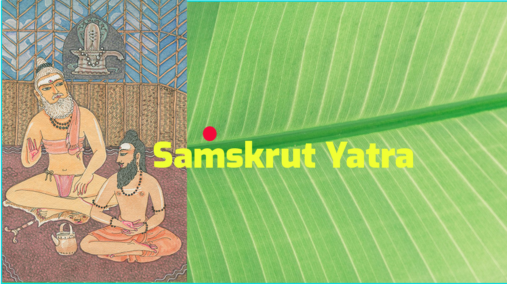{ width="200" }

    ### [गीतांजली](samskrutyatra/geetanjali.md)
    
    **Read time:** 5 min
    
    EXCERPT Not Found

- { width="200" }

    ### [गुहगीता](samskrutyatra/guha-geeta.md)
    
    **Read time:** 48 min
    
    EXCERPT Not Found
    

- { width="200" }

    ### [गुणसागर निर्गुण परमेशा](samskrutyatra/gunasagar-nirguna.md)
    
    **Read time:** 5 min
    
    EXCERPT Not Found

- { width="200" }

    ### [गुरु स्तोत्रम्](samskrutyatra/guru-stotram.md)
    
    **Read time:** 5 min
    
    गुरुर्ब्रह्मा गुरुर्विष्णुर्गुरुर्देवो महेश्वरः ।   गुरुरेव परं ब्रह्म तस्मै श्रीगुरवे नमः ॥
    

- { width="200" }

    ### [गुर्वष्टकम्](samskrutyatra/gurvashtaka.md)
    
    **Read time:** 5 min
    
    शरीरं सुरुपं तथा वा कलत्रं यशश्चारू चित्रं धनं मेरुतुल्यम् ।   मनश्चेन्न लग्नं गुरोरंघ्रिपद्मे ततः किं ततः किं ततः किं ततः किम् ।।

- { width="200" }

    ### [संकटमोचन हनुमानाष्टकम्](samskrutyatra/hanuman-ashtakam.md)
    
    **Read time:** 5 min
    
    EXCERPT Not Found
    

- { width="200" }

    ### [हनुमान चालीसा](samskrutyatra/hanuman-chalisa.md)
    
    **Read time:** 5 min
    
    श्रीगुरु चरन सरोज रज, निज मनु मुकुरु सुधारि।    बरनऊं रघुबर बिमल जसु, जो दायकु फल चारि।।    बुद्धिहीन तनु जानिके, सुमिरौं पवन-कुमार।    बल बुद्धि बिद्

- { width="200" }

    ### [सनातन संस्कृति एवं षडयंत्र](samskrutyatra/hindu-festivals-and-conspiracy.md)
    
    **Read time:** 5 min
    
    EXCERPT Not Found
    

- { width="200" }

    ### [मनुष्यस्य शरीरस्य महत्वं](samskrutyatra/importance-of-human-body.md)
    
    **Read time:** 5 min
    
    EXCERPT Not Found

- { width="200" }

    ### [Important Samskrut Sloka](samskrutyatra/important-samskrut-sloka.md)
    
    **Read time:** 5 min
    
    EXCERPT Not Found
    

- { width="200" }

    ### [ईशावास्योपषत्](samskrutyatra/ishaavashyopnishad.md)
    
    **Read time:** 5 min
    
    ॐ ईशा वास्यमिदꣳ सर्वं यत्किञ्च जगत्यां जगत् ।    तेन त्यक्तेन भुञ्जीथा मा गृधः कस्यस्विद्धनम् ॥

- 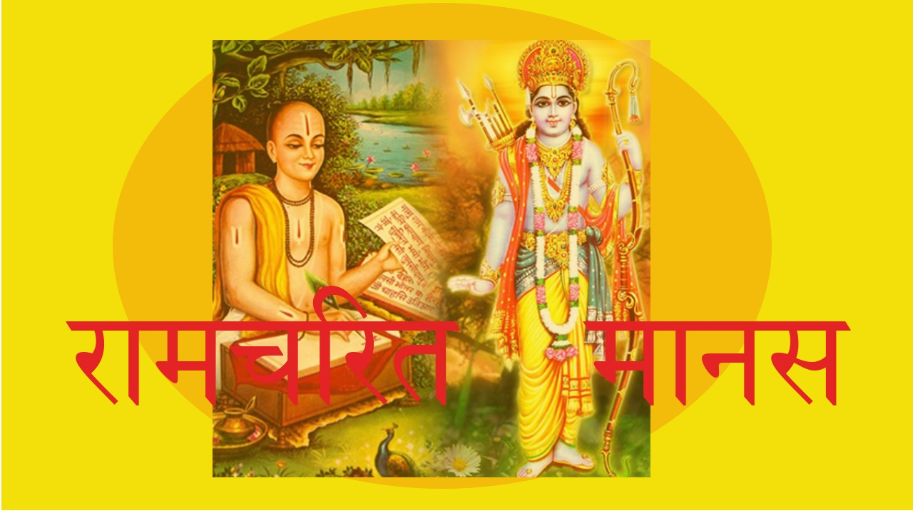{ width="200" }

    ### [जय जय सुरनायक](samskrutyatra/jai-jai-surnayak.md)
    
    **Read time:** 5 min
    
    जय जय सुरनायक जन सुखदायक प्रनतपाल भगवंता।  गो द्विज हितकारी जय असुरारी सिधुंसुता प्रिय कंता।।
    

- { width="200" }

    ### [जय राम रमा रमनं समनं](samskrutyatra/jai-raam-rama-ramanam-samanam.md)
    
    **Read time:** 5 min
    
    जय राम रमा रमनं समनं । भव ताप भयाकुल पाहि जनम ॥  अवधेस सुरेस रमेस बिभो । सरनागत मागत पाहि प्रभो ॥

- { width="200" }

    ### [जय राम सदा सुखधाम](samskrutyatra/jai-raama-sada-sada-sukhdham-hare.md)
    
    **Read time:** 5 min
    
    जय राम सदा सुखधाम हरे। रघुनायक सायक चाप धरे।।   भव बारन दारन सिंह प्रभो। गुन सागर नागर नाथ बिभो।।
    

- { width="200" }

    ### [जय राम सोभा धाम](samskrutyatra/jai-raama-sobha-dham.md)
    
    **Read time:** 5 min
    
    जय राम सोभा धाम। दायक प्रनत बिश्राम॥   धृत त्रोन बर सर चाप। भुजदंड प्रबल प्रताप॥

- { width="200" }

    ### [जय सगुन निर्गुन रूप](samskrutyatra/jai-sagun-nirgun-roop.md)
    
    **Read time:** 5 min
    
    EXCERPT Not Found
    

- 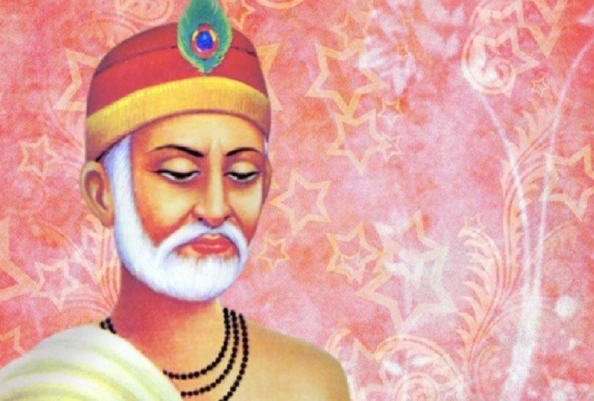{ width="200" }

    ### [कबीरदास दोहे](samskrutyatra/kabirdaas-dohe.md)
    
    **Read time:** 19 min
    
    EXCERPT Not Found

- { width="200" }

    ### [कैवल्योपनिषत्](samskrutyatra/kaivalopnishad.md)
    
    **Read time:** 6 min
    
    ॐ अथाश्वलायनो भगवन्तं परमेष्ठिनमुपसमेत्योवाच ।   अधीहि भगवन्ब्रह्मविद्यां वरिष्ठां सदा सद्भिः सेव्यमानां निगूढाम् ।    यथाऽचिरात्सर्वपापं व्यपोह्य परा
    

- { width="200" }

    ### [कनकधारा स्तोत्रं](samskrutyatra/kanakdhara-stotram.md)
    
    **Read time:** 5 min
    
    EXCERPT Not Found

- { width="200" }

    ### [अथ केनोपनिषत्](samskrutyatra/kenopnishad.md)
    
    **Read time:** 7 min
    
    EXCERPT Not Found
    

- 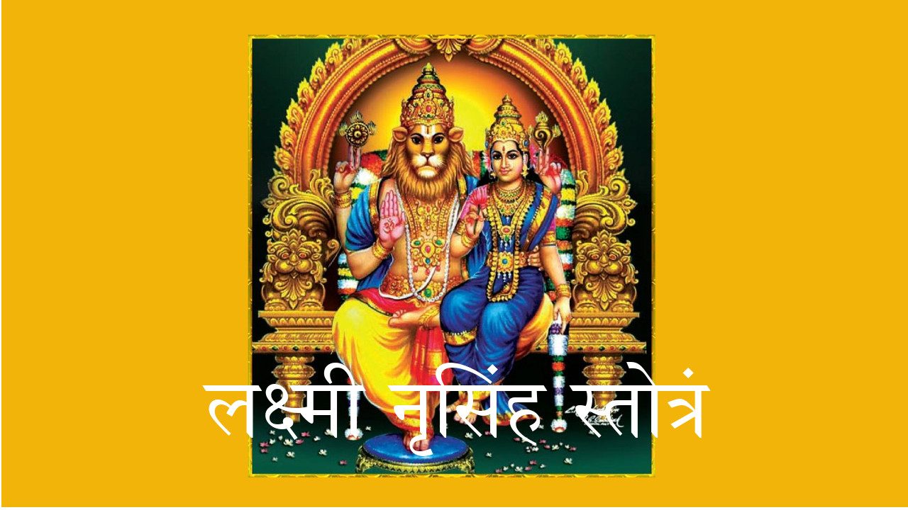{ width="200" }

    ### [लक्ष्मीनृसिंह करावलम्ब स्तोत्र](samskrutyatra/lakshmi-nrusimha-karavalamba-stotram.md)
    
    **Read time:** 5 min
    
    श्रीमत्पयोनिधिनिकेतन चक्रपाणे भोगीन्द्रभोगमणिराजित पुण्यमूर्ते |    योगीश शाश्वत शरण्य भवाब्धिपोत लक्ष्मीनृसिंह मम देहि करावलम्बम् ||

- { width="200" }

    ### [ललितासहस्रनामं](samskrutyatra/lalita-sahasranamam.md)
    
    **Read time:** 41 min
    
    सिन्दूरारुणविग्रहां त्रिनयनां माणिक्यमौलिस्फुरत्तारानायकशेखरां स्मित्मुखीमापीनवक्षोरुहाम् ।  पाणिभ्यामलिपूर्णरत्नचषंक रक्तोत्पलं बिभ्रतीं सौम्यां रत्न
    

- { width="200" }

    ### [Lalitasahasranamam with Meaning](samskrutyatra/lalitasaharanam-with-meaning.md)
    
    **Read time:** 74 min
    
    Meaning of lalitasahasranama in English

- { width="200" }

    ### [लिंगाष्टकमं स्तोत्र](samskrutyatra/lingastakam-stotra.md)
    
    **Read time:** 5 min
    
    ब्रह्ममुरारि सुरार्चित लिंगम् निर्मलभासित शोभित लिंगम्।  जन्मज दुःख विनाशक लिंगम् तत् प्रणमामि सदाशिव लिंगम् ॥
    

- { width="200" }

    ### [मदालसा उपदेश](samskrutyatra/madalasa-upadesha.md)
    
    **Read time:** 5 min
    
    शुद्धोसि बुद्धोसि निरँजनोऽसि, सँसारमाया परिवर्जितोऽसि  सँसारस्वप्नँ त्यज मोहनिद्राँ, मदालसोल्लपमुवाच पुत्रम्

- { width="200" }

    ### [मदनमोहन मालवीय: (लघुकथा:)](samskrutyatra/madanmohal-malviya-sanskrit-katha.md)
    
    **Read time:** 5 min
    
    EXCERPT Not Found
    

- 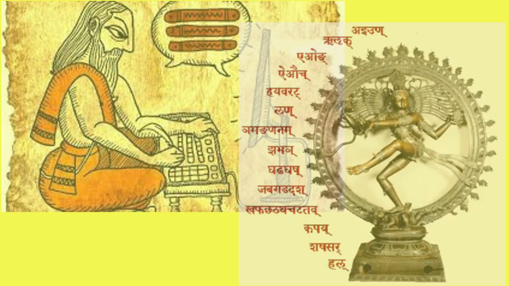{ width="200" }

    ### [माहेश्वर सूत्र](samskrutyatra/maheshwara-sutrani.md)
    
    **Read time:** 5 min
    
    EXCERPT Not Found

- { width="200" }

    ### [महिषासुरमर्दिनि](samskrutyatra/mahishasur-mardini.md)
    
    **Read time:** 18 min
    
    अयि गिरिनन्दिनि नन्दितमेदिनि विश्वविनोदिनि नन्दिनुते    गिरिवरविन्ध्यशिरोऽधिनिवासिनि विष्णुविलासिनि जिष्णुनुते
    

- { width="200" }

    ### [माण्डूक्योपनिषत्](samskrutyatra/mandukyopnishad.md)
    
    **Read time:** 5 min
    
    ओमित्येतदक्षरमिदग्ं सर्वं तस्योपव्याख्यानं भूतं भवद्भविष्यदिति सर्वमोङ्कार एव।  यच्चान्यत् त्रिकालातीतं तदप्योङ्कार एव ॥१॥ 

- { width="200" }

    ### [मङ्गलाचरणम्](samskrutyatra/mangalacharan.md)
    
    **Read time:** 5 min
    
    EXCERPT Not Found
    

- { width="200" }

    ### [मन्त्रपुष्पं](samskrutyatra/mantra-pushpam.md)
    
    **Read time:** 5 min
    
    EXCERPT Not Found

- { width="200" }

    ### [मेधासूक्तं](samskrutyatra/medha-suktam.md)
    
    **Read time:** 5 min
    
    ॐ यश्छन्द॑सामृष॒भो वि॒श्वरू॑पः। छन्दो॒भ्योऽध्य॒मृता᳚थ्संब॒भूव॑।  स मेन्द्रो॑ मे॒धया᳚ स्पृणोतु। अ॒मृत॑स्य देव॒धार॑णो भूयासम्।  शरी॑रं मे॒ विच॑र्षणम्। ज
    

- 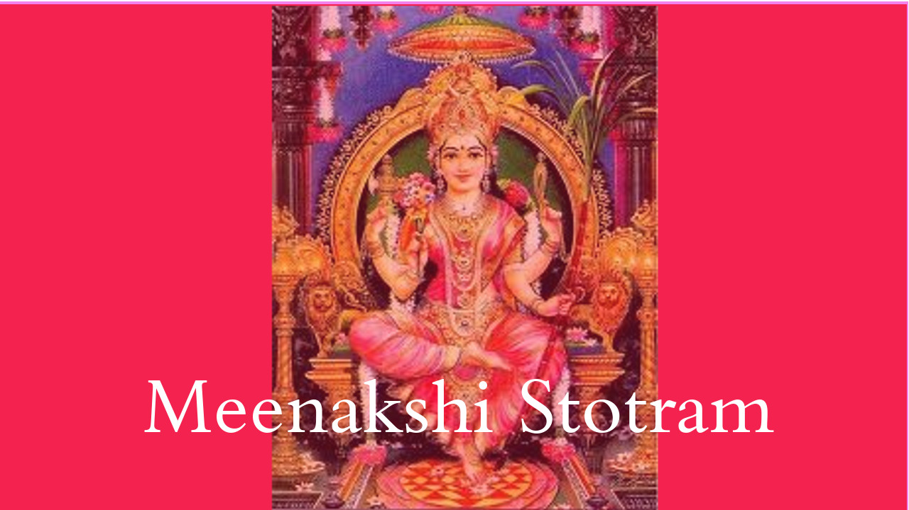{ width="200" }

    ### [मीनाक्षीस्तोत्रम्](samskrutyatra/meenakshi-stotram.md)
    
    **Read time:** 5 min
    
    EXCERPT Not Found

- { width="200" }

    ### [मुण्डकोपनिषत्](samskrutyatra/mundakoupnishad.md)
    
    **Read time:** 16 min
    
    EXCERPT Not Found
    

- 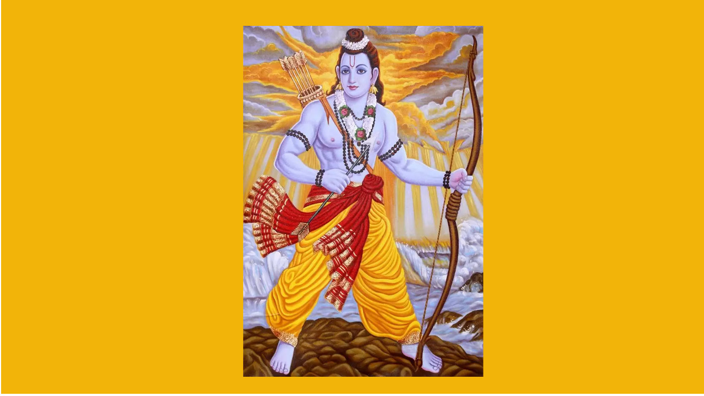{ width="200" }

    ### [नाम रामायण](samskrutyatra/naam-ramayan.md)
    
    **Read time:** 6 min
    
    EXCERPT Not Found

- 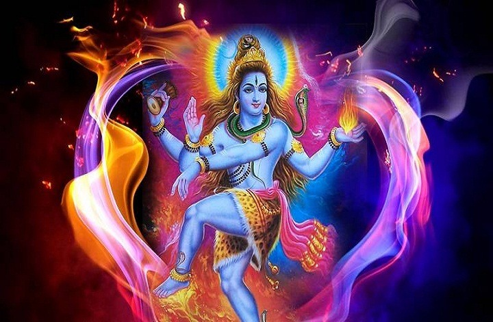{ width="200" }

    ### [नमामीशमीसान निर्वाणरूपं](samskrutyatra/namamishmishan-nirvan-roopam.md)
    
    **Read time:** 5 min
    
    नमामीशमीशान निर्वाणरूपं। विभुं व्यापकं ब्रह्मवेदस्वरूपम्।।निजं निर्गुणं निर्विकल्पं निरीहं। चिदाकाशमाकाशवासं भजेऽहं।।
    

- { width="200" }

    ### [नमस्ते सदा वत्सले](samskrutyatra/namaste-sada-vatsale.md)
    
    **Read time:** 5 min
    
    EXCERPT Not Found

- { width="200" }

    ### [नारायणसूक्तम्](samskrutyatra/narayan-suktam.md)
    
    **Read time:** 5 min
    
    EXCERPT Not Found
    

- { width="200" }

    ### [नारायणोपनिषत्](samskrutyatra/narayanopnishad.md)
    
    **Read time:** 5 min
    
    EXCERPT Not Found

- { width="200" }

    ### [नासदीय सूक्तं](samskrutyatra/nasadiya-sukta.md)
    
    **Read time:** 5 min
    
    EXCERPT Not Found
    

- { width="200" }

    ### [नवग्रहसूक्तम्](samskrutyatra/navgruhsuktam.md)
    
    **Read time:** 7 min
    
    EXCERPT Not Found

- { width="200" }

    ### [निर्वाणषट्कम्](samskrutyatra/nirvaanshatkam.md)
    
    **Read time:** 5 min
    
    EXCERPT Not Found
    

- { width="200" }

    ### [निर्वाणोपनिषत्](samskrutyatra/nirvanopnishad.md)
    
    **Read time:** 5 min
    
    EXCERPT Not Found

- { width="200" }

    ### [Osho Talks](samskrutyatra/osho-talks.md)
    
    **Read time:** 22 min
    
    EXCERPT Not Found
    

- { width="200" }

    ### [परसत पद पावन](samskrutyatra/parsat-pad-paavan.md)
    
    **Read time:** 5 min
    
    परसत पद पावन सोक नसावन प्रगट भई तपपुंज सही। देखत रघुनायक जन सुख दायक सनमुख होइ कर जोरि रही

- { width="200" }

    ### [पवमानसूक्तम्](samskrutyatra/pavmaan-suktam.md)
    
    **Read time:** 5 min
    
    EXCERPT Not Found
    

- { width="200" }

    ### [कर्मकर्याः दण्डं (लघुकथा:)](samskrutyatra/punishment-of-enjoyment.md)
    
    **Read time:** 5 min
    
    EXCERPT Not Found

- { width="200" }

    ### [पुरुषसूक्त](samskrutyatra/purush-suktam.md)
    
    **Read time:** 6 min
    
    EXCERPT Not Found
    

- { width="200" }

    ### [रामचन्द्र स्तवन](samskrutyatra/ramchandra-stavan.md)
    
    **Read time:** 5 min
    
    श्रीरामचंद्र कृपालु भजमन हरण भाव भय दारुणम् ।  नवकंज लोचन, कंज मुख, कर कंज, पद कन्जारुणम ॥

- { width="200" }

    ### [श्री राम स्तुति:](samskrutyatra/ramchandra-stuti.md)
    
    **Read time:** 5 min
    
    नमामि भक्त वत्सलं । कृपालु शील कोमलं ॥  भजामि ते पदांबुजं । अकामिनां स्वधामदं ॥ 
    

- { width="200" }

    ### [ऋग्वेदोक्तं देवीसूक्तम्](samskrutyatra/rigvedoktam-devisuktam.md)
    
    **Read time:** 5 min
    
    EXCERPT Not Found

- { width="200" }

    ### [रुद्रप्रश्नः](samskrutyatra/rudra-prashna.md)
    
    **Read time:** 21 min
    
    स॒द्योजा॒तं प्र॑पद्या॒मि स॒द्योजा॒ताय॒ वै नमो॒ नमः॑ ।    भ॒वे भ॑वे॒ नाति॑भवे भवस्व॒ माम् । भ॒वोद्भ॑वाय॒ नमः॑ ॥    वा॒म॒दे॒वाय॒ नमो᳚ ज्ये॒ष्ठाय॒ नम॑श्श
    

- { width="200" }

    ### [रुद्रघन पाठ](samskrutyatra/rudraghan-paath.md)
    
    **Read time:** 5 min
    
    I am not able to find even basic text for RudraGhana Patha so putting this image from my Mantra Pushpam book. I hope you will enjoy this. This is very

- { width="200" }

    ### [रुद्रप्रश्नः लघुन्यासः](samskrutyatra/rudraprashna-laghunyasa.md)
    
    **Read time:** 8 min
    
    शुद्धस्फटिकसंकाशं त्रिनेत्रं पञ्चवक्त्रकम् ।   गङ्गाधरं दशभुजं सर्वाभरणभूषितम् ॥  नीलग्रीवं शशाङ्काङ्कं नागयज्ञोपवीतिनम् ।    व्याघ्रचर्मोत्तरीयं च वर
    

- { width="200" }

    ### [Samskrut Video Links](samskrutyatra/samskrut-video-links.md)
    
    **Read time:** 5 min
    
    EXCERPT Not Found

- { width="200" }

    ### [तोटकाष्टकं - शंकरदेशिकाष्टकम्](samskrutyatra/sankara-deshika-shatakam-totakaashtakam.md)
    
    **Read time:** 5 min
    
    विदिताखिलशास्त्रसुधाजलधे महितोपनिषत् कथितार्थनिधे ।  हृदये कलये विमलं चरणं भव शंकर देशिक मे शरणम् ॥
    

- { width="200" }

    ### [संकटमोचन हनुमानाष्टक](samskrutyatra/sankat-mochan-hanumanasht.md)
    
    **Read time:** 5 min
    
    EXCERPT Not Found

- { width="200" }

    ### [संस्कृत प्रश्नोत्तर भाग-1](samskrutyatra/sanskrit-question-answers.md)
    
    **Read time:** 5 min
    
    EXCERPT Not Found
    

- 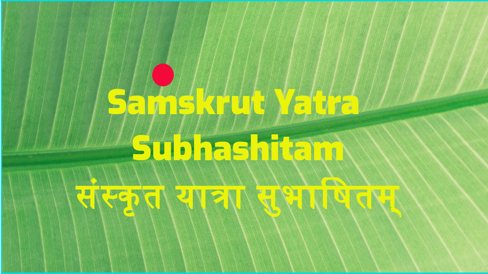{ width="200" }

    ### [संस्कृत सुभाषितम्](samskrutyatra/sanskrit-subhashitas-1.md)
    
    **Read time:** 5 min
    
    EXCERPT Not Found

- { width="200" }

    ### [शंकराय मंगलं](samskrutyatra/shankarya-mangalam.md)
    
    **Read time:** 5 min
    
    शंकराय शंकराय शंकराय मंगलम ।     शंकरा मनोहराय शाश्वताय मंगलम् ॥     सुंदरेश मंगलं सनातनाय मंगलम्।     चिन्मयाय सन्मयाय तन्मयाय मंगलम् ॥
    

- { width="200" }

    ### [शान्तिपाठः](samskrutyatra/shanti-paath.md)
    
    **Read time:** 7 min
    
    Various Shanti Paatha from different Vedas are included here.

- { width="200" }

    ### [शिव जयजयकार स्तोत्रं](samskrutyatra/shiv-jai-jai-kaar.md)
    
    **Read time:** 5 min
    
    EXCERPT Not Found
    

- { width="200" }

    ### [श्रीशिवमहिम्नस्तोत्र](samskrutyatra/shiv-mahimnstotra.md)
    
    **Read time:** 13 min
    
    ॐ वन्दे देव उमापतिं सुरगुरुं, वन्दे जगत्कारणम् ।      वन्दे पन्नगभूषणं मृगधरं, वन्दे पशूनां पतिम् ॥ 

- { width="200" }

    ### [शिवतांडवस्तोत्रं](samskrutyatra/shiv-tandava-stotram.md)
    
    **Read time:** 5 min
    
    EXCERPT Not Found
    

- { width="200" }

    ### [शिवषडाक्षर स्तोत्रं](samskrutyatra/shiva-shadakshara-stotram.md)
    
    **Read time:** 5 min
    
    ॐकारं बिंदुसंयुक्तं नित्यं ध्यायंति योगिनः ।    कामदं मोक्षदं चैव ॐकाराय नमो नमः ॥

- { width="200" }

    ### [शिवमानसपूजा](samskrutyatra/shivmaanaspooja.md)
    
    **Read time:** 5 min
    
    रत्नैः कल्पितमासनं हिमजलैः स्नानं च दिव्याम्बरं    नानारत्नविभूषितं मृगमदामोदाङ्कितं चन्दनम् ।    जातीचम्पकबिल्वपत्ररचितं पुष्पं च धूपं तथा    दीपं दे
    

- { width="200" }

    ### [श्रीदुर्गामानस-पूजा](samskrutyatra/shri-durga-manas-puja.md)
    
    **Read time:** 6 min
    
    EXCERPT Not Found

- 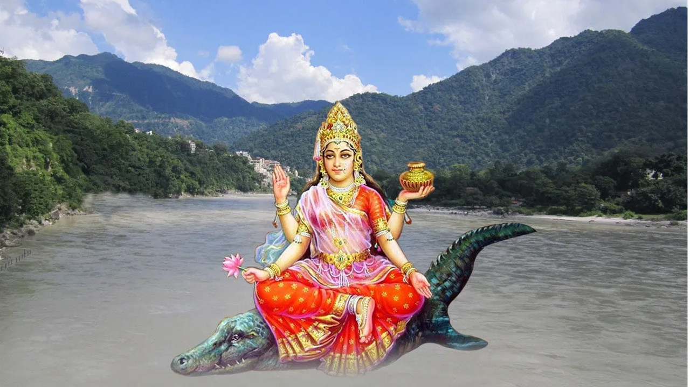{ width="200" }

    ### [श्री गंगा स्तोत्रम](samskrutyatra/shri-ganga-stotram.md)
    
    **Read time:** 5 min
    
    EXCERPT Not Found
    

- { width="200" }

    ### [श्रीगुरु-प्रार्थना](samskrutyatra/shri-guru-prarthana.md)
    
    **Read time:** 5 min
    
    EXCERPT Not Found

- { width="200" }

    ### [हनुमान सहस्त्रनामावली](samskrutyatra/shri-hanuman-sahasranamam.md)
    
    **Read time:** 66 min
    
    EXCERPT Not Found
    

- { width="200" }

    ### [श्री काल भैरव अष्टकम्‌](samskrutyatra/shri-kaal-bhairav-ashta.md)
    
    **Read time:** 5 min
    
    EXCERPT Not Found

- 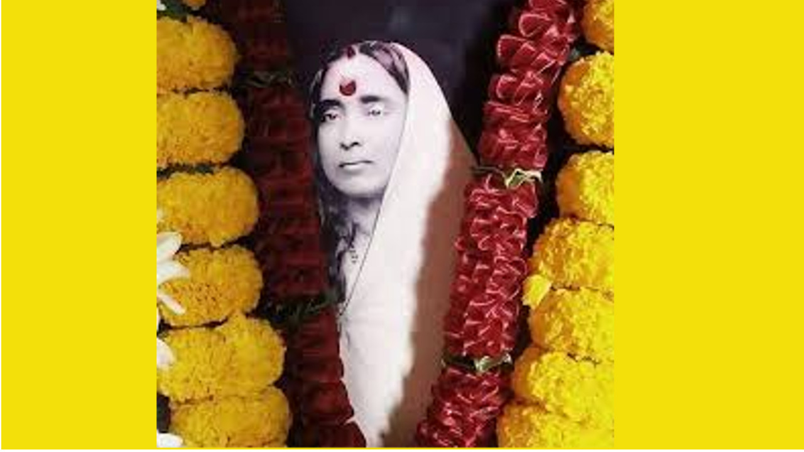{ width="200" }

    ### [॥श्रीसारदास्तवं ॥](samskrutyatra/shri-sarada-stava.md)
    
    **Read time:** 5 min
    
    प्रकृतिं परमामभयां वरदां नररूपधरां जनतापहराम्।  शरणागतसेवकतोषकरीं प्रणमामि परां जननीं जगताम्॥
    

- { width="200" }

    ### [श्रीशिवपञ्चाक्षरस्तोत्रम्](samskrutyatra/shri-shivpanchaakshari-stotram.md)
    
    **Read time:** 5 min
    
    EXCERPT Not Found

- { width="200" }

    ### [श्रीहनुमत्सूक्तम्](samskrutyatra/shrihanumatsuktam.md)
    
    **Read time:** 5 min
    
    EXCERPT Not Found
    

- { width="200" }

    ### [श्रीसूक्तम्](samskrutyatra/shrisuktam.md)
    
    **Read time:** 5 min
    
    EXCERPT Not Found

- { width="200" }

    ### [श्वेताश्वतरोपनिषत्](samskrutyatra/shvetashvatara-upanishad.md)
    
    **Read time:** 24 min
    
    EXCERPT Not Found
    

- { width="200" }

    ### [सन्यासी का गीत (संस्कृतं)](samskrutyatra/song-of-sanyasi-sanskrit.md)
    
    **Read time:** 7 min
    
    EXCERPT Not Found

- { width="200" }

    ### [सन्यासी का गीत](samskrutyatra/song-of-sanyasi.md)
    
    **Read time:** 10 min
    
    EXCERPT Not Found
    

- { width="200" }

    ### [श्री मदन मोहन अष्टकम](samskrutyatra/sri-madana-mohana-ashtakam.md)
    
    **Read time:** 5 min
    
    जय शंखगदाधर नीलकलेवर पीतपटाम्बर देहि पदम् । जय चन्दनचर्चित कुण्डलमण्डित कौस्तुभशोभित देहि पदम् ॥ 

- { width="200" }

    ### [सुन्दरकांड ध्यान श्लोकं](samskrutyatra/sundarkand-dhyanam.md)
    
    **Read time:** 5 min
    
    EXCERPT Not Found
    

- { width="200" }

    ### [तैत्तिरीयोपनिषत् सस्वरा - तृतीया भृगुवल्ली](samskrutyatra/taitriya-upnishad-bhrugu-valli.md)
    
    **Read time:** 9 min
    
    EXCERPT Not Found

- { width="200" }

    ### [तैत्तिरीयोपनिषत् सस्वरा - द्वितीया ब्रह्मानन्दवल्ली](samskrutyatra/taitriya-upnishad-brahmananda-valli.md)
    
    **Read time:** 11 min
    
    EXCERPT Not Found
    

- { width="200" }

    ### [तैत्तिरीयोपनिषत् सस्वरा - प्रथमा शीक्षावल्ली](samskrutyatra/taitriya-upnishad-sheeksha-valli.md)
    
    **Read time:** 12 min
    
    EXCERPT Not Found

- { width="200" }

    ### [तन्त्रोक्तं देविसूक्तम्](samskrutyatra/tantroktam-devisuktam.md)
    
    **Read time:** 5 min
    
    EXCERPT Not Found
    

- 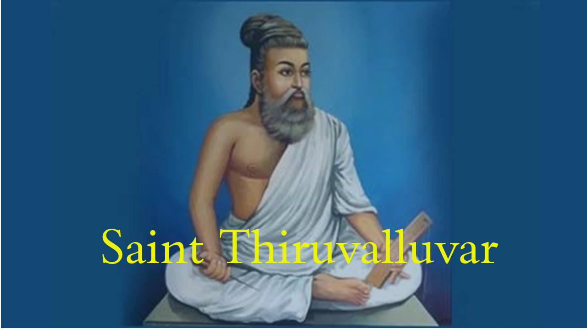{ width="200" }

    ### [तिरुक्कूरळ हिन्दी अनुवाद](samskrutyatra/thirukkural-complete-in-hindi.md)
    
    **Read time:** 52 min
    
    There are at least 19 translations of the Kural in Hindi. The first translation was probably that of Khenand Rakat, published in 1924. The University 

- { width="200" }

    ### [तिरुक्कूरळ](samskrutyatra/thirukkural-in-hindi-chapter-06-10-with-chanting.md)
    
    **Read time:** 8 min
    
    तिरुक्कुरल के तीन भाग हैं- धर्म, अर्थ और काम । उनमें क्र्मशः 38, 70 और 25 अध्याय हैं । हर एक अध्याय में 10 ‘कुरल’ के हिसाब से समूचे ग्रंथ के 133 अध्या
    

- { width="200" }

    ### [तिरुक्कूरळ Chapter 1-5](samskrutyatra/thirukkural-in-hindi-chapter-1-to-5.md)
    
    **Read time:** 9 min
    
    EXCERPT Not Found

- { width="200" }

    ### [Thirukkural Summary in Hindi](samskrutyatra/thirukkural-summary-in-hindi.md)
    
    **Read time:** 5 min
    
    EXCERPT Not Found
    

- 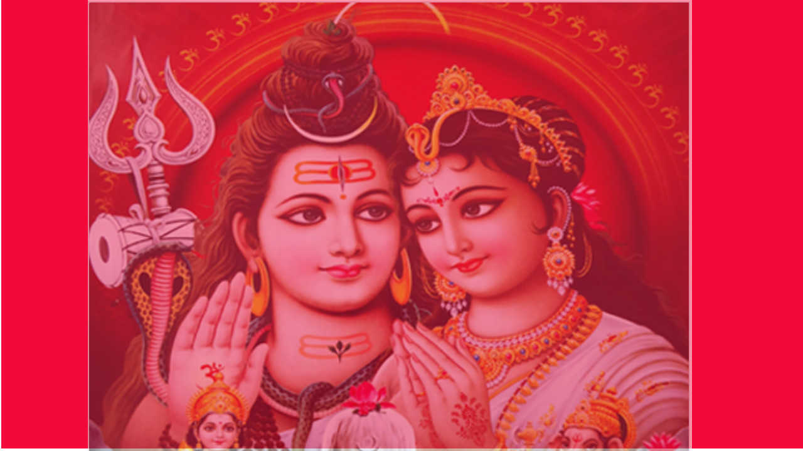{ width="200" }

    ### [उमामहेश्वर स्तोत्रं](samskrutyatra/uma-maheshwara-stotram.md)
    
    **Read time:** 5 min
    
    नमः शिवाभ्यां नवयौवनाभ्यां परस्पराश्लिष्टवपुर्धराभ्यां | नगेन्द्रकन्यावृषकेतनाभ्यां नमो नमः शङ्करपार्वतीभ्यां ||

- { width="200" }

    ### [उपनिषदिय प्रार्थना](samskrutyatra/upnishadic-prarthana.md)
    
    **Read time:** 5 min
    
    Various Prarthans inspired from Upanishdic Thoughts
    

- { width="200" }

    ### [वाक्सूक्तम्](samskrutyatra/vaak-suktam.md)
    
    **Read time:** 5 min
    
    EXCERPT Not Found

- { width="200" }

    ### [वैराग्यशतकम्](samskrutyatra/vairagyashatakam.md)
    
    **Read time:** 32 min
    
    EXCERPT Not Found
    

- { width="200" }

    ### [विज्ञान भैरव तंत्र के सूत्र](samskrutyatra/vigyan-bhairav-tantra.md)
    
    **Read time:** 90 min
    
    EXCERPT Not Found

- { width="200" }

    ### [विकटकविः](samskrutyatra/vikatkavi.md)
    
    **Read time:** 5 min
    
    EXCERPT Not Found
    

- { width="200" }

    ### [धर्म](samskrutyatra/vipasana-dohe-dharma.md)
    
    **Read time:** 6 min
    
    जागो लोगों जगत के बीती काली रात,   हुआ उजाला धर्म का मंगल हुआ प्रभात ।

- { width="200" }

    ### [मन](samskrutyatra/vipasana-dohe-manas.md)
    
    **Read time:** 11 min
    
    मन ही दुर्जन मन सुजन मन बैरी मन मीत,    मन सुधरे सब सुधरे हैं कर मन पवन पुनीत । 
    

- { width="200" }

    ### [श्रीविष्णुसहस्रनामस्तोत्रम्](samskrutyatra/vishnu-sahasranaam.md)
    
    **Read time:** 37 min
    
    EXCERPT Not Found

- { width="200" }

    ### [विष्णुसूक्तम्](samskrutyatra/vishnusuktam.md)
    
    **Read time:** 5 min
    
    EXCERPT Not Found
    

- { width="200" }

    ### [Work of Rajiv Dixit](samskrutyatra/work-of-rajiv-dixit.md)
    
    **Read time:** 8 min
    
    EXCERPT Not Found

- { width="200" }

    ### [याज्ञवल्क्योपनिषत्](samskrutyatra/yaagyavalkyopnishad.md)
    
    **Read time:** 9 min
    
    EXCERPT Not Found
    

- { width="200" }

    ### [यक्षप्रश्ना:](samskrutyatra/yaksha-prashna.md)
    
    **Read time:** 5 min
    
    EXCERPT Not Found

