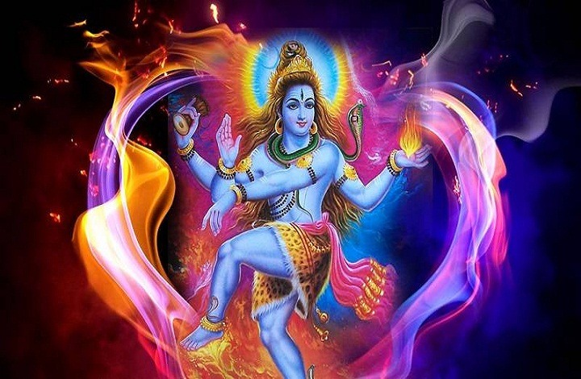

# Welcome to Samskrut Yatra Blog

## My Journey in Samskrut - [Samskrut Yatra](/samskrutyatra-home) and introduction to this dimensions of life.

- { width="200" }

    ### [Guyagita - गुहगीता](guha-geeta.md)
    
    **Read time:** 48 min
    
    अथ प्रथमोऽध्यायः मनोविकारः विप्रा ऊचुः- सूतपुत्र महाप्राज्ञ कथकोऽसि दयाकर । गुहगीतां च नो वक्तुं त्वमेवार्हसि चानघ ॥ १.१॥ सूत उवाच- कुतुकी गुहगीतायाः 

- { width="200" }

    ### [Hanuman Sahsranamavali - हनुमान सहस्त्रनामावली](shri-hanuman-sahasranamam.md)
    
    **Read time:** 66 min
    
    1. हनुमान्: – विशाल और टेढी ठुड्डी वाले । 2. श्रीप्रद: – शोभा प्रदन करने वाले । 3. वायुपुत्र: – वायु के पुत्र 4. रुद्र: – जो रुद्र के अवतार हैं (हनुमा
    

- { width="200" }

    ### [Vijnana Bhairava Tantra Sutras - विज्ञान भैरव तंत्र के सूत्र](vigyan-bhairav-tantra.md)
    
    **Read time:** 90 min
    
    माता पार्वती के यह प्रश्न पूछने पर की ” ईश्वर कौन है” और “क्या है ?” भगवन शंकर उन्हें सीधे उत्तर न देके निम्नलिखित विधियां बताते है, जोकि ११२ है। किसी

- { width="200" }

    ### [Lalitasahasranamam with Meaning - ललितासहस्रनामं](lalitasaharanam-with-meaning.md)
    
    **Read time:** 74 min
    
    Meaning of lalitasahasranama in English
    

- { width="200" }

    ### [Song of Sanyasi - सन्यासी का गीत (संस्कृतं)](song-of-sanyasi-sanskrit.md)
    
    **Read time:** 7 min
    
    Song of Sanyasi by Swami Vivekananda उत्तिष्ठ स्वरः तस्य संगीतं यस्य जन्मः दूरे अभवत् यस्य संसारमलं न स्पर्शं शक्नोति गिरिं कंदरां एवं सघनवनस्य वंजरभू

- { width="200" }

    ### [Bhajan without Text](bhajan-without-text.md)
    
    **Read time:** 5 min
    
    Multiple Bhajans without Text
    

- { width="200" }

    ### [चाणक्य जीवनस्य (लघुकथा:)](chanakya-jivanasya-katha.md)
    
    **Read time:** 5 min
    
    चाणक्य इति आसीत् सः चन्द्रगुप्तमौर्यस्य मंत्री आसीत् एकः चोरः आसीत् सः चिन्तवान चाणक्य समीपे बहु धनं अस्ति सः चाणक्यस्य धनं चौर्यार्थं तस्य गृहे गतवान

- { width="200" }

    ### [संस्कृत प्रश्नोत्तर भाग-1](sanskrit-question-answers.md)
    
    **Read time:** 5 min
    
    यदि भवतः गृहे विवाह कार्यं अस्ति तर्हि किं किं कार्यं करोति अहं मित्रं निमंत्रणं प्रेस्यामि आपणात् बहु बहु पदार्थं आनायति भवान् किमर्थं संस्कृतं पठति 
    

- { width="200" }

    ### [कर्मकर्याः दण्डं (लघुकथा:)](punishment-of-enjoyment.md)
    
    **Read time:** 5 min
    
    एकः महाराज: आसीत् । एका कर्मकरी आसीत्। सा प्रतिदिने महराजस्य प्रकोष्ठं स्वच्छं करोति। सा प्रतिदिने पुष्पै सुगन्धै कृते प्रकोष्ठं स्वच्छं करोति। राजा प

- { width="200" }

    ### [मदनमोहन मालवीय: (लघुकथा:)](madanmohal-malviya-sanskrit-katha.md)
    
    **Read time:** 5 min
    
    मदनमोहन मालवीय: (लघुकथा:) अद्यतन कथा एकः महानव्यक्तेः जीवनआधारितं अस्ति। तस्य नामः मदनमोहनमालवीयःअस्ति। तस्य जीवने एक रोचक घटना घटिता। सः बनारस हिन्दु
    

- { width="200" }

    ### [गमानुगतः लोकव्यवहारः (लघुकथा:)](gamanugat-lokvyavhar.md)
    
    **Read time:** 5 min
    
    एकः ग्रामं अस्ति। ग्रामे एकः भिक्षु वसति। सः प्रतिदिनं भिक्षाटनं करोति। किं वदति। भवती भिक्षां देही। ग्रामं महिलायाः प्रतिदिनं वस्त्रं भोजनं पणकं दद्म

- { width="200" }

    ### [Work of Rajiv Dixit](work-of-rajiv-dixit.md)
    
    **Read time:** 8 min
    
     This list highlights the major contributions of Rajiv Dixit Ji, a renowned orator and scholar
    

- { width="200" }

    ### [सनातन संस्कृति एवं षडयंत्र](hindu-festivals-and-conspiracy.md)
    
    **Read time:** 5 min
    
    जरा इन पर विचार करें यदि मातृनवमी थी, तो मदर्स डे क्यों लाया गया ? यदि कौमुदी महोत्सव था, तो वेलेंटाइन डे क्यों लाया गया ? यदि गुरुपूर्णिमा थी, तो टीच

- { width="200" }

    ### [Gayatri Sahasranama - श्री गायत्री सहस्रनामस्तोत्रं](gayatri-sahasranama.md)
    
    **Read time:** 26 min
    
    Gayatri Sahasranama श्री गायत्री सहस्रनामस्तोत्रं देवी भागवतांतर्गत नारद उवाच – भगवन्-सर्वधर्मज्ञ, सर्व शास्त्र विशारद । श्रुति-स्मृति-पुराणानां, रहस्
    

- { width="200" }

    ### [लघुकथा: सेतुः निर्माणं](building-a-bridge.md)
    
    **Read time:** 5 min
    
    कश्चन निर्धनः विद्वान् चलन् प्रतिवेशि राज्यं प्राप्तवान्। संयोगेन तस्मिन् दिने तत्र हस्तिपटबन्धनसमारोहः निरुह्यते स्म। तत्र कस्यचन हस्तिनः तुण्डायां म

- { width="200" }

    ### [Upnishadic Prarthana - उपनिषदिय प्रार्थना](upnishadic-prarthana.md)
    
    **Read time:** 5 min
    
    Various Prarthans inspired from Upanishdic Thoughts
    

- { width="200" }

    ### [Sundarkand Dhyanam - सुन्दरकांड ध्यान श्लोकं](sundarkand-dhyanam.md)
    
    **Read time:** 60 min
    
    शान्तं शाश्वतमप्रमेयमनघं निर्वाणशान्तिप्रदं ब्रह्माशम्भुफणीन्द्रसेव्यमनिशं वेदान्तवेद्यं विभुम्‌। रामाख्यं जगदीश्वरं सुरगुरुं मायामनुष्यं हरिं वन्देऽह

- { width="200" }

    ### [NamamishMisan - नमामीशमीसान निर्वाणरूपं](namamishmishan-nirvan-roopam.md)
    
    **Read time:** 5 min
    
    नमामीशमीशान निर्वाणरूपं। विभुं व्यापकं ब्रह्मवेदस्वरूपम्।।निजं निर्गुणं निर्विकल्पं निरीहं। चिदाकाशमाकाशवासं भजेऽहं।।
    

- { width="200" }

    ### [Maheshwara Sutrani - माहेश्वर सूत्र](maheshwara-sutrani.md)
    
    **Read time:** 5 min
    
    माहेश्वर सूत्र ## Maheshwara Sutrani Maheshwar Sutrani is the foundation of Panini’s Astha-Adhyayi. It has 14 sutras, they are mentioned below. I have

- { width="200" }

    ### [Hanuman Ashtakam - संकटमोचन हनुमानाष्टकम्](hanuman-ashtakam.md)
    
    **Read time:** 5 min
    
    Hanuman Ashtakam बाल समय रबि भक्षि लियो तब, तीनहुँ लोक भयो अँधियारो । ताहि सों त्रास भयो जग को, यह संकट काहु सों जात न टारो ॥ देवन आन करि बिनती तब, छा
    

- { width="200" }

    ### [Bajarang Baan  - बजरंग बाण](bajarang-baan.md)
    
    **Read time:** 5 min
    
    बाल समय रवि भक्ष लियो तब तीनहुं लोक भयो अंधियारो।    ताहि सों त्रास भयो जग को यह संकट काहु सों जात न टारो॥ 

- { width="200" }

    ### [Namaste Sada Vatsale - नमस्ते सदा वत्सले](namaste-sada-vatsale.md)
    
    **Read time:** 5 min
    
    Namaste Sada Vatsale नमस्ते सदा वत्सले मातृभूमे त्वया हिन्दुभूमे सुखं वर्धितोऽहम् । महामङ्गले पुण्यभूमे त्वदर्थे पतत्वेष कायो नमस्ते नमस्ते ।।१।। प्रभ
    

- { width="200" }

    ### [Devi SidhaKunjiKa Stotram - सिद्धकुञ्जिकास्तोत्रम्](devi-sidhakunjika-stotram.md)
    
    **Read time:** 5 min
    
    EXCERPT Not Found

- { width="200" }

    ### [Durga DwaTrimShan NamaMaalaa - अथ दुर्गाद्वात्रिंशन्नाममाला](durga-dwatrimshan-namamaalaa.md)
    
    **Read time:** 5 min
    
    Durga DwaTrimShan NamaMaalaa दुर्गा दुर्गार्तिशमनी दुर्गापद्विनिवारिणी। दुर्गमच्छेदिनी दुर्गसाधिनी दुर्गनाशिनी॥ दुर्गतोद्धारिणी दुर्गनिहन्त्री दुर्गमा
    

- { width="200" }

    ### [Shri Durga Manas Puja - श्रीदुर्गामानस-पूजा](shri-durga-manas-puja.md)
    
    **Read time:** 6 min
    
    Shri Durga Manas Puja उद्यच्चन्दनकुङ्कुमारुण पयोधाराभिराप्लावितां नानानर्घ्यमणिप्रवालघटितां दत्तां गृहाणाम्बिके। आमृष्टां सुरसुन्दरीभिरभितो हस्ताम्बुज

- { width="200" }

    ### [Devi Vaikrutikam Rahashyam - वैकृतिकं रहस्यम्](devi-vaikrutikam-rahashy.md)
    
    **Read time:** 6 min
    
    Devi Vaikrutikam Rahashyam ऋषिरुवाच ॐ त्रिगुणा तामसी देवी सात्त्विकी या त्रिधोदिता। सा शर्वा चण्डिका दुर्गा भद्रा भगवतीर्यते॥१॥ योगनिद्रा हरेरुक्ता मह
    

- { width="200" }

    ### [Devi Murti Rahasyam - मूर्तिरहस्यम्](devi-murti-rahasyam.md)
    
    **Read time:** 5 min
    
    Devi Murti Rahasyam ऋषिरुवाच ॐ नन्दा भगवती नाम या भविष्यति नन्दजा। स्तुता सा पूजिता भक्त्या वशीकुर्याज्जगत्त्रयम्॥१॥ कनकोत्तमकान्तिः सा सुकान्तिकनकाम्

- { width="200" }

    ### [Devi Prahanikam Rahasyam - प्राधानिकं रहस्यम्](devi-praahanikam-rahasyam.md)
    
    **Read time:** 5 min
    
    Devi Praahanikam Rahasyam ॥विनियोगः॥ ॐ अस्य श्रीसप्तशतीरहस्यत्रयस्य नारायण ऋषिरनुष्टुप्छन्दः, महाकालीमहालक्ष्मीमहासरस्वत्यो देवता यथोक्तफलावाप्त्यर्थं
    

- { width="200" }

    ### [Durga Saptashati Chapter 13 - श्रीदुर्गासप्तशती - त्रयोदशोऽध्यायः](durga-saptashati-chapter13.md)
    
    **Read time:** 5 min
    
    Durga Saptashati Chapter13 ## सुरथ और वैश्य को देवी का वरदान ध्यानम् ॐ बालार्कमण्डलाभासां चतुर्बाहुं त्रिलोचनाम्। पाशाङ्‌कुशवराभीतीर्धारयन्तीं शिवां भ

- { width="200" }

    ### [Durga Saptashati Chapter 12 - श्रीदुर्गासप्तशती - द्वादशोऽध्यायः](durga-saptashati-chapter12.md)
    
    **Read time:** 7 min
    
    Durga Saptashati Chapter12 ## देवी-चरित्रों के पाठ का माहात्म्य ॥ध्यानम्॥ ॐ विद्युद्दामसमप्रभां मृगपतिस्कन्धस्थितां भीषणां कन्याभिः करवालखेटविलसद्धस्त
    

- { width="200" }

    ### [Durga Saptashati Chapter 11 - श्रीदुर्गासप्तशती -एकादशोऽध्यायः](durga-saptashati-chapter11.md)
    
    **Read time:** 9 min
    
    Durga Saptashati Chapter 11 ## देवताओं द्वारा देवी की सतुति तथा देवी द्वारा देवताओं को वरदान ॥ध्यानम्॥ ॐ बालरविद्युतिमिन्दुकिरीटां तुङ्‌गकुचां नयनत्रय

- { width="200" }

    ### [Durga Saptashati Chapter 10 - श्रीदुर्गासप्तशती दशमोऽध्यायः शुम्भ वध](durga-saptashati-chapter10.md)
    
    **Read time:** 5 min
    
    Durga Saptashati Chapter10 ## शुम्भ वध ध्यानम् ॐ उत्तप्तहेमरुचिरां रविचन्द्रवह्नि- नेत्रां धनुश्शरयुताङ्‌कुशपाशशूलम्। रम्यैर्भुजैश्‍च दधतीं शिवशक्तिरू
    

- { width="200" }

    ### [Durga Saptashati Chapter 9 - श्रीदुर्गासप्तशती - नवमोऽध्यायः](durga-saptashati-chapter9.md)
    
    **Read time:** 7 min
    
    Durga Saptashati Chapter9 ## निशुम्भ-वध ॥ध्यानम्॥ ॐ बन्धूककाञ्चननिभं रुचिराक्षमालां पाशाङ्कुशौ च वरदां निजबाहुदण्डैः। बिभ्राणमिन्दुशकलाभरणं त्रिनेत्र-

- { width="200" }

    ### [Durga Saptashati Chapter 8 - श्रीदुर्गासप्तशती - अष्टमोऽध्यायः](durga-saptashati-chapter8.md)
    
    **Read time:** 10 min
    
    Durga Saptashati Chapter8 ## रक्तबीज-वध ध्यानम् ॐ अरुणां करुणातरङ्‌गिताक्षीं धृतपाशाङ्‌कुशबाणचापहस्ताम्। अणिमादिभिरावृतां मयूखै- रहमित्येव विभावये भवा
    

- { width="200" }

    ### [Durga Saptashati Chapter 7 - श्रीदुर्गासप्तशती - सप्तमोऽध्यायः](durga-saptashati-chapter7.md)
    
    **Read time:** 5 min
    
    Durga Saptashati Chapter7 ## चण्ड और मुण्डका वध ध्यानम् ॐ ध्यायेयं रत्‍नपीठे शुककलपठितं शृण्वतीं श्यामलाङ्‌गीं न्यस्तैकाङ्‌घ्रिं सरोजे शशिशकलधरां वल्ल

- { width="200" }

    ### [Durga Saptashati Chapter 6 - श्रीदुर्गासप्तशती - षष्ठोऽध्यायः](durga-saptashati-chapter6.md)
    
    **Read time:** 5 min
    
    Durga Saptashati Chapter6 ## धूम्रलोचन-वध ॥ध्यानम्॥ ॐ नागाधीश्‍वरविष्टरां फणिफणोत्तंसोरुरत्‍नावली- भास्वद्देहलतां दिवाकरनिभां नेत्रत्रयोद्भासिताम्। मा
    

- { width="200" }

    ### [Durga Saptashati Chapter 5 - श्रीदुर्गासप्तशती - पञ्चमोऽध्यायः](durga-saptashati-chapter5.md)
    
    **Read time:** 14 min
    
    Durga Saptashati Chapter5 ## देवताओं द्वारा देवी की स्तुति, चण्ड-मुण्डके मुख से अम्बिका के रूप की प्रशंसा सुनकर शुम्भ का उनके पास दूत भेजना और दूत का 

- { width="200" }

    ### [Durga Saptashati Chapter 4 - श्रीदुर्गासप्तशती - चतुर्थोऽध्यायः](durga-saptashati-chapter4.md)
    
    **Read time:** 9 min
    
    Durga Saptashati Chapter4 ## इन्द्रादि देवताओं द्वारा देवी की स्तुति ध्यानम् ॐ कालाभ्राभां कटाक्षैररिकुलभयदां मौलिबद्धेन्दुरेखां शड्‌खं चक्रं कृपाणं त
    

- { width="200" }

    ### [Durga Saptashati Chapter 3 - श्रीदुर्गासप्तशती - तृतीयोऽध्यायः](durga-saptashati-chapter3.md)
    
    **Read time:** 7 min
    
    Durga Saptashati Chapter3 ## सेनापतियोंसहित महिषासुर का वध ॥ध्यानम्॥ ॐ उद्यद्भानुसहस्रकान्तिमरुणक्षौमां शिरोमालिकां रक्तालिप्तपयोधरां जपवटीं विद्यामभी

- { width="200" }

    ### [Durga Saptashati Chapter 2 - श्रीदुर्गासप्तशती - द्वितीयोऽध्यायः](durga-saptashati-chapter2.md)
    
    **Read time:** 12 min
    
    Durga Saptashati Chapter2 ## देवताओं के तेज से देवी का प्रादुर्भाव और महिषासुर की सेना का वध ॥विनियोगः॥ ॐ मध्यमचरित्रस्य विष्णुर्ऋषिः, महालक्ष्मीर्देव
    

- { width="200" }

    ### [Durga Saptashati Chapter 1 - श्रीदुर्गासप्तशती - प्रथमोऽध्यायः](durga-saptashati-chapter1.md)
    
    **Read time:** 14 min
    
    Durga Saptashati Chapter1 ## मेधा ऋषि का राजा सुरथ और समाधि को भगवती की महिमा बताते हुए मधु-कैटभ-वध का प्रसंग सुनाना ॥विनियोगः॥ ॐ प्रथमचरित्रस्य ब्रह्

- { width="200" }

    ### [Song of Sanyasi  - सन्यासी का गीत](song-of-sanyasi.md)
    
    **Read time:** 10 min
    
    Song of Sanyasi by Swami Vivekananda जगाओ स्वर! उस गीत के जो जन्मा दूर कहीं है,वहां जहां सांसारिक मल पहुंच न सके, गिरि कंदरा और वनों की बंजर भूमिपर, ज
    

- { width="200" }

    ### [Jai Sagun Nirgun Roop  - जय सगुन निर्गुन रूप](jai-sagun-nirgun-roop.md)
    
    **Read time:** 5 min
    
    Kakbushandi (Crow Sage) says to Bainteya (King of birds) that at the time of Coronation of Rama in Ayodhya Vedas came in the form of birds and recited

- { width="200" }

    ### [Shvetashvatara Upanishad - श्वेताश्वतरोपनिषत्](shvetashvatara-upanishad.md)
    
    **Read time:** 24 min
    
    Shvetashvatara Upanishad ॐ सहनाववतु । सह नौ भुनक्तु । सह वीर्यं करवावहै । तेजस्वि नावधीतमस्तु । मा विद्विषावहै ॥ ॐ शान्तिः शान्तिः शान्तिः ॥ श्वेताश्व
    

- { width="200" }

    ### [Mundakoupnishad  - मुण्डकोपनिषत्](mundakoupnishad.md)
    
    **Read time:** 16 min
    
    Mundakoupnishad ॐ भद्रं कर्णेभिः श्रुणुयाम देवा भद्रं पश्येमाक्षभिर्यजत्राः । स्थिरैरङ्गैस्तुष्टुवाꣳसस्तनूभिर्व्यशेम देवहितं यदायुः । स्वस्ति न इन्द्र

- { width="200" }

    ### [Chandogyopnishad 8 - छान्दोग्योपनिषत् अष्टमोऽध्यायः](chandogyopnishad-8.md)
    
    **Read time:** 23 min
    
    Chandogyopnishad 8 अथ यदिदमस्मिन्ब्रह्मपुरे दहरं पुण्डरीकं वेश्म दहरोऽस्मिन्नन्तराकाशस्तस्मिन्यदन्तस्तदन्वेष्टव्यं तद्वाव विजिज्ञासितव्यमिति ॥ ८.१.१॥ 
    

- { width="200" }

    ### [Chandogyopnishad 7 - छान्दोग्योपनिषत् सप्तमोऽध्यायः](chandogyopnishad-7.md)
    
    **Read time:** 23 min
    
    Chandogyopnishad 7 अधीहि भगव इति होपससाद सनत्कुमारं नारदस्तꣳ होवाच यद्वेत्थ तेन मोपसीद ततस्त ऊर्ध्वं वक्ष्यामीति स होवाच ॥ ७.१.१॥ ऋग्वेदं भगवोऽध्येमि 

- { width="200" }

    ### [Chandogyopnishad 6 - छान्दोग्योपनिषत् षष्ठोऽध्यायः](chandogyopnishad-6.md)
    
    **Read time:** 19 min
    
    Chandogyopnishad 6 श्वेतकेतुर्हारुणेय आस तꣳ ह पितोवाच श्वेतकेतो वस ब्रह्मचर्यं न वै सोम्यास्मत्कुलीनोऽननूच्य ब्रह्मबन्धुरिव भवतीति ॥ ६.१.१॥ स ह द्वादश
    

- { width="200" }

    ### [Chandogyopnishad 5 - छान्दोग्योपनिषत् पञ्चमोऽध्यायः](chandogyopnishad-5.md)
    
    **Read time:** 26 min
    
    Chandogyopnishad 5 यो ह वै ज्येष्ठं च श्रेष्ठं च वेद ज्येष्ठश्च ह वै श्रेष्ठश्च भवति प्राणो वाव ज्येष्ठश्च श्रेष्ठश्च ॥ ५.१.१॥ यो ह वै वसिष्ठं वेद वसि

- { width="200" }

    ### [Chandogyopnishad 4 - छान्दोग्योपनिषत् चतुर्थोऽध्यायः](chandogyopnishad-4.md)
    
    **Read time:** 22 min
    
    Chandogyopnishad 4 जानश्रुतिर्ह पौत्रायणः श्रद्धादेयो बहुदायी बहुपाक्य आस स ह सर्वत आवसथान्मापयांचक्रे सर्वत एव मेऽन्नमत्स्यन्तीति ॥ ४.१.१॥ अथ हꣳसा नि
    

- { width="200" }

    ### [Chandogyopnishad 3 - छान्दोग्योपनिषत् तृतीयोऽध्यायः](chandogyopnishad-3.md)
    
    **Read time:** 22 min
    
    Chandogyopnishad 3 असौ वा आदित्यो देवमधु तस्य द्यौरेव तिरश्चीनवꣳशोऽन्तरिक्षमपूपो मरीचयः पुत्राः ॥ ३.१.१॥ तस्य ये प्राञ्चो रश्मयस्ता एवास्य प्राच्यो मध

- { width="200" }

    ### [Chandogyopnishad 2 - छान्दोग्योपनिषत् द्वितीयोऽध्यायः](chandogyopnishad-2.md)
    
    **Read time:** 20 min
    
    Chandogyopnishad 2 समस्तस्य खलु साम्न उपासनꣳ साधु यत्खलु साधु तत्सामेत्याचक्षते यदसाधु तदसामेति ॥ २.१.१॥ तदुताप्याहुः साम्नैनमुपागादिति साधुनैनमुपागाद
    

- { width="200" }

    ### [Chandogyopnishad 1 - छान्दोग्योपनिषत्](chandogyopnishad-1.md)
    
    **Read time:** 25 min
    
    Chandogyopnishad 1 ॥ अथ छान्दोग्योपनिषत् ॥ ॐ आप्यायन्तु ममाङ्गानि वाक्प्राणश्च्क्षुः श्रोत्रमथो बलमिन्द्रियाणि च सर्वाणि । सर्वं ब्रह्मौपनिषदं माहं ब्

- { width="200" }

    ### [Mandukyopnishad  - माण्डूक्योपनिषत्](mandukyopnishad.md)
    
    **Read time:** 5 min
    
    ओमित्येतदक्षरमिदग्ं सर्वं तस्योपव्याख्यानं भूतं भवद्भविष्यदिति सर्वमोङ्कार एव।  यच्चान्यत् त्रिकालातीतं तदप्योङ्कार एव ॥१॥ 
    

- { width="200" }

    ### [Jai Raama Sobha Dham - जय राम सोभा धाम](jai-raama-sobha-dham.md)
    
    **Read time:** 5 min
    
    जय राम सोभा धाम। दायक प्रनत बिश्राम॥   धृत त्रोन बर सर चाप। भुजदंड प्रबल प्रताप॥

- { width="200" }

    ### [Jai Raama Sada Sada Sukhdham Hare - जय राम सदा सुखधाम](jai-raama-sada-sada-sukhdham-hare.md)
    
    **Read time:** 5 min
    
    जय राम सदा सुखधाम हरे। रघुनायक सायक चाप धरे।।   भव बारन दारन सिंह प्रभो। गुन सागर नागर नाथ बिभो।।
    

- { width="200" }

    ### [Rudraghan Paath - रुद्रघन पाठ](rudraghan-paath.md)
    
    **Read time:** 5 min
    
    I am not able to find even basic text for RudraGhana Patha so putting this image from my Mantra Pushpam book. I hope you will enjoy this. This is very

- { width="200" }

    ### [IshaaVashyopnishad  - ईशावास्योपषत्](ishaavashyopnishad.md)
    
    **Read time:** 5 min
    
    ॐ ईशा वास्यमिदꣳ सर्वं यत्किञ्च जगत्यां जगत् ।    तेन त्यक्तेन भुञ्जीथा मा गृधः कस्यस्विद्धनम् ॥
    

- { width="200" }

    ### [Naam Ramayan  - नाम रामायण](naam-ramayan.md)
    
    **Read time:** 6 min
    
    ॥ बालकाण्डम् Baala-Kaannddam ॥ शुद्धब्रह्मपरात्पर राम् ॥१॥ कालात्मकपरमेश्वर राम् ॥२॥ शेषतल्पसुखनिद्रित राम् ॥३॥ ब्रह्माद्यामरप्रार्थित राम् ॥४॥ चण्डकि

- { width="200" }

    ### [Gunasagar Nirguna Paramesha - गुणसागर निर्गुण परमेशा](gunasagar-nirguna.md)
    
    **Read time:** 5 min
    
    I will add text very soon.
    

- { width="200" }

    ### [Shrisuktam - श्रीसूक्तम्](shrisuktam.md)
    
    **Read time:** 5 min
    
    Shrisuktam ॐ हिर॑ण्यवर्णां॒ हरि॑णीं सु॒वर्ण॑रज॒तस्र॑जाम् । च॒न्द्रां हि॒रण्म॑यीं ल॒क्ष्मीं जात॑वेदो म॒ आव॑ह ॥ तां म॒ आव॑ह॒ जात॑वेदो ल॒क्ष्मीमन॑पगा॒मिन

- { width="200" }

    ### [Navgruhsuktam - नवग्रहसूक्तम्](navgruhsuktam.md)
    
    **Read time:** 7 min
    
    Navgruhsuktam ॐ शुक्लाम्बरधरं विष्णुं शशिवर्णं चतुर्भुजम्। प्रसन्नवदनम् ध्यायेत्सर्व विघ्नोपशान्तये॥ ॐ भूः ॐ भुवः॑ ॐ सुवः॑ ॐ महः॑ ॐ जनः ॐ तपः॑ ॐ स॒त्य
    

- { width="200" }

    ### [Narayanopnishad - नारायणोपनिषत्](narayanopnishad.md)
    
    **Read time:** 5 min
    
    Narayanopnishad ॐ स॒ह ना॑ववतु । स॒ह नौ॑ भुनक्तु । स॒ह वी॒र्यं॑ करवावहै । ते॒ज॒स्विना॒वधी॑तमस्तु॒ मा वि॑द्विषा॒वहै᳚ ॥ ॐ शान्तिः॒ शान्तिः॒ शान्तिः॑ ॥ ॐ 

- { width="200" }

    ### [शिव जयजयकार स्तोत्रं - शिव जयजयकार स्तोत्रं](shiv-jai-jai-kaar.md)
    
    **Read time:** 5 min
    
    EXCERPT Not Found
    

- { width="200" }

    ### [Shankarya Mangalam - शंकराय मंगलं](shankarya-mangalam.md)
    
    **Read time:** 5 min
    
    शंकराय शंकराय शंकराय मंगलम ।     शंकरा मनोहराय शाश्वताय मंगलम् ॥     सुंदरेश मंगलं सनातनाय मंगलम्।     चिन्मयाय सन्मयाय तन्मयाय मंगलम् ॥

- { width="200" }

    ### [Ramchandra Stuti  - श्री राम स्तुति:](ramchandra-stuti.md)
    
    **Read time:** 5 min
    
    नमामि भक्त वत्सलं । कृपालु शील कोमलं ॥  भजामि ते पदांबुजं । अकामिनां स्वधामदं ॥ 
    

- { width="200" }

    ### [Ramchandra Stavan - रामचन्द्र स्तवन](ramchandra-stavan.md)
    
    **Read time:** 5 min
    
    श्रीरामचंद्र कृपालु भजमन हरण भाव भय दारुणम् ।  नवकंज लोचन, कंज मुख, कर कंज, पद कन्जारुणम ॥

- { width="200" }

    ### [Parsat Pad Paavan - परसत पद पावन](parsat-pad-paavan.md)
    
    **Read time:** 5 min
    
    परसत पद पावन सोक नसावन प्रगट भई तपपुंज सही। देखत रघुनायक जन सुख दायक सनमुख होइ कर जोरि रही
    

- { width="200" }

    ### [Kenopnishad - केनोपनिषत्](kenopnishad.md)
    
    **Read time:** 7 min
    
    Kenopnishad ॐ आप्यायन्तु ममाङ्गानि वाक्प्राणश्चक्षुः श्रोत्रमथो बलमिन्द्रियाणि च सर्वाणि । सर्वं ब्रह्मौपनिषदं माऽहं ब्रह्म निराकुर्यां मा मा ब्रह्म न

- { width="200" }

    ### [Jai Raam Rama Ramanam Samanam - जय राम रमा रमनं समनं](jai-raam-rama-ramanam-samanam.md)
    
    **Read time:** 5 min
    
    जय राम रमा रमनं समनं । भव ताप भयाकुल पाहि जनम ॥  अवधेस सुरेस रमेस बिभो । सरनागत मागत पाहि प्रभो ॥
    

- { width="200" }

    ### [Jai Jai Surnayak - जय जय सुरनायक](jai-jai-surnayak.md)
    
    **Read time:** 5 min
    
    जय जय सुरनायक जन सुखदायक प्रनतपाल भगवंता।  गो द्विज हितकारी जय असुरारी सिधुंसुता प्रिय कंता।।

- { width="200" }

    ### [Durgati Naashini Durge - दुर्गतिनाशिनी दुर्गे](durgatinaashinidurge.md)
    
    **Read time:** 5 min
    
    जय दुर्गतिनाशिनी दुर्गे, माँ ज्ञान- भक्ति का वर दे ।। मम अँधियारे जीवन को, स्वर्णिम प्रकाश से भर दे ।। रिपुओं ने मुझको घेरा, बस मिल जाये आश्रय तेरा, न
    

- { width="200" }

    ### [Rigvediya DeviSuktam - देवीसूक्तम्](devi-suktam-saswara.md)
    
    **Read time:** 5 min
    
    ॥विनियोगः॥ ॐ अहमित्यष्टर्चस्य सूक्तस्य वागाम्भृणी ऋषिः, सच्चित्सुखात्मकः सर्वगतः परमात्मा देवता, द्वितीयाया ॠचो जगती, शिष्टानां त्रिष्टुप् छन्दः, देवी

- { width="200" }

    ### [AdityaHrudyam Stotram - आदित्यहृदयम् स्त्रोत्रं](aditya-hridayam-stotram.md)
    
    **Read time:** 5 min
    
    ततो युद्धपरिश्रान्तं समरे चिन्तया स्थितम्।   रावणं चाग्रतो दृष्ट्वा युद्धाय समुपस्थितम्॥
    

- { width="200" }

    ### [Sankat Mochan HanumanAshtakam  - संकटमोचन हनुमानाष्टक](sankat-mochan-hanumanasht.md)
    
    **Read time:** 5 min
    
    Sankat Mochan HanumanAshtakam गोस्वामी तुलसीदास कृत बाल समय रबि भक्षि लियो तब, तीनहुँ लोक भयो अँधियारो । ताहि सों त्रास भयो जग को, यह संकट काहु सों जा

- { width="200" }

    ### [Lakshmi Nrusimha Karavalamba Stotram - लक्ष्मीनृसिंह करावलम्ब स्तोत्र](lakshmi-nrusimha-karavalamba-stotram.md)
    
    **Read time:** 5 min
    
    श्रीमत्पयोनिधिनिकेतन चक्रपाणे भोगीन्द्रभोगमणिराजित पुण्यमूर्ते |    योगीश शाश्वत शरण्य भवाब्धिपोत लक्ष्मीनृसिंह मम देहि करावलम्बम् ||
    

- { width="200" }

    ### [Kabirdaas Dohe - कबीरदास दोहे](kabirdaas-dohe.md)
    
    **Read time:** 19 min
    
    Kabirdaas Dohe In Indian Bhakti tradition Kabirdaas holds a very unique position. Because of his efforts to unify the Hindu & Muslim community he is r

- { width="200" }

    ### [Hanuman Chalisa - हनुमान चालीसा](hanuman-chalisa.md)
    
    **Read time:** 5 min
    
    श्रीगुरु चरन सरोज रज, निज मनु मुकुरु सुधारि।    बरनऊं रघुबर बिमल जसु, जो दायकु फल चारि।।    बुद्धिहीन तनु जानिके, सुमिरौं पवन-कुमार।    बल बुद्धि बिद्
    

- { width="200" }

    ### [Guru Stotram  - गुरु स्तोत्रम्](guru-stotram.md)
    
    **Read time:** 5 min
    
    गुरुर्ब्रह्मा गुरुर्विष्णुर्गुरुर्देवो महेश्वरः ।   गुरुरेव परं ब्रह्म तस्मै श्रीगुरवे नमः ॥

- { width="200" }

    ### [Devi Kshama Prarthana - क्षमा-प्रार्थना](devi-kshama-prarthana.md)
    
    **Read time:** 5 min
    
    अपराधसहस्त्राणि क्रियन्तेऽहर्निशं मया।  दासोऽयमिति मां मत्वा क्षमस्व परमेश्‍वरि॥
    

- { width="200" }

    ### [Bhavani Ashtakam - भवान्यष्टकम्](bhavani-ashtakam.md)
    
    **Read time:** 5 min
    
    न तातो न माता न बन्धुर्न दाता न पुत्रो न पुत्री न भृत्यो न भर्ता । न जाया न विद्या न वृत्तिर्ममैव गतिस्त्वं गतिस्त्वं त्वमेका भवानि ॥१॥ भवाब्धावपारे म

- { width="200" }

    ### [Aitreyopnishad - ऐतरेयोपनिषत्](aitreyopnishad.md)
    
    **Read time:** 11 min
    
    Aitreyopnishad वाङ् मे मनसि प्रतिष्ठिता मनो मे वाचि प्रतिष्ठितमाविरावीर्म एधि ॥ वेदस्य म आणीस्थः श्रुतं मे मा प्रहासीरनेनाधीतेनाहोरात्रान् संदधाम्यृतं
    

- { width="200" }

    ### [Bhagwat Gita Chapter 18 - श्रीमद्भगवद्गीता अथाष्टादशोऽध्यायः - मोक्षसंन्यासयोगः](bhagwat-gita-chapter-18.md)
    
    **Read time:** 14 min
    
    Bhagwat Gita Chapter 18 ## अथाष्टादशोऽध्यायः । मोक्षसंन्यासयोगः अर्जुन उवाच । संन्यासस्य महाबाहो तत्त्वमिच्छामि वेदितुम् । त्यागस्य च हृषीकेश पृथक्केश

- { width="200" }

    ### [Bhagwat Gita Chapter 17 - श्रीमद्भगवद्गीता सप्तदशोऽध्यायः - श्रद्धात्रयविभागयोगः](bhagwat-gita-chapter-17.md)
    
    **Read time:** 5 min
    
    Bhagwat Gita Chapter 17 अथ सप्तदशोऽध्यायः । श्रद्धात्रयविभागयोगः अर्जुन उवाच । ये शास्त्रविधिमुत्सृज्य यजन्ते श्रद्धयान्विताः । तेषां निष्ठा तु का कृष
    

- { width="200" }

    ### [Bhagwat Gita Chapter 16 - श्रीमद्भगवद्गीता षोडशोऽध्यायः - दैवासुरसम्पद्विभागयोगः](bhagwat-gita-chapter-16.md)
    
    **Read time:** 5 min
    
    Bhagwat Gita Chapter 16 अथ षोडशोऽध्यायः । दैवासुरसम्पद्विभागयोगः श्रीभगवानुवाच । अभयं सत्त्वसंशुद्धिर्ज्ञानयोगव्यवस्थितिः । दानं दमश्च यज्ञश्च स्वाध्य

- { width="200" }

    ### [Bhagwat Gita Chapter 15 - श्रीमद्भगवद्गीता पञ्चदशोऽध्यायः - पुरुषोत्तमयोगः](bhagwat-gita-chapter-15.md)
    
    **Read time:** 5 min
    
    Bhagwat Gita Chapter 15 अथ पञ्चदशोऽध्यायः । पुरुषोत्तमयोगः श्रीभगवानुवाच । ऊर्ध्वमूलमधःशाखमश्वत्थं प्राहुरव्ययम् । छन्दांसि यस्य पर्णानि यस्तं वेद स व
    

- { width="200" }

    ### [Bhagwat Gita Chapter 14 - श्रीमद्भगवद्गीता चतुर्दशोऽध्यायः - गुणत्रयविभागयोगः](bhagwat-gita-chapter-14.md)
    
    **Read time:** 5 min
    
    Bhagwat Gita Chapter 14 अथ चतुर्दशोऽध्यायः । गुणत्रयविभागयोगः श्रीभगवानुवाच । परं भूयः प्रवक्ष्यामि ज्ञानानां ज्ञानमुत्तमम् । यज्ज्ञात्वा मुनयः सर्वे 

- { width="200" }

    ### [Bhagwat Gita Chapter 13 - श्रीमद्भगवद्गीता त्रयोदशोऽध्यायः - क्षेत्रक्षेत्रज्ञविभागयोगः](bhagwat-gita-chapter-13.md)
    
    **Read time:** 6 min
    
    Bhagwat Gita Chapter 13 अथ त्रयोदशोऽध्यायः । क्षेत्रक्षेत्रज्ञविभागयोगः अर्जुन उवाच । प्रकृतिं पुरुषं चैव क्षेत्रं क्षेत्रज्ञमेव च । एतद्वेदितुमिच्छाम
    

- { width="200" }

    ### [Bhagwat Gita Chapter 12 - श्रीमद्भगवद्गीता द्वादशोऽध्यायः - भक्तियोगः](bhagwat-gita-chapter-12.md)
    
    **Read time:** 5 min
    
    Bhagwat Gita Chapter 12 अथ द्वादशोऽध्यायः । भक्तियोगः अर्जुन उवाच । एवं सततयुक्ता ये भक्तास्त्वां पर्युपासते । ये चाप्यक्षरमव्यक्तं तेषां के योगवित्तम

- { width="200" }

    ### [Bhagwat Gita Chapter 11 - श्रीमद्भगवद्गीता एकादशोऽध्यायः - विश्वरूपदर्शनयोगः](bhagwat-gita-chapter-11.md)
    
    **Read time:** 12 min
    
    Bhagwat Gita Chapter 11 अथैकादशोऽध्यायः । विश्वरूपदर्शनयोगः अर्जुन उवाच । मदनुग्रहाय परमं गुह्यमध्यात्मसंज्ञितम् । यत्त्वयोक्तं वचस्तेन मोहोऽयं विगतो 
    

- { width="200" }

    ### [Bhagwat Gita Chapter 10 - श्रीमद्भगवद्गीता दशमोऽध्यायः - विभूतियोगः](bhagwat-gita-chapter-10.md)
    
    **Read time:** 7 min
    
    Bhagwat Gita Chapter 10 अथ दशमोऽध्यायः । विभूतियोगः श्रीभगवानुवाच । भूय एव महाबाहो शृणु मे परमं वचः । यत्तेऽहं प्रीयमाणाय वक्ष्यामि हितकाम्यया ॥ १०-१॥

- { width="200" }

    ### [Bhagwat Gita Chapter 9 - श्रीमद्भगवद्गीता नवमोऽध्यायः - राजविद्याराजगुह्ययोगः](bhagwat-gita-chapter-9.md)
    
    **Read time:** 6 min
    
    Bhagwat Gita Chapter 9 अथ नवमोऽध्यायः । राजविद्याराजगुह्ययोगः श्रीभगवानुवाच । इदं तु ते गुह्यतमं प्रवक्ष्याम्यनसूयवे । ज्ञानं विज्ञानसहितं यज्ज्ञात्वा
    

- { width="200" }

    ### [Bhagwat Gita Chapter 8 - श्रीमद्भगवद्गीता अष्टमोऽध्यायः - अक्षरब्रह्मयोगः](bhagwat-gita-chapter-8.md)
    
    **Read time:** 5 min
    
    Bhagwat Gita Chapter 8 अथ अष्टमोऽध्यायः । अक्षरब्रह्मयोगः अर्जुन उवाच । किं तद् ब्रह्म किमध्यात्मं किं कर्म पुरुषोत्तम । अधिभूतं च किं प्रोक्तमधिदैवं 

- { width="200" }

    ### [Bhagwat Gita Chapter 7 - श्रीमद्भगवद्गीता सप्तमोऽध्यायः - ज्ञानविज्ञानयोगः](bhagwat-gita-chapter-7.md)
    
    **Read time:** 5 min
    
    Bhagwat Gita Chapter 7 अथ सप्तमोऽध्यायः । ज्ञानविज्ञानयोगः श्रीभगवानुवाच । मय्यासक्तमनाः पार्थ योगं युञ्जन्मदाश्रयः । असंशयं समग्रं मां यथा ज्ञास्यसि 
    

- { width="200" }

    ### [Bhagwat Gita Chapter 6 - श्रीमद्भगवद्गीता षष्ठोऽध्यायः - ध्यानयोगः](bhagwat-gita-chapter-6.md)
    
    **Read time:** 8 min
    
    Bhagwat Gita Chapter 6 अथ षष्ठोऽध्यायः । ध्यानयोगः श्रीभगवानुवाच । अनाश्रितः कर्मफलं कार्यं कर्म करोति यः । स संन्यासी च योगी च न निरग्निर्न चाक्रियः 

- { width="200" }

    ### [Bhagwat Gita Chapter 5 - श्रीमद्भगवद्गीता पञ्चमोऽध्यायः - संन्यासयोगः](bhagwat-gita-chapter-5.md)
    
    **Read time:** 5 min
    
    Bhagwat Gita Chapter 5 अथ पञ्चमोऽध्यायः । संन्यासयोगः अर्जुन उवाच । संन्यासं कर्मणां कृष्ण पुनर्योगं च शंससि । यच्छ्रेय एतयोरेकं तन्मे ब्रूहि सुनिश्चि
    

- { width="200" }

    ### [Bhagwat Gita Chapter 4- श्रीमद्भगवद्गीता चतुर्थोऽध्यायः](bhagwat-gita-chapter-4.md)
    
    **Read time:** 7 min
    
    Bhagwat Gita Chapter 4 अथ चतुर्थोऽध्यायः । ज्ञानकर्मसंन्यासयोगः श्रीभगवानुवाच । इमं विवस्वते योगं प्रोक्तवानहमव्ययम् । विवस्वान्मनवे प्राह मनुरिक्ष्वा

- { width="200" }

    ### [Bhagwat Gita Chapter 3 - श्रीमद्भगवद्गीता तृतीयोऽध्यायः](bhagwat-gita-chapter-3.md)
    
    **Read time:** 8 min
    
    Bhagwat Gita Chapter 3 अथ तृतीयोऽध्यायः । कर्मयोगः अर्जुन उवाच । ज्यायसी चेत्कर्मणस्ते मता बुद्धिर्जनार्दन । तत्किं कर्मणि घोरे मां नियोजयसि केशव ॥ ३-
    

- { width="200" }

    ### [Bhagwat Gita Chapter 2 - अथ द्वितीयोऽध्यायः - साङ्ख्ययोगः](bhagwat-gita-chapter-2.md)
    
    **Read time:** 13 min
    
    Bhagwat Gita Chapter 2 सञ्जय उवाच । तं तथा कृपयाविष्टमश्रुपूर्णाकुलेक्षणम् । विषीदन्तमिदं वाक्यमुवाच मधुसूदनः ॥ २-१॥ श्रीभगवानुवाच । कुतस्त्वा कश्मलमि

- { width="200" }

    ### [Bhagwat Gita Chapter 1 - श्रीमद्भगवद्गीता प्रथमोऽध्यायः](bhagwat-gita-chapter-1.md)
    
    **Read time:** 8 min
    
    Bhagwat Gita Chapter 1 ॐ श्री परमात्मने नमः ॥ अथ श्रीमद्भगवद्गीता ॥ अथ प्रथमोऽध्यायः । अर्जुनविषादयोगः धृतराष्ट्र उवाच । धर्मक्षेत्रे कुरुक्षेत्रे समव
    

- { width="200" }

    ### [Yaagyavalkyopnishad - याज्ञवल्क्योपनिषत्](yaagyavalkyopnishad.md)
    
    **Read time:** 9 min
    
    Yaagyavalkyopnishad संन्यासज्ञानसम्पन्ना यान्ति यद्वैष्णवं पदम् । तद्वै पदं ब्रह्मतत्त्वं रामचन्द्रपदं भजे ॥ ॐ पूर्णमदः पूर्णमिदं पूर्णात्पूर्णमुदच्यत

- { width="200" }

    ### [Thirukkural Summary in Hindi](thirukkural-summary-in-hindi.md)
    
    **Read time:** 5 min
    
    TirukKural Summary - Part 2 अध्याय 001 to 010 1. ईश्वर- स्तुति 2. वर्षा- महत्व 3. संन्यासी- महिमा 4. धर्म पर आग्रह 5. गार्हस्थ्य 6. सहधर्मिणो 7. संतान
    

- { width="200" }

    ### [Nirvanopnishad  - निर्वाणोपनिषत्](nirvanopnishad.md)
    
    **Read time:** 5 min
    
    Nirvanopnishad ऋग्वेदीय संन्यासोपनिषत् निर्वाणोपनिषद्वेद्यं निर्वाणानन्दतुन्दिलम् । त्रैपदानन्दसाम्राज्यं स्वमात्रमिति चिन्तयेत् ॥ ॐ वाङ्मे मनसि प्रति

- { width="200" }

    ### [Lingastakam Stotra - लिंगाष्टकमं स्तोत्र](lingastakam-stotra.md)
    
    **Read time:** 5 min
    
    ब्रह्ममुरारि सुरार्चित लिंगम् निर्मलभासित शोभित लिंगम्।  जन्मज दुःख विनाशक लिंगम् तत् प्रणमामि सदाशिव लिंगम् ॥
    

- { width="200" }

    ### [Kanakdhara Stotram - कनकधारा स्तोत्रं](kanakdhara-stotram.md)
    
    **Read time:** 5 min
    
    Kanakdhara Stotram अंग हरे: पुलकभूषणमाश्रयन्ती भृंगांगनेव मुकुलाभरणं तमालम । अंगीकृताखिल विभूतिरपांगलीला मांगल्यदाsस्तु मम मंगलदेवताया: ।।1।। मुग्धा म

- { width="200" }

    ### [AmrutBindu Upanishad  - अमृतबिन्दुपनिषत्](amrutbindu-upanishad.md)
    
    **Read time:** 5 min
    
    AmrutBindu Upanishad ॐ सह नाववतु सह नौ भुनक्तु सह वीर्यं करवावहै । तेजस्विनावधीतमस्तु मा विद्विषावहै ॥ ॐ शान्तिः शान्तिः शान्तिः । हरिः ॐ ॥ मनो हि द्व
    

- { width="200" }

    ### [Achyutashtakam  - अच्युतस्याष्टकम्](achyutashtakam-acyutam-keshavam-ramanarayanam.md)
    
    **Read time:** 5 min
    
    अच्युतं केशवं रामनारायणं कृष्णदामोदरं वासुदेवं हरिम्।   श्रीधरं माधवं गोपिकावल्लभं जानकीनायकं रामचंद्रं भजे॥

- { width="200" }

    ### [Aatmopnishad - आत्मोपनिषत्](aatmopnishad.md)
    
    **Read time:** 8 min
    
    Aatmopnishad यत्र नात्मप्रपञ्चोऽयमपह्नवपदं गतः । प्रतियोगिविनिर्मुक्तः परमात्मावशिष्यते ॥ ॐ भद्रं कर्णेभिः श्रुणुयाम देवाः । भद्रं पश्येमाक्षभिर्यजत्र
    

- { width="200" }

    ### [Vishnu SahasraNaam - श्रीविष्णुसहस्रनामस्तोत्रम्](vishnu-sahasranaam.md)
    
    **Read time:** 37 min
    
    Vishnu SahasraNaam There are 5 versions of VishnuSahasraNaamStotram. They differ in their Dhyana Stotram, FalaStuti, or in the Main body of verses. * 

- { width="200" }

    ### [Vipasana Dohe- Dharma  - मन](vipasana-dohe-manas.md)
    
    **Read time:** 11 min
    
    मन ही दुर्जन मन सुजन मन बैरी मन मीत,    मन सुधरे सब सुधरे हैं कर मन पवन पुनीत । 
    

- { width="200" }

    ### [Vipasana Dohe- Dharma - धर्म](vipasana-dohe-dharma.md)
    
    **Read time:** 7 min
    
    जागो लोगों जगत के बीती काली रात,   हुआ उजाला धर्म का मंगल हुआ प्रभात ।

- { width="200" }

    ### [Shri Sarada Stava - श्रीसारदास्तवं](shri-sarada-stava.md)
    
    **Read time:** 5 min
    
    प्रकृतिं परमामभयां वरदां नररूपधरां जनतापहराम्।  शरणागतसेवकतोषकरीं प्रणमामि परां जननीं जगताम्॥
    

- { width="200" }

    ### [Shri Shiv Mahimna Stotram - श्रीशिवमहिम्नस्तोत्र](shiv-mahimnstotra.md)
    
    **Read time:** 13 min
    
    ॐ वन्दे देव उमापतिं सुरगुरुं, वन्दे जगत्कारणम् ।      वन्दे पन्नगभूषणं मृगधरं, वन्दे पशूनां पतिम् ॥ 

- { width="200" }

    ### [DurgaSuktam - अथ दुर्गासूक्तम्](durgasuktam.md)
    
    **Read time:** 5 min
    
    ॐ जा॒तवे॑दसे सुनवाम॒ सोम॑ मरातीय॒तो निद॑हाति॒ वेदः॑ ।    स नः॑ पर्ष॒दति॑ दु॒र्गाणि॒ विश्वा॑ ना॒वेव॒ सिन्धुं॑ दुरि॒ताऽत्य॒ग्निः ॥
    

- { width="200" }

    ### [ShrihanumatSuktam - श्रीहनुमत्सूक्तम्](shrihanumatsuktam.md)
    
    **Read time:** 5 min
    
    ShrihanumatSuktam श्रीमन्तो सर्वलक्षणसम्पन्नो जयप्रदः सर्वाभरणभूषित उदारो महोन्नतोष्ट्रारूढः केसरीप्रियनन्न्दनो वायुतनूजो यथेच्छं पम्पातीरविहारी गन्धम

- { width="200" }

    ### [Shiv Tandava Stotram - शिवतांडवस्तोत्रं](shiv-tandava-stotram.md)
    
    **Read time:** 5 min
    
    जटाटवीगलज्जल प्रवाहपावितस्थले गलेऽवलम्ब्य लम्बितां भुजंगतुंगमालिकाम्‌। डमड्डमड्डमड्डमनिनादवड्डमर्वयं चकार चण्डताण्डवं तनोतु नः शिवः शिवम
    

- { width="200" }

    ### [TotakaAshtakam - Sankara Deshika Shatakam - तोटकाष्टकं - शंकरदेशिकाष्टकम्](sankara-deshika-shatakam-totakaashtakam.md)
    
    **Read time:** 5 min
    
    विदिताखिलशास्त्रसुधाजलधे महितोपनिषत् कथितार्थनिधे ।  हृदये कलये विमलं चरणं भव शंकर देशिक मे शरणम् ॥

- { width="200" }

    ### [Kaivalopnishad  - कैवल्योपनिषत्](kaivalopnishad.md)
    
    **Read time:** 6 min
    
    ॐ अथाश्वलायनो भगवन्तं परमेष्ठिनमुपसमेत्योवाच ।   अधीहि भगवन्ब्रह्मविद्यां वरिष्ठां सदा सद्भिः सेव्यमानां निगूढाम् ।    यथाऽचिरात्सर्वपापं व्यपोह्य परा
    

- { width="200" }

    ### [Uma Maheshwara Stotram  - उमामहेश्वर स्तोत्रं](uma-maheshwara-stotram.md)
    
    **Read time:** 5 min
    
    नमः शिवाभ्यां नवयौवनाभ्यां परस्पराश्लिष्टवपुर्धराभ्यां | नगेन्द्रकन्यावृषकेतनाभ्यां नमो नमः शङ्करपार्वतीभ्यां ||

- { width="200" }

    ### [Sri Madana Mohana Ashtakam  - श्री मदन मोहन अष्टकम](sri-madana-mohana-ashtakam.md)
    
    **Read time:** 5 min
    
    जय शंखगदाधर नीलकलेवर पीतपटाम्बर देहि पदम् । जय चन्दनचर्चित कुण्डलमण्डित कौस्तुभशोभित देहि पदम् ॥ 
    

- { width="200" }

    ### [Shri Shivpanchaakshari Stotram - श्रीशिवपञ्चाक्षरस्तोत्रम्](shri-shivpanchaakshari-stotram.md)
    
    **Read time:** 5 min
    
    नागेन्द्रहाराय त्रिलोचनाय, भस्माङ्गरागाय महेश्वराय । नित्याय शुद्धाय दिगम्बराय, तस्मै न काराय नमः शिवाय ॥१॥ मन्दाकिनी सलिलचन्दन चर्चिताय, नन्दीश्वर प्

- { width="200" }

    ### [Shivmaanaspooja - शिवमानसपूजा](shivmaanaspooja.md)
    
    **Read time:** 5 min
    
    रत्नैः कल्पितमासनं हिमजलैः स्नानं च दिव्याम्बरं    नानारत्नविभूषितं मृगमदामोदाङ्कितं चन्दनम् ।    जातीचम्पकबिल्वपत्ररचितं पुष्पं च धूपं तथा    दीपं दे
    

- { width="200" }

    ### [Shiva Shadakshara Stotram  - शिवषडाक्षर स्तोत्रं](shiva-shadakshara-stotram.md)
    
    **Read time:** 5 min
    
    ॐकारं बिंदुसंयुक्तं नित्यं ध्यायंति योगिनः ।    कामदं मोक्षदं चैव ॐकाराय नमो नमः ॥

- { width="200" }

    ### [Gurvashtaka  - गुर्वष्टकम्](gurvashtaka.md)
    
    **Read time:** 5 min
    
    शरीरं सुरुपं तथा वा कलत्रं यशश्चारू चित्रं धनं मेरुतुल्यम् ।   मनश्चेन्न लग्नं गुरोरंघ्रिपद्मे ततः किं ततः किं ततः किं ततः किम् ।।
    

- { width="200" }

    ### [Daridrya Dahan Shivstotram - दारिद्र्य दहन शिवस्तोत्रम्](daridrya-dahan-shivstotram.md)
    
    **Read time:** 5 min
    
    विश्वेश्वराय नरकार्णवतारणाय कर्णामृताय शशिशेखरभूषणाय ।  कर्पूरकुन्दधवलाय जटाधराय दारिद्र्य दुःखदहनाय नमः शिवाय ॥ 

- { width="200" }

    ### [Bhaj Govindam  - भज गोविन्दं](bhaj-govindam.md)
    
    **Read time:** 7 min
    
    भज गोविन्दं भज गोविन्दं, गोविन्दं भज मूढ़मते। संप्राप्ते सन्निहिते काले, न हि न हि रक्षति डुकृञ् करणे॥१॥
    

- { width="200" }

    ### [VishnuSuktam - विष्णुसूक्तम्](vishnusuktam.md)
    
    **Read time:** 5 min
    
    VishnuSuktam ॐ विष्णो॒र्नुकं॑ वी॒र्या॑णि॒ प्रवो॑चं॒ यः पार्थि॑वानि विम॒मे रजाग्ं॑सि॒ यो अस्क॑भाय॒दुत्त॑रग्ं स॒धस्थं॑ विचक्रमा॒णस्त्रे॒धोरु॑गा॒यो विष्ण

- { width="200" }

    ### [Shri Kaal Bhairav Ashtakam - श्री काल भैरव अष्टकम्‌](shri-kaal-bhairav-ashta.md)
    
    **Read time:** 5 min
    
    देवराज सेव्यमान पावनाङ्घ्रि पङ्कजं व्यालयज्ञ सूत्रमिन्दु शेखरं कृपाकरम्‌ । नारदादि योगिबृन्द वन्दितं दिगम्बरं काशिकापुराधिनाथ कालभेरवं भजे ॥ 1 ॥ भानुक
    

- { width="200" }

    ### [Mangalacharan - मङ्गलाचरणम्](mangalacharan.md)
    
    **Read time:** 5 min
    
    Mangalacharan ॥ ॐ श्री गुरुभ्यो नमः हरिः ॐ ॥ शुक्लाम्बरधरं विष्णुं शशिवर्णं चतुर्भुजम् । प्रसन्नवदनं ध्यायेत् सर्वविघ्नोपशान्तये ॥ १॥ अगजानन पद्मार्कं

- { width="200" }

    ### [Thirukkural in Hindi Chapter 6-10 - तिरुक्कूरळ](thirukkural-in-hindi-chapter-06-10-with-chanting.md)
    
    **Read time:** 8 min
    
    तिरुक्कुरल के तीन भाग हैं- धर्म, अर्थ और काम । उनमें क्र्मशः 38, 70 और 25 अध्याय हैं । हर एक अध्याय में 10 ‘कुरल’ के हिसाब से समूचे ग्रंथ के 133 अध्या
    

- { width="200" }

    ### [Thirukkural Complete in Hindi - तिरुक्कूरळ हिन्दी अनुवाद](thirukkural-complete-in-hindi.md)
    
    **Read time:** 52 min
    
    There are at least 19 translations of the Kural in Hindi. The first translation was probably that of Khenand Rakat, published in 1924. The University 

- { width="200" }

    ### [Taitriya Upnishad Sheeksha Valli - तैत्तिरीयोपनिषत् सस्वरा - प्रथमा शीक्षावल्ली](taitriya-upnishad-sheeksha-valli.md)
    
    **Read time:** 12 min
    
    Taitriya Upnishad Sheeksha Valli ॐ श्री गुरुभ्यो नमः । ह॒रिः॒ ॐ । ॐ शं नो॑ मि॒त्रः शं वरु॑णः । शं नो॑ भवत्वर्य॒मा । शं न॒ इन्द्रो॒ बृह॒स्पतिः॑ । शं नो
    

- { width="200" }

    ### [Taitriya Upnishad Brahmananda Valli - तैत्तिरीयोपनिषत् सस्वरा - द्वितीया ब्रह्मानन्दवल्ली](taitriya-upnishad-brahmananda-valli.md)
    
    **Read time:** 11 min
    
    Taitriya Upnishad Brahmananda Valli ॐ स॒ह ना॑ववतु । स॒ह नौ॑ भुनक्तु । स॒ह वी॒र्यं॑ करवावहै । ते॒ज॒स्विना॒वधी॑तमस्तु॒ मा वि॑द्विषा॒वहै᳚ । ॐ शान्तिः॒ शा

- { width="200" }

    ### [Taitriya Upnishad Bhrugu Valli  - तैत्तिरीयोपनिषत् सस्वरा - तृतीया भृगुवल्ली](taitriya-upnishad-bhrugu-valli.md)
    
    **Read time:** 9 min
    
    Taitriya Upnishad Bhrugu Valli ॐ स॒ह ना॑ववतु । स॒ह नौ॑ भुनक्तु । स॒ह वी॒र्यं॑ करवावहै । ते॒ज॒स्विना॒वधी॑तमस्तु॒ मा वि॑द्विषा॒वहै᳚ । ॐ शान्तिः॒ शान्तिः
    

- { width="200" }

    ### [NirvaanShatkam - निर्वाणषट्कम्](nirvaanshatkam.md)
    
    **Read time:** 5 min
    
    मनोबुद्ध्यहंकारचित्तानि नाहं न च श्रोत्रजिह्वे न च घ्राणनेत्रे । न च व्योमभूमिः न तेजो न वायुः चिदानंदरूपः शिवोऽहं शिवोऽहम्

- { width="200" }

    ### [TaitriyaUpanishad BrahmanandaMimamsa - तैत्तिरीयोपनिषत् ब्रह्मानन्दमीमांसा](brahmanandamimamsa.md)
    
    **Read time:** 5 min
    
    भी॒षाऽस्मा॒द्वातः॑ पवते । भी॒षोदे॑ति॒ सूर्यः॑ ।   भीषाऽस्मादग्नि॑श्चेन्द्र॒श्च । त्युर्धावति पञ्च॑म इ॒ति ।    सैषाऽऽनन्दस्य मीमा॑ꣳसा भ॒वति ।    युवा स
    

- { width="200" }

    ### [भूसूक्तम्  - भूसूक्तम्](bhoosuktam.md)
    
    **Read time:** 5 min
    
    Bhoosuktam ॐ भूमि॑र्भू॒म्ना द्यौर्व॑रि॒णाऽन्तरि॑क्षं महि॒त्वा । उ॒पस्थे॑ ते देव्यदिते॒ऽग्निम॑न्ना॒द-म॒न्नाद्या॒याद॑धे ॥ आऽयङ्गौः पृश्नि॑रक्रमी॒ दस॑नन्

- { width="200" }

    ### [Bhava Sagara Tarana Karana He - भवसागर तारण कारण हे](bhava-sagara-tarana-karana-he.md)
    
    **Read time:** 5 min
    
    भवसागर तारण कारण हे । रविनन्दन बन्धन खण्डन हे ॥ शरणागत किंकर भीत मने । गुरुदेव दया करो दीनजने ॥१॥ हृदिकन्दर तामस भास्कर हे । तुमि विष्णु प्रजापति शंकर
    

- { width="200" }

    ### [Meenakshi Stotram - मीनाक्षीस्तोत्रम्](meenakshi-stotram.md)
    
    **Read time:** 5 min
    
    श्रीविद्ये शिववामभागनिलये श्रीराजराजार्चिते श्रीनाथादिगुरुस्वरूपविभवे चिन्तामणीपीठिके । श्रीवाणीगिरिजानुताङ्घ्रिकमले श्रीशांभवि श्रीशिवे मध्याह्ने मलय

- { width="200" }

    ### [Thirukkural in Hindi Chapter 1 to 5 - तिरुक्कूरळ](thirukkural-in-hindi-chapter-1-to-5.md)
    
    **Read time:** 9 min
    
    There are at least 19 translations of the Kural in Hindi. The first translation was probably that of Khenand Rakat, published in 1924. The University 
    

- { width="200" }

    ### [Tantroktam DeviSuktam - तन्त्रोक्तं देविसूक्तम्](tantroktam-devisuktam.md)
    
    **Read time:** 5 min
    
    Tantroktam DeviSuktam नमो देव्यै महादेव्यै शिवायै सततं नमः । नमः प्रकृत्यै भद्रायै नियताः प्रणताः स्म ताम् ॥१॥ रौद्रायै नमो नित्यायै गौर्यै धात्र्यै न

- { width="200" }

    ### [Purush Suktam  - पुरुषसूक्त](purush-suktam.md)
    
    **Read time:** 6 min
    
    अथ पुरुषसूक्तम् ॥ ॐ तच्छं॒ योरावृ॑णीमहे । गा॒तुं य॒ज्ञाय॑ । गा॒तुं य॒ज्ञप॑तये । दैवी᳚ स्व॒स्तिर॑स्तु नः । स्व॒स्तिर्मानु॑षेभ्यः । ऊ॒र्ध्वं जि॑गातु भेष
    

- { width="200" }

    ### [Narayan Suktam- नारायणसूक्तम्](narayan-suktam.md)
    
    **Read time:** 5 min
    
    सहस्रशीर्षं देवं विश्वाक्षं विश्वशम्भुवम् । विश्वं नारायणं देवं अक्षरं परमं पदम् । विश्वतः परमान्नित्यं विश्वं नारायणग्ं हरिम् । विश्वं एवेदं पुरुषस्त

- { width="200" }

    ### [Vaak Suktam - वाक्सूक्तम्](vaak-suktam.md)
    
    **Read time:** 5 min
    
    Vaak Suktam ॐ दे॒वीं वाच॑मजनयन्त दे॒वाः । तां वि॒श्वरू॑पाः प॒शवो॑ वदन्ति । सा नो॑ म॒न्द्रेष॒मूर्जं॒ दुहा॑ना । धे॒नुर्वाग॒स्मानुप॒सुष्टु॒तैतु॑ । यद्वाग
    

- { width="200" }

    ### [Shri Guru Prarthana - श्रीगुरु-प्रार्थना](shri-guru-prarthana.md)
    
    **Read time:** 5 min
    
    भवसागर-तारण-कारण हे । रविनन्दन-बन्धन-खण्डन हे ।। शरणागत किंकर भीत मने । गुरुदेव दया करो दीनजने ।१। हृदिकन्दर-तामस-भास्कर हे । तुमि विष्णु प्रजापति शंक

- { width="200" }

    ### [Shri Ganga Stotram - श्री गंगा स्तोत्रम](shri-ganga-stotram.md)
    
    **Read time:** 5 min
    
    देवि सुरेश्वरि भगति गंगे त्रिभुवनतारिणि तरलतरंगे । शंकरमौलिविहारिणि विमले मम मतिरास्तां तव पदकमले ।।1।। भागीरथि सुखदायिनि मातस्तव जलमहिमा निगमे ख्यात:
    

- { width="200" }

    ### [Devi Kavacham - देवीकवचम्](devi-kavacham.md)
    
    **Read time:** 9 min
    
    ॥ अथ देव्याः कवचम् ॥ ॐ अस्य श्री चण्डीकवचस्य ॥ ब्रह्मा ऋषिः । अनुष्टुप् छन्दः । चामुण्डा देवता । अङ्गन्यासोक्तमातरो बीजम् । दिग्बन्ध देवतास्तत्त्वम् ।

- { width="200" }

    ### [Devi Aparaadh Kshamapan Stotram - देवी अपराध क्षमापन स्तोत्रं](devi-aparaadh-kshamapan-stotram.md)
    
    **Read time:** 5 min
    
    न मन्त्रं नो यन्त्रं तदापि च न जाने स्तुतिमहो न चाह्वानं ध्यानं तदापि च न जाने स्तुतिकथाः । न जाने मुद्रास्ते तदापि च न जाने विलपनं
    

- { width="200" }

    ### [Ekatmaka Stotram - एकात्मता स्तोत्रं](ekatmaka-stotram.md)
    
    **Read time:** 5 min
    
    Ekatmaka Stotram ॐ सच्चिदानंदरूपाय नमोस्तु परमात्मने ज्योतिर्मयस्वरूपाय विश्वमांगल्यमूर्तये || १ || प्रकृतिः पंचभूतानि ग्रहा लोकाः स्वरास्तथा दिशः काल

- { width="200" }

    ### [GanpatyaTharvShirshopnishad   - गणपत्यथर्वशीर्षोपनिषत्](ganpatyatharvshirshopnishad.md)
    
    **Read time:** 6 min
    
    GanpatyaTharvShirshopnishad ॐ भ॒द्रं कर्णे॑भिः श‍ृणु॒याम॑ देवाः । भ॒द्रं प॑श्येमा॒क्षभि॒र्यज॑त्राः । स्थि॒रैरङ्गै᳚स्तुष्टु॒वाग्ं स॑स्त॒नूभिः॑ । व्यशे॑
    

- { width="200" }

    ### [Pavmaan Suktam - पवमानसूक्तम्](pavmaan-suktam.md)
    
    **Read time:** 5 min
    
    Pavmaan Suktam ॐ ॥ हिर॑ण्यवर्णाः॒ शुच॑यः पाव॒का यासु॑ जा॒तः क॒श्यपो॒ यास्विन्द्रः॑ । अ॒ग्निं या गर्भं॑ दधि॒रे विरू॑पा॒स्ता न॒ आप॒श्शग्ग् स्यो॒ना भ॑वन्

- { width="200" }

    ### [Bhagya Shuktam- भाग्य सूक्तम्](bhoo-shuktam.md)
    
    **Read time:** 5 min
    
    Bhagya Shuktam ॐ प्रा॒तर॒ग्निं प्रा॒तरिन्द्रग्ं॑ हवामहे प्रा॒तर्मि॒त्रा वरु॑णा प्रा॒तर॒श्विना᳚ । प्रा॒तर्भगं॑ पू॒षणं॒ ब्रह्म॑ण॒स्पतिं॑ प्रा॒तः सोम॑मु॒
    

- { width="200" }

    ### [Mahishasur Mardini - महिषासुरमर्दिनि](mahishasur-mardini.md)
    
    **Read time:** 18 min
    
    अयि गिरिनन्दिनि नन्दितमेदिनि विश्वविनोदिनि नन्दिनुते    गिरिवरविन्ध्यशिरोऽधिनिवासिनि विष्णुविलासिनि जिष्णुनुते

- { width="200" }

    ### [Bhaye Pragat Kripala - भए प्रगट कृपाला](bhaye-pragat-kripala.md)
    
    **Read time:** 5 min
    
    When Bhagawan Vishnu incarnate as Raam from Maharani Kaushaliya then this is the conversation between Vishnu and Kaushliya. Keep in mind this is a poe
    

- { width="200" }

    ### [Annapurna Stotram - अन्नपूर्णा स्तोत्रम्](annapurna-stotram.md)
    
    **Read time:** 10 min
    
    नित्यानन्दकरी वराभयकरी सौन्दर्यरत्नाकरी   निर्धूताखिलघोरपावनकरी प्रत्यक्षमाहेश्वरी प्रालेयाचलवंशपावनकरी काशीपुराधीश्वरी    भिक्षां देहि कृपावलम्बनकरी 

- { width="200" }

    ### [Aayshman Suktam - आयुष्य सूक्तम्](aayshman-suktam.md)
    
    **Read time:** 5 min
    
    Aayshman Suktam यो ब्रह्मा ब्रह्मण उ॑ज्जहा॒र प्रा॒णैः शि॒रः कृत्तिवासाः᳚ पिना॒की । ईशानो देवः स न आयु॑र्दधा॒तु॒ तस्मै जुहोमि हविषा॑ घृते॒न ॥ १ ॥ विभ्र
    

- { width="200" }

    ### [RudraPrashna LaghuNyasa - रुद्रप्रश्नः लघुन्यासः](rudraprashna-laghunyasa.md)
    
    **Read time:** 8 min
    
    शुद्धस्फटिकसंकाशं त्रिनेत्रं पञ्चवक्त्रकम् ।   गङ्गाधरं दशभुजं सर्वाभरणभूषितम् ॥  नीलग्रीवं शशाङ्काङ्कं नागयज्ञोपवीतिनम् ।    व्याघ्रचर्मोत्तरीयं च वर

- { width="200" }

    ### [Lalita Sahasranamam  - ललितासहस्रनामं](lalita-sahasranamam.md)
    
    **Read time:** 41 min
    
    सिन्दूरारुणविग्रहां त्रिनयनां माणिक्यमौलिस्फुरत्तारानायकशेखरां स्मित्मुखीमापीनवक्षोरुहाम् ।  पाणिभ्यामलिपूर्णरत्नचषंक रक्तोत्पलं बिभ्रतीं सौम्यां रत्न
    

- { width="200" }

    ### [Rudra Prashna  - रुद्रप्रश्नः](rudra-prashna.md)
    
    **Read time:** 21 min
    
    स॒द्योजा॒तं प्र॑पद्या॒मि स॒द्योजा॒ताय॒ वै नमो॒ नमः॑ ।    भ॒वे भ॑वे॒ नाति॑भवे भवस्व॒ माम् । भ॒वोद्भ॑वाय॒ नमः॑ ॥    वा॒म॒दे॒वाय॒ नमो᳚ ज्ये॒ष्ठाय॒ नम॑श्श

- { width="200" }

    ### [Chamak Prashana - चमकप्रश्नः](chamak-prashana.md)
    
    **Read time:** 11 min
    
    Chamak Prashana अग्ना॑विष्णू स॒जोष॑से॒मा व॑र्धन्तु वां॒ गिरः॑ । द्यु॒म्नैर्वाजे॑भि॒राग॑तम् । वाज॑श्च मे प्रस॒वश्च॑ मे॒ प्रय॑तिश्च मे॒ प्रसि॑तिश्च मे ध
    

- { width="200" }

    ### [Medha Suktam - मेधासूक्तं](medha-suktam.md)
    
    **Read time:** 5 min
    
    ॐ यश्छन्द॑सामृष॒भो वि॒श्वरू॑पः। छन्दो॒भ्योऽध्य॒मृता᳚थ्संब॒भूव॑।  स मेन्द्रो॑ मे॒धया᳚ स्पृणोतु। अ॒मृत॑स्य देव॒धार॑णो भूयासम्।  शरी॑रं मे॒ विच॑र्षणम्। ज

- { width="200" }

    ### [Shanti Patha - शान्तिपाठः](shanti-paath.md)
    
    **Read time:** 7 min
    
    Various Shanti Paatha from different Vedas are included here.
    

- { width="200" }

    ### [Rigvedoktam Devisuktam - ऋग्वेदोक्तं देवीसूक्तम्](rigvedoktam-devisuktam.md)
    
    **Read time:** 5 min
    
    ॐ अहमित्यष्टर्चस्य सूक्तस्य वागाम्भृणी ऋषिः, सच्चित्सुखात्मकः सर्वगतः परमात्मा देवता, द्वितीयाया ॠचो जगती, शिष्टानां त्रिष्टुप् छन्दः, देवीमाहात्म्यपा

- { width="200" }

    ### [Mantrapushpam - मन्त्रपुष्पं](mantra-pushpam.md)
    
    **Read time:** 5 min
    
    Mantra Pushpam ॐ यो॑ऽपां पुष्पं॒ वेद॑। पुष्प॑वान् प्र॒जावा᳚न् पशु॒मान् भ॑वति । च॒न्द्रमा॒ वा अ॒पां पुष्पम्᳚। पुष्प॑वान् प्र॒जावा᳚न् पशु॒मान् भ॑वति । य
    

- { width="200" }

    ### [Yaksha Prashna - यक्षप्रश्ना:](yaksha-prashna.md)
    
    **Read time:** 5 min
    
    Yaksha Prashna यक्षप्रश्ना: पाण्डवानां वनवाससमय:| एकदा एक: ब्राह्मण: तेषां समीपम् आगत्य एकं हरिणं ग्रहीतुं साह्हायं याचयति। तस्य हवनीयसामग्री: हरिणेन 

- { width="200" }

    ### [Vikatkavi - विकटकविः](vikatkavi.md)
    
    **Read time:** 5 min
    
    लेखिका — लावण्या मर्ला पूर्वं भारतदेशे आन्ध्रप्रदेशे तेनालिरामनाम्ना एकः बालकः वसति स्म । सः प्रज्ञाशाली, परन्तु कुलहीनः, दरिद्रः, इति कारणतः कोऽपि तं
    

- { width="200" }

    ### [Vairagya Shatakam - वैराग्यशतकम्](vairagyashatakam.md)
    
    **Read time:** 32 min
    
    तृष्णादूषणम् । चूडोत्तंसितचन्द्रचारुकलिकाचञ्चच्छिखाभास्वरो लीलादग्धविलोलकामशलभः श्रेयोदशाग्रे स्फुरन् । स्फुरन् अन्तःस्फूर्जदपारमोहतिमिरप्राग्भारमुच्च

- { width="200" }

    ### [Gitanjali - गीतांजली](geetanjali.md)
    
    **Read time:** 5 min
    
    Geetanjali यत्र मनः भयरहितमस्ति शिरः च उन्नतमस्ति यत्र ज्ञानम् मुक्तम् प्रवहति यत्र सङ्कीर्ण-प्राकारैह् सम्सारः भग्नः न अभवत् यत्र पदानि ह्इदयगाम्भिर्
    

- { width="200" }

    ### [Madalasa Upadesh - मदालसा उपदेश](madalasa-upadesha.md)
    
    **Read time:** 5 min
    
    शुद्धोसि बुद्धोसि निरँजनोऽसि, सँसारमाया परिवर्जितोऽसि  सँसारस्वप्नँ त्यज मोहनिद्राँ, मदालसोल्लपमुवाच पुत्रम्

- { width="200" }

    ### [Sanskrit Subhashitam - संस्कृत सुभाषितम्](sanskrit-subhashitas-1.md)
    
    **Read time:** 5 min
    
    Sanskrit Subhashitam PART1 उद्यमेनैव सिध्यन्ति कार्याणि न मनोरथैः । न हि सुप्तस्य सिंहस्य प्रविशन्ति मुखे मृगाः ।। Meaning: Success in life can be ach
    

- { width="200" }

    ### [Important Samskrut Sloka](important-samskrut-sloka.md)
    
    **Read time:** 5 min
    
    To remember list of 10 cardinal Upnishad ईशकेनकठप्रश्नमुण्डमाण्डूक्यतित्तिरि । एतरेयं च छान्दोग्यं बृहदारण्यकं तथा ।। 1-ईश 2-केन 3-कठ 4-प्रश्न 5-मुण्ड

- { width="200" }

    ### [Nasadiya Sukta - नासदीय सूक्तं](nasadiya-sukta.md)
    
    **Read time:** 5 min
    
    Nasadiya Sukta ### Nasadiya Sukta from RigVeda In English we can call it Hymn of Creation. This is part of 10th mandala of the Rigveda (10:129). It is
    

- { width="200" }

    ### [Samskrut Video Links](samskrut-video-links.md)
    
    **Read time:** 5 min
    
    [Movie on Samkaracharya](https://www.dropbox.com/s/dwisvcrq9h4lbj1/Adi%20Shankarachary%20-%20Hindi%20full.mp4?dl=0)

- { width="200" }

    ### [मनुष्यस्य शरीरस्य महत्वं](importance-of-human-body.md)
    
    **Read time:** 5 min
    
    मनुष्यस्य शरीरस्य महत्वं ### यावत् जीवामः तावदेव मनुष्यस्य शरीरस्य महत्वं भवति पूर्वम् एकः महान् राजा आसीत्! सः बहु धर्मिष्ठः आसीत्! एकदा सः मन्त्रिणा
    

- { width="200" }

    ### [Osho Talks](osho-talks.md)
    
    **Read time:** 22 min
    
    OSHO Talks on Tao Upanishad it has 127 episodes

