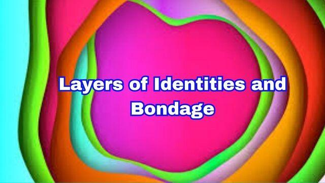

        
        
# Layers of Identities and Bondage    
    
The waking state is when I am fully aware of    
the objects and events around my physical body and within it.   
   
The dreaming state is when I am fully aware of    
the objects and events around my dream body and inside it.   
   
The sleeping state is when I am completely unaware of    
the objects and events around and within both my physical and dream bodies.   
   
To be aware, I need to know who I am.   
Only then can I say this is mine and that is not mine.   
Only then can I say this is me and that not me.   
   
Complete awareness requires 100% certainty of my awareness.   
   
In the waking state,   
humans wear thousands of layers of identities,    
tightly entwined with them,    
often unaware that these layers are distinct from their core self.    
   
Therefore, if one get hurt or appreciated at one layer    
they also experience the hurt at their physical body or mental body.   
But, we never know this deeply   
until one of these layers is shaken vigorously.   
If you want to understand    
which layer you are glued with    
you can make note from the following examples. 
   
I am a man - this is a layer that I acknowledge,    
yet this realization crystallizes    
when a woman remarks on men being selfish.  
I feel terrible bad for this judgment. 
   
I am a manager - a layer I recognize,    
but its significance deepens    
when a worker tags managers as heartless or ruthless.   
I feel uncomfortable for this sweeping generalization.   
   
I am a Guru or Swami - a layer I understand,    
but this understanding sharpens    
when a householder critiques spiritual leaders for    
their lack of understanding the true life of a householder.   
   
I am Garhwali - a layer I know,    
but its depth is realized    
when a non-Garhwali praises or stereotypes the Garhwali people.   
   
I am Indian - a layer I recognize,    
but its significance is highlighted    
when someone discriminates against Indians.   
   
I own a Toyota car- this is a layer.    
I know this, but this realization come    
when some Maruti car owner say that I also own Japanese car.   
   
I appreciate Mahatma Gandhi and follow his ideas - this is an Identify.    
I know this, but this realization come    
when some non-Gandhian says you fraud people,    
took all the credit of Indian freedom movement, and so on.   
   
I live in Bungalow or in flat is identity.   
I am tall is an identity.   
I am brown color is an identity.   
I am politically right aligned is an identity.   
I don't like pet is an identify.   
I like vegetarian food is an identity.   
   
So, I define myself by what I like, do not like.   
What I have and don't have.   
What I cause support and don't support.    
What I fear of and comfortable with.   
   
We can keep adding this and there is endless list of layers.   
All these layers are like covers which I taken to cover my true self.   
Disturbance good or bad in any layer has power to disturb me.   
Why? Because my awareness about myself is always    
about the awareness of these layers.   
   
I need to ask myself,    
Can I live with other identities (which I don't have right now)?   
Can I live with opposite identities (which I have right now)?   
Can I live without identities?   
Why it is necessary to have identities?   
   
At the deep subconscious level I know survival of the life is paramount.   
To survive we do everything.   
To survive I need to know who I am and from whom I have threat.   
To survive I need a physical and mental layers which I can defend.   
   
However, in today's world,    
where threats differ vastly from those faced by our ancestors,    
we cling to old identities and add more layers.    
We must question ourselves:    
In the animal kingdom, from an ameba to an elephant,    
all fight for survival.    
How different are we?    
Is it just our more complex brain and nervous system    
that intensify our struggle for survival?   
   
Throughout our lives, we defend our definitions of ourselves,    
aligning with certain layers of identity.    
Once survival needs are met, these layers become meaningless.    
With wisdom or a fully lived life,    
the need for these layers diminishes,    
and the urge to cover ourselves fades away.   
   
   
These layers are bondage; shedding them is liberation.    
No one can forcibly remove these layers,    
nor can anyone bless us to shed them.    
Good Karma/deeds don't dissolve these layers.    
We've adopted these identities    
based on our understanding of life and existence.    
To let these layers go, we only need an honest,    
earnest analysis and life experiences.   
   
   
Oh Pratibimba! When can you will realize that    
Liberation does not mean    
escaping, abandoning, running, dropping, tyaga    
but about shedding the mental layers    
that make you believe clothes are part of your body?   
   
Hari Om Tat Sat   
Yours Truly Hari 

 