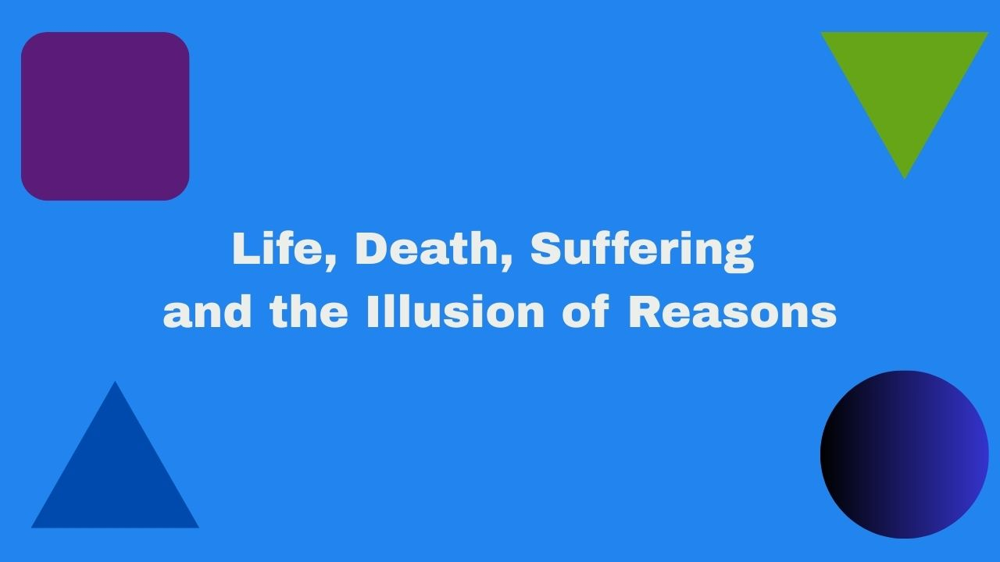

---       
id: 5294
mathjax: true        
title:  "Life, Death, and the Illusion of Reasons"        
date: "2025-03-30"        
permalink: /wiaposts/life-death-and-illusion-of-reasons
header:        
    teaser: ../assets/images/wiapost/5294-life-death-and-illusion-of-reasons.jpg               
author: Hari Thapliyaal        

author_profile: true        
share: true
categories: [wiaposts, hinduism, bhagavad-gita] 
tags:  [Life and Death, Illusion of Reasons, Bhagavad Gita teachings, Hinduism, Spirituality, Self-Inquiry, Spiritual Growth, Self-Discovery, Inner Peace]      
keywords: [Meaning of Life, Why we Die, Illusion of Reasons, Bhagavad Gita teachings on Life and Death, Yoga in Hinduism, Spiritual Inquiry, Self-Discovery, Inner Peace, Spiritual Growth, Self-Improvement]
excerpt: "Suffering and death exist without a cause, without a purpose. Culture and conditioning teach us to seek reasons for everything."
toc_sticky: true
toc_levels: 2
---

# **Life, Death, and the Illusion of Reasons**  

Out of habit, we ask when someone dies,  
"Oh, how did he die?"  
He was young,  
He was good, religious,  
He practiced yoga, cared for his health.  

Out of habit, we ask when someone suffers,  
"Oh, why is he suffering?"  
He is a good person,  
A virtuous soul.  
Sometimes we say,  
"He has already suffered enough,  
Why must he endure more?"  

But death and suffering need no reason.  
Reasoning is a human invention,  
A way to explain the unknown.  
Yet, suffering and death exist  
Without a cause, without a purpose.  

Culture and conditioning teach us  
To seek reasons for everything:  
Why do people fall in love?  
Why do some grow rich while others stay poor?  
Why do reputations rise and fall?  
Why does one win a lottery, another fail?  
Why do the sick die despite treatment,  
While others pass away in their sleep?  
Why do some have kind parents and teachers,  
While others suffer under 
cruel hands of parents and teachers?  

Yet, all people suffer.  
All people die.  
The poor suffer, the rich suffer.  
The believer suffers, the atheist suffers.  
The kind suffer, the wicked suffer.  
The thief, the giver,  
The young, the old,  
The sick, the healthy—  
All will suffer.  
All will die.  

What is death?  
Can anyone escape it?  
Why do scriptures make us fear death and God?  
Why do they tell us to be good  
To avoid suffering and divine wrath?  

Life does not happen for a reason.  
Life simply happens.  
Our explanations are childish illusions.  
When we are young, we believe in reasons.  
With time and experience,  
We learn that life is about acceptance.  

Do not avoid wrongdoings  
Just out of fear—  
Fear of Hell, fear of God, fear of society.  
If you commit immoral acts,  
Thinking no one sees you,  
That there is no God to judge,  
That you are free to do as you please—  
You are not an evolved life or soul.  

If you do good only out of fear,  
You are still not evolved—  
But you are better than the former.  

Right living is beyond religion.  
It transcends gender, culture,  
Language, geography, and belief.  
Most people need religion to guide them,  
But if you already know the right way to live,  
What more can religion offer?  

No matter what faith you follow,  
Or if you follow none,  
Pain, suffering, and loss  
Are a part of life.  
No one can take them away from you—  
Except death.  

We need to understand aging itself   
does not cause death nor is it an illness.  
Yes, with age we get more indulge in something  
Which changes our thinking   
That affects our health and well-being.  
But this indulgence directly has no relation with age.  
In fact if one is wise,  
With age one should get indulgence less.  

Oh Chaitanya, if one don't think about death   
It does not mean one is living life fully,  
It means either one is dead,   
or he is ignoring because of fear or helplessness  
But if one think about death then  
It doesn't mean one is living either.  

Accepting life as is more important   
Than trying to avoid or escape from it.  
Death, pain, suffering, loss need to be accepted as   
Birth, health, pleasure, and relationships.  
None of the them is more or less important.

For someone acceptance mean surrender to God.  
For another surrender your ego   
For others it may be 
drop results of Karma or    
sit at the feet of Lord or    
accept life as it is.  
What is the meaning of surrender for you  
Depends upon, how you evolved in your life.  

Hari Om Tat Sat   
Yours Truly Hari