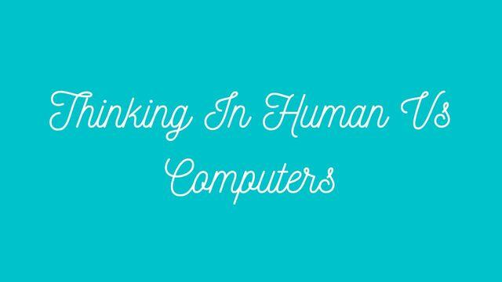

--- 
id: 5128 
title: Thinking In Human Vs Computers
date: "2020-05-24"
permalink: /wiaposts/thinking-in-human-vs-computers
tags: [ 'My Views']    
keywords: ["philosophical reflections on human vs computer thinking", "understanding cognitive differences in philosophy", "poetic insights on human and machine cognition", "philosophy of cognition and technology", "exploring human vs computer thinking in philosophical context"]  
categories: [wiaposts] 
header:
     teaser: ../assets/images/wiapost/5128-Thinking-In-Human-Vs-Computers.jpg
author: Hari Thapliyaal 

excerpt: Reflection on the cognitive differences between humans and computers, exploring cognition and technology.
author_profile: true 
share: true 
---

     
   
# Thinking In Human Vs Computers   
    
If a computer says I am thinking then what does it mean? It is speaking out the word which has been programmed in it by humans? Or, the processor is too busy because of some calculation or searching and hence this is status? Or is it really contemplating the meaning of words like humans do?    
    
The beauty is many times solution comes from humans when they wake up after a deep sound sleep. Can a computer give us a solution after a long rest? Answer is no.    
    
Computers think and processes. But we humans have a tendency to relate every concept to our life. The way we look, think, behave, interact, buy, throw, value, abuse, praise, love etc the same way machines or even our so called God should do!!! That is childish.    
    
Finally, if something is difficult for humans that doesn’t mean it is difficult for computers as well. Neither something simple for humans menas simple for machines as well.    
