# Welcome to WIA Posts - Spritual Drops!

## A brief [introduction to my spiritual journey](/wia-home) and introduction to this deeper dimensions of life.

- 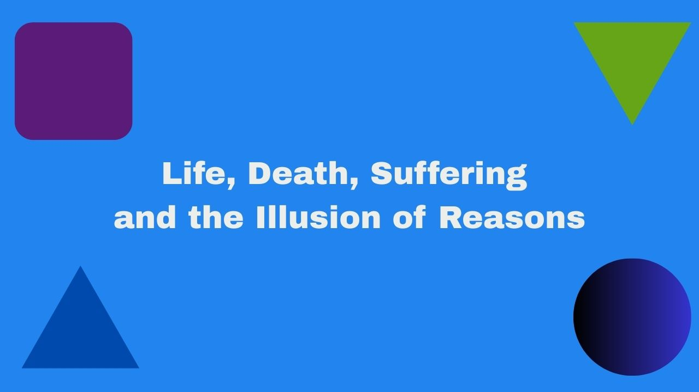{ width="200" }

    ### [Life, Death, and the Illusion of Reasons](Life-Death-and-Illusion-of-Reasons.md)
    
    **Read time:** 5 min
    
    Suffering and death exist without a cause, without a purpose. Culture and conditioning teach us to seek reasons for everything.

- 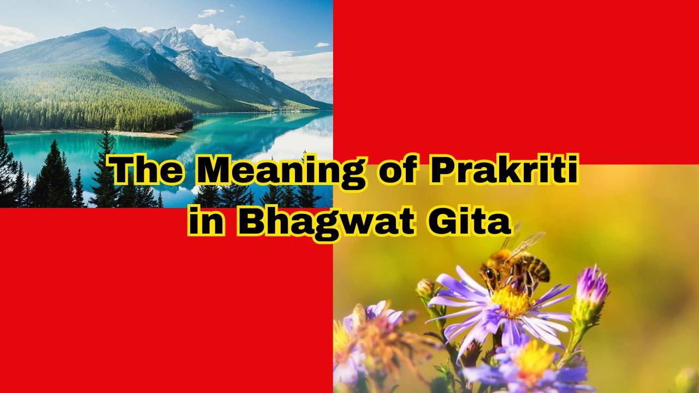{ width="200" }

    ### [The Meaning of Prakriti in Bhagwat Gita](The-Meaning-of-Prakrit-in-Bhagwat-Gita.md)
    
    **Read time:** 17 min
    
    The Sanskrit word Prakriti or Prakruti has multiple meanings and is used in the Bhagavad Gita in different contexts. In the English language, we try t
    

- 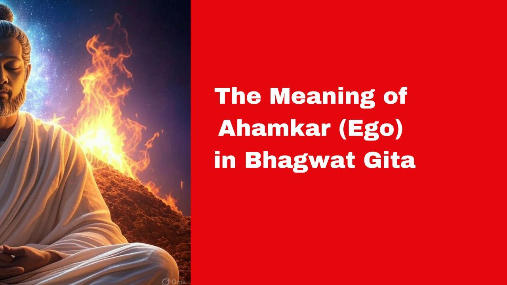{ width="200" }

    ### [The Meaning of Ahamkar in Bhagwat Gita](The-Meaning-of-Ahamkar-in-Bhagwat-Gita.md)
    
    **Read time:** 12 min
    
    In my view, the distinction between **Ahamkaara** and **Ego** is subtle yet profound, especially when viewed from a philosophical and spiritual lens. 

- 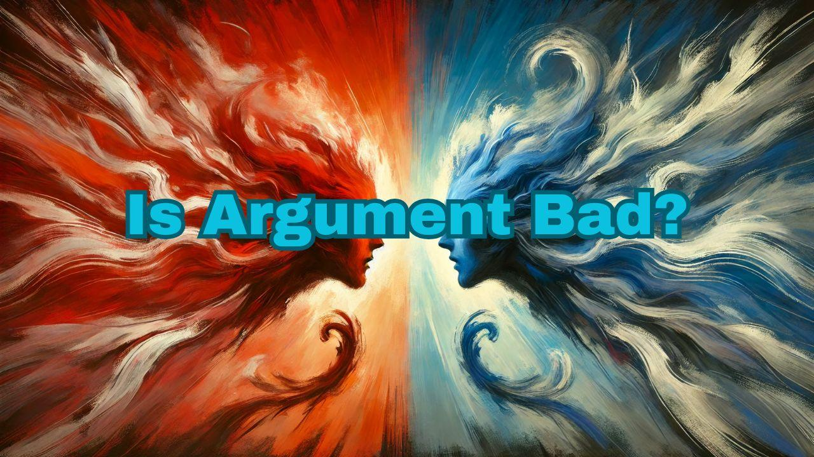{ width="200" }

    ### [Why Arguments Are Important for Personal Growth and Spirituality?](Is-Argument-Bad.md)
    
    **Read time:** 5 min
    
    Why arguments are important for personal growth and spirituality? In this article, I share my insights on how arguments can help you uncover the truth
    

- 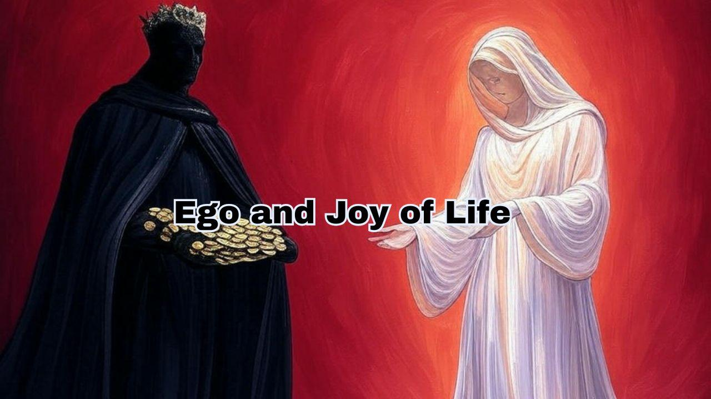{ width="200" }

    ### [How to Overcome the Ego and Find Joy in Life?](Ego-and-Joy-of-Life.md)
    
    **Read time:** 5 min
    
    How to overcome the ego and find joy in life? In this article, I share my insights on how to find happiness and fulfillment by letting go of the ego.

- 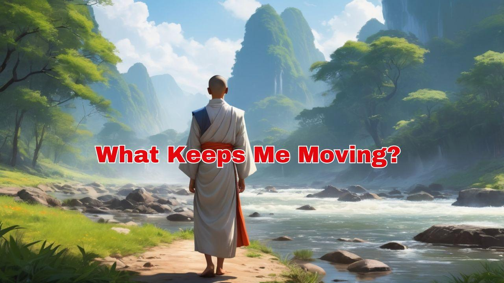{ width="200" }

    ### [What Keeps Me Moving?](What-Keeps-Me-Moving.md)
    
    **Read time:** 5 min
    
    What drives me? What gives me the energy to keep moving forward? In this article, I share what keeps me moving.
    

- 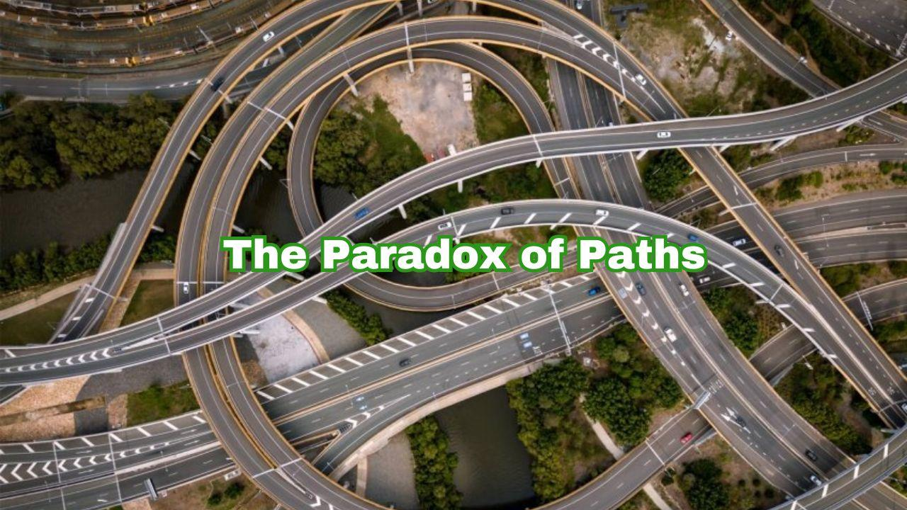{ width="200" }

    ### [The Paradox of Paths - A Hindu Perspective](The-Paradox-of-Paths.md)
    
    **Read time:** 5 min
    
    Sometimes, knowing too much holds us back, while not knowing enough pushes us forward. In this article, we explore the paradox of paths in the context

- 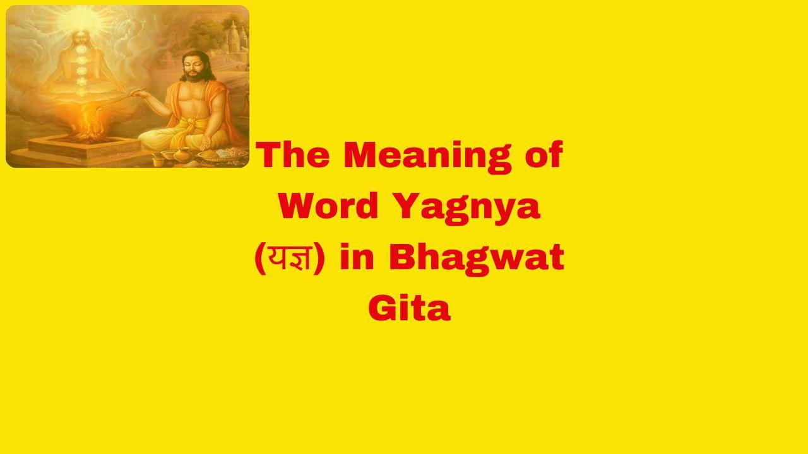{ width="200" }

    ### [The Meaning of Yagnya in Bhagwat gita](The-Meaning-of-Yangya-in-Bhagwat-Gita.md)
    
    **Read time:** 8 min
    
    In the Sanskrit language, there is a word 'यज्ञ' (romanized as Yagnya or Yajnya), which closely translates to 'sacrifice' in English. However, in a We
    

- 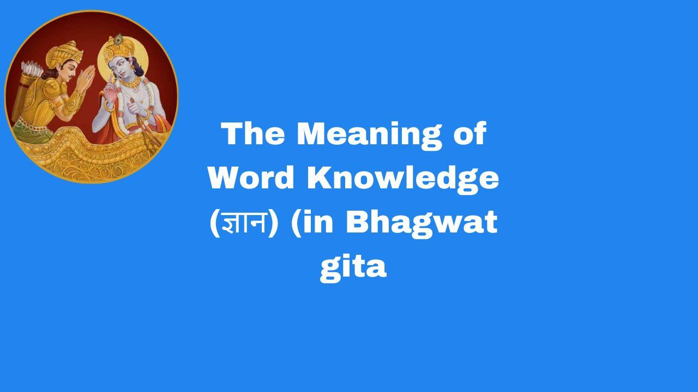{ width="200" }

    ### [The Meaning of Word Knowledge or Gyan or Jnyana in Bhagwat Gita](The-Meaning-of-Knowledge-in-Bhagwat-Gita.md)
    
    **Read time:** 22 min
    
    In the Sanskrit language, there is a word 'ज्ञान' (romanized as Gyan or Jnyana), which translates to 'Knowledge' in English. However, in a worldly sen

- 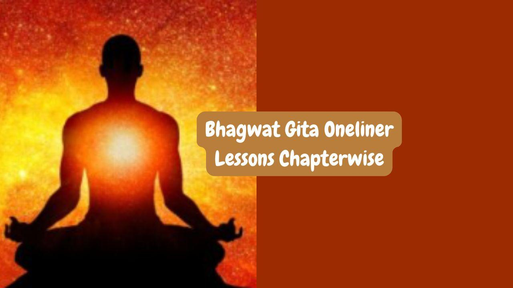{ width="200" }

    ### [Bhagwat Gita Oneliner Lessons Chapterwise](Bhagwat-Gita-Oneliner-Lessons-Chapterwise.md)
    
    **Read time:** 5 min
    
    The Bhagavad Gita, a sacred Hindu scripture, consists of 18 chapters, each addressing different aspects of life, duty, and spirituality through the di
    

- 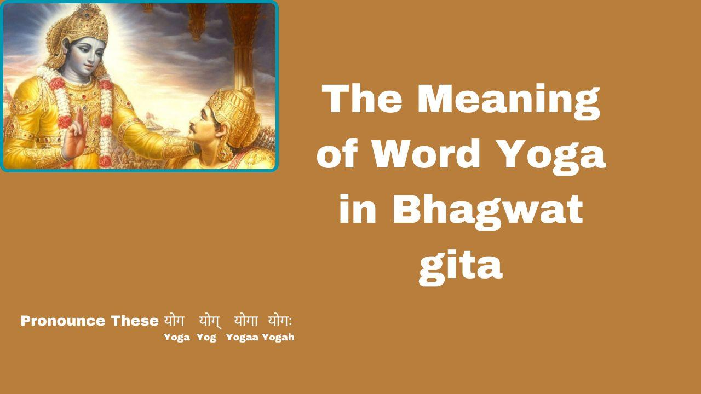{ width="200" }

    ### [The Meaning of Word Yoga in Bhagwat Gita](The-Meaning-of-Yoga-in-Bhgwat-Gita.md)
    
    **Read time:** 26 min
    
    The Bhagavad Gita is a treasure trove of wisdom, and at its heart lies the word 'Yoga' (योग)—a concept that’s anything but simple. Various gurus and c

- 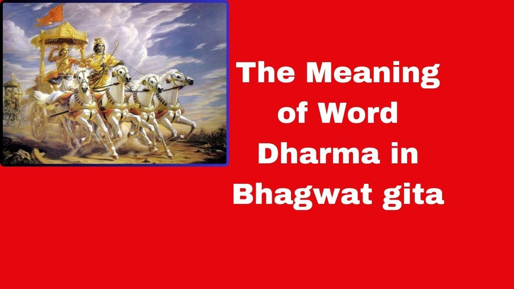{ width="200" }

    ### [The Meaning of Word Dharma in Bhagwat Gita](The-Meaning-of-Dharma-in-Bhagwat-Gita.md)
    
    **Read time:** 12 min
    
    The Bhagavad Gita is a treasure trove of wisdom, and at its heart lies the word 'Dharma' (धर्म)—a concept that’s anything but simple. Various gurus an
    

- 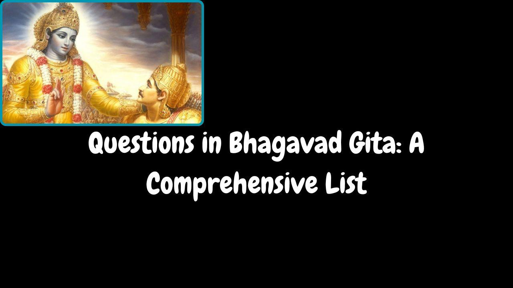{ width="200" }

    ### [Questions in Bhagavad Gita: A Comprehensive List](Question-in-Bhagwat-Gita.md)
    
    **Read time:** 13 min
    
    Explore the complete list of questions asked in the Bhagavad Gita, both by Arjuna and Krishna. Understand the context and significance of these spirit

- 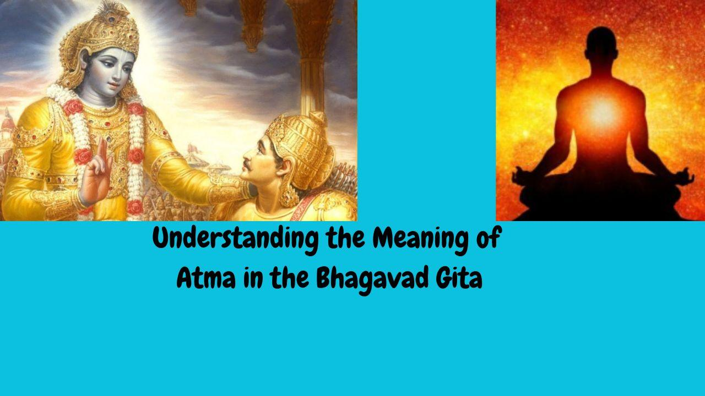{ width="200" }

    ### [Understanding the Meaning of Atma in the Bhagavad Gita](The-Meaning-of-Atma-in-Bhagwat-Gita.md)
    
    **Read time:** 12 min
    
    Explore the diverse meanings of 'Atma' as used in the Bhagavad Gita, from the physical body to the eternal soul. Understand the context and interpreta
    

- { width="200" }

    ### [Is Hindi the Mother of All North Indian Languages?](Is-Hindi-Mother-of-North-Indian-Languages.md)
    
    **Read time:** 8 min
    
    Is Hindi the mother of all North Indian languages? To answer this question, we need to understand the history and evolution of Hindi language.

- { width="200" }

    ### [The Essence of Bhagwat Gita: 2nd Chapter](The-Essence-of-Bhagwat-Gita-2nd-Chapter.md)
    
    **Read time:** 23 min
    
    The 2nd chapter of the Bhagavad Gita, The Yoga of Analysis (Sankhya Yoga). It is one of the longest chapter with 72 sloka. Key takeaways from this cha
    

- 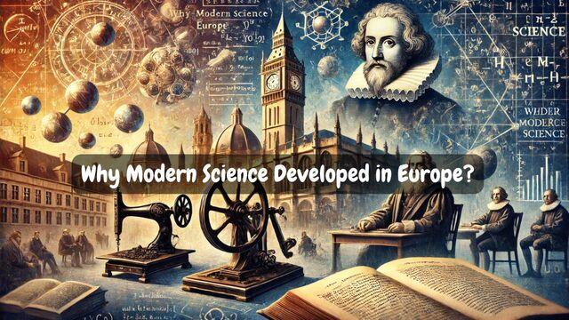{ width="200" }

    ### [Why Modern Science Developed in Europe](Why-Modern-Science-Developed-in-Europe.md)
    
    **Read time:** 5 min
    
    A question that often comes to mind is: Why has scientific progress been so significant in the past 400 years, and why did it primarily take place in 

- 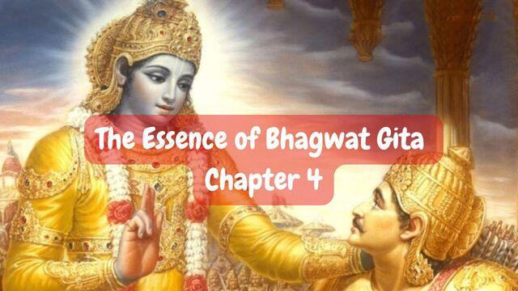{ width="200" }

    ### [The Essence of Bhagwat Gita: 4th Chapter](The-Essence-of-Bhagwat-Gita-4th-Chapter.md)
    
    **Read time:** 15 min
    
    The 4th chapter of the Bhagavad Gita, titled Jnyana (Knowledge) Yoga. It has 42 slokas. Key takeaways from this chapter are discussed in this article.
    

- 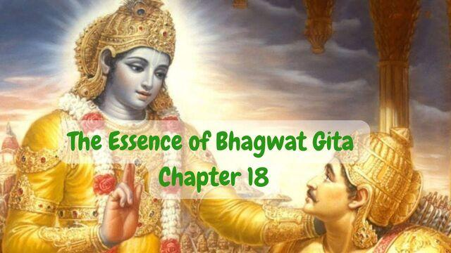{ width="200" }

    ### [The Essence of Bhagwat Gita: 18th Chapter](The-Essense-of-Bhagwat-Gita-18th-Chapter.md)
    
    **Read time:** 16 min
    
    The 18th chapter of the Bhagavad Gita, titled Moksha-Sannyasa Yoga (The Yoga of Liberation and Renunciation). It is one of the longest chapter with 78

- 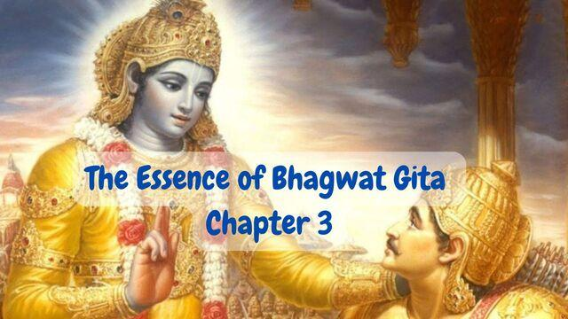{ width="200" }

    ### [The Essence of Bhagwat Gita: 3rd Chapter](The-Essence-of-Bhagwat-Gita-3rd-chapter.md)
    
    **Read time:** 10 min
    
    The third chapter of the Bhagavad Gita is a treasure trove of spiritual wisdom, providing powerful insights on the path of  action, the importance of 
    

- { width="200" }

    ### [Is Ego Bad?](Is-Ego-Bad.md)
    
    **Read time:** 5 min
    
    Ego is a concept often misunderstood. In this article, we will explore the concept of ego in the context of Vedanta and mindfulness. We will also expl

- 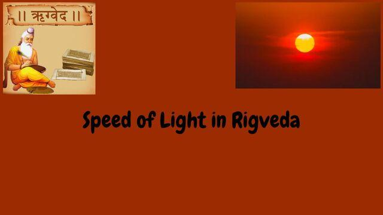{ width="200" }

    ### [Speed of Light in Rigveda](Speed-of-Light-in-Rigveda.md)
    
    **Read time:** 5 min
    
    An exploration of the speed of light as described in the Rigveda, comparing ancient insights with modern scientific understanding.
    

- 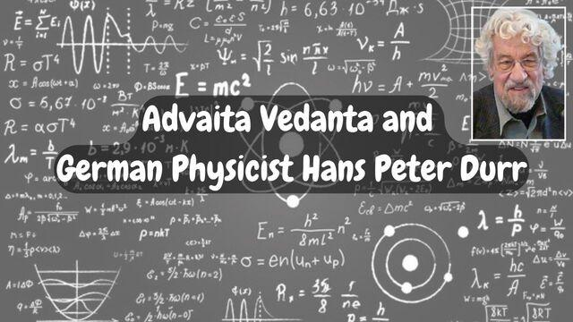{ width="200" }

    ### [Advaita Vedanta and Hans Peter Durr](Vedanta-and-Hans-Peter-Durr.md)
    
    **Read time:** 5 min
    
    Hans-Peter Dürr (7 October 1929 – 18 May 2014), a renowned German physicist, had deep insights into the philosophical parallels between modern physics

- { width="200" }

    ### [Happy Vijayadashami 2024](Happy-Vijaya-Dashmi.md)
    
    **Read time:** 5 min
    
    Hindus celebrate Durga Puja and remember the stories of Goddess Durga fighting and defeating demons. This festival is celebrated for nine days, culmin
    

- { width="200" }

    ### [विजयादशमी 2024 की हार्दिक शुभकामनाएँ](Happy-Vijaya-Dashmi-Hindi.md)
    
    **Read time:** 5 min
    
    हिंदू दुर्गा पूजा मनाते हैं और देवी दुर्गा के राक्षसों से लड़ने और उन्हें पराजित करने की कहानियों को याद करते हैं। यह त्योहार नौ दिनों तक मनाया जाता ह

- 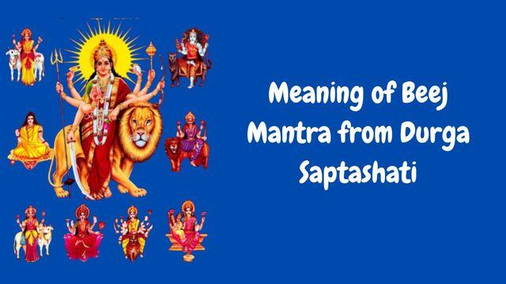{ width="200" }

    ### [Meaning of Beej Mantra from Durga Saptashati](Meaning-of-Beej-mantra-from-Durga-Saptashtati.md)
    
    **Read time:** 8 min
    
    In Hindu traditions, when the omnipotent, omniscient, and omnipresent power is worshipped as the Divine Feminine, we use different **Beeja Mantras** f
    

- 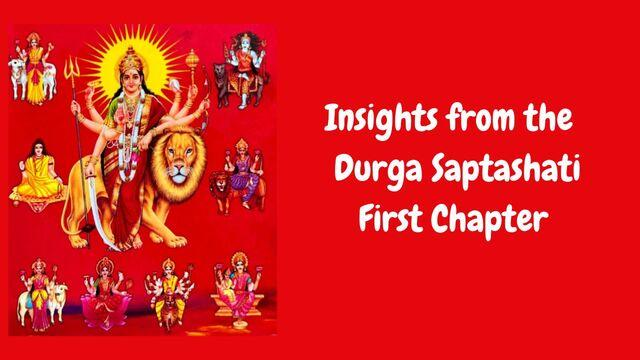{ width="200" }

    ### [Insights from the First Chapter of Durga Saptashati](Insights-from-the-First-Chapter-of-Durga-Saptashati.md)
    
    **Read time:** 7 min
    
    **The Significance of Durga Saptashati: Insights from the First Chapter** ## What is Purana? Scholars can provide many meanings and interpretations of

- { width="200" }

    ### [Insights from the First Chapter of Durga Saptashati - Hindi](Insights-from-the-First-Chapter-of-Durga-Saptashati-Hindi.md)
    
    **Read time:** 14 min
    
    **दुर्गा सप्तशती का महत्व: पहले अध्याय से अंतर्दृष्टि** ## पुराण क्या है? विज्ञानियों के पास इस शब्द के कई अर्थ और व्याख्याएँ हो सकती हैं। यहाँ एक परि
    

- 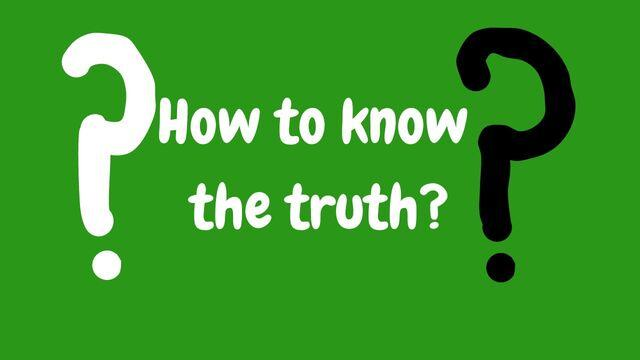{ width="200" }

    ### [How to know the truth?](How-to-know-the-truth.md)
    
    **Read time:** 5 min
    
    Suppose I come to your home. You offer me food, and I say, "No, I won't take it." You might think I'm hesitating. You ask, "Have you eaten?" I reply, 

- 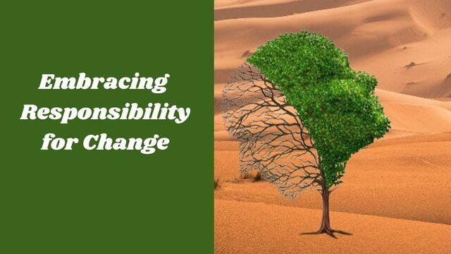{ width="200" }

    ### [Embracing Responsibility for Change](Embracing-Responsibility-for-Change.md)
    
    **Read time:** 5 min
    
    When we say nowadays the surrounding is corrupt, we need to ask: where does this surrounding start? At my heart, skin, bedroom, flat, apartment, distr
    

- 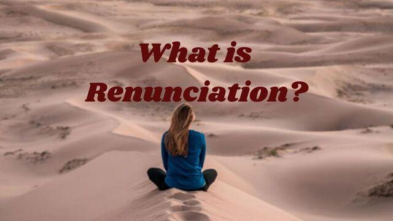{ width="200" }

    ### [What is Renunciation?](What-is-renunciation.md)
    
    **Read time:** 5 min
    
    In Sanskrit, there are two words: *Sanyasa* and *Tyaga*. People in the English-speaking world think both mean renunciation. They are related but not t

- 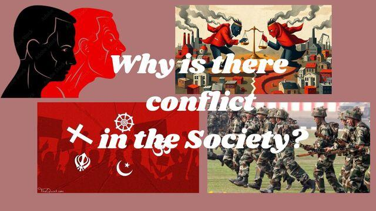{ width="200" }

    ### [Why is there conflict in the Society?](Why-there-is-Conflict-in-society.md)
    
    **Read time:** 5 min
    
    There is conflict between societies. There is conflict within society. There is conflict between nations. There is conflict within a nation. What is s
    

- 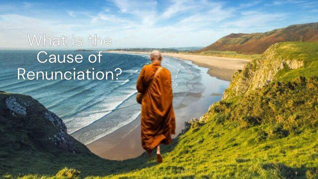{ width="200" }

    ### [What is the Cause of Renunciation?](What-is-the-cause-of-renunciation.md)
    
    **Read time:** 5 min
    
    In my college days, I had a very young friend named Pratibimb. One day, we met during a morning walk. He told me that he had a very sweet experience l

- 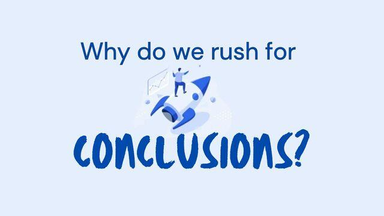{ width="200" }

    ### [The Search for Truth: Why Do We Rush to Conclusions?](Why-do-we-conclude.md)
    
    **Read time:** 5 min
    
    We think that we give birth. He thinks that we create. We think that we can kill, destroy, and finish. We think that without our doing, nothing will h
    

- 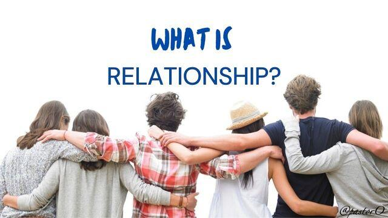{ width="200" }

    ### [What is Relationship?](What-is-Relationship.md)
    
    **Read time:** 5 min
    
    When I was in school, one of my friends had a father who was a very wealthy business tycoon. After my friend turned 18, his father took him to a bank 

- { width="200" }

    ### [What is Relationship - Poem](What-is-Relationship-Poem.md)
    
    **Read time:** 5 min
    
    In school, a friend with wealth so grand, His father took him by the hand, To the bank, where an account was made, A fortune's future, it seemed, was 
    

- 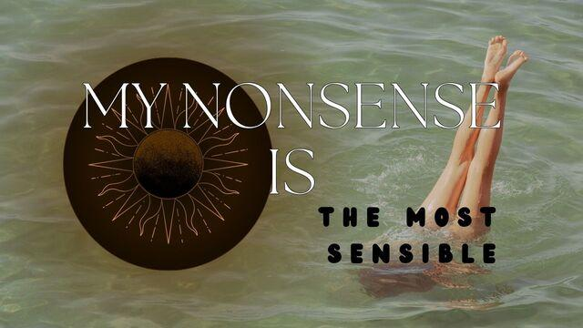{ width="200" }

    ### [My Nonsenses are Most Sensible](My Nonsenses are Most Sensible.md)
    
    **Read time:** 5 min
    
    Everyone around me seems insane, while I am the only sane one, the only saint! Whatever I do is the right way; whatever you do is senseless, meaningle

- { width="200" }

    ### [My Nonsenses are Most Sensible - Poem](My Nonsenses are Most Sensible-Poem.md)
    
    **Read time:** 6 min
    
    The world is madness, humans lost in haze, I stand alone, the saint in this maze. What I do is right, my path is clear, Your actions are senseless, dr
    

- { width="200" }

    ### [The Meaning of Understanding](The-Meaning-of-I-Understand.md)
    
    **Read time:** 5 min
    
    What do you mean when you say, "I understand"? Sometimes, you might say, "I really understand." Suppose you have a piece of software code before you, 

- { width="200" }

    ### [Happy Guru Purnima 2024](GuruPurnima-2024.md)
    
    **Read time:** 5 min
    
    There are two kinds of Vidya. Through one, we know the world and make our livelihood, build relationships with others, and improve our job, business, 
    

- 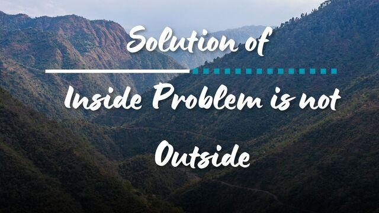{ width="200" }

    ### [Solution of Inside problem is not outside](Solution-of-Inside-problem-is-not-outside.md)
    
    **Read time:** 5 min
    
    When your mind is weary, burdened and low, Defeated, exhausted, where do you go? Lonely, sad, with shadows that cling, You know this life is not the s

- 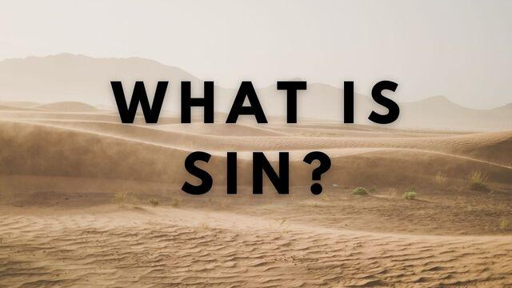{ width="200" }

    ### [What is Sin?](What-is-Sin.md)
    
    **Read time:** 5 min
    
    You lose a loved one, a bond, or your health, Blame it on God, Fate, or Karma’s stealth. You feel consoled, the burden shared, But deep within, you're
    

- { width="200" }

    ### [The Power Within](The-Power-Within.md)
    
    **Read time:** 5 min
    
    We all have the power to heal our own soul, Yet many still suffer, not feeling whole. Some can heal others, it’s their choice to make, To mend what is

- 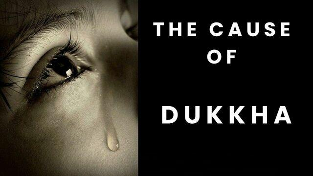{ width="200" }

    ### [The Cause of Dukkha](The-Cause-of-Dukkha.md)
    
    **Read time:** 5 min
    
    The mind's work is to think, recall, and dream, To feel emotions like a flowing stream. It swings us from joy to sadness so deep, In its restless sear
    

- { width="200" }

    ### [2024 Elections and Life After](2024-Elections-and-life-After.md)
    
    **Read time:** 5 min
    
    Our galaxy is called, Milky Way galaxy. It contains an estimated 100 billion stars similar to our Sun. As per NASA, in the sky, there are approximatel

- { width="200" }

    ### [All Religions are not Same](All-Religions-are-not-Same.md)
    
    **Read time:** 10 min
    
    Introduction Long ago, when I completed the study of Prasthantrai (comprising the ten cardinal Upanishads, Bhagavad Gita, and Brahma Sutra), it opened
    

- 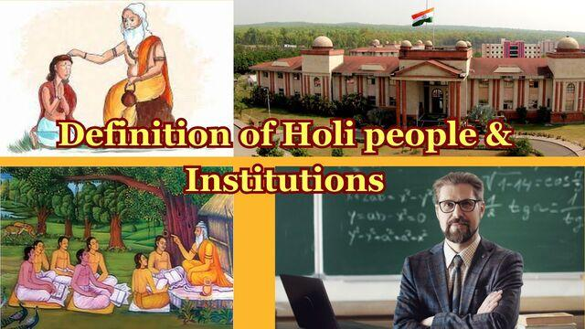{ width="200" }

    ### [Definitions of Holi people](Definitions-of-Holi-people.md)
    
    **Read time:** 7 min
    
    I notice that people often use these terms very loosely without understanding their underlying meanings. Additionally, when I engage in defining these

- 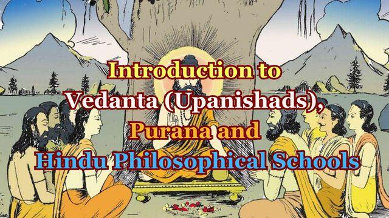{ width="200" }

    ### [Introduction to Upanishads](Summary-of-Upanishads.md)
    
    **Read time:** 26 min
    
    In this article, I will discuss three main topics, primarily focusing on the introduction of Upanishads: - What is Vedanta or Upanishads? Exploring th
    

- { width="200" }

    ### [New Year Wishes for 2024](Happy-New-Year-2024.md)
    
    **Read time:** 5 min
    
    Life is not a race; there is no use in running for winning. Run just for your fitness and health. Life is not a competition to go ahead of all and be 

- 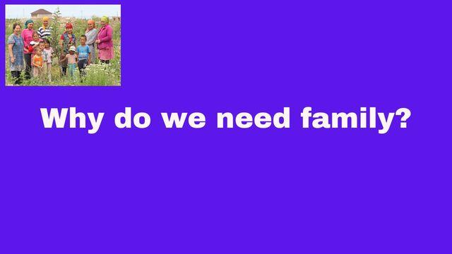{ width="200" }

    ### [Why do we need family?](Why-we-need-family.md)
    
    **Read time:** 5 min
    
    Knowledge resides within books for the next generation or sharing with those whom the author cannot directly reach. Knowledge is within tradition, but
    

- { width="200" }

    ### [Life Process](Life-is-a-Process.md)
    
    **Read time:** 5 min
    
    You are handling a process called life. Every process takes some input and creates some output. Inputs of the life process are all the resources avail

- { width="200" }

    ### [Layers of Identities and Bondage](Layers-of-Identities-and-Bondage.md)
    
    **Read time:** 5 min
    
    The waking state is when I am fully aware of the objects and events around my physical body and within it. The dreaming state is when I am fully aware
    

- 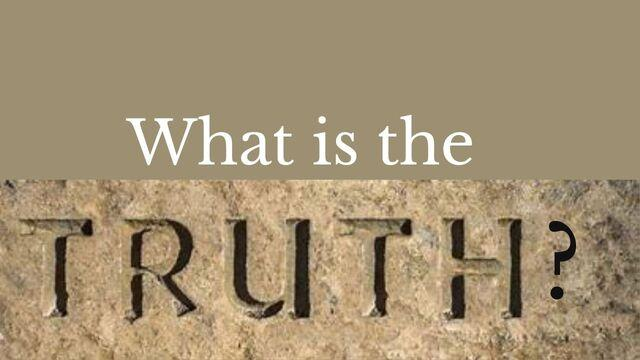{ width="200" }

    ### [What is the Truth](What-is-the-truth.md)
    
    **Read time:** 5 min
    
    Your son fails in 12th class exam or you get promoted in your job. One brings suffering and another brings happiness. Some believe happiness is becaus

- { width="200" }

    ### [The Middle Path](The-Middle-Path.md)
    
    **Read time:** 5 min
    
    We hear very commonly that you don't go to extreme of anything in the life, Walk the middle path, settle on middle ground, Madhya Maarga. Yet, no matt
    

- 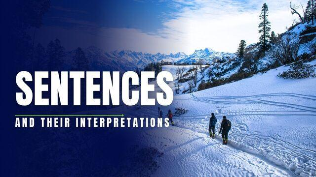{ width="200" }

    ### [Sentences and Their Interpretations](Sentences-and-their-interpretations.md)
    
    **Read time:** 5 min
    
    Once all villagers decided to pray for rain. On the day of prayer, all the people gathered, but only one boy came with an umbrella. This is faith or i

- 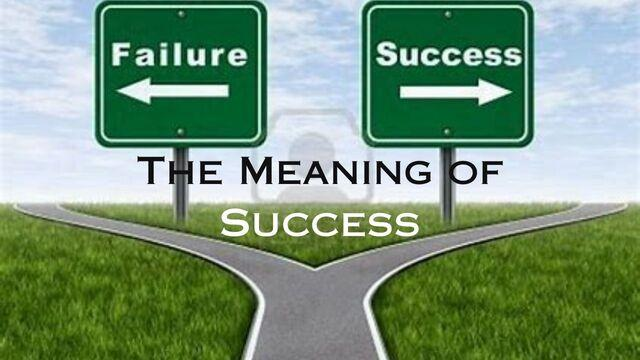{ width="200" }

    ### [The Meaning of Success](The-Meaning-of-Success.md)
    
    **Read time:** 16 min
    
    Every parent wants his children to be successful. Every citizen wants his state or country to be prosperous. Every teacher wants his students to becom
    

- 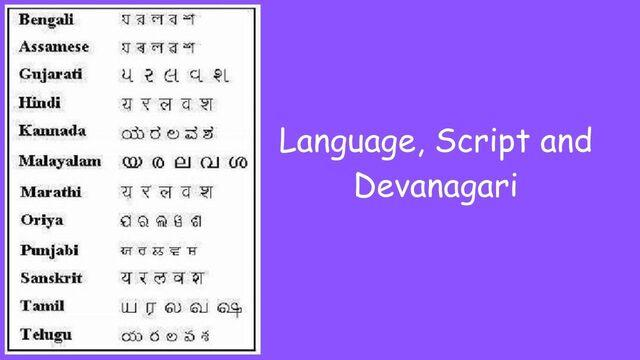{ width="200" }

    ### [Language, Script and Devanagari](Language-Script-and-Devanagari.md)
    
    **Read time:** 5 min
    
    Language is that which we speak. Script is that which we use to write words of any language. Hindi is a language not a script. English is a language n

- 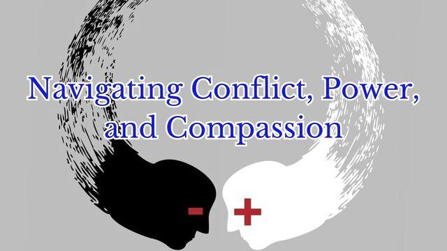{ width="200" }

    ### [Navigating Conflict, Power, and Compassion](Navigating-Conflict-Power-and-Compassion.md)
    
    **Read time:** 5 min
    
    If you aim to dismantle or control X without engaging in direct conflict, start by identifying X's most formidable adversary. Engage in actions daily 
    

- { width="200" }

    ### [ABC of Statistics](ABC-of-Statistics.md)
    
    **Read time:** 5 min
    
    1. A table or dataset is generally means same thing. Ideally a dataset can have multiple tables. 1. A table contains numerous columns. 1. A table or d

- 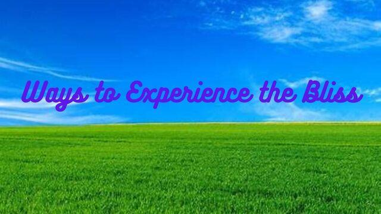{ width="200" }

    ### [Ways to Experience the Bliss](Ways-to-Experience-the-Bliss.md)
    
    **Read time:** 5 min
    
    Humans are searching for peace and want to experience bliss. Humans want to get it by searching. First he search for knowledge then he search for work
    

- { width="200" }

    ### [The Ways to Hurt the Self](The-Ways-to-Hurt-the-Self.md)
    
    **Read time:** 5 min
    
    People say your words are more painful and I cannot forget them in my life. They say, physical pain is less painful then the pain caused by harsh word

- { width="200" }

    ### [Questioning & Answering (Problem Solving)](Question-Answering.md)
    
    **Read time:** 5 min
    
    When we are searching on internet or engaging with people and asking them a question We get incomplete answer or incorrect answer because we do not as
    

- 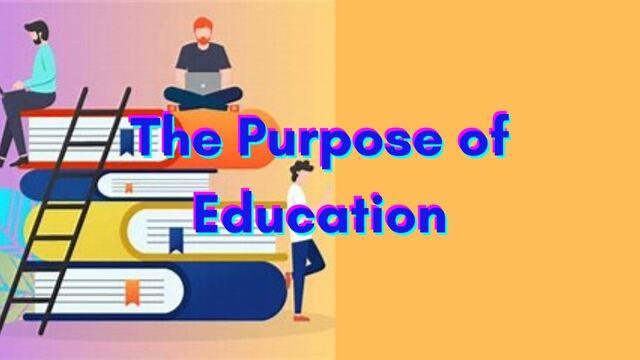{ width="200" }

    ### [The Purpose of Education](The-Purpose-of-Education.md)
    
    **Read time:** 5 min
    
    The purpose of literacy is to learn how to count, write, read, and understand what subjects are there to learn about. And life helps you explore these

- 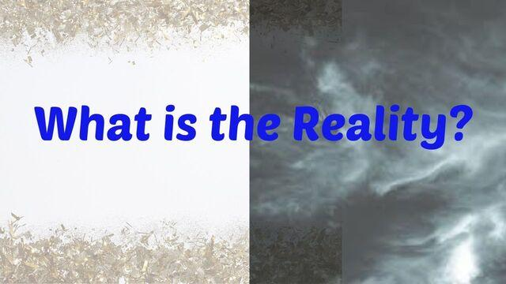{ width="200" }

    ### [What is the Reality?](What-is-the-reality.md)
    
    **Read time:** 5 min
    
    You see something on a table and you ask yourself, "What is that?" Answer: It looks like an apple, so it is an apple. Then you ask, "How many apples a
    

- 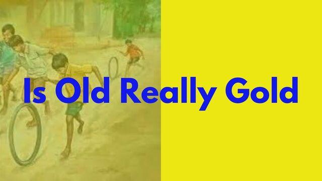{ width="200" }

    ### [Is old really Gold?](Is-Old-Really-Gold.md)
    
    **Read time:** 5 min
    
    An important function of the human brain is memory. Humans should use this for learning lessons. Unfortunately, it's often used to create nostalgic mo

- { width="200" }

    ### [Sign of Wisdom](Sign-of-Wisdom.md)
    
    **Read time:** 5 min
    
    Your surroundings comprise people, lives, the government, and systems around you, including family members, office hierarchy, political setup, religio
    

- { width="200" }

    ### [Pain and Suffering](Pain-and-Suffering.md)
    
    **Read time:** 5 min
    
    Pain is physical. Suffering is emotional, it is mental. Suffering is because of thinking. Suffering is because of improper thinking. The remedy for pa

- 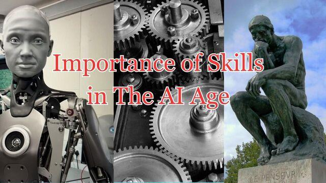{ width="200" }

    ### [Importance of Skills in The AI Age](Importance-of-Skills-in-the-AI-Age.md)
    
    **Read time:** 5 min
    
    While teaching data science and AI I emphasize on the strong foundation of maths, stats, and programming. Learners say cloud-based AI and AutoML tools
    

- { width="200" }

    ### [How Do You Want to Live?](How-Do-You-Want-to-Live.md)
    
    **Read time:** 5 min
    
    Birth and death are certain. Life is full of uncertainties. And this is the fun of life. You do something and you get something. This is how the proce

- 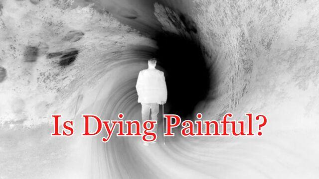{ width="200" }

    ### [Is Dying Painful?](Dying is Painful.md)
    
    **Read time:** 5 min
    
    No living being truly experiences dying. A few may recount near-death experiences, yet none have undergone the act of dying itself. Instead, we witnes
    

- 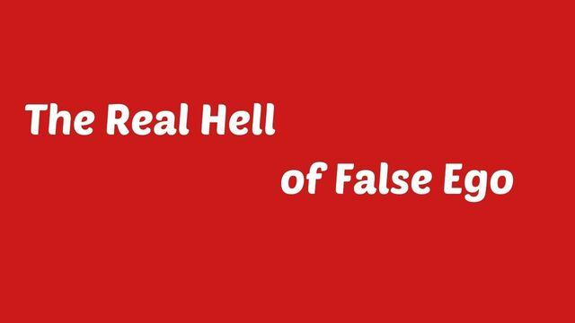{ width="200" }

    ### [The Real Hell of False Ego](The-Real-Hell-of-False-Ego.md)
    
    **Read time:** 5 min
    
    As a life, you can have the following feelings about yourself and each of these serves some purpose for yourself and the society around you and causes

- 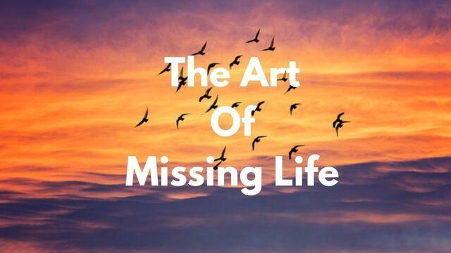{ width="200" }

    ### [The Art -Of Missing Life](The-Art-Of-Missing-Life.md)
    
    **Read time:** 5 min
    
    You take a photograph of a bird, data is in your camera and the bird has flown. You take a photograph of a river, data is in your camera, and the wate
    

- 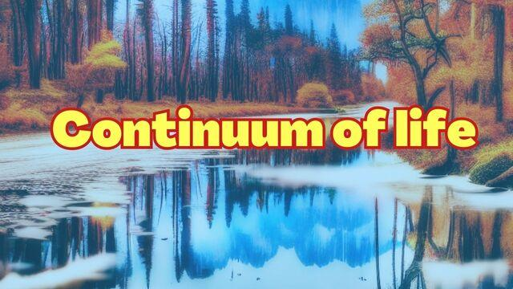{ width="200" }

    ### [Continuum of life](Continuum-of-life.md)
    
    **Read time:** 5 min
    
    Things around us are not full of life or lifeless. These are two opposites. This philosophy leads to duality or dichotomy. Everything which exists has

- { width="200" }

    ### [Yours Value System and Contradictions](Yours-Value-System-and-Contradictions.md)
    
    **Read time:** 5 min
    
    Sanatan Dharma Values and beliefs are Every human takes birth because in their previous Life, that soul was human but couldn't get Moksha Or from prev
    

- { width="200" }

    ### [You Can Never Speak The Truth](You-Can-Never-Speak-The-Truth.md)
    
    **Read time:** 5 min
    
    Human words, grammar, and speech are tools to hide the truth. What really exists, you know and experience But, if you say anything about that truth th

- 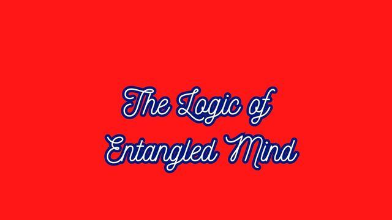{ width="200" }

    ### [The Logic of Entangled Mind](The-Logic-of-Entangled-Mind.md)
    
    **Read time:** 5 min
    
    Saints, Mahatmas, Rishis of the East Developed a philosophy And they told that there are millions of life Human life is precious among those lives. Th
    

- { width="200" }

    ### [The Way of Learning](The-Way-of-Learning.md)
    
    **Read time:** 5 min
    
    If you want to teach your children the process of making tea then you don't force them to memorize s for sugar, g for ginger, t for tea, w for water, 

- { width="200" }

    ### [Are You Feeling Stuck in Life](Are-You-Feeling-Stuck-in-Life.md)
    
    **Read time:** 5 min
    
    Life is not a railway track that goes straight. Every life has ups and downs, it has cycles of movement. But it is easy to say when you are at the pea
    

- { width="200" }

    ### [Mind and Manas](Mind-and-Manas.md)
    
    **Read time:** 5 min
    
    Two different concepts, Mind is not Manas The difference between Mind and Manas is not only of language. Normally we think Mind is enlgish word, Manas

- { width="200" }

    ### [I don’t Know 2](I-Dont-Know-2.md)
    
    **Read time:** 5 min
    
    When a human is living in an uncertain or hostile environment he feels helpless about his future. In that situation dependency upon an unknown, unseen
    

- { width="200" }

    ### [About Eligibility](About-Eligibility.md)
    
    **Read time:** 5 min
    
    Paatra in Sanskrit means pot, but it also means an eligible person. Paatrata means eligibility, capacity, capability to hold what is given to you. You

- { width="200" }

    ### [Efforts to Become Happy and Joyful](Efforts-To-Become-Happy-And-Joyful.md)
    
    **Read time:** 5 min
    
    We work hard to learn and earn. This learning and earning helps us buying comfort in life We think comfortable things makes us happy We forget there i
    

- { width="200" }

    ### [Diwali 2022](Diwali-2022.md)
    
    **Read time:** 5 min
    
    Prayers and Wishes on the Occasion of Deepavali You cannot draw a straight line. You cannot draw two parallel lines. But you can see a section of line

- { width="200" }

    ### [Four Kinds of Powers of a Society](Four-Kinds-Of-Powers-Of-A-Society.md)
    
    **Read time:** 5 min
    
    Whether you appreciate this or not, ancient Indian wisdom says the following. If you are constantly losing intellectual debate, narrative then Brahmin
    

- { width="200" }

    ### [Jeevan Mukta](Jeevan-Mukta.md)
    
    **Read time:** 5 min
    
    In the process of evolution humans acquired the capability of imagination. This enables humans to think about the future. That is why vision and visio

- 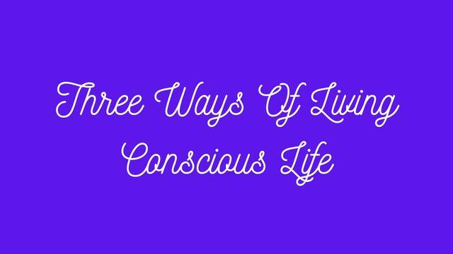{ width="200" }

    ### [Three ways of living conscious life](Three-Ways-Of-Living-Conscious-Life.md)
    
    **Read time:** 5 min
    
    There are three ways of living a conscious life, wakeful life. Each has its advantages and disadvantages. In each way you have to 'believe' that other
    

- { width="200" }

    ### [Indian Technological Advancement with Zero connection to Past](Indian-Technological-Advancement-With-Zero-Connection-To-Past.md)
    
    **Read time:** 5 min
    
    We complain in our society that a Bollywood hero gets quick fame, money, and reputation compared to a great scientist. We need to realize this is wher

- { width="200" }

    ### [Time and Present](Time-And-Present.md)
    
    **Read time:** 5 min
    
    One second is made of 1000 milliseconds. One millisecond is made of 1000 microseconds. One microsecond is made of 1000 nanoseconds. One nanosecond is 
    

- 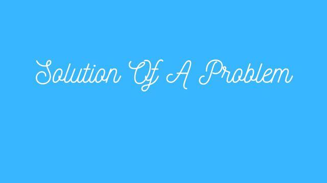{ width="200" }

    ### [Solution of a Problem](Solution-Of-A-Problem.md)
    
    **Read time:** 5 min
    
    There are two worlds around us. One is the real world and another is the projected world. In both worlds objects are the same but their impact on us i

- 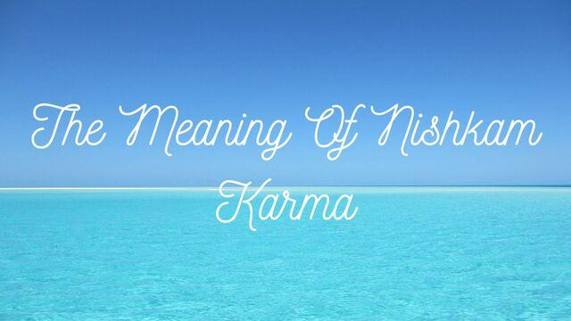{ width="200" }

    ### [The Meaning of Nishkam Karma](The-Meaning-Of-Nishkam-Karma.md)
    
    **Read time:** 5 min
    
    In the Sanskrit language, the word Kriya means that which happens. Karma means which is done. Whatever needs to be done for that you need to have your
    

- 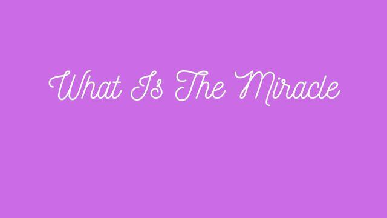{ width="200" }

    ### [What is the Miracle?](What-Is-The-Miracle.md)
    
    **Read time:** 5 min
    
    When some hot water falls on the body and it burns the body, burning didn’t happen because of a miracle. If something hanging at height is cut from th

- 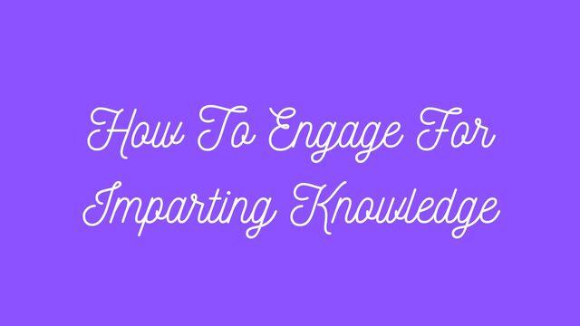{ width="200" }

    ### [How to Engage for Imparting Knowledge](How-To-Engage-For-Imparting-Knowledge.md)
    
    **Read time:** 5 min
    
    The biggest counterproductive assumption a teacher or a trainer can make about the class is "they all know what they want to learn and why they want t
    

- { width="200" }

    ### [Are you not Nature?](Are-You-Not-Nature.md)
    
    **Read time:** 5 min
    
    If a man thinks he has done something against Mother Nature that is why nature is punishing him or going to punish him then he forgets that he himself

- { width="200" }

    ### [Young Generation and Vedanta](Young-Generation-And-Vedanta.md)
    
    **Read time:** 5 min
    
    Generally, people think philosophy is for old people. Read Bhagwat Gita or Upanishads when you are old. I am a youth, I have to live the life I don’t 
    

- 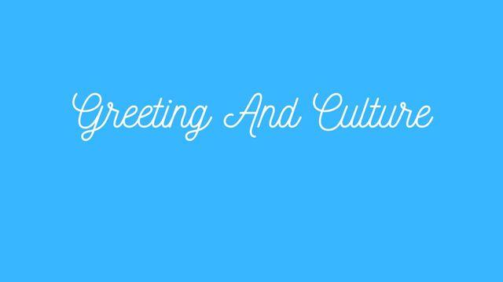{ width="200" }

    ### [Greeting and Culture](Greeting-And-Culture.md)
    
    **Read time:** 5 min
    
    What we know, that is because of our efforts and the support of family and friends. What we earn, that is because of our luck and work. How do we gree

- { width="200" }

    ### [Bhaav-Vivek Balance](Bhaav-Vivek-Balance.md)
    
    **Read time:** 5 min
    
    Bhav (power of emotions) and Vivek (power of intellect) both are crucial for a healthy mind. If you are too emotional with Vivek you can be dangerous.
    

- 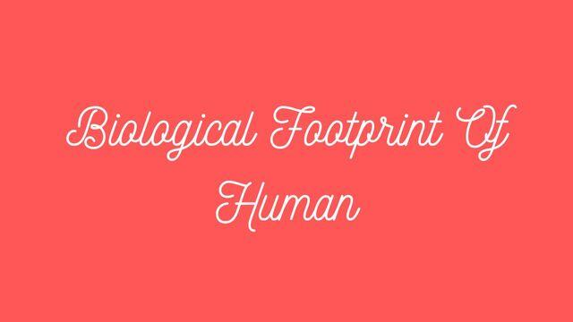{ width="200" }

    ### [Biological Footprint of Human](Biological-Footprint-Of-Human.md)
    
    **Read time:** 5 min
    
    Birds fly in the sky without footprint, Animals cannot walk on the earth without a footprint. Those who want to fly don't create a nest to live but to

- 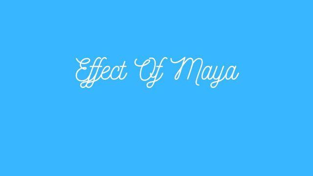{ width="200" }

    ### [Effect of Maya](Effect-Of-Maya.md)
    
    **Read time:** 5 min
    
    If there is no object then the presence of light cannot be sensed. If there is no environment on earth then the blueness of the sky cannot be sensed. 
    

- { width="200" }

    ### [Thinking and Feeling](Thinking-And-Feeling.md)
    
    **Read time:** 5 min
    
    Feeling and Thinking are two different process in human And both work from different parts of the human brain. Metaphorically people say thinking is f

- 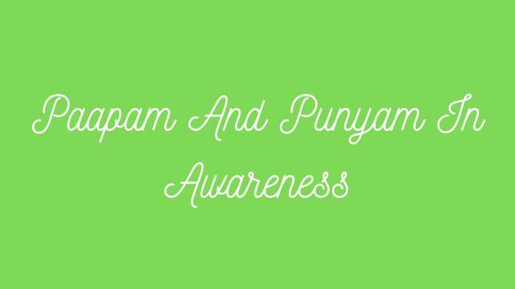{ width="200" }

    ### [Paapam and Punyam in Awareness](Paapam-And-Punyam-In-Awareness.md)
    
    **Read time:** 5 min
    
    A person is in comma or deep sleep and something horrible related to him happens around him and he is unaware. He comes to know about this when he com
    

- { width="200" }

    ### [Light vs Darkness](Light-Vs-Darkness.md)
    
    **Read time:** 5 min
    
    Darkness in the whole existence is natural. It need not be created. Darkness is universal. But by effort if you can bring light then darkness disappea

- 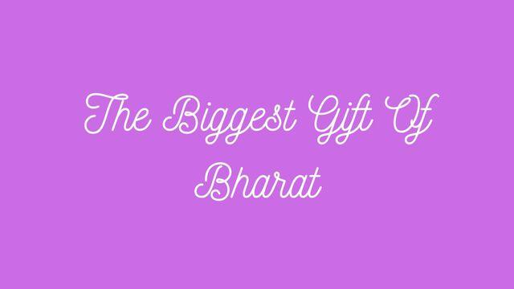{ width="200" }

    ### [The Biggest Gift of Bharat](The-Biggest-Gift-Of-Bharat.md)
    
    **Read time:** 5 min
    
    Three the biggest things which Bharat gave to the world but even our own people don't understand these fully. A. Tantra : A way to control your own li
    

- { width="200" }

    ### [Undying Love](Undying-Love.md)
    
    **Read time:** 5 min
    
    Love, Respect, and Trust are the foundation of any relationship. You name any relation like your Ishta, mother, father, guru, wife, husband, son, daug

- 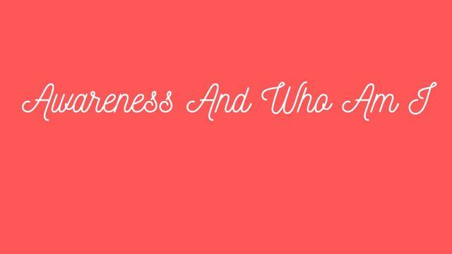{ width="200" }

    ### [Awareness and Who Am I](Awareness-And-Who-Am-I.md)
    
    **Read time:** 5 min
    
    Birds, Animals and Human all breath and exists as long as they breath But only humans are aware of his own existence. Other exists but with with limit
    

- { width="200" }

    ### [There is no God!](There-Is-No-God.md)
    
    **Read time:** 5 min
    
    If our Karma and Law or Karma is everything then what is the need of God? People say Karma is everything but they are afraid of this rule. They want t

- { width="200" }

    ### [Why is life complex?](Why-Is-Life-Complex.md)
    
    **Read time:** 5 min
    
    Instinct is something which every life has on this planet. And it helps them in their survival. If survival is the goal of life then instinct is good 
    

- 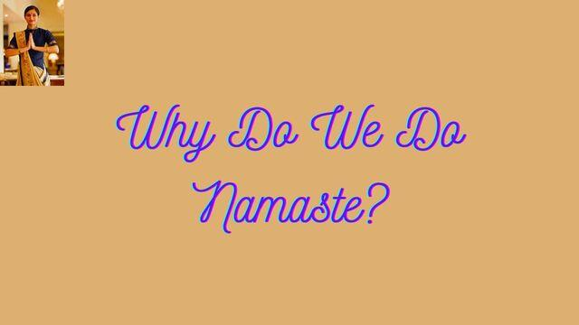{ width="200" }

    ### [Why Do We Do Namaste?](Why-Do-We-Do-Namaste.md)
    
    **Read time:** 5 min
    
    Meaning of Namaste Namaste means, I bow down to you. Normally, you can bow down to some because that person is powerful. Or, out of her/his power, eit

- { width="200" }

    ### [Business of Quotations](Business-Of-Quotations.md)
    
    **Read time:** 5 min
    
    When you are convinced of something then to convey that experience you use words. Because you do not have credibility to be believed so you refer from
    

- { width="200" }

    ### [Ideals in Hinduism](Ideals-In-Hinduism.md)
    
    **Read time:** 5 min
    
    People Question Rama, why he left Sita because someone questioned Sita's character? Rama should have defended and continued as king. Do you remember o

- { width="200" }

    ### [Earlier Hindu Institutions and Today's Society](Earlier-Hindu-Institutions-And-Todays-Society.md)
    
    **Read time:** 5 min
    
    Joint Families, where each family, Kula, has a Guru and elders. Land belongs to those who can cultivate and feed others. Knowledge belongs to those wh
    

- 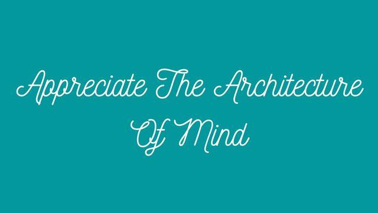{ width="200" }

    ### [Appreciate the Architecture of Mind](Appreciate-The-Architecture-Of-Mind.md)
    
    **Read time:** 5 min
    
    We blame the mind like a monkey, it keeps dancing and makes the body and the world around dance and create problems. See the beauty of mind, it can da

- 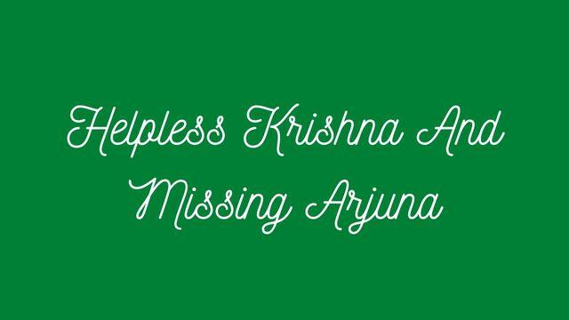{ width="200" }

    ### [Helpless Krishna and Missing Arjuna](Helpless-Krishna-And-Missing-Arjuna.md)
    
    **Read time:** 5 min
    
    The truth is Bhagwat Gita was told by a friend Krishna to his best friend Arjuna. That too when he asked. Normal chit chat is fine but serious advice 
    

- { width="200" }

    ### [Diwali 2021](Diwali-2021.md)
    
    **Read time:** 5 min
    
    Prayers and Wishes on the Occasion of Deepawali Earth has completed one more rotation around the Sun Time has turned again and once more Diwali of thi

- { width="200" }

    ### [Play on your Strength](Play-On-Your-Strength.md)
    
    **Read time:** 5 min
    
    Mentally or physically everybody has a unique design. Either you or someone else can identify that uniqueness of yours. If you know this then you can 
    

- 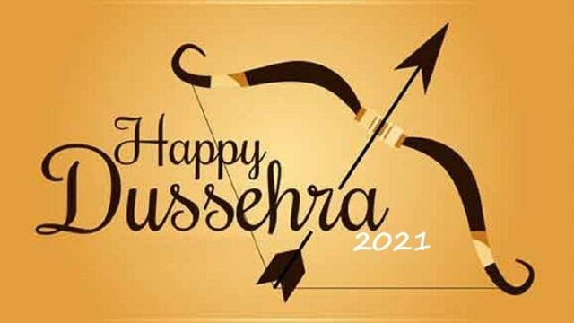{ width="200" }

    ### [Dussehra 2021](Dussehra-2021.md)
    
    **Read time:** 5 min
    
    Dussehra – Vijay Dashami Any Festival is an occasion to celebrate. If the day is Vijaya Dashami Then the day is to Celebrate your success (Vijay) Cele

- 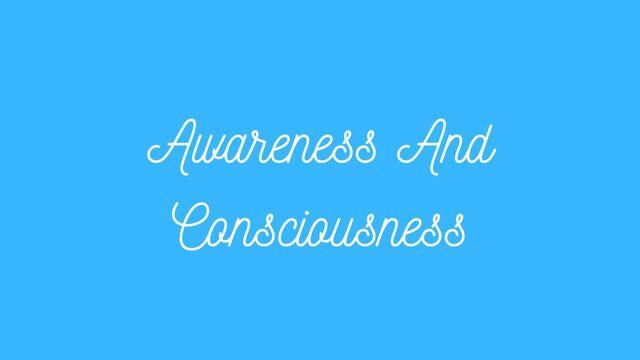{ width="200" }

    ### [Awareness and Consciousness](Awareness-And-Consciousness.md)
    
    **Read time:** 5 min
    
    Awareness comes from consciousness; they both are not the same. Consciousness is everywhere in the entire universe but awareness belongs to life. Plan
    

- { width="200" }

    ### [Searching the Creator](Searching-The-Creator.md)
    
    **Read time:** 5 min
    
    Without seeing or hearing about many things we know about their existence from the results of their functions. I can see, this proves that I have eyes

- { width="200" }

    ### [Mirror, Image and Face](Mirror-Image-And-Face.md)
    
    **Read time:** 5 min
    
    You go before a mirror for various reasons. When you have doubt, when there is a curiosity, when someone compliments or points something out or just f
    

- 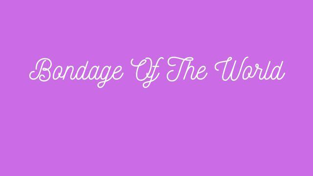{ width="200" }

    ### [Bondage of the World](Bondage-Of-The-World.md)
    
    **Read time:** 5 min
    
    Bondage is of two types, physical and mental. Either you put yourself in this bondage or system around you puts you in that bondage. In the bondage ei

- { width="200" }

    ### [About Friendship](About-Friendship.md)
    
    **Read time:** 5 min
    
    The definition of friendship in real life is not the same as in social media. In the age of social media Connecting relatives, colleagues, like minded
    

- 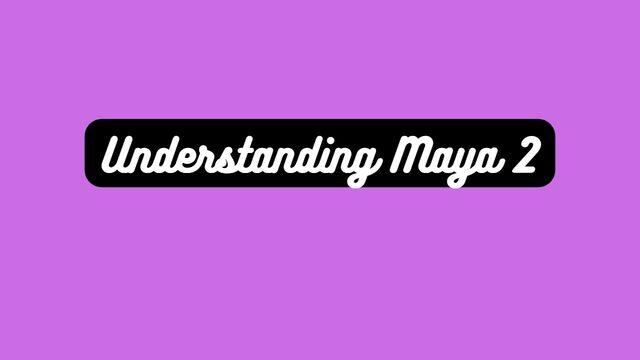{ width="200" }

    ### [Understanding Maya 2](Understanding-Maya-2.md)
    
    **Read time:** 5 min
    
    When you see sun is rising and settings But you know it doesn't Approx 72 inch is human body height One inch in eye size One tenth is size of pupil in

- { width="200" }

    ### [How to Evaluate IQ](How-To-Evaluate-Iq.md)
    
    **Read time:** 5 min
    
    After spending a decade in training, consulting, Coaching and mentoring activities I started believing that the IQ of a person should not be measured 
    

- { width="200" }

    ### [Human Peace](Human-Peace.md)
    
    **Read time:** 5 min
    
    Information has become abundant and it is free through search engines like Google, bing, yahoo etc. Knowledge has become abundant and free through Wik

- { width="200" }

    ### [Labeling Good and Bad](Labeling-Good-And-Bad.md)
    
    **Read time:** 5 min
    
    A raw mango on the branch of a tree is good for some purposes and bad for others. A ripe mango on the branch of a tree is good for some purposes and b
    

- 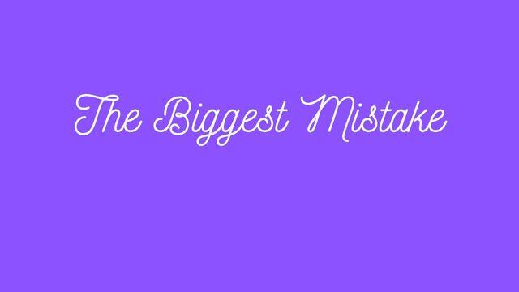{ width="200" }

    ### [The Biggest Mistake](The-Biggest-Mistake.md)
    
    **Read time:** 5 min
    
    When we are children we even see the rise and set of the sun with amazement. Flying birds, and the color of the clouds and sky spark curiosity in us. 

- { width="200" }

    ### [Training of the mind](Training-Of-The-Mind.md)
    
    **Read time:** 5 min
    
    Since the first of our life All parts and systems of our body are designed, developed, trained, used, and maintained in such a way that survival of th
    

- { width="200" }

    ### [Don't Be Afraid Of Covid](Dont-Be-Afraid-Of-Covid.md)
    
    **Read time:** 5 min
    
    We are a body of 15 trillion cells. The human body is a colony of billions of viruses and bacterias. Every day with food, water, and the air we consum

- 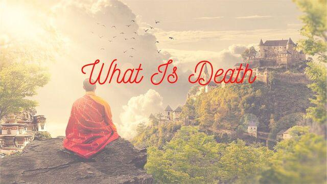{ width="200" }

    ### [What Is Death?](What-Is-Death.md)
    
    **Read time:** 5 min
    
    Death cannot be understood without dwelling on the term called life. When a pot comes in shape from mud do you call that pot a new life? When milk tur
    

- { width="200" }

    ### [What Is Success?](What-Is-Success.md)
    
    **Read time:** 5 min
    
    A mosquito or flee is roaming around and disturbing you You plan to kill it, and you killed it, it is a success. An employee is looking for rupees 100

- 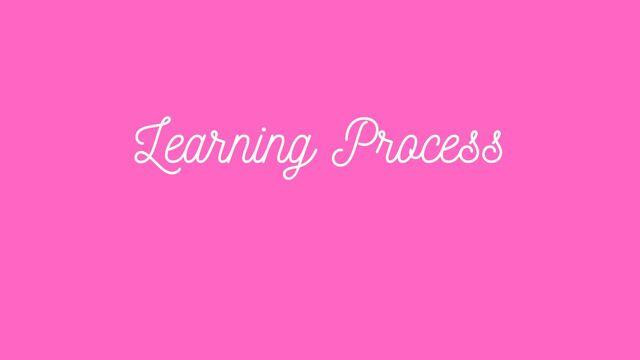{ width="200" }

    ### [Learning Process](Learning-Process.md)
    
    **Read time:** 5 min
    
    When you see some long physics or maths formula then don’t get scared of it. It is just a way to represent the reality. Is it an absolute reality? No,
    

- 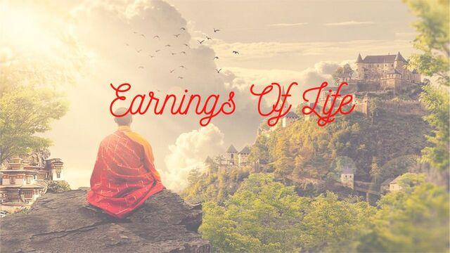{ width="200" }

    ### [Earnings Of Life](Earnings-Of-Life.md)
    
    **Read time:** 5 min
    
    You are living comfortably at your home. You have inquisitiveness to know the world around So you go out and travel as far places as you want to know.

- 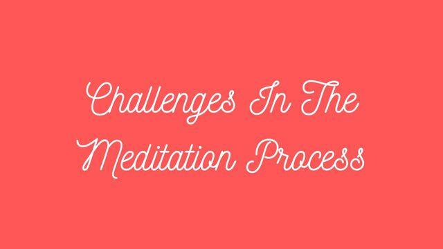{ width="200" }

    ### [Challenges In The Meditation Process](Challenges-In-The-Meditation-Process.md)
    
    **Read time:** 5 min
    
    You can meditate with open eyes and you can meditate with closed eyes. When you want to meditate with open eyes then the objective is to handle the wo
    

- 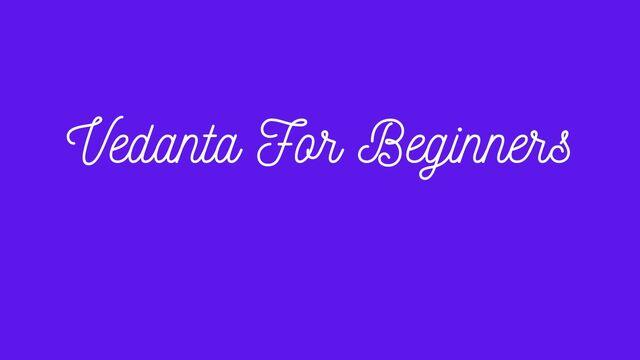{ width="200" }

    ### [Vedanta For Beginners](Vedanta-For-Beginners.md)
    
    **Read time:** 6 min
    
    By Sri Swami Sivananda, Founder of The Divine **BASICS OF VEDANTA** - The fourfold **Antahkarana** or the internal organ: Manas (mind), Buddhi (intell

- { width="200" }

    ### [AI And Free Soul](Ai-And-Free-Soul.md)
    
    **Read time:** 5 min
    
    Human likes certainty but enjoys good surprises and learns from bad surprises. To make the future certain and predictable, he wants to plan future act
    

- 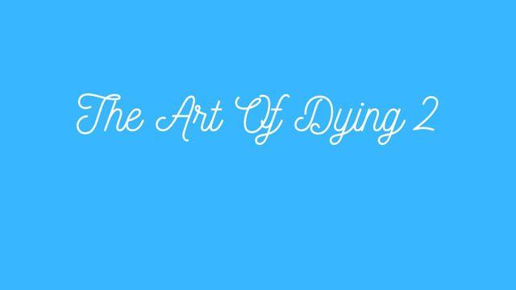{ width="200" }

    ### [The Art Of Dying 2](The-Art-Of-Dying-2.md)
    
    **Read time:** 5 min
    
    Inhaling is different from exhaling and Exhaling is different from inhaling Both never happens to us at the same time But both happen continuously, on

- { width="200" }

    ### [A Price For The Wrong Identification](A-Price-For-The-Wrong-Identification.md)
    
    **Read time:** 5 min
    
    If someone asks us, who are you? Or we ask ourselves, who am I? Or we ask someone, who are you? What answer do we expect from others? Or what answer d
    

- { width="200" }

    ### [World Around](World-Around.md)
    
    **Read time:** 5 min
    
    There is the world that exists outside, That is the objective world. There is the world that exists inside our body boundary, this is the subjective w

- 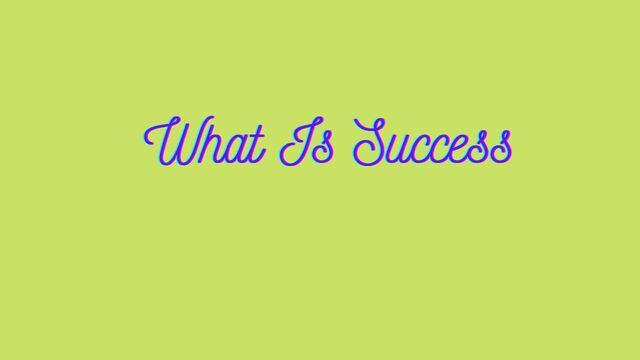{ width="200" }

    ### [About Food And Nourishment](About-Food-And-Nourishment.md)
    
    **Read time:** 6 min
    
    We have three living bodies embedded together But superficially it looks one. When it comes to nourishing, it is our responsibility to nourish all thr
    

- { width="200" }

    ### [Greetings For New Year 2021](Greetings-For-New-Year-2021.md)
    
    **Read time:** 5 min
    
    Happy New Year 2021 **How do you wish someone a happy new year?** This depends upon with whom we are talking. There are people who mindlessly speak, w

- 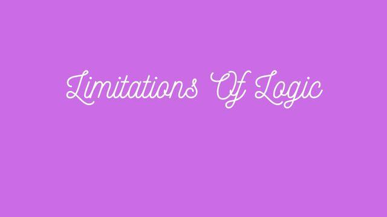{ width="200" }

    ### [Limitations Of Logic](Limitations-Of-Logic.md)
    
    **Read time:** 5 min
    
    Logic is a lately developed human phenomenon. But in reality, there is no logic anywhere in the existence. Humans give meaning to life. Humans give na
    

- { width="200" }

    ### [Happy Diwali 2020](Happy-Diwali-2020.md)
    
    **Read time:** 5 min
    
    EXCERPT Not Found

- 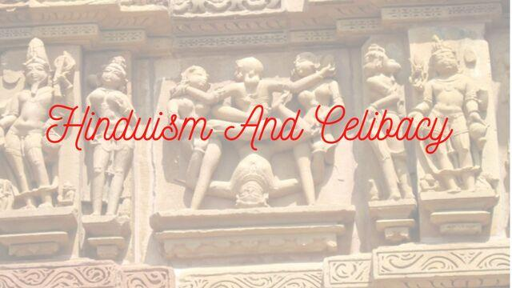{ width="200" }

    ### [Hinduism And Celibacy](Hinduism-And-Celibacy.md)
    
    **Read time:** 5 min
    
    An exploration of celibacy inHinduism, delving into insights on ethics and spirituality.
    

- { width="200" }

    ### [What Is Love?](What-Is-Love.md)
    
    **Read time:** 5 min
    
    A philosophical and poetic exploration of love, delving into insights on relationships and joy.

- 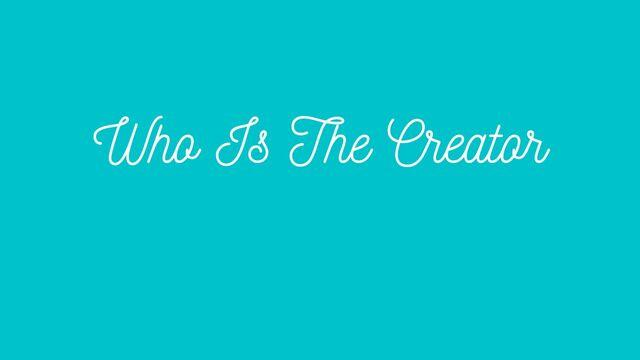{ width="200" }

    ### [Who Is The Creator?](Who-Is-The-Creator.md)
    
    **Read time:** 5 min
    
    A philosophical and poetic exploration of the creator, delving into insights on creation and existence.
    

- 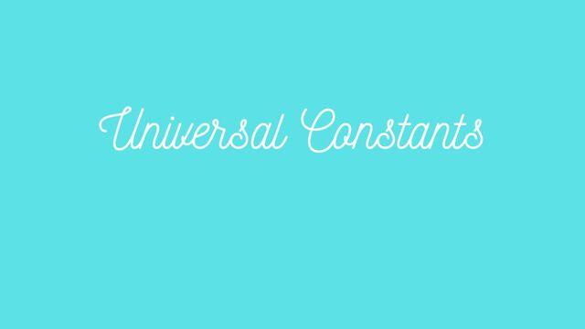{ width="200" }

    ### [Universal Constants](Universal-Constants.md)
    
    **Read time:** 5 min
    
    A exploration of universal constants, delving into insights on nature and science.

- 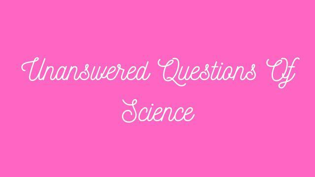{ width="200" }

    ### [Unanswered Questions Of Science](Unanswered-Questions-Of-Science.md)
    
    **Read time:** 5 min
    
    A philosophical and poetic exploration of unanswered questions in science, delving into insights on curiosity and exploration.
    

- 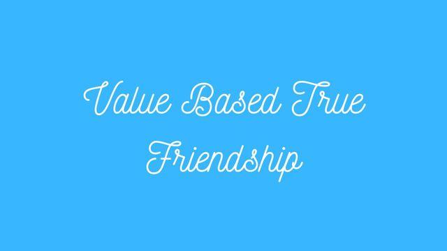{ width="200" }

    ### [Value Based True Friendship](Value-Based-True-Friendship.md)
    
    **Read time:** 5 min
    
    A philosophical and poetic exploration of true friendship, delving into insights on value-based relationships and loyalty.

- { width="200" }

    ### [Universal Culture](Universal-Culture.md)
    
    **Read time:** 6 min
    
    A philosophical and poetic exploration of universal culture, delving into insights on cultural integration and identity.
    

- 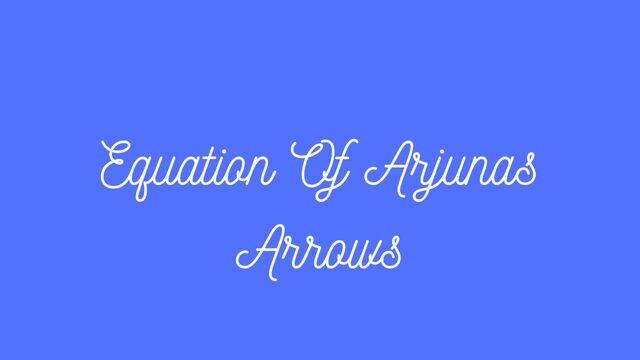{ width="200" }

    ### [Equation Of Arjunas Arrows](Equation-Of-Arjunas-Arrows.md)
    
    **Read time:** 5 min
    
    A philosophical and poetic exploration of Arjuna's arrows, delving into insights on Indian sciences and mythology.

- { width="200" }

    ### [Choose Your Attitude](Choose-Your-Attitude.md)
    
    **Read time:** 5 min
    
    A philosophical and poetic exploration of attitude, delving into insights on mindset and choice.
    

- { width="200" }

    ### [What Is Balance Food Diet?](What-Is-Balance-Food-Diet.md)
    
    **Read time:** 5 min
    
    Exploration of balanced diet, delving into insights on nutrition and well-being.

- 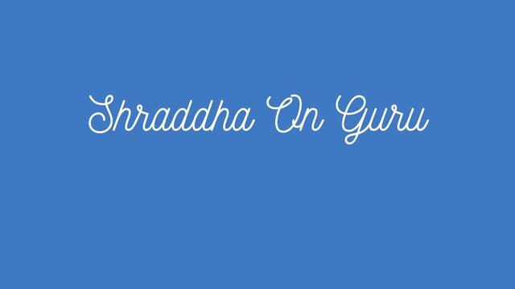{ width="200" }

    ### [Shraddha On Guru](Shraddha-On-Guru.md)
    
    **Read time:** 5 min
    
    A philosophical and poetic exploration of shraddha on guru, delving into insights on devotion and guidance.
    

- 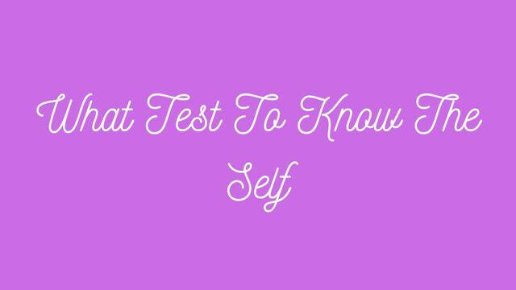{ width="200" }

    ### [What Test To Know The Self?](What-Test-To-Know-The-Self.md)
    
    **Read time:** 5 min
    
    Exploration of self-knowledge, delving into insights on self-awareness and growth.

- 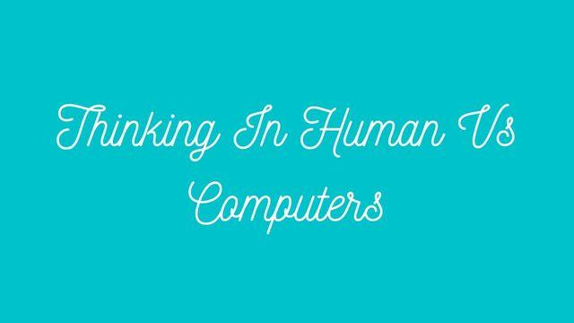{ width="200" }

    ### [Thinking In Human Vs Computers](Thinking-In-Human-Vs-Computers.md)
    
    **Read time:** 5 min
    
    Reflection on the cognitive differences between humans and computers, exploring cognition and technology.
    

- { width="200" }

    ### [Knocking Your Own Door](Knocking-Your-Own-Door.md)
    
    **Read time:** 5 min
    
    Exploration of self-discovery, delving into insights on introspection and growth.

- 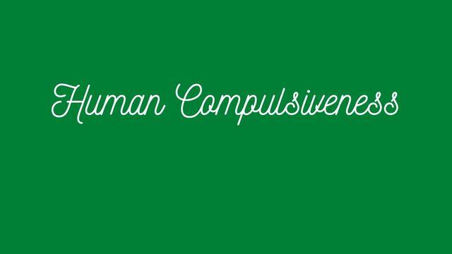{ width="200" }

    ### [Human Compulsiveness](Human-Compulsiveness.md)
    
    **Read time:** 5 min
    
    Exploration of human compulsiveness, delving into insights on mindfulness and choice.
    

- 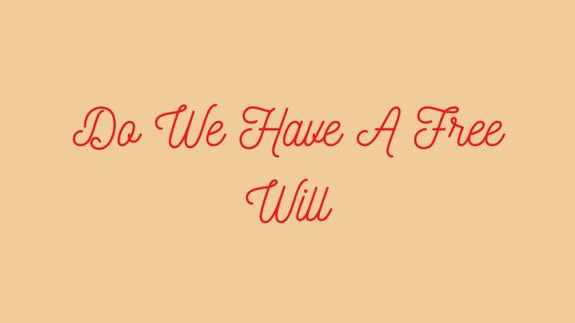{ width="200" }

    ### [Do We Have A Free Will](Do-We-Have-A-Free-Will.md)
    
    **Read time:** 5 min
    
    Exploration of free will, delving into insights from Vedanta and philosophical contexts.

- 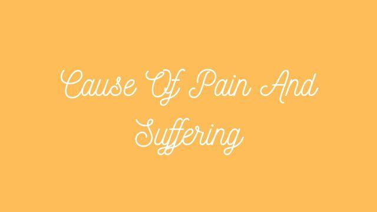{ width="200" }

    ### [Cause Of Pain And Suffering](Cause-Of-Pain-And-Suffering.md)
    
    **Read time:** 5 min
    
    Exploration of the causes of pain and suffering, delving into insights on human experience and healing.
    

- 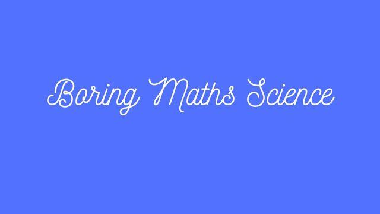{ width="200" }

    ### [Boring Maths and Science](Boring-Maths-And-Science.md)
    
    **Read time:** 5 min
    
    Reflection on the perceived boredom in maths and science, exploring learning and curiosity.

- 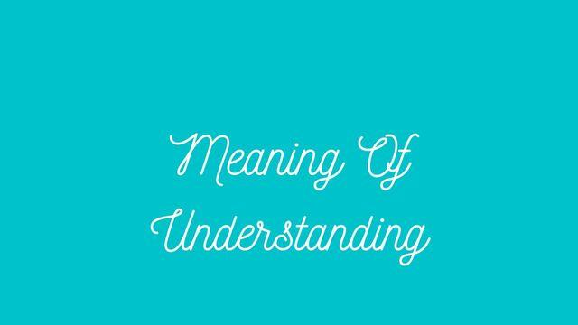{ width="200" }

    ### [Meaning Of Understanding](Meaning-Of-Understanding.md)
    
    **Read time:** 5 min
    
    Exploration of understanding, delving into insights on meaning and perception.
    

- 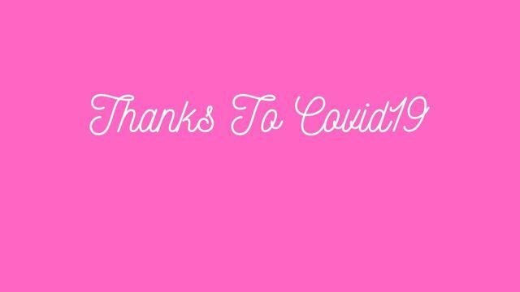{ width="200" }

    ### [Thanks To Covid19](Thanks-To-Covid19.md)
    
    **Read time:** 5 min
    
    Reflection on the impacts of COVID-19, exploring societal changes and human behavior.

- 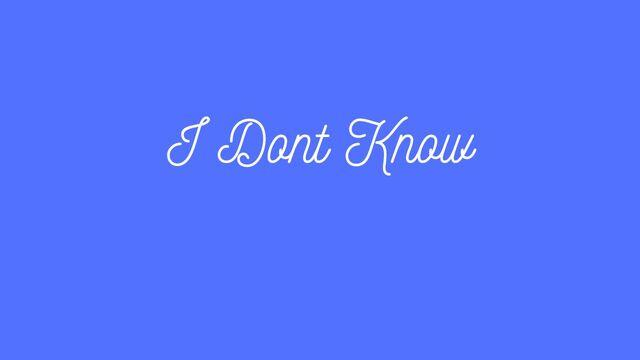{ width="200" }

    ### [I Don't Know](I-Dont-Know.md)
    
    **Read time:** 5 min
    
    Exploration of uncertainty and the unknown, delving into insights on exploration and not knowing.
    

- 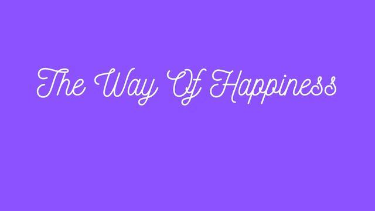{ width="200" }

    ### [The Way Of Happiness](The-Way-Of-Happiness.md)
    
    **Read time:** 5 min
    
    Exploration of the way of happiness, delving into insights from Vedanta and philosophical contexts.

- { width="200" }

    ### [Do I Have Free Will?](Do-I-Have-Free-Will.md)
    
    **Read time:** 5 min
    
    Exploration of free will, delving into insights from Vedanta and philosophical contexts.
    

- { width="200" }

    ### [Greetings For New Year 2020](Greetings-For-New-Year-2020.md)
    
    **Read time:** 5 min
    
    Reflection on the New Year 2020, celebrating new beginnings and insights.

- 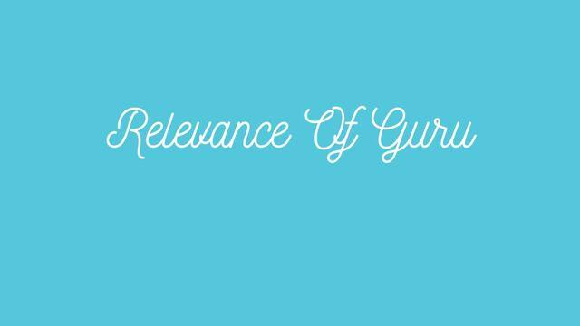{ width="200" }

    ### [Relevance Of Guru](Relevance-Of-Guru.md)
    
    **Read time:** 5 min
    
    Exploration of the relevance of guru, delving into insights on education and guidance.
    

- 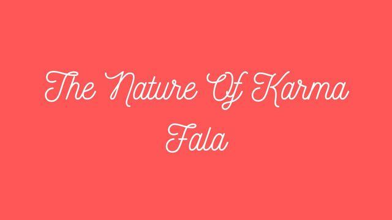{ width="200" }

    ### [The Nature Of Karma Fala](The-Nature-Of-Karma-Fala.md)
    
    **Read time:** 5 min
    
    An exploration of the nature of karma fala, delving into insights on karma and its outcomes.

- { width="200" }

    ### [Saving The Moon](Saving-The-Moon.md)
    
    **Read time:** 5 min
    
    A philosophical and poetic exploration of saving the moon, delving into metaphors and insights on lunar themes.
    

- 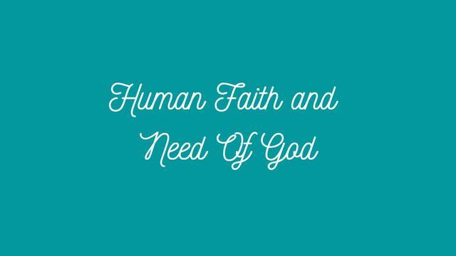{ width="200" }

    ### [Human Faith and Need Of God](Human-Faith-And-Need-Of-God.md)
    
    **Read time:** 5 min
    
    Exploration of human faith and the need for god, delving into insights on spirituality and divinity.

- 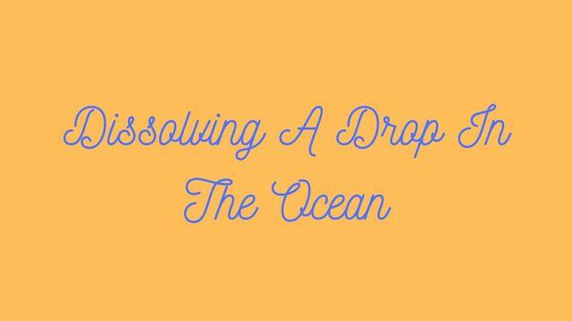{ width="200" }

    ### [Dissolving A Drop In The Ocean](Dissolving-A-Drop-In-The-Ocean.md)
    
    **Read time:** 6 min
    
    Exploration of dissolution and unity, delving into metaphors of the ocean and the drop.
    

- 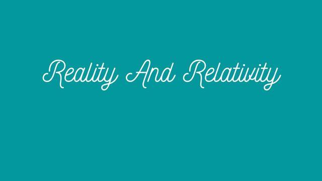{ width="200" }

    ### [Reality And Relativity](Reality-And-Relativity.md)
    
    **Read time:** 5 min
    
    Exploration of reality and relativity, delving into insights on perception and philosophical context.

- { width="200" }

    ### [Love As A Service](Love-As-A-Service.md)
    
    **Read time:** 5 min
    
    Exploration idea of love as a service, delving into insights on love, compassion, and service.
    

- 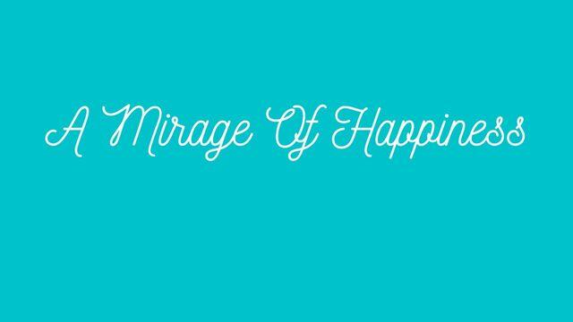{ width="200" }

    ### [A Mirage Of Happiness](A-Mirage-Of-Happiness.md)
    
    **Read time:** 5 min
    
    The mirages of happiness, delving into insights on pleasure and joy.

- 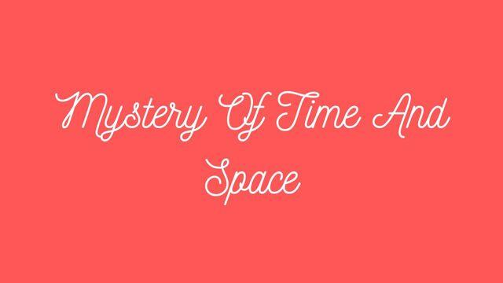{ width="200" }

    ### [Mystery Of Time And Space](Mystery-Of-Time-And-Space.md)
    
    **Read time:** 5 min
    
    A philosophical and poetic exploration of the mysteries of time and space, delving into conceptual insights and reflections.
    

- 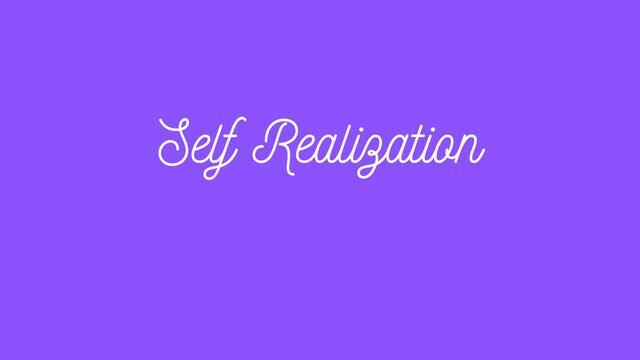{ width="200" }

    ### [Self Realization](Self-Realization.md)
    
    **Read time:** 5 min
    
    A poetic and philosophical journey into self-realization and moksha, exploring self-awareness and insights from Vedanta.

- 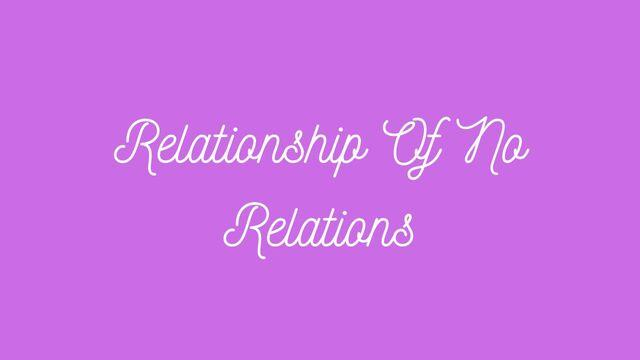{ width="200" }

    ### [Relationship Of No Relations](Relationship-Of-No-Relations.md)
    
    **Read time:** 5 min
    
    A philosophical exploration of relationships and human connections, delving into the concept of connections without traditional relations.
    

- { width="200" }

    ### [Desire Renunciation And A Limited Self](Desire-Renunciation-And-A-Limited-Self.md)
    
    **Read time:** 5 min
    
    A poetic and philosophical exploration of desire, renunciation, and the concept of a limited self, inspired by teachings from the Upanishads.

- { width="200" }

    ### [The Play Is Over](The-Play-Is-Over.md)
    
    **Read time:** 5 min
    
    A philosophical reflection on life's journey and transitions, exploring mindfulness and acceptance as the play of life comes to an end.
    

- { width="200" }

    ### [What Is The Waking State Of Life?](What-Is-The-Waking-State-Of-Life.md)
    
    **Read time:** 5 min
    
    An exploration of the waking state of life, mindfulness, and the philosophical insights on transitions between states of consciousness and spiritual a

- 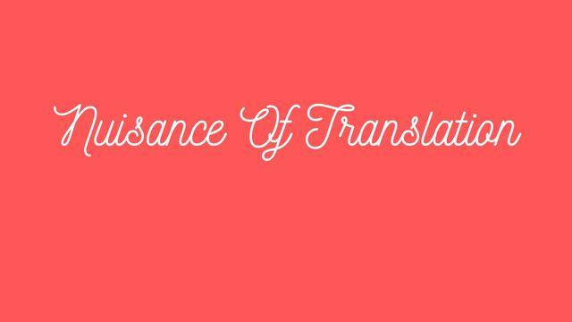{ width="200" }

    ### [Nuisance Of Translation](Nuisance-Of-Translation.md)
    
    **Read time:** 5 min
    
    An exploration of the challenges and nuisances in translating cultural concepts, inspired by Rajiv Malhotra's insights.
    

- 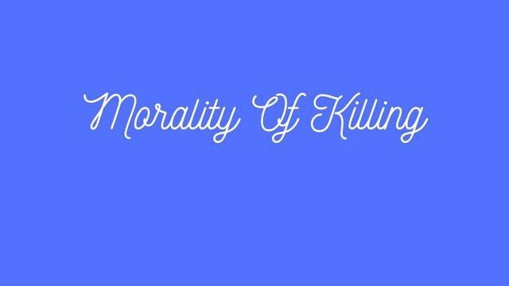{ width="200" }

    ### [Morality Of Killing](Morality-Of-Killing.md)
    
    **Read time:** 5 min
    
    A philosophical exploration of the moral and ethical implications of taking life, through poetry and cultural perspectives.

- { width="200" }

    ### [I Hate Reading](I-Hate-Reading.md)
    
    **Read time:** 5 min
    
    A personal reflection on the challenges and experiences of not enjoying reading, exploring cultural and personal perspectives.
    

- 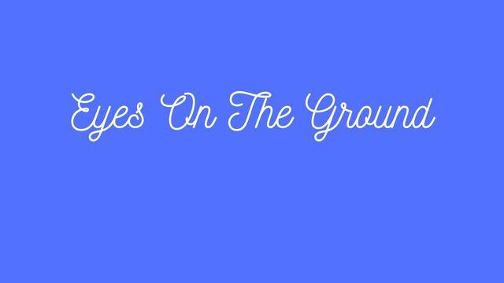{ width="200" }

    ### [Eyes On The Ground](Eyes-On-The-Ground.md)
    
    **Read time:** 5 min
    
    Whether I walk, jog or run If I have continuous eyes on the ground  I will not fall because of environmental reasons.

- 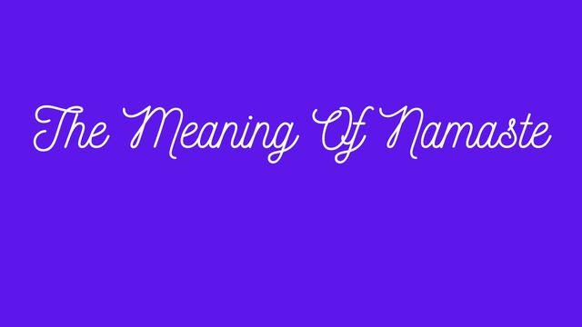{ width="200" }

    ### [The Meaning Of Namaste](The-Meaning-Of-Namaste.md)
    
    **Read time:** 5 min
    
    “नम्” धातु + ङे प्रत्यय = नम:+ते= नमस्ते नम् means bow down ते means to you or for you Why should I bow down to you? Because you are senior to me? Eld
    

- 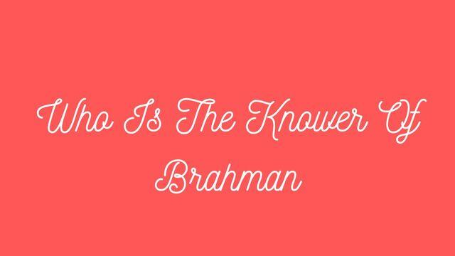{ width="200" }

    ### [Who Is The Knower Of Brahman?](Who-Is-The-Knower-Of-Brahman.md)
    
    **Read time:** 5 min
    
    Don’t make the mistake of thinking that Brahma Gnyani knows everything, he doesn’t eat anything, he doesn’t do anything, he sits at one place under a 

- { width="200" }

    ### [Four Ways Or One Way](Four-Ways-Or-One-Way.md)
    
    **Read time:** 5 min
    
    Examining the philosophical debate between multiple paths or a singular way to Moksha.
    

- { width="200" }

    ### [Moksha The God In Vedanta](Moksha-The-God-In-Vedanta.md)
    
    **Read time:** 5 min
    
    Exploring the concept of Moksha and its significance in Vedantic philosophy.

- 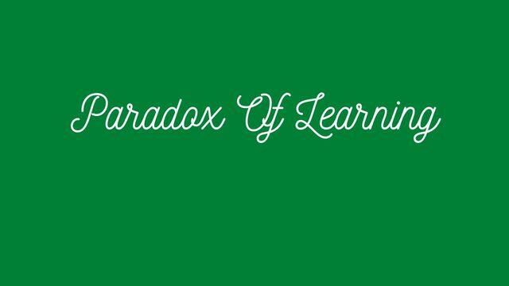{ width="200" }

    ### [Paradox Of Learning](Paradox-Of-Learning.md)
    
    **Read time:** 5 min
    
    Analyzing the complexities and contradictions within the learning process.
    

- { width="200" }

    ### [Suffering And Remedy](Suffering-And-Remedy.md)
    
    **Read time:** 5 min
    
    Exploring the philosophical perspectives on suffering and paths to remedy.

- 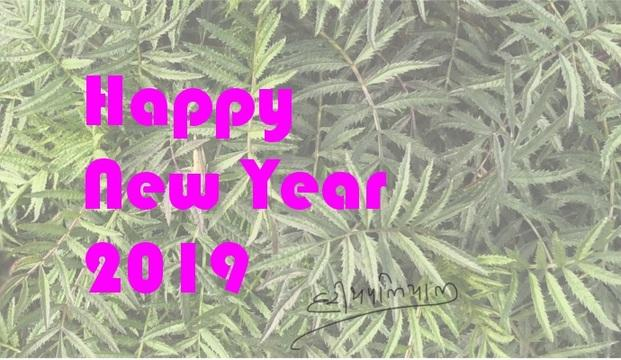{ width="200" }

    ### [Greetings For New Year 2019](Greetings-For-New-Year-2019.md)
    
    **Read time:** 5 min
    
    Extending warm wishes and reflections for the new year 2019.
    

- 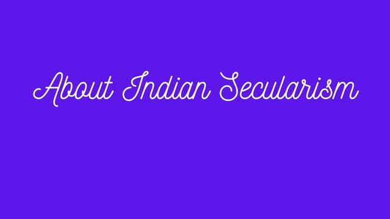{ width="200" }

    ### [About Indian Secularism](About-Indian-Secularism.md)
    
    **Read time:** 5 min
    
    Exploring the principles and challenges of secularism in India.

- { width="200" }

    ### [Who Killed Tantra](Who-Killed-Tantra.md)
    
    **Read time:** 5 min
    
    Investigating the decline of Tantra in Indian culture and its historical context.
    

- { width="200" }

    ### [Who Is Really Sleeping?](Who-Is-Really-Sleeping.md)
    
    **Read time:** 5 min
    
    A philosophical inquiry into awareness and consciousness inspired by the Bhagwat Gita.

- 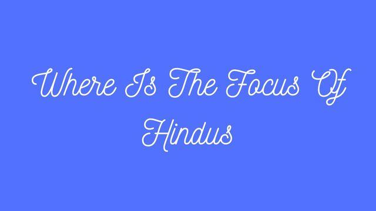{ width="200" }

    ### [Where Is The Focus Of Hindus?](Where-Is-The-Focus-Of-Hindus.md)
    
    **Read time:** 5 min
    
    Examining the cultural and educational priorities within Hindu society.
    

- 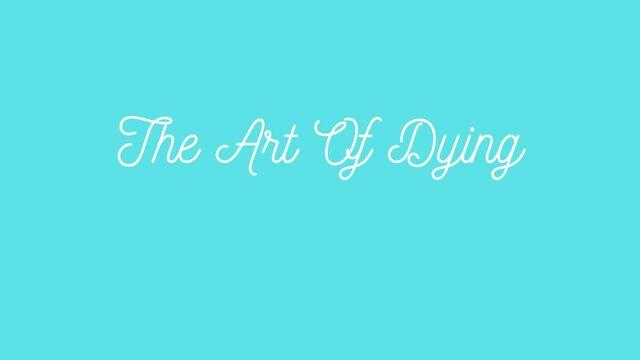{ width="200" }

    ### [The Art Of Dying](The-Art-Of-Dying.md)
    
    **Read time:** 5 min
    
    Exploring the philosophical and spiritual perspectives on death and dying.

- { width="200" }

    ### [Where Are Todays Rishis](Where-Are-Todays-Rishis.md)
    
    **Read time:** 5 min
    
    A poetic inquiry into the presence and role of Rishis in modern times.
    

- 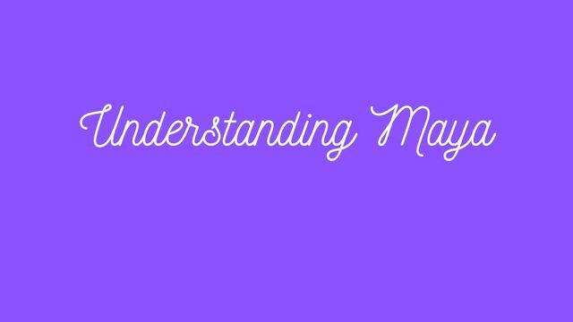{ width="200" }

    ### [Understanding Maya](Understanding-Maya.md)
    
    **Read time:** 5 min
    
    Delving into the concept of Maya and its implications in Vedantic philosophy.

- { width="200" }

    ### [When To Reincarnate?](When-To-Reincarnate.md)
    
    **Read time:** 5 min
    
    Exploring the philosophical and cultural perspectives on reincarnation.
    

- { width="200" }

    ### [God Is My Savior](God-Is-My-Savior.md)
    
    **Read time:** 5 min
    
    Reflecting on the role of divine guidance and protection in life.

- 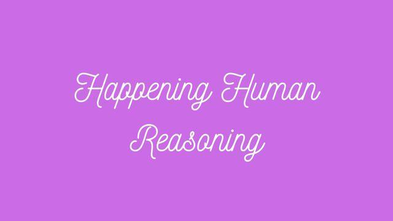{ width="200" }

    ### [Happening Human Reasoning](Happening-Human-Reasoning.md)
    
    **Read time:** 5 min
    
    Analyzing the dynamic nature of human reasoning and its philosophical implications.
    

- { width="200" }

    ### [The Process Of Cultural Digestion](The-Process-Of-Cultural-Digestion.md)
    
    **Read time:** 5 min
    
    Understanding how cultures assimilate and transform through education and interaction.

- 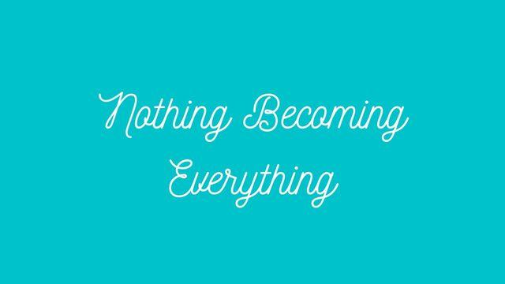{ width="200" }

    ### [Nothing Becoming Everything](Nothing-Becoming-Everything.md)
    
    **Read time:** 5 min
    
    A philosophical exploration of the transition from nothingness to everything in cultural contexts.
    

- { width="200" }

    ### [Managing Source Of Energy](Managing-Source-Of-Energy.md)
    
    **Read time:** 5 min
    
    Exploring methods to effectively manage energy sources through scientific and yogic practices.

- 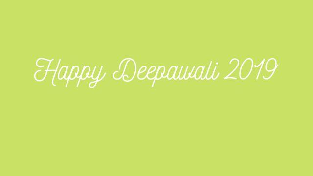{ width="200" }

    ### [Happy Deepawali 2019](Happy-Deepawali-2019.md)
    
    **Read time:** 5 min
    
    Extending warm wishes and reflections on the significance of Deepawali.
    

- 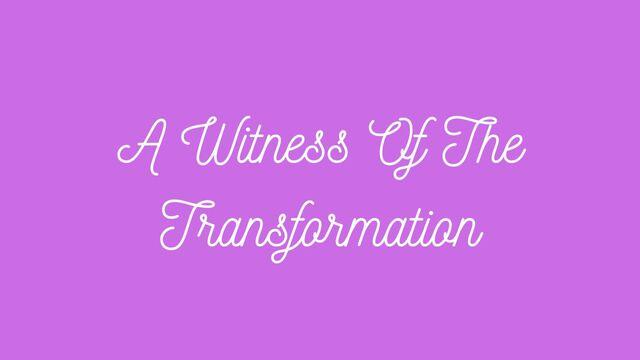{ width="200" }

    ### [A Witness Of The Transformation](A-Witness-Of-The-Transformation.md)
    
    **Read time:** 5 min
    
    Observing the journey of personal transformation through mindfulness and awareness.

- { width="200" }

    ### [Source Of The Color](Source-Of-The-Color.md)
    
    **Read time:** 5 min
    
    Investigating the origins and significance of color in the natural world.
    

- { width="200" }

    ### [Product Focus Vs Process Focus](Product-Focus-Vs-Process-Focus.md)
    
    **Read time:** 5 min
    
    Analyzing the differences between focusing on the product versus the process in various contexts.

- 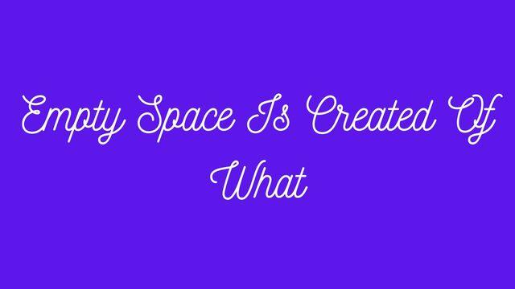{ width="200" }

    ### [Empty Space Is Created Of What?](Empty-Space-Is-Created-Of-What.md)
    
    **Read time:** 5 min
    
    Exploring the composition and nature of empty space in the universe.
    

- { width="200" }

    ### [What Kind Of Education?](What-Kind-Of-Education.md)
    
    **Read time:** 5 min
    
    Discussing the various approaches to education and their impact on learning.

- 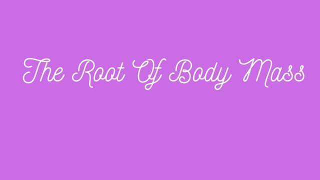{ width="200" }

    ### [The Root Of Body Mass](The-Root-Of-Body-Mass.md)
    
    **Read time:** 5 min
    
    Investigating the fundamental principles behind body mass and its formation.
    

- { width="200" }

    ### [The Purpose Of Motions](The-Purpose-Of-Motions.md)
    
    **Read time:** 5 min
    
    Exploring the philosophical significance of motion in life and nature.

- 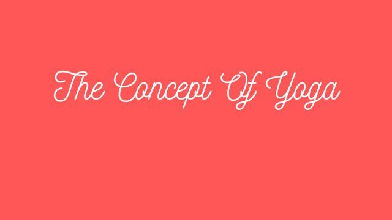{ width="200" }

    ### [The Concept Of Yoga](The-Concept-Of-Yoga.md)
    
    **Read time:** 5 min
    
    Understanding the essence of yoga and its role in Indian culture.
    

- { width="200" }

    ### [The Concept Of Six Sins](The-Concept-Of-Six-Sins.md)
    
    **Read time:** 5 min
    
    An exploration of the six sins within Indian cultural and philosophical contexts.

- { width="200" }

    ### [Raw Material To Create Space And Time](Raw-Material-To-Create-Space-And-Time.md)
    
    **Read time:** 5 min
    
    Investigating the fundamental elements that constitute space and time.
    

- 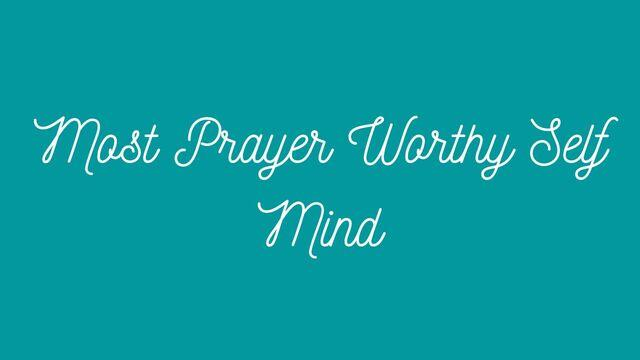{ width="200" }

    ### [Most Prayer Worthy Self Mind](Most-Prayer-Worthy-Self-Mind.md)
    
    **Read time:** 5 min
    
    Exploring the significance of prayer and self-awareness in personal growth.

- { width="200" }

    ### [Human Is Rotating Or Travelling](Human-Is-Rotating-Or-Travelling.md)
    
    **Read time:** 5 min
    
    A philosophical inquiry into human existence and movement.
    

- 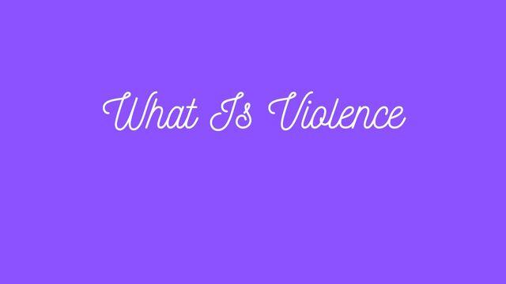{ width="200" }

    ### [What Is Violence](What-Is-Violence.md)
    
    **Read time:** 5 min
    
    Exploring the nature of violence and its ethical implications.

- 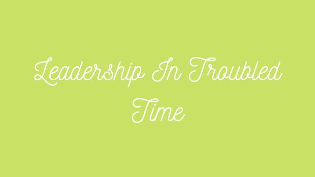{ width="200" }

    ### [Leadership In Troubled Time](Leadership-In-Troubled-Time.md)
    
    **Read time:** 5 min
    
    Insights on leading effectively during challenging times and crises.
    

- { width="200" }

    ### [Rider On Freedom](Rider-On-Freedom.md)
    
    **Read time:** 5 min
    
    Exploring the concept of freedom and its implications on education and society.

- 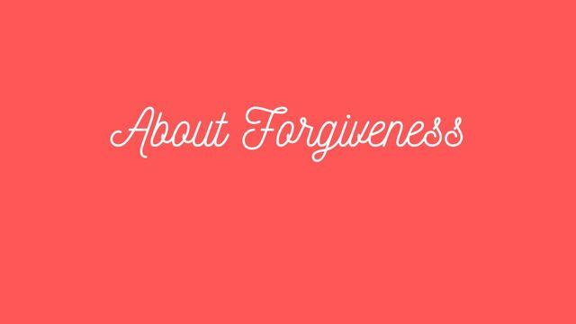{ width="200" }

    ### [About Forgiveness](About-Forgiveness.md)
    
    **Read time:** 5 min
    
    Exploring the concept of forgiveness and its impact on personal growth and relationships.
    

- 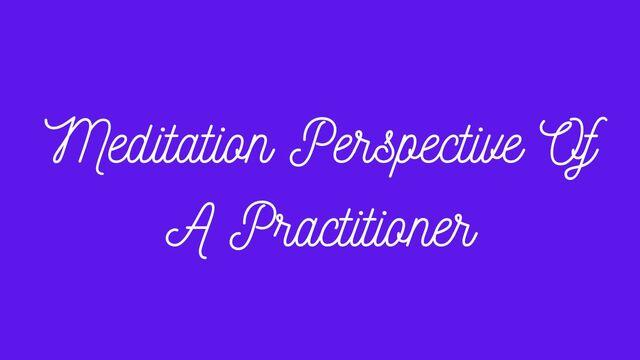{ width="200" }

    ### [Meditation Perspective Of A Practitioner](Meditation-Perspective-Of-A-Practitioner.md)
    
    **Read time:** 5 min
    
    Insights from a practitioner on the personal journey and benefits of meditation.

- { width="200" }

    ### [Job Satisfaction](Job-Satisfaction.md)
    
    **Read time:** 5 min
    
    Exploring the factors that contribute to job satisfaction and personal fulfillment.
    

- 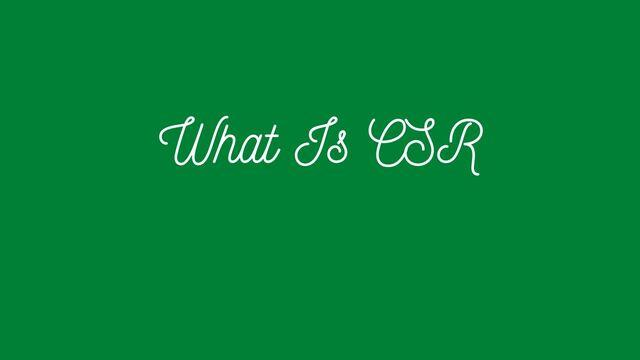{ width="200" }

    ### [What Is CSR](What-Is-Csr.md)
    
    **Read time:** 6 min
    
    This article explores the concept of Corporate Social Responsibility (CSR) and its significance in modern business practices, drawing insights from an

- { width="200" }

    ### [The Power For Prayer](The-Power-For-Prayer.md)
    
    **Read time:** 5 min
    
    Reflecting on the spiritual and emotional strength derived from prayer.
    

- 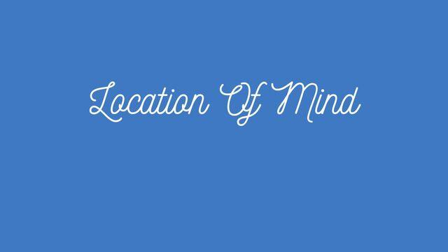{ width="200" }

    ### [Location Of Mind](Location-Of-Mind.md)
    
    **Read time:** 5 min
    
    Exploring the concept of mind and its perceived location.

- 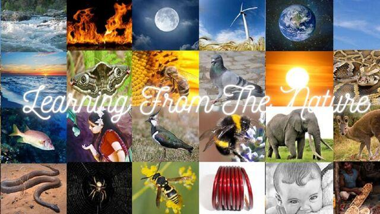{ width="200" }

    ### [Learning From The Nature](Learning-From-The-Nature.md)
    
    **Read time:** 7 min
    
    Insights and lessons drawn from observing nature.
    

- 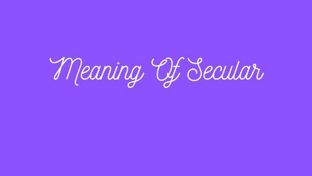{ width="200" }

    ### [Meaning Of Secular](Meaning-Of-Secular.md)
    
    **Read time:** 6 min
    
    Understanding the concept of secularism in the context of Indian culture.

- { width="200" }

    ### [Religion Of Humanity](Religion-Of-Humanity.md)
    
    **Read time:** 8 min
    
    Examining the concept of humanity as a universal religion.
    

- 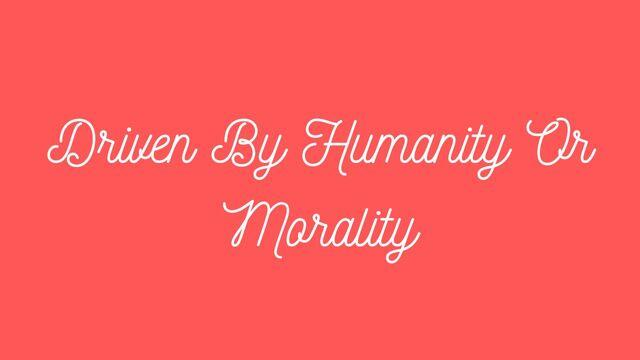{ width="200" }

    ### [Driven By Humanity Or Morality](Driven-By-Humanity-Or-Morality.md)
    
    **Read time:** 5 min
    
    A philosophical exploration of the driving forces of humanity and morality.

- 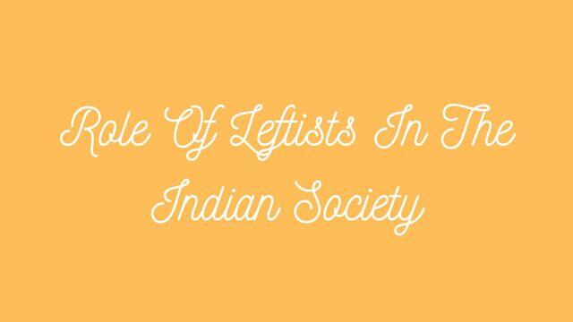{ width="200" }

    ### [Role Of Leftists In The Indian Society](Role-Of-Leftists-In-The-Indian-Society.md)
    
    **Read time:** 5 min
    
    An analysis of the influence and role of leftists in Indian society.
    

- 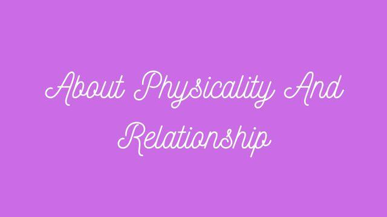{ width="200" }

    ### [About Physicality And Relationship](About-Physicality-And-Relationship.md)
    
    **Read time:** 5 min
    
    Exploring the dynamics of physicality and relationships through philosophical insights.

- 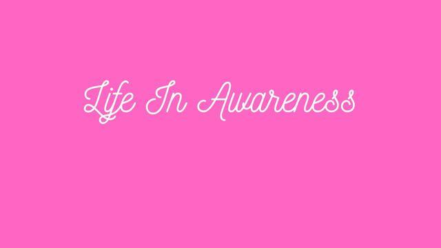{ width="200" }

    ### [Life In Awareness](Life-In-Awareness.md)
    
    **Read time:** 5 min
    
    Insights into living a life of awareness and mindfulness.
    

- { width="200" }

    ### [My Significance](My-Significance.md)
    
    **Read time:** 5 min
    
    A philosophical reflection on personal significance and existence.

- { width="200" }

    ### [Indian Genes Inner Science](Indian-Genes-Inner-Science.md)
    
    **Read time:** 5 min
    
    Exploring the cultural and philosophical aspects of Indian genetic heritage.
    

- { width="200" }

    ### [No Universal Teachings](No-Universal-Teachings.md)
    
    **Read time:** 5 min
    
    A discussion on the limitations of universal teachings and their adaptability.

- { width="200" }

    ### [How To Acquire New Skills](How-To-Acquire-New-Skills.md)
    
    **Read time:** 5 min
    
    Strategies and insights on acquiring new skills effectively.
    

- 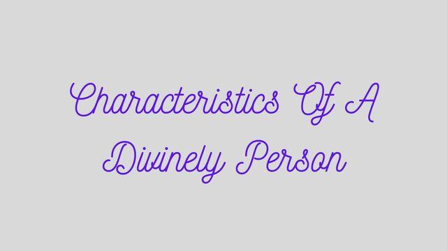{ width="200" }

    ### [Characteristics Of A Divinely Person](Characteristics-Of-A-Divinely-Person.md)
    
    **Read time:** 5 min
    
    An exploration of divine qualities as described in the Bhagwat Gita.

- 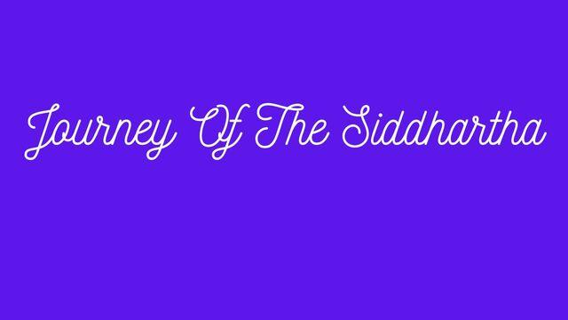{ width="200" }

    ### [Journey Of The Siddhartha](Journey-Of-The-Siddhartha.md)
    
    **Read time:** 5 min
    
    A reflective journey through the life and teachings of Siddhartha.
    

- 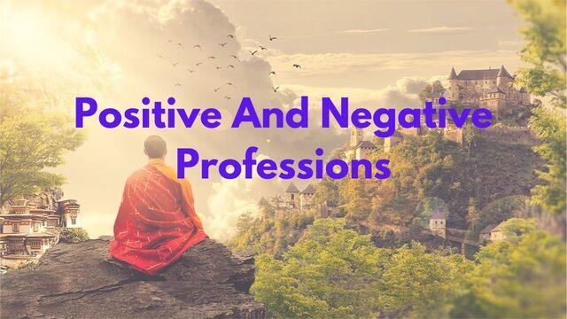{ width="200" }

    ### [Positive And Negative Professions](Positive-And-Negative-Professions.md)
    
    **Read time:** 5 min
    
    Reflecting on the impact of professions on personal and societal growth.

- 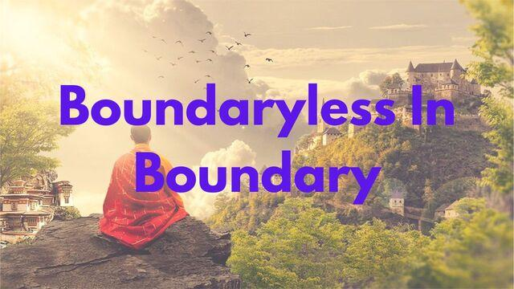{ width="200" }

    ### [Boundaryless In Boundary](Boundaryless-In-Boundary.md)
    
    **Read time:** 5 min
    
    Exploring the paradox of boundaries and freedom within the mind.
    

- { width="200" }

    ### [About Free Will](About-Free-Will.md)
    
    **Read time:** 5 min
    
    A philosophical discussion on the nature of free will and its implications.

- { width="200" }

    ### [Who Is Ravana?](Who-Is-Ravana.md)
    
    **Read time:** 5 min
    
    Exploring the complex character of Ravana through cultural and philosophical lenses.
    

- 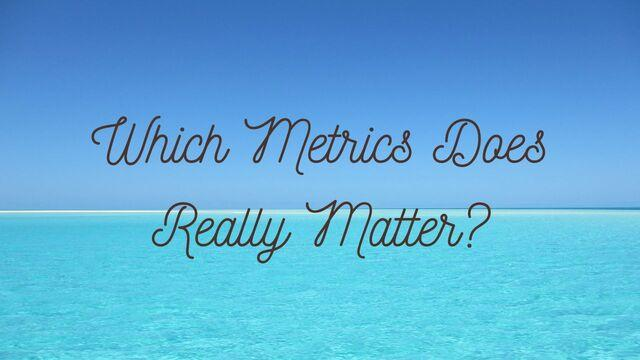{ width="200" }

    ### [Which Metrics Does Really Matter?](Which-Metrics-Does-Really-Matter.md)
    
    **Read time:** 5 min
    
    A philosophical inquiry into the metrics that truly matter in business and life.

- { width="200" }

    ### [Greetings For New Year 2017](Greetings-For-New-Year-2017.md)
    
    **Read time:** 5 min
    
    Warm wishes and reflections for the New Year 2017.
    

- { width="200" }

    ### [Human And His Faith](Human-And-His-Faith.md)
    
    **Read time:** 5 min
    
    A poetic exploration of the relationship between humanity and faith.

- 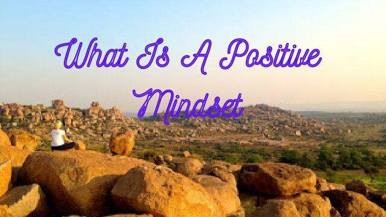{ width="200" }

    ### [What Is A Positive Mindset](What-Is-A-Positive-Mindset.md)
    
    **Read time:** 7 min
    
    Understanding the elements of a positive mindset through philosophical and poetic lenses.
    

- { width="200" }

    ### [The Way To Learn](The-Way-To-Learn.md)
    
    **Read time:** 5 min
    
    Insights into effective learning methods and the philosophy of education.

- { width="200" }

    ### [Who Is The Best Friend?](Who-Is-The-Best-Friend.md)
    
    **Read time:** 5 min
    
    Exploring the qualities that define a true friend through philosophical insights.
    

- 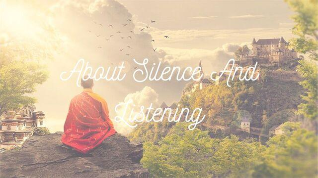{ width="200" }

    ### [About Silence And Listening](About-Silence-And-Listening.md)
    
    **Read time:** 6 min
    
    A deep dive into the power of silence and the art of listening.

- { width="200" }

    ### [Who Is Guru](Who-Is-Guru.md)
    
    **Read time:** 9 min
    
    An exploration of the role and significance of a Guru in education and culture.
    

- { width="200" }

    ### [Sources Of Evidence](Sources-Of-Evidence.md)
    
    **Read time:** 7 min
    
    An analysis of different sources of evidence and their impact on understanding.

- { width="200" }

    ### [The Final Settlement](The-Final-Settlement.md)
    
    **Read time:** 8 min
    
    A philosophical reflection on life’s ultimate questions and the idea of finality.
    

- { width="200" }

    ### [Who Is Athiest](Who-Is-Athiest.md)
    
    **Read time:** 7 min
    
    A thoughtful exploration of atheism and the quest for truth.

- { width="200" }

    ### [My Creator](My-Creator.md)
    
    **Read time:** 5 min
    
    A reflective piece on the concept of creation and the creator within mindfulness and philosophy.
    

- { width="200" }

    ### [About Relationship](About-Relationship.md)
    
    **Read time:** 7 min
    
    An insightful exploration of relationships through the lens of philosophy and Vedanta.

- { width="200" }

    ### [About Yagnya](About-Yagnya.md)
    
    **Read time:** 5 min
    
    An exploration of the concept of Yagnya in Indian culture and its philosophical significance.
    

- 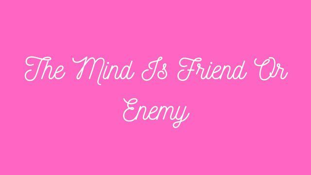{ width="200" }

    ### [The Mind Is Friend Or Enemy](The-Mind-Is-Friend-Or-Enemy.md)
    
    **Read time:** 5 min
    
    A philosophical examination of the dual nature of the mind as both an ally and adversary.

- 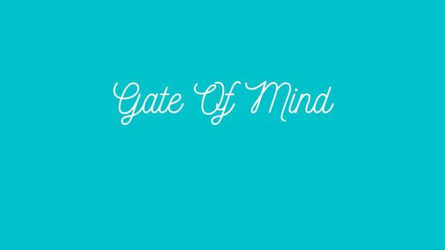{ width="200" }

    ### [Gate Of Mind](Gate-Of-Mind.md)
    
    **Read time:** 5 min
    
    Exploring the philosophical and spiritual gateways of the mind.
    

- { width="200" }

    ### [About Peace Or The Peace](About-Peace-Or-The-Peace.md)
    
    **Read time:** 6 min
    
    Peace and happiness in life is a desire of every human. Is it a goal of life, which we shall achieve one day? If you don’t have it then it may be a go

- { width="200" }

    ### [About Astika](About-Astika.md)
    
    **Read time:** 5 min
    
    An exploration of the concept of Astika within the framework of Dharma and philosophy.
    

- 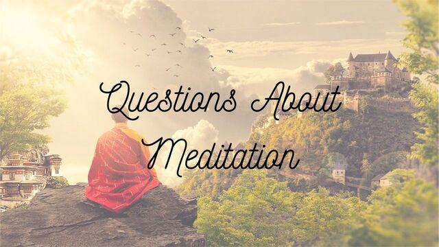{ width="200" }

    ### [Questions About Meditation](Questions-About-Meditation.md)
    
    **Read time:** 5 min
    
    A contemplative inquiry into the practice and philosophy of meditation.

- 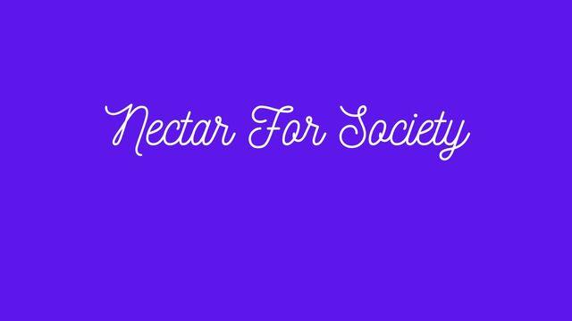{ width="200" }

    ### [Nectar For Society](Nectar-For-Society.md)
    
    **Read time:** 6 min
    
    Exploring the cultural and philosophical ideals that serve as a foundation for society.
    

- 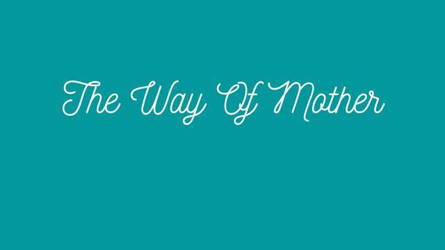{ width="200" }

    ### [The Way Of Mother](The-Way-Of-Mother.md)
    
    **Read time:** 6 min
    
    A heartfelt story exploring the nurturing and guiding role of a mother.

- { width="200" }

    ### [Mind And Pleasure](Mind-And-Pleasure.md)
    
    **Read time:** 5 min
    
    Examining the intricate relationship between the mind and the pursuit of pleasure.
    

- 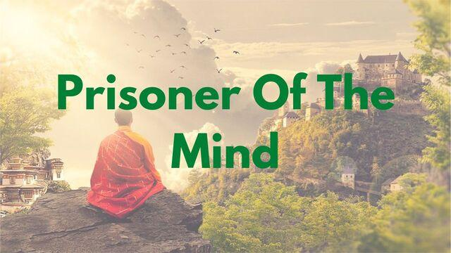{ width="200" }

    ### [Prisoner Of The Mind](Prisoner-Of-The-Mind.md)
    
    **Read time:** 5 min
    
    A poetic reflection on the constraints imposed by the mind and the journey to liberation.

- 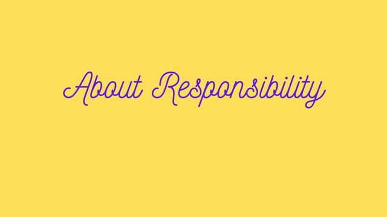{ width="200" }

    ### [About Responsibility](About-Responsibility.md)
    
    **Read time:** 5 min
    
    An exploration of the philosophical underpinnings of responsibility and its impact on human behavior.
    

- { width="200" }

    ### [About Shoonya Zero](About-Shoonya-Zero.md)
    
    **Read time:** 5 min
    
    Delving into the philosophical implications of Shoonya, or Zero, in various contexts.

- 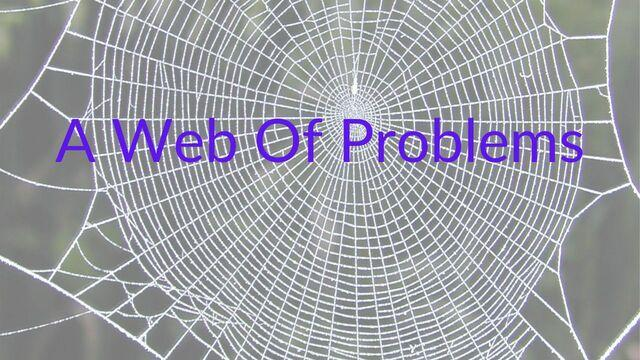{ width="200" }

    ### [An Example Of Web Of Problems](An-Example-Of-Web-Of-Problems.md)
    
    **Read time:** 5 min
    
    A personal narrative exploring the interconnected challenges of life.
    

- { width="200" }

    ### [About Experience](About-Experience.md)
    
    **Read time:** 5 min
    
    Understanding the role of experience in shaping human perception and philosophy.

- 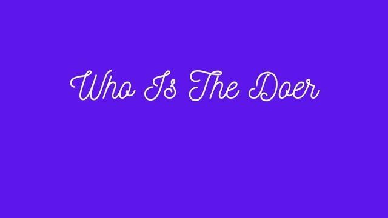{ width="200" }

    ### [Who Is The Doer?](Who-Is-The-Doer.md)
    
    **Read time:** 5 min
    
    A philosophical inquiry into the concept of agency and action.
    

- 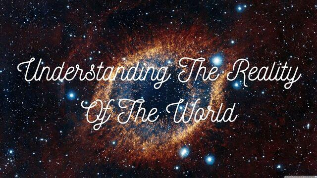{ width="200" }

    ### [Understanding The Reality Of The World](Understanding-The-Reality-Of-The-World.md)
    
    **Read time:** 5 min
    
    Exploring the philosophical concepts of reality as depicted in the Bhagwat Gita.

- { width="200" }

    ### [Greetings For New Year 2016](Greetings-For-New-Year-2016.md)
    
    **Read time:** 5 min
    
    Welcoming the New Year 2016 with enthusiasm and hope for a prosperous future.
    

- 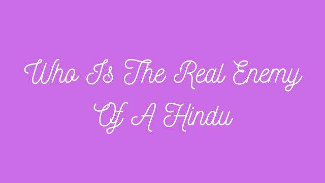{ width="200" }

    ### [Who Is The Real Enemy Of A Hindu](Who-Is-The-Real-Enemy-Of-A-Hindu.md)
    
    **Read time:** 5 min
    
    An analysis of the challenges faced by Hindu society in identifying its true adversaries.

- { width="200" }

    ### [Thirukkural In Hindi](Thirukkural-In-Hindi.md)
    
    **Read time:** 5 min
    
    An exploration of Thirukkural translated into Hindi, highlighting its cultural and philosophical significance.
    

- { width="200" }

    ### [Greetings For New Year 2015](Greetings-For-New-Year-2015.md)
    
    **Read time:** 5 min
    
    Celebrating the arrival of 2015 with joy and optimism for the future.

- { width="200" }

    ### [Greetings For New Year 2013](Greetings-For-New-Year-2013.md)
    
    **Read time:** 5 min
    
    A joyful message welcoming the New Year 2013, filled with hope and new beginnings.
    

- { width="200" }

    ### [Greetings For New Year 2012](Greetings-For-New-Year-2012.md)
    
    **Read time:** 5 min
    
    A warm greeting for the New Year 2012, reflecting on past achievements and future aspirations.

