# Welcome to WIA Posts - Spritual Drops!

## A brief [introduction to my spiritual journey](/wia-home) and introduction to this deeper dimensions of life.

- { width="200" }

    ### [2024 Elections and Life After](wiaposts/2024-Elections-and-life-After.md)
    
    **Read time:** 5 min
    
    EXCERPT Not Found

- 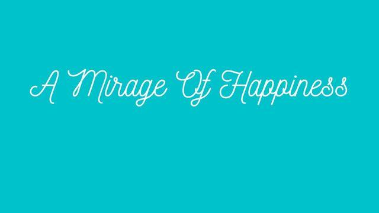{ width="200" }

    ### [A Mirage Of Happiness](wiaposts/A-Mirage-Of-Happiness.md)
    
    **Read time:** 5 min
    
    The mirages of happiness, delving into insights on pleasure and joy.
    

- { width="200" }

    ### [A Price For The Wrong Identification](wiaposts/A-Price-For-The-Wrong-Identification.md)
    
    **Read time:** 5 min
    
    EXCERPT Not Found

- 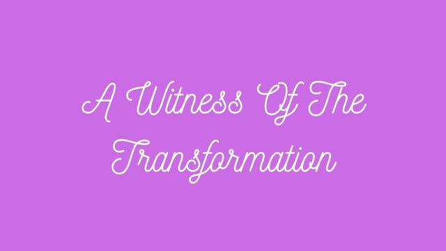{ width="200" }

    ### [A Witness Of The Transformation](wiaposts/A-Witness-Of-The-Transformation.md)
    
    **Read time:** 5 min
    
    Observing the journey of personal transformation through mindfulness and awareness.
    

- { width="200" }

    ### [ABC of Statistics](wiaposts/ABC-of-Statistics.md)
    
    **Read time:** 5 min
    
    EXCERPT Not Found

- { width="200" }

    ### [About Astika](wiaposts/About-Astika.md)
    
    **Read time:** 5 min
    
    An exploration of the concept of Astika within the framework of Dharma and philosophy.
    

- { width="200" }

    ### [About Eligibility](wiaposts/About-Eligibility.md)
    
    **Read time:** 5 min
    
    EXCERPT Not Found

- { width="200" }

    ### [About Experience](wiaposts/About-Experience.md)
    
    **Read time:** 5 min
    
    Understanding the role of experience in shaping human perception and philosophy.
    

- { width="200" }

    ### [About Food And Nourishment](wiaposts/About-Food-And-Nourishment.md)
    
    **Read time:** 6 min
    
    EXCERPT Not Found

- 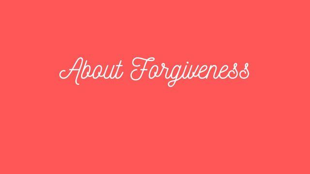{ width="200" }

    ### [About Forgiveness](wiaposts/About-Forgiveness.md)
    
    **Read time:** 5 min
    
    Exploring the concept of forgiveness and its impact on personal growth and relationships.
    

- { width="200" }

    ### [About Free Will](wiaposts/About-Free-Will.md)
    
    **Read time:** 5 min
    
    A philosophical discussion on the nature of free will and its implications.

- { width="200" }

    ### [About Friendship](wiaposts/About-Friendship.md)
    
    **Read time:** 5 min
    
    EXCERPT Not Found
    

- 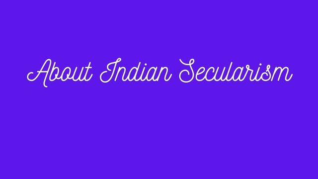{ width="200" }

    ### [About Indian Secularism](wiaposts/About-Indian-Secularism.md)
    
    **Read time:** 5 min
    
    Exploring the principles and challenges of secularism in India.

- { width="200" }

    ### [About Peace Or The Peace](wiaposts/About-Peace-Or-The-Peace.md)
    
    **Read time:** 6 min
    
    EXCERPT Not Found
    

- 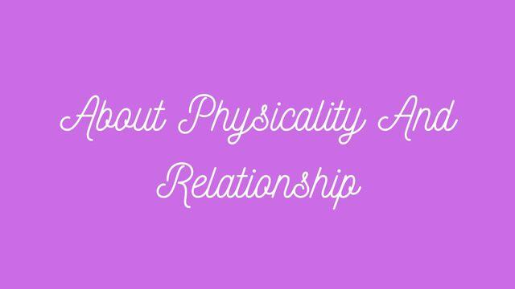{ width="200" }

    ### [About Physicality And Relationship](wiaposts/About-Physicality-And-Relationship.md)
    
    **Read time:** 5 min
    
    Exploring the dynamics of physicality and relationships through philosophical insights.

- { width="200" }

    ### [About Relationship](wiaposts/About-Relationship.md)
    
    **Read time:** 7 min
    
    An insightful exploration of relationships through the lens of philosophy and Vedanta.
    

- 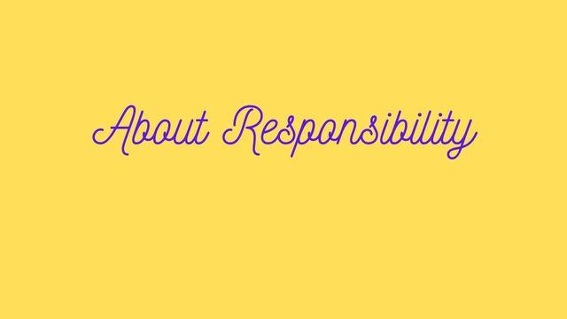{ width="200" }

    ### [About Responsibility](wiaposts/About-Responsibility.md)
    
    **Read time:** 5 min
    
    An exploration of the philosophical underpinnings of responsibility and its impact on human behavior.

- { width="200" }

    ### [About Shoonya Zero](wiaposts/About-Shoonya-Zero.md)
    
    **Read time:** 5 min
    
    Delving into the philosophical implications of Shoonya, or Zero, in various contexts.
    

- 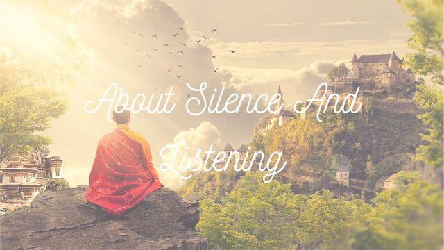{ width="200" }

    ### [About Silence And Listening](wiaposts/About-Silence-And-Listening.md)
    
    **Read time:** 6 min
    
    A deep dive into the power of silence and the art of listening.

- { width="200" }

    ### [About Yagnya](wiaposts/About-Yagnya.md)
    
    **Read time:** 5 min
    
    An exploration of the concept of Yagnya in Indian culture and its philosophical significance.
    

- { width="200" }

    ### [AI And Free Soul](wiaposts/Ai-And-Free-Soul.md)
    
    **Read time:** 5 min
    
    EXCERPT Not Found

- { width="200" }

    ### [All Religions are not Same](wiaposts/All-Religions-are-not-Same.md)
    
    **Read time:** 10 min
    
    EXCERPT Not Found
    

- 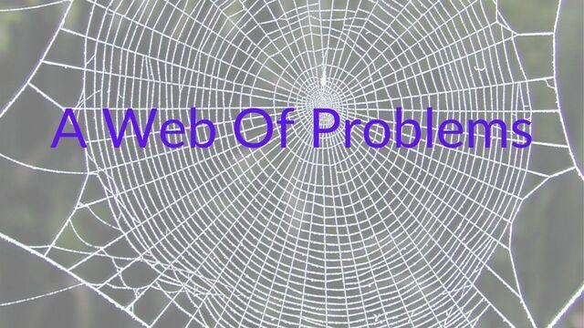{ width="200" }

    ### [An Example Of Web Of Problems](wiaposts/An-Example-Of-Web-Of-Problems.md)
    
    **Read time:** 5 min
    
    A personal narrative exploring the interconnected challenges of life.

- 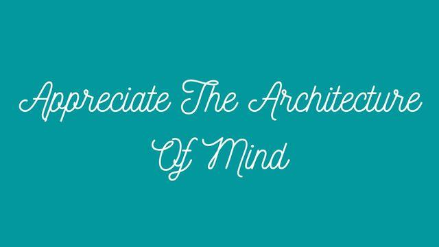{ width="200" }

    ### [Appreciate the Architecture of Mind](wiaposts/Appreciate-The-Architecture-Of-Mind.md)
    
    **Read time:** 5 min
    
    EXCERPT Not Found
    

- { width="200" }

    ### [Are You Feeling Stuck in Life](wiaposts/Are-You-Feeling-Stuck-in-Life.md)
    
    **Read time:** 5 min
    
    EXCERPT Not Found

- { width="200" }

    ### [Are you not Nature?](wiaposts/Are-You-Not-Nature.md)
    
    **Read time:** 5 min
    
    EXCERPT Not Found
    

- 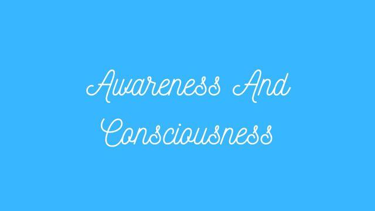{ width="200" }

    ### [Awareness and Consciousness](wiaposts/Awareness-And-Consciousness.md)
    
    **Read time:** 5 min
    
    EXCERPT Not Found

- { width="200" }

    ### [Awareness and Who Am I](wiaposts/Awareness-And-Who-Am-I.md)
    
    **Read time:** 5 min
    
    EXCERPT Not Found
    

- { width="200" }

    ### [Bhaav-Vivek Balance](wiaposts/Bhaav-Vivek-Balance.md)
    
    **Read time:** 5 min
    
    EXCERPT Not Found

- 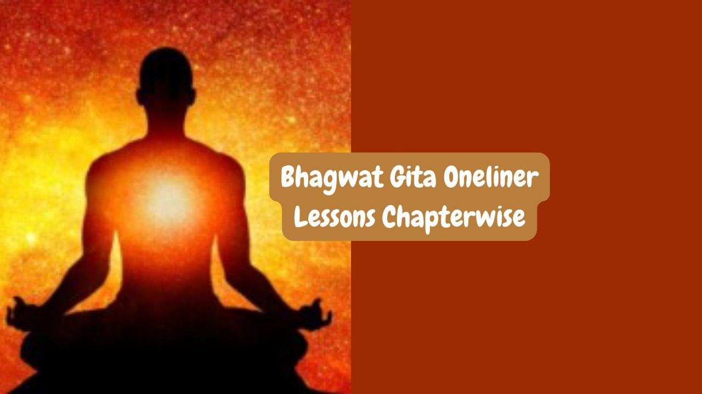{ width="200" }

    ### [Bhagwat Gita Oneliner Lessons Chapterwise](wiaposts/Bhagwat-Gita-Oneliner-Lessons-Chapterwise.md)
    
    **Read time:** 5 min
    
    The Bhagavad Gita, a sacred Hindu scripture, consists of 18 chapters, each addressing different aspects of life, duty, and spirituality through the di
    

- 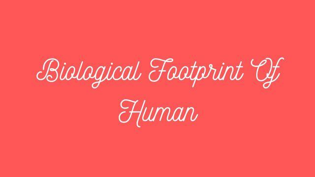{ width="200" }

    ### [Biological Footprint of Human](wiaposts/Biological-Footprint-Of-Human.md)
    
    **Read time:** 5 min
    
    EXCERPT Not Found

- { width="200" }

    ### [Bondage of the World](wiaposts/Bondage-Of-The-World.md)
    
    **Read time:** 5 min
    
    EXCERPT Not Found
    

- 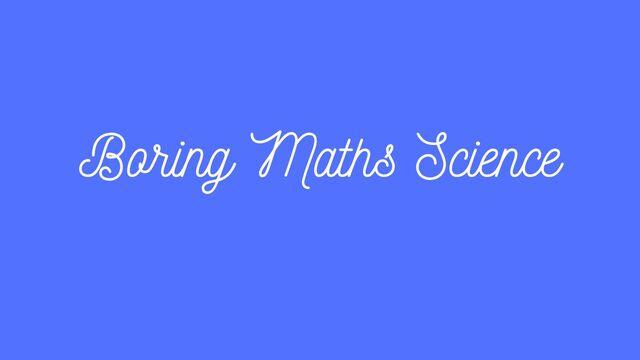{ width="200" }

    ### [Boring Maths and Science](wiaposts/Boring-Maths-And-Science.md)
    
    **Read time:** 5 min
    
    Reflection on the perceived boredom in maths and science, exploring learning and curiosity.

- 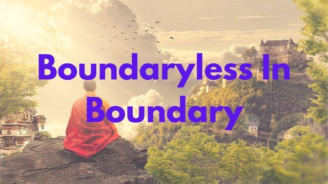{ width="200" }

    ### [Boundaryless In Boundary](wiaposts/Boundaryless-In-Boundary.md)
    
    **Read time:** 5 min
    
    Exploring the paradox of boundaries and freedom within the mind.
    

- { width="200" }

    ### [Business of Quotations](wiaposts/Business-Of-Quotations.md)
    
    **Read time:** 5 min
    
    EXCERPT Not Found

- { width="200" }

    ### [Cause Of Pain And Suffering](wiaposts/Cause-Of-Pain-And-Suffering.md)
    
    **Read time:** 5 min
    
    Exploration of the causes of pain and suffering, delving into insights on human experience and healing.
    

- 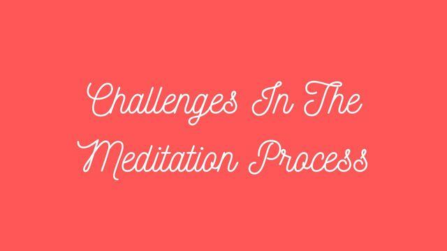{ width="200" }

    ### [Challenges In The Meditation Process](wiaposts/Challenges-In-The-Meditation-Process.md)
    
    **Read time:** 5 min
    
    EXCERPT Not Found

- 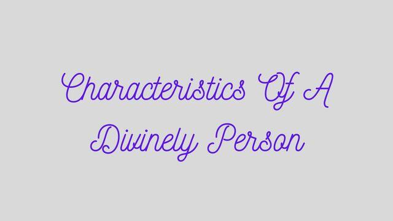{ width="200" }

    ### [Characteristics Of A Divinely Person](wiaposts/Characteristics-Of-A-Divinely-Person.md)
    
    **Read time:** 5 min
    
    An exploration of divine qualities as described in the Bhagwat Gita.
    

- { width="200" }

    ### [Choose Your Attitude](wiaposts/Choose-Your-Attitude.md)
    
    **Read time:** 5 min
    
    A philosophical and poetic exploration of attitude, delving into insights on mindset and choice.

- 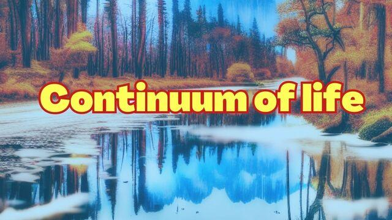{ width="200" }

    ### [Continuum of life](wiaposts/Continuum-of-life.md)
    
    **Read time:** 5 min
    
    EXCERPT Not Found
    

- 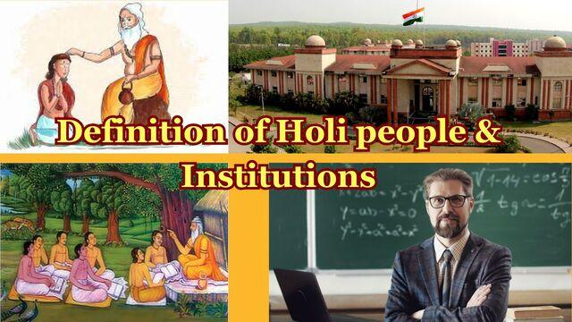{ width="200" }

    ### [Definitions of Holi people](wiaposts/Definitions-of-Holi-people.md)
    
    **Read time:** 7 min
    
    EXCERPT Not Found

- { width="200" }

    ### [Desire Renunciation And A Limited Self](wiaposts/Desire-Renunciation-And-A-Limited-Self.md)
    
    **Read time:** 5 min
    
    A poetic and philosophical exploration of desire, renunciation, and the concept of a limited self, inspired by teachings from the Upanishads.
    

- 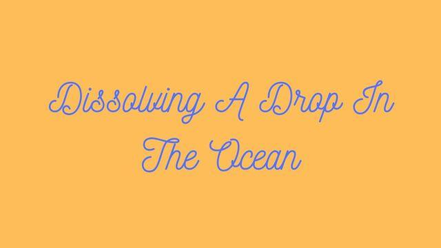{ width="200" }

    ### [Dissolving A Drop In The Ocean](wiaposts/Dissolving-A-Drop-In-The-Ocean.md)
    
    **Read time:** 6 min
    
    Exploration of dissolution and unity, delving into metaphors of the ocean and the drop.

- { width="200" }

    ### [Diwali 2021](wiaposts/Diwali-2021.md)
    
    **Read time:** 5 min
    
    EXCERPT Not Found
    

- { width="200" }

    ### [Diwali 2022](wiaposts/Diwali-2022.md)
    
    **Read time:** 5 min
    
    EXCERPT Not Found

- { width="200" }

    ### [Do I Have Free Will?](wiaposts/Do-I-Have-Free-Will.md)
    
    **Read time:** 5 min
    
    Exploration of free will, delving into insights from Vedanta and philosophical contexts.
    

- 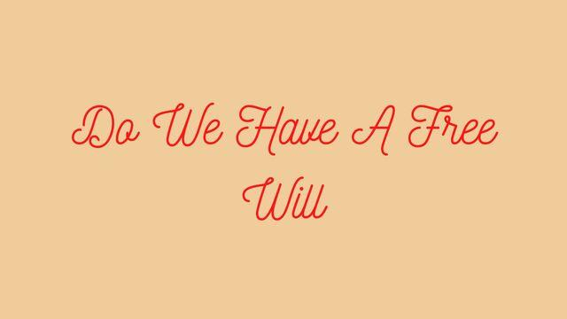{ width="200" }

    ### [Do We Have A Free Will](wiaposts/Do-We-Have-A-Free-Will.md)
    
    **Read time:** 5 min
    
    Exploration of free will, delving into insights from Vedanta and philosophical contexts.

- { width="200" }

    ### [Don't Be Afraid Of Covid](wiaposts/Dont-Be-Afraid-Of-Covid.md)
    
    **Read time:** 5 min
    
    EXCERPT Not Found
    

- 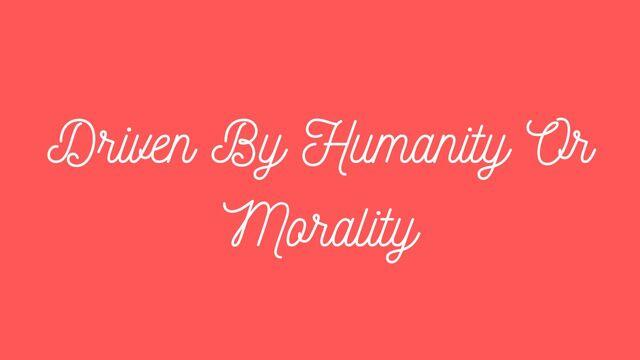{ width="200" }

    ### [Driven By Humanity Or Morality](wiaposts/Driven-By-Humanity-Or-Morality.md)
    
    **Read time:** 5 min
    
    A philosophical exploration of the driving forces of humanity and morality.

- 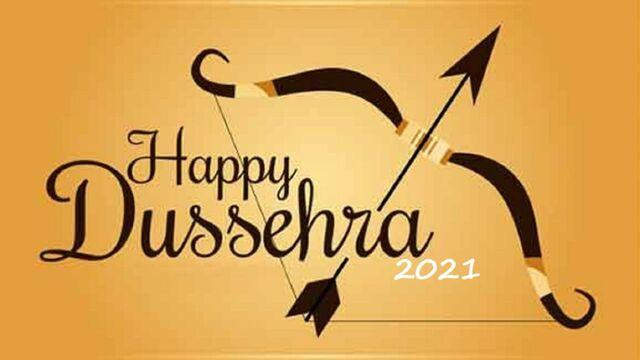{ width="200" }

    ### [Dussehra 2021](wiaposts/Dussehra-2021.md)
    
    **Read time:** 5 min
    
    EXCERPT Not Found
    

- 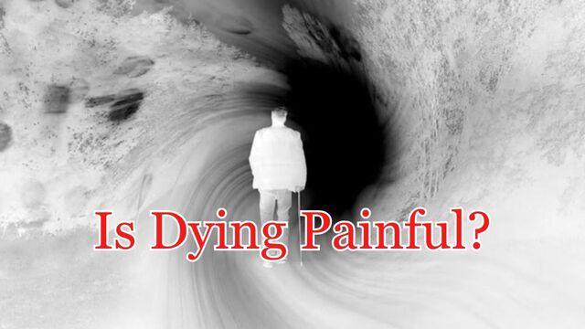{ width="200" }

    ### [Is Dying Painful?](wiaposts/Dying is Painful.md)
    
    **Read time:** 5 min
    
    EXCERPT Not Found

- { width="200" }

    ### [Earlier Hindu Institutions and Today's Society](wiaposts/Earlier-Hindu-Institutions-And-Todays-Society.md)
    
    **Read time:** 5 min
    
    EXCERPT Not Found
    

- 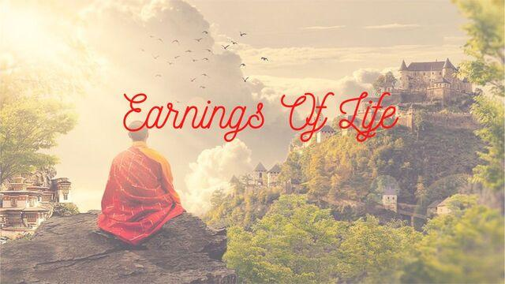{ width="200" }

    ### [Earnings Of Life](wiaposts/Earnings-Of-Life.md)
    
    **Read time:** 5 min
    
    EXCERPT Not Found

- 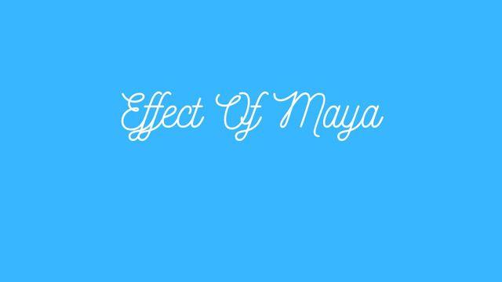{ width="200" }

    ### [Effect of Maya](wiaposts/Effect-Of-Maya.md)
    
    **Read time:** 5 min
    
    EXCERPT Not Found
    

- { width="200" }

    ### [Efforts to Become Happy and Joyful](wiaposts/Efforts-To-Become-Happy-And-Joyful.md)
    
    **Read time:** 5 min
    
    EXCERPT Not Found

- 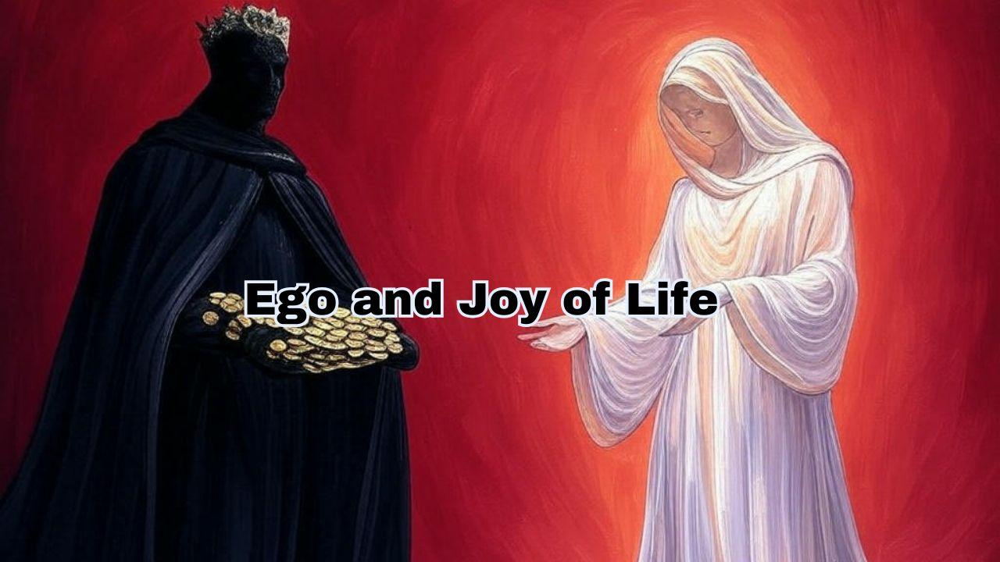{ width="200" }

    ### [How to Overcome the Ego and Find Joy in Life?](wiaposts/Ego-and-Joy-of-Life.md)
    
    **Read time:** 5 min
    
    How to overcome the ego and find joy in life? In this article, I share my insights on how to find happiness and fulfillment by letting go of the ego.
    

- 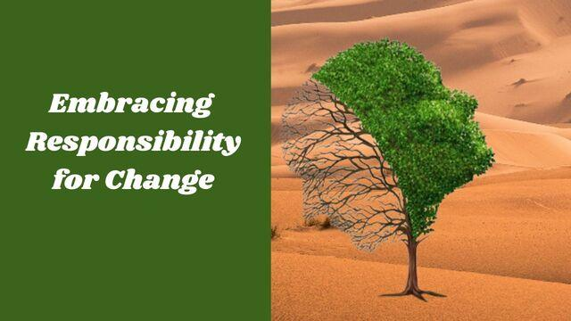{ width="200" }

    ### [Embracing Responsibility for Change](wiaposts/Embracing-Responsibility-for-Change.md)
    
    **Read time:** 5 min
    
    EXCERPT Not Found

- 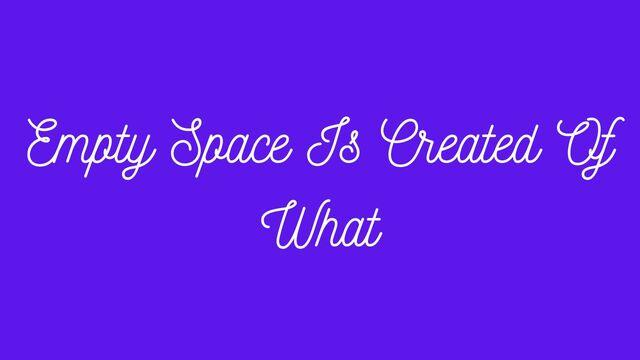{ width="200" }

    ### [Empty Space Is Created Of What?](wiaposts/Empty-Space-Is-Created-Of-What.md)
    
    **Read time:** 5 min
    
    Exploring the composition and nature of empty space in the universe.
    

- 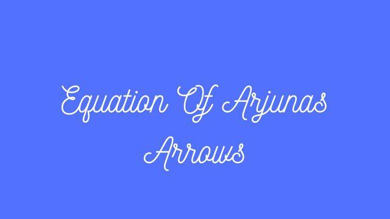{ width="200" }

    ### [Equation Of Arjunas Arrows](wiaposts/Equation-Of-Arjunas-Arrows.md)
    
    **Read time:** 5 min
    
    A philosophical and poetic exploration of Arjuna's arrows, delving into insights on Indian sciences and mythology.

- 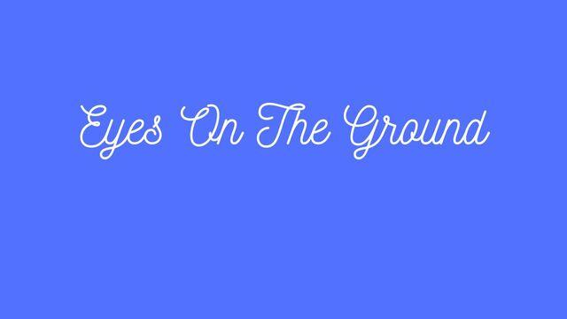{ width="200" }

    ### [Eyes On The Ground](wiaposts/Eyes-On-The-Ground.md)
    
    **Read time:** 5 min
    
    Whether I walk, jog or run If I have continuous eyes on the ground  I will not fall because of environmental reasons.
    

- { width="200" }

    ### [Four Kinds of Powers of a Society](wiaposts/Four-Kinds-Of-Powers-Of-A-Society.md)
    
    **Read time:** 5 min
    
    EXCERPT Not Found

- { width="200" }

    ### [Four Ways Or One Way](wiaposts/Four-Ways-Or-One-Way.md)
    
    **Read time:** 5 min
    
    Examining the philosophical debate between multiple paths or a singular way to Moksha.
    

- 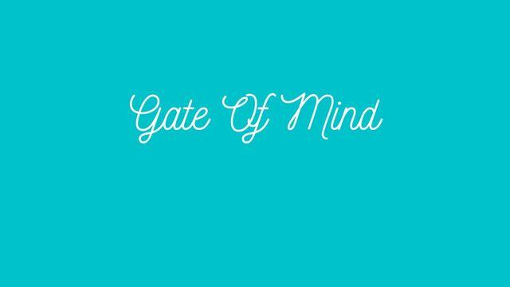{ width="200" }

    ### [Gate Of Mind](wiaposts/Gate-Of-Mind.md)
    
    **Read time:** 5 min
    
    Exploring the philosophical and spiritual gateways of the mind.

- { width="200" }

    ### [God Is My Savior](wiaposts/God-Is-My-Savior.md)
    
    **Read time:** 5 min
    
    Reflecting on the role of divine guidance and protection in life.
    

- 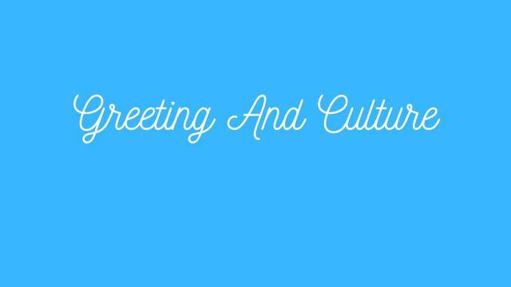{ width="200" }

    ### [Greeting and Culture](wiaposts/Greeting-And-Culture.md)
    
    **Read time:** 5 min
    
    EXCERPT Not Found

- { width="200" }

    ### [Greetings For New Year 2012](wiaposts/Greetings-For-New-Year-2012.md)
    
    **Read time:** 5 min
    
    A warm greeting for the New Year 2012, reflecting on past achievements and future aspirations.
    

- { width="200" }

    ### [Greetings For New Year 2013](wiaposts/Greetings-For-New-Year-2013.md)
    
    **Read time:** 5 min
    
    A joyful message welcoming the New Year 2013, filled with hope and new beginnings.

- { width="200" }

    ### [Greetings For New Year 2015](wiaposts/Greetings-For-New-Year-2015.md)
    
    **Read time:** 5 min
    
    Celebrating the arrival of 2015 with joy and optimism for the future.
    

- { width="200" }

    ### [Greetings For New Year 2016](wiaposts/Greetings-For-New-Year-2016.md)
    
    **Read time:** 5 min
    
    Welcoming the New Year 2016 with enthusiasm and hope for a prosperous future.

- { width="200" }

    ### [Greetings For New Year 2017](wiaposts/Greetings-For-New-Year-2017.md)
    
    **Read time:** 5 min
    
    Warm wishes and reflections for the New Year 2017.
    

- 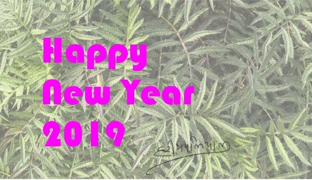{ width="200" }

    ### [Greetings For New Year 2019](wiaposts/Greetings-For-New-Year-2019.md)
    
    **Read time:** 5 min
    
    Extending warm wishes and reflections for the new year 2019.

- { width="200" }

    ### [Greetings For New Year 2020](wiaposts/Greetings-For-New-Year-2020.md)
    
    **Read time:** 5 min
    
    Reflection on the New Year 2020, celebrating new beginnings and insights.
    

- { width="200" }

    ### [Greetings For New Year 2021](wiaposts/Greetings-For-New-Year-2021.md)
    
    **Read time:** 5 min
    
    EXCERPT Not Found

- { width="200" }

    ### [Happy Guru Purnima 2024](wiaposts/GuruPurnima-2024.md)
    
    **Read time:** 5 min
    
    EXCERPT Not Found
    

- 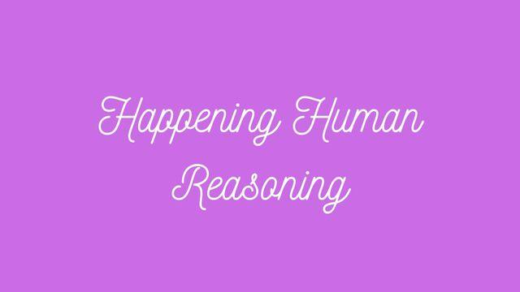{ width="200" }

    ### [Happening Human Reasoning](wiaposts/Happening-Human-Reasoning.md)
    
    **Read time:** 5 min
    
    Analyzing the dynamic nature of human reasoning and its philosophical implications.

- 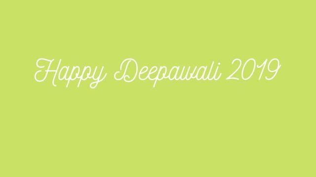{ width="200" }

    ### [Happy Deepawali 2019](wiaposts/Happy-Deepawali-2019.md)
    
    **Read time:** 5 min
    
    Extending warm wishes and reflections on the significance of Deepawali.
    

- { width="200" }

    ### [Happy Diwali 2020](wiaposts/Happy-Diwali-2020.md)
    
    **Read time:** 5 min
    
    EXCERPT Not Found

- { width="200" }

    ### [New Year Wishes for 2024](wiaposts/Happy-New-Year-2024.md)
    
    **Read time:** 5 min
    
    EXCERPT Not Found
    

- { width="200" }

    ### [विजयादशमी 2024 की हार्दिक शुभकामनाएँ](wiaposts/Happy-Vijaya-Dashmi-Hindi.md)
    
    **Read time:** 5 min
    
    EXCERPT Not Found

- { width="200" }

    ### [Happy Vijayadashami 2024](wiaposts/Happy-Vijaya-Dashmi.md)
    
    **Read time:** 5 min
    
    EXCERPT Not Found
    

- 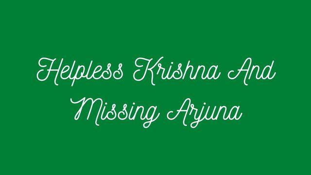{ width="200" }

    ### [Helpless Krishna and Missing Arjuna](wiaposts/Helpless-Krishna-And-Missing-Arjuna.md)
    
    **Read time:** 5 min
    
    EXCERPT Not Found

- 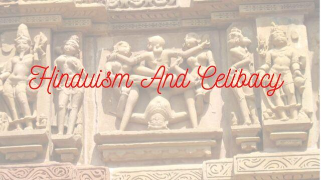{ width="200" }

    ### [Hinduism And Celibacy](wiaposts/Hinduism-And-Celibacy.md)
    
    **Read time:** 5 min
    
    An exploration of celibacy inHinduism, delving into insights on ethics and spirituality.
    

- { width="200" }

    ### [How Do You Want to Live?](wiaposts/How-Do-You-Want-to-Live.md)
    
    **Read time:** 5 min
    
    EXCERPT Not Found

- { width="200" }

    ### [How To Acquire New Skills](wiaposts/How-To-Acquire-New-Skills.md)
    
    **Read time:** 5 min
    
    Strategies and insights on acquiring new skills effectively.
    

- 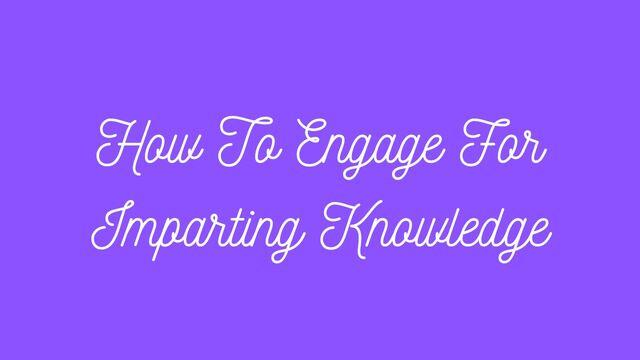{ width="200" }

    ### [How to Engage for Imparting Knowledge](wiaposts/How-To-Engage-For-Imparting-Knowledge.md)
    
    **Read time:** 5 min
    
    EXCERPT Not Found

- { width="200" }

    ### [How to Evaluate IQ](wiaposts/How-To-Evaluate-Iq.md)
    
    **Read time:** 5 min
    
    EXCERPT Not Found
    

- 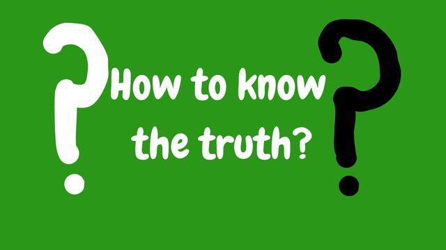{ width="200" }

    ### [How to know the truth?](wiaposts/How-to-know-the-truth.md)
    
    **Read time:** 5 min
    
    EXCERPT Not Found

- { width="200" }

    ### [Human And His Faith](wiaposts/Human-And-His-Faith.md)
    
    **Read time:** 5 min
    
    A poetic exploration of the relationship between humanity and faith.
    

- 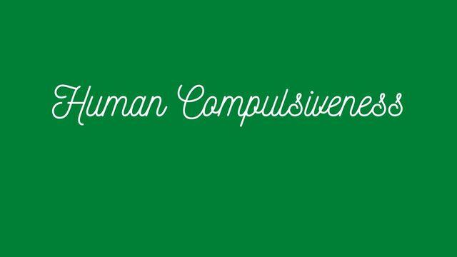{ width="200" }

    ### [Human Compulsiveness](wiaposts/Human-Compulsiveness.md)
    
    **Read time:** 5 min
    
    Exploration of human compulsiveness, delving into insights on mindfulness and choice.

- 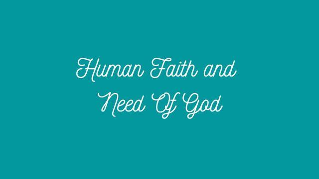{ width="200" }

    ### [Human Faith and Need Of God](wiaposts/Human-Faith-And-Need-Of-God.md)
    
    **Read time:** 5 min
    
    Exploration of human faith and the need for god, delving into insights on spirituality and divinity.
    

- { width="200" }

    ### [Human Is Rotating Or Travelling](wiaposts/Human-Is-Rotating-Or-Travelling.md)
    
    **Read time:** 5 min
    
    A philosophical inquiry into human existence and movement.

- { width="200" }

    ### [Human Peace](wiaposts/Human-Peace.md)
    
    **Read time:** 5 min
    
    EXCERPT Not Found
    

- { width="200" }

    ### [I don’t Know 2](wiaposts/I-Dont-Know-2.md)
    
    **Read time:** 5 min
    
    EXCERPT Not Found

- { width="200" }

    ### [I Don't Know](wiaposts/I-Dont-Know.md)
    
    **Read time:** 5 min
    
    Exploration of uncertainty and the unknown, delving into insights on exploration and not knowing.
    

- { width="200" }

    ### [I Hate Reading](wiaposts/I-Hate-Reading.md)
    
    **Read time:** 5 min
    
    A personal reflection on the challenges and experiences of not enjoying reading, exploring cultural and personal perspectives.

- { width="200" }

    ### [Ideals in Hinduism](wiaposts/Ideals-In-Hinduism.md)
    
    **Read time:** 5 min
    
    EXCERPT Not Found
    

- 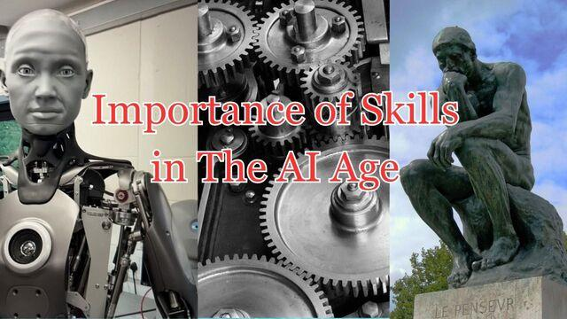{ width="200" }

    ### [Importance of Skills in The AI Age](wiaposts/Importance-of-Skills-in-the-AI-Age.md)
    
    **Read time:** 5 min
    
    EXCERPT Not Found

- { width="200" }

    ### [Indian Genes Inner Science](wiaposts/Indian-Genes-Inner-Science.md)
    
    **Read time:** 5 min
    
    Exploring the cultural and philosophical aspects of Indian genetic heritage.
    

- 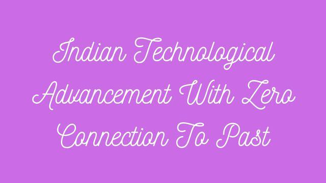{ width="200" }

    ### [Indian Technological Advancement with Zero connection to Past](wiaposts/Indian-Technological-Advancement-With-Zero-Connection-To-Past.md)
    
    **Read time:** 5 min
    
    EXCERPT Not Found

- 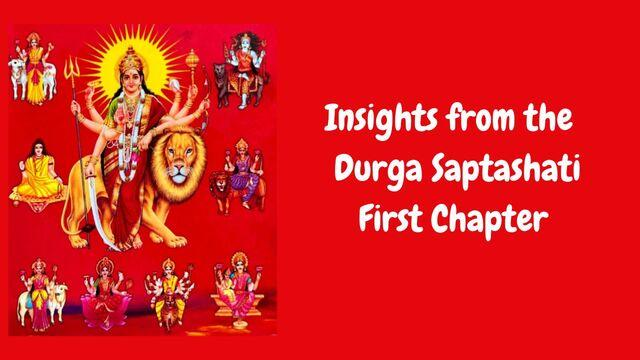{ width="200" }

    ### [Insights from the First Chapter of Durga Saptashati - Hindi](wiaposts/Insights-from-the-First-Chapter-of-Durga-Saptashati-Hindi.md)
    
    **Read time:** 14 min
    
    EXCERPT Not Found
    

- { width="200" }

    ### [Insights from the First Chapter of Durga Saptashati](wiaposts/Insights-from-the-First-Chapter-of-Durga-Saptashati.md)
    
    **Read time:** 7 min
    
    EXCERPT Not Found

- 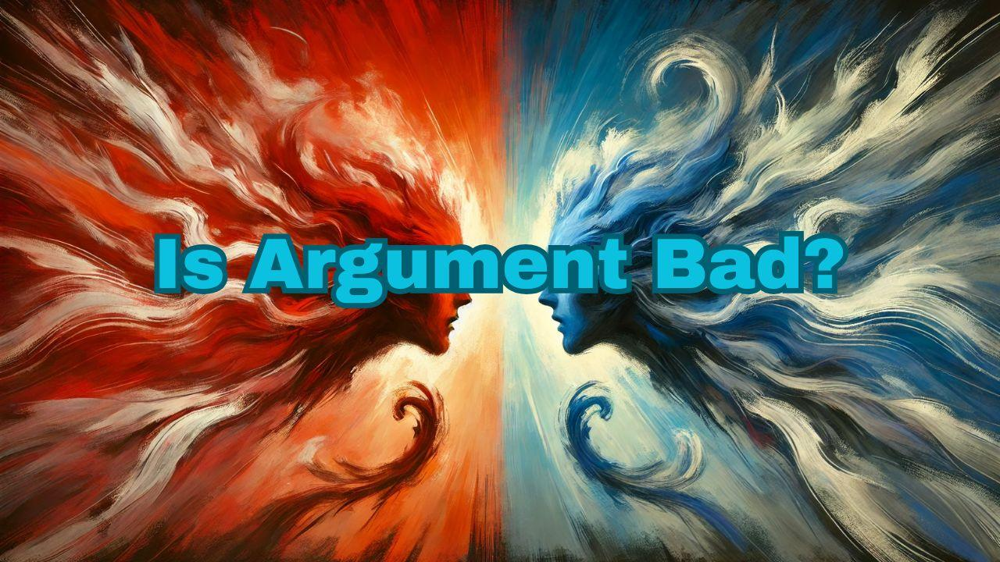{ width="200" }

    ### [Why Arguments Are Important for Personal Growth and Spirituality?](wiaposts/Is-Argument-Bad.md)
    
    **Read time:** 5 min
    
    Why arguments are important for personal growth and spirituality? In this article, I share my insights on how arguments can help you uncover the truth
    

- { width="200" }

    ### [Is Ego Bad?](wiaposts/Is-Ego-Bad.md)
    
    **Read time:** 5 min
    
    Ego is a concept often misunderstood. In this article, we will explore the concept of ego in the context of Vedanta and mindfulness. We will also expl

- { width="200" }

    ### [Is Hindi the Mother of All North Indian Languages?](wiaposts/Is-Hindi-Mother-of-North-Indian-Languages.md)
    
    **Read time:** 8 min
    
    Is Hindi the mother of all North Indian languages? To answer this question, we need to understand the history and evolution of Hindi language.
    

- 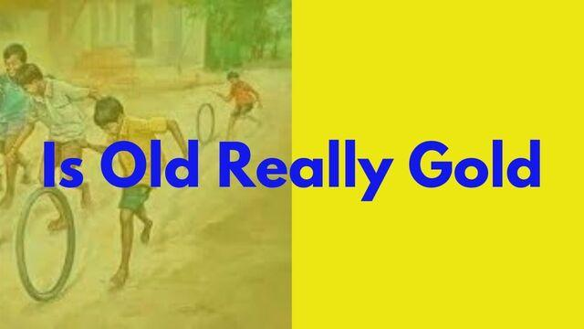{ width="200" }

    ### [Is old really Gold?](wiaposts/Is-Old-Really-Gold.md)
    
    **Read time:** 5 min
    
    EXCERPT Not Found

- 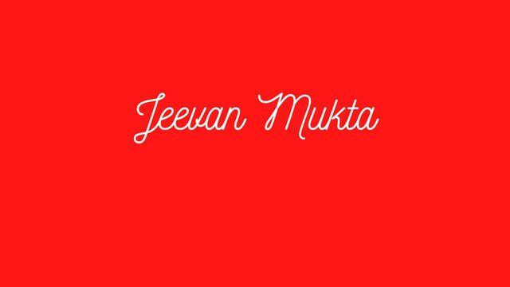{ width="200" }

    ### [Jeevan Mukta](wiaposts/Jeevan-Mukta.md)
    
    **Read time:** 5 min
    
    EXCERPT Not Found
    

- { width="200" }

    ### [Job Satisfaction](wiaposts/Job-Satisfaction.md)
    
    **Read time:** 5 min
    
    Exploring the factors that contribute to job satisfaction and personal fulfillment.

- 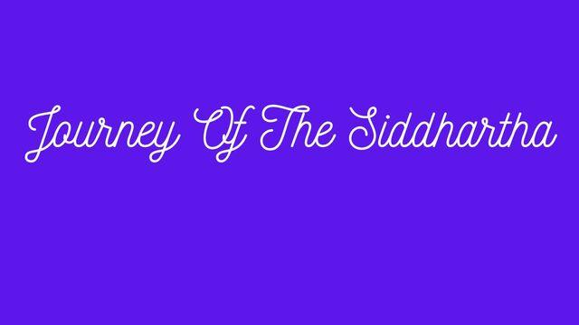{ width="200" }

    ### [Journey Of The Siddhartha](wiaposts/Journey-Of-The-Siddhartha.md)
    
    **Read time:** 5 min
    
    A reflective journey through the life and teachings of Siddhartha.
    

- { width="200" }

    ### [Knocking Your Own Door](wiaposts/Knocking-Your-Own-Door.md)
    
    **Read time:** 5 min
    
    Exploration of self-discovery, delving into insights on introspection and growth.

- { width="200" }

    ### [Labeling Good and Bad](wiaposts/Labeling-Good-And-Bad.md)
    
    **Read time:** 5 min
    
    EXCERPT Not Found
    

- 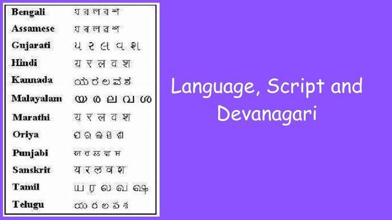{ width="200" }

    ### [Language, Script and Devanagari](wiaposts/Language-Script-and-Devanagari.md)
    
    **Read time:** 5 min
    
    EXCERPT Not Found

- { width="200" }

    ### [Layers of Identities and Bondage](wiaposts/Layers-of-Identities-and-Bondage.md)
    
    **Read time:** 5 min
    
    EXCERPT Not Found
    

- 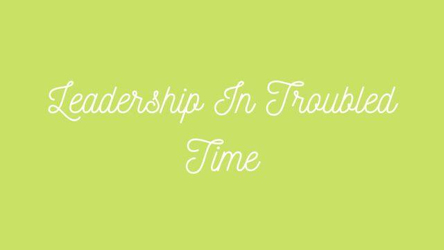{ width="200" }

    ### [Leadership In Troubled Time](wiaposts/Leadership-In-Troubled-Time.md)
    
    **Read time:** 5 min
    
    Insights on leading effectively during challenging times and crises.

- 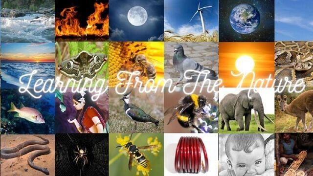{ width="200" }

    ### [Learning From The Nature](wiaposts/Learning-From-The-Nature.md)
    
    **Read time:** 7 min
    
    Insights and lessons drawn from observing nature.
    

- { width="200" }

    ### [Learning Process](wiaposts/Learning-Process.md)
    
    **Read time:** 5 min
    
    EXCERPT Not Found

- 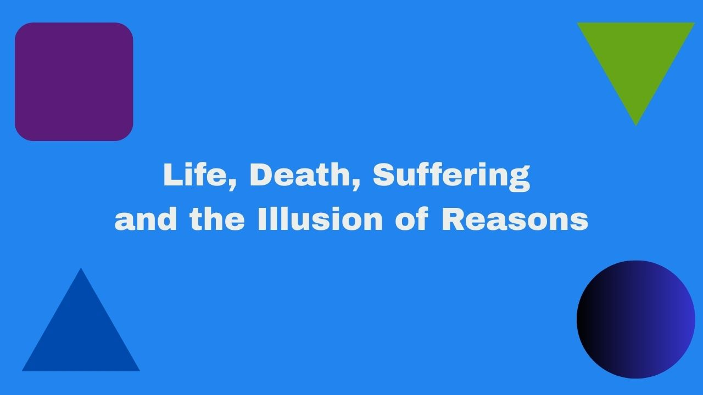{ width="200" }

    ### [Life, Death, and the Illusion of Reasons](wiaposts/Life-Death-and-Illusion-of-Reasons.md)
    
    **Read time:** 5 min
    
    Suffering and death exist without a cause, without a purpose. Culture and conditioning teach us to seek reasons for everything.
    

- 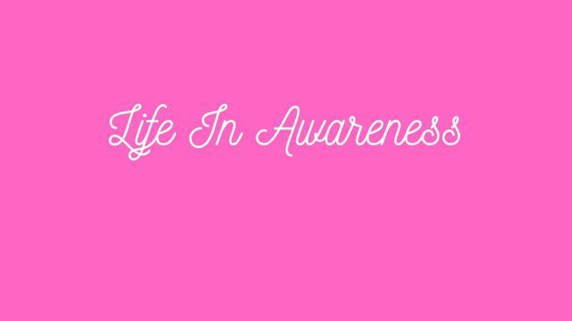{ width="200" }

    ### [Life In Awareness](wiaposts/Life-In-Awareness.md)
    
    **Read time:** 5 min
    
    Insights into living a life of awareness and mindfulness.

- { width="200" }

    ### [Life Process](wiaposts/Life-is-a-Process.md)
    
    **Read time:** 5 min
    
    EXCERPT Not Found
    

- { width="200" }

    ### [Light vs Darkness](wiaposts/Light-Vs-Darkness.md)
    
    **Read time:** 5 min
    
    EXCERPT Not Found

- 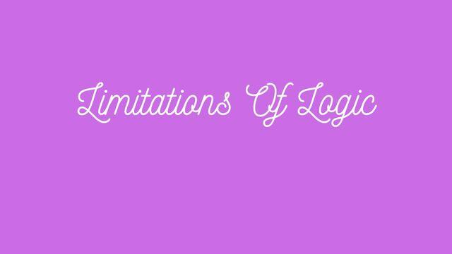{ width="200" }

    ### [Limitations Of Logic](wiaposts/Limitations-Of-Logic.md)
    
    **Read time:** 5 min
    
    EXCERPT Not Found
    

- 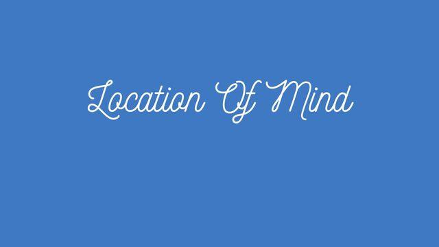{ width="200" }

    ### [Location Of Mind](wiaposts/Location-Of-Mind.md)
    
    **Read time:** 5 min
    
    Exploring the concept of mind and its perceived location.

- { width="200" }

    ### [Love As A Service](wiaposts/Love-As-A-Service.md)
    
    **Read time:** 5 min
    
    Exploration idea of love as a service, delving into insights on love, compassion, and service.
    

- { width="200" }

    ### [Managing Source Of Energy](wiaposts/Managing-Source-Of-Energy.md)
    
    **Read time:** 5 min
    
    Exploring methods to effectively manage energy sources through scientific and yogic practices.

- { width="200" }

    ### [Meaning of Beej Mantra from Durga Saptashati](wiaposts/Meaning-of-Beej-mantra-from-Durga-Saptashtati.md)
    
    **Read time:** 8 min
    
    EXCERPT Not Found
    

- 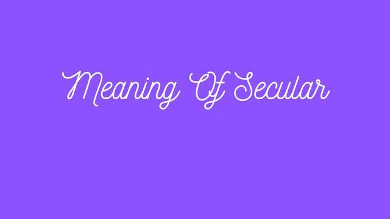{ width="200" }

    ### [Meaning Of Secular](wiaposts/Meaning-Of-Secular.md)
    
    **Read time:** 6 min
    
    Understanding the concept of secularism in the context of Indian culture.

- 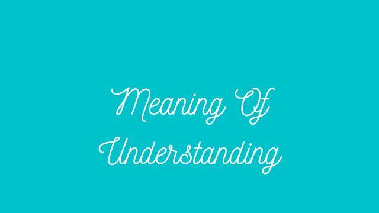{ width="200" }

    ### [Meaning Of Understanding](wiaposts/Meaning-Of-Understanding.md)
    
    **Read time:** 5 min
    
    Exploration of understanding, delving into insights on meaning and perception.
    

- 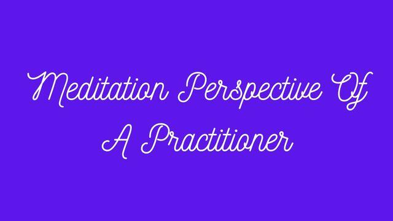{ width="200" }

    ### [Meditation Perspective Of A Practitioner](wiaposts/Meditation-Perspective-Of-A-Practitioner.md)
    
    **Read time:** 5 min
    
    Insights from a practitioner on the personal journey and benefits of meditation.

- { width="200" }

    ### [Mind and Manas](wiaposts/Mind-and-Manas.md)
    
    **Read time:** 5 min
    
    EXCERPT Not Found
    

- { width="200" }

    ### [Mind And Pleasure](wiaposts/Mind-And-Pleasure.md)
    
    **Read time:** 5 min
    
    Examining the intricate relationship between the mind and the pursuit of pleasure.

- { width="200" }

    ### [Mirror, Image and Face](wiaposts/Mirror-Image-And-Face.md)
    
    **Read time:** 5 min
    
    EXCERPT Not Found
    

- 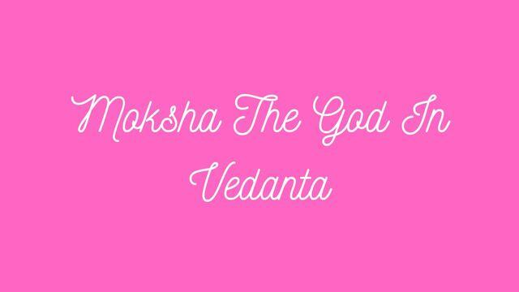{ width="200" }

    ### [Moksha The God In Vedanta](wiaposts/Moksha-The-God-In-Vedanta.md)
    
    **Read time:** 5 min
    
    Exploring the concept of Moksha and its significance in Vedantic philosophy.

- 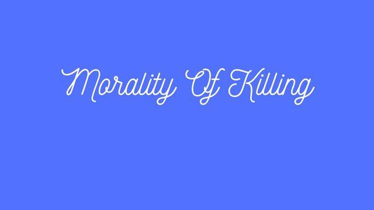{ width="200" }

    ### [Morality Of Killing](wiaposts/Morality-Of-Killing.md)
    
    **Read time:** 5 min
    
    A philosophical exploration of the moral and ethical implications of taking life, through poetry and cultural perspectives.
    

- 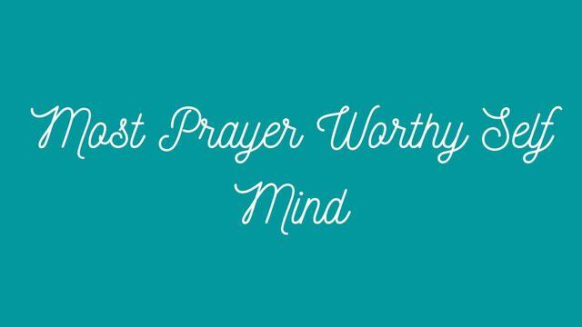{ width="200" }

    ### [Most Prayer Worthy Self Mind](wiaposts/Most-Prayer-Worthy-Self-Mind.md)
    
    **Read time:** 5 min
    
    Exploring the significance of prayer and self-awareness in personal growth.

- 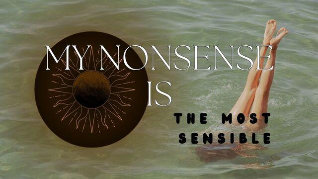{ width="200" }

    ### [My Nonsenses are Most Sensible - Poem](wiaposts/My Nonsenses are Most Sensible-Poem.md)
    
    **Read time:** 6 min
    
    EXCERPT Not Found
    

- { width="200" }

    ### [My Nonsenses are Most Sensible](wiaposts/My Nonsenses are Most Sensible.md)
    
    **Read time:** 5 min
    
    EXCERPT Not Found

- { width="200" }

    ### [My Creator](wiaposts/My-Creator.md)
    
    **Read time:** 5 min
    
    A reflective piece on the concept of creation and the creator within mindfulness and philosophy.
    

- { width="200" }

    ### [My Significance](wiaposts/My-Significance.md)
    
    **Read time:** 5 min
    
    A philosophical reflection on personal significance and existence.

- 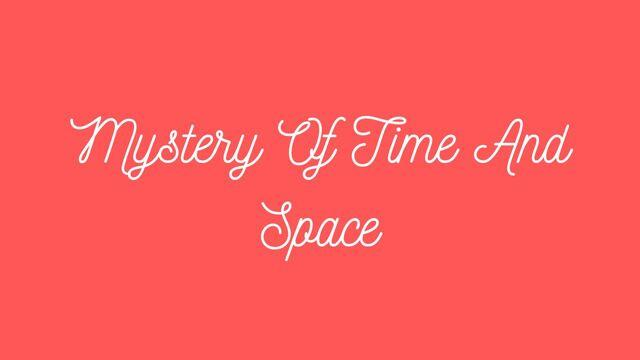{ width="200" }

    ### [Mystery Of Time And Space](wiaposts/Mystery-Of-Time-And-Space.md)
    
    **Read time:** 5 min
    
    A philosophical and poetic exploration of the mysteries of time and space, delving into conceptual insights and reflections.
    

- 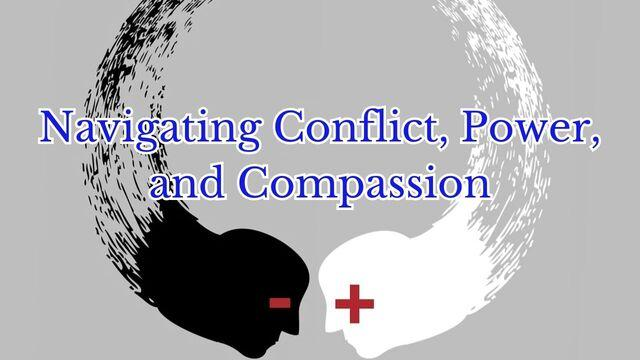{ width="200" }

    ### [Navigating Conflict, Power, and Compassion](wiaposts/Navigating-Conflict-Power-and-Compassion.md)
    
    **Read time:** 5 min
    
    EXCERPT Not Found

- 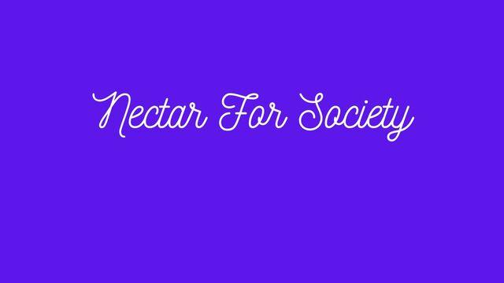{ width="200" }

    ### [Nectar For Society](wiaposts/Nectar-For-Society.md)
    
    **Read time:** 6 min
    
    Exploring the cultural and philosophical ideals that serve as a foundation for society.
    

- { width="200" }

    ### [No Universal Teachings](wiaposts/No-Universal-Teachings.md)
    
    **Read time:** 5 min
    
    A discussion on the limitations of universal teachings and their adaptability.

- 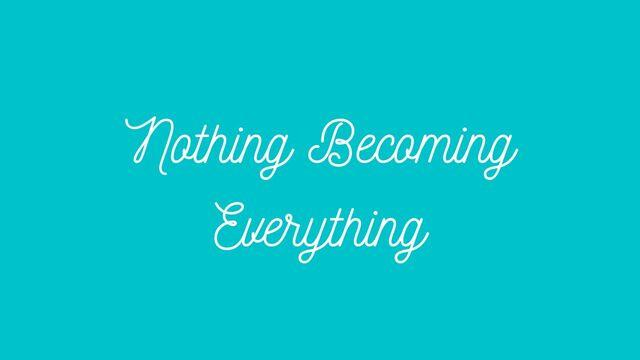{ width="200" }

    ### [Nothing Becoming Everything](wiaposts/Nothing-Becoming-Everything.md)
    
    **Read time:** 5 min
    
    A philosophical exploration of the transition from nothingness to everything in cultural contexts.
    

- 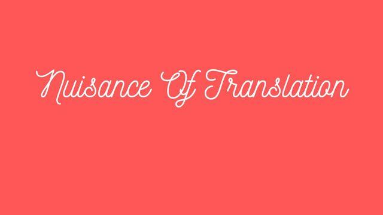{ width="200" }

    ### [Nuisance Of Translation](wiaposts/Nuisance-Of-Translation.md)
    
    **Read time:** 5 min
    
    An exploration of the challenges and nuisances in translating cultural concepts, inspired by Rajiv Malhotra's insights.

- 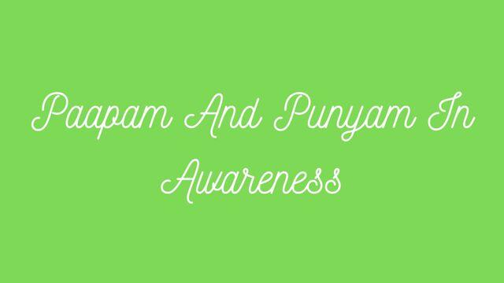{ width="200" }

    ### [Paapam and Punyam in Awareness](wiaposts/Paapam-And-Punyam-In-Awareness.md)
    
    **Read time:** 5 min
    
    EXCERPT Not Found
    

- { width="200" }

    ### [Pain and Suffering](wiaposts/Pain-and-Suffering.md)
    
    **Read time:** 5 min
    
    EXCERPT Not Found

- 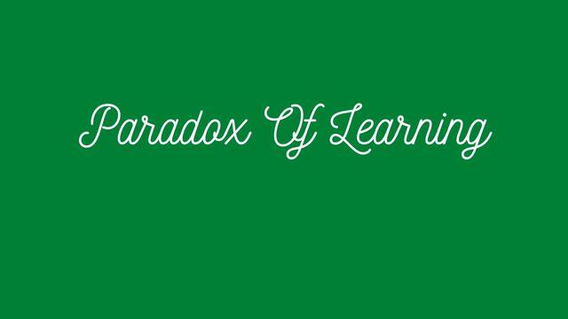{ width="200" }

    ### [Paradox Of Learning](wiaposts/Paradox-Of-Learning.md)
    
    **Read time:** 5 min
    
    Analyzing the complexities and contradictions within the learning process.
    

- { width="200" }

    ### [Play on your Strength](wiaposts/Play-On-Your-Strength.md)
    
    **Read time:** 5 min
    
    EXCERPT Not Found

- 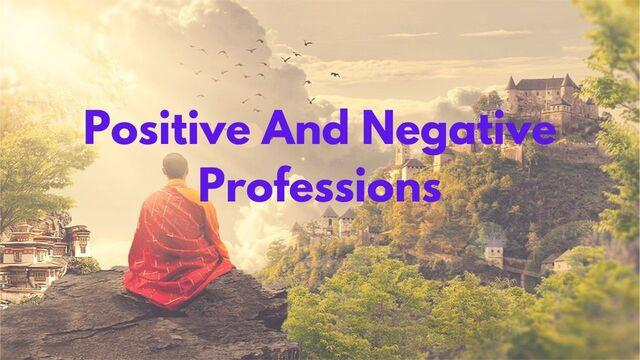{ width="200" }

    ### [Positive And Negative Professions](wiaposts/Positive-And-Negative-Professions.md)
    
    **Read time:** 5 min
    
    Reflecting on the impact of professions on personal and societal growth.
    

- 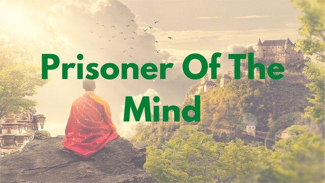{ width="200" }

    ### [Prisoner Of The Mind](wiaposts/Prisoner-Of-The-Mind.md)
    
    **Read time:** 5 min
    
    A poetic reflection on the constraints imposed by the mind and the journey to liberation.

- { width="200" }

    ### [Product Focus Vs Process Focus](wiaposts/Product-Focus-Vs-Process-Focus.md)
    
    **Read time:** 5 min
    
    Analyzing the differences between focusing on the product versus the process in various contexts.
    

- { width="200" }

    ### [Questioning & Answering (Problem Solving)](wiaposts/Question-Answering.md)
    
    **Read time:** 5 min
    
    EXCERPT Not Found

- 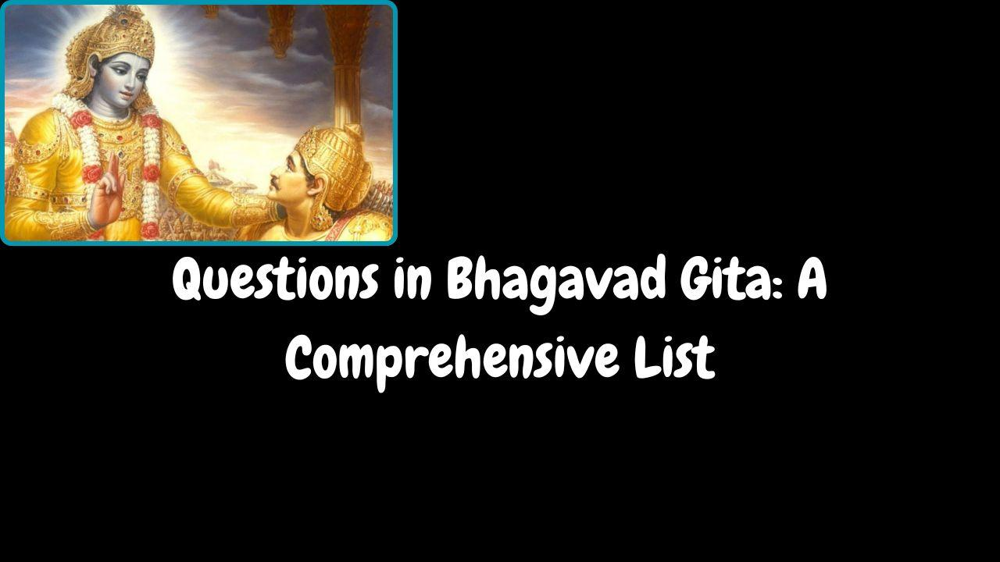{ width="200" }

    ### [Questions in Bhagavad Gita: A Comprehensive List](wiaposts/Question-in-Bhagwat-Gita.md)
    
    **Read time:** 13 min
    
    Explore the complete list of questions asked in the Bhagavad Gita, both by Arjuna and Krishna. Understand the context and significance of these spirit
    

- 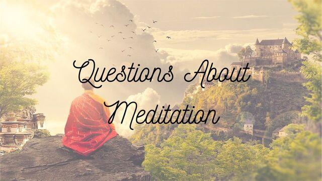{ width="200" }

    ### [Questions About Meditation](wiaposts/Questions-About-Meditation.md)
    
    **Read time:** 5 min
    
    A contemplative inquiry into the practice and philosophy of meditation.

- { width="200" }

    ### [Raw Material To Create Space And Time](wiaposts/Raw-Material-To-Create-Space-And-Time.md)
    
    **Read time:** 5 min
    
    Investigating the fundamental elements that constitute space and time.
    

- 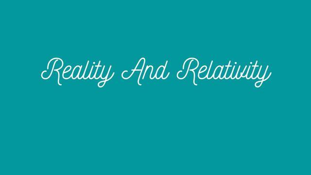{ width="200" }

    ### [Reality And Relativity](wiaposts/Reality-And-Relativity.md)
    
    **Read time:** 5 min
    
    Exploration of reality and relativity, delving into insights on perception and philosophical context.

- 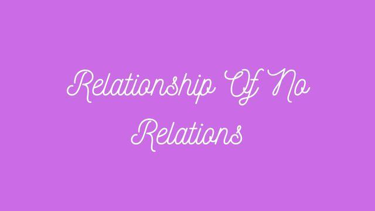{ width="200" }

    ### [Relationship Of No Relations](wiaposts/Relationship-Of-No-Relations.md)
    
    **Read time:** 5 min
    
    A philosophical exploration of relationships and human connections, delving into the concept of connections without traditional relations.
    

- 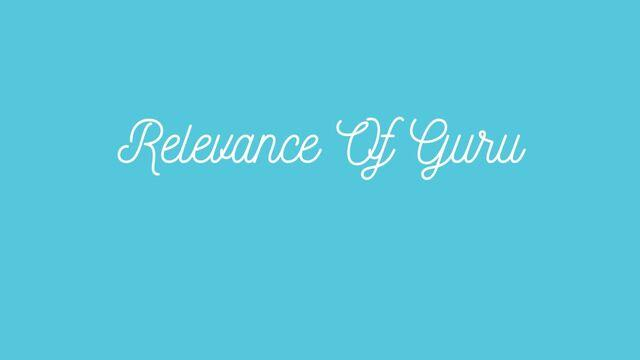{ width="200" }

    ### [Relevance Of Guru](wiaposts/Relevance-Of-Guru.md)
    
    **Read time:** 5 min
    
    Exploration of the relevance of guru, delving into insights on education and guidance.

- { width="200" }

    ### [Religion Of Humanity](wiaposts/Religion-Of-Humanity.md)
    
    **Read time:** 8 min
    
    Examining the concept of humanity as a universal religion.
    

- { width="200" }

    ### [Rider On Freedom](wiaposts/Rider-On-Freedom.md)
    
    **Read time:** 5 min
    
    Exploring the concept of freedom and its implications on education and society.

- 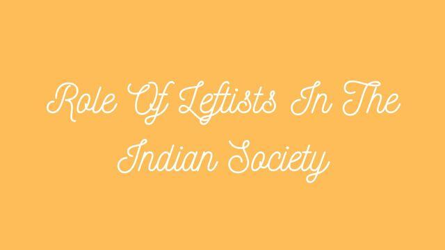{ width="200" }

    ### [Role Of Leftists In The Indian Society](wiaposts/Role-Of-Leftists-In-The-Indian-Society.md)
    
    **Read time:** 5 min
    
    An analysis of the influence and role of leftists in Indian society.
    

- { width="200" }

    ### [Saving The Moon](wiaposts/Saving-The-Moon.md)
    
    **Read time:** 5 min
    
    A philosophical and poetic exploration of saving the moon, delving into metaphors and insights on lunar themes.

- { width="200" }

    ### [Searching the Creator](wiaposts/Searching-The-Creator.md)
    
    **Read time:** 5 min
    
    EXCERPT Not Found
    

- 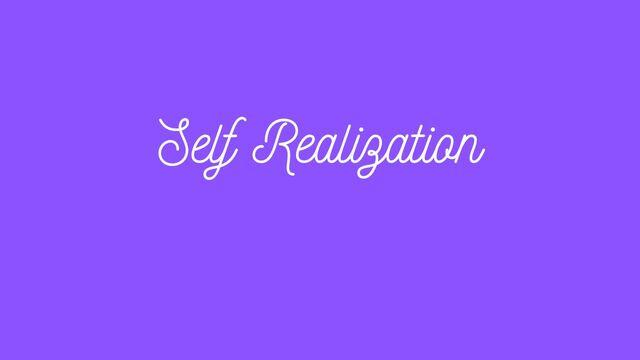{ width="200" }

    ### [Self Realization](wiaposts/Self-Realization.md)
    
    **Read time:** 5 min
    
    A poetic and philosophical journey into self-realization and moksha, exploring self-awareness and insights from Vedanta.

- 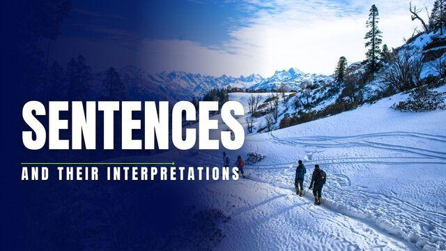{ width="200" }

    ### [Sentences and Their Interpretations](wiaposts/Sentences-and-their-interpretations.md)
    
    **Read time:** 5 min
    
    EXCERPT Not Found
    

- 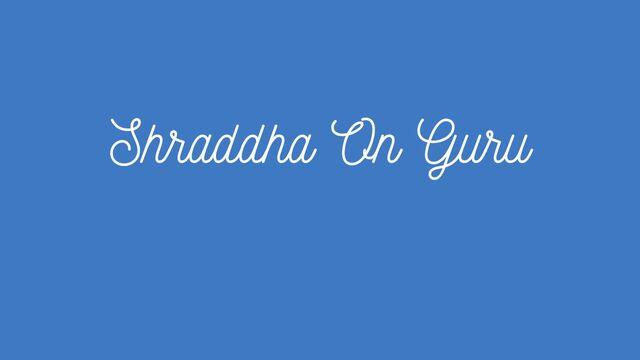{ width="200" }

    ### [Shraddha On Guru](wiaposts/Shraddha-On-Guru.md)
    
    **Read time:** 5 min
    
    A philosophical and poetic exploration of shraddha on guru, delving into insights on devotion and guidance.

- { width="200" }

    ### [Sign of Wisdom](wiaposts/Sign-of-Wisdom.md)
    
    **Read time:** 5 min
    
    EXCERPT Not Found
    

- 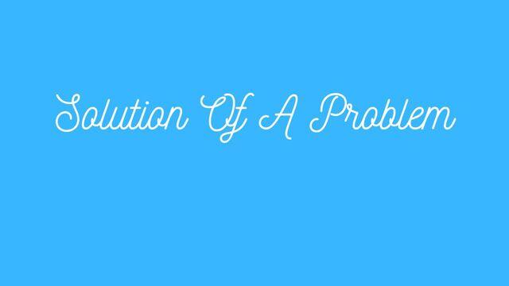{ width="200" }

    ### [Solution of a Problem](wiaposts/Solution-Of-A-Problem.md)
    
    **Read time:** 5 min
    
    EXCERPT Not Found

- 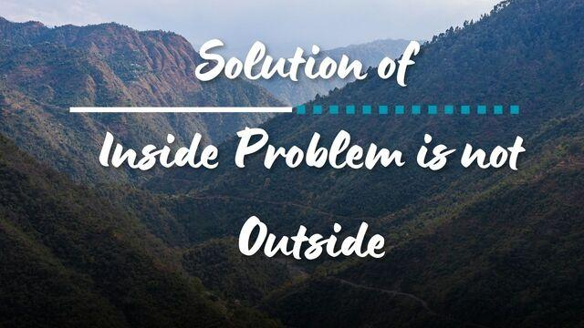{ width="200" }

    ### [Solution of Inside problem is not outside](wiaposts/Solution-of-Inside-problem-is-not-outside.md)
    
    **Read time:** 5 min
    
    EXCERPT Not Found
    

- { width="200" }

    ### [Source Of The Color](wiaposts/Source-Of-The-Color.md)
    
    **Read time:** 5 min
    
    Investigating the origins and significance of color in the natural world.

- { width="200" }

    ### [Sources Of Evidence](wiaposts/Sources-Of-Evidence.md)
    
    **Read time:** 7 min
    
    An analysis of different sources of evidence and their impact on understanding.
    

- 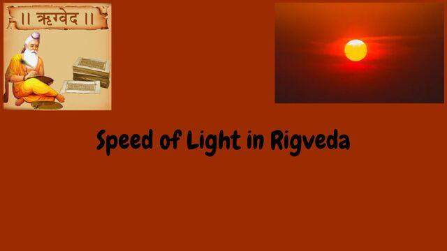{ width="200" }

    ### [Speed of Light in Rigveda](wiaposts/Speed-of-Light-in-Rigveda.md)
    
    **Read time:** 5 min
    
    An exploration of the speed of light as described in the Rigveda, comparing ancient insights with modern scientific understanding.

- { width="200" }

    ### [Suffering And Remedy](wiaposts/Suffering-And-Remedy.md)
    
    **Read time:** 5 min
    
    Exploring the philosophical perspectives on suffering and paths to remedy.
    

- 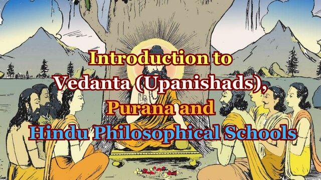{ width="200" }

    ### [Introduction to Upanishads](wiaposts/Summary-of-Upanishads.md)
    
    **Read time:** 26 min
    
    EXCERPT Not Found

- 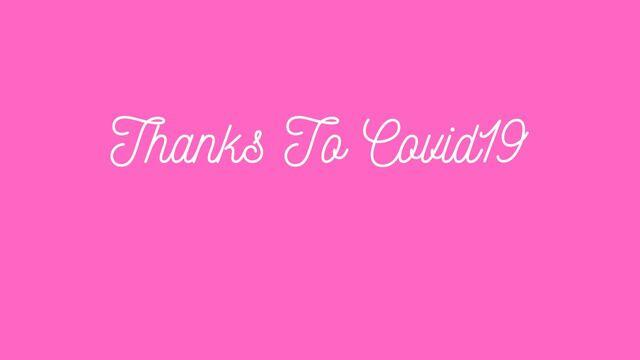{ width="200" }

    ### [Thanks To Covid19](wiaposts/Thanks-To-Covid19.md)
    
    **Read time:** 5 min
    
    Reflection on the impacts of COVID-19, exploring societal changes and human behavior.
    

- 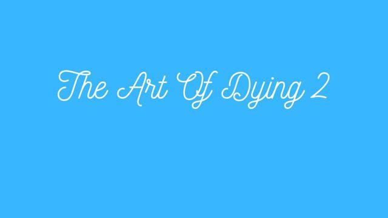{ width="200" }

    ### [The Art Of Dying 2](wiaposts/The-Art-Of-Dying-2.md)
    
    **Read time:** 5 min
    
    EXCERPT Not Found

- 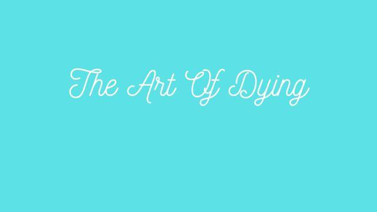{ width="200" }

    ### [The Art Of Dying](wiaposts/The-Art-Of-Dying.md)
    
    **Read time:** 5 min
    
    Exploring the philosophical and spiritual perspectives on death and dying.
    

- 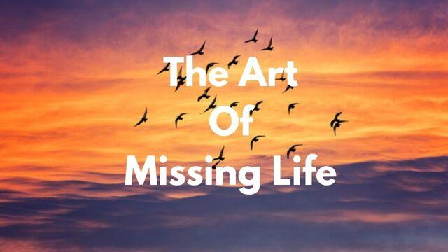{ width="200" }

    ### [The Art -Of Missing Life](wiaposts/The-Art-Of-Missing-Life.md)
    
    **Read time:** 5 min
    
    EXCERPT Not Found

- 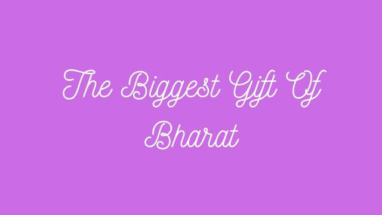{ width="200" }

    ### [The Biggest Gift of Bharat](wiaposts/The-Biggest-Gift-Of-Bharat.md)
    
    **Read time:** 5 min
    
    EXCERPT Not Found
    

- { width="200" }

    ### [The Biggest Mistake](wiaposts/The-Biggest-Mistake.md)
    
    **Read time:** 5 min
    
    EXCERPT Not Found

- 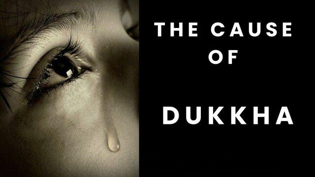{ width="200" }

    ### [The Cause of Dukkha](wiaposts/The-Cause-of-Dukkha.md)
    
    **Read time:** 5 min
    
    EXCERPT Not Found
    

- { width="200" }

    ### [The Concept Of Six Sins](wiaposts/The-Concept-Of-Six-Sins.md)
    
    **Read time:** 5 min
    
    An exploration of the six sins within Indian cultural and philosophical contexts.

- 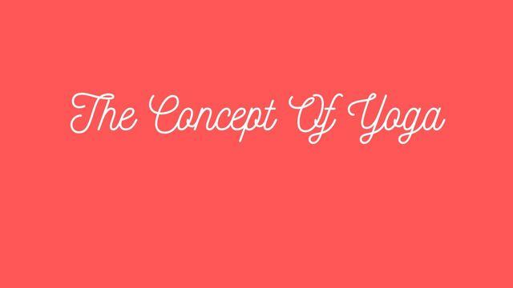{ width="200" }

    ### [The Concept Of Yoga](wiaposts/The-Concept-Of-Yoga.md)
    
    **Read time:** 5 min
    
    Understanding the essence of yoga and its role in Indian culture.
    

- { width="200" }

    ### [The Essence of Bhagwat Gita: 2nd Chapter](wiaposts/The-Essence-of-Bhagwat-Gita-2nd-Chapter.md)
    
    **Read time:** 23 min
    
    The 2nd chapter of the Bhagavad Gita, The Yoga of Analysis (Sankhya Yoga). It is one of the longest chapter with 72 sloka. Key takeaways from this cha

- 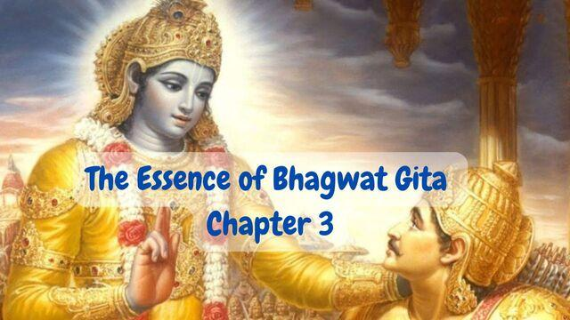{ width="200" }

    ### [The Essence of Bhagwat Gita: 3rd Chapter](wiaposts/The-Essence-of-Bhagwat-Gita-3rd-chapter.md)
    
    **Read time:** 10 min
    
    The third chapter of the Bhagavad Gita is a treasure trove of spiritual wisdom, providing powerful insights on the path of  action, the importance of 
    

- 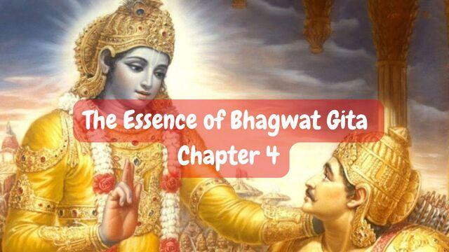{ width="200" }

    ### [The Essence of Bhagwat Gita: 4th Chapter](wiaposts/The-Essence-of-Bhagwat-Gita-4th-Chapter.md)
    
    **Read time:** 15 min
    
    The 4th chapter of the Bhagavad Gita, titled Jnyana (Knowledge) Yoga. It has 42 slokas. Key takeaways from this chapter are discussed in this article.

- 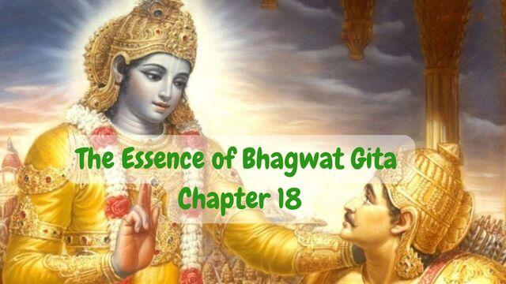{ width="200" }

    ### [The Essence of Bhagwat Gita: 18th Chapter](wiaposts/The-Essense-of-Bhagwat-Gita-18th-Chapter.md)
    
    **Read time:** 16 min
    
    The 18th chapter of the Bhagavad Gita, titled Moksha-Sannyasa Yoga (The Yoga of Liberation and Renunciation). It is one of the longest chapter with 78
    

- 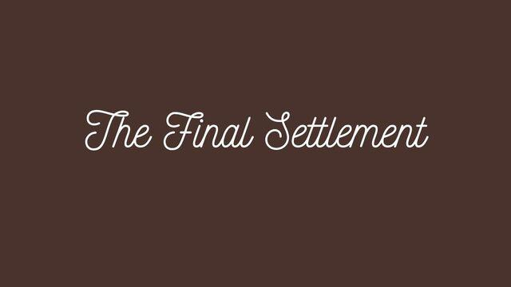{ width="200" }

    ### [The Final Settlement](wiaposts/The-Final-Settlement.md)
    
    **Read time:** 8 min
    
    A philosophical reflection on life’s ultimate questions and the idea of finality.

- 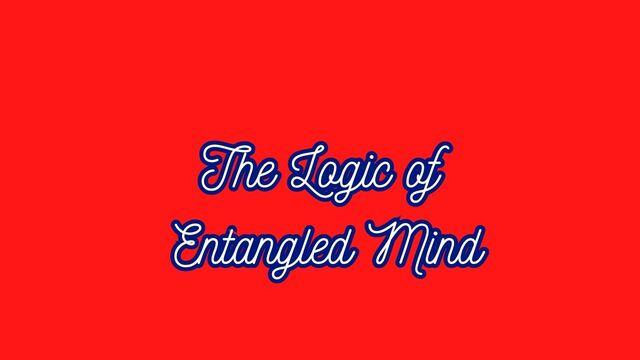{ width="200" }

    ### [The Logic of Entangled Mind](wiaposts/The-Logic-of-Entangled-Mind.md)
    
    **Read time:** 5 min
    
    EXCERPT Not Found
    

- 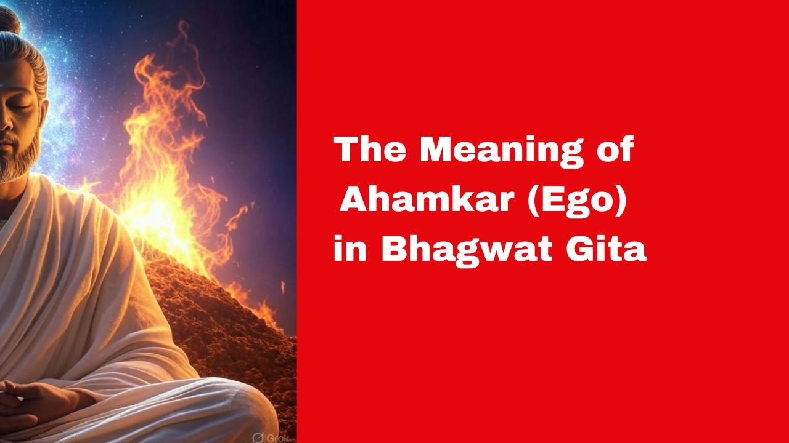{ width="200" }

    ### [The Meaning of Ahamkar in Bhagwat Gita](wiaposts/The-Meaning-of-Ahamkar-in-Bhagwat-Gita.md)
    
    **Read time:** 12 min
    
    In my view, the distinction between **Ahamkaara** and **Ego** is subtle yet profound, especially when viewed from a philosophical and spiritual lens. 

- 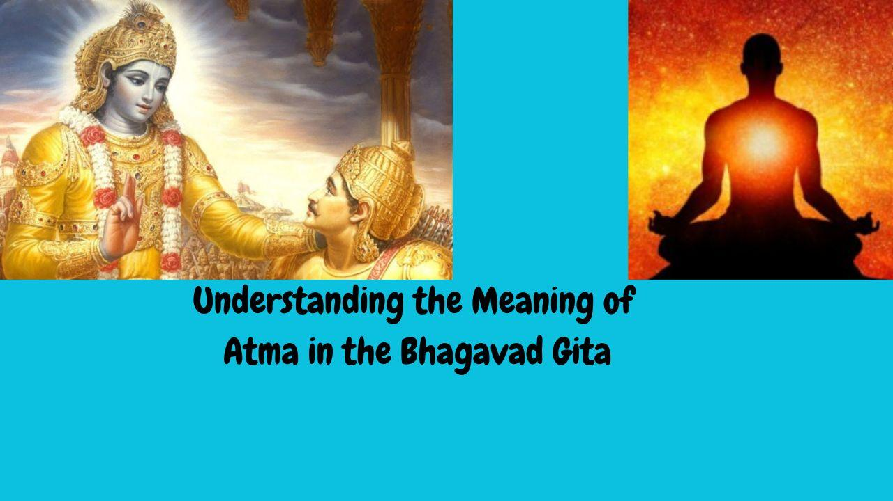{ width="200" }

    ### [Understanding the Meaning of Atma in the Bhagavad Gita](wiaposts/The-Meaning-of-Atma-in-Bhagwat-Gita.md)
    
    **Read time:** 12 min
    
    Explore the diverse meanings of 'Atma' as used in the Bhagavad Gita, from the physical body to the eternal soul. Understand the context and interpreta
    

- 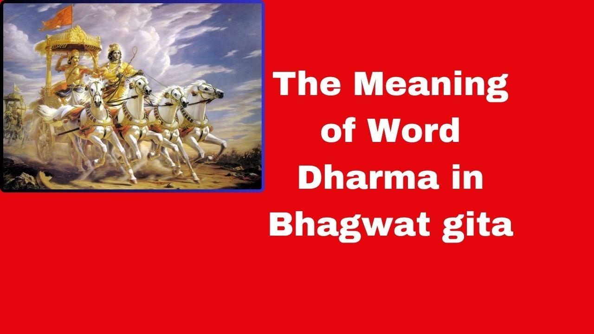{ width="200" }

    ### [The Meaning of Word Dharma in Bhagwat Gita](wiaposts/The-Meaning-of-Dharma-in-Bhagwat-Gita.md)
    
    **Read time:** 12 min
    
    The Bhagavad Gita is a treasure trove of wisdom, and at its heart lies the word 'Dharma' (धर्म)—a concept that’s anything but simple. Various gurus an

- { width="200" }

    ### [The Meaning of Understanding](wiaposts/The-Meaning-of-I-Understand.md)
    
    **Read time:** 5 min
    
    EXCERPT Not Found
    

- 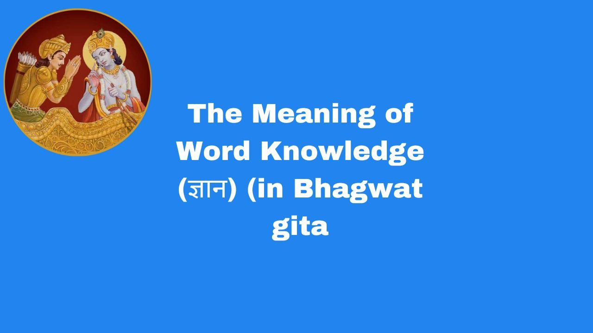{ width="200" }

    ### [The Meaning of Word Knowledge or Gyan or Jnyana in Bhagwat Gita](wiaposts/The-Meaning-of-Knowledge-in-Bhagwat-Gita.md)
    
    **Read time:** 22 min
    
    In the Sanskrit language, there is a word 'ज्ञान' (romanized as Gyan or Jnyana), which translates to 'Knowledge' in English. However, in a worldly sen

- 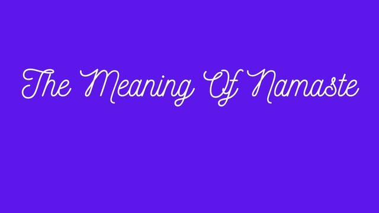{ width="200" }

    ### [The Meaning Of Namaste](wiaposts/The-Meaning-Of-Namaste.md)
    
    **Read time:** 5 min
    
    EXCERPT Not Found
    

- 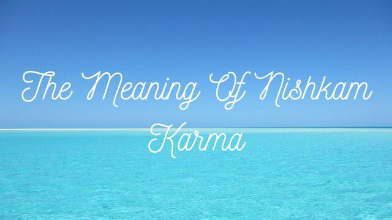{ width="200" }

    ### [The Meaning of Nishkam Karma](wiaposts/The-Meaning-Of-Nishkam-Karma.md)
    
    **Read time:** 5 min
    
    EXCERPT Not Found

- 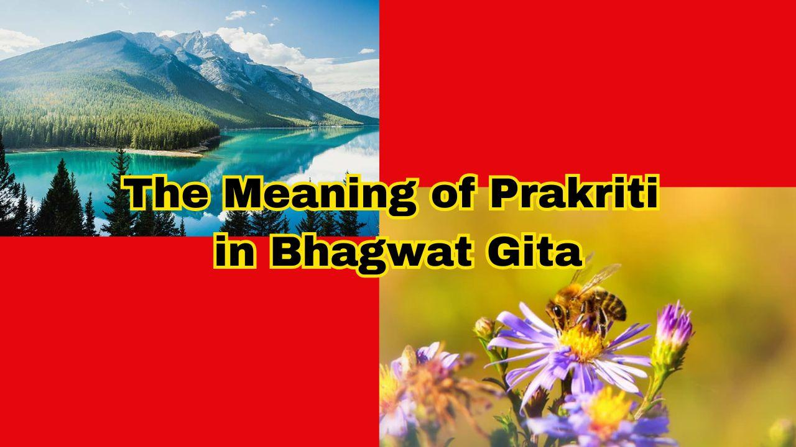{ width="200" }

    ### [The Meaning of Prakriti in Bhagwat Gita](wiaposts/The-Meaning-of-Prakrit-in-Bhagwat-Gita.md)
    
    **Read time:** 17 min
    
    The Sanskrit word Prakriti or Prakruti has multiple meanings and is used in the Bhagavad Gita in different contexts. In the English language, we try t
    

- 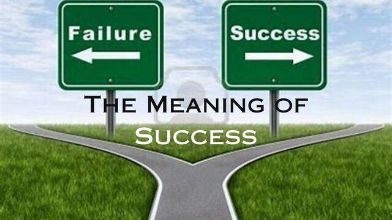{ width="200" }

    ### [The Meaning of Success](wiaposts/The-Meaning-of-Success.md)
    
    **Read time:** 16 min
    
    EXCERPT Not Found

- 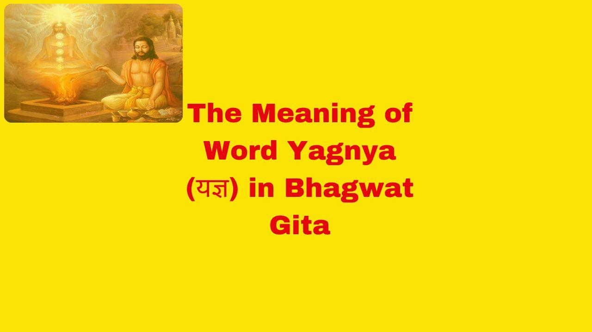{ width="200" }

    ### [The Meaning of Yagnya in Bhagwat gita](wiaposts/The-Meaning-of-Yangya-in-Bhagwat-Gita.md)
    
    **Read time:** 8 min
    
    In the Sanskrit language, there is a word 'यज्ञ' (romanized as Yagnya or Yajnya), which closely translates to 'sacrifice' in English. However, in a We
    

- 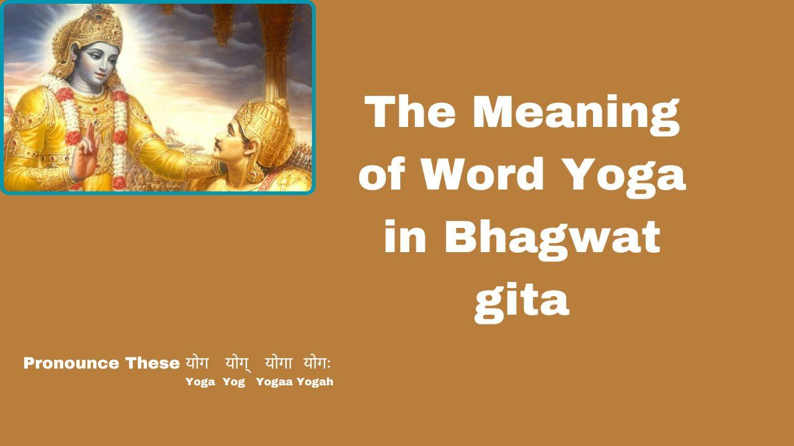{ width="200" }

    ### [The Meaning of Word Yoga in Bhagwat Gita](wiaposts/The-Meaning-of-Yoga-in-Bhgwat-Gita.md)
    
    **Read time:** 26 min
    
    The Bhagavad Gita is a treasure trove of wisdom, and at its heart lies the word 'Yoga' (योग)—a concept that’s anything but simple. Various gurus and c

- { width="200" }

    ### [The Middle Path](wiaposts/The-Middle-Path.md)
    
    **Read time:** 5 min
    
    EXCERPT Not Found
    

- 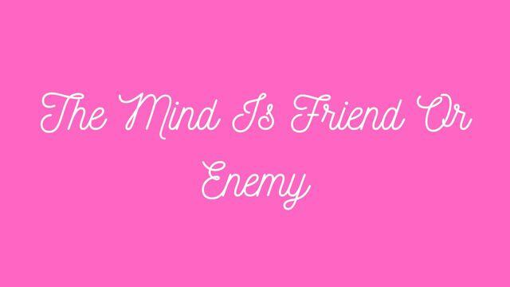{ width="200" }

    ### [The Mind Is Friend Or Enemy](wiaposts/The-Mind-Is-Friend-Or-Enemy.md)
    
    **Read time:** 5 min
    
    A philosophical examination of the dual nature of the mind as both an ally and adversary.

- 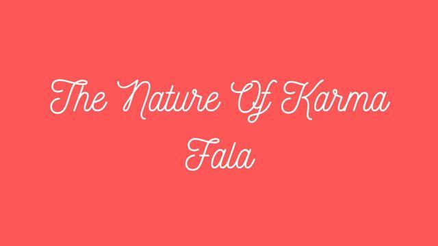{ width="200" }

    ### [The Nature Of Karma Fala](wiaposts/The-Nature-Of-Karma-Fala.md)
    
    **Read time:** 5 min
    
    An exploration of the nature of karma fala, delving into insights on karma and its outcomes.
    

- 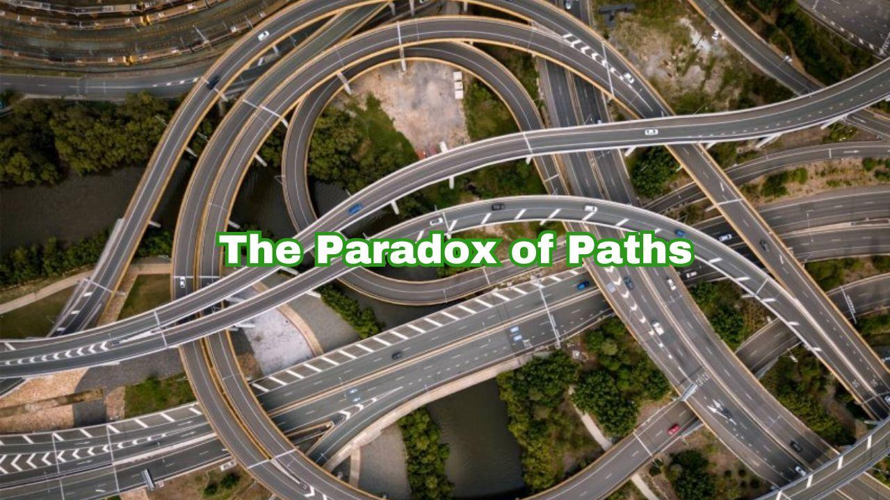{ width="200" }

    ### [The Paradox of Paths - A Hindu Perspective](wiaposts/The-Paradox-of-Paths.md)
    
    **Read time:** 5 min
    
    Sometimes, knowing too much holds us back, while not knowing enough pushes us forward. In this article, we explore the paradox of paths in the context

- { width="200" }

    ### [The Play Is Over](wiaposts/The-Play-Is-Over.md)
    
    **Read time:** 5 min
    
    A philosophical reflection on life's journey and transitions, exploring mindfulness and acceptance as the play of life comes to an end.
    

- { width="200" }

    ### [The Power For Prayer](wiaposts/The-Power-For-Prayer.md)
    
    **Read time:** 5 min
    
    Reflecting on the spiritual and emotional strength derived from prayer.

- { width="200" }

    ### [The Power Within](wiaposts/The-Power-Within.md)
    
    **Read time:** 5 min
    
    EXCERPT Not Found
    

- 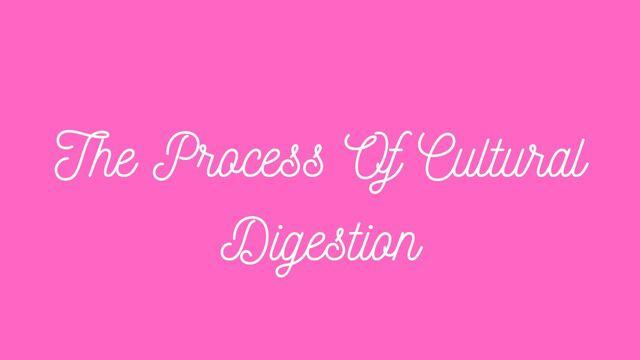{ width="200" }

    ### [The Process Of Cultural Digestion](wiaposts/The-Process-Of-Cultural-Digestion.md)
    
    **Read time:** 5 min
    
    Understanding how cultures assimilate and transform through education and interaction.

- 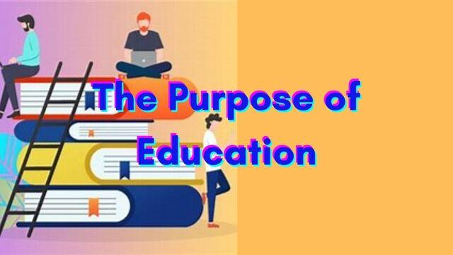{ width="200" }

    ### [The Purpose of Education](wiaposts/The-Purpose-of-Education.md)
    
    **Read time:** 5 min
    
    EXCERPT Not Found
    

- 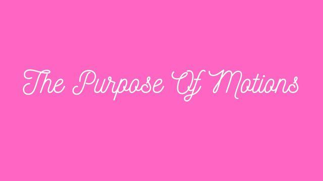{ width="200" }

    ### [The Purpose Of Motions](wiaposts/The-Purpose-Of-Motions.md)
    
    **Read time:** 5 min
    
    Exploring the philosophical significance of motion in life and nature.

- 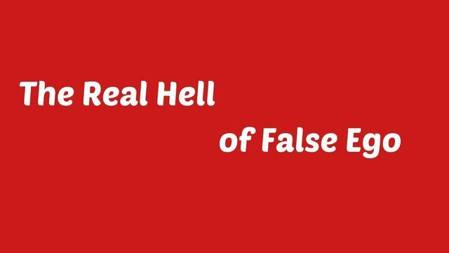{ width="200" }

    ### [The Real Hell of False Ego](wiaposts/The-Real-Hell-of-False-Ego.md)
    
    **Read time:** 5 min
    
    EXCERPT Not Found
    

- 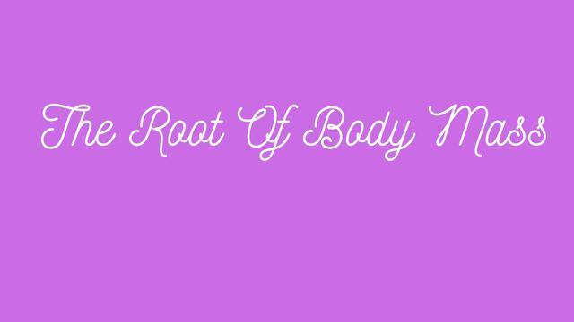{ width="200" }

    ### [The Root Of Body Mass](wiaposts/The-Root-Of-Body-Mass.md)
    
    **Read time:** 5 min
    
    Investigating the fundamental principles behind body mass and its formation.

- 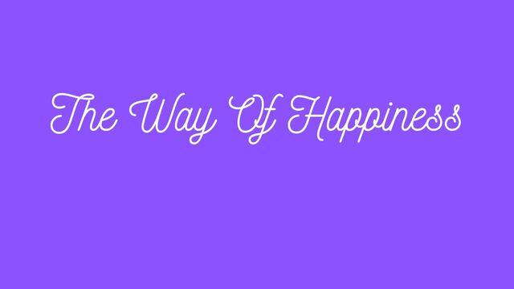{ width="200" }

    ### [The Way Of Happiness](wiaposts/The-Way-Of-Happiness.md)
    
    **Read time:** 5 min
    
    Exploration of the way of happiness, delving into insights from Vedanta and philosophical contexts.
    

- { width="200" }

    ### [The Way of Learning](wiaposts/The-Way-of-Learning.md)
    
    **Read time:** 5 min
    
    EXCERPT Not Found

- 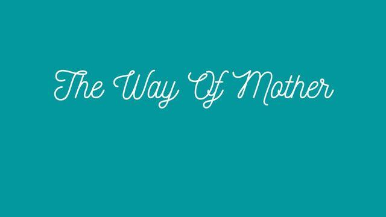{ width="200" }

    ### [The Way Of Mother](wiaposts/The-Way-Of-Mother.md)
    
    **Read time:** 6 min
    
    A heartfelt story exploring the nurturing and guiding role of a mother.
    

- { width="200" }

    ### [The Way To Learn](wiaposts/The-Way-To-Learn.md)
    
    **Read time:** 5 min
    
    Insights into effective learning methods and the philosophy of education.

- { width="200" }

    ### [The Ways to Hurt the Self](wiaposts/The-Ways-to-Hurt-the-Self.md)
    
    **Read time:** 5 min
    
    EXCERPT Not Found
    

- { width="200" }

    ### [There is no God!](wiaposts/There-Is-No-God.md)
    
    **Read time:** 5 min
    
    EXCERPT Not Found

- { width="200" }

    ### [Thinking and Feeling](wiaposts/Thinking-And-Feeling.md)
    
    **Read time:** 5 min
    
    EXCERPT Not Found
    

- 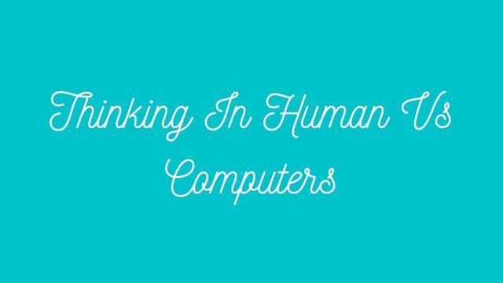{ width="200" }

    ### [Thinking In Human Vs Computers](wiaposts/Thinking-In-Human-Vs-Computers.md)
    
    **Read time:** 5 min
    
    Reflection on the cognitive differences between humans and computers, exploring cognition and technology.

- { width="200" }

    ### [Thirukkural In Hindi](wiaposts/Thirukkural-In-Hindi.md)
    
    **Read time:** 5 min
    
    An exploration of Thirukkural translated into Hindi, highlighting its cultural and philosophical significance.
    

- 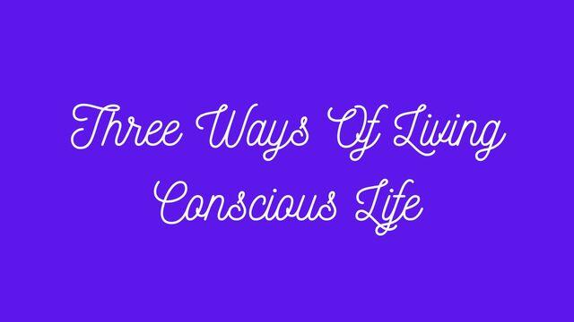{ width="200" }

    ### [Three ways of living conscious life](wiaposts/Three-Ways-Of-Living-Conscious-Life.md)
    
    **Read time:** 5 min
    
    EXCERPT Not Found

- { width="200" }

    ### [Time and Present](wiaposts/Time-And-Present.md)
    
    **Read time:** 5 min
    
    EXCERPT Not Found
    

- { width="200" }

    ### [Training of the mind](wiaposts/Training-Of-The-Mind.md)
    
    **Read time:** 5 min
    
    EXCERPT Not Found

- 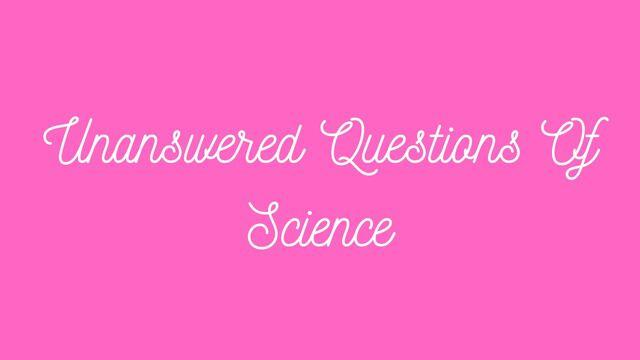{ width="200" }

    ### [Unanswered Questions Of Science](wiaposts/Unanswered-Questions-Of-Science.md)
    
    **Read time:** 5 min
    
    A philosophical and poetic exploration of unanswered questions in science, delving into insights on curiosity and exploration.
    

- 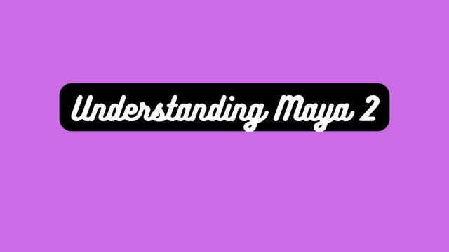{ width="200" }

    ### [Understanding Maya 2](wiaposts/Understanding-Maya-2.md)
    
    **Read time:** 5 min
    
    EXCERPT Not Found

- 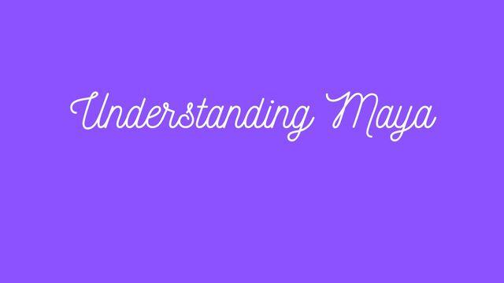{ width="200" }

    ### [Understanding Maya](wiaposts/Understanding-Maya.md)
    
    **Read time:** 5 min
    
    Delving into the concept of Maya and its implications in Vedantic philosophy.
    

- 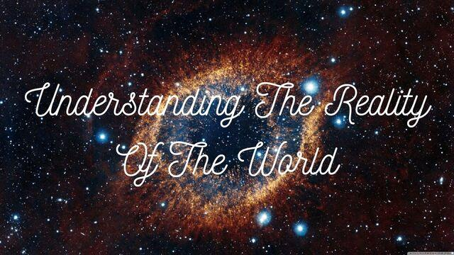{ width="200" }

    ### [Understanding The Reality Of The World](wiaposts/Understanding-The-Reality-Of-The-World.md)
    
    **Read time:** 5 min
    
    Exploring the philosophical concepts of reality as depicted in the Bhagwat Gita.

- { width="200" }

    ### [Undying Love](wiaposts/Undying-Love.md)
    
    **Read time:** 5 min
    
    EXCERPT Not Found
    

- 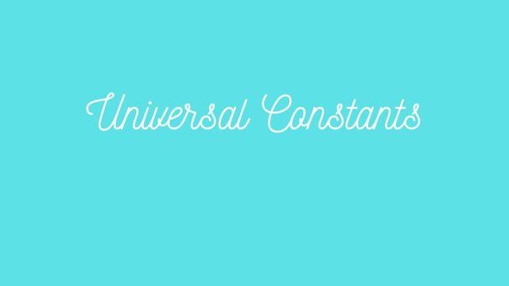{ width="200" }

    ### [Universal Constants](wiaposts/Universal-Constants.md)
    
    **Read time:** 5 min
    
    A exploration of universal constants, delving into insights on nature and science.

- { width="200" }

    ### [Universal Culture](wiaposts/Universal-Culture.md)
    
    **Read time:** 6 min
    
    A philosophical and poetic exploration of universal culture, delving into insights on cultural integration and identity.
    

- 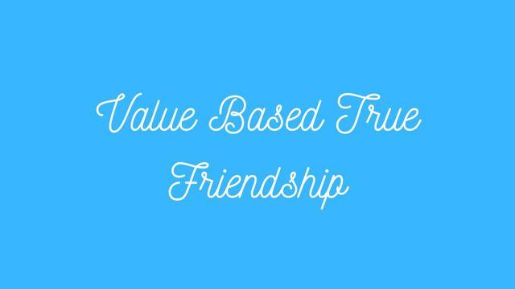{ width="200" }

    ### [Value Based True Friendship](wiaposts/Value-Based-True-Friendship.md)
    
    **Read time:** 5 min
    
    A philosophical and poetic exploration of true friendship, delving into insights on value-based relationships and loyalty.

- 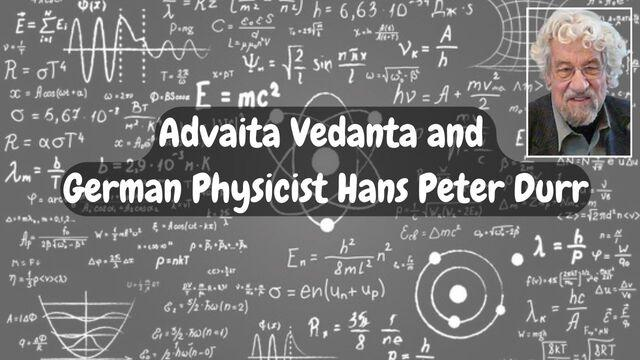{ width="200" }

    ### [Advaita Vedanta and Hans Peter Durr](wiaposts/Vedanta-and-Hans-Peter-Durr.md)
    
    **Read time:** 5 min
    
    EXCERPT Not Found
    

- 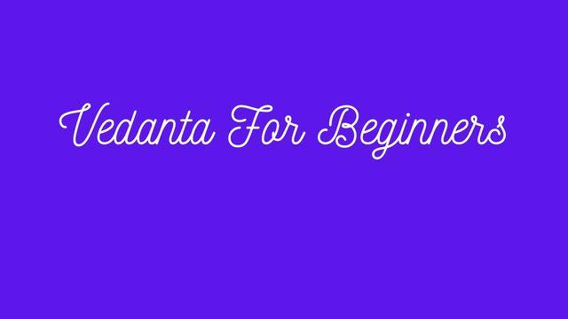{ width="200" }

    ### [Vedanta For Beginners](wiaposts/Vedanta-For-Beginners.md)
    
    **Read time:** 6 min
    
    EXCERPT Not Found

- 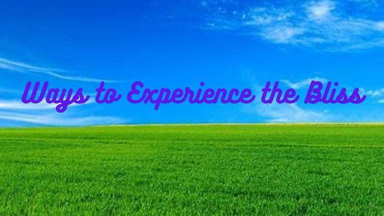{ width="200" }

    ### [Ways to Experience the Bliss](wiaposts/Ways-to-Experience-the-Bliss.md)
    
    **Read time:** 5 min
    
    EXCERPT Not Found
    

- 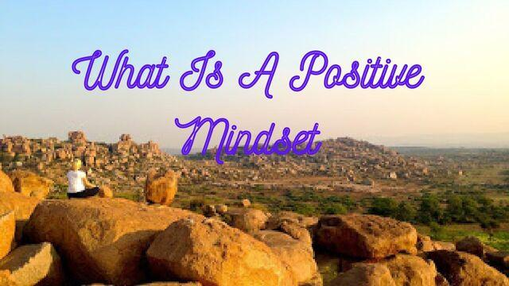{ width="200" }

    ### [What Is A Positive Mindset](wiaposts/What-Is-A-Positive-Mindset.md)
    
    **Read time:** 7 min
    
    Understanding the elements of a positive mindset through philosophical and poetic lenses.

- { width="200" }

    ### [What Is Balance Food Diet?](wiaposts/What-Is-Balance-Food-Diet.md)
    
    **Read time:** 5 min
    
    Exploration of balanced diet, delving into insights on nutrition and well-being.
    

- 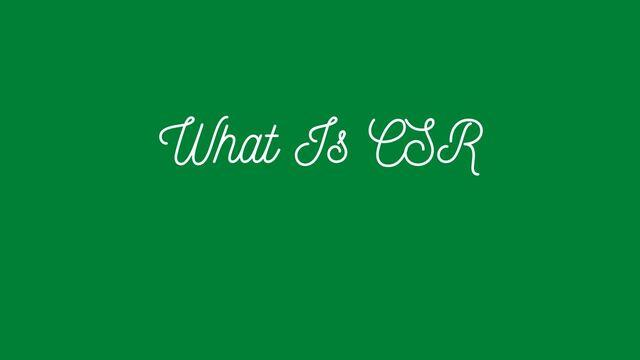{ width="200" }

    ### [What Is CSR](wiaposts/What-Is-Csr.md)
    
    **Read time:** 6 min
    
    This article explores the concept of Corporate Social Responsibility (CSR) and its significance in modern business practices, drawing insights from an

- 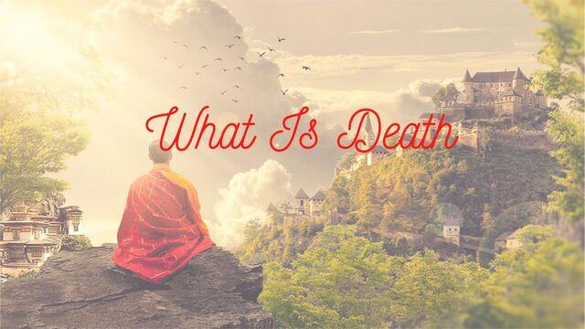{ width="200" }

    ### [What Is Death?](wiaposts/What-Is-Death.md)
    
    **Read time:** 5 min
    
    EXCERPT Not Found
    

- { width="200" }

    ### [What Is Love?](wiaposts/What-Is-Love.md)
    
    **Read time:** 5 min
    
    A philosophical and poetic exploration of love, delving into insights on relationships and joy.

- 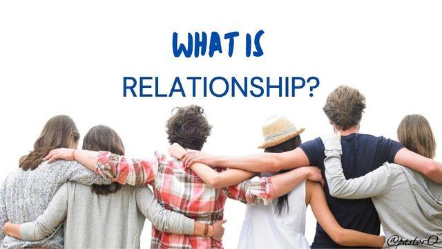{ width="200" }

    ### [What is Relationship - Poem](wiaposts/What-is-Relationship-Poem.md)
    
    **Read time:** 5 min
    
    EXCERPT Not Found
    

- { width="200" }

    ### [What is Relationship?](wiaposts/What-is-Relationship.md)
    
    **Read time:** 5 min
    
    EXCERPT Not Found

- 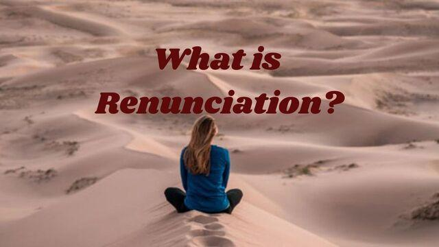{ width="200" }

    ### [What is Renunciation?](wiaposts/What-is-renunciation.md)
    
    **Read time:** 5 min
    
    EXCERPT Not Found
    

- 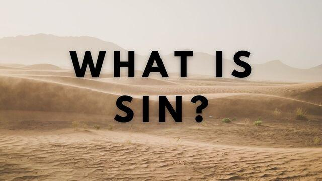{ width="200" }

    ### [What is Sin?](wiaposts/What-is-Sin.md)
    
    **Read time:** 5 min
    
    EXCERPT Not Found

- { width="200" }

    ### [What Is Success?](wiaposts/What-Is-Success.md)
    
    **Read time:** 5 min
    
    EXCERPT Not Found
    

- 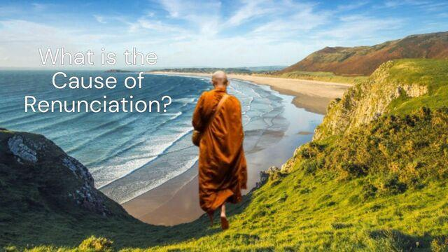{ width="200" }

    ### [What is the Cause of Renunciation?](wiaposts/What-is-the-cause-of-renunciation.md)
    
    **Read time:** 5 min
    
    EXCERPT Not Found

- 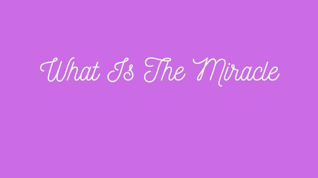{ width="200" }

    ### [What is the Miracle?](wiaposts/What-Is-The-Miracle.md)
    
    **Read time:** 5 min
    
    EXCERPT Not Found
    

- 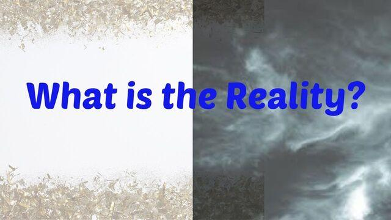{ width="200" }

    ### [What is the Reality?](wiaposts/What-is-the-reality.md)
    
    **Read time:** 5 min
    
    EXCERPT Not Found

- 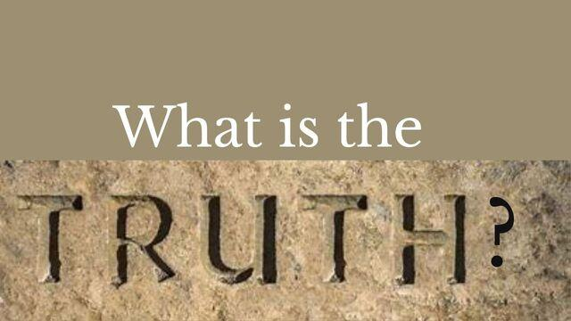{ width="200" }

    ### [What is the Truth](wiaposts/What-is-the-truth.md)
    
    **Read time:** 5 min
    
    EXCERPT Not Found
    

- 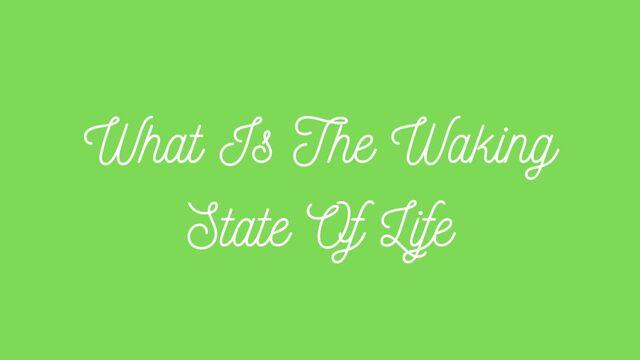{ width="200" }

    ### [What Is The Waking State Of Life?](wiaposts/What-Is-The-Waking-State-Of-Life.md)
    
    **Read time:** 5 min
    
    An exploration of the waking state of life, mindfulness, and the philosophical insights on transitions between states of consciousness and spiritual a

- 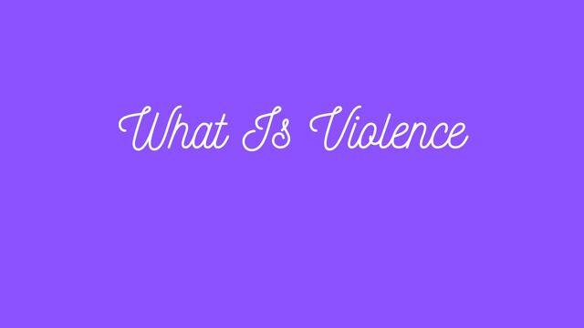{ width="200" }

    ### [What Is Violence](wiaposts/What-Is-Violence.md)
    
    **Read time:** 5 min
    
    Exploring the nature of violence and its ethical implications.
    

- 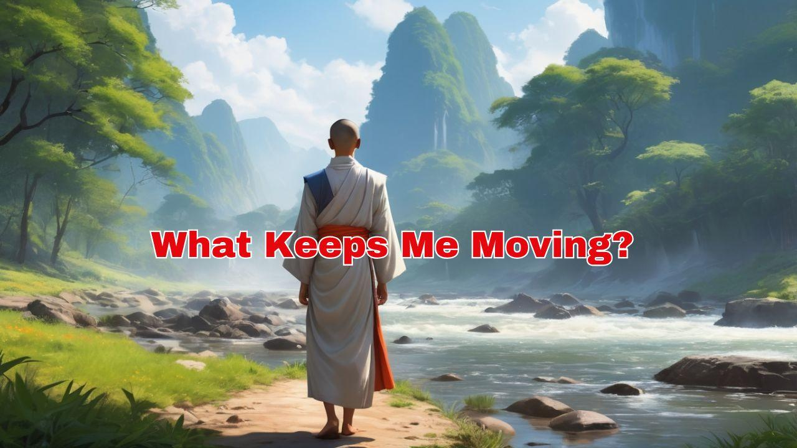{ width="200" }

    ### [What Keeps Me Moving?](wiaposts/What-Keeps-Me-Moving.md)
    
    **Read time:** 5 min
    
    What drives me? What gives me the energy to keep moving forward? In this article, I share what keeps me moving.

- { width="200" }

    ### [What Kind Of Education?](wiaposts/What-Kind-Of-Education.md)
    
    **Read time:** 5 min
    
    Discussing the various approaches to education and their impact on learning.
    

- 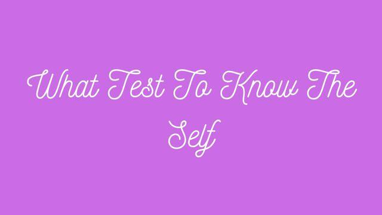{ width="200" }

    ### [What Test To Know The Self?](wiaposts/What-Test-To-Know-The-Self.md)
    
    **Read time:** 5 min
    
    Exploration of self-knowledge, delving into insights on self-awareness and growth.

- { width="200" }

    ### [When To Reincarnate?](wiaposts/When-To-Reincarnate.md)
    
    **Read time:** 5 min
    
    Exploring the philosophical and cultural perspectives on reincarnation.
    

- { width="200" }

    ### [Where Are Todays Rishis](wiaposts/Where-Are-Todays-Rishis.md)
    
    **Read time:** 5 min
    
    A poetic inquiry into the presence and role of Rishis in modern times.

- 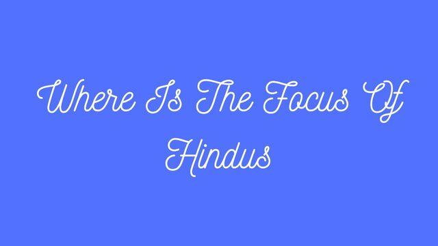{ width="200" }

    ### [Where Is The Focus Of Hindus?](wiaposts/Where-Is-The-Focus-Of-Hindus.md)
    
    **Read time:** 5 min
    
    Examining the cultural and educational priorities within Hindu society.
    

- 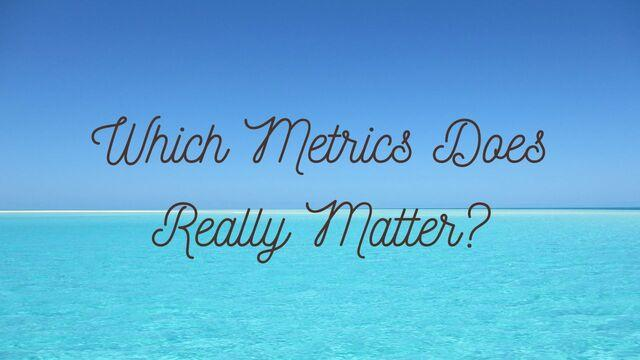{ width="200" }

    ### [Which Metrics Does Really Matter?](wiaposts/Which-Metrics-Does-Really-Matter.md)
    
    **Read time:** 5 min
    
    A philosophical inquiry into the metrics that truly matter in business and life.

- { width="200" }

    ### [Who Is Athiest](wiaposts/Who-Is-Athiest.md)
    
    **Read time:** 7 min
    
    A thoughtful exploration of atheism and the quest for truth.
    

- { width="200" }

    ### [Who Is Guru](wiaposts/Who-Is-Guru.md)
    
    **Read time:** 9 min
    
    An exploration of the role and significance of a Guru in education and culture.

- { width="200" }

    ### [Who Is Ravana?](wiaposts/Who-Is-Ravana.md)
    
    **Read time:** 5 min
    
    Exploring the complex character of Ravana through cultural and philosophical lenses.
    

- { width="200" }

    ### [Who Is Really Sleeping?](wiaposts/Who-Is-Really-Sleeping.md)
    
    **Read time:** 5 min
    
    A philosophical inquiry into awareness and consciousness inspired by the Bhagwat Gita.

- { width="200" }

    ### [Who Is The Best Friend?](wiaposts/Who-Is-The-Best-Friend.md)
    
    **Read time:** 5 min
    
    Exploring the qualities that define a true friend through philosophical insights.
    

- { width="200" }

    ### [Who Is The Creator?](wiaposts/Who-Is-The-Creator.md)
    
    **Read time:** 5 min
    
    A philosophical and poetic exploration of the creator, delving into insights on creation and existence.

- { width="200" }

    ### [Who Is The Doer?](wiaposts/Who-Is-The-Doer.md)
    
    **Read time:** 5 min
    
    A philosophical inquiry into the concept of agency and action.
    

- 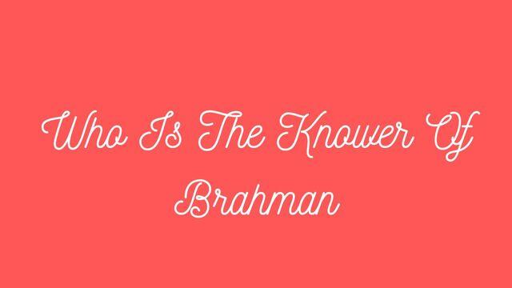{ width="200" }

    ### [Who Is The Knower Of Brahman?](wiaposts/Who-Is-The-Knower-Of-Brahman.md)
    
    **Read time:** 5 min
    
    EXCERPT Not Found

- 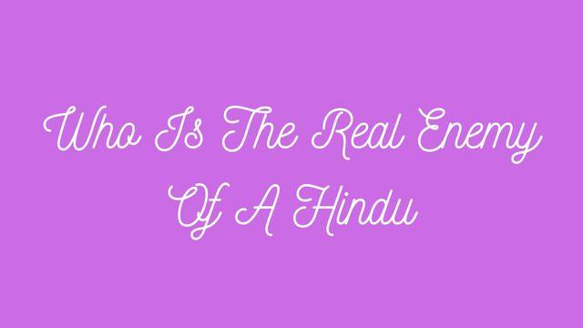{ width="200" }

    ### [Who Is The Real Enemy Of A Hindu](wiaposts/Who-Is-The-Real-Enemy-Of-A-Hindu.md)
    
    **Read time:** 5 min
    
    An analysis of the challenges faced by Hindu society in identifying its true adversaries.
    

- { width="200" }

    ### [Who Killed Tantra](wiaposts/Who-Killed-Tantra.md)
    
    **Read time:** 5 min
    
    Investigating the decline of Tantra in Indian culture and its historical context.

- 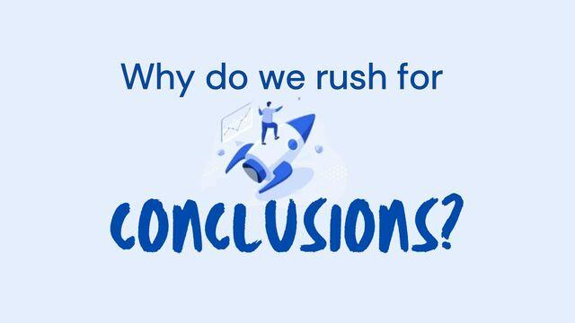{ width="200" }

    ### [The Search for Truth: Why Do We Rush to Conclusions?](wiaposts/Why-do-we-conclude.md)
    
    **Read time:** 5 min
    
    EXCERPT Not Found
    

- 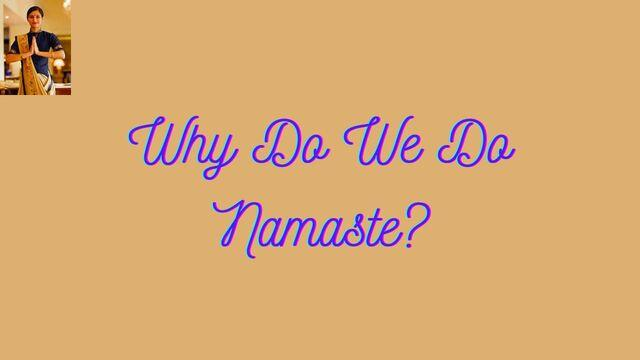{ width="200" }

    ### [Why Do We Do Namaste?](wiaposts/Why-Do-We-Do-Namaste.md)
    
    **Read time:** 5 min
    
    EXCERPT Not Found

- { width="200" }

    ### [Why is life complex?](wiaposts/Why-Is-Life-Complex.md)
    
    **Read time:** 5 min
    
    EXCERPT Not Found
    

- 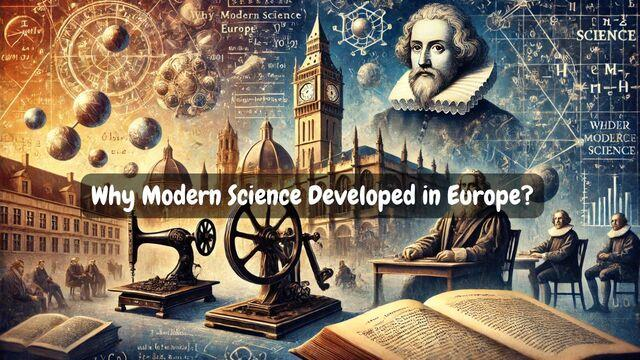{ width="200" }

    ### [Why Modern Science Developed in Europe](wiaposts/Why-Modern-Science-Developed-in-Europe.md)
    
    **Read time:** 5 min
    
    A question that often comes to mind is: Why has scientific progress been so significant in the past 400 years, and why did it primarily take place in 

- { width="200" }

    ### [Why is there conflict in the Society?](wiaposts/Why-there-is-Conflict-in-society.md)
    
    **Read time:** 5 min
    
    EXCERPT Not Found
    

- 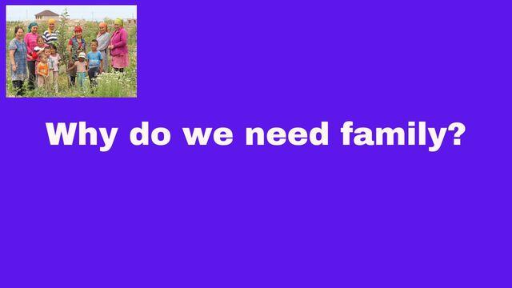{ width="200" }

    ### [Why do we need family?](wiaposts/Why-we-need-family.md)
    
    **Read time:** 5 min
    
    EXCERPT Not Found

- { width="200" }

    ### [World Around](wiaposts/World-Around.md)
    
    **Read time:** 5 min
    
    EXCERPT Not Found
    

- { width="200" }

    ### [You Can Never Speak The Truth](wiaposts/You-Can-Never-Speak-The-Truth.md)
    
    **Read time:** 5 min
    
    EXCERPT Not Found

- 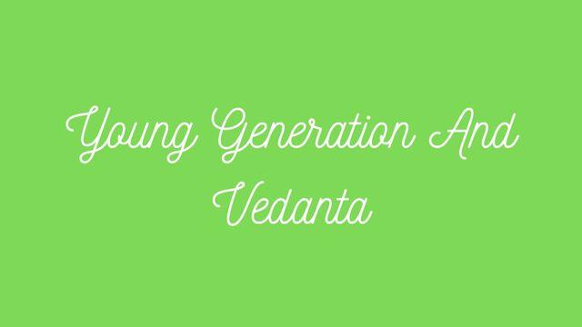{ width="200" }

    ### [Young Generation and Vedanta](wiaposts/Young-Generation-And-Vedanta.md)
    
    **Read time:** 5 min
    
    EXCERPT Not Found
    

- { width="200" }

    ### [Yours Value System and Contradictions](wiaposts/Yours-Value-System-and-Contradictions.md)
    
    **Read time:** 5 min
    
    EXCERPT Not Found

